# 第一课- VIomall平台选品技巧大公开-亚马逊汽配运营 - P1 - VIOMALL - BV1c9szeqEYd

呃，今天的话呢会给大家讲两个类型的主题啊，算是两个类型。一个是关于就是在我们系统啊如何进行一个这个选品啊，就是我们最近有一些很多新的小伙伴啊，假如我们会贸。但他经常会说哎这个东西我怎么我怎么去上架。

我怎么筛选这个产品呢啊，那对于老客们来说，这个他们是轻车熟路啊，简直是得心应手啊，但是对于我们这个新的小伙伴来说啊，可能会有一些困难。啊，可能会有些困难。所以说我呢会呃这个给大家稍微。过一过啊。

这个在咱们系统里面啊，你可以从什么样的角度啊去筛选我们的这个产品啊，就是你去上架啊，从什么地方去选择这些产品去上架，好吧，然后这是第一个方面，然后第二个呢会针对。就是我们已经知道怎么上架。

但是还不知道如何给自己的店铺啊做调价啊，怎么去做这个呃价格策略的小伙伴啊，给给大家一些建议那就比如说。我希望我店铺里面有多少次拿来做做引流啊，什么样的产品适合拿来做引流啊，对吧？还。

就是什么东什么产品啊，适合开始拿来赚钱啊，什么样的产品可以给我带来利润啊，我大概有一些啊不同的什么价格方价格段的产品可以去上架，对吧？然后第三个就是啊这个面向企业买家啊。

我们可以如何去做一些这个特别的定价啊，就我们有个小伙伴说，哎，有一些这个企业买家在我这里买的可多了啊，说我经常遇到一些企业买家，我想给他做一些。这个专门的一些折扣啊，那我怎么才能去做这个折扣呢？啊。

是吧？我们也会有一些这个我们的小伙伴啊，会想要知道怎么去做这个折扣。那我们呢也会给大家这个一起简单的过一过啊，怎么才能做这个折扣，好吧。OK那么我们今天就正式开始我们的一个分享。好吧。

那么我们大家先来我们的第一部分的内容啊，就是我们这个微贸系统里面，我们到底该怎么去选品，怎么去上架。首先大家要知道有一个前提条件是什么？就是。亚马逊啊只允许大家每周上2000个SKO啊。

就是你上满2000个啊，你就上不上去啊，这是对于100万的新店铺来说。啊，当然了，如果你说你店铺这个天赋异禀，对吧？店铺店铺比较天赋异禀啊，比较这个特别啊，那你能够啊突破这个每周2000个的这个限制啊。

哭哭哭往上面上架啊，也是没有问题的对吧？但是一般来说啊就是2000个啊，一般到了后期中后期哈，我们是可以。实现这个2000个团2000个SKO不受限制的这个呃这个思路的啊。

我们是可以实现这个2000个SKO不受限制的这个思路的啊，是完是基本上是没有问题的啊，就是你基本上每周上个。3000个、4000个或者5000个6000个。啊都是可以的啊，就是说当然了这个是中后期了啊。

这个是中后期了，不是前期可以做的事情啊，当然我们也会有一些特例啊，就比如说有一些店铺啊天选天选之子啊，然后这个不会受到养老逊的限制啊，那具体能不能收到呢大家自己去店铺里面看啊。

大家可以自己去自己的店铺里面看啊，你可以呃我跟大家讲一下在哪里看，好吧啊，稍等一下啊。

为大家共享一下，呃，就是如果啊你想知道你店铺会不会受到限制，那首先呢你要在我们平台上架超过2000个SKO对吧？然后你来到哪里？你来到这个菜单啊，菜单里面，然后这里有一个这个目录啊。

目录里面有一个补全您的草稿啊，补全您的草稿，然后在这个里面呢，他就会提你就会看到啊，就是你上架的这些SKU有没有受到亚马逊官方的限制。

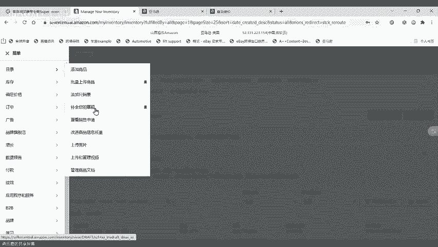

啊，有没有受到亚马逊官方限制？如果说啊你这个上架的SKO啊受到了这个亚马逊官方的限制，那他就会啊大家可以看一下，就会像我这个里面提示一样啊，就是你已经达到每周新建A险的一个数目的上限啊。

如果你要像什么什么啊，像这一种提示，就是什么？就是你已经啊超过了每周受上上架的限制啊，就没有办法再上架了啊，没有办法再上架，你就只能等啊这个确实是只能等啊，只能等到下一周啊，比如说下周一下周二的时候。

再重新把你之前没有上架成功的产品样重新给它挖出来，然后去上架。

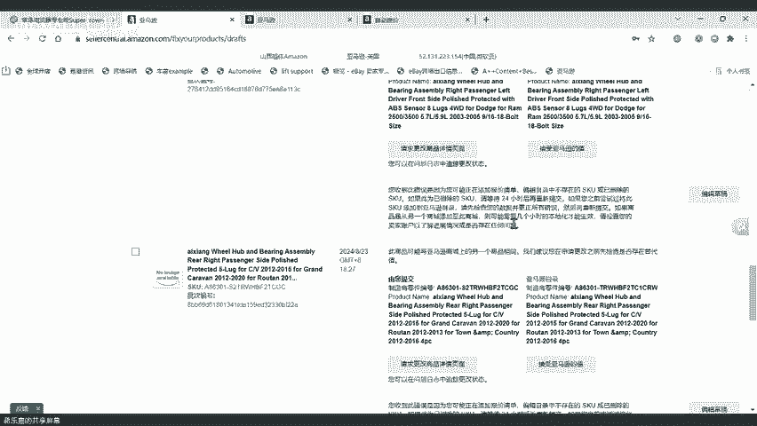

啊，只能这样子啊，还有一种就是你可以去找亚马逊开case啊，你可以去联系亚马，一般多久的店铺就不会限制，没有没有不不官方非正式的说法。没有这没有这种，这个没有统计的那个小老龙，这个是没有统计的啊。

你你问的这个问题，我们很多分销商都非常关注啊，但是以我个人的经历来看的话呢啊一般就是呃每周保持上架啊，上架到大概在你每周都保持上架的话，大概上架到2万到3万的时候，可能差不多就是两个月以后啊。

三个月以后可能就会突破这个限制。然后其他的时候的话呢，就只能够怎么样，其他的时候就只能够找到亚马逊的官方去开case啊，就你可以去开一个英文case。我建议大家不要去开中文case啊。

中文case没什么用的。好吧，这里我也是不是说我故意去黑这个呃黑我们自己的中文团队客服啊，是真没啥用啊，我们中文的case呃，蒋老实话，有跟没有一样啊，就你问他什么，他都只会告诉你啊。

这个你可以参考我们什么什么的链接啊，参考我们官方什么什么什么内容。我的上个月每现在一周上7K都有这个呃，你说的这个问题是一个共性啊，就是呃那个小乐宝，你说的这个问题就是怎么说呢？

就是我们现在就是最新从大概从上周上周开始。啊，就我们最新很多的我们的这个分销商啊，我们的小伙伴都说啊，我这个原本不受限制，现在都受限制是的啊，有一批有一批店铺啊，目前来说也会受到限制。

包括我现在给大家展示的这个呃店铺啊，我现在给大家展示的这个店铺也被受限了啊，就之前都不受限呢啊，现在也被受限了，那没办法啊，这个只能够说你去就像我刚刚说，你去找到亚马逊的英文客服团队啊。

注意一定是英文客服团队啊，就你可以大大概晚上啊，你就算了啊，美国的时间，美国时间呢早上9点10点啊，到下午三四点左右啊，但大概对于我们什么时间段啊，你去看英文的在线客服啊，跟他沟通。

就说我是做这个呃汽车配件的啊，是吧？我有很多的这个A选很多的SKO啊，因为这个配件涉及到专职专用啊，我有很多很多品类在做啊，但是亚马逊呢这个呃每周只能受受到限制啊，我只能上架2000个。

我觉得这个可能对我这个呃做我这个品类的来说就不合适啊，能不能。

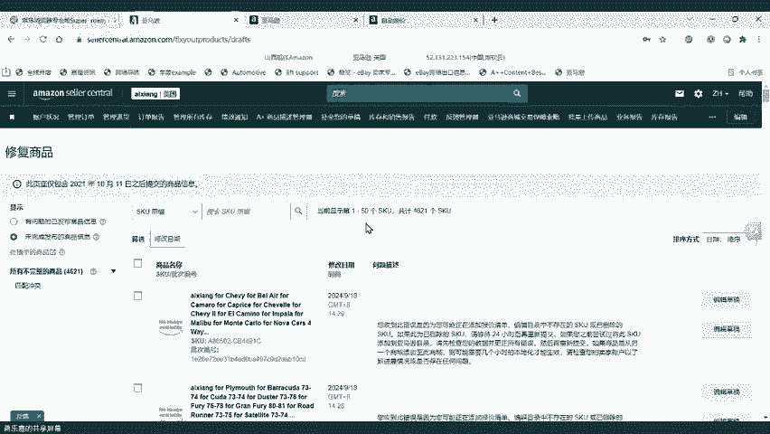

帮我开通一下这个啊每周上架2000个的这个限制啊，你可以去问一下，去沟通一下。如果他跟你说不行啊，那你就换一个客服嘛，是不是你可以找两三个客服啊，然后你如果这两三个客服都不行。

那你再开再写一两封英文的邮件的这个呃这个这个申请啊，发给这个英文团队的客服啊，给给他们来问问他们啊，能不能帮我开这个，如果他们是也说不行，那确实就是没办法好吧，那你就只能等只能等啊，但是呃能够成功啊。

我先跟大家讲这个有成功的概率性啊，有成功的概率性，不是说百分百啊，但是确实是有成功的可能性的啊，确实是有成功的可能性所以说大家我是建议大家啊都可以去尝试尝试是吧？你大家都可以去尝试尝试。

不用呃不是说啊我那个只有一点成功，或者说啊那个没什么人成功就不行啊，大家可以去尝试尝试。因为每个每个人的店铺啊，这个命运不一样是吧？每个人的店铺命运不一样啊，所以说啊我是建议大家去尝试尝试。好吧。

OK这个是跟大家讲的。然后现在呢就跟大家讲一下啊，就是说呃你每周上架完2000个之后啊，那你就肯定涉及到选品，是不是那选品怎么选呢啊？那我这里呢就跟大家一起来过一遍啊，大概简单的过一下。啊。

你可以从什么什么地方去选品啊，那你刚假如说你现在刚开始接触到我们啊，你说我想要啊选择一些啊流量比较好的一些这个SKO啊，我想要有一些能够转化的SKO啊。

那我建议大家啊从我们平台这个挖宝促销里面去选择产品去上架啊，我建议大家从我们平台的挖宝促销里面去选择去上架啊，就在我们的选品，然后第一个挖宝促销但是挖宝呢是要报什么是要报名的啊，每个月1000积分啊。

每个月1000积分，如果你是一个新分销商，你在前期啊4到6周就是从一开始上架到一个半月的时候，你可以这个挖宝上架啊，上个8000到12000个SKO啊，你可以上3000个低价的啊。

上这个3000个这个中价的，就然后剩下的全部上些高价。因为挖宝里面的产品都是售后比较有保障啊，然后这个转化比较有比较优质的啊，一定是产生过销售的啊，才会进我们的挖宝，而且挖宝。好处是什嘛？

就是它可以产生抵扣。啊，就是挖宝这个产挖宝这个里面的产品呢，它是可以抵扣的啊，就是用我们平台的积分啊去做一些抵扣，然后可以把它变成钱返回到你的账户啊。所以说挖宝促销是我建议分新的分销商啊。

第一个优先考虑的啊，优先考虑的。然后这个。大家可以看一下啊，这个图里面啊，它是有不同的积分抵扣的。然后但是现在挖宝呢，它是有一个这个更新点啊，跟以前不同，就是他现在每天。啊。

都会对之前的SKO做一些调整啊，现在挖宝呢会每天对之前的SKO做一些调整啊，可能这个里面就会涉及到一些什么问题啊，涉及到说啊你昨天这个产品还是可以抵扣的啊，可能今天就抵扣不了了啊。

可能会有这样子的情况啊，因为我们针对挖宝呢，我们也是可以做很多这个多面化的运营的，是不是就比如说啊给挖宝单独开广告啊，是吧？比如说给挖宝在价格上面有一些这个呃吸引力啊，是吧？比如说这个在挖宝上面啊。

我给这个挖宝做一些这个不同的梯度的一些促销啊是吧？啊，这个反正就是它里面会有很多种多样的一种运营的方式和手段啊，所以说如果说我们的分销商啊，自己有一些运营的思路在里面啊，那你一定要注意了啊。

如果你参加了挖宝啊，你可能要偶尔去看一看你的这个产品啊，就是它是不是还是可以抵扣。就比如说啊你知道有一些SKO，它可能是可以抵扣的啊，但是他现在抵扣不了了。那你说你要这个清单呢。

话如果说你想要通过清单快速的了解你的SKO啊，哪些是可以抵扣，哪些不可以抵扣的话啊，那你也可以直接找我啊，你可以找我啊，这个联系我啊，我姓蒋啊，蒋乐家啊，我姓蒋，我叫蒋乐嘉啊。

你在那个我们的微贸群里面都可以看到我的名字，好吧。你也可以直接联系我啊，你我可以给你清单，好吧啊，所以这里我再跟大家提一准啊，就是挖宝一定要先报名才能够获得奖励啊。就是比如说这个SKO100块啊。

可以抵扣30%，对吧？那你一定要先报名，有这个报名之后才有这个兑换的机会啊，你出单品之后你才可以拿去兑换。好吧，这这是我第一个推荐的啊，就是大家可以在挖宝里面去选择SKU去上架啊，选择SKU去上架。

然后第二个啊第二个阶段就是说如果说我们的分销商啊，这个从挖宝里面上架完了之后啊，第二个阶段大家可以从哪里去上架呢？啊，第二个阶段大家可以通过这个呃稍等一下，我给大家共享一下我的屏幕。啊。

我给大家共享一下我的屏幕啊呃，我们现在来到了我们的系统，对吧？我刚刚说了嘛，第一个啊这个挖宝挖宝促销啊，第二个我推荐大家，你可以呃如果你是一个新的分销商啊，你可以选择从我们的这个赏金猎人里面去上架啊。

这个是我没有增加的啊，之前的内容没有增加了，但是我觉得它是一个非常好的一个活动啊，虽然它散猎人已经改过了一些版本了啊，虽然说我们现在赏猎人确实可能是对比之前啊，它的这个折扣啊，或者是它的活动啊啊。

对比之前有一些变化，有一些调整啊，但是它现在依然是保持有吸引力的。啊，依然是保持有吸力的。然后这里呢我给大家简单的啊过一下这个赏金猎人啊，过一下赏猎人啊，这个好慢。你听你哋咩。啊，没关系。

那我们先讲别的啊，我们先讲优惠券中心啊，我们我们也可以从优惠券中心里面啊去上架我们的产品啊，优惠券中心啊，也是在我们的这个呃全品里面啊，这里有一个。啊，在我们的营销啊营销里面有一个优惠券中心。

然后在这个优惠券中心里面呢啊它会有一些不同的这个活动。然后这个活动里面呢，这个可能会有一些啊比较有优势的一些啊，比如说可以兑换多少多少次的一些这样子的机会啊，这个也是相当于是什么？

相当于是让大家啊去有这个机会做抵扣的。但是优惠券中心里面的这个券呢啊，它可能不同的活动，它有一些要求和限制。就比如说还要求你啊必须要达到多少多少的SKU啊，你才能用这个券。

或者说你必须要啊这个价格的倍数要调整到什么什么阶段啊，比如说调整到1。2倍，调整到1。5倍啊，你卖出去之后，你才能用这个券啊，所以说他会有一些不同的要求。那针对这种情况呢。

我的建议就是啊分销商可以根据自己的实际情况，就是我到底啊需不需要或者说我到底要不要用到这个东西。我来我决定我自己啊，我决定我自己要不要啊用到这个这个这个这个机会啊，所以说。这个这个得根据自己的情况啊。

这个跟得得根据自己的情况。啊，所以说我个人建议的话啊我个人建议就是分销商可以根据自己的实际情况啊，找一些啊有比较多次数的啊，找一些有比较多次数的啊，找一些有比较多次数，然后又怎么样。

然后又没有那么多上架要求的这个呃。这个什么这个活动去上架啊，找一些这样子的类型的啊，我现在看能不能打得开了。啊，还打不开。啊，那是啊还打不开。但是简单来说就是优惠券里面啊。

大家一定要去看一看自己有没有合适的。比如说啊可以抵扣几次，最近有什么营销活动吗？什么啊，最近有什么营销活动？最近什么什么没最近营销活动啊，营销活动参加一下来我们的平台的活动就可以了啊。

那个想要有一些营销活动可以去直接参加我们平台活动。啊，我像我刚刚讲的这个什么挖宝啊，优惠券啊，大家可以看啊，我现在打开优惠券，然后在优惠券里面啊，大家可以看到它会有不同不同的抵扣。

像比如说多的有50%的抵扣啊，70%百分之百的都有。

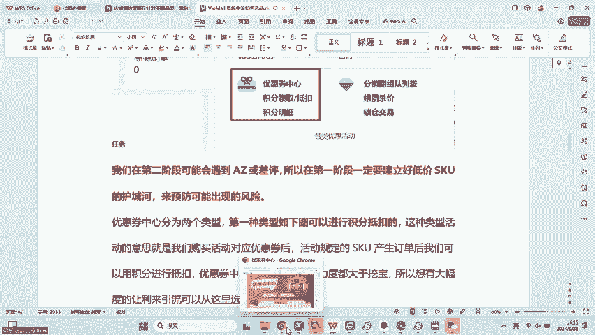

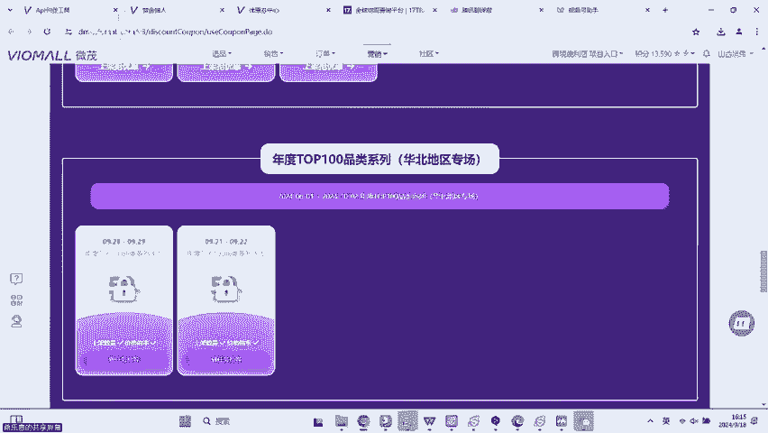

要是少的可能有20%30%的抵扣。但他一定是有抵扣的，并且他有一个什么？他有一个可以兑换的次数啊，大家就去找那些啊对对你来说比较有优势的一些。就比如说啊这个可以兑换5次啊，兑换5次。

然后这个可以这个什么啊，这个上架要求5000个。如果说。这个兑换5次，然后上架5000个，然后你的这个活动的SK这里已经有3000个了啊，那你就只要再上000个，你就可以去参加了。那像这种的话。

我觉得就还是比较不错的啊。当然了，你要看它的时间啊，各位各位啊，我还是话大家要看它的时间。像比如说这个活动时间啊，到9月8号就截止。那你说都已经截止的那那就没有什么没有什么必要，对不对？但是像这种啊。

大家可以再看看这种啊，这个也是要求大家要上架5000个啊，然后大家看一看，那像比如说我我我可能这里已经我假如这里不是5500个，我这里是4500个，那我只要再上500个，那我就会选择立刻把它上架。

然后我就参加这个兑换，反正大家就记住啊，优先选那种抵扣高的啊，就这里抵扣高的，至少30%以上，然后这里最好没有什么上架要求，也没有什么销售倍数要求的啊，然后第三个就是兑换次数多的啊。

就是说比如说兑换5次啊啊，10次啊，20次啊啊，当然了有一种那种兑换一次两次那那这个这个就看你自己考虑了啊。啊，当因为那种兑换一次两次，如果他是百分百抵扣兑换的话，还是可以考虑的啊。

还是可以考虑这个拿下的啊，还是可以考虑拿下的。然后第二种啊，大大家继续看啊，这里SKU啊，就是他如果没有SKU限制，这种是最好的。如果说有SKU限制，但是啊你很快就能达到也可以。但是如果有一种。

比如说要求你这个上满2500个，35000的这种。然后你自己这里才上1000个啊，那这种你就要自己去考虑一下，有没有必要去参加啊，不是说所有的活动都一定要参加的是吧？你你要根据自己的实际情况啊。

对你来说啊，确实比较有帮助啊，能够比较快的啊，这个上架成功，能够参加活动，那你就去玩，是吧？还有就是第还有一个大家要关注的一个点就是什么？还有一个大家要关注的点就是要关注他的活动时间开始和结束啊。

有一些活动是比如说啊今明两天或者说周六日两天啊，有一些活动是从啊比如说这个9月20号啊，到10月20号这种时间比较长的那像这种时间比较长的，也是属于啊比较优质的活动。

为什么因为它不会让你涉及到频繁去调价，知道吧？啊，他不会让你频涉及到频繁去调价，因为频繁调价，对自己的店铺的这个呃，我觉得不管从这个销售的角度来说，还是从安全性的角度来说都不算很好啊。

能不能能能够长时间一点啊，做一次调价是比较好的。啊，能够长时间做一次调价是比较好的啊。然后大家如果要选择优微信中心的去上架的话呢啊你就只需要点进来啊，点进来之后。啊，然后在这里有一个刊登啊。

你可以选择批量刊登啊，你也可以选择什么？你也可以选择下载清单啊，这里有一个下载清单，你也可以选择把这个清单下下来之后啊，自己去挑选一下。比如说我想卖一些贵的啊，我想卖一些便宜的啊。

比如说我想卖一些这个什么品类啊，你可以自己去挑选一下，然后去上架，知道吧？啊后大家可以自己去挑选一下。

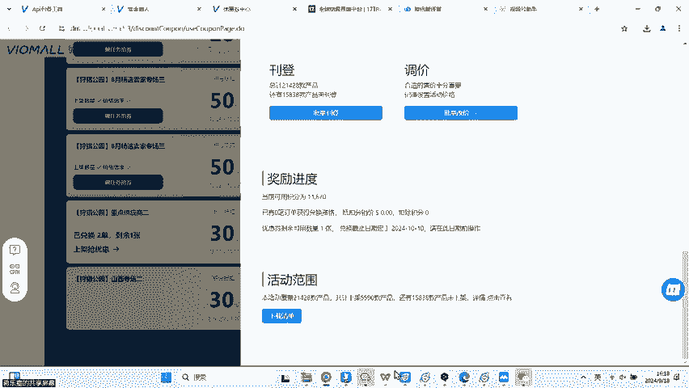

那家可以自己去挑选一下，然后去上架，知道吧？所以说这个是比较怎么样？这个是比较多样多样化选择的啊，这个是比较多样化选择。然后这个我我们在运营了一段时间之后，可能会遇到什么AZ或者差评啊。

所以说我们在第一阶段啊，就我刚刚说的大家最前期上架的时候，这个阶段啊，一定要建立好低价SKU的护城河来预防可能出现的风险。什么意思呢？就是大家在上架的时候啊，不要只上高价的产品啊。

我们有一些分销商他说哎我只想上高价的啊，赚的多是吧？我每个赚20%啊，我这个一个月赚几千美金啊，这个笑嘻嘻是吧？但是大家注意我们在运营的过程中可能会有差评啊，可能会有AZ这种如果说你只卖高价的。

你一个月卖不出去啊，几百单啊，那如果说你遇到差评的话，怎么样那可能就店铺就挂了啊，就丢购物车，这个是很正常的一个现象。所以说大家不要盲目的追求高价的产品啊，一定要让自己的店铺怎么样有一些合理性在里面啊。

有一些合理性在里面啊，一定要在第一阶段。就要有几千个这个SKO怎么样啊，能够为你抗风险啊，一定要在第一阶段的时候，就有一些SKO啊，能够为我们自己的店铺扛风险。那我们店铺啊即便是遇到了一些AZ啊啊。

遇到了一些差评，也能够怎么样也能够这个这个挺过去啊，所以说不要盲目追求了高价值的SKO啊，你你可以上高价的，但是你低价的也要也一定要有啊，你低价的产SKO也一定要有有很多分销商他会问啊。

那我低价好像要有多少才合适呢。啊，那我给给大家的一个建议的话，就是啊你最少要有这个几千个啊30块钱以下的SKO啊，去给你做这个哪怕是你遇到了一些这个这个比如说AJ啊，或者说遇到了一些差评。

导致你的这个啊订单缺陷率超标了啊，那你也可以把这些产品拿去做降价啊，这样子去处理啊，这样子能够快速的得到转化，然后把你这个ODR，就是这个订单缺陷给扛过去，知道吧？啊，所以说你一定要去这个一定要去这个。

上一些低价的产品，好吧，然后优券中心的产品啊，就我刚刚跟大家分享这个优券中心啊，里面的这个呃SKU呢它分为两种类型，有一种。

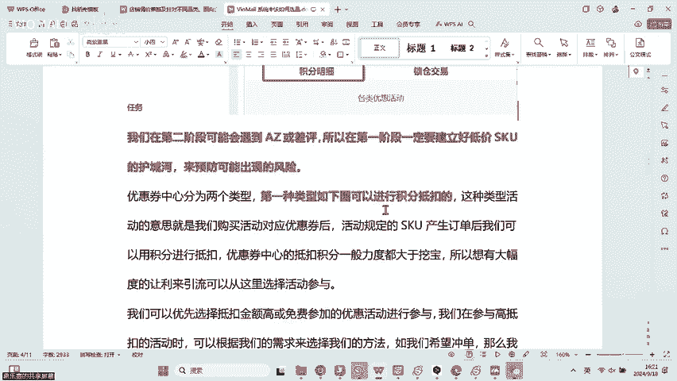

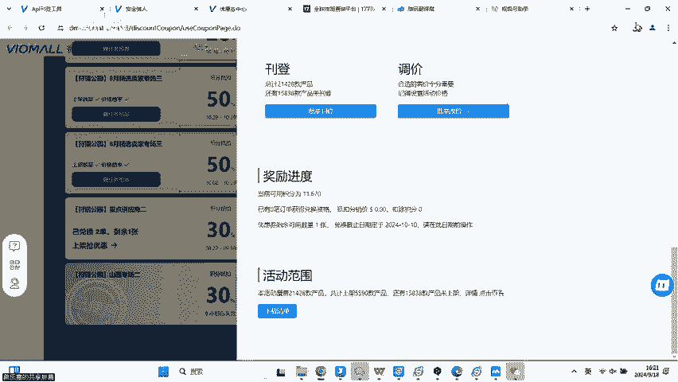

有一种呢它是属于啊这个有一种它是属于可以抵扣的啊，就是给我们返钱的啊，这种就是产生销售以后啊，我们的SQO啊可以用对应多少，然后给我们返返回我们的钱来。然后另外一种呢啊，大家可以看到啊。

这里面这种就是可以抵扣的啊，就是你只要产生销售了之后，你就可以拿积分去啊，根据这个词情况啊，去做多少多少对应的抵扣。然后另外一种呢就是可以赚积分的啊，大家可以看一下，就是下面这种啊几百倍几百倍这种啊。

这种的话呢，它就是可以。产生销售以后啊，然后给你返回多少积分啊，因为在我们平台的规则下面啊，就在正常的奖励模式下，我们是每产生40美金的销售啊，可以得到积分。如果活动像比如说我这个这个截图的这个例子。

对吧？这个活动它是200倍积分，那我们就是每产生一美金的销售啊，我们就可以得到5积分的奖励啊，所以说通过这个活动我们就可以赚取什么高倍数赚大量的积分啊，就比如说你卖了100块钱，对不对？

然后这个活动是200倍的，那你就是1乘100乘以5啊，就是500分，然后500分，你再拿去做抵扣的话，就等于是25美金。啊，所以说活动有的时候啊大家自己去衡量，就是当1个SKU既可以赚抵扣。

又可以赚积分的时候，你要去衡量它对你来说到底是赚积分获得的利益大啊，还是这个赚这个抵扣得来的收益大啊，不是说一定全部都拿去赚抵扣，就一定全是这个赚到的啊，才才是收益最大化啊。

这个你得根据他能够对应的活动啊，自己去算一算。啊，自己去算一算啊，但是一般情况下我们都是赚抵扣啊，一般情况下都是赚抵扣的啊，因为还有一个情况是什么？就是很多很多可能需要涉及到什么。

很多可能需要涉及到这个呃抵扣的。很多可能需要涉及到抵扣的SKO怎么样？很多可能涉及需很多可能需要涉及到抵扣的SKO它是要用引用积分去买的。就是你得先提前去买。但是很多这种奖励积分倍数的，它是免费的啊。

所以说你得自己去看看啊，就是你想不想发费你，如果你想免费的啊，然后这个那你就可能更多的就是参与这种奖励积分的啊。如果你说。我对我自己的定价，我对我自己的营销的手段很自信。

我相信我能我相我本来店铺里面就有一些比较好出单的这个底子在啊，那你就可以大胆的去买这个积分抵扣的活动，然后去这个去做一些对应的这个销售啊就可以了啊。所以说这个里面啊大家得根据自己的实际情况。

你得看看你自己的店铺啊，到底是哪一种更合适，到底是哪一种更合适。好吧，然后第三个啊就是说第三个我们平台啊能够给大家带来这个呃。

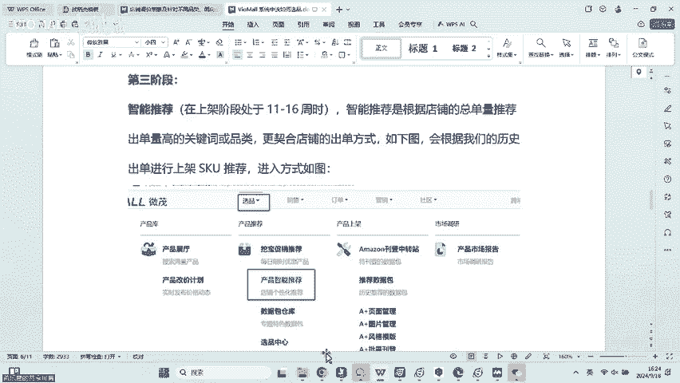

销售啊，但就是大家如果要上架，可以从什么地方选择啊，就是第三个的话，就是大大家可以从这个赏金猎人里面去选择啊，赏金猎人里面去选择。然后这个赏金猎人里面呢，它又分为四种类型，第一个是售后险啊。

第二个是上新品多积分啊，第三个是抢手单立减啊，第四个就是这个抢免赔啊，这个每个活动我大概给大家过一下啊，不用不用讲多了。因为我之前有讲过很详细的啊，之前讲过很详细的。

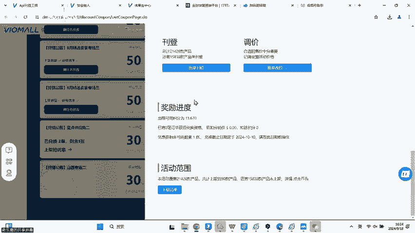

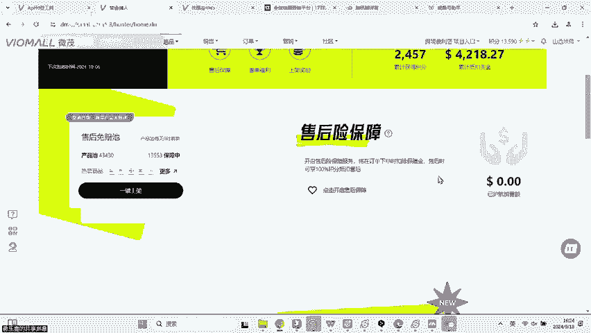

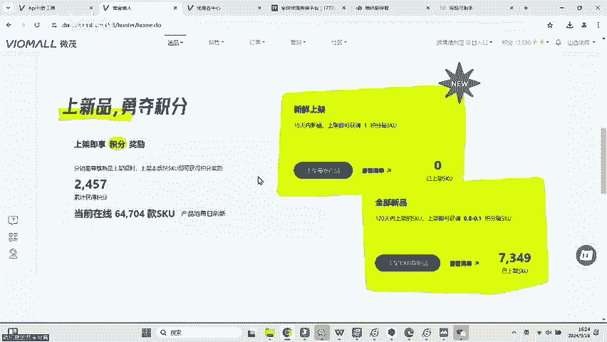

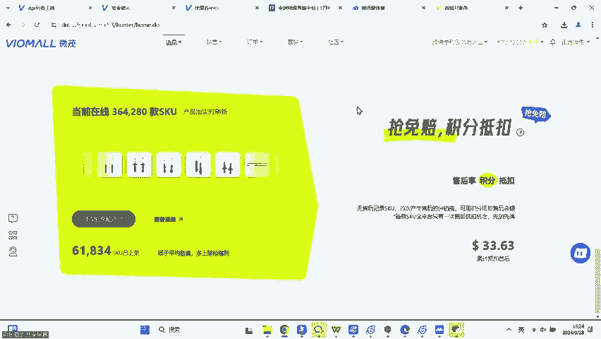

这个售后免赔呢，就是说啊你只要这个在这里看到没有？这里有个小红心，你如果开了之后啊，如果你销售出去的SKO是这个里面这个清单里面的SKO那你如果产生了售后之后，平台可以给你赔回来啊。

平台给你可以给你赔付啊，平台可以给你赔付而而且赔付的话呢，是百分百赔付给你的啊，百分百赔付给你的。然后但是这个销售出去啊，你平台是要收取你一定积分作为这个运费险的一个保障的啊。

一般来说浮动都在2%到8%啊，具体什么，那得看SKO啊，具体多少得看SKO啊。所以说如果你经常产生销售啊，产生售后啊，然后他的SQ都在这个这个这个清单里面啊，那你可以考虑开。如果说你扣的这个积分啊。

还不如你去这个售后保障的得到的积分，那你可以不开啊，把它关掉。然后第二个就是这个上新品啊，这个就是很简单，这个就是你只要上架了之后就会得积分。然后这个积分的这个呃奖励的话，是从0点1分到1分之间不等啊。

就是说你他就是说你会根据SKU的类型，我们平台给他设定的一个类型啊，你每上架一个呃得到0点1分啊，到一分之间啊，它会有一个不同的一个呃这个。

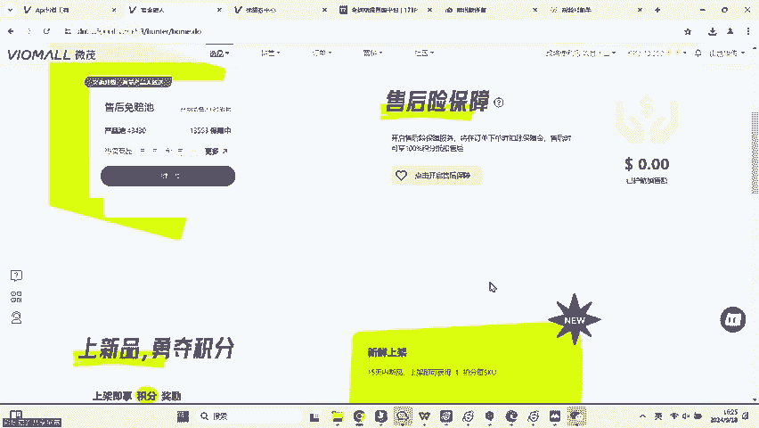

区间值给到大家啊，他会有一个不同的区间值。那具体是多少呢？大家可以自己去看啊，大家可以自己去看一看啊，就是这个它不是固定的啊，它这个它不是这固定的。但是在这里啊在这里的话呢，他你只要点这个上架最新的话。

就一定是一积分啊。在这里面你只要上架就一定是一积分啊。所以说啊大家可以自己去了解。但是我我是建议大家可以去就是新分销商还是不用以这个为主啊，我建议大家新分销商以这个为主啊，就是这个抢手单立减25%啊。

这个可能玩过的小伙伴都知道啊，这个已经经历过很多次改革了啊，这个已经经历是很多经历过很多次改革了啊，这个的话呢就是呃你只要销售出去，这些SKO啊，就可以获得什么，就可以获得这些立减啊。

就是相当于就是说你只要销售出去啊，就可以拿这个回去做抵扣啊，就可以拿这个回去做抵扣。我们前期有很多分销商靠这个怎么样靠这个薅到了很多大的羊毛啊，大家可以看一下，就以我这个店铺为例子啊。

薅了4000多美金啊，耗了4000多美金，这个这个力度非常大啊，这个力度非常大。而且只要你出单之后就可以抵扣啊。当然了，你这个是全平台第一个出单啊，只有一个人可以获得这个奖励啊。

就我们整个平台可以只有一个人可以获得这个奖励啊。这个的话呢就可能是有一些运气的成本在里面啊，但是我是建议大家拿这个这个因为他毕竟里面啊活动一直都在，并且他的SKU设计面非常广。

我是建议大家可以去玩这个活动啊，可以去玩这个活动。因为他可以给我们带来引流啊，就是我们可以针对这个赏金猎人专门设计一套的嘛，专门设计一套玩法去玩啊，所以说他会给我们带来一个比较大的收益啊。

就是我们可以专门根据这个因为他这个里面有25%抵扣嘛。那25%的话，就相当于我拿货的成本价是一倍啊，就大概是一倍左右啊，就因为根据平台的这个规则的话，大概是呃打了0。125的折啊。

那就相当于是我的成本价是0。995啊，0。995就大概算一倍啊，就是我把那个佣金给省下来了啊，我把佣金给省下来。如果你是一个新店铺，还不收佣金的话，那就相当于你的店铺怎么样？

相当于你的店铺的成本价只有0。90。88啊，0。88。所以说这个是非常有优势的一个活动啊，特别是针对新店铺用免佣金的情况下啊，你的成本价只有0。88啊。

那你就可以根据这些啊不同的梯度的SKU啊设计一些不同的活动。啊，涉及一些不同的一些这个推广的方式是吧？所以说这个还是比较有优势。然后第四个就是抢免赔啊，强免赔啊，这个强免赔的话呢就是积分抵扣啊。

就是说这个什么意思呢？就是全平台没有产生过售后或者SKO如果很不凑巧，你是第一个产生售后的啊。那我们平台啊是可以给你进行一个什么进行一个免赔的啊，这个免赔的比例呢比例呢在30%到80%。

它就不像我们第一个售后免赔啊，售后免赔是不管你出现过多少次售后啊，平台都可以给你按百分之百给你赔回来，但是你得交积分。然后这个的话呢就仅限啊第一个出现售后的这个分销商啊，可以去抢这个免赔。

但是它的好处就是你不用交积分啊，不用交积分。但是它的另外一个特点呢，就是它的赔付的波动是在30%到80%之间啊，它不是百分百啊，它不是百分百，并且只有第一个人才可以获得啊。我在这里跟大家讲一下。

这个赏金猎人是需要报名的啊，这个我们。

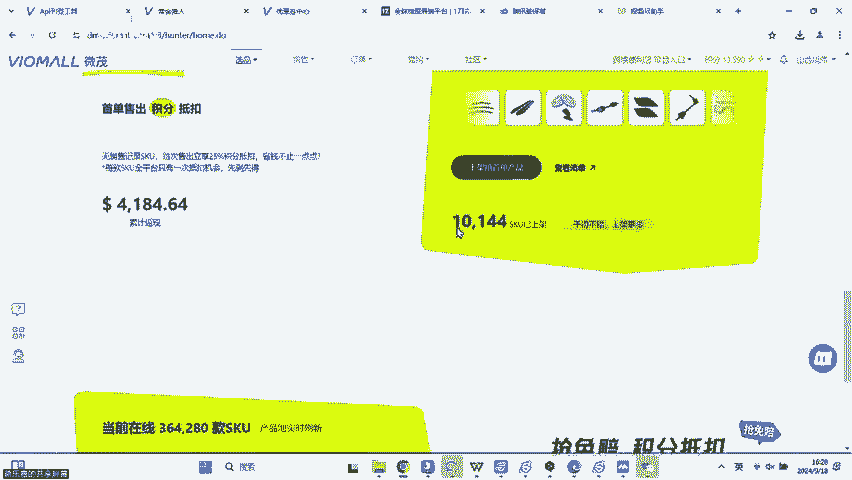

多分销商都知道。但是我们如果有新的小伙伴，你今天在听的话，那我要告诉你啊，我们这个新的这个我们这个赏店这个活动啊，它是需要报名的啊，它是需要报名的。然后每个月也是1000积分啊，每个月也是000积分。

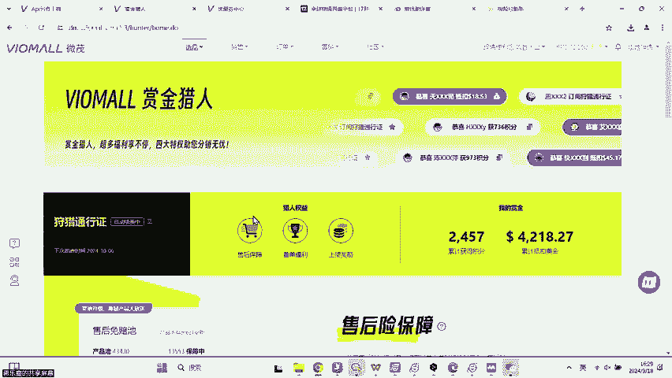

好吧，这是我们第三个可以让大家去获得上架的一个渠道。然后第四个就是我们的这个呃什么地方可以去上架呢？第四个就是我们的这个选品里面啊，有一个智能推荐啊，产品有一个里面有个智能推荐，但是这个产品智能推荐呢。

它就是根据你历史出单的一些机那个这个规轨迹啊，它会根据你历史出单的一些规则，然后给你怎么呀，然后给你推荐一些什么给你推荐一些啊适合你店铺的这个SKU的品类SKU的清单给你。

然后让你去怎么样让你直接去上架，然后我们可以直接在这一点为我推荐一些啊，当然了，我这里要跟大家讲一下，就是这个智能推荐，它不适合什么它不适合我们很多这个新分销商。为什么因为它是根据我们的这个历史出单。

它有一些这个什么算法在里面了。如果你出单的量太少了啊，比较低。那那几乎就没有什么没有什么参考性啊，那可能推推荐出单的这个SKU就不准啊，可能推荐出单的SKU就不准，那对于我们来讲。

就没有什么没有什么太大的意义，知道吧？没有什么太大的意义。所以说啊我们的新标商如果你没怎么出过单啊，你没怎准没怎么出过单，我是不建议你去玩这个的啊，我是不建议你自去玩这个的。

因为出来的这个推荐的盘SQ不准啊，我觉得对你来说没什么意义啊，对你没对你来说没什么意义。然后并且啊并且我们在筛选完了之后啊，比如说我现在筛选完了之后，我们还可以点击什么？我们还可以点击统计数据啊。

看一些统计的历史数据，帮助我们分析我们想要上架的。就比如说啊这个里面它会有一个平均的退款率啊啊，平均到货的一个物流的一个时效啊，还有销售的等级啊，库存的等级啊，这个新数越高就代表比如说我拿这个举例子啊。

这个库存等级就是新数越多，就代表它的库存等级越高，就它的货越多。然后这个销售等级的话呢，就是啊这个它产生动销的一个这个状态比。然后这里有一个代理人数的话呢，就是啊最高啊那个SQU代理的人有多少多少人。

然后平均啊就这个数据包里面平均SKO算下来啊，平均的代理人数有多少，换句话说就是如果说平均的代理人数越多，就代表这个数据包里面SK怎么样越卷啊，就可能上架的人越多嘛。然后大家可能就是要打到价格站啊啊。

或者是什么啊，所以说如果说代理人数越少啊，然后这个代理人数最大化的越。比越小的话呢，就代表这个这个这些SKU可能是比较冷门的。啊，可能是比较冷门的，就很适合我们这个想要去做冷门产品的分销商去上架嘛。

对不对啊？所以说这个是这个我要跟大家讲一下这个智能推荐啊，这个大家要自己去想好啊，要不要去上要不要去用这个，反正新分销商不要去用啊，反正新分销商不要去用。然后第4个啊，我们可以从哪里去上架呢？啊。

第四个我也给大家讲一下，我们可以从哪里去上架。第四个我们就可以从我们的什么，从我们的这个。数据包仓库啊，数据包仓库啊，这也是在我们选品里面啊，这里有个数据包仓库。然后这个数据包仓库呢。

你就可以根据你自己的一些选择啊，根据大家可以根据自己的选择。就比如说这上面有一些什么新品推荐啊啊，什么多少多少钱啊，多少多少钱。然后这这个你也可以根据价格，就比如说我想上一些什么。

我想上一些这个什么避震啊，那我可能就要在我在这里输避震啊，我在这里输B震，然后搜索啊，可能没有，他可能要输英文。啊，可能要输英文啊，那我现在这里输B证的英文。然后在这里啊，大家看到没有？

这里面就会有一些什么，有一些避震给到大家，然后你就可以点进去，我随便点一个啊，我只是做演示，我只是做演示啊，大家可以自己在这里啊，随便点一个啊，然后你就等啊，你就等他这个出现。然后在这里面呢。

它会有一些什么啊，这里我要跟大家讲，这里有特别是新分销商，老分销商肯定不会翻这个车啊，老分销商肯定不会翻这个车，新分销商一定不要去点这个数据包购买啊，这个数据包购买，点一点就300块啊。

点一下就300块啊，你如果点了的话啊，你点了这个什么确认购买，点了同意，你就是300美已金就没了啊。当然了这个可以退回来啊，这个这个是我们之前遗留下来的一个啊，你不要去点。啊，这里不是有人这个列表嘛？

你直接复制或者说批量上架就可以了，是吧？然后这我怎么卡来，我去然后这这这里啊，这里大家可以看到它还是有一些数据啊给到我们这里还是有一些这个可以统计的数据给到我们啊，大家可以根据自己去研究一下啊。

比如说这里有品类分布啊，仓库啊，价格车型啊啊，因为我们有些分不是想看一下这些细分的项嘛是吧？你可以自己点进去看一看啊，你可以自己点进去看一看。好吧，然后这个是我们的数据包仓库啊。

这个是这个是第四个阶段啊，就你如果不知道从哪里去选品上架，你可以从这里面去上架好吧，然后里面呢也会有一些这个呃不同的一些这个优质的这个数据包给到大家啊，就像我刚刚讲的啊，它这里面会有一些啊不同的类型。

那比如说我想根据价格我就我比如说我想上一些便宜的啊，低价引流的那我可以输引流两个字，对不对？我点搜索啊，然后这看到没有？它这里就会有什么，那你就会有引流款的一些数据包推荐。

然后每个数据包呢都是1000个SK啊，每个数据包都是1000个SK。比如说我想上一些高价的对吧？那我就输高价。啊，看到没有？这上面它就会有很多高价的产品给到我们去推荐是吧？所以说是非常好的非常好的。

然后第五个啊，就是说大家可以从什么地方去上架呢？啊，第五个的话就是推荐大家可以去我们的选品中心啊，我看看我前面有没有讲到选品中心。嗯，我这里难道没有讲学品中心吗？在优惠箱里面。你这个按钮不能点。

为什么不关呢？啊，这个问题我也问过IT然后但是我们的IT可能是因为一些特殊原因也没有关这个吧。其实你你说的是对的呀啊，我也希望他把它关了，因为这个我觉得有点尴尬，说实话，这个又没啥用是吧？这个没啥用。

你说又不关那你留着干嘛嘛啊，我也我也不知道啊，我也不知道，我也希望我也觉得可以把它给关掉，我也觉得可以把它给关掉。因为确实有点有有有点不好用啊，确实有点不好用。啊。

然后另外一个啊大家可以从哪里去选择产品上架呢？啊，大家可以从这个选品中心啊，也是在我们的选品里面啊，这里有个选品中心啊，在大家可以通过这里面啊，这里面去上架产品啊，你可以点进去啊。

你可以点选品中心里面啊，然后这个选品中心里面呢，它就会怎么样？它就会根据。一些特色的日期啊，当然了，在这里你可以先看到你的什么。您可以先看到你的一些刊登的一些这个这个一些情况。

就比如说你可以看到你7天以内上架了，然后你可以看到你的在线的listing的数。啊，你可以在这里看到你的一个产品的一个销售的均价啊，就产品的一个平均定价。然后在这里你会看到一些你的信息。

啊，就你的销售比跟这个刊登比啊，当然了，这个不是你刊登上去的SKO它的销售比啊，单真只是说啊你可能啊上架了一批产品啊，然后它的一个这个销售的一个数据情况啊，上架了一批产品之后，它的一些销售情况啊。

不代表是你上架的这一批SKO啊，不代表这个上架SKO然后这里会有一个刊登的分布啊，刊登的分布。然后这上面会有一个什么微贸的SKO用户的SKO啊，然后它的价格和代理的人数啊。

那就只要就是你看到这个里面的小白小白这个白色的地方越多，就代表啊这个地方呢竞争人数压力越小啊，竞争人数压力越小。然后在这里它会有一个营销的日历啊，就提醒大家。

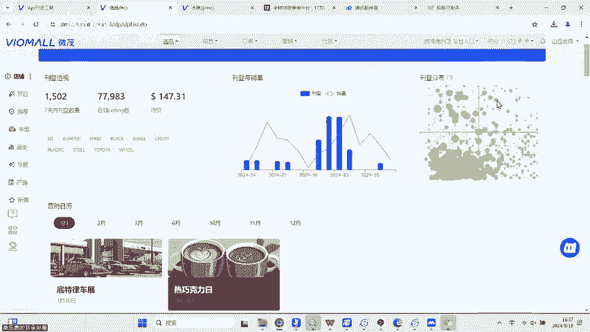

啊，在1月、2月、3月、4月、5月啊等不同的月份怎么样可能会有一些潜在的一些销售的好的SQU推荐。然后大家也可以在这里直接点进去查看详情啊，然后怎么样，然后给他直接上架。

然后在下面呢也会有一个这个数据包啊，不同的数据包推荐给大家。然后在这个数据包里面呢啊，大家也可以怎么样，也可以直接去选择之后怎么样去上架啊，它这里面都会有很多很多啊。

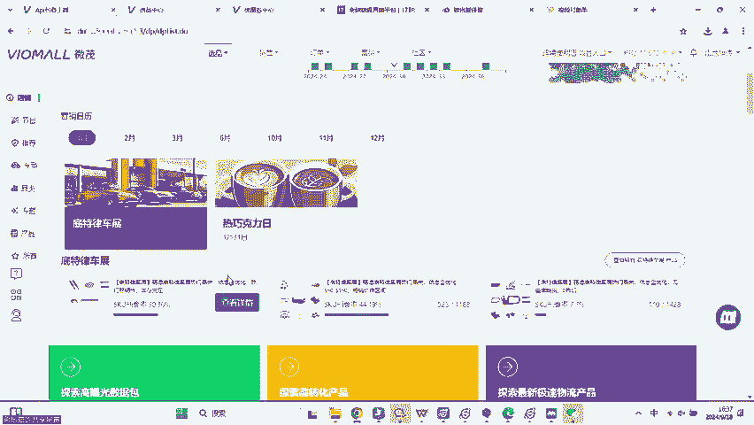

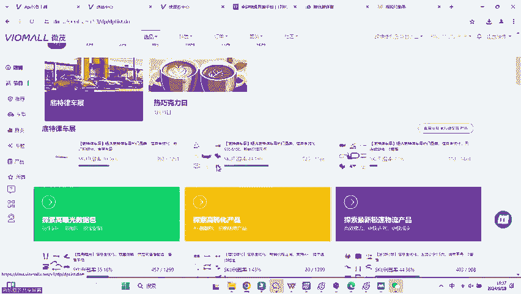

很多很多整理好的，就是我们很多分销商，不是说啊想要根据我比如说我想上一些啊这个照明的，我想上一些头灯，我我可能在这个数据包仓库里面找不到啊，那你可以在选民中心里面啊，这里有个车型啊。

这里不是这里有一个品类啊，点进来之后啊，你可以直接点这个头灯。然后在这个直接点进来之后呢，它就会有一些推荐给到我们啊，知道吧？那就会有一些推荐给到我们，然后这个时候我们就可以直接点进去啊嗯。

那然后在这个下面它就会有一些头灯的这个数据包给到我们，然后我们就可以直接去点进去什么呀，去上架就可以了。然后这里呢也会有一些车型。啊，你也可以根据车型，就比如说我想上架一些皮卡呀啊。

我想上架一些SUV呀，是不是？然后这里面可能会有一些比较好卖的一些，比如说这个呃这个。丰田啊RRV4啊，或者是本田的CRV啊，不同的车型，我只要点进去之后，它就会怎么样。

他就会推荐给我一些啊这个不同的什么不同的这个车的相关的这个什么数据包啊，给到我们啊，不同的这个数据包给到我们。然后我们就可以怎么样直接去做一些什么直接去做一些不同的上架。啊，直接去做一些不同的上架。

比如说这个轿车也是啊，比如说这个丰田的凯美瑞啊，凯美瑞，我点进来之后，我就可以在这里看到啊，查看详情，我就可以直接点进去，然后怎么样直接去上架啊，我就可以直接去上架。

所以说这个是相对来说啊是比较智能化的。我们的选品中心呢是相当于把前面很多的这个功能怎么样都直接给它全部融合在了一起啊，我们这个选品中心相当于是之前啊。

我们把之前我刚刚给大家提到了一些这个相关的这个功能啊，我们平台相关的一些啊这个设计啊，都怎么样给它融到了一起啊，都给它融到了一起。所以说它是一个比较啊这个集合型的一个啊，大家可以去选择上架的一个地方啊。

集合型的，大家可以去选择去上架的一个地方啊，它是比较啊比较全面的啊，就是说这个选品中心它是一个比较全面的啊，它不它不是那种细分的啊，所以说大家。可以考虑啊，你当你第六阶段啊。

就是说你第六个可以选择SKU上架的地方，你可以从这里面去选择，知道吧？那可以从这个里面去选择，还是非常不错的啊，还是非常不错的。然后还有什么地方可以上架呢？就是还有什么地方就是在这里啊我们的产品展厅啊。

我们有一些分商，他说我想看不同的，我想我就是想自己去挑SKU去上架行不行啊，在这里面你也可以自己去调啊，你可以自己去调。但是我们现在平台关闭的这个下载数据包的功能啊，所以说如果你不是做沃尔么。

或者说你没有开通这个呃有这个权限的话，你可能就下载不了。啊，你可能就下载不了啊，所以说这里要跟大家讲一下，如果你没有这个相关的权限，你可能下载不了的话。

那你就没办法啊这个直接这个把相关的这个SKU怎么样给它下载下来啊，你就没办法直接把这个相关的SKU给它下载下来啊，所以说这里我要稍微的提醒大家啊，我要稍微的提醒大家。

如果你没有这个相关的这个权限或者这个啊功能的话，你可能就下载不了。但是这里也确实是一个啊可以去选品的地方啊，可以去选品的地方。然后我们总共啊我们平台基本上能够上架的这个能够上架选品的地方大概就这么多啊。

大概就这么多啊，我觉得也差不多了啊，我觉得也差不多。你几乎你买了，就算你买了10万那个档位的ACES啊，也基本上能够啊能够上架完毕啊，也基本也基本上能够上架完毕啊，好吧，这个就是我们平台啊。

能够给大家让能够让大家去选品的一个啊这个。一个11个1个1个推荐的渠道啊，所以说我们给大家推荐了一些这个渠道，好吧，然后第二个。

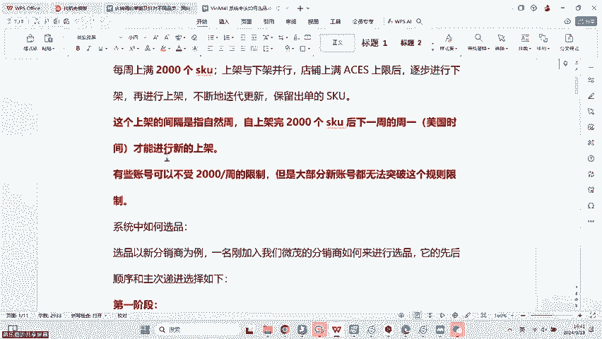