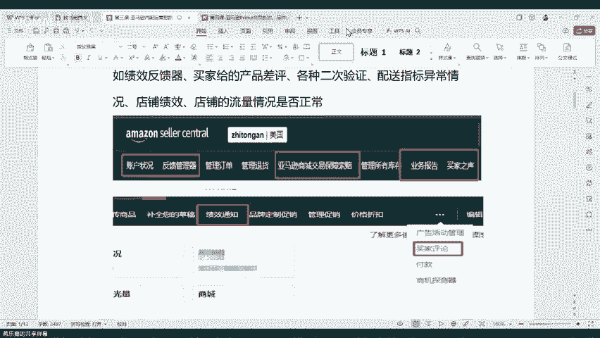
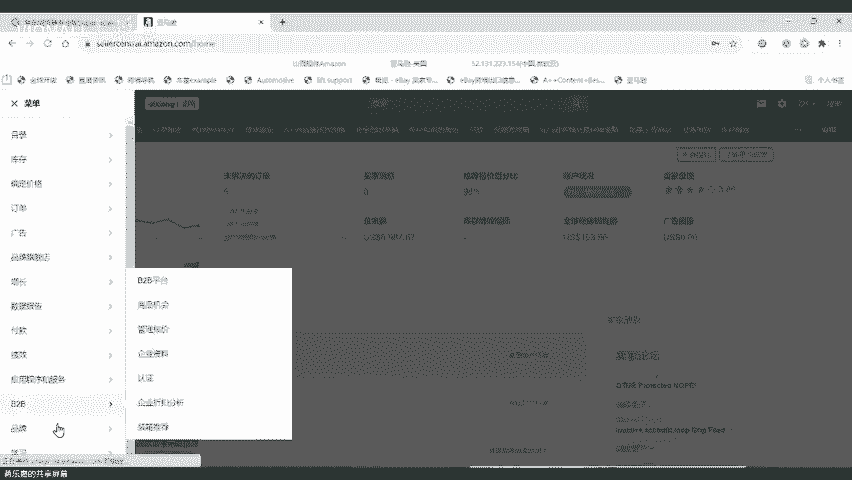
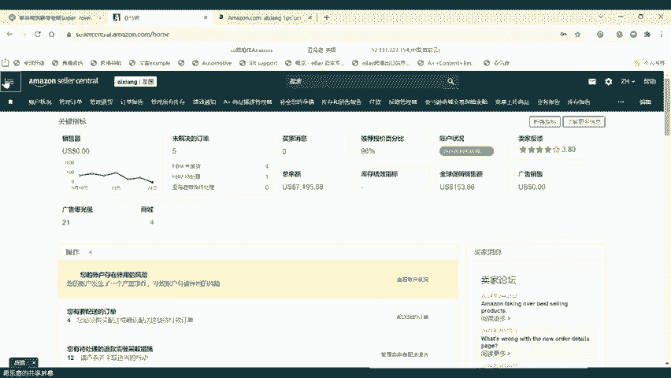
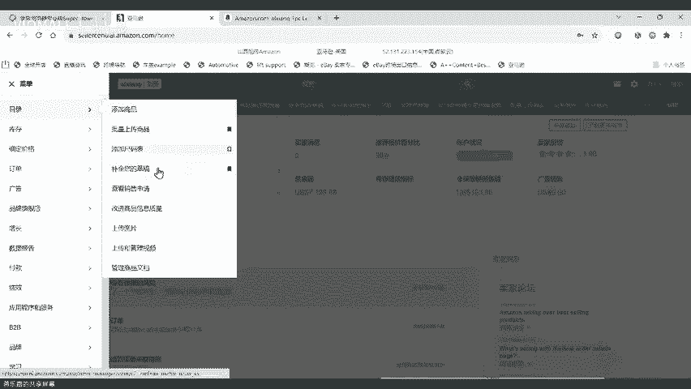
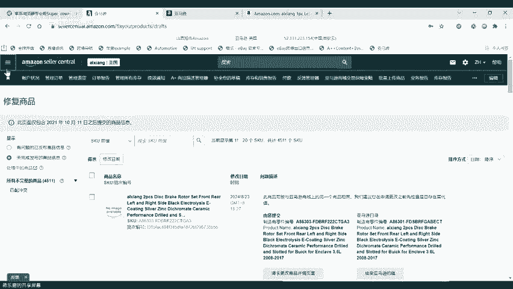
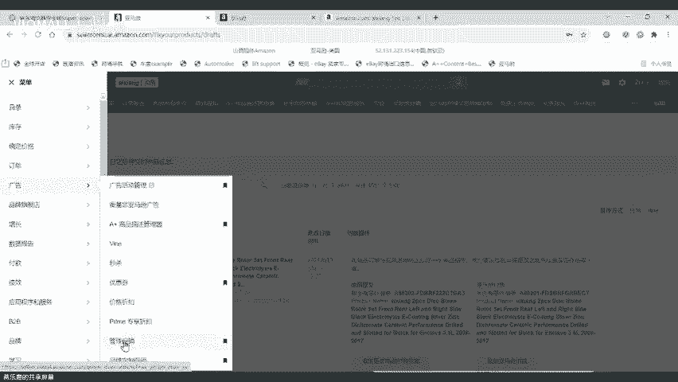
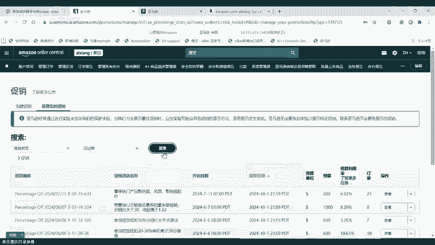
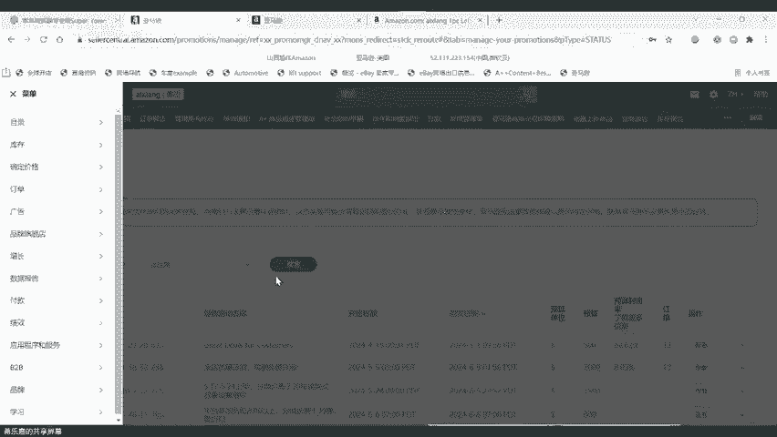
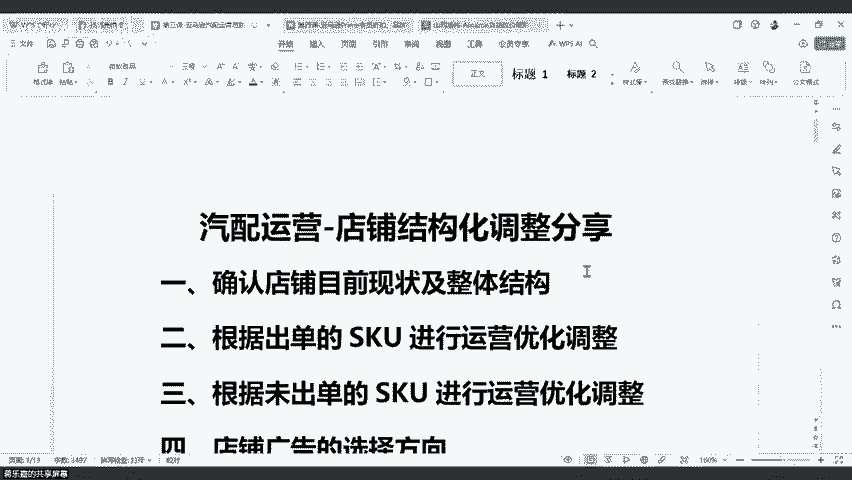

# 第三课-亚马逊汽配店铺结构化运营 - P1 - VIOMALL - BV1zfxVecEqk

李宁还有这个。还有这个呃怎么设置一些我们常用的优惠券等等啊，来这个迎接大促啊。因为我们这个呃这个prier会员日啊，这个会员专享折扣啊，马上10月份又又有一次啊，10月8号到10月9号。

这个是亚马逊官方给的一个数据。啊，这个是亚马逊官方给的一个数据。然后到时候这个到时候会有一场大促。然后大家如果啊店铺有符合资格的这种SKU啊，或者是这种情况的话啊。

可以适当的怎么样把你们自己的这个店铺拿去做一些相关的活动，然后去看能不能趁到一波流量。然后提升一个转化和销售还是很有机会的，还是很有机会的。今天的话呢就是把两个部分的内容啊融合在一起来分享给大家。

好吧啊，可能会内容比较多啊，内容比较多。然后这个大家要专心要用心听啊，用心用心听回去自己到时候去实操。然后到时候这个这个我们的这个回放呢。也会给大家到时候放放在我们的一个主题培训里面啊，也会给大家。

到时候放到我们的主题培训里面。大家如果啊有这个兴趣啊，也可以去看一看啊，看一看。我们还有一分钟，我们今天直播分享就开正式开始啊，还有一分钟啊，大家稍安勿躁啊，稍安勿躁。啊，欢迎抖音的我们的小乐宝啊。

小乐宝你好，下午好。OK欢迎各位视频号的小伙伴啊。😊，好，那么我们时间差不多了啊，我们今天就正式开始我们的一个呃直播分享。好吧。呃，第一个啊，我们现在分享我们今天第一个大主题啊。

就是我们这个店铺的结构化调整和运营啊。然后这里的话呢分为了5个部分。对，第一个部分就是我们要先找到。我们自己的我们现在自己在运营的店铺啊，它的一个现状，还有它整体的一个结构。

然后我们来看我们是不是要怎么去做调整。然后第二个呢就是我们出过单的SKU啊，我们怎么去做一个运营优化啊，就我们怎么去做一个运营优化，然后把它变得更好是吧？然后第三个啊，就是没有出过单的SKU。

我们怎么去做一个运营的优化调整啊第二个是出过单呢？第三个是没有出过单的对吧？然后第四个啊，就是我们这个店铺的广告啊，我们要怎么去选择啊，就是我们店铺的一个广告啊，我们怎么打可能会合适一点啊。

我只是给一个大方向，具体的啊怎么打。我之前我们之前包括张老师啊，我们的汤老师也有讲过啊，大家到时候可以自己去看一看啊，自己去看一看我们在这里呢只是给大家分享一下方法啊，分享一下方法。

然后我们在直播分享的过程中呢，如果有一些啊，比如说大家听不清楚啊，或者是有什么疑问呢啊，都可以。来啊跟我们做一个线上的互动啊，跟我们做一个线上的互动嗯。然后第五个就是出过单或者没有出过单。

但是有流量的SKO啊，我们可以怎么去优化啊，这就是我们今天的五个部分啊，可能然后我们讲完之后呢，我们还会讲一讲啊这个亚马逊常见的各类折扣啊，优惠券哪啊。

还有一些这种啊品牌专享的一个店铺的专享折扣的运营啊，怎么去运营啊，他时也会给大家讲，所以今天的任务比较重啊，这个大家要抓紧时间啊，抓紧时间。OK呃。

第一个我们先来看看我们今天第一部分就是我们确认我们店铺目前的状况，还有它的一个整体的一个结构的啊这种情况。第一个就是我们要先怎么样，我们自己当我们自己的店铺，对吧？我们要先确认目前店铺的一项各项指标啊。

是否有异常啊，大家可以看一下，我现在给到的这张图啊，我现在给到的这张图里面呢啊，分为什么啊账户状况啊，反馈管理器啊，这个索赔啊，业务报告啊啊，买家之深啊，还有一个评论啊啊，绩效通知啊，这些对不对？

大家要看一看我圈出来的这些内容啊，这些内容都是我们在平常啊，要重点关注的一些绩效指标啊，我们要重点关注的绩效指标。尤其是什么？尤其是会跟我们店铺的这个ODR造成直接关系的。就比如说。反馈管理器啊。

就是买家对你整个店铺的一个差评啊，第二个就是索赔对吧？然后现在可能比较多的有一个什么这个信用卡拒付索赔啊，也会有我现在已经遇到过好几次了，这个信用卡索赔的问题啊。当然信用卡索赔这个问题是一个小问题啊。

就是如果你确实啊有给人家发货啊，或者是有这个呃做一些什么其他的这些啊，就是正常有发货的这种订单，你就不用管啊，你就正常把这个单子填上去就可以了啊，不是什么大问题啊，不是什么大问题。

然后另外一种是啊另外一种是你可能真的啊确确实实啊买家自声买家自身里面极差的产品要删掉吗？呃，买家资身极差的产品，你可以想办法让对方给你删。如果删不掉的话，我建议是下架啊，因为是不会展示了啊。

那个小乐宝啊，就是就是我们看到这个买家自身里面嘛，对吧？它里面可能会有一些啊就针对这个具体的SKU，人家给你的一些评价。像这种的话啊，几乎没有什么用啊，就你只要吃了这种啊。

几乎你的整个listing就废掉了啊，就废掉了，几乎也不会有什么用。我的建议是重新下架之后再上架啊，就你重新下架之后再上架是可以的啊，就你相当于是啊这个产品还是那个产品。

但是你有了一条怎么样你有你有了一条全新的什么listing啊，你有了一条全全新的listing啊。所以说啊我是建议如果说买家自身里面有啊，还是给他删掉会好一点啊，删掉会好一点。买家评论在哪里？哦。

买家评论在哪里是吧？啊，稍等，我我给我给大家打开一下啊。呃，我现在共享一下我们的这个店铺啊，共享一下我们的店铺。呃，我们有小伙伴问买家评论在哪里啊，买家评论在我们的菜单啊，我们的菜单。

然后在下面这里有一个品牌啊，品牌，然后大家这里有一个买家评论啊，大家可以点进去。

啊，就我刚刚给就大家可以看一下啊，这个就是买家针对你具体的这些什么这些产品给到你的一个评价啊，就具体给到你的这些评价。像这种啊像这种啊给了你一些不好的评论啊或者怎么样的。

几乎可能你这个就怎么样可能就用不了了啊，我们现在点进去看一下啊，这个这个链接还好还在啊，他有两条评价啊，他这个这个SK有两条评价，整体来说3。5。如果说你这个SK只有一条评价，人家给了你一个一星或者1。

5颗星或者两颗星，几乎你这个呃你这个链链接就废了啊，几乎你这个链但是处理也很简单嘛，处理就是你把它下架了，重新再上就好了，重新给他一个新的list对吧？

这个这个买家评论呢它不会对我们整个ODR有多大的影响就还好啊，就是这个就真的还好。但是如果说是那种我刚刚跟大家提到了什么啊，那个什么这个我刚刚大家可以看一下我这上面。啊，那个反馈管理器啊。

这个里面就是我们所说说所说的什么我们所说的啊，针对我们整个店铺的一个评价啊，像这种的话，对我们的影响就非常大啊，这种这种对我们的影响确实是非常大啊，这种有的话，一定要想办法删掉啊，一定要想办法删掉。

真不是开玩笑啊，真不是开玩，这个真的很自女啊。这个呃有时候说句实话啊，就是如果遇到便宜一点的，你大不了就把东西白给他用都，真的实话实说，因为如果说你店铺两个月没有流量不出单啊，跟你现在给他点小恩小惠啊。

但把这个东西十几块美金啊，自己亏了，平台还能给你退50%嘛，对不对？你把它给他算啊，把它给他算了啊，把这个尽快把这个给做做好它啊，做好它。只要你只要你还店铺还会出单啊，你就不要担心亏那十几块啊。

我们平台也会给你最少都给你承担50%啊，最好给你承担50%啊。所以说大家在处理这种问题的时候，一定要灵活，不要想的说啊，我亏不了一点啊，我我一点都不可能亏啊，如果大家有这种想法的话，很有可能。会怎么样？

很有可能就会导致你啊这个沟通不顺利啊，跟这个买家沟通不顺利啊，然后导致最后就是啊你店铺里面啊一以及这个超低啊，然后两个月都没有流量啊。这个两其实很简单啊，就我们如果店铺里面的什么。

我们的店铺里面的购物车购物百分比降低了，那就怎么样？那就证明一定是有问题的，知道吧？要么就是你定价定高了，要么就是你购物车丢了啊，要么就是你黄金购物车啊，黄金购物车黄金购物车是指。什么呢？黄金个啊。

我给大家切切一下啊，切一下。就是说大家平台上去关注一下啊，就是我们切到我们的首页嘛，对吧？我们切到我们首页。啊，这个黄金购物车就是我们这个推荐报价百分比，这个是指什么？

这个是指客户在浏览我们的店铺的时候，他们能够直接获得一个黄金购物车的百分比例，就100个人里面如果有96个人都可以或直接就是通过点你的listing都能够有的话，那就证明什么？

那么就证明你的这个黄金购物车的购物推荐百分比是96%。如果只有90个人获得的话，那就是90%啊。如果只有10个人获得，那就是10%啊，一般来说低于之七八十%啊。这个这个店铺就很危险了啊。

就可能没啥单了啊，就可能就没啥单了。所以说大家一定要啊注意好这个问题呃一定要注意好这个问题，知道吧？嗯。OK这个是第一个啊，这个是我们常见的。要关注的一些绩效指标啊，大家可以自己啊去留意一下啊。

大家自己去留意一下。O然后第二个啊就是我们要去看什么。我们第二个我们在做我们店铺结构的时候，就是我们要去看我们店铺目前的一个什么一个SK的一个上架的情况啊，是不是有超过ACES的设置的数量。

就比如说你购买的ACES的数量是6万，对不对？那你如果说上架10万的SKO啊，那你肯定有4万的SK是不会生效的啊，你肯定有4万的SK是不会生效的。这个玩意儿就是咱们咱们改价导致的不全是啊不全是。

有时候你吃了一些啊别的问题也会有那个小顺哥啊，这个这个确实不全是啊，你说的这个改价就是可能整体价格过高，会导致丢购物车也会有的啊，你说的很对啊这个也是我们常见的丢购物车的一个原因之一啊。

常见的丢购物车的一个原因之一。然后大家第二个就是要看一看就我们在做店铺结构调整，还有运营的时候啊，大家要去看一看什么。要去看一看我们自己的什么SQ的一个上岸情况啊。

不要出现啊我们的这个上架的数量比我们的这个购买的ACES数这个量要多的情况，否则的话啊否则的话。啊，否则的话怎么样？否则的话就会导致啊你你前面的什么ACES一定会掉，前面的ACES一定会掉啊。

或者说后面的不设置设置不生效啊，设置不生效。然后这个具体要怎么去看呢啊，这个具体要怎么去看呢？呃大家可以去我们的平台啊，在我们的平台没事去看一看你自己的呃，第一你要先明确你自己的ACES的一个等级。

对吧？然后第二，你可以去检查一下，就是我们去抽查一些啊，我们自己的A选啊，看看它是不是有生效的情况啊，是不是有生效的情况。还有第三个就是呃大家在检查我们上架。

这也是我们最近收到很多我们的小伙伴给我们反馈的一个内容啊，是什么内容。就是说唉现在不是我们有很多这个老店铺啊，还有我们的这个新的分销商啊，可能上架了之后都怎么样？他最近一些商家本身就没有ACS。呃。

最近一些产品本身就没有AECS那个是通用品，通用品确实是没有ACES的啊，那个frank啊，通用品确实是没有ACES的。啊，大家可以去看一下，就在我们平台里面啊，大家可以自己去看一下我们平台啊。

那个在线刊登里面啊，有一些产品就是它不显示绿色，也不显示紫色的那种情况啊，就是属于什么？就是属于没有ACES的啊，有一些有一些这种确实是会有啊，有一些确实是会有。啊，大家可以自己去呃。嗯。

大家可以去看一下，就是在我们的在线刊登里面啊，有一些链接，然后那个SKU的下面啊，就是它不显示绿色，也不显示只是这种情况啊，就什么都没有的。这种的话啊，我给大家切换一下啊，大家可以看一下。啊。

我跟等下切换一啊，大家现在看得到吧啊，我的这个上面它这里有一个未设置，未设置这种就是什么？这种就是有ACS但是有一种这种SKU啊，大家可以看一下，我现在鼠标在的这个位置啊，它是旁边什么都没有啊。

这种就是什么，这种就是通用品啊，这种就是通用品啊，啥都没有的，就是通用品。然后通用品的话。啊，通用品的话，它确实就是啊不会有ACES因为它是通用品，它不会针对什么所谓的专车专用啊，它不存在针对专利专用。

所以说啊这个就不存在啊这个要设置ACESACES的情况。然后还有第三个，这里我跟大家讲一下，就是我们的上架完了之后，我们现在不管我们的老分销商还是我们的新发销商都会说哎我上架之后。

怎么我比如说我上了5000个，对吧？然后怎么样？然后我实际上啊可能上上去只有2000个啊，就是我根本就没办法怎么样，我根本就没有办法啊这个实现什么实现我们这个呃批量上架的5000个的产品，对吧？

那这个时候大家要来我们的亚马逊里面啊，这里有个目录，然后这里有在目录这里有一个补权零的草稿啊。我我这里啊大家可以自己去看一下补权零的草稿，然后点进去啊。

这是我们用表格上传的优惠价格会和企业价格的优惠叠加啊。

呃，不会企业价格只针对企业买家，然后他会从这两个里面选择一个最优的给给到他们自己啊，他会从这里面选到选到一个最优的给到他自检。然后不是企业买家，他也看他也享受不了企业买家的优惠，对吧？

OK大家可以来这里啊，大家可以看一下，然后在这里呢大家像大家就会看到啊，大家就会看到什么，大家就会看到呃你常见的一些啊可能错误代码啊，这个就是我们所有的啊，我们所有的上家不成功的啊一种情况啊。

这里就是我们所有上家不成功的啊，一种情况是什么问题导致的啊，然后我们常见的可能有第一个啊，如果大家看到什么超过2000个啊这种这种什么啊单周限制，那不用说这种就是你只能等到下一周是吧？

然后另外一种就是可能像大家现在看到这种啊什么呃以另外一个商品值相同，巴拉巴拉之类的啊，然后像这种的话啊，有可能就是我们的数据怎么样跟他重叠了，跟他重叠了。像这种的话，我们可能就进去。改一些数据啊。

这种啊大家可以看像我现在这里讲的这个啊制造商品牌商，我是这个，对不对？然后这个人他可能是我们其他的分发商啊，也有可能是其他的。然后但是我们可能跟他的什么样，我们可能可能跟他的不一样啊，可能跟他不一样。

这种第一个解决方法是什么？你可以不上架这个产品啊，这是第一个，然后第二个是什么？第二个是你把这个编辑草稿，你自己把里面的一些数据稍微改一改，然后给他重新传上去啊，你自己改一改。

然后给他重新传上去就可以了。啊，不用改太多啊不用改太多，你稍微改一改啊一些什么描述词啊啊，一些什么标题稍微改一下啊，然后给它丢上去就可以。然后还有这一种啊。

还有这一种有可能什么有可能就是你之前啊有上过相关的，然后这个导致就会这样子。但然那但是你具体有没有上过，你得自己去查一下啊然后还有这种第三种情况啊，就你到底有没有上架过啊那你们得自己去看一下啊。

你们得自己去看一下啊，一般来说啊一般来说我们可能碰到了啊，就就这几种情况啊，我知道我们分销商可能还会碰到啊其他许许多多的类似的情况啊，其他许许多类似的情况，但是我们具体情况我们得自己具体去分析一啊。

像这种啊大家家看到我这个里面啊，这个里面有一什么什么啊什么制造零件编号啊，这些巴拉巴拉巴拉一堆一堆是吧？

然后这个有可能就是么有可能就是我们之前有上架过类似的或者说同一个类型的SKO然后导致他们识别错误啊，导致他们识别错误，也可能会这样知道吧？也可能会这样。那像这种情况的话呢，我们可以选择什么。接受啊。

我们可以选择接受，或者是你重新怎么样编辑草稿，然后把这个数值给它稍微调整一下。还是一样，你自己稍微给他啊给他调整一下就可以了。啊，你自己给他稍微调整一下，然后就可以，然后就可以继续上架了啊。

所以说这个这个就是我们常见的可能一些啊在我们草稿里面啊，大家要去检查一下，就是我们平常上架的东西到底为什么没有上架上去啊，到底为什么没有上架上去，大家要自己去看一看啊，要自己去看一看。然后还有第三个啊。

这刚刚我我没有碰到的啊，第三个就是说什么？第三个可能就是我们的图片有问题啊，我们的图片有问题，就会展示像这样子啊，这个就会像我这个文档里面展示的情况一样啊，然后他就会说啊。

可能我们这个有这个有可能是这个大概率都是什么？这个大概率就是我们平台啊，我们的这个文件出了一点问题啊，我们的那个图片文件出了一点问题，导致怎么样，导致没有办法啊显示在你的店铺后台啊，但这种的话。

你可以自己去把图片给他放上来啊，要么就是你直接再重新走一遍上架流程就可以了啊。如果还不行的话，就只能把SQU报给我们啊，把SQU报给我们。然后这样子的话，我们到时候啊这个呃发现有这种不合适的。

然后我们到时候就会重新让数据部门重新做，好吧。然后第四个大家可以看一下，我这里有一个什么。我这里有一个啊提示呢就是说你已达到每周新建A选的一个数目的上限，这种提示就是我们最常见的啊，可能99。

99%的分销商都会遇到的一个情况是什么呢？就是我们每周上架超过限制了。那像这种情况怎么办？这种情况，大家就要等下一周啊，下周一的时候怎么样把这个SKO怎么样，重新给他上架一遍啊，重新走一遍上。

就是没有上架成功的啊，没有上架成功的，你不要这周再去上架了啊，你这周再去上架也不会上成功的啊，你这周再去上架也不会上成功的。然后大家上架完了之后，就就是我们自己去处理一些这种常见的问题就可以了啊。

自己去处理一些常见的问题就可以了。然后还有一个是什么？还有一个就是。大家要经常啊偶尔去检查一下自己什么自己的SKU有没有被分错类啊，大家要经要去检查一下自己的SKU有没有被分错类啊。

这里我给大家打开一个文档，大家可以看一下啊，就在我们的文档啊文档这里面啊，这样比如说啊现在我打开了这个文档，对吧？然后我们这里不是有一个SKU的状态嘛，对吧？

然后在SKU的状态里面呢啊就会看到有一些啊什么缺货下架，售后啊停售啊问题啊等等，还有正常，那一般来说哈就是这种什么缺货下架的，然后这个售后问题，还有这个问题产品，那确实可能就是有问题的。

那我就建议你把它给下架。但是啊凡是，但是我但是我就建议你怎么样，建议你把有销售的怎么样给它保留下来，啊，把有销售的给它保留下来，有可能后面还会有或者是你自己手动给它调一下库存。

然后你去找一找看有没有替代品。能能理解我说的吧，你可以自己去手动找一下那些啊，就是我刚刚提到这几种状态，对吧？但是那种有销售的，我建议大家不要那么直接啊不要那么草率，直接就给他下架了啊，不要那么草率。

直接给他下架你可以先怎么样，你可以给他找一找啊，看看里面啊哪些是有销售，然后把那些有销售的先给他保了，然后自己手动去改一下它的库存啊，改完库存，然后怎么办呢？改完库存，然后你就啊继续保持销售。

如果说出单了之后怎么样，你就去找什么替换品啊，有没有替换品。因为一个有销售的链接啊，说实话啊，不太容易啊，不太容易，大家就是能够把那种有销售的给他保价了，就保价了啊，能够找到替代品。

到时候发替代品就可以了。就是呃亚马逊上面出单了，你就自己去手动创建一个订单啊，然后替把那个替换品给他放上去，然后给他去发货就可以了。然后还有一种就是我们这种停售啊。

就是在我们的这个SQU状态里面会有一个停售啊。然后这个停售的话呢啊这种情况的话呢，大家就要自己怎么样呃，先不要下架。为什么？因为停售有可能是什么，有可能是没有库存的啊，有可能是没有库存。大家可以看到啊。

在我的这个系统库存这里面啊，都是属于00000啊，大家不要把这种怎么样给它下架了啊，大家不要把这种产品给它下架，否则的话啊就会导致呃你你把本来是还正在保持销售的一些啊这种产品啊给它删掉了。

那到时候你后面可能又要重新去上架啊，你可能后面就要重新去上架。所以说啊我不建议大家去做这种事情啊，我不建议大家去做这种事情。O这个是我们常见的啊，一些要处理的问题啊，我们常见的一些要处理的问题啊。

当然了还有一个很重要的是什么，还有一个很重要的就是改价啊，这个改价的话，大家可以去参考一下我上周啊有给大家介绍和分享过的这个视频课程啊，我也有做过直播啊，我这里就不再赘述了啊，再赘述。

OK然后第二部分啊第二部分就是我们要做什么啊，当我们把我们自己的店铺的绩效啊啊上架啊，还有我们这个下架的一些情况啊，还有我们自己的店铺的安全维护好之后，第二个就怎么样。第二个我们就要根据啊。

我们出过单的SKU怎么样来做一些运营的优化调整啊，这就是我们第二步要做的事情。我们第二步就是要做啊我们的运营和优化和调整啊，那么第一个啊就是我们要先整理总结出啊。

我们出个单的SKU我们可以把订单导下来之后进行数据匹配啊，也可以直接通过改价模板的累计售出来查看销售情况来确定出单的SKU的情况，确定出单以后的SKU，然后来确定你要策划的一个活动类型啊。

什么意思就是你可以自己去我们平台啊，在我们平台的订单里面啊，你可以自己去把那个。订单列表给它下载下来，下载下来之后啊，在在哪里啊在哪里在这里啊。啊，这里大家可以自己去在这里啊。

把这个订单怎么样给它导出来。就比如说我在这里啊，大家可以看到在这里有一个导出订单啊，大家自己去把这个订单给它导出来，导出来之后去匹配一下啊，每个SQ大概卖了多少。

然后把他们的什么把他们的品类给它匹配出来啊，给给它匹配出来。然后第二个，如果说你说啊我不我不想我不想弄那么麻烦，我就想简单一点行不行？可以啊啊，在我们的改价表里面，这里不是有一个累计售出吗？啊。

在累计售出里面就这里也会有是吧？在累计售出，你把所有的产品打开，对吧？然后在累计售出这里面也会有你所有的啊有过销售的一些SKO。然后你把这些SKO怎么样啊。

给他拉出来之后怎么样把它的品类给他确定出来之后，优先然后你要做什么？然后你要做的就是优先把你出过单子单的SKO你可以给他做一些什么，你可以给他做一些亚马逊的优惠券啊啊，或者你给他做一些亚马逊的广告啊。

然后你可以给他做一些什么，你可以给他做一些亚马逊的促销，就这种是单独针对什么，这种是单独。停售的到底是什么概念？停售的全部删除。等一等下，稍等一下，各位我看一下啊，我看一下大家问题。

风鸣哥说以前停售都下架了。没有停售的。停售了只是没有库存，不要下架。停售了SQU可能每天都有几千个，你不要下架。我我刚刚不是讲了吗？我刚刚讲了嘛，SQU的状态里面啊，那个停售的和正常的，你不要去动它。

你只动售后缺货下架和问题产品啊。以前说我可没有说过，我不知道谁说，反正我我从来不说这个了啊迪。我不知道谁说，反正我不说了啊，那个停售停售的有可能只是暂时没有库存而已，知道吧？

停售有可能只是暂时没有库存而已。我问过我问过，知道吧啊。我就所以我就建议大家停售的啊，不要删啊不要删，除非是比如说啊过了一段时间，这个SKU还是停售，那你可以把它下架。这个停售里面有好几种情况啊。

有一种就是像大家想的说的那种啊，就是可能永远都不会再再卖了。另外一种就是没有库存的，知道吧？还有一种就是可能问题产品被标了停售的啊，都有，反正就是说这里面的哎因为这里面的SKU都很多，知道吧？

这里面的SKU都很多，如果你每天都批上去删的话，那你等于就是你每天都要进行上下架。我的建议就是你只删缺货的售后的，还有问题产品啊，其他的你先保留。如果你实在要删停售，你把停售里面有销售的给它保留下来。

知道吧？啊，就所以说这里面啊，我们自己我们这里面所有的产品只要是有过销售的，大家都要啊比较。这个优待一点，对待这些SKO，因为这些都是你的宝啊，都是你能够出单的，知道吧？你能够出单的。

都是你未来啊可能会持续出单的SKO啊，能不能不动就不动，知道吧？能不动就不动OK然后这里我们继续啊，我们继续我们这里讲到什么，我们这里讲到。我们要把我们出货单的SKO啊，怎么样给大家做一些优惠券。

给他做一些促销，给他做一些广告啊，这种的话就是。大家自己去设置啊自己去设置。然后这里面它会涉及到有一个百分比，就是我做促销，或者我做优惠券的时候，我到底给他做多少的百分比呢？啊。

这个的时候的话呢就要看你自己啊就要看你自己嗯。我一般是建议啊我一般是建议可能做个5%就可以了啊。然后我还有就是我要跟大家讲一下，就是优惠券的效果，没有促销的效果好啊，没有促销的效果好。

如果就是因为现在优惠券改版之后嘛，是吧？就是说优惠券只是一个其中的一种辅助手段啊，但是你要问我哪种效果最好。那我个人的啊经验告诉我哈，就是我个人在实操的经验告诉我的话，就是促销的转化效果是最好啊。

就我们做了一些活动的话，促销的转化效果啊，是我目前接触过的最好的啊，接接触过的最好的。然后这里大家如果再设置优惠券的话，你可以参考一下这个思路啊，就10美金以下的啊。

10到20美金的你单价的话可以给他设置为什么0。85到0。95啊，或者01。1。05，然后优惠券给他个5%，然后20套30的话，你可以给他设置了1。15啊，这个这个大家可以自己看一看就好了啊。

反正你们就啊自己去看啊，自己去设置，然后你然后优惠券设置有两种啊，第一种。就是按金额就是每一个啊给他减多少。然后第二个就是按折扣百分之比，就每一个给他打多少折啊，我反正是不建议大家啊把价格抬的高高的。

你说的重销是咱们平台还是亚马逊？呃，亚马逊啊，我现在说的是亚马逊的促销啊，那个小顺哥啊，我现在说的是亚马逊促销啊，我们平台的优惠那个呃那个什么促销，那是那是另外的那是另外的啊。

我说的是亚马逊的啊亚马逊的优惠券啊。亚马逊的优惠券。因为现在呃它的要求比较多啊，比较严格，所以说它的成功百分比不一定很高啊，不一定很高。然后第三个啊，就是呃这里是跟大家讲完了，要设置优惠券。

然后第三个就是大家针对出单的SKO对不对？一定要去怎么样要去跟广告啊，你可以参考将广告设置为啊低于50美金的，或者是高于50美金分销价的SKO啊，或者是你给他设置为什么低于60美金或者是高于60美金。

或者你给他设置为低价值，中价值和高价值，总之就是你要去开广告啊，你要去开广，并且啊我给大家一个建议，就是这种出货单的SKO你可以适当提高你的广告成本啊。因为这部分的SKO整体来说曝光还是不错的啊。

然后转化会比较好啊，转化会比较。好，所以说啊大家可以自己去找一找啊，找一找。然后然后还有就是第四种情况啊，就是说有一种有一些SKU啊，就是你给他挑出来之后，他可能做不了优惠券啊，你给他做不了优惠券。

那如果做不了优惠券的情况下，你可以拿去怎么样，你可以拿去给他做亚马逊的促销啊，亚马逊的促销，因为促销同样也会啊这个带来出单啊，促销同样也会带来出单。而且出促销的出单的效果会比较好啊。

然后为什么但是促销他有一个跟优惠券不一样的地方是什么？第一。促销不收费啊，优惠券是要收费的。然后第二是什么？第二是促销是必须要点进去这个SKO啊，在里面去看到了之后才能够用。

但是优惠券是人家在搜索这个list搜索这个产品啊，在这个曝光的第一眼啊，就是我们在出现那个很多很多产品的那个listing的那个地方啊，就已经会怎么样已经会出现折扣比啊，已经会出现折扣比。

新卖家没有权重和评价促销活动能不能做促销可以做那个牛仔哥啊，我知我知道啊促销可以做啊，促销可以做。但是优惠券可能其实优惠券，新卖家也能做。因为呃针对完全没有任何评价的这种是可以去做啊优惠券的啊。

是可以去做优惠券的。而且但是这里我要跟大家讲一下，就是不管你是做促销还是做优惠券，你的百分比折扣率不要太高啊不要太高。就是你不要先把价格拉到1。71。8倍。

然后你说我给他个20%或者30%的促销或者优惠券啊，不要这样不要这样，我不建议啊，我不建议这样子的会导致你完全啊没有。促销在哪个节点搞？呃，促销。稍等一下啊。是什么叫节点？哎，那个那个小乐宝。

我不太懂你说的话，什么叫节点？呃，我怎么有点懵。你你说的节点是说你要在哪个时候去做这个事情是吗？还是还是说在哪里去做这个东西。如果你是问在哪里去做这个东西的话，呃，在我们的这个菜单啊，我们的菜单里面啊。

然后这个里面啊，这里有一个呃广告啊，广告里面有一个管理促销。然后在这个在这里面你就可以去设置一个促销啊，在这里面就可以设置一个促销。

哦哦，不知道在哪啊，你我现在看我现在讲的就是啊啊你可以看一下广告啊，广告里面有一个管理促销。

啊，你可以点进去啊，那个促销的话，我到时候呃我到时候看要不要单独做一起啊，因为促销玩的玩头还是挺多的啊。你可大家可以看一下啊，促销的出单的效果还是可以的啊。我个人觉得呃促销的出单效果是真不错啊，真不错。

大家可以呃大家可以这个看看一下啊，可以考参考一下啊。我我觉得促销的出单效果还是非常不错的啊。

啊，大家可以看一下，你看看到没有？我这里之前玩赏金猎人出单啊，呃一个月出100多单啊，不开玩笑啊，大家可以看一下，我这里啊，我一个月出100多单就靠促销，但是做优惠券是做不到这个效果啊。

实话实讲做优惠券做不到这个效果。我后期的话看要不要给单单独开一期促销啊，稍微给大家详细讲一讲啊，稍微给大家详细讲一讲。然后因为我们今天是做一个整体的一个运营思路调整啊。

我就不我就不针对某一个啊去深入讲的。因为我们还有好多内容啊，今天内容蛮多啊，大家大家要好好消化和吸收啊，就是如果你不会的话，可以好好消化吸收一下啊。OK然后这里讲完了啊，就是这个百分比不要设置的过高啊。

百分比不要设置的过高。

然后第三个啊，这里是指什么？这里是指啊给大家讲了这个啊针对出货单的SKO怎么去做啊。然后还有一个就是跟大家讲一下，出货单的SKO，你可以把他们品类挑出来，然后用大品类去开广告，知道吗？

你用大品类去开广告，并且你去开那个手动广告，知道吧？我之前给大家讲过分享过这个手动广告啊，你去开这个手动广告的效果非常好，知道吧？你去开，就是你针对你出货单的SKO去给大家开这个手动的广告啊。

转化的效果非常好，知道吗？转化的效果非常好。所以我是建议大家啊，我个人是建议大家可以去想办法啊尝试一下，去怎么去操作一下，把你你自己去实验一下，把你自己出货单的好的品类怎么样给他挖出来。

挖出来之后去给他开这个手动广告啊，效果非常好，效果非常好，好吧。OK然后这这这个是我跟大家讲的啊，出过单的SQ你可以怎么怎么去调整。然后第三个就是没有出过单的SKO这边设置比较好。

还是用表格上传比较好啊，优惠券的话要用表格啊，我等会会给大家讲这个优惠券的表格好吧，优惠券的话用表格促销的话，直接传A选就可以了，知道吧？啊，哥促促销用表格啊，优惠券直接传A选啊。

然后这里第三个啊跟大家讲一讲，就是没有出过单的SK大家怎么去做一个运营优化调整啊，就是有一种SK啊，它既不属于优惠券也不属于宝促销。然后这种SKU的话，我们的分销商在运营调整的时候就要筛选出来啊。

筛选出来以后你优先将价格做一遍调整啊，这里我说的是什么？这里我说的是你已经上架了之后啊，可能比较长时间都没有出过单的。知道吧？就是我们因为我们是说实话我们店铺里面哈，比如说我举个例子。

我们我现在目目前手头上在展示的这个店铺哈，呃里面有8万个SKU可能出过单的有多少，我看一下出过单的有多少。84200啊，大家可以看到我这里总共有84780个SKO啊，出过单的啊，没出过单的。

有84230个，那就证明什么，那就证明出过单的怎么样，只有500多个，我刨除掉之前出过单，但是被下架了的，可能加起来也就不到1000个。啊，所以说我整个店铺啊。8万多个产品加起来出过单的不到1000个。

那像这样子的，那就剩下那就证明什么？那就剩下的95%以上的产品怎么样都是属于什么？都是属于没有出过单的那这种产品我们要怎么去调整呢啊，这种产品我们怎么调整。第一，我们要去看时间啊。

就是我们要先去把没有出过单的怎么样给它筛出来，筛出来之后我们去看时间，我们上架的时间超过一个月或者一个半月啊，因为我们现在SES设置比较灵活是吧？基本上可能每天都会给大家设置一遍。

然后设置完了之后可能啊半个月最多不超过一个月ACACES就会展示出来。啊，所以说啊不到一个月的时间，ACES就会展示。那像这种啊超过一两个月上架，然后又没有出单的话，怎么样？我们给他筛选出来。

筛选出来之后，我们优先怎么样优先将价格做一遍调整啊。如果说啊大家前期是为了出单的话，那你定价的价格就不要太高啊，你定价的价格就不要太高，否则对你店铺的流量是不太好的啊，即便是啊有一些SKO啊。

你说他是参加挖宝的SKO啊，或者说奖励积分啊，或者是优先中心的SKO啊，你也可以化作这一类型。就是即便是他参加这些各种各样的活动，但他没有出单嘛，对不对？没有出单的话，那他都是属于什么。

都是属于未出单的SK那像这种SKO的话，你都要去做一什么，你都要去做一些啊这种优化去调整的，知道吧？OK啊，然后在没有出单的SKU的调整里面啊，你们大家可以把这种SKO分为什么？

分为参加挖宝促销的SKO和参加抵扣的SKU。那么第一个啊就是参加挖宝促销的SKU的话，那像这种参加挖宝促销SKU的话，大家可以怎么样，可以自己去啊，去降价，加上做促销的形式啊。

这个这个我就不过多的去赘述啊，因为我在之前讲挖宝的时候有给大家讲过啊，大家可以去参考一下啊，讲挖宝。因为啊讲讲挖宝的一些内容啊，简单来说就是啊抵扣比较低的，你就给他直接做降价啊，抵扣有比较高的。

就比如说20%这种啊30%这种挖宝的话，那你就要给他做什么，你要给他做降价加上什么加上做促销啊，加上做广告的形式，这样子出单的效果才会好是吧？然后比如说这样比如说抵挖宝20%抵扣的。

你就给他降价5%啊是吧？然后你再给他做个5%的一个促销。那像这种挖宝30%的啊，挖宝现在不是每天都变吗？对啊，挖宝现在是每天都在变，但是它不会全部都变啊，你懂能理解吧？就是挖宝我们小伙伴说的是对的啊。

就是每天都在变，但是它不是全部SPO都在变。他每天变的只有那一部分啊，但是你不可能说因为那一部分变，就导致你不参加这个活动吧啊，就是你可能可能你亏你亏是不会亏的。但是如果你不参加这个活动啊。

那你可能就会错失很多这种出单的机会啊，错失很多出单机会但是我实话实讲话，我实话实讲就是挖宝的这个转化，没有赏金猎人的高啊，没有赏金猎人高啊。虽然说现在赏金猎人啊，这种抵扣啊什么也下调了。

但是它的转化依然怎么样，依然比挖宝的要好啊，他的转化依然比挖宝要好啊，所以说这种啊挖宝30%抵扣的，你就可以按照降价10%加上促销5%的一个形式啊，给他去做这样子的一个调整，知道吧？大家可以参考一下啊。

看到我这个图里面。哦，我这个图里面就是。啊，设置了两种啊，你也可以自己你也可以自己就是各位啊各位小伙伴，你也可以自己根据你自己的一个情况啊，根据你自己的一个想法去给他设置一些不同的一些花样啊。

就比如说啊30块以下的啊，30到60的60到90的，90到120的啊，120以上的，你可以给他设置很多组，你可以给他设置很多组，但是我个人还是那句话，就是你优先上架和选择有抵扣的SKO知道吧？

你如果你要上架，你参加这个活动，你说我不想花那么多积分，那你就优先上下有抵扣的啊，其他的那种奖励积分的，你可以考虑后上啊，可以考虑后上，好吧。

OK还有一种就是大家去参加了优惠券中心的SKO然后这种参加了优惠券中心的SKU的话，我们也是要怎么样？我们也是要做一些调价和这种什么和这种设置促销的这种活动的。

那么大家在设置这种优惠券中心的活动的这种SKU的时候啊，大家一定要想清楚你的你的思路，什么思路，就是你要确认你参加的活动具体是什么。然后目前平台可以参加的活动是比较多的。如果你全部都参加。

那么在时间上面还有上架的SKU上面可能没有办法实现同步进行啊，就是说你因为我们现在可能有一些小伙伴他每周只能上2000个。如果你说我全部活动啊，我所有的优惠券中心活动我都想参加，那你觉得你上架的了吗？

对不对？我们可能活动才一个月，那你一个月可能某一个活动就要求你上架5000个哦，或者说要求你上架8000个啊，那不管是从积分呢啊，还是从这个上架的选择里面来说，你可能都没办法上架上架上的玩，知道吧？

你可能都没办法上架上的玩。啊，所以说你一定要找出侧重点，就是这么多活动里面我到底参加哪一个啊，我到底参加哪一个。那我给大家几个建议。就是第一个，你肯定要选择SKO连续性强的。

就比如说每周都有或者每个月都有或者持续半个月或者持续一个月那种啊，像这种只有一两天的啊，不是说不能参加。但是他我个人觉得他是放在后面去参加啊，知道吧？就是我优先把前面我想要参加给参加完了。

我才去参加这种。然后第二种是什么？第二种就是有高抵扣的啊，有高抵扣，什么叫高抵扣，我个人的话就是觉得50%以上啊，或者40%以上啊，才叫高抵扣。你说那种之10%20%，你说能不能参加可以。

如果这个这个活动它是那种长时间的，比如说一个月啊持续时间或者两个月持续时间，然后兑换次数多的，比如说10次15次20次这种啊，那你可以考虑参加啊，你就把它当成一个长期的活动来玩。但是如果说他没有啊。

他就只有两天，然后他的比如说要求啊又上家要求什么15000、2万个，那像这种的话，我我个人是不建议的。好吧，我个人是不建议的。然后啊大反正就大家可以自己去根据我这个。

然后第第二个就是有一种活动时间短的这种活动，那你就要看什么，你就要看它的次数可以和可以抵扣的情况，像那种抵扣很少，就比如说抵扣10%，然后次数又少一两次那种，那你就不要考虑了。然后那种次数不多的。

然后活动活动的这种力度大的，就比如说啊次次数有个10次20次啊，然后力度有然后抵扣力度百分百啊啊，即便是他活动时间短只有10天或者7天，你都可以考虑去参加啊，当然了，还有一个很重要的问题，就是考虑成本。

就是有没有成本的问题，就他到底要不要花你的钱我们现在购买是靠积分嘛，对不对？那你大家就要去想想啊，那这个比如说他不用不用你花钱啊，就你零成本啊，白嫖来的那种优惠券，那你肯定当然可以去选择参加了。

对不对啊，这种小都不用想，那你而且当然你还要看什么，你还要看啊，你还要看他的这个呃SKO的什么，你还要看他SKO啊，要求上架的这个。个数啊，如果你比如说他要求你上架1万个，但是你现在只上了几百个。

那像这种的话，我也不建议你参加啊。有可能你刚刚上架完活动就结束了。但是如果说要求上架5000个啊，你现在上架都上了400个或者3000个。那这种的话，我建议你直接去参加啊，直接去参加啊。

所以说大家在参加这种优惠券的时候啊，一定要怎么样，一定要啊想一想你到底要什么，你到底要玩哪一种类型。还有就是啊第四个给大家一个建议，就是挖宝和优惠券中心的活动，要避免重叠啊，要避免重重叠。

就是二者就是如果说这个SKO啊，它两者都同时出现的话，那你一定要选择有较高抵扣的活动为优先原则啊。但是你也要考虑时间线次数的问题啊，就是说有可能优惠券明天才开始，我今天出单明天付款付款算吗。啊，不算啊。

我们呃优惠券的话只会以那个呃订单的时间为主啊，其他的不算啊，其他的不算啊，你什么时候付款的，不管啊，只只以订单出现的时间啊。OK然后第。三个哈就是说第三个我们平台啊，我建议大家在做结构化调整的时候。

你可以考虑参加我们平台赏金猎人的活动啊，赏金猎人的活动。那像这种参加平台赏金猎人的活动的话，大家也是要根据。去啊不同的分类啊，设置一些不同想要达到的一个结果。啊，大家也是要根据不同的分类啊。

设置一些不同的想要达到的结果啊，这个赏金类的我之前也讲过了，我之前也讲过了，这个也是呃改改改过一些的嘛，改过一些的嘛。然后这里的话我给大家啊切换一下，我给大家切换一下。按付款的时间。没有吧。

我们是以订单的时间不按付款的呀。你你如果就算是以付款的时间，你的付款时间。如果是以付款时间计算的话，那你不是应该更高兴吗啊，因为他一定比你订单产生的时间要快呀，对不对？那你。更高兴才对吗？对吧哼。啊。

这个扫音猎人啊，我我现在打不开啊，我现在平台这里有点慢，这个扫金猎人。🤧呃，我跟大家讲一下吧啊。这个赏金猎人的话啊，各位在我在参加在玩这个活动的时候哈，在玩这个活动的时候啊。

我们现在赏金猎人是25%的抵扣啊，大家可以根据不同的价格啊给他设置一个不同的。比如说我低价的我可能就不赚钱，我就纯引流啊。但是我说的这里不赚是指不亏啊，是指不亏啊，就是不赚不亏的情况下。

啊还有一种就是那种。然后比如说比如说30块钱以下的，我不赚不亏啊，但是我可以做引流，然后30块钱以上的，我就拿来赚钱。然后我根据不同的一个价格的这个力度，然后来赚一个不同的钱啊，这个赏金猎人的话啊。

我个人建议就是这么玩啊，就这么玩，他呃赏金猎人的转化哈，我是我目前发现啊，所有的活动里面转化效果最好的。啊，是我们平台啊开开发出来的活动这么多。我个人觉得啊，我个人在实操的过程中。

发现它转化效果是最好的。当然了，这个转化效果好，也跟你怎么定价啊，还有就是第二个大家可以去做广告，还有第三个啊，就是大家可以去做一些这种啊促销啊，这样子同样的，就比如说啊我这个定价定到1。2倍。

然后给他一个5%的促销，然后再给他怎么样再再给他跟一个广告的话，那像这样子的话，转化效果是最好啊，所以说大家要知道啊，就是我一定要去啊利用不同的一个选择，然后来达到一个出单的效果，知道吧？

不要盲目的就是说啊我把这个产品给他上上去了，然后我就等出单啊，没有的啊，如果说你只是把这个产品给他上架上去，你就想等着出单，那是不太可能的啊，因为别人也上架了啊，别人也上架，别人也别人也去做这个。

那凭什么会你出单，别人不出单的啊，或者说为什么一定是一定只有你才能出单，别人就不可以出单的。所以说大家一定要搞清楚啊，你如果你参加各种活动。你一定要想办法啊，怎么才能够促进你的出单啊。

促进你的出单才是最有效果的一个方法，知道吧？OK然后这个是根据我们啊我给大家讲的，就是没有出过单的SKO啊，我们可以怎么去做的啊。当然了，没有出过单的SK，你说能不能去做这个广告啊，也可以啊也可以。

但是我是建议大家啊根据自己的品类去打一个手动广告的效果会好一点啊。我在之前也跟大家讲过，就是手动的效果，手动广告啊，你只要找对了一些关键词啊，它的一个转化。

它带来的一个这个呃出单效果绝对是比这个自动的要好很多啊，比自动的要好的好很多好多少呢？大概我个人觉得至少是好一倍以上啊，我自个人觉得至少是好个一倍以上。所以说。

如果说大家要针对这种没有出过单的去做一些优化的话，第一，你要去做有调价啊。第二，你要去看他有什么优惠券或者是挖宝促销啊，或者是赏地内人。第三啊你要看能不能给他做一些这种啊什么促销优惠券的活动。

然后第四啊就是你看要挑选出一些重点，自己的这个平台里面啊上架的多的，然后客单再高的，怎么样去打一些手动广告啊，去打一些手动广告，只有那种啊没有办法挑出来品类的，那你才去打一些自动广告啊。

才去打一些自动广告O然后这里的话就到我们第四部分啊给大家讲一讲这个店铺的广告的选择啊，店铺广告的选择。然后店铺的广告选择的话呢啊我个人建议是有以下几个方向可以去参考。然后第一个就是产生过销售的品类啊。

产生过销售的品类啊，你可以选择近1到2年，或者是从你这个出单开始算啊，这个产生过销售的SKU，你把它品类匹配出来，然后把热销的前3到5个品类。啊，去打广告一个铺设啊，所以说啊我个人建议这种的话。

你有了具体的品类一定要怎么样？一定要去打手动广告。然后第二个啊，你可以打什么广告。第二个，你可以把平台热门的品类啊，就是你你不要找头部的前五热门啊。

你找6到10或者更低热门的一个品类去投放广告会比较合适。我这里说的是平台啊，我这里第一个讲的是你自己店铺，我这里第二个讲的是什么平台，所以说大家不要搞混多啊，平台是平台啊，你店铺是你店铺，好吧。

所以说啊大家可以去找找平台啊，我这里之前发过一些数据啊，大家可以去找一找啊，平台之前好卖的一些啊，你把这种啊不要找前面的，不要找最头部的，你找6到10啊，6到10排名的这个热门品类拿去给他投放广告啊。

也是效果很不错的啊，也是效果很不错。如果你投铁去投前五的话，说实话效果很差啊，效果很差，可能不会出出来啊，可能不会出来。然后第三个啊，这个的话呢就是。你可以去找你自己店铺里面啊大冷门或者是平台大冷门啊。

这两个大冷门啊，你二选一就可以了。然后可以去给他投广告啊，思路也是一样啊，把热门的关键词找出来，然后去投广告啊，这里我说的是大冷门啊，不是说大热门啊，所以说大冷门大热门，不是一个不是一个同1个SKO啊。

也不是同一个品类啊，肯定是不一样的，知道吧？因为不可能一个品类又好卖又不好卖嘛，是不是？如果说你说又好卖又不好卖，那只能说是这个品类里面有一部分的价格区间，或者说有一部分的SKO或者说车型可能会好卖。

然后其他的车型可能不好卖，那这个倒是有可能的啊，这个倒是有可能的。然后第四个啊你可以投广告的一个方向，就是你可以根据你挖宝或者说重点优惠券活动啊，上架比较多的前几个品类单独去开几组广告啊。

然后将目前啊上架的，比如说参加挖宝啊，参加赏金猎人啊或者参加促销的这些SKO给它整理出来，然后把这些SKO啊，他们的品类啊整理整理好之后，或者说把他们SKU整理好之后拿去投广告啊，拿去投广啊。

如果说你你做活动的这些SKO它有一些SKO怎么样，它的品类很集中啊，可能比如说啊有一万总共我找出来15000个SKO，然后有6000个啊，都是这个保险杠，然后有6000个啊，都是这个头灯。

那你可以单独给这这6000个啊，具体关键品类的啊拿去给啊。开一个什么关键词广告啊，你给他单独去打关键词的手动广告。否则的话，我们就只能把。啊，什么我们就只能打一个自动广告啊，因为那种品类很多的。

很杂的那种这种那种SKU啊，你没办法给他找出来一个什么，你没办法给他找出来一个重点的广告方面，你找不出来的啊，找不出来的，所以说不要去搞那种啊，不要去搞那种那种投类也没有用啊，投类也没有用。

还有一个就是呃如果参加挖宝的SQ少，或者说你做活动，或者说做促销的SSQU少的话，你可以你可以不考虑开品类广告，你可以直接怎么样整体设置广告啊，你也可以根据抵扣的百分比来区分广告啊。

或者说根据的这个价格的区间段来设置广告。就是说我们不是一定要按照品类来开广告，你可以根据价格啊，你可以根据这个抵扣的百分比啊，就比如说抵扣高的，你给他开广告，抵扣低的，我就不开广告。

我就直接给他做调价啊，或者是啊做一个整体的广告，就像我刚刚说的，你把所有的SQU放在一起拿去直接开广告，然后开一个自动的也可以啊，也可以，好吧。OK呃，这是第四个啊第四个就是我们可以开广告的几类方向。

如果大家按照我这里刚刚讲的啊，这四类啊这四类五类的方向去把你自己能够开广告的SK给它挖出来的话，你大概可能店铺里面有3分之1的产品都会上广告，然后你的广告组别应该是在8到10组之间啊。

因为每一个啊我给大家提出来的每一个给大家讲的这里每一个点啊都是对应的有1到2组的广告可以开，知道吧？我给大家讲的这1到每一每一个啊每一个这个给大家讲的这个内容都是有1到2组的广告是可以开的，知道吧？

都是有1到2组好吧，所以说你最后你的店铺里面应该有8到10组。然后有有3分之1的SQU都在开广告啊。但是如果你要看时间嘛，有一些时间久了啊也没什么效果，或者说效果不好的那你那种也别开了嘛。

是不是那那种开的也没意思啊，你你你到时候也只是在花你的钱，然后也没什么转换，也没什么效果，所以说那种就没必要。那种就没必要。OK第5个啊第5个啊就是没有出过单啊，哦没有出错了，是出过单或者说没有出过单。

但是有流量的SKU的优化。那这种的话呢，就是你怎么去看呢？啊，这种的话就是呃大家可以去参考一下啊，嗯大家可以去参考你那个业务报告啊，大家可以看一下业务报告里面。啊，我现在切换到了我们的亚马逊。好的。

大家可以看一下业务报告里面。然后业务报告里面呢有一个按A选，按A选其实就是按单个的SKU来看，对吧？进价丢多少关键词。什么意思啊？海帆哥，我不太懂你说的进价的话，一毛到一。2元吧。如果你是手动的话。

打个一毛到一。2元是没有问题的。前提是你关键词得找的准的，不然的话只花只花钱不出单的哦哥。啊，OK大家可以看一下，按A选这里啊，这里大家可以筛选一下日期。那，就比如说我筛选6月份一直到今天的对吧？啊。

注意是按A选啊，不要按那个，然后这里面啊就会有什么，这里面你就可以看到啊，这里面就会看到有一些关键的数据。然后你就看一看这里面有哪些是有绘画，但是怎么样不出单的，就是说别人有去点开来看啊，但是怎么样。

它就是不出单的啊。那像这种的话啊，大家可以自己做一下筛选嘛啊，大家可以做一下筛选啊，你可以啊这里有一个浏览器啊，一些总数啊，我就随便选一个做总数了啊，我选一个做总数。啊，大家可以自己选一个做总数啊。

就是这里面就会有一些什么，这里面就会有一些啊有浏览，但是没有出单的。大家可以看啊，我以某一个呃绘画为基础，或者说以总总的这个。这个客户浏览的这个为基础，然后我给他点出来啊，点出来之后，我拉到最后面。

它这里就会有一个啊出这个出单的量啊，出单的量，然后这里就会有一个出单量。你会看到这里面有很多怎么样，他可能是怎么样？有有浏览，有很多浏览记录，或者说有一部分浏览记录，但他不出单的那像这种情况的话呢啊。

你就可以重点怎么样去优化一下他的一个什么。去优化一下他的标题。那也是捡漏法，那你肯定不能开高了呀。你开高了，你扛不住的呀。那些像比如说什么保险杠啊、头灯啊，这些你要是往高了开或者是那个皮卡车盖啊。

像这些你要是打进价的话，那你每单单次点击都是差不多五毛到一块，你这扛不住吗？每天烧几百上千的这个广告费，那没必要吧。嗯你要是这样砸的话，那我觉得是真没什么必要啊，没有必要没有必要好吧。

然后这里啊大家继续看啊，就是在我们这里啊，我们点进来之后啊，按A选，然后这里可以看到它的一个什么它的一个绘画的次数，你可以去找一下有哪一些绘画的次数是有，但是没有出单的，像这种的话。

你就可以重点怎么样去把这些SKO怎么样给他点出来去优化，你优化什么呢？你优化就优化它的什么它的标题啊，优化它的图片啊，其实像这种图片已经很不错了啊，像这种图片已经很不错了啊。

当然呢前提是你自己啊有有有这个有这个方法啊，有这个方法。你可以重点怎么样给他去优化他的标题，优化他的一个什么优化他的一个呃这个A加啊，像这种图片优化的已经很好了，你就不用管了是吧？

然后这个的话第一个你可以去做什么，你可以去做这些优化。第二个你可以去调价啊，有可能是你价格太高了，人家就看看就不买，知道吧？有有可能是这样，还有一个就是可能啊你可以看看有盟A加，像这个就每个A加嘛。

是不是如果你自己有能力，那你可以怎么样给他加一个A加上去啊，你可以给他加一个A加上去啊，其实加一加，我个人觉得效果是很不错的啊，个人觉得效果是很不错的啊，然后还有一个就是5点描述啊。

这里我要跟大家讲一下，就是你可以去参考一下大麦的5点描述是怎么写的。啊，就是呃我个人是推荐，就是如果有能力的话，最好去把这些做了啊，就是说呃你那种出过单啊，不是就是没有出过单的啊。

但是呃又没有什么呃这个转化的啊，就是就是人家只看不买啊，像像这种的话，你就可以去优化标题优化5点啊，那这种5点的话，你就只能去看大麦的啊，参考一下大麦的5点是怎么写的。

人家大麦我说实话他们的5点写的真的很好。还有就是你看图片啊，可能是有一些啊大家应该都知道啊，可能就只有一张主图，然后后面带的都是那种蓝蓝白底的那种什么那种那种什么周的什么什么叉叉图啊，那种就很垃圾。

是不是那种就很不好那像那种的话，我个人建议就是啊把它换掉啊，个人是建议是把它换掉，你可以自己去做一些图片啊，你也可以自己去做一些A加啊，你看像这种里面啊，这个就是有浏览。

但是没没出单的然后你看一看价格嘛，那像这种价格也很贵的，是不是那我肯定可以去优化了。像那种几块钱十几块的啊，那种有浏览又不出单的那我个人建议你可以放在后面去优化啊，你不用。优化也行啊，不用优化也行。

因为那个不赚钱嘛，是不是重点就优化这种又能赚钱的。是吧然后这个浏览次数又高的那你都可以给他全部给他优化一遍啊，优化一遍是最好的，优化一遍是最好的。然后优化的点就像我刚刚讲的那几点啊。

还有就是啊还有第二个方向，就是你可以把价格给他调一调是吧？你肯定要做一做调价嘛。然后第三个就是什么？第三个就是你可以单独给他们开一组广告，你看看效果怎么样，知道吧？大家可以单独给他开一开一开广告啊。

然后你看看效果怎么样，你大家其实在这里都可以看到啊，人家这些啊卖的好的这些人的这些这些产品它是怎么样的啊，我们随便点一个进去看一下。啊，这个其实也一般般啊，这个其实。呃，也没怎么做也没怎么做这些。啊。

但是有一种这种啊就是把这个车型给它放出来，然后这上面放这个产品图的确实效果很不错啊，这种效果确实是非常不错啊，就是你下面把车放出来，然后上面把你的产品放，但是注意哦，你去做这个产品的时候。

你不要把这个车标给人家，像这个一看就是吉普的，对不对？但是你不要把吉普这几个字给他漏出来啊，是不是然后你看人家这里还有视频呢是吧？大家可以看一下，这里还有视频呢啊，像这种你看到没有？

他们的视频如果你有能力的话，你这些都可以去做一下啊，这些都可以去做一下，然后你看大家看到没有？人家来A加啊，你也可以如果有能够的话，你都可以把这些给他做一下，那转化的效果嘎嘎好啊。

因为你本身那个就有浏览量啊，你本身那个就有浏览量转化不会低的啊，转化不会低的，好吧。OK然后这个是我们今天要分享的第一个大的部分，好吧，就是啊怎么去做一些结构化的优化和调整啊。

就针对你自己的店铺去做一些结构的调整。然后接接下来讲第二部分啊就是。

