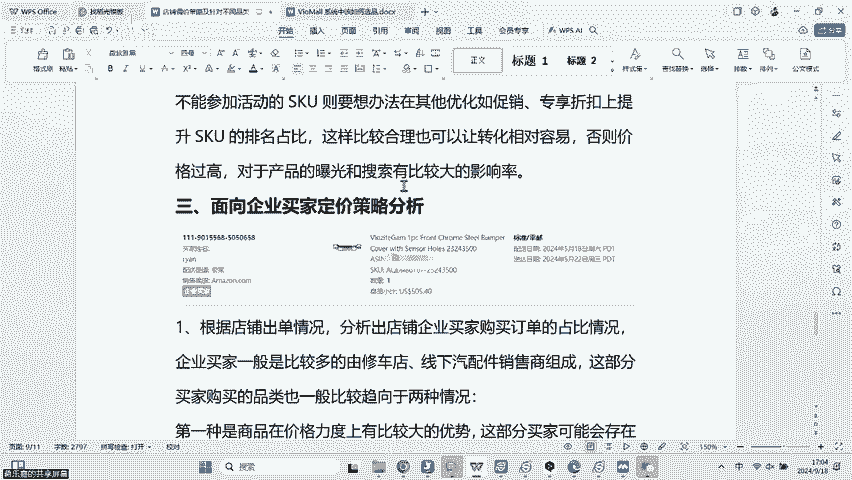
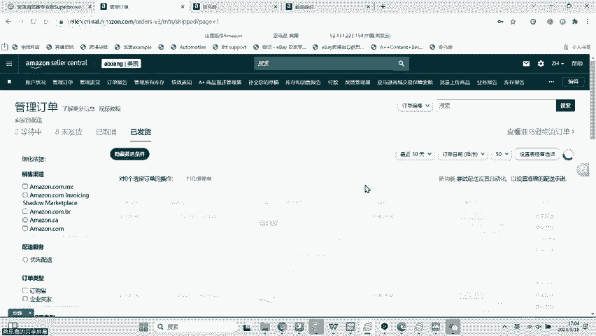
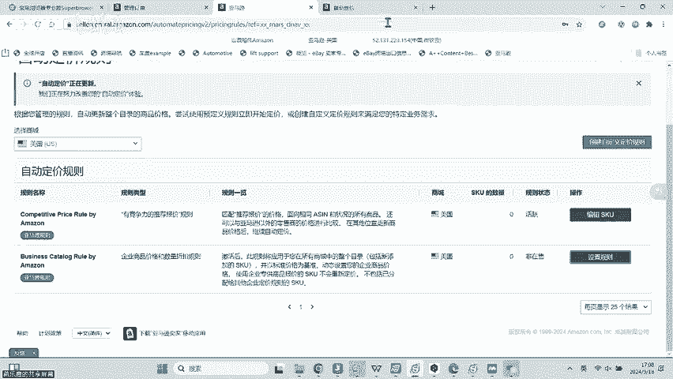
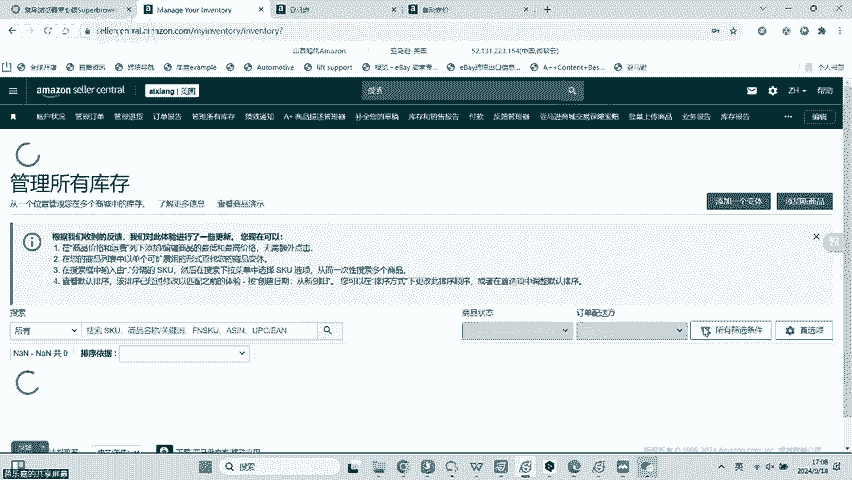
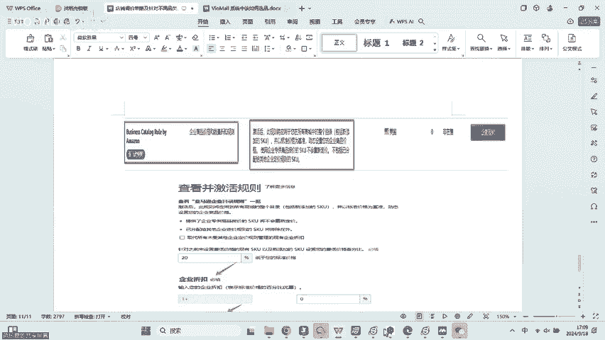
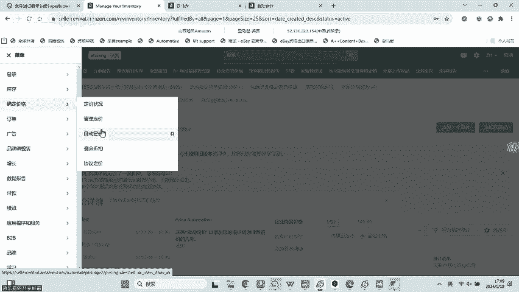
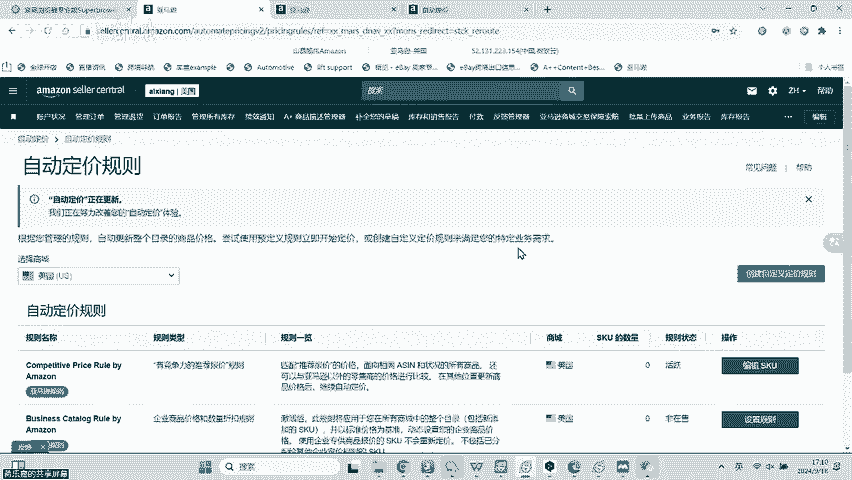
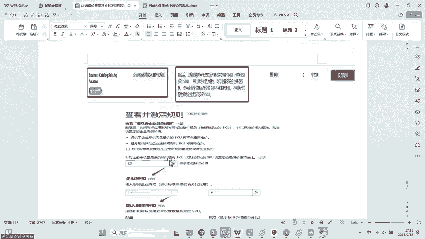
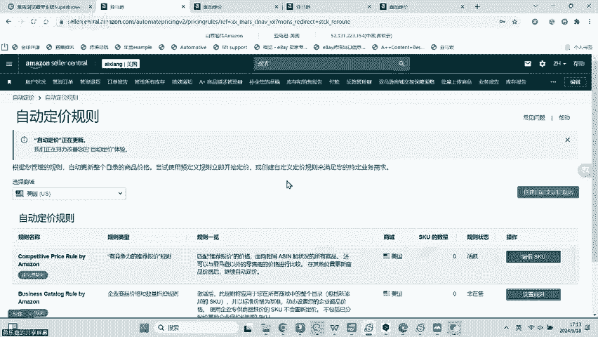
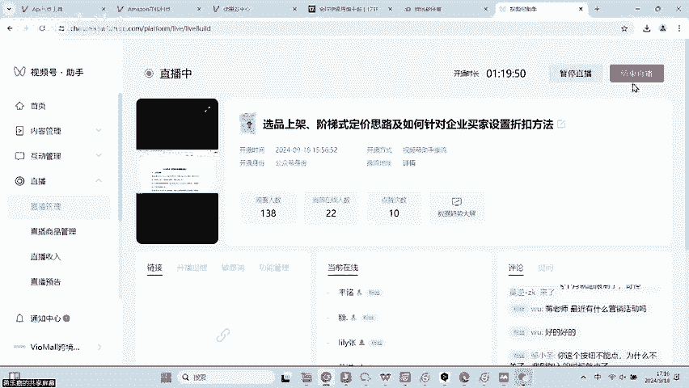

# 第二课-阶梯定价、企业定价逻辑方式-微茂平台亚马逊汽配运营 - P1 - VIOMALL - BV1Ygs6eRE11

来给大家讲讲这个定价啊，这个也是我们很多新开销商可能不太。哦，亚马逊visa卡是不是要办双B啊？对对对，那个努力向前啊，那个visa要办双B卡，是你可以办visa或者是master的卡都可以啊。

双B卡没错啊，那个努力向前，你问的是对的哈，你问的是对的。OK然后这里呢我们很多新的小伙伴，可能他这个接触我们平台不久啊，可能也没怎么呃弄过这些什么定价啊，这些操作可能不太不太不太了解，也不太会。

所以这里的话呢，我会把我们这个。调价啊定价啊给大家讲一遍啊给大家讲一遍。我在开始之前呢，我先跟大家讲一下，就是我们现在调价定价啊，这个地方啊换了啊，定价这个地方换了。啊，大家稍等一下，有个电话把挂一下。

啊，我们现在在调价和定价呢呃在也是在在线刊登里面啊在在线刊登里面，但是它现在变得跟之前不一样啊，大家稍等我一下，我现在要把这个网页给它打开啊，我现在把这个网页给它打开，我现在打不开。大家稍等我讲。

有点慢。亚马逊经常打电话给我，让我设置企业折扣。真的假的，这么搞笑的这些人。😊，那，张品是不是你店铺里面经常出一些企业买家的订单啊，就大家可以自己去观察一下啊。

就自己的店铺里面是不是经常就在这个管理订单里面。如果你那个企业买家的话，它这里会显示的，看到没有？配那个。我看一下啊，大家看到没有？在这个销售渠道这里，如果他是企业买家啊，就是像我这里一样啊。

它会显示这个企业买家，看到没有啊，就是我今天下午也会讲一下这个针对企业买家的一些定价啊，针对企业买家的一些定价。因为如果你的店铺可能真的是企业买家比较多的话，可能可能还真是会嗯被亚马逊烧了啊。

还真是被亚马逊烧了，这个这个我也不太好说啊，我也不好说。然后啊我看看应该还没打开啊，太慢了，我真无语。平台这个优化一言难尽啊。行吧，没关系，那我们等会儿再讲啊，我先让他自己慢慢打开。

然后这里的定价的话呢，我给大家一个建，那我不知道怎么批量设置啊，那你等一下看一下就知道了啊，我等一下差不多就要讲了哈，我这里先给大家讲一下，就是我们店铺里面定价的4种类型啊。

就是我个人把它定义为什么促销微力正价和利润款啊，就是我们的店铺里面的SKU啊，你不管它什么SK你甭你你都不用管，你甭管它啥SK啊，总之它大概就是由这几种类型给大家组成啊。

你不用管它什么啊什么啊多少多少钱啊，它是什么什么品类啊，你不用管你就大概把它笼统的看看成什么，你就大概把它笼统的看成啊，由这四种类型的SK给大家组组成。然后这4种SK的话呢。

它与之对应的就需要有什么有对应的SK还有加价的一个倍数利润点，还有这个组合的SKU相互掩护啊，所以说呢我这里给大家讲一下啊，就是说那第一个我们先给大家讲讲这个促销款的SK。然后促销款的SQ顾名思义。

他是搞促销的啊，可能就是纯粹就是拿来做一些什么拿来做一些引流的一些这个产品。那像我们平台啊，像我们平台啊纯引流的这个SQU的话呢啊可可能很多都是一些什么不是可能啊，是一定啊一定都是一些比较便宜的产品啊。

一定都是一些比较便宜的产品啊，就比如说20美金以下的啊，就很多比如说什么这个门把手啊啊，比如说这个空滤啊，比如说这个晴雨档这个情不是情雨的那个雨雨刮啊，雨刮啊，还有这个什么呃什么一些小的螺母啊啊。

还有一些反正就是一些比较便宜的一些品类啊，我见的最多的哈。我跟大家讲一下，我见的最多的这个促销款的SQ主要就是什么主要就是这个呃我刚刚提到那几个类型啊，主要就是那几个类型啊。

还有一些什么这个玻璃升降器开关啊，这个也算是啊比较还有那个什么。镜面玻璃啊，就那个后视镜的一个玻璃啊后视镜的一个镜面玻璃啊，也即也是属于我刚刚讲的这个范畴啊，就属于是促销款的SKO啊。

反正你就是把它定义为什么？定义为你店铺里面啊，可以亏亏本的啊，当然了你说是不是只有这些肯定不是啊，就你如果呃这个自己啊去做一些活动，就比如说我刚刚提到的什么赏金猎人啊，优先中心啊，挖宝促销啊。

里面是不是它里面这些相当于打完折之后的SKU啊，你也可以把它拿来做什么，你也可以把它拿来做促销也是没有问题的啊。所以说我主要是跟大家讲，就是我们的店铺里面一定要有这个促销款的SKU。

然后这个促销款的SKO呢在店铺的总量的话呢啊大概是在2%到5%啊，数量的话大概就是1000到3000个啊，这个就根据你自己的SQO总数来说啊，你SQU越多，那你肯定对应的你这种搞促销的SK也要多一点。

是不是你说你店铺里面有1万个啊，那你可能有1000个啊，2000个产品是这个做促销啊，那你比如说你店铺有10万个，那你可能就有3000个5000个产品是拿来做促销了啊。

它的作用就是主要用于什么单量的一个提升啊，预防店店铺的一个风险就因为我们一定要有一些产品啊，能够经常出单啊，即便是发生了什么发生了这个差评，或者说发生了这个ODR缺陷的话。

我也可以我也可以快速的什么利用我这些低价的产品啊来做促销啊，来来这个怎么样来提升单量扛过去。比如说我现在已经95单了，对不对？然后我突然来了个差评啊，我这个ODR就超了。但是我还有5单。

就可以这个快速的怎么样把这个DR给扛过去，那我就可以把这些促销款的产品全部拿去打折。啊，大家不要觉得说啊我打折我亏了，你要知道，如果说你丢购物车了，你亏的更多。啊，这个我不是危言耸听啊。

我们很多小伙伴会觉得说亏了。但是对于很多我们的这个老伙伴来说啊，我们的老伙计来说，大家都知道啊，有单才是好有单啊，只要有单出就不存在亏啊，有单出就不存在亏，你把那个便宜的10块钱的。

哪怕是一单亏个3块钱4块钱都无所谓的啊都无所谓的。因为你只要有单你就能赚回来啊，但是如果你没单，那是真真的很尴尬啊，你丢了购物车，那是真没单啊，真没单，那才是你最痛苦的时候好吧。

所以说啊这个一定要有这个促销款的产品。然后这个促销款的产品，大这个设置的价格倍数的话啊，以以大家能够接受的底线为准啊，就比如说啊这个单价十以下的啊，你要促进出单，你就可以把它设置为0。3到0。5倍啊。

当然了这个我建议啊就是你倍数越定的越低，你一定要是结合我们平台的活动啊，就比如说优先中心的，比如说挖宝的，比如说赏金猎人里面的啊，我是建议大家一定要结合啊这种活动的SKO来做，否则的话。

我觉得你亏的有点惨啊，明明我们平台有一些活动啊，可以给到你，你就不要自己去垫钱去亏嘛，是不是何必呢？是不是？然后如果说你不结合这个抵扣啊这样子的话，那你可能价格倍数就要高一点。就比如说0。5到0。7倍。

或者说0。4到0。6倍啊，然后20块钱以下的，你就可以给他设置为0。4到0。7啊，或者说0。5到0。8啊，这个反正就大家自己结合自己的实际情况啊，然后这个促促销款的产品SKU呢呃你产生的订单订订单量啊。

它一般来说都会随着你价格的调整啊，变化而变化，什么意思呢？就是你价格调的越低啊，出单的几率就越大是吧？所以说你是可以让他啊短时间内大批量的出单啊，你也可以是什么？你也可以是给他设置1个0。85或者0。

9这个倍数啊，让他每个月啊或者每每一个每一段时间内都会稳定出单的。就比如说。我这个月出了200笔订单啊，然后里面可能有三四十笔订单都是这个促销款的啊，然后一算啊，可能我做促销的款的SKO啊。

这个赔了有大概200美金啊，算上佣金可能赔了300啊，但是我整个店铺里面啊赚了1000美金啊，那我觉得这个也是合理的啊，也是可以接受的啊，因为你一定要有一些什么。

一定要有一些流量的SKO来来给你做一些单量的托底，知道吧？一定要有一些这样子的情况，否则的话你店铺啊，可能啊招到一个这个这个风险或怎么样，你就扛不住啊，招到一个你可能就扛不住，所以说你压力会很大啊。

所以一定要有然后这个促销款的SKO呢啊，你要去哪里找呢啊，你可以从这个优券中心啊，挖宝促销啊，然后这个什么啊赏金猎人啊，还有这个什么通用品，还有这个数据包啊，或者说选品中心里面啊。

你可以去从这里面去找啊，你也可以直接。啊，通过我们给到的一些这个优数数据包的一些清单啊，也可以也是可以的。没有问题啊。好吧，这个是促销款啊。

然后第二个就是我们店铺里面要有一个一些一个SKO的类型就是什么？就是我们的微力款。然后这个微力款的SK呢是什么意思呢？就是啊赚一点点钱不多啊，就是赚赚一点啊，但是不多啊。

然后这个微力款的SK在你店铺的总量要占到10%到20%啊，那肯定是SK越多，那占的总量就越低嘛，是不是比如说我现在有10万的SK啊，那我可能有10%就1万左右是这个微力款那比如说我现在只有1万的SK啊。

那我可能就有2000个是这种微力款啊，这个得根据你自己店铺里面的总的SKO来啊，才知道是吧？所以说这个微力款的SQ呢主要就是放一些热销的这个单价比较低的一些产品，可能是比如说20到60之间。

比如说我这个也是看大家自己了啊，就我只是给个建议啊，就比如说我可能就是选这个20到40之间，我就不会选6。啊，这个只是给个建议而已啊，反正就大家自己看啊，或者说你是其他一些价格区间。

但是建议价格不要过高啊，毕竟高的S毕竟高价的SK，我们尽量拿来赚钱啊，就不要把它拿来这个。呃，做做活动啊，或者说不怎么赚钱是吧？所以说尽量选择一些中低价的啊，不是低价，是中低价啊。

中低价这样子的SKO啊来给你做微利款。然后这个微利款呢，一般都是市场的一些热门产品啊，主流产品，然后价格的倍数的话呢，我建议大家去设置的话，就大概是在贴着成本，就比如说1。12到1。25之间像如果是1。

12的话呢，大概率就是什么？结合我们平台的活动的，就比如说优惠券中心啊，比如说我们促销的那个平台可以给大家做抵扣的啊，比如说这个赏金猎人的啊，比如说这个挖宝的啊，这样子你来贴着本外啊，即便是你贴着本。

你还有个10%的利润啊，如果你不是你是纯自己啊，我选择了这些，那你可能大价格就要调高一点，就比如说1。17啊，1。2啊，1。25啊啊是吧？所以说。这个要看大家啊，你对这个微力款的SKO你的定义是什么？

如果说你纯自己来做活动啊，那你可能就要选择了SQU就怎么样，一定要啊这个灵活啊，一定要灵活，你可能就要选择一些啊这个20到40的。如果说你是配合我们平台的活动的那你就不用管它多少钱啊。

你只要是把它定义为微利款啊，那你就大胆的直接给他做个1。12或者1。1倍啊去卖啊，你都有利润啊，你也不用担心会亏是吧？所以说这个微力款的SKU我的建议就是。它的利润啊可可以是小赚或者和你的成本持平啊。

具体到底是小赚还是成本持平，取决于分销商，你自己啊，就是你到底是想要走多一点单量，还是想要提高这个店铺的权重比要多出单啊，还是说我要靠这个赚钱，只是说赚的不多啊，但是他又能够带来单量的这种情况。

那具体的不同的情况呢啊，你对它的一个运营的思路和方法是不同的，是吧？对它的运营和思路方法是不同的啊，但是它的占比大概在你的店铺是10到20%之间，好吧，然后这个微力款的SQ你从哪里来呢啊，还是一样啊。

你可以去微券中心里面找啊，选品中心啊，挖宝促销数据包仓库，还有我们分享给大家的一些清单等等啊，你都可以从这里面去挖出来啊，你都可以从这里面挖出来。啊，这是第二种。那我们平台的一个。这个SQ的类型啊。

我我建议大家的一个类型。然后第三种是什么啊？第三种就是我们。啊，第三轮就是我给大家讲的这个什么，就第三种就是我给大家讲的这个。这个正价款的一个商品啊，正价。然后这个正价款的商品呢啊顾名思义。

它一定是什么？它一定就是不是贴钱的嘛啊，他也不是不赚钱的嘛，是不是他一定是赚钱的啊，他一定是赚钱的。所以说这个正价款的商品呢，这个商品应该占比在店铺里面的总SKU是30%到50%啊。

然后这部分的商品应该是有一定的销售量的品类或者SKU啊，然后这个价格倍数呢啊你可以把它定在1。25到1。35之间，并且这些正价款的商品，它的客单价不会太低。啊，至少可正都是60起步。

比如说60到120或者60到150啊，就是说你可以把它定义为正价款。然后它的倍数你可以给它设置为1。25到1。35之间。然后利润的话就是在8%到20%或者14%啊，具体利润多少。

那你要根据你自己参加有没有参加活动来定，就比如说啊你参加了平台的一些，比如说百分百抵扣啊，50%抵扣啊啊，是吧？你给他比如说百分百抵扣，你给他设置个百设置个1。1倍啊，你的利润都有差不多50%左右啊。

那比如说50%的抵扣你给他设置为一倍啊，你都有这个15%左右的一个利润啊，所以说我们要根据它设个SQO它的一些情况来定啊，到底要怎么给他定价是吧？如果说你纯粹什么活动都没参加。

那你可能你的这个价格倍数就要定在1。3%左右啊，或者1。25%到1。3之间或者1。3到1。35之间是吧？所以说啊你要根据他自己的情况来定，你到底要赚多少钱啊，然后我的利润。也是多少？

我的利润率是多多少啊，大家自己心里面有个数，然后这部分啊这个正价款的这部分商品呢，它一定是什么？它一定是有一些什么？有一定的市场的，并且它会持续或者阶段性的产生销售的产品。啊。

什么意思就是一定不是纯新的产品啊，一定是在店铺或者说啊在我们平台有过销售的一些产品啊，这样子的产品会比较好做一些做你的这个正价款的商品啊，会比较好。如果你拿一些纯新品啊。

或者说啊这个纯冷门的产品来来去做正价款啊，可能它的动销就比较低啊，可能它的动销就比较低，可能它的转化就没那么好啊，然后你可能就会持续性出单啊，可能就不会持续性的去出单啊，所以说正价款的商品啊。

我是建议大家啊一定要符合这个条件啊，一定要符合这个条件。并且。你会根据你自己正价款的一些SKU啊，它的运营思路不同啊，做一些不同的调价。比如说做一些不同的广告的思路方法啊。

比如说做一些不同的一些促销的思路方法啊，你可以选择啊这个市场热门的啊，容易转化的，然后平台平台销售品类比较高的一些SKO来选择啊，那你说我怎么才知道哪些品类好转化呢啊。

那你比如说我们之前分享的一些直播的数据啊啊，是吧？比如说包括在下面啊，我们这个下面啊，也会有这个啊也会有这个这个这个这个推荐的这个啊平台比较热门的一些品类给大家啊，你都可以从这里面去找啊。

你都可以从这里面去找。比如说啊我比如说我找到这个保险盖啊，或者说比如说找到这个中网啊，那我就可以把这个英文，这个中网的英文啊，拿到我们平台啊，你怎么怎么。怎么挂了呀？我去。大住。把褂子杠住了。无语。啊。

你都可以拿到我们平台。我刚刚跟大家讲的这个什么选品中心是吧？你都可以拿到我们平台的选品中心里面来啊，去把那个品类复制进去，然后去找一下啊，然后去找一下，你这样你就可以知道啊，它不同的一个品类是啥啊。

所以说正价款的第三个类型就是我们的正价款。然后第四个就是我们的利润款啊，利润款顾名思义就是在正价款的基础之上啊，利润更高啊，在正价款的基础之上，利润更高的一些品类啊。然后这个正价款的商品的话呢。

占比啊在我们平台的占比也是大概占了总SKU的18%到25%或者更高啊。这个多店铺的卖家，你可以占比更高一点啊，到40%，50%都是可以的啊。然后这个价格倍数啊。

在不考虑活动的情况下大家可以把它的价格倍数定在1。35到1。4啊，1。45之间都是可以的啊。但是我最高啊，我建议大家不要超过1。45啊，你这个价格一旦上到1。45之后，说实话啊，我讲老实话不是很好卖啊。

不是很好卖。因为我不是说所有的产品都是有一些品类是好卖的，比如说改装件啊，就比如说那个尾翼啊啊避震哪啊，比如说还有一些那个轮轮轮轮眉啊啊。

这个这些都这些都属于就是我刚刚讲的那个尾翼这个轮眉都属于改装件啊，你把它定在1。45以上也能卖的出去啊，也能卖的出去。但是你要去打广告啊，你要去打广告，并且你要去把自己如果有条件，你把标题。

然后把这个图片给它优化一下是最好的啊，找一些帅气的这个赛车图啊，放上去啊，这样子才能会才会比较好的去促进你的销售啊。因为这种改装件人家就是看车帅不帅是吧？人家就是看车帅不帅啊。

所以说如果你要去做这个利润款，你的价格不要定的太高啊，你价格不要定的太高啊，最高就1。45就可以了。然后这个里面的话呢啊利润款的利润款的SKO啊，这个比如说利润款你SKO拿去参加一些活动的。

就比如说参加了我们平台的一些可以抵扣的活动啊，那你就要把这个价格当。下调啊，能够比较利于你出单啊，能够比较利于你出单和你比较利于你转利于你转化。然后利润款的SKOSKO呢也分为中高价值的SKO。

就是说有高价也有中等价格的SKO。然后分销商你要根据自己的实际情况啊，就你店铺的实际情况和需求点啊出发点来考虑你上架的SKU到底是上一些中高价，还是上一些中等价，还是上一些这个中低价啊。

总之它都可以是作为一些利润款。因为就算是尾翼啊，或者说一些轮眉，它也有20的，也有30的，也有50的，也有150的，是不是？那不同的价格，它代表的都是什么代表的都是一些啊，你可以针对它做一些不同的一些。

这个定价思路知道吧？你代都代表你可以针对他做一些不同的定价思路啊，所以说啊这个我们的分销商，你自己在实际的这个运营过程中，你当你把这个产品给它定义为这个种类之后啊，那你就一定要怎么样。

你就一定要把它想好啊，那我到底怎么去啊确定啊，它的价格倍数啊，不要盲目的给他做一个疯狂的高价啊，没有用的啊，没有用的。然后呃我再跟大家讲一下这个利润款的这部分的SKU的这个产品啊，可以是常尾的产品。

或者是在店铺里面啊订单里面产生比较少销售，或者说啊偶尔才会出单的这一种品类。就比如说啊可能我店铺里面有一些品类啊，可能10天半个月才会出单啊，那这种可能就比较适合做这种利润款。为什么？因为它属于冷门啊。

属于冷门。所以说利那个利润款的产品很多都是冷门，然后动销比较低的啊，动销比较低的动销比较低的好处就是没什么人跟你竞争啊，然后上架的积分要求比较低啊，所以说这个是它的好处啊。

但是而且它的好还有一个好处就是。冷门的产品动销低，竞争低，它会产生比较高的一个销售和利润啊，它会产生比较高的一个销售和利润。它可以作为你店铺的一个利润的支撑点来源啊。

就比如说我可能店铺这个月赚了1000块啊，可能有50600都是从什么？都是从这个呃我刚刚提到的这种冷门产品，这种利润款的SKU里面来的啊。所以说啊这个这一类的产品，它的利润一定是要有的啊。

它利润一定是要有的。那有个20%到30%之间啊，这一类产品即便是在不多的销售的情况下。怎么样？它都可以产生比较高的一个利润值啊，在不多的情况，不多的销售情况下，它都可以产生比较高的利润值。

因为它的利润啊百分比就是比较高。我刚刚跟大家说了啊，它利润应该是在20%到30%之间啊，那到底是20%到还是30%，那就根据分销商自己的情况定。比如说我定20%，那有可能就是这批产品啊。

它不是我做活动的产品啊，那比如说我定30%那有可能就是我参加了平台优惠券啊，我可能参加了平台的挖宝啊，我可能参加了平台的这个赏地猎人的产品啊，可以赚30%啊，所以说具体你要定多少啊。

那你得根据你自己的SKU来定但是我们的平我们的店铺里面一定要有。啊，一定要有这一类的SKO知道吧？啊，我们的店铺里面一定要有这一类的SKO如果没有的话呃，可能对我们的店铺的这个健康程度来说不是很好啊。

对我们的健康程度来说不是很好。然后冷门啊我刚刚提到这个利润款的产品啊，大部分都是冷门常尾。然后这个冷门常尾的话呢啊，那那家稍等一下，我打几个字。啊，这种利润款的这个冷门常尾的SKO来源的话呢。

你就可以从选品中心啊数据包仓库。然后还有系统推荐。然后还有就是店铺啊或者说你平台啊，就比如说你店铺里面有哪些不是很好卖的哎，SKU就属于这种。还有就是平台比较冷门的SKO也属于这种。

还有就是我们给大家整理的一些数据包啊，也属于这种情况啊。那你都可以根据这种情况啊，自己去选择SKU去上架啊，自己去选择SKU上架。然后这里的话呢啊我们也给这里的话呢，我也之前给大家整理过啊。

我们平台啊热门的30个品类啊，大大家应该啊都有印象啊，都有印象。啊，大家应该都一下，还有就是什么冷门的30个品类啊，也有啊，在这个里面也有啊，应该也都有影响啊，应该也都有影响。然后大家可以看一下啊。

在这个里面啊，它会有这种啊不同的一些建议啊，不同的一些建议。然后第三个啊，就是我们今天啊要讲的第三个就是面向企业买家啊，如何去定价啊，就是我们很多我们的小伙伴说啊。

就是我们像比如说我们刚刚土豆这个小伙伴，他就说啊用那个亚马逊天天给我打电话啊，让我们设企业折扣啊，那到底你要不要设企业折扣呢啊，这个可能会跟你的订单挂钩啊，就就是我店铺里面订单啊。

就是我这个企业折扣的订单，到底企业买家多不多。

是吧如果说啊我这个店铺里面的订单，企业买家真的很多，那你肯定要针对什么？你肯定要针对你这种企业买家怎么样去做一些不同的一些什么不同的一些思路嘛，是不是？那像比如说我这个里面啊。

你看我这里面啊十几二十笔订单，就一个企业买家。那可能对于我来说，企业买家就没就没有什么太大吸引力啊，我也可以不用对他做。但是如果说啊我10笔订单里面有两笔、3笔，甚至4笔都是来自于企业买家。

那像这种情况的话呢啊，我针对企业买家做一些什么做一些专享折扣，就显得什么非常的重要啊，显得非常的重要。那我就要针对这种企业买家怎么样啊，专门给他们设置一些啊不同的促销啊，专门给他设置一些不同促销。

那我怎么去设置这个促销呢啊，那么第一啊你可以在这个店这个这个亚马逊后台啊，就是我们刚刚讲了这个亚马逊后台啊，这个亚马逊后台啊，这我先啊这里我忘记跟大家讲了，就是企业买家的优势是什么？

企业买家的优势就是第一客单。价高啊，企业买家的客单价基本上都比较高。为什么？因为他们一般都是线下的实体店，或者说线下的一些商城，他们买的这个产品一般都价格比较贵。然后第二个就是企业买家，他买的量比较大。

而且他跟你的沟通比较及时啊，就比如说啊我需要去向企业买家索要一些信息啊，或者说我想让他帮我拍个照什么的。因为他可能也只是线下店的一个员工，所以说他会比较快的来反映你啊，告诉你啊，你你要我拍什么照。

我会可能会比较快的给到你。但是如果你找那种，如果他是一个普通的买家。怎么样？他如果只是一个普通的买家，他可能就没那么快啊，给你做出这个响应啊，比如说你找他要个什么信息，可能半天都要不来啊，这是很正常的。

知道吧？这是很正常的。然后第三个就是什么售后的几率比较低，为什么？因为企业买家如果是线下的维修店啊，这些人都是专业人士啊，这些人都是专业人士，他知道该怎么去装。比如说我们可能普通的买家买了个轴承。

或者买了个什么，他不会装，他就会给你差评，他就会投诉你啊，他就要退货。但是如果企业买家只要这个产品他是适配的，他知道怎么装，他就不会来找你啊，并且你可以达成一个什么长期的合作啊，所以说第长期的合作。

就这种潜在的长期客源，也是企业买家一个优势，就如果你能够跟这种企业买家达成长期的优势。因为我们平台SKU多嘛，我们有几十万的SKU基本上可能企业买家他想要的一些配件，只要不是超级超级冷门。

或者我们没有代理的，比如说什么玻璃啊轮胎呀，比如说这种什么新能源的这些汽配件啊，基本上可能都会有啊，基本上都会有。所以说他可如果你能够把它发展为你的一个长期的客源。啊，你跟他保持一个长期的联系啊。

就假如你真的联系到这种企业买家啊，你你比如说你加了他们的一些什么社交软件啊，或者说一些这种类似于我们国内微微信的这种。东西的话呢啊那你就可以跟他啊直接做一个线上沟通啊，他要什么。

比如说啊他要一个呃2000年的这个凯美瑞的这个什么前轴承啊，后后尾灯啊，这个前尾灯前大灯啊，后视镜啊，这些他可以直接跟你联系嘛？啊，那你就可以直接啊给他供货是吧？你在我们平台下单啊，你也不用经过亚马逊。

亚马逊，他可以直接转钱给你是不是啊，这样还可以省去这个佣金是吧？还可以省去用这个佣金啊，所以说他也是一种长期的啊潜在的这种客户来源是吧？那到底我们针对这种企业买家怎么去做这个设置呢。啊。

怎么去做这种设置呢？啊，第一个啊，我们可以在店铺，我们我们这个这个店铺后台。

啊，我们可以在我们的店铺后台啊，在我们的这个如果你是小规模啊，我这里讲的第一种方法是小规模的啊，就小范围的去做这个设置。如果你是小范围的去做设置啊，就比如说这一个产品啊，我要去给他家做一个呃。

我要去给他做一个这个企业买家的折扣啊，那比如说第一个产品是吧，我要做这个折扣啊，那你可以在这里。在我们的这个下面啊有一个查看参考价和企业商品的价格啊点进去。然后这里有一个企业商品的价格。

那你可能就针对企业买家。比如说我现在卖给普通人是153，对不对？那我现在把它针对企业买家，我设定149。99啊，149。9吧啊，我假如设定1149。9。

然后这这下面呢啊它会有一些啊这个不同的一些这个阀值啊，就比如说不同的选择值然后这里的话呢，他可能第一个可以选择优惠百分比啊，第二个他可以选择固定的价格啊，那这里的话呢你就可以选择啊。

这个商品从多少钱到多少钱啊，我可以给他设定一个多少的百分比。比如说啊100的啊，我就可以给他设定一个啊3%啊，或者说啊优惠百优惠分之5%啊等等。那你也可以固定价格，149。9啊。

我就假如举个例子给他设定为一个固定的价。比如说我这里就给他设定为一个固定的这个价格，149。9，然后我就点保存啊。当然了，这个是针对小范围的啊，你部分的SKU你可以这样去弄啊。

你可以部分的SKU这样可以这样去弄。那你说啊我要多的，我批量的怎么去设置。可能我们很多方向商它涉及到的可能是一个批量设置的问题。那批量设置在哪里呢？啊，在我们的这个。

亚马逊啊，我们的这里菜单里面啊，这里点进来，这里有一个目录，是不是啊？不对，这里有一个。确定价格，然后这个这个确定价格，这里面呢有一个自动定价啊，大家可以看一下，在这个价格里面有个自动定价。

你点进去是吧？

啊，你等等等亚马逊更新。嗯。啊，在我们嗯稍等一下啊。好，然后在这里的话呢，它会有第一个有竞争力的报价推荐。这个是什么？这个就相当于是亚马逊帮你去做调价啊，他会去对比整个亚马逊的一些价格，然后帮你做调价。

大家不要去开这个啊，因为有一些人是卷毛，他把价格设置的很低，或者说啊有一些不是做我们这种分销的啊，你如果把它这个加进去的话，人家是自产自销的，他可能我举个例子，有一个产品啊，比如说一个鼠标啊。

自产自销50块啊，如果像我们平台拿货价可能最少都是75。那如果你想一下，如果他把你的价格调到49。9，你得亏多少是吧？所以说第一个这个要去开啊，第二个这里啊才是我们要去看的啊。

这里有一个企业商品价格和数量折扣规则啊，这里有一个企业商品价格和数量折扣规则，然后我们这里点进去有一个设置规则。

Yeah。啊，然后点进来之后呢，大家可以看到啊，它这里就会有一个啊这个相关的一些这个这个设定啊，然后这里的话呢也会有一些常见的问题啊。啊，这里也会有一些常见的问题啊。

这这上面啊都会有一些你大家可以自己去了解一下啊，大家可以自己去了解一下。然后左边这里才是我们要去设置的啊。然后这里的话呢，第一个啊这里有一个要求啊，这里有一个低于您的标准价格，必填啊。

一般标准价格是什么？标准价格就是你的挂牌价。啊，标准价格就是你的挂牌价，你可以填百分之啊，最少还是20%，你可以填30%，你可以不用保持不变啊，就20%。然后在这下面啊有一个企业折扣啊。

这个企业折扣呢就是你针对企业买家啊，把你店铺里面所有的SKO怎么样啊，设定一个不同的一个价格百分比啊，就比如说啊在这下面啊，你买不同的一个数量啊，然后你给到企业买家的一个不同的折扣比。

就比如说买一个是吧？买两个是吧？买三个买4个买5个啊，买一个打百三折啊，打3%啊，买两个打4%，买5个买三个打5%，买4个打6%啊，买买5个打8%啊，这个只是举个例子啊，你别你别大家别学我啊。

我只是举个例子，我告诉大家怎么去设置，好吧。然后你给他设置完了之后啊，你就可以给他点一下保存并激活。然后到了一定的时间段啊，亚马逊就会帮你去做这个完成的激活。然后只要他是企业买家啊。

他带了那个我刚刚说的这种企业买家的这种标啊，哎那个企业买家的标啊，就像这里啊，他只要他是这种带企业买家的这种标啊，他就可以获得你给他设置的折扣啊，当然前提是你设置的那个折扣，是他能够满足的啊。

他能够他能够去做对应的这个满足条件的啊，他才可以去做对应的折扣，否则的话是不行的啊，否则的话是不行的啊，这个生效的时间也很快啊，生效的时间也很快。

然后我这个文档里面呢也有针对这个企业买家的一些官方的一些描述啊，大家到时候如果你确实你想了解这个企业买家他具体的一些定义啊，具体的一些这种要求啊规则啊，你也可以自己把这个链接复制进去然后去到什么。

去到这个亚马逊里面打开啊，自己去研究研究啊，也是可以的好吧，O，针对今天的。

呢我的分享就到这里差不多就结束啊，我们的这个培训到这里就结束啊。今天的话呢主要是第一个啊告诉大家啊，我在我们平台怎么选品。然后第二个啊这个产品的一个定价分析。然后第三个啊，我们这个针对啊冷门啊。

这这这个这个这这针对企业买家啊，我怎么去做一些折扣的促销。然后我跟大家讲一下，就是我们本周啊，本周五在我们深圳的线下啊，本周五在我们深圳线下有一个啊卖家一对一诊断啊，卖家一对一诊段啊，大家可以。啊。

这就本周五在我们这个深圳的线下有一个亚马逊卖家一对一店铺诊断啊，然后这个主要是讲第一个啊，就是掌握店铺的诊断方法啊，找到问题所在。第二个流量提升的方法啊，就帮助大家店铺提升。第三个店铺实操指导一对一啊。

在我们的很多群里面都有去推这个活动啊，就是在我们的后天啊，9月20号下午两点在我们的深圳运营中心啊，我们的坂田啊，这里大家可以来线下啊，如果想要做店铺诊断的话，大家可以直接来线下带上你的电脑啊。

一定要带上电脑啊，来到我们线下做这个店铺诊断。然后这里。微贸的全部客户经理都去嘛，呃，不会不会，只只是我们培训培训部门，还有运营，还有那个那个运营部门。啊，只是我们如果你有其他的问题的话呢。

你可以到时候线下来有问题，我们再再聊，好不好？因为我们运营团队都在这边啊，基本上都能给你解决啊，基本上都能给你解决。如果大家有兴趣的话，可以在群里面扫码报名啊。大家如果有兴趣可以在群里面扫码报报名啊。

就在我们后天啊下午2点钟啊，在我们深圳这边线下啊。有一个啊大家如果有兴趣的话，可以来了解一下啊，来了解一下。周末上海有活动吗。呃，周末上海有的，应该是有的。我们本周是有一个线下沙龙啊。

应该是会去到呃天津、上海啊，山西有没有，我不太确定啊，但是天津和上海是有的啊，应该应该是有的啊，应该是有的。啊我刚刚有听我们的李经理讲啊。我刚刚有听我们李经理讲。好吧，如果大家还有什么其他的问题的话呢。

可以打在墨墨轩问直播吗？呃，应该不一定会直播啊。我先说啊，这种线下沙龙不是场场都直播的哈，有一些是给这个线下的小伙伴专享的，不一定会直播啊，不一定会直播。好吧，大家如果有什么问题的话，可以打在公屏上。

如果没有什么问题的话，我们今天直播就到这里分享就结束了。好吧啊，我们如果没什么问题，我们直播后分享这里就结束了啊，我等大家一分钟左右啊，等大家一分钟左右。然后这个这个清单啊，大家也可以自己去。呃。

这个清单啊，大然也可以到时候自己去去看一下啊，这个里面有平台的30个热门和30个冷门啊，30个热门，30个热门。啊，我看大家应该都没啥问题了。好吧，那我就默认大家都会了啊，都懂了。如果你再不懂啊。

你也可以私信我，好吧，你可以私信我的企微啊，私信我的企微。好吧，OK那我直播今天到这里就结束了啊，各位谢谢各位小伙伴捧场，好吧，我们下次再见啊，我们下次再见好，拜拜各位小伙伴，拜拜。

