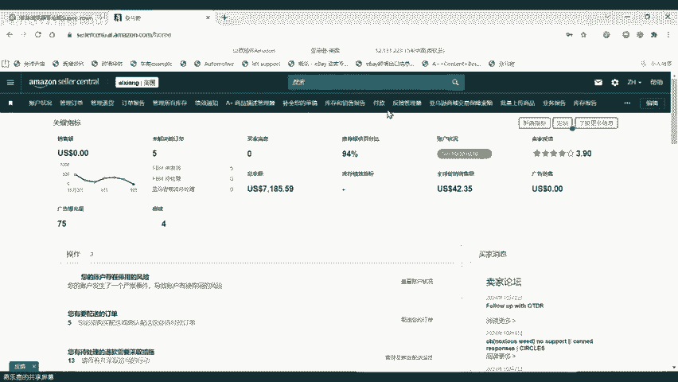
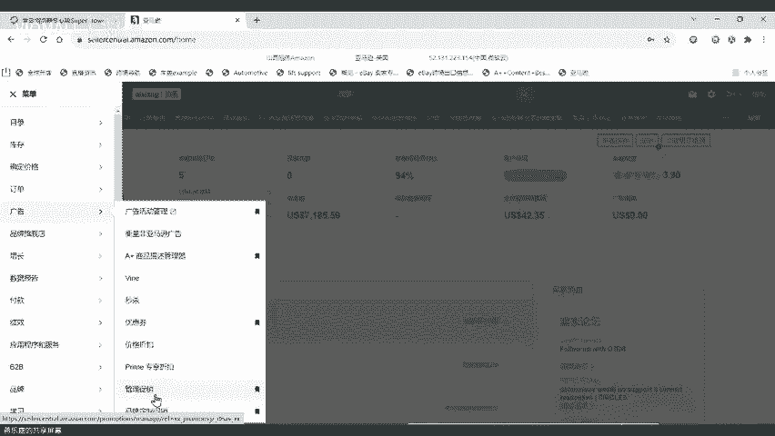
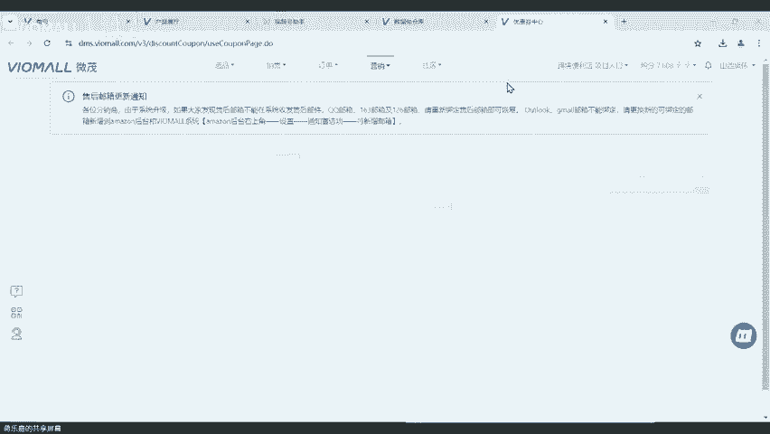
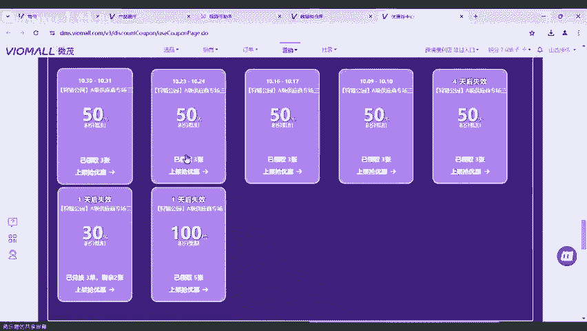
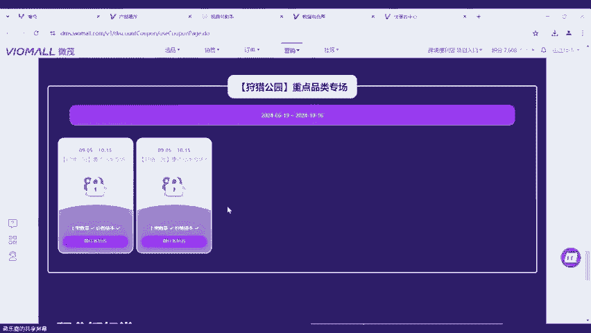
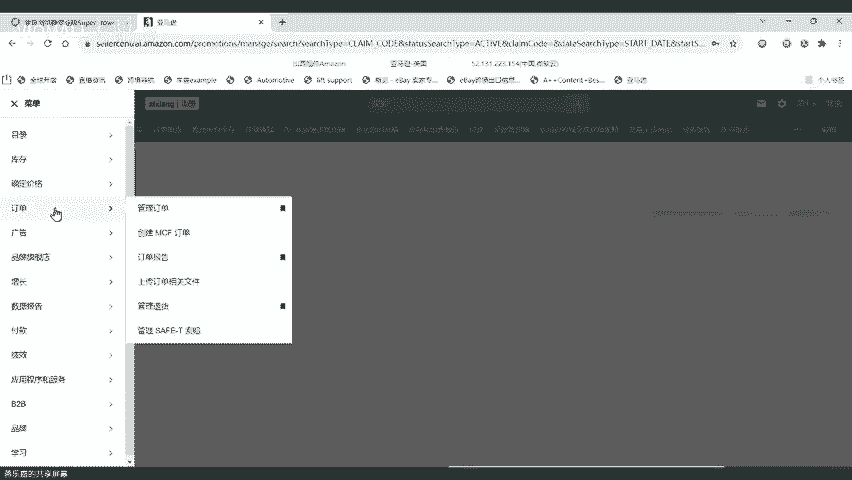
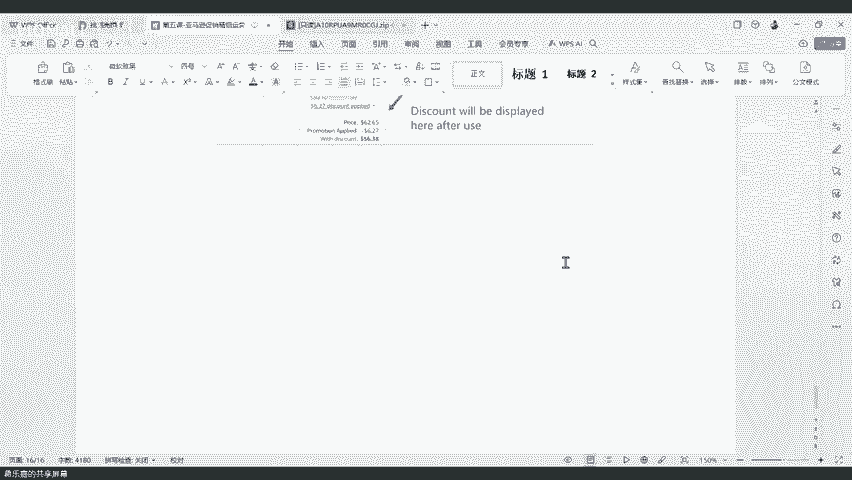

# 第五课-亚马逊促销精细化运营思路教程 - P1 - VIOMALL - BV11N21YFEyf

先给大家来分享一下这个促销的一些基本规则啊，促销的类型还有规则。第二个就是促销的怎么去设置促销，对吧？这个因为有些小伙伴可能不太懂啊，就至少你们要知道怎么去设置这个促销是吧？然后第3个啊。

第三个就是给大家分享一下啊，如何利用这个促销啊，可能配合我们平台的一些活动啊啊，结合啊这个促销的一些规则啊，做一些精细化的运营是吧？然后第四个就是啊品牌怎么去做一个定制促销。当然了这个品牌的定制促销呢。

我之前也有给大家分享过，对吧？如果我们有小伙伴啊还有印象的话，也可以去啊看一下那个啊参考那个也是可以的，没有问题啊。第五个就是啊如何利用促销设置一个专属CDK啊，专属的CDK呢。

其实就是啊从某种意义上讲，就是专门给这些客户提供一个啊这种兑换码，然后用客户用这个兑换码呢啊，就可以这个一定程度上上啊，减少啊你专门给他设置了一个促销比，就比如说有些时候遇到一些售后需要安抚啊，是吧？

啊遇到一些老老顾客，你想给他一些专门的这种优惠。啊，你可以用这种啊方法啊给他装门来来一起啊，是没有问题的。好吧，O那么我们。现在呢啊就正式开始我们的分享啊，我但是我这个抖音的这里好像有点卡啊。

好像有点卡，我这边要要调整。应该是没问题的吧。我的妈呀，怎么会这么卡？大家稍等我一下，我这边电脑有点卡死了。哎，电脑怎么有点卡死？好，我现在。调整一下啊调整一下。我看一下。抖音这边有没有什么异常？啊。

抖音抖音OOK了啊，我们欢迎我们抖音的邵邵文杰，还有付阳洋啊，欢迎你们。所，那么我们。正式开始啊，我们这边正式开始。好的，呃，第一个呢啊我们今天先给大家介绍一下，就是我们这个促销的一个类型和规则啊。

因为我们很多小伙伴可能都知道了啊，我们很多小伙伴可能知道，所以我也简单的概括一下啊，就是促销的一个呃这个类型和规则。那促销呢一般来说理论上来说就分为两种嘛。第一种就是折扣啊。

第一种就是折扣折扣的意思很明显，就是你可以给他设置一个什么。你可以给他设置一个啊折扣的百分比啊，就比如说是呃什么是可以打多少折啊，比如说打个5%啊，打个10%啊，打个15%，打个20%啊等等等。

就是类似于这样子的概念嘛，就是给他打一个折啊，给他打一个折。然后第二种的话呢啊就是买一送一啊，就是你买一个啊可以送一个啊，就是买买一个送一个。那这种的话呢，其实我们可能相对来说就用的比较少，知道吧？

各位啊，可能这种的话呢，我们用的就相对来说比较少啊。啊，这种的话呢我们可能用的比较少啊，一般来说也是呃要那种比较便宜的实惠的，我们才会去做这样子的处理和操作啊。因为你说贵的那种啊去动这种的话。

那就不划算嘛，是不是不划算啊？可能在而且呃可能我们汽配呢也有很多东西，它也不适用啊，就不适用我们说我们所说的这种方式和方法啊，所以就没办法去做所谓的什么买一送一。啊，所以但是你说啊我们能不能做啊。

可以做，只是说品类比较少。像比如说有一些啊价格啊比较便宜的什么这个请领导啊，第一要价格比较便宜。第二。要他会勤更换的，你不能说你说啊某一个什么螺丝啊或者零配件啊，一一用就能用十年的。

你说你给他做到个满意送一，那这种其实没什么多大意义，一定要找那种勤更换啊，频率高的啊，然后这个呃能够做一些这种呃调整的那这种的话，我觉得呃可能理论上来说比较好啊，可能理论理论上来说是比较好的。

否则的话可能不太合适可能不太合适。然后所以说呃这种买一送一的话，就因人而异啊，因人而异。我个人建议啊，就是我们的标办啊设置的话可能就是呃。以这个折扣啊，以这个折扣啊。

这个回放这个百分比啊为主会比较好一点啊。我个人的建议就是可能以这种形式会好一点。然后这是第一种啊，就是给大家讲讲啊我们的这种促销类型。然后第二个啊促销的产品啊，促销的产品啊，这种的话呢。

就是第一就是这个其实主要是讲什么？这个主要是讲啊买家啊要达到的几种门槛啊，什么叫门槛，就是你是为这个潜在的客户设置一个他需要购买的一个门槛为例子，还是以他这个购买的一个最低金额为例子来给他做这种促销。

那第一种的话呢，就是啊你给他做这个啊购买的数量，就比如说你要买几个啊才能开始进行这个折扣百分比。那第二种的话呢，就是金额。那比如说就是你要可能要买到10块钱啊，或者20块钱或者30块钱啊。

才可以有这个啊对应的一个这个促销。可以用是吧？呃，我个人我个人的实际的经验告诉我的话呢，就是呃促销还是非常有效果的啊，我个人的实际经验告诉我，就是促销呢，我个人觉得还是非常有效果的，而且转化的这个。

机会呢也比较大啊呃大家其实如果没有开过促销，你去开了之后，当然我不是说让大家把所有的产品都拿去做促销啊。我像我后面会讲到啊，可能有哪一些产品啊，大家可以去把它设置一定的这个促销啊，可能会比较好啊。

不是说让大家啊你说我店铺上了10万啊，我全部打低价，然后啊去做这个折扣，然后给他上这个促销，那肯定这种的话是没有必要的，知道吧？这种肯定是没有必要的，也也不太合适啊，这种没有必要也不太合适。

所以说呃肯定是要拿一些啊比较有代表性的啊，比如说我店铺里面做单的，对吧？比如说我这个店铺里面比较好卖的一些品类啊，比如说平台在做活动的啊，挖宝等等这种这样子的一个呃契机啊，大家去做这个促销会比较合适啊。

会比较合适好吧，然后啊这个是第一个啊，就是你可以选择是购买数量做促销还是啊给买家设置一个要达到多少钱做促销啊，这两个门槛。一般来说啊一。来说我个人建议是用第一种啊，就是买买买几个给促销啊。

买几个给促销这种金额能不能用也可以啊，你可以把一些单价比较高的一些品类啊，给他做一个就是达到多少钱的这样子的促销啊，是比较不错的TomyV啊，这个优秀啊这个。是这个这个老哥哪位不知道啊。

这老哥呢我也不知道OK然后我们继续啊。然后第三个就是啊促销的一个折扣力度和预算可以设置的一个金额啊，大家可以看一下啊，促销的话呢，它跟我们所谓的品牌专享折扣啊，还有我们的这个呃叫什么？哎，我现在想不想。

一个是品牌的专享折扣。然后另外一个是。呃，专享折扣跟另外一个是叫什么呃优惠券比啊，他的门槛呢相对来说会呃更宽泛啊更宽泛。大家可以看到啊，在设置促销的时候呢。

我们可以选择啊1%到50%的这个百分比给顾客什么给顾客对应的一个折扣比啊，但是如果可能一些别的啊像比如说优惠券啊，优惠券的起步门槛就是5%是吧？那另外一个品牌定制专享折扣的话，起步就是10%是吧？

所以说那两个能不能托尼哥啊，托尼哥啊，托尼哥下午好，托尼哥下午好然后优那其他的话呢啊像比如说优惠券就5%，然后另外一个呃专享定制门槛啊，那个专享促销的话，那就是10%。

所以说这两个可能对于我们有一些非销商来说啊，他们觉得啊可能这个门槛太高了，不太适合我啊，不太适合我。所以说促销呢是一个比较好的选择。并且促销还有一个很大的优势是什么？它不会受到你这个产品啊。

是不是新品啊，或者说要达到多少颗星啊的影响啊，才导致你能不能去设置这个促销啊，促销是没有什么门槛。就你只要是你店铺里面的这个SQO你店铺里面在卖的产品啊，你都可以去设置这个促销。土豆回复通语。

我是土豆OK okK好，大家下午好，各位小伙伴，大家下午好。啊，就是不会受到这方面的影响是吧？所以说啊这种理论上来说啊，它的这个灵活性，还有它的这个宽广度是最高的啊，也是最好的。

所以我个人呢也是比较喜欢去用促销这种模式的是吧？啊，所以说大家可以这个考考虑啊，可以大家可以考虑用这种啊，然后第二个啊买一送一啊，不用说了啊，就是买一个送一个嘛啊，买一个当然了，你买一个送一个。

你买的这个可能可以是贵的啊，送便宜的可不可以可以的，没问题啊，大家可以自己去设置啊，等等会儿我会讲一下啊，等会儿我会给大家分享一下，就是我们怎么啊，可能去设置这个怎么怎么去设置好它啊，这个买买一个贵的。

可能是送送送一个便宜的啊，是没有问题的啊，没有问题的。然后这个然后大家可以看一下啊，这个还有这里要跟大家讲一下，就是折扣啊，折扣就是我们设置好这个就是我们设计好一个促销活动之后，对吧？

就是我们设置好一个啊这个设计好了一个促销活动之后是吧？我们的预算就是我们会给他添加一个预算。那么这个预算的要求是100到10万之间啊，100祝大家会员日大卖笑死啊，我也祝大家大卖啊，然后就是预算啊。

介于100到10万之间。然后当买家啊，就是当我们的这些潜在的顾客啊，把你设置的这个预算用到了80%之后，你的这个促销活动就会下线。啊，就是他跟你他跟你用多少没有任何的关系啊，就是你用多用少。

跟这个没有什么关系的啊，无所谓的。但是只要达到他的这个设定的一个预算之后啊，它就会直接下线啊，他就会直接下线啊。所以说啊大家在设置的时候，我个人建议啊就是如果你的这个参加活动。

参加这个促销的A选啊都比较贵的话，那你的这个预算可能要稍微设置的高一点。啊，能理解吧。就是如果你的这个预算啊是比较贵的那种，那你的这个A选可能就要设置的高一点。如果你的预算啊，就是就是你的这个客单价。

你的A选里面的客单价都比较啊比较低的话，那你可能这个预算可以低点。我举个子啊，就我设我给大我我设计的这个促销活动啊，里面的A选都是啊两30块四五百块的这种SK的话。

那你肯定给他的一个什么预算可能就要高一点，可能要去到800啊到1000或者1500啊。如果你这个A选参加这个活动里面的A选啊，它都是比较偏样偏低偏低的话。

SK都可能是10块20块或者30块的那这种的话你可能给他的预算有个300啊，有个400啊或者有个20都够了，知道吧？所以说大家要根据你大概要对你自己设计的这些A选，它的一个价格区间度在什么位置啊。

要有一个认识啊这样子的话，你在设设计这个预算的时候啊才会比较知道啊才会比较知道。然后这个买一送一也是一样。啊，买一送一的话，预算就是啊你大概要给他设置好一个，就是你送100个到99099999个之间啊。

反正你给他设计好之后，你就把它给放上去。这样子的话你的这个预算才会比较准确，知道吧？你这样子大家的预算才会比较准确。然后第四个就是促销的时间啊，促销的时间。大家要注意，就是我们在设置好一个促销的时候。

开始的日期和时间必须比我们现在的这个时间要往后延4个小时。就是说我比如说我现在是4点15分，对吧？我现在4点15分设置好了这个促销。我设置好了之后。

我肯定最快最快生效的时间都要在6点15分的时候啊才能生效啊，最快最快就是我最快最快能够生效的那个时间都要去到6点15分。然后创建的日期啊就是在3个月之内，就是我比如说我今天是10月9号。

那么我最长最长能设置好的一个啊能够参设设计好的这个呃促销的时间就是在呃11月12月啊，1月9号就是说最长最长这个促销能参加的时间就是1月9号啊，所以说大家要注意这个时间的问题啊，大家昨晚单量怎么样。

OK然后第二个啊第二个就是设置的一个啊促结束时间啊，结束时间结束时间就是在开始日期后的180天内啊，注意这个是开始时间，就是我们开始就是创建这个促销的时间，最晚啊就是要设置在3个月之后开始。

然后结束时间就是这个促销能够维持多长时间啊，就是6个月啊180天内啊，180天内，所以说大家要啊稍微要知道啊，稍微要知道啊，我们有小伙伴问大家啊，昨晚单量怎么样，我的评价是还还行啊，还行，我觉得还可以。

我都怀疑这两天是不是会员日，不是你们有没有报名那个会员活动啊，你们没有报名那个会员活动，你你怎么可能感受得到会员日的流量啊，对吧？马铃春你呢笑死OK然后大家可以看一下啊，大家可以看一下。

这个是促销的一个设置时间。然后第二种啊第二种我跟大家讲一下啊，我们第一种就是一个促销的最基本的规则啊，就给大家介绍到这里。然后接下来能给大家分享我们第二部分的内容啊，就是促销的一个设置的方式啊。

促销的一个设置的方式。然后促销的话呢啊大家可以看一下啊促销的设置方式啊，可能有小伙伴问促销在哪里打开。啊，是稍等一下，我拿个我拿个店铺给大家做一个例子啊，拿个店铺给大家做一个例子。好，OK呃。

现在呢就切换到了我们这个促销的这个界面来啊，促销呢切换到促销界面来。然后这里的话呢就是我们的呃这个亚马逊店铺，对吧？然后促销在哪里呢？我建议大家啊就是把平常常用的功能都给它添加到这个顶上来啊。

都给它添加到这个顶上来会比较好。然后大常用的功能在哪里呢？啊，就在我们的菜单里面啊，我们菜单里面不是有个广告嘛？然后广告呢里面它有一个啊这个管理促销啊，大家可以拉进去。

啊，拉进去看一下。然后在这里的话呢，大家可以看到啊，有三种形式啊，第一这三种形式就对应着大家创建的不同的一这个类型啊。左边的这个第一个啊就是这个呃社交媒体促销代码啊，这个其实就是站外推进站站外引流啊。

站外引流，其实就是啊比如说有些人他是卖的一些生活用品啊，或者是一些啊我们平台家里面用的什么纸巾啊，还日用品啊，杂货啊，这些啊，那可能家家户户都会有的那这种的话其实可以放到站外去引流。

比如说啊站外的这个什么推客啊啊，比如说我们站外的一些什么youtube啊这些是吧？啊，你可能可以用这些去站外引流啊，这这样子的一个形式。那这个呢可能肯定是不适合我们的啊，我们是做汽配的啊。

我不建议大家去用这种站外引流的模式。然后第二个啊第二种啊大家可以看到，这是我现在我在画我在鼠标在对着的这个第二种，这个就是我们啊最常用的一种模式啊，就是我们所谓的给我们的这个促销设置一个啊折扣比。

哪种促销形式啊，就比如说我打多少打给大家打个5%的折啊，打个10%的折。就像我们很多呃大家可以去看一下，就是很多卖玩具的，他们其实最常用的就是用的促销的这种形式。一般来说他们可能就原价会设置为49。

99%，然后打个45%的折，可能现在折现在价格就变成了什么呃2024。99%啊或者25。99%啊，他们就是他们用的是最多，一般可能就是把打个40%啊，打个50%，就是这样。让价格看起来好像很便宜一样啊。

这样会让价格看起来好像很便宜一样。但是我不建议大家这样去打，知道吗？就是你大家不要把一个产品啊价格先拉到300啊，然后你说呃比如说你的成本价是100，对吧？分销价100，大家不要先把它价格拉到200啊。

比如说啊增加了两倍的价格，然后你说我再打个啊这个50%下来，然后最后价格可能变成11150啊，160这样子啊，不要去搞这种啊，你就实实在在的啊给他打个百分之，我个人建议啊，大家。我个人建议啊。

大家一定要把自己的促销啊折扣比啊设定在10%以内。啊大家要把自己的折扣比设定在10%以内啊，不要设置的啊太离谱啊，不要设置的太离谱，就不要像我刚刚那样啊设置个50%40%啊，这样子的一个促销比啊。

否则的话啊不太行啊不太行。啊，否则的话不太行啊，所以说这是第二种形式啊。然后第三种就是买一送一啊，像买一送一，我刚刚也讲了啊，我们做汽配呢能不能做啊，可以做，但是它比较啊比较难做啊比较难做。啊。

就是说呃。这种买一送一啊，我们做这种做汽配的形式呢，可能就比较困难一点啊比较困难一点。呃，就可能有很多呃这种产品啊，很多产品可能就不太行啊，可能就做不了，知道吗？啊。

就比如说你不可能拿个保险杠买一送一啊。我前面讲的，你也不可能拿个螺丝帽，买一送一啊，你也不可能拿个这个什么轮胎啊，钢圈买一送一，你也不可能拿个什么呃轮毂轴承买一送一，这些呃动不动就四五百了。

你不可能拿去做买一送一。所以说如果我们的分销商啊，各位小伙伴。啊，各位小伙伴，如果你可。啊。就是如果我们的小伙伴啊，你们要啊做要要去设置这种买一送一的话，一定是选择一些啊替换率高的。比如说这个滤芯啊。

比如说这个呃晴雨档啊，这样子这些产品可能去做这种啊买一送一是比较现实一点的啊，比较现实一点。然后这是第三种的类型啊，这是第三种类型。然后接下来啊我们继续啊我们继续。我，稍等一下啊，我切回我们的文档啊。

切回我们的文档。哎，我们的文档在哪里去了？嗯。Yeah。好，OK我们切回我们的文档。然后这里的话呢啊我前面啊我刚刚已经提到了这三种类型的模式啊，大家要。ああああ。OK然后这样子的话。

我们下我们后面就知道啊，你们在设置的时候，最好是以哪种类型为主啊，最好是以哪种为类型为主。我就说我还我再强调一遍啊，就是大家在实操的时候啊，这个站外引流就不要最浪费这个钱了，没什么用啊，没什么用。

然后哦对了，还有一个促就是促销跟优惠券比它有一个很大的不同是什么？促销跟优惠券比，它有一个很大的不同，就是促销的这个。价格啊就是说促销它是不收费的啊，促销不收费。但是如果大家用了优惠券这种形式的话。

每一次如果说客户点击并且使用的话，是要收大家6毛钱啊，我记得是6毛吧，还是8毛啊，我我我自己一下想不起来反正要收大家几毛美金啊，这个使用费啊，就是兑换的费用啊，是要收的，知道吧？所以说啊大家要记住啊。

这这种的话啊，是会收大家钱的啊，是会收大家钱的。啊，这是一种类型。然后这里的话呢啊这个呃我跟大家讲一讲啊，就我跟大家讲一讲，重点讲一讲这种低买一送一啊，重点讲一讲这个买一送一啊。这个买一送一的话呢啊。

我建议大家啊大家可以看到我这个文档里面给大家分享的。就是第一啊就是如果你要做买一送一，一定要选择常见的通用品价格低廉的热门品类的低价产品。

低价产品或者是平台高抵扣的这样产品去做这种促销模式是最合适的大家不要选择哪种，大家不要选择那种价格很贵的啊，价格很贵的。因为那种的话，其实说实话你做买一送一啊，效果也是没什么用的啊，说做买一送一啊。

效果也是没什么用的。O然后接下来的话呢，我给大家实操一下啊，就是我们这个做啊促销到底是怎么去运行啊，就是我给大家实操一下，我们做这个促销到底怎么去运行。好吧，O我这里的话呢就以啊这个呃。促销的折扣比啊。

因为这个也是我们用的最多的啊，我们用的最多的这种形式。然后大家看啊，我们当我们进来我们这个呃操作界面之后啊，当我们进来我们这个操作界面之后啊，在这里的话呢，大家可以看到在这里有一个啊买家所购商品啊。

然后在这里的话它会有有有一个最低金额，最低购买数量，还有每购买数量啊，这三种啊，一般来说我们用的最多的就是最低金额，还有这个最低购买数量啊，这还有这个这个每购买数量，这个不名思义。

就是你每购买多少个数量啊，他可能就可以打多少多少折扣，或者说啊这个减多少钱啊，这个是打多少折扣啊，然后这个我我现在以这个最低购买数量，比如说买一个是吧，买一个为准。然后这里的类别，然后这个类别啊。

有三种类型啊，第一种就是A选什么意思呢？就是你把你要做促销活动的A选给他放进来啊，第二种就是SK第二种的话就是你要把你要做促销活动的SK给它放进来。第三种的话呢就是所有的商品分类啊。

所有的商品分类分类给它放进来啊，这这个也是没有。问题的啊，然后。这个所有的商品分类就是说全店啊全店全店所有的产品都给他放到这个里面来。所以说你们要自己想好。

就是你是不你是否需要把啊这个所有的商品都给它放进来。如果你不需要的话啊，就是我这里跟大家讲啊，如果大家不需要的话，最好不要选这个。

因为你要考虑到有一个问题是什么有一个问题就是如果你的这个产品本来就是亏本呀，就是因为我们可能有一些产品要做亏本引流嘛，对不对？要做亏本引流，那你给他放进的话，可能就会亏。但是啊如果你说。啊。

这这里我跟大家讲一下，就是如果你选择这个所有的所有商品分类，你都给他做这个促销的话，在这下面会有一个不参加促销的商品啊，大家可以看到不参加促销的商品。那你可以把你本来亏本的产品给它放进来啊。

然后除开这些亏本的产品之外，其他所有的产品啊，都给它放到啊去参加这个促销里面啊，但是我个人建议的话呢，就是大家直接按A选或者按SKU来就好了啊。因为这样子也方便也简单。

因为我我觉得不需要把所有的商品都拿去做促销啊，因为我自己测试过，你全店的产品都拿去做促销和你拿一部分去做啊，产生的效果，我个人觉得啊只做部分促销的效果会更好。啊，我就我个人觉得只做部分的促销效果会更好。

啊，只做部分促销的效果会会更好，这是我个人觉得了。好吧。OK假如我现在以A选列表为主啊，我现在随便输一个啊，我就假如我现在有这些啊，然后这些这些我全部有全部给它输进去哈。假如我是拿这些啊这个做做例子。

然后我再往下啊，大家可以看到这里有一个买家获得，就是它可以减免的一个折扣比啊，那你可能我都说了嘛，大家不要设置的太高啊，不要设置到什么分之啊50啊，60%，然后把价格抬抬高高，不要这样啊。

因为你价格过高在亚马逊里面你价格过高或者过低，都会可能有一个什么都会有一个可能丢失购物车的风险。啊，都会有一个丢失购物车的风险。所以我是啊不建议大家啊去做这种事情的啊，不建议大家去做这种事情啊。

把自己的这个购物车等一下店铺的这个呃获者购物车的百分比搞明白，知道吧？我不建议大家去做这种事情，所以我一般就设置一个的吧啊，我给大家一个参考，就是低价的产品啊，各位小伙伴低价的产品。

你可以设置一个便宜一点的折扣率。啊，低价产品设置一个便宜一点的折扣比。就比如说啊这个。比如说你比如说你我举个例子啊，比如说你这次参加这个活动的SKO啊，都是30美金或者50美金以下的啊。

那你可能就给他设置一个4%啊4%。然后第二个啊参设置一个层级促销啊，然后比如说买一个给他折打折4%，买两个啊，我们可能就可以给他打折6%啊，这样子的一个模式，然后设置好我们的预算，比如说是300啊。

比如说是00，然后这样子的话，然后我们继续，然后这里呢像下面啊这里大家看好这里有一个。开始的时间和结束的时间啊，这个开始和结束的时间是美国时间啊，是美国问大佬一个额外的，就是我想上架一些低价品。

比如说香干。香香干。滤网怎么在系统里。具体查找香香干，你香干不是吃的那个香干吗？这是什么什么鬼，我有点不太理解。啊，这个呃在系统里你查找，首先你要知道这个产品它的英文名才能去查呀。

我的哥托尼哥我托托尼哥啊，你得先知道他的一个啊英文名啊才能去查，否则的话你查不了啊，知道吧？啊，否则的话你查不了，你得要先知道他的英文名字才行啊，英文品类。啊，你得先知道他的英文品类。

然后在我们的平台里面有一个啊选品啊产品展厅，或者是有一个选品中心里面啊，在在我们的选品产品展厅，或者在我们的选品中心里面啊，你可以拿这个品类去搜，好不好？你可以拿这个品类去搜啊，我给你我给啊。

大家大家稍等一下，给这个小给我们这个托尼哥演示一遍啊，就比如说啊你你想要搜什么品类，对吧？在我们的产品展厅啊，产品展厅里面。啊，在我们的产品展厅里面，大家可以。从这里面去找到啊。

大家可以从这里面去找到啊，就可以去在这个里面啊往下这里有一个品类啊，你可以把这个品类从这里放进去就可以查得到啊，或者是在我们的啊这是第一种。然后第二个就是在我们的选品中心里面啊，选品中心里面啊。

然后这里有一个车型，对不对啊，不对不对？这这个这个这里有一个零部件啊，这里有一个车身的零部件，这下面啊，在再往下这里有一个车身悬挂照明，这是几大系统，然后在这里的话呢会展示一些品类啊。

会给大家展示一些品类。然后大家可以直接从这里面去选择啊，点击，比如说点击这个头灯啊，然后在这下面呢就会给大家推荐一些什么给大家推荐一些数据包，然后大家就可以用这些数据包怎么样去上架，知道了吧？

大家也可以用这些数据包去上架，这个是一个方法啊，这个这个是第二个方法。然后第三个方法是什么？第三个方法呢，就是在我们的数据包仓库啊，在我们的呃数据包仓库里面啊，大家可以点进去在我们的数据包仓库里面啊。

然后在这个数据包仓。库里面呢啊也可以啊也可以直接怎么样，也可以直接去搜索啊相关的。比如说我搜头灯啊，我搜头灯啊，车头灯啊，可能可能没有啊，可能没有我搜一下啊，我搜一下头灯啊，我搜一下头灯。

然后在这个里面啊啊这个可能没有要要输英文啊。啊但GHT啊，我输英文啊输英文啊，然后输英文之后出来啊，这个里面就会有啊，这也是一个可以检索品类的一个啊一个方式啊，这也是可以检索品类的一个方式好吧。

O这个这个是我我个人啊知道的及中种方式啊，个人知道。另外的那可能就是啊要要比如说你想要某一个品类，那可能就要找我们去拿数据，知道吧？OO然后这里的话呢，我们继续啊，我这里我们继续然后这里来到我们第三步。

我们刚刚讲到我们的促销的一个详细创建啊，然后在这里会有一个活动的名称啊，活动的名称，这个活动的名称是你自己要知道的名字啊，你自己要知道名字。比如说我举个例子啊，比如说啊这个产啊这个店铺啊，有销售啊。

店铺有销售啊，这个SKO啊，这个就是我的名称，这个不会让你的顾客看到的，知道吗？这个只是为了方便我们自己去做一些啊相关的统计啊，我自己去做一些相关的了解啊，才会。看得到的一些数据，知道吧？

这个是我们自己去做一些相关的统计，相关的数据的时候看到的一些啊这个这个这个这个这个信息啊，不会让你的客户看得到啊，不会让你的客户看得到。所以大家不用担心，然后我们再往下啊，我们再往下。这里下面有一个啊。

就是你是否想要这个促销活动和优惠券叠加。然后这里的话呢，你会去选择是或者不允许啊，这个什么意思呢？如果你选择的是这个SKU同时参加了优惠券啊，或者说啊参加了这个呃这个促销，那他比如说你优惠券给了5%。

促销给了5%。如果你选择的是他就会把这2个5%加起来。那这个客户他最终就可以打折10%啊，他最终就可以打到10%。如果你选择否啊，不允许叠加的话呢啊，那他就是顾名思义就是不可以去叠加这个信息啊。

不可以去叠叠加。这个具体叠不叠具体叠不叠加啊，我只能说看大家自己啊，看大家大家自己一般来说我是不叠加的啊。因为你要算好这个就是你设置好这个活动，你设计好这个活动之后。

你能够拿多少的一个折扣百分比去做这个活动。如果你能够拿的折扣百分比较多啊，那你可以去拿啊，否则的话，我是不建议大家去做这个啊相关的这种折扣百分比了，知道吧，否则我是不建议大家去。折扣折扣百分比。

然后再往下啊，这里有一个商品详情页面啊，显示文本。这个的话呢就是专门针对啊专门针对什么，专门针对我们的这个呃。让顾客看到的一个展示界面啊，然后这里的话呢就是真的是让顾客看到的一个展示界面啊。

那这里的话呢，你可能就要描述一下什么，你可能就要描述一下啊关于这个什么呃比如说这个我我比如说我们自己的店铺啊，我们的店铺叫123，那你可能就可能要设计，把它写成英文呢。比如说123啊这个夏季专属折扣。

或者说一23这个这个反馈这个老顾客啊专享活动之类的，就是你要设计一些啊这个活动的名称，然后让顾客怎么样，让顾客看得到啊，让顾客看得到。然后这里的话可能要用英文的形式去展示，知道吧？

然后当我们这些所有的方式啊，设计完了之后，你就点这个查看啊，你就点这个查看，然后再往下一步啊，再往下一步啊，这这里的话啊，我们点击查看。啊，这个因为我还没有创建啊。啊，稍等一下，我拿一个A啊。

大家稍等一下，我去拿一个A选来做一个创建啊。我我给大家做个做个演示啊，做个演示，你去拿一个A选来做创建。好，回来了。好，我们现在。啊，这里123吧啊。好，然后在这里大家可以看到啊，再往下面啊。

我们点完提交之后，再再回到这里来啊，再回到这里来。下一步就是什么？下一步就是它的一些信息，就是你自己再浏览一遍啊，这上面你设置的一些信息。比如说啊折扣比啊啊，比如说这个能不能允许叠加啊啊。

还有比如说这个呃。你的你的设计的一个活动名称啊等等啊，就是你自己去看好。然后你再点这下面啊，你再点提交啊，你再点提交，然后这个这个促销就会就会创建完毕，然后你就可以到时候等生效就可以了啊。

我个人觉得哈就是说呃促销的效果还是非常不错的啊。所以说如果我们的小伙伴你还不知道怎么去做促销的话。那当你啊跟我们今天一起来。啊，这个听完我们的分享啊，来，我们一起来分享完这个之后啊。

那你就可以回去怎么样，你就可以回去把你的这个促销怎么样给应用起来了，知道吧？OK然后这个是促销的一个设置的一个方式啊，设置的一个方式。OK然后第三个啊第三个我给我给大家讲一下。

就是啊如何利用促销做一个精细化的运营啊，如何利用促销做一个精细化的运营，并且搭配平台的优惠券啊，并且搭配平台的优惠券。为什么会说搭配平台的优惠券。因为我们平台有一些活动啊，是有这个优惠券的。

或者说挖宝啊，或者说这个呃省猎人啊，这样子的一些一个形式。因为它是有一些抵扣的。然后我们可以利用这些这一部分的抵扣怎么样去设计好一些促销活动，然后从而给我们怎么样，从而给我们达到一个引流的效果，知道吧？

就比如说低价的产品，我把它设计为什么低价的产品我把它设计成引流的，是不是？然后中高价格的产品，我就给他设计为什么，我就给他设计为赚钱的产就赚钱的，知道吧？中高价我就给他设设计为赚赚钱的。

OK然后我们然后我们继续啊呃这里的话呢我给大我会给大家分享一下，就是大家可以去想一想啊，就是我给大家推荐一些，你可能在哪些方面可以利用这种促销去做一些精细化的一些思路给大家。好吧。

OK那么第一个啊这个我们往下啊，我们往下。啊，第一个就是大范围的设置促销啊大范围的设置促销。大范围的设置促销的话呢，就是我刚刚给大家讲的就是我店铺里面所有的什么所有的这个呃产品啊。

我店铺里面所有的产品全部都怎么样，全部都去做这个促销啊，我店铺里面所有的产品都去做促销啊，你除了排除量不赚钱，或者说不参加引流的产品之外啊，其余的所有产品都参与促销，这种设置促销的方式的话呢。

就比较简单啊比较简单啊，受众面比较广，而且就是你的操作起来就比较比较比较快嘛，是不是？因为你不用啊根据你店铺里面比如说你要去找好卖的呀啊，比如说你要去找那个呃这个产出比较高的呀。

比如说你要去找啊这个热门的品类呀，比如说你要去找平台热门，就是你不用去分类啊，最简单就是啊你可以直接啊一刀切，最简单就是你可以一刀切。但是缺点就是很明显什么缺点，缺点就是如果你店铺里面所有的SKO啊。

你排除掉不赚钱的啊，或者说不参加引流的啊，其实你对。亏损，还有利润的把控，把控力度是比较差的啊，就是你对于亏损，还有力度的把控是非常差的。你没有办法去控制好啊，哪些哪些是赚钱，哪些是不赚钱，知道吗？啊。

这个我觉得是大范围设置促销的一个啊比较明显的一个弊端啊，大范围设置促销比较明显的一个弊端。我个人觉得呃不太不太行啊，我个人觉得不太行啊。然后第二个啊就是。

第二个就是我们在针对所有的SKO啊设置促销的时候，假如你还是选择。比如说我举个例子，我们有一些小伙伴啊可能说啊不太会用促销。那他说我只是想要先啊感受一下这个促销到底是个什么样子的啊什么样子的一个东西。

那那我只是想想看一看它到底好不好用啊，那我只是想实验一下啊，可不可以可以当然没有问题，对不对？当然没有问题。所以说啊如果说大家只是想实验一下，针对所有的SKO设置促销的时候，有两种设置的类型可以参考啊。

第一种呢就是针对购买的数量啊，就比如说买一个打多少折，买两个打多少折啊，我一般前面不是说了吗？低价的不要设置那么高的折扣啊，高价的你可以适当高点。但是不管你怎么设置，一定要把你的折扣品。

我建议控制在10%以内好不好？不要设置的太高啊，就比如说买一个打折打折4%，买两个打折6%啊，买三个打折8%啊等等之类的。然后第二种的方法呢，就是针对不同的金额啊。

这个方式呢在全啊就在我们整个运营的店铺里面是无差。别的促销啊，更合适，针对价格区间做不同的一个促销的设置。比如说30美金，还有以下的3%啊，50美金，还有以下的5%啊，以此类推啊。

就是前面这里面讲的是两种不同的方式啊，这里大家不要搞混了。第一种是根据大根据我们的顾客啊，买的这种不同的类型啊，设置一个不同的一个折扣比啊，第二种方式是根据我们的顾客啊，这个呃。

购买的金额设置一个不同的一个折扣比例啊，它的概念是不一样的，知道吗？它的概念是不一样的。啊，所以说呃我个人的建议的话呢，就是呃高价的，大家可以尝试使用这个根据不同的价格设置一个不同的一个折扣比啊。

然后低价的就根据购买的数量来会比较合适啊。因为我自己测试的话，我发现这样子的一个转化的效果比较好啊，我自己测试方现效果这样转化是比较好的。好吧，这是第二这是第这是要跟大家讲的，就是大范围设置促销。

它的一个呃选择点，还有它的一个优劣啊，它的一个优劣。然后这里第三个啊，这里第三个就是要跟大家详细讲一下的，就是如何做一个精细化的设置一个促销啊，这里的话呢啊大家可以去看一看啊，去认真听看一下啊。

然后这里的话呢就会讲到有好有差不多6种方法啊，大家可以认真的啊看一看，然后认真看一看。第一种就是。针对店铺有出单的SKU设置促销啊，就是我们的分销商可以把出货单的SKU拆分为2到3个类别。

比如说第一个类别是低价引流，不赚钱啊，这这样子的方式。第二种是呃赚钱的，但是属于是中等客单价的。第三种的话呢，就是比如说是中高客单价啊。第四种你也可以设置为什么？第四种可以设置为啊高客单价啊。

第四种你可以设置为高客单价啊，这这种类型啊，然后这这是这三种类型可以设置一个不同的一个呃折扣比啊，设置一个不同折扣比。啊，这是第这是这几种不同类型啊，大家可以设置一个不同的一个折扣比啊。然后低价值的话。

我就建议大家啊采用一个固定的促销，就是买几个它的促销都是一样的，或者根据啊数量做不同的一个折扣百分比。然后高价值的有销售的话呢，大家又可以赚取一个什么赚取一个利润的SKU啊。

根据销售的金额设置不同的一个折扣比。就比如说啊100以上的SKO设置5%、150%的设置8%等等啊。反正就是大家要分分销价的梯度啊，分分销价的梯度，然后设置好的一个不同的一个折扣百分比啊。

这是根据出货单的SKU来设置啊。然后大家设置好的促销以后啊，这里要跟大家讲一下。啊，跟大家讲一下，这里大家设置好了一个呃促销的百分比之后，一定要怎么样搭配一个什么搭配一个广告啊。

我这里是建议大家啊可以适当的去怎么样适当的去搭配一个广告啊，进行推广，实现相对应的什么？相对应的一个流量的最大化啊，不要单单只是设置的促销就可以了。因为针对出单的SKO本身就有流量的情况下啊。

大家配合促销，还有广告可以将怎么样，可以将这个流量啊扩大化，知道吗？这样子可以把这个流量去进行一个最大化啊，去进行一个最大化这样子的效果是最好的啊，这样子的效果是最好的。啊，大家可以看一下。

这个是我设置的一个啊一个情况比啊，这个是我设置的一个情况比。大家可以参考一下。这里的话呢就是我根据不同的购买的一个力度啊，根据不同的一个购买的一个力度，然后设置了一个什么啊。

设置了一个啊不同的一个百分比啊，设置的一个不同百分比。这是我设计了两种。大家可以在我们的视频里面啊，看得到。大家可以在我们的视频里面看得到啊。然后这是第一种设置促销的一个类型。然后第二种啊。

我们抖音的小伙伴啊，那你你们啊我看一下抖音的小伙伴说呃。促销收不收费啊，促销我刚刚前面讲了啊，促销是不收费的啊，我们的促销的话是不收费的啊，促销是不收费的啊，这个我我前面已经跟大家分享。

就是我们的促销是不收费了。优惠券啊，优惠券，我再说一遍，优惠券会按照我们这个不同的价格啊，收取一个不同的一个费用啊，优惠券会按照不同的价格收取一个不同的费用。好吧。

然后第就是优惠券好像是6毛钱是8毛钱一次，我给忘了6到8毛美金，就是说只要这个买家他点击领取了，然后并且用了的话，那他就要像我们怎么样，那他就要向我们收取啊一定的这个这个一个金额啊。

但是优但是促销是免费的啊，所以说促销也也是没有什么成本的。我也建议大家开促销。好吧。O第二种啊，精细化运营的话，我建议大家可以针对平台的活动设置一个促销。

根据平台参加挖宝抵扣或者年终大促或者优惠券中心比较多兑换次数或者持续性活动来引入促销。然后这一类的优惠券中心抵扣力度叫来设置一个不同的一个促销力力度，遇到力度比较大的一个优惠券啊。

可以不用先调整商品的销售价格，大家可以直接在现有的倍数基础上直接设置一个促销的折扣。如果抵扣的力度小，但是销售情况还可以的话，就可以先上调对应的一个活动SKU啊。

这个价格倍数再来设置一个促促销的一个折扣比啊，什么意思呢？就是我们平台不是有一些优惠券有优惠券中优惠券中心有活动，或者说呃大家切换到我们平台啊，大家稍等一下。啊，就是比如说呃我们的这个挖宝是吧？

就最简单的，就比如说我们的优惠券中心，还有挖宝啊，这里我就以优惠券中心和挖宝来给大家举例子，好不好？这里的话呢我就以优惠券中心和挖宝来给大家举例子。

这里的话我就以优惠券中心，还有这个挖宝来给大家举例子。像我们现在大家可以看到，这是我的我们的优惠券中心啊，然后在优惠券中心里面呢，它会有很多很多什么，它会有很多很多的活动，对不对？它会有很多很多的活动。

那么这些活动的话呢，它会有一些不同的抵扣比，对不对？那比如说我举个例子，大家现在看得到的就是我的这个50%的抵扣，对不对？那么这个50%抵扣的话呢，如果说大家想要给他做一个促销的话。

50%抵扣就相当于我们的产品成本价怎么样打了25折打打了1个0。25的一个折，对不对？打了1个0。25的折。那现这样子的话，我们的成本价就会变成多少成本价就会变成0。

75加上一个什么加上一个亚马逊的佣金，就是0。12，那就是0。7呃，那就是0。87，那我们最终我们的这个价格就是0。87这样子的一个水平。那对于这样子的一个水平的话呢，我们可以怎么样。

我们可以直接在这个基础之上啊，去做一个这个调价，能理解我说的吗？就是我们可以在这个基础之上直接去做一个对应的调价啊，我们可以直接在这个基础之上去做一个对应的调价。

然后这样子的话呢啊我们就可以获得一个非常好的曝光，还有非常好的一个转化，知道吗？啊大家可以看到，就比如说我拿这个里面来举例子啊，我这个50%的抵扣啊，我就不做调价了啊，我。直接给他做一个促销啊。

我现在的产品的价格我就设置为呃1。1倍，对不对？1。1倍。然后我1。1倍之后呢，我给他做一个10%嗯，张助。广告怎么拿？因为目前的品类都是全方面，不知道怎么来打。呃，那个广告的话呢，我看一下啊。呃。

那个。omorrow那个小伙伴那个广告呃新店的话，我个人建议的话呢，你要产生有一定的销售之后再去开广告啊，你要有一定的销售之后再去开广告啊。你不要就是我不建议大家盲目的去开广告啊。

盲目的开广告其实没啥用，你知道吗？啊，盲目的开广告其实是呃没啥用的啊，这这个这个就是你至少要有个几千块的销售吧啊，就是我建议大家就是如果各位小伙啊需要我建议的话，那我就建议大家啊。

你要有个呃几千的销售之后再去做这个广告会比较好啊，这是第一个。然后第二个就是广告怎么打啊，目前来说的话呢，呃我个人就是广告，你你要不直接私信一下我。因为我们今天下午讲的是促销啊。

就你可以私信一下我我到时候这个发给你广告怎么打的一些这个逻辑，好不好？因为我们今天讲促销，到时候我又延长去讲广告的话，就可能就很容易把大家搞搞晕啊，很容易把大家搞晕啊。那个明明天那个小伙伴啊。

你你私信一下我好不好？你私信一下我。好吧，OK然后我们继续回到这个促促销里面啊，就比如说我们这些啊我们不同的一个呃优惠券中心的一个不同的一个折扣比啊，优惠券中心的呃不同的折扣比。

啊，就是我们的优件中心啊，这个里面的一个不同的一个啊这个折扣比啊，大家去设置好一个什么，大家去设置好一个不同的啊这个促销比，然后去弄就可以了，知道吗？啊，就是我建议大家啊不要去。

就是你可以先不用去直接改价，你就直接在这个方面上面的基础之上啊去做一个对应的啊调整就可以了啊，做做一个对应的调整啊，做一个对应的调整。啊，这是呃这个这个里面啊我跟大家讲一下。

就是在这个里面它会有啊不同的一个周弊。然后第二个就是我们的挖挖宝促销啊，我们的挖宝促销也同样可以适用这个规则，知道吗？啊，我们的挖宝促销也同样可以适用这个规则啊，大家可以去考虑一下啊。

就是我们的挖宝促销啊，也可以用这样子的一套啊方式，也可以用这样子的一套玩法去去弄，知道吗？啊，也可以用这样子的一套玩法去弄啊，这我觉得这个效果还是非常不错的，知道吧？啊。

我个人觉得这个效果还是非常不错的，大家可以参考一下啊，大家可以参考一下。

OK然后我们继续啊我们继续讲我们的这个啊，这是第二种啊，就是我们可以根据我们的平台活动。比如说挖宝啊，比如说这个优先中心来设置一个不同的一个啊这个这个促销比。然后第三个就是针对平台的持续性的长久的活动。

比如说月度或者说一直都会有的一个长久活动啊，大家来去设置一个什么去设置一个不同的一个折扣比。就比如说以这个赏金猎人为例子啊，我们可以设置一个不同的一个促销手段，达到一个流量或者薄利多销的一个效果。

即便是没有赚到利润啊，也可以以低价不亏本的形式赚到流量的增长啊，为店铺赚取更多流量啊，店铺有因为我们都知道嘛，电商是不是？电商你有了流量就等于什么？就有等于有了单，知道吗？电商有了流量就等于有了单啊。

所以说啊大家如果说啊设计好的一些活动，比如说我们有一些持续性的活动啊，就比如说呃赏金猎人这种类类型啊，大家就可以根据赏金猎人去开一个长久性的活动啊，就你可以让这个促销一直都赚啊。

因为我我前面我之前有分享过嘛，我们的赏金猎人，他是会啊不定期他怎么样，他不定期会去调整的，对不对？那你到下个月的时候，他调的时候，你同样的把你自己店铺里面的SKU怎么样。

把你自己店铺里面的SKU去更新一遍就可以了，知道吗？啊，大家去把你自己店铺里面的SKU去更新一遍就可以了啊，也是没有问题的啊，也是没有问题的。OK这是大家可以看一下啊，这是我们视立的店铺啊。

它产生的一个什么它产生的一个啊这个这个这个效果啊，产生的一个效果。大家可以看到，我不知道大家看没看清哈。就是我们合理的利用好促销，设置好一个赚钱，赚取利润的百分比可以起到一个非常好的引流。

而且不亏本的效果。如果以上两个店铺啊，就比如说我现在给大家视立的这两个参考店铺，这两个店铺都是单月仅仅参与了单一活动促销，就转化出单的上百单。但是仅仅促销肯定是不够的啊。我们我这个店铺里面啊。

就是说大家可以看到这演示的店铺，每个店铺每个月都出单上百单，不是说官光只有一个促销而已。我们还同时搭配了什么，同时搭配了一个亚马逊的广告，还有上架数量的饱满度，什么叫上架数量的饱满度。

就比如说我前面提到的赏金猎人，你如果要用赏金猎人去做活动，你就肯定不能够啊，你说我上架1000个啊，我就出个100单。可能的啊，一定是肯定要多一点上架。

就比如说你可能要上架的这个SKU可能要去到1万个啊，或者1万多个啊，这样子的形式才有可能怎么样才有可能会去出单，不露脸啊，我露不我们这个我们这个不露脸的。我们是做亚马逊教学的呀，各位这这位小伙伴。

主要是分享。啊。😮，什什么平台？现在不是要露脸吧。对，这个小伙伴呃，没有，我们是做亚马逊教学啊，我们是做亚马，就我们我们是做这个汽配的啊，我们做汽配这个呃跨境分销的我们这个是做一个教学啊，可以不用啊。

可以不用O然后这里的话呢我给大家设计了一套方案啊，给大家设计了一套方案这样子类似于比如说赏金猎人这样活动，或者说汪宝促销这样的活动，大家都可以利用就可以参考一下这个方案去做一个活动。

比如说第一个肯定是先上架啊，以赏金猎人为例子，每期啊你要保持可能有个1。5万个左右啊，就是你参加活动的SKO要有个1。1。5万个左右啊，这样子的一个活动那个SKO的度是比较好的，知道吧？

然后第二这个这个是第一先上架，第二个就是上架以后的活动SKO它会有一个不同的价格。所以我们要做好调价，每次上架大概要有1个3000个SKU的这个价格啊，不能低于30美元啊，1。2万个高于30美元。啊。

关于调价怎么调啊，这里的话呢，我给大家一个建议，就是呃大家可以根据活动里面的一个呃不同的一个价格比，比如说30美元以下啊，30到60啊，60到100啊。

100以上看跳舞在隔壁那个这个可能是可能是外面引流过来的小伙伴啊，我们是做那个亚马逊跨境汽配分销的啊。如果你对我们这个化境汽配分销有兴趣，可以后台私信一下我们啊，可以关注一下我们的公众号，好吧。

OK然后这里的话呢啊跟跟大家跟大家讲一下，就是我们啊是就是我们上架完了，这个。这个返列的SKU之后啊，大家可以分一个分一个不同的一个价格区间，然后把不同的价格区间设计好了之后。

比如说啊这个呃30美元以下的，我可能就啊亏就是不亏不赚销售，但是怎不亏不赚的销售的这个百分比定价在多少呢啊，这个就要根据大家实际情况啊，这个要根据大家实际情况，比如说30到60%的。

我要设置一个利润有10%，然后我的成本价是啊0。9%，那我的那我要设置一个利润10%的话，那我促销，比如说用了5%，那我就要在0。9的基础之上加0。15%是吧？因为我成本价里面就包含了什么。

包含了亚马逊的佣金啊，包含了我所有支出嘛，对不对？所以说啊大家要设置好一个不同的一个利润比啊，不同的一个利润比。那比如说啊我我60以上的，60到100的，我要赚百分之啊15%。

那你就应该要先提前设计好这15%我的一个利润比是多少啊，我的利润比是多少？比如说我的成品量是0。9，那我就要在0。9的基础上加上0。15%，再加上5%，为什么要加这5%，因为这5%是我设置的一个什么？

是我设置的一个促销比啊，是我设置的一个促销比，对吧？所以说。设置好不同的促销比例之后，你就要去啊调不同的价格是吧？所以说第二个是调价。然后这第三个是调价啊，第三个要做的操作。然后第四个操作啊。

第四个操作是什么？第四个操作是开亚马逊的广告啊，开亚马逊的广告。啊，第四个是开亚马逊的广告，然后这个开亚马逊的。对这个开亚马逊的广告的话呢，就是啊大家可以把赏金猎人的活动分成一个大组啊。

然后你每期就是每个月你定期去更新，然后按照价格的梯度，你不要按照分类啊，大家按照价格的梯度不要按照分类。因为SKU因为赏金猎人里面的SKU它的品类比较分散，没有办法集中啊，没有办法集中。除了。

除了上架的时候啊，你刻意是按照某一些品类去上架的情况除外，否则的话大家就不要怎么样。大家就不要想着说啊，我赏金猎人赏金猎人这么散的这种活动，还能够怎么样，还能够按照品类去做一个品类广告啊，不要你品类。

你品类有开，大家如果要做一个品类广告的话，你单独去开一个品类广告。0。98纯亏0。12加0。02啊，没有那个小伙伴，我刚刚只是举个例子，你要具体你要看这个活动给你的抵扣力度是多少，好不好？

我没有说一个固定的啊，因为如果这个活动的抵扣力度是40%，那实际上你的成本价就是呃1。12减去0。2，你的你的实际的成本价只有0。92，知道吗？不会亏的，就是我们要结合这个活动它有没有抵扣啊。

它有没有抵扣为主啊，就是我们要结合它有没有抵扣为主，否则的话呃，肯定会亏的，知道吗？你不要拿那种你亏，就是你当你要先提前算好，你这个活动的成本是多少啊，你才去做一个对应的促销啊，你才去做一个对应的调价。

否则的话你肯定是亏的呀，对吧？啊，O我们继续讲我们赏金类人的活动啊，赏金类人的活动的话呢啊，你要按照价格梯度，你不要按照分类。然后你按照价格的梯度的话呢，你可以设计一个，比如说30美元为主。

那什么意思就是30美元的啊，我设计一组广告，然后30到60的为主啊，60到1。为主，100到200的为主，然后200以上的为主。

就是你可以根据这样子的一个思路啊去设计好一个不同的一个这个价格分类来分配好这5组广告的一个形式啊，就反正就是大家可以根据这样子的一个形式。

就比如说啊反正你就把比如说我这次上架2万个SKO那我就把这2万个SKU里面啊，我刚刚提到这些价格，它的一个什么它的一个这个对应的价格的SKU给大家分分出来，然后分出来之后啊，我再去做一个什么。

我再去做一个对应的什么，我再去做一个对应的啊这个广告划分啊，比如说3030以下的SKU提出来之后开一组广告啊，30到60的开支广告啊，60到100的开支广告，反正就是场内人可以。现在赏金猎人上架了赏金。

单独下载下单独下载不了啊，只能去筛选一下价格。海帆哥，你知道的，只能筛选一下价格了啊。如果你真的有需要的话，你私信我吧。哎，算了，我等我等一下发给你可以，好不好？就是我可以我只能说我单独发给你一份啊。

就是如果你确实有这方面的这个这个SKU的需要的话，我可以等一下单独发给你好不好？我可以等一下单独发给你。OK呃，然后我们。然后我们继续啊我们继续。然后第四个就是我刚刚讲了嘛，我刚刚讲了。

就是我们可以啊就是我们可以把这种持续的啊长久的啊，一直可以去做的这个活动，把它设置成一种促销。然后这是第三种啊，第四种类型就是啊第四种类型就是我们可以针对我们店铺里面啊，产品冷门的品类，设置一种促销啊。

然后这一部分就分为两个大类，分分别是平全平台的冷门，还有店铺的冷门，什么意思呢？就是我们店铺里面可能有一些产品啊，可能不太好卖，或者说整个平台，有一些产品都不太好卖。那么我们可以把这些品类。

就是你自己已经上架的这些品类怎么样给它挖出来，挖出来之后，你就把这些品类啊挖出来之后，你就去做一个什么去设计一个促销啊，设计一个促销啊，因为冷门的产品我的建议是大家要去赚利润。

所以说大家一定要做到心中有数。调整以后，就是你在设计好这个活动之后，你能够赚取的一个利润百分比是多少啊，比如说我现在冷门产品100以上我的价格是1。4倍。那么我在设置促销之后，我要达到1。35倍。

那么我预设冷门产品的产品折扣是10%，那么我就要先把价格调到1。45到1。47之间，然后再给这些SKO设置一个10%的促销，否则的话你就没有办法达到什么，你就没有办法达到你你想要的一个结果，知道吗？啊。

所以说啊大家可以大家可以根据冷门的品类去设置一组促销。然后我们有有一些小伙板可能会问啊，那到底是产品，就是我自己店铺里面的冷门好卖呢啊，还是这个呃全平台的冷门好卖。那我个人建议的话呢。

就是呃这两种你取其中一个啊，如果你要问我的话，那我觉得可能平台呃冷门的效果可能没有店铺的冷门效果好啊，就是你你把你自己店铺里面啊卖的不好的那些品类挖出来，然后给他单独设置几时促销，知道吧？啊。

单独给他设置几组促销，但是我还要跟大家讲一下，你在设置促销的时候怎么样，你同时可以去跟进广告知道吗？同时可以去跟进广告，这样子的效果是最好的啊，效果是最好。然后第五种啊第五种哪种可以单独设置促销。

就是我们的热门产品啊，我们可以根据我们自己的热门产品去设置促销，然后这一部分的促销的设置化呢，就分为两类。然后第一类是全平台热门。第二类就是啊店铺热门，那跟刚刚的冷门一样也是一样。

就是我们要根据这两种情况啊，设置一个不同促销。那像这样子的情况的话呢，啊，大家就又会问说那到底是啊平台的热门好卖呢啊，还是这个店铺热门好卖啊，还是一样，我建议大家根据自己店铺热门啊去设置。

促销效果会更好，好吧，因为我自己就这么操作啊，我自己就这么操作，我发现这样子的转化效果是最好的，知道吗？我发现这样子的转化效果是最好。OK然后我们继续啊我们继续。然后第六种就是特殊产品啊。

做一个运促销的运用。什么叫特特殊产品？就比如说组合产品啊，还有比如说我们店铺里面有一些家具产品，是不是？那像针对这种组合产品的话，我可以单独给他开一组开一组这个促销，然后开一组广告，然后给他拿去做什么。

拿去做促销的运用啊，也会有一些什么？也会有一些不错的转化，知道吗？也会有一些不错的转化。然后呃反正就是特殊产品，大家要不要打广告呢？啊，得根据大家自己的实际情况啊，根根据大家自己的实际情况。

我个人的建议就是组合类的产品，大家可以把这一类产品拿去做什么，拿去做一个啊这个促销，并且拿去做一个这个出单啊，效果会很好啊，效果会很好。OK然后第然后这个这几种啊，这六种就是我跟大家讲的。

就是如果大家要去设计促销的时候，可以参考的一个依据啊，可以参考的一一个依据。然后这下面第四个啊第四个就是我们有很多小伙伴会问，就是促销到底是选择数量还是选择价格。因为我前面不是讲了吗？

就是我们可以根据这个这个购买的这个数量啊，去设置设计一个不同的一个促销比，我们也可以根据啊我们购买的一个价格去设置一个促销的百分比。那我我的建议的话呢，就是啊。我的建议就是高客单价的。

大家可以根据价格去设置一个不同的一个折扣百分比啊。然后低客单价的话呢啊就根据什么，就根据这个呃什么，根据我们的这个这个叫什么。第低客单价根据我们的数量啊，低客单价根据我们的数量去就是顾客买一个打多少折。

买两个打多少折去设置折扣百分比。然后高客单价就是根据价格，就比如说100以上啊后打个5%啊，200以上打个10%啊，这样子的形式去设置一个促销。但是对应的是什么？对应的就是大家要自己做好什么。

做好一个调价，否则的话怎么样，否则的话效果就不好，知道吗？否则的话，效果就不好。啊，那稍等一下，有点卡。啊，大家稍等一下，有点卡OK然后第4个啊利用品牌定制促销啊。

利用品牌定制促销这个品牌定制促销我之前有讲过啊，我之前有讲过，这里我就不再赘述了。然后第五个就是利用这个这个这个如果大家对这个品牌定制促销有兴趣的话啊，大家可以去啊参考一下我之前分享的那个视频。

还有分享的那个啊内容啊，那个效果会那个那个里面有详细的啊操作介绍方法，好吧。OK第五个就是利用促销设置一个专属的CDK。啊，利用利用促销设置一个专属的CDK什么意思呢？就是我前面讲的啊。

就是大家可以根据我们自己的实际情况啊，利用我们的促销去给我们自己专门去设置一个什么专门去设置一个对应的一个啊这个促销折扣比啊，就比如说啊我的兑换码啊，就比如说我们可能小时候经常会用到。

比如说啊什么什么样子什么样什么什么样子的兑换码啊，说的很清晰OK。O谢谢小伙伴的肯定OK然后我们继续。然后这里的话呢，我们我们前面讲的啊，就是说我们可以根据我们设计一些啊专属的这个什么专属的CDK。

然后给大家啊设计什么设计一种么设计一种折扣百分比，可能这个折扣是10%，也有可能是20%，就这种的话呢运用的话是怎么样利用这种专属的CDK啊，我们可以起到一个安抚客户啊，减少投诉的一个效果，知道吗？

因为我们在创建促销的时候，我们可以选择一次性优惠码，然后这样子的话就有一串代码，然后每个代码只能用一次，用完之后就会消失。然后所以说我们就利用这个机制，我们可以给一些售后需要安抚，然后情绪波动比较大。

发货晚了呀，或者说物流延迟啊，还有一些高质量的一些回头客啊，这样子的一个情况去做一个什么去做一个专属的兑换码的一个投放。这样的话呢既给了客户一些好处啊，同时也给了一些后续客户的粘性。就比如说。

举个例子啊，这是我我卖的一个东西，对不对啊，这个客户说到啊，说有一些划痕，但是不影响使用，但他很不爽。那这样子的话呢，我就可以跟他说，我说哎那个不好意思，然后我给你一个10%的折扣吧。

以后你下次来我的店铺里面购买的时候怎么样啊，可以把这个优惠码输入进去啊，这样子的话呢，后续你再来买，可以给你打个折。所以说第一啊我做了一个安抚。第二。

我也可能存在了一个什么可能存在了一个增加潜在客户的一个什么增加潜在客户的一个可能性啊，这种的话呢，对于那种企业用户啊，或者说一些长期在这里啊买过一次买过两次的客户来说啊，他的转化效果是最好的，知道吗？

他的转化效果是最好的。啊，因为啊就即便是这个客户，他现在用不到你给他的这个兑换码，对不对？他也可以把这个啊兑换码发送怎么样发送到给他的其他的朋友去用，知道吗？他也可以把这个兑换码发送到给他的朋友去用啊。

他也给给他的朋友去用。这样子的话啊，可以有效的什么减少客诉，维护好你的客情关系啊，维护好你的客情关系。然后这里的话呢，我给大家讲一下啊，我给大家分享一下这个方法的操作操作方法到底具体怎么用啊。

具体怎么用。大家稍等我一下啊，稍等我一下，我这里给大家切换一下。就是怎么去创建这个东西啊，怎么去创建。OK大家可以看到啊，我们现在来到了什么？我们现在来到了我们的这个。一次性在我们的呃。

亚马逊操作界面对吧？然后我们正常啊我们正常的操作在这里，对不对？然后在这个优惠码这里啊，我们可以选择一次性啊选择一次性。然后我们啊就正常创建，你知道吧？那就是我们正常创建。啊，然后我们点查看啊。

就是我们唯一的一个操作是什么？唯一的一个操作就是我们在选择啊，我再给大家看一遍啊。稍等一下，我这里卡了，我重新创建一个。OK然后在这里啊在这里啊，我们会有一个什么，我们会有一个创建啊，我们创建。

然后我们正常我们这里所有的都正常选择，对吧？啊，包括这个类别啊，所有选商品分类，就是至于你到底要哪些去参加所谓的什么啊这个CDK专享或者怎么样，那这个就根据你自己实际情况啊。

假如你只是为了起到客户的安抚，那你肯定要怎么样？你肯定要把所有的产品怎么样都拿去做一个啊对应的一个折扣，对不对？因为因为这种CDK啊，这种兑换码的形式，它只能用一次啊，他只能用一次，他也没办法多用。

知道吧？他也没办法多用。所以说在这里啊会有一个商品分类，它有一个商品分类。然后我们我们输入进去啊我们输入进去。然后这里的话呢啊我们设置好我们的预算，比如说是100，然后再往下啊往下。对啊。

我们这里所有的都填好，所有的都填好。嗯啊，我们这里只是做为一个。我我这里只是做了一个演示。啊，我就我就我就随便填了啊，我这里就随便填。啊，然后这里我也随便填啊随便填。

OK然后在优惠码这里我们就要勾选什么，勾选一次性，然后我们就点查看啊，勾选一次性，然后点查看。那选择类别好吧。啊，我们就选择查看啊，选择查看好了之后呢，我们就怎么样点提交。啊，OK点完提交之后。

我们就可以管理我们的促销啊，管理我们的促销。

OK我们重新进一下啊，重新进一下我们的这个界面。

还没生效。OK然后因为这个这个促销还没生效哈，我们可以直接呃，如果生效了之后，你点进来之后啊，在这里有一个管理优惠嘛。啊。然后你可以输入一个名称啊，比如说是啊折扣啊折扣折扣10%。

就是大家要先在创建的时候啊，就把你自己所有的怎么样，把你自己的CD可以给创建好，知道吗？然后数量填一，因为我只需要创建一张嘛，对吧？好，OK然后在这里大家可以看到，当我输入完这个优惠码组之后。

这下面会有一个什么？这下面会有一个优惠码的一个组别。然后在这里会有一个什么？在这里会有一个下载，然后我们点击下载。好，我们点击下载。啊，我们把这个下载下来，你下载下来之后。

打开这个文件里面就会有什么里面就会有关于这个什么关于你刚刚创建的这一个百分优惠码，10%的一个什么10%的一个折扣比，知道吗？然后这个这个时候买家他只要把这个折扣比啊。

给他输入进他的这个最后他付款的那个界面啊，他就可以啊，他就可以直接使用这个兑换码啊，他就可以直接使用这个兑换码。啊，大家大家看到我刚刚已经下载了，对吧？然后我现在切换回我啊这个。

文件啊切换为我们的WPS啊，然后我们现在可以看到啊，大家可以看到这个这个上面这一串代码是什么？这一串代码就是啊我刚刚跟大家讲，就是你设置好的一个什么设置好的一个专享CDK啊。

专享CDK然后这个兑换码只能用一次啊，就说这个买家你为了安抚他或者怎么样，你要你要把这个专享兑换码怎么样通过邮件的形式把它发给他，并且告诉他，你说哎我这个是为了安抚你。

然后为了呃这个方便你下次来我店里购物啊，给你打了多少折。然后你下次来我店铺里面购物，你在最后结算的时候，把这个兑换码输入到你的这个。这个订单里面啊就可以打折多少多少啊，那这个具体打折多少。

那这个要根据大家啊实际情况来看啊，根据大家实际情况来看。好吧，那这个就要看大家自己设计的是多少啊，这个呢就是我们什么，这个就是我们在利用促销设置一个专属的兑换码，设置一个专属的CDK的过程，知道吗？啊。

这个这用这样子的方式可以一定程度上啊，减少客数啊，维护好你跟客户之间的一个。客情关系知道吧？我就问好你跟客户之间的一个客情关系，好吧，OK呃。

这以上呢就是我们整个今天我们给我给大家分享了一个啊这个促销的一个利用啊，包括促销的规则啊，促销的这个精细化运营啊，然后如何创建这个促销，然后在促销的运。

