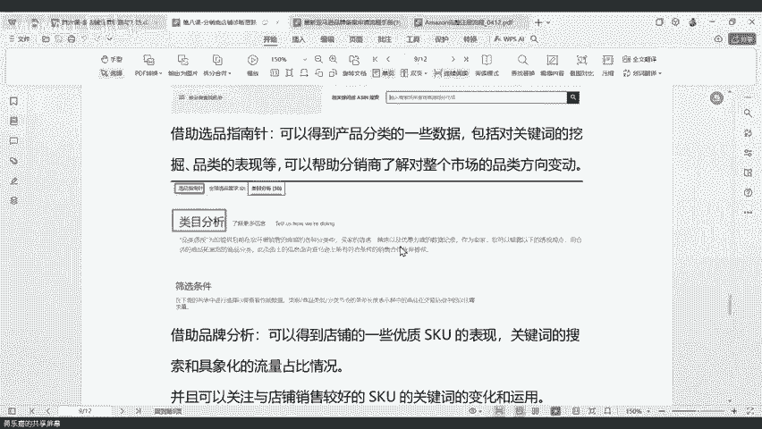
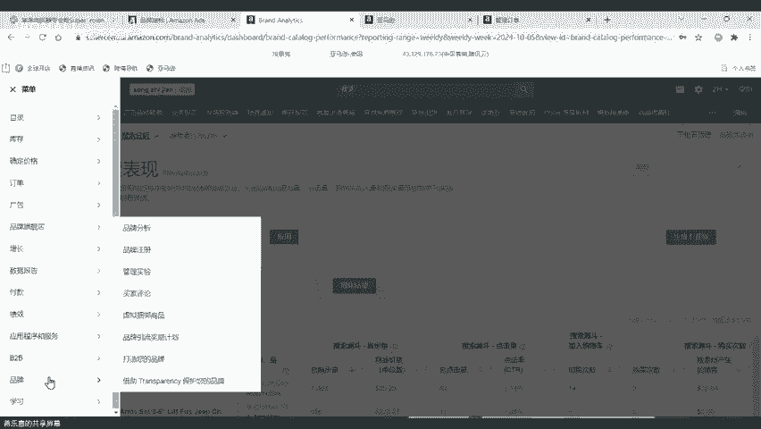
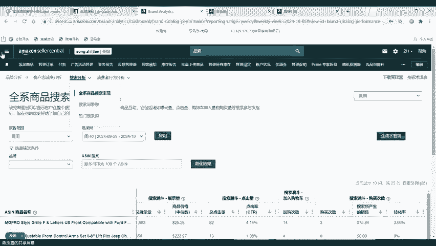
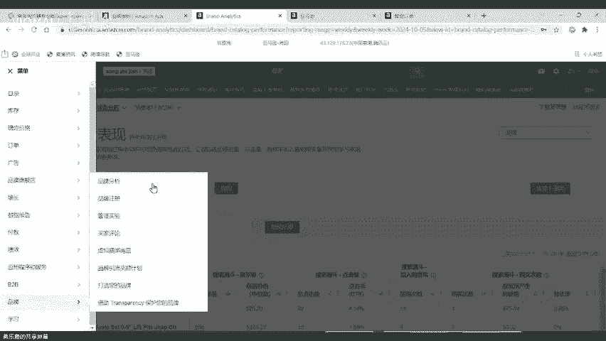
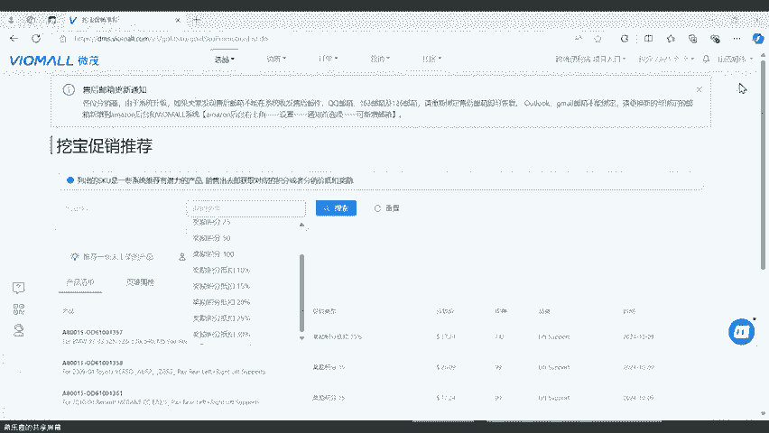

# 第八课-自营店铺诊断及调整方法思路分析 - P1 - VIOMALL - BV1qB29YzErs

分享的第二个板块是什么呢？就是我们的分销商店铺诊断的思路和一个什么和一个调整的方向分享啊，那么这个这个第二个板块的话呢，里面会分成三个主题啊，第一个就是什么样的情况下，我们需要做一个什么做一个店铺诊断。

第二个就是店铺诊断的时候，我们需要做的事情，还有确定的一个原因。第三个就是确定问题以后，运营思路和调整的技巧是什么啊，这个就是我们啊今这第二个板块啊，然后要给大家分享的三个主题。

那么第一个什么样的情况下，我们需要做店铺诊断呢？啊，什么样的情况下，那么总结来看啊，总结来我给大家做了几个总结啊，肯定不止这么多啊，但是就是我给大家做了一些总结啊，大家可以做参考。第一个是什么？

第一个就是店铺的流量啊，在没有收到绩效啊，差评等因素的情况下，莫名的会下滑啊，就比如说我店铺啊，现在绩效也很安全啊，也没有什么差评啊，也没有收到什么各种验证啊。

但是莫名其妙就没有就就流量直接就原本可能我举个例子，原本可能有400啊，400的日均浏览量啊，现在就变成什么，现在就变成2200啊，或者说变成50。那这种的话肯定就是什么呀，肯定就是有问题的，知道吧？

像这样子的变化肯定就是有问题的啊。啊，像这样子的话，肯定就是有问题的那就那就肯定是这要怎么样，我们要去做调整，是不是？所以说第一种啊第一种情况啊，要做店铺诊断，就是店铺流量下滑啊，第二种是什么情况啊？

第二种是店铺的整体。首单抵扣的上架的那个活动，上架又不又不是立马生效ACES等ACES生效了，可能首单就被别人抢。呃，没有那个质疑那个小伙伴，我们赏金猎人每个月会更新啊，就是说一般来说。

更新之后大家都是同一时间去上线。同一时间上线，同一时间上线的话，大家都是同一个时间生效ECES啊。而且而且我跟你我跟你讲个老实话，就是我们里面有6万个SKO啊。

其实每个月并没有那么多的产品都拿去被做了抵扣，那就证明什么，那就证明他的机会还是很多的，知道吧？没有你想了那么多呃这个SKO被抵扣掉，知道吗？所以你不用太担心啊，你不用太担心啊，你就抢不到这个手盘啊。

不会的不会的。啊，首先抵扣里面第一SQ多。然后第二就是大家就是它会定期的更新。第三就是大家升上架的时间都差不多啊，所以说大家都是基本上是这同一条起跑线，也不会有人去抢跑啊，也不会有人去抢跑。

因为它的SQO不会永远都固定，知道吧？好吧，O然后第二个就是啊我们前面讲了啊，就是目这个流量啊流量下滑啊，我们肯定是有问题要去做诊断。第二个就是店铺的一个整体的营业额业绩下滑。

导致销售额对比同期比如说你对比去年啊对比这个前年啊，或者说对比上个月上一周啊或者这个上上周啊，上上个月啊已经下滑了啊，但是这个下滑呢，它是有一个有一个什么它是有一个大概有一个指标的。

我个人推荐就是说你同期对比啊，比如说你现在这个月啊卖了1万块啊，但是啊不对，你上个月卖了1万，这个月只卖了2000。那像这样子的一个下滑肯定就是有问题的对吧？像这种下滑的话，我们肯定就要去做什么？

我们肯定要肯定就要。对症下药给自己的店铺来一个诊断，找到问题解决问题，对不对？所以说那么我们怎么去对比这个数据呢？我们可以借助我们业务报告啊，就是我们的亚马逊后台啊，业务报告里面去汇总查看数。

就大家可以看一下，参考一下我这个啊，这个就是我在那个业务报告里面找的啊，大家可以去把这个业务报告里面啊，汇总出来查看数据的变化，或者根据平台的订单数据查看变化。就比如说啊我上个月啊卖了200单啊。

这个月就只卖了50单。那像这种的话，肯定也是啊肯定也是异常的啊，肯定也是异常的，我们肯定要怎么样，肯定要去做一个对应的调整啊，我们肯定要去做一个对应的调整，否则的话这个数据啊，就是不对的。

这个数据是不对的。像这种我们就要去啊去借助它去做一个调整，然后把它给修正过来啊，把它给修正过来。啊，这是第二个啊，我们要做诊断的一个情况。第三个是什么？第三个就是店铺遭到差评或者索赔等因素。

导致我们的这个绩效这个ODR超过了1%的安全线，导致销售流量下滑。因为我们都知道我们的这个订单缺陷率一旦超过了1%。这个安全线之后，我们的销售和流量怎么样就会下滑。其实最直接的就是什么？

最直接就是因为导致我们的购物车丢失了嘛，是不是？其实最直接就是因为我们购物车丢了。啊，我们购物车丢了之后，肯定销售这些就扛不住了啊，销售扛不住之后我们就会下滑啊。所以说这是第三个啊。

就是说如果你出现了这种情况的话啊，那肯定要做一个店铺的诊断，是不是那我们可以怎么怎么看呢？我们可以通过账户的状况啊，就是在我们的啊亚马逊账户状况啊。

我们可以在我们的亚马逊账户状况里面啊去查看一个绩效评分啊，然后怎么样，然后来看啊哪里出现的问题，知道吧？然后来看哪里出现的问题，那有可能是ODR有有可能是ODR超了，对不对？那也有可能是什么。

也有可能是你收到了一些什么索赔啊啊，或者说信用卡拒付啊啊，这些都会导致出现这个问题。所以说大家要去这个账户状况，就是我们看我们的一个店铺的评价，我建议大家是每天都要跟进啊，每天都要跟进啊，这个很关键。

然，这是第三个啊。第四个就是店铺近期如果遇到了审核或者投诉，在没有处理或者处理结束以后，流量频频或者为0。比如说啊大家遇到了什么消费者法案啊，比如说自发货权限被关闭啊，然后被投诉侵权啊等等啊。

这些因素导致业绩下滑啊，这是很正常的。就是比如说你有一段时间啊，你的你因为这个这个什么自发货被封了啊，导致你这个流量啊，这个遇到了很大的一个影响，这是很正常的一件事情，知道吧？这是很正常的一件事情。啊。

然后大家可以大这个也会导致什么？这个也会导致大家流量下滑啊，这个也会导致大家的流量下滑啊，这是第四种啊可能存在的情况啊。大家可以看一下，我们比如说啊你遇到什么什么你的账户有停用的风险啊啊。

或者说你有一个什么绩效没处理啊，都可能会导致你的这个店铺最近怎么样，都都没有什么流量啊，这是很正常的一件事。那这是很正常。像这个图片。啊。

这个图片的话就是啊因为我们可能没有解决一些这个违反政策的一些因素导致的啊，导致我们这个账户啊被这个啊流量的下滑了啊，导致我们被流量下滑了。啊，那这个在哪里看呢？这个也是一样啊，大家可以在账户的界面。

然后绩效通知里面啊去查看一下近期收到了一些异常因素导致的原因啊。然后这个其实比较好解决啊，这个就是大家要在规定时间内去给它解决掉。就是我们有些时候啊可能遇到一些啊这种绩效问题啊，大家就觉得啊这个没事啊。

小问题啊，我现在分数正常啊，不用管它，其实不不建议啊不建议大家在遇到了这种相关问题的时候，特别是多店铺啊，这里其实多店铺的尴尬地方就来了。如果你所有的地方啊，上家的都是一样的啊。

那有可能到时候你处理起来就会比较多啊，处理起来就会比较多。但是这个也是正常的啊，这个也是正常的。毕竟啊这个赚的多肯定承担的也要多一点嘛，是吧？啊，所以说大家如果遇到一些这种绩效的问题的话。

要尽快的去处理啊，不要说啊我先看看啊，反正无所谓，我再等等啊。是吧。然后第五个啊什么样的情况就是我们的配送绩效不达标。就比如说主动取消啊或者迟发或者追踪不达标啊。

追踪追踪不到有效记录啊这些啊都会导致你店铺流量下滑或者不出单啊，特别是我们现在什么现在我们的准时送达率也纳入了我们很重要的一个什么很重要的一个店铺衡量绩效的一个指标里面，也会导致什么。

也会导致如果说啊因为这个原因导致就会出现你这个没有流量的情况。啊，也会导致你这个出现没有流量情况。啊，这是第五个第五个情况啊第五个情况。啊，然后呃这个的话呢像这个配送绩效啊。

这个配送绩效大家就可以去啊那个什么去我们的那个呃账户账户状况里面去看啊，账账户状况里面去看。啊，这个啊大家稍等一下啊，这个这个应该大家都知道这样一看啊，这个就是在这个配送绩效。比如说里面就包含持发率啊。

配送钱取消率啊，还有有效的追踪率啊，还有我们的准时送达率啊这些情况啊，像这种的话，也是在我们的那个绩效啊，账户状况里面，大家可以自己去看的啊，大家可以自己去看的啊，这个也是大家要去维护的啊。

就是说这个是第五点，就是说我们要去经常去查看的一些点啊，就是如果说大家因为这些问题啊，导致自己的流量受到了这个。下滑或者说销售额数到下滑，或者说单量受到的下滑，就要去自己给自己做一个。

就要自己给自己做一个店铺诊断了，知道吧？就要自己给自己做个店铺诊断。OK第二，这是第一部分啊，什么样的情况下我们要去做诊断。然后接下来就给大家讲讲分享一下我们的第二部分，就是店铺诊断的时候。

我们需要做什么的问题。啊，店铺诊断我们需要做什么啊？店铺诊断。第一个我们要找到原因啊，就是我们要先确认导致自己店铺出现下滑的原因，有原因的下滑，相对来说是比较好解决的啊。

相对困难和复杂的是没有原因的下滑，或者不被告知的一些隐性原因，导致店铺流量不好。就比如说啊你可能呃就比如说我举个例子啊，就比如说我刚刚提到的那5点啊，你你可以知道啊，原来是自己迟到了差评。

或者说啊自己的某一项绩效没达标，导致流量下滑。那这些你是知道的啊，这个是这个是什么，这个是显性的原因啊，但是有一些原因是没有被告知的。就比如说你的客情关，你的客情关系维护不及时。啊，能理解吧？

就比如说啊可能呃你这个你没有跟别人沟通好啊，比如说超过20小时没有沟通啊啊，或者说你店铺啊长时间没有做一些更新啊啊，没有做，或者说你店铺的这个调价做的太高了呀啊，或者是啊有一有一些情况是什么？

就是你有一些绩效，但是亚马逊没有及时通知，你知道吗？啊你有一些绩效，但是亚马逊没有通知，你可能会有一个延迟性。比如说啊这个这个这个绩效已经出现了。

但是亚马逊过了一周或者过了两周才通知你像这种的话就属于隐性啊，或者说你之前啊你有一些因为绩效问题啊，当时没有处理，后面被亚马逊追责，像这样子的话就是隐性的这种这种就处理起来相对困难还有复杂啊。

这种是这种是比较难处理的，是吧？OK然后第二个就是如果说啊我跟大家讲一下，如果说大家找到原因啊，是前面两种就是那种显性的原因啊，导致的我们出现了。如果说价格过高，我一直没有处理，会有影响吗？呃。

如果说SQ不算很多的话，是不会的。就比如说啊你你你上架了一两万个，然后只是收到了一两个的提示的话，其实没关系啊，这种是没什么关系的，好吧。啊，我们继续。如果说是显性的原因啊。

是我刚刚前面提到那两种原因导致啊你们就是导致我们分销商的店铺也出现了一些下滑的话，我们是可以借助整体的一个店铺结构运营调整来起到一个流量回升和助力销售的一个效果。

那么第一个就是我们那我那么我们具体要怎么做呢？第一就是我们要先确定我们店铺目前的一个SQ的状态和一个整体的一个定价情况到底合不合理啊。那么我们可以去哪里看呢？我们可以去我们大家可以看看我这个图片啊。

在在线刊登里面啊，大家去把自己的店铺的改价模板下下来啊，下下来之后去看一看啊，你自己的SKO的一个整体的定价是不是很离谱啊，自己自己的SQU的定价是不是很离谱。像我们刚刚我们那个小小陈那个小伙伴讲的啊。

那他说价格过高啊，价格过高，如果不是很多的话，是没什么所谓的啊，是没什么关系的啊，你只要不要太高，是没有什么太大的问题，知道吧？啊，只要没有太高，是没有太大问题。如果说啊你你所有的店。

你所有的价格都都都定价太高。比如说大家都是订1块钱，你订2块或者你订2块，或者订3块啊，像这样子的情况下的话，你肯定就要做调整。还有一个就是大家可能会忽视的，就是么运费的问题，在亚马逊的眼里啊。

你的最终的销售价格是把运费含进去的啊，大家不要觉得说啊我我产品里面啊，我定成本价，比如说产品成本成本价难够是100啊，我定90，然后我这个运费定100啊，那最终加起来190，那你觉得会有袁总没上当。

肯定是不会的，知道吧？这种运费的模式啊，特别是对于我们的新店铺来说，是非常不友好的啊。我们的新店铺啊，我我也建议我们的新的分销商啊，大家最好不要去有订单的话，还用和客户客户发邮件沟通订单信息吗？呃。

那个明天那个小伙伴，你是想说什么订单的话，要发什么什么，你要发什么沟通信息啊，我不太知道，你可以大概讲一下，我我不太理解你说的要发沟通信息是发哪一种，你要讲的详细一点。所以说第一个啊。

我们要先确定我们店铺目前的一个SKU的状态。就是你的SQU到底是不是正常的销售的，还有就是你的一个整体的一个定价情况到底合不合理啊，当你确定完了之后啊，当你确定完了之后，第二个就是你在店你在流量下降。

相对来说比较严重的时候啊，调价就成了你比较结构化调整中，日常要去关注和运营的一种手段和方式。所以说大家要学会什么？要学会调价合理调价，针对不同的类型和情况，优化你店铺的一个价格体系。

在价格上在因为价格是价格的优化是最简单的，知道吗？啊，价格的优化是最简单的，在价格这个第一步最简单的路子上，我们就要去先做好要先。做好一个整体的一个调整方向。因为价格调整已经算是最简单了啊。

价格调整已经算是最简单了是吧？啊，这所以说这是第二个。然后第三个就是优化好店铺的SKU啊，优化店铺SKU做好店铺的一个上下架工作，长期不出单的产品，要怎么样及时下架售后问题产品要及时做更迭啊。

产品不是上架完之后就永远就不再做任何的一个怎么变动的，要学会适应适时的去调整好自己的一个店铺结构。根据店铺的出单来选择店铺后续要补强的一个上架方向。当店铺流量不好的时候，销售额不好的时候。

要把选择权交给市场。什么意思？这个意思就是说有一些产品在我们平台卖的比较好，但是在你店铺里面卖的不好。那你就不要再去怎么样，你就不要再去啊，你就不要再去说啊，我不管，反正店铺你这个平台卖的好啊。

我这个前面花了积分啊，我现在就必须要在这里给他上架上卖啊，我我也不管。微贸停售的产品。要下掉吗？呃，停售的产品有可能是暂时缺库存，不用下啊，只下架那些问题产品啊，还有其他一些产品啊。

你就不要直接贸贸然的去把停售的产品都给下掉，好吧。啊，然后那个明天小伙伴说的是。用户下单了，我发货前还用和客户发邮件确认订单商品信息的正确性吗？啊，不用不用啊，那个小伙伴没必要啊，你这样很浪费时间的。

我觉得啊没有必要啊，没有必要。因为我们有ECES啊，虽然说有时候也会有不准的时候了啊。但是如果你自己觉得如果你自己的现在单比较少，你能忙得过来，你可以去发，好吧。OK啊OK所以说大家可以通过平台啊。

就是我们自己的平台有一个在线刊登啊，导出这个选项，导出大家目前店铺的SQ的一个品类。然后这个表格下载下来是所有啊目前有销售且无异常的SQ才会显示在表格里面。如果通过数据匹配。

你要找出你店铺里面卖的好的品类和出单的SKO这个就要什么？这个就要大家去借助什么，借助你自己出过单的啊，这里。啊，我这里跟大家讲一下啊，就是。哎，怎么又跳出来，我我那个店铺又被挤掉了，无语。哎。

算了算了，不上不不上不了线了啊，这个是啥意思呢？在线刊登上面可以下架商品吗？会同步到亚马逊吗？在线刊登上面可以下直接下架。呃，下不了啊，我不建议，我觉得那个我觉得那个不好用。

你还是用之前啊我们给大家发的那个怎么删除产品吧啊，我觉得那个比较比较好，你不要不要在那个在线台单里面去想啊，我觉得那个不好用啊，我觉得那个不好用。OK呃，我们继续啊，就是大家可以自己去啊，我们的呃店铺。

就是我们的平台里面啊，订单里面把自己的订单啊以某一个时期为为时间线。比如说这一年这半年啊为时间线，然后把它给下载下来之后再去我们的那个在线刊登里面有一个导出啊。

把这个里面的SKU和这个里面的品类怎么样去结合起来，你就能找出什么你就能找到你自己店铺里面卖的好的品类。然后这些卖的品卖的好的品类，你就可以通过好的方式去匹配啊，你就可以得到一个SKO的销售情况啊。

得到了SKU的销售情情况之后，你就可以得出啊你可以优化的SK是什么。就比如说啊你有些SK哪些SK产生过销售。那你就应该知道啊我这些这些品类可能就是我自己店铺里面卖的好的。

有可能这些品类在我们平台卖的不怎么样。但是你店铺里面已经形形成了什么已经形成了一个特色差异化经营可能他就怎么样，可能他就是啊不一样。他就会卖的比较好，他就会卖的比较好。所以说不要盲盲目的去追求啊。

就是我们的小伙伴啊，不要盲目的去追求在我们平台卖的好啊。因为有可能我们平台卖的好，不代表你自己店铺卖的好，所以说啊你自己去匹配数据啊，找出来啊，你能够优化的SKU那找出来之后怎么样呢？

你肯定就要去怎么样，你肯定就要自己去。啊，你你可能就要自己去啊找出这个来去优化，优化完，你具体要怎么去做呢？啊，那肯定就是你当你总结出来品类的方向之后啊，你就第一时间把这个没有上架的品类给它上上去。

这是第一点。然后第二个，第二个就是你把你自己卖的好的SKU总结出来之后啊，你就去把这些SKU从A加从标题描述，从5点描述，还有宝贝详情页面里面去参考一下别人的那些大卖，他们是怎么优化的，去给他优化一下。

就是我们有很多小伙伴说啊，我能不能去优化啊，你当然可以去优化。但是我不建议大家啊，我不建议大家自己去怎么样自己去把那些没有产生过啊，没有产生过销售的SKU去优化。因为说实话啊。

我们店铺里面上架几万个SKU有可能啊你真正出单可能就一两千个啊，我跟大家讲实话，就是月均销售1万的这个店铺，可能出过单的SKU就不到800到1000个。啊，所以说你你如果有5万个，你说你要每个都去优化。

你要优化到什么时候呢？所以说我建议大家你优化，你要有方向的优化，你只优化，你出过单的就可以了。你只优化你出单里面比较好的一个品类就可以了。你不用把它所有的产品都拿去优化，我觉得那个是没有什么太大意义的。

知道吧？啊，那个而且那个只会浪费你很多时间，知道吧？那个只会浪费你很多时间啊，所以说啊当我们。得到了一个品类的销售情况之后，我们就可以引入盈亏百分比品类总销售金额、品类总分销价、销售数量客单价。

从而我们可以得出我们接下来要上架了一个方向，还有一个下架的一个方向。什么意思？就是我们有很多小伙伴都说。啊我这个下架我不知道怎么下嘛，那很简单嘛，你把你自己的店铺里面有产生过销售的订单导出来之后。

你就去看有哪些品类从来没有产生过销售。比如说我举例子啊有一个保险杠，你上架了1万个啊，你店你现在店铺里面总共有6万个SK啊，你保险杠上架了1万个啊，你上架完了之后呢，这1万个产品啊。

都都没有产生过销售啊，反而有一个品类啊，只上架了2000个，但是产生了50单的销售，那像这样子的SKO怎么样？它就是属于什么？它就属于优质的SK为什么？因为你只上架了2000个，却产生了50单。

另外一个上架了1万个，却从来没有产生过一单。像这种的话，你就可以大批量怎么样，你就可以大批量给要下架，然后你去把那个上上架了2000个。

但是产生了50单的SK的品类抓出来之后在我们平台去把它的品类找出来之后，大批量去上架。因为这种品类有可能就是你店铺里面什么？有可能就是你店铺里面的一个核心品类啊。

有可能就是你店铺里面会长期出单的一个品类，知道了吧？啊，所以说这个才是你要去优化的一个方向，还有你要去上架的一个核心点啊，你要上架的一个核心点。然后第三个啊，如果说啊这里前面两个我讲了一下什么。

这两个我讲的是啊要去做的一个方向啊。如果说你的店铺啊，就我们各位啊分销商店铺是什么样的问题，是ODR或者说其他问题导致的话，那么我们就要用另外一种思路，知道吧？第一个啊如果店铺是ODR的问题的话。

那么ODR的问题，我们就要先联系，就是我们说差评啊，就是说如果说是差评的问题导致的话，我们就要优先联系客户争取解决这个问题，如果解决不了就要什么就要主动出击。什么意思呢？就是比如说有个人给了一个差评。

但是你给他发了很多消息，他不回复，这是很正常的一件事情，知道吧？啊，说实话我自己也遇到过很多，就是啊有一个人给莫名其妙给了我一个差评，但是我怎么联系他他都不回复我。那如果不回复我怎么办呢？我就解决不了。

我就要主动出击了。那我就要找到我店铺里面优质的低价的比较好转化的SKO啊，把这个活动给开起来。就比如说我可以去跟进促销优惠券，然后会员折扣啊，我去调价这样子的一个方式增加它的转化啊。

但是这个时候你要注意什么？你要注意一个价格的设置，为什么？因为我不建议大家，如果说你要去冲单啊，就比如说我现在啊有有1个ODR，我还现在差十单，我就可以把这个ODR给扛过去。那像这样子的情况下。

我们肯定是要怎么样，我们肯定要是要去要去做调价的。那在调价的上面的话，你肯定就不能选择高价的去做调价，那家就尽量选择那些。比较好转化的。比如说啊这个气层杆啊啊，比如说空气滤清器啊，比如说晴雨档啊。

比是那个雨刮臂啊，比如说这种啊比较好卖的一些小螺丝啊，小摆件之类的啊，像这样子的话，你就很很合适把它拿出去做什么拿去做一个活动的SQ把价格调下去，这样子的话，你就可以尽快的出单。

然后把什么把你的ODR给扛过去啊。如果说是绩效的问题的话，你就要尽快在短时间内啊，或者说在规定的时间内将对应的一个绩效问题给解决。否则的话就要给店铺造成一个不可逆的影响。

遇到不同的投诉响应不同的一个处理方式啊，知道吧？响应不同的一个处理方式。啊，OK的。然后第三个啊第三个如果说大家的配送绩效啊，我这里跟大家讲一下，就是如果说啊你是配送绩效不达标这样子情况的话呢。啊。

如果大家是配送绩效不达标的话呢啊你的持发率，还有取消率，你就只能通过什么？通过单量提升。那通通过单量提升怎么提升啊，还是可以参考我刚刚说那个方法啊，做一些活动，开一些促销啊。

适当的拿一些产品来做低价引流。那哪些产品可以做低价引流。那肯定就是在我们平台里面啊去收去找一些什么么去找一些啊不要不要什么流量的嘛，对不对？就那种有抵扣的呀啊，然后那种好卖的呀啊，低价的呀。

像这种都很适合拿来做什么拿来做活动。那大家的目的是什么目的就是通过多出单啊，如果说你的持发率，还有你的取消率不达标。

你就只能通过多出单来弱化它的一个权重百分比或者等待判定的时间结束来恢复一个对应的绩效分。啊，来恢复一个对应的绩效方式。然后还有一种情况是什么啊？还有一种情况，我给大家我给大家找个店铺啊。

我给大家找个店铺来看一下。啊，还有一个是什么？还有大家现在可以看到我的呃亚马逊店铺啊，现在可以看到我的亚马逊。还有一种情况就是我们的准时交货率啊，我们有有些伙伴会说啊，我们的准时交货率超标了呀。

比如说啊我下载下来之后，有有多少多少是不达标的那这种情况的话呢，我可以给大家分享一个方法，就是你去找到你超标的那个日期，就比如说我举个例子啊，我有一个订单是10月呃10月1号超标了，对吧？

那我就可以去找一个在那个时间段啊，能够已经签收，已经配送到的那个物流号，把它给替换上去，能理解吗？就比如说我有一个订单啊，我有一个订单啊，我现在举个例子，我有一个订单，现在就假如是假如是这个订单嘛啊。

我的这个订单已经超标了啊，那我现在啊为了把我的什么，为了把我的这个准时交货率给拉起来，我可以怎么做呢？我就去找到这个订单里面啊，点进去。然后找到10月1号已经配送完成的订单，怎么样。

把他的运输单号啊填进啊填进我们的这个订单里面去就可以了。就比如说这个这个这个这个订单对吧？这个订单我就可以去拿一个订单编号。就比如说在10月1号签收的那个订单啊给它放进来之后。

把这个货把这个点这个编辑货件然后把那个运输单号给填进来，然后这然后怎么样，然后我们过两天再来看啊，我们的这个准时交货率啊，这个绩效它就能够得到什么？能够能够得到恢复，知道吧？能够得到恢复。

这是一个方法啊，知道这是一个方法。啊，所以说啊其他的另外两个啊其他另外两个啊，另外两个，比如说这个什么持发率啊啊，然后预配送取消率啊，还有这个有效追踪率的话呢啊你就只能啊这个取消率一般是不用管的啊。

一般是一般是不会超的啊。但是另外两个这个持发率跟这个有效追踪率的话啊，只能够怎么样，只能通过多出单来处理。特别是这个持发率也已经结束订单也能改。是的是的，那个小腾啊已经结束了也能改啊，已经结束了也能改。

好吧，OK呃，然后第三个啊就是我们运营思路确当我们确定好问题以后啊，我们的运营思路的与调整的技巧是什么？第一个啊，这里我跟大家讲一下，就是如果我们后续啊就是我们后续在运营的过程中啊。

当我们已经确定好我们店铺出现了一个什么需要诊断啊，已经出现了一个绩效问题之后，大家去调整的方向之后，那你可以怎么改呢？那大家可以参考一下，我这里讲的啊，这个确定问题出现以后啊，运营思路。

还有调整的技巧啊，这里我会给大家过一遍啊。第一个是什么？第一个就是优化销售好的分类和SKU啊，借助我们的亚马逊工具，找出你店铺里面流量好的SKU品类去进行一个什么去进行一个整体的优化。

品类优化就要放在价格，还有上下架方面SKU优化就要放在从什么从A加呀标题描述啊，还有5点描述里面来入手去优化。那大家可以去借助什么可以去借助业务报告啊，就是我们的亚马逊业务报告。

可以得到一些SKU有流量，但是没有销售啊，可以在价格标题上面入手，或者说针对产品的需求性。那针对产品的需求性的话，就要借助商机探测器啊，这些都是亚马逊上面的一些这个。常见的一些操作东西啊。

这个借助商机探测器查看市场买家对这个产品的需求性是从什么出发的，想要的内容是什么？就有一些产品啊可能在某一些月份它不好卖啊，像这样子的话，你就可以不用你就可以考虑怎么样？可以考虑给它下架。

因为你上架上去也没什么用啊。然后像我刚刚讲的啊，有一些SKU有流量，但是没有销售的话，大家就要借助啊，这个呃业务报告里面，这个这个这个A险的一个相关的一个数据报告啊，也可以在我们的品牌里面啊。

有一个那个品牌的一个浏浏览量来看啊，大家就可以借助这个来看啊，就是有一些产品啊，它是有浏览量的，但是没有出单啊。那像这样子的话，就是我们可以去什么，我们可以去优化的一个点啊，我们可以去优化一个点。

然后第二个就是大家借助这个全屏指南针啊，在这个全屏指南针里面呢，大家就可以得到一些什么得到一些产品分类的一些数据啊，包括对关键词的一些挖掘啊，品类的一些表现啊等等。

都可以帮助我们的分销商了解对整个市场的品类方向的一个变动，知道吧？啊，当然在大家都在这个。亚马逊里面都在这个亚马逊里面。啊，然后第三个是什么呢？第三个就是我们可以借助品牌分析。

我们可以得到品店铺的一些优质SQU的表现，关键词的搜索具象化的流量占比，并且可以关注和店铺销售好的SQU的变化和应用啊。这个大家可以这个大家可以自己去参考一下啊，自己去参考一下。那我跟大家讲一下在哪里。

大家稍等我一下啊，我再给大家找那个就是借助品牌的那个。Yeah。

好，就是说我们在我们的品牌啊，在大家可以看到我的亚马逊啊，大家可以看到我的亚马逊。好，在我们的菜单栏里面啊，有一个品牌，然后品牌呢里面有一个品牌分析，大家可以看一下品牌分析。然后在这个品牌分析里面呢。

它会分为这几个部分啊，就品牌分析。然后客户忠诚度分析搜索分析，还有这个消费者行为分析这些等等。然后在这个消在这个搜索分析里面呢，它会有一个全系商品的搜索表现，还有一个搜索词的表现。

还有一个热门搜索词的表现。这个这个搜索词和热门搜索词啊，不仅可以查你还可以查别人的啊，还可以查大麦，你知道？然后我们就可以利用这个第一个啊这个全系商品搜索发现里面。

然后在这里面呢你就可以看到你所有的产品怎么样，它的一个展示的量和它的一个什么和它的一个产生的销售的量啊，就比如说这里有一个加购物车的次数啊，然后购买的次数啊，然后它的一个转化率啊。

然后在下面它这里都会有它的所有的什么最后这里会有他所有的一个啊展示的量。像有一些产品，它可能有展示量，有点击量啊，也有购物车的量，但是就没有。

就是没有购买的量，像这种SKU就是我们可以去什么？我们可以去优化的一个点，知道吗？啊，像这种SKU就是我们可以去优化的一个点，也是我也是我个人觉得啊值得大家去推荐和优化的一个方向啊。

也是值得大家去推荐的和优化的一个方向。这里的话大家注意啊，在我们的这个啊这个。品牌啊在我们的品牌里面啊，大家可以去到时候去玩一下啊，在品牌，然后在品牌里面有个品牌分析，然后点进来之后啊。

在里面有一个搜索啊，这个里面功能很强大啊，不仅可以搜索，这个还可以搜索a选啊等等很多很多啊，都可以。大家到时候自己去看一下，自己去学习一下。

啊，大家到时候自己去学习一下。所以说啊我们借助我们的品牌分析，可以得到店铺一些优质的SKU的表现，关键词的搜索和具象化的一个流量占比。就像我刚刚给大家讲的啊，你可以看到他被加入了购物车多少次。

它的展示量是多少次，有多少人点了，对不对？然后他最后他购买了多少次，这些等等，你都可以看到啊，你都可以看到，并且我们可以关注和店铺销售较好的SKU的关键词的变化和应用，知道吧？啊。

大家可以去关注一下这个。然后第二个就是优化店铺销售好的一个或者流量好的一个品类。我们可以借助我刚刚给大家讲的一个品品牌分析的那个借助工具。我们可以整理出我们店铺销售较好的一些品类，对这些品类，从价格。

还有选品方面进行初步的优化。然后再根据价格不同设置，不同的一个梯度选出一些产品去做流量的产品，可以从促销的设置啊，优惠券的设置啊，然后这些方面搭配什么搭配我们的广告，这里讲的是亚马逊的广告啊。

同时大家可以去搭配广告，利用关键词的一个精准推送，达成出单的可能性，知道吗？啊，因为我们我们我刚刚讲了，如果我们能够找到一些好卖的品类之后啊，我们就可以去做一些促销啊，做一些调价，做一些优惠券。

做完这些之后，我们还可以去做什么然我们还可以去做一家啊标题，还有这个5点描述的一个优化。优化完了之后，我们再去跟一个广告啊。当然呢你如果能够精准的找到某一些品类的话。

那你可以打一个什么你可以打一个手动的关手动的广告啊，找到一些。关键词利用这个关键词的精准推送达成出单的可能性，知道吗？啊，利用关键词精准推送达达成出单的可能性。同时你还可以怎么样。

你还可以去搭配平台的活动，在价格上面形成一定的优势。在利润上面可以做到什么？可以做到有利润啊，同时又可以怎么样？同时也可以做到有流量。因为平台如果有一些活动，比如说能够让你抵扣20%，抵扣30%。

相当于你的成本价怎么样，就便宜了10%到20%。像有这样子的优势的话呢，你就可以在店铺的价格上面做成一些有比较有优势的特点，同时你可以做什么？同时你可以把这一部分让利的产品，啊。

拿去做什么拿去做一些促销啊，你把它这样子的话，你不仅可以赚到流量啊，因为你价格下去了之后，你的流量肯定会上来。同时怎么样？同时你还有利润，为什么？因为平台的那一部分啊给你补贴的，就相当于是你的利润一样。

知道了吧？啊，所以说这是一个非常好的一个优势点。然后第三个是什么？第三个就是大家在结合这些活动的时候，要挑选平台近期热门或者可以持续参加的活动啊，借助平台助力店铺起飞啊，这个就是什么？

这个就是借助平台高抵扣的活动啊，像比如说这上面啊，大家可以看一下我这上面的一些截图啊。当然这个就是借助平台高抵扣的活动，实现流量增长。高抵扣的SKU如果在价格倍数方面没有限制兑换条件是最好的。

但是如果有一定的限制条件，那我们就要根据条件挑选一些相对低价的SQU去做活动啊，在价格上面可以实现一个什么实现一个低价引流啊，一般高抵扣的活动价格压的足够低，出单的转化率是很高的。类似这样子的活动。

很适合只要流量，基本上可以实现不亏本，或者说用比较小的一个一个亏本，达成一个流量的转化的成就。但是由于这个亚马逊调价，如果大家过于频繁的话，可能会对店铺的流量有影响。

所以说我建议各位分销商针对高抵扣的SKU只有用于没有出过单的SKU去调整比较好，什么意思呢？就是那些已经出过单的SKU，但是他又参加这种高抵扣的活动，我就建议你不要去调这部分的价格了，知道吧？啊。

你就把那些没有做过这些调价的啊，没有出过单的SKU拿去做这种这种什么高抵扣的这种活动就可以了，知道吗？就拿去做一个平牌单调价啊，否则的话有可能会把你之前出过单的SKU或怎么样调整调的都把他的这个。

都把他这个呃呃都把他这个购物车给调没了，知道吧？啊，所以说啊大家可以借助什么呢？大家可以借助我们平台的挖宝啊，我们平台的赏金猎人，还有其他优惠券中心的活动啊，搭配店铺的活动。

根据抵扣利度或者奖励机制不同啊，选择不同的一个价格的调整方向。不同的一个什么不同的一个价格的梯度设置，然后不同的一个结果取向啊，什么叫不同结构取向。如果说啊你要流量。

那你就可以把价格调到没有没有没有利润啊，那这样子的话出单的效果会非常好。如果说你要利润，那你就要想办法怎么样？我举个例子啊，如果说平台给了你一个百分百抵扣那你的成本价应该是0。65左右。

那像你的你的成本价是0。65，你要利润的话，那你就可以把你的价格调调整到一倍啊，调整到一倍。这样子的话，你的利润就有35%啊，这样你的利润就有35%。那这样子的话，就是你可以赚取利润。

如果说你说啊我百分百抵扣，我不要我不要那个利润，我只要流量，那你就可以。直接把你的价格调整到0。65到0。7之间，这样子的话你的流量就会涨得非常快啊。有没有什么办法批量查询出过哦。

批有没有什么办法批量查询出过单的商品有没有丢购物车？没有办法，这个确实没有办法啊，这个这个确实没有办法，这个这个暂时做不到啊，这个暂时做不到。啊，一般来说有有库存的就会有购物车啊，有库存的就会有购物车。

除非你最近大调过，那大调过可能就会导致丢购物车，有有这个可能啊，这个可能啊。但是刚刚我们小伙伴说的这个批量常用出出货单的商品没有有没有丢购物车。这个这个暂时我我想不到办法，我想不到办法。如果有的话。

大家可以教一教这个小伙伴好不好？啊，所以说啊这个低抵扣的啊，这里总结一下就是低抵扣的就是百分之就是在平台里面啊有抵扣活动的，但是比较低的。就比如说20%或者以下的优先考虑在价格上面直接进行打折啊。

什么意思？就是你不要去做什么促销，然后就直接做调价就可以了。然后高抵扣的就比如说20%或者以上的这种抵扣活动的。那么我们就我就建议大家尽量结合价格。

加上亚马逊活动的形式来开展对应设计这样子活动是一个比较好的一个选择，知道吧？然后这一整个呢啊，然后这里啊这里我今天讲的这一整个就是我们分销商在做一个店铺诊断的时候思路，还有跟大家分享的一个调整的方法啊。

总体来说是什么？总体来说，第一个就是你要先判断出啊，你的店铺到底需不需要做诊断。然后第二个就是你要找出啊你店铺诊断的时候，你要做什么事情，你要确定一个原因。网子多开器把出货单的A选放入网址多开器哼。哦。

这个就是哦这个这个小伙伴分享的，就是说你把你那个A选全部查拉出来之后去用那种浏览器打开，然后一次开几百个那种哇，那这个电脑会卡死哦，这个是一个方法啊，这个确实是一个方法。

然后然后其实就是你相当于你自己去看嘛，你自己去看有没丢不就就是这样子，只不过就它是变成了一个就是瞬间多开这样的一个形式。那这个形式是可以的啊，这个还是挺神奇的啊，这个小陈可以参考一下。

我们自己这个小伙伴分享的啊。OK啊，然后所以说今天我们总结一下啊，就是第一个啊分销商，你要先确定你自己什么样的情况下，你需要去做店铺诊断。第二个就是你店铺诊断的时候，你要做的事情是什么。

你要确定原因是什么。第三个就是你确定好，导致你出现啊，这个店这个店铺出现问题的原因之后啊，你要确定好问题之后，你要去做一个什么，你要去做一个运营的思路和调整。那你要怎么调啊，总共来说。

我们就分为这三步啊，所以说啊我们今天的分享啊，是分为两个板块啊，第一个是分销商店铺诊断。第二个是什么？第二个是我们多店铺到底怎么去运营啊，那我们今天的分享就差不多到这里结束。

我们我们的小伙伴不知道针对今天的内容有没有什么疑问的。啊，有没有什么疑问的啊，我们我大概如果大家没有什么疑问的话，我们大概一两分钟之后我们就会下线啊。如果后续啊后续大家对于这个自己做电铺诊断。

还有就是说可能我们今天讲的一些内容有什么不了解的啊，你也可以私信我，你可以私聊我，到时候我再给你做解答也是可以的，好吧。啊，这个多店铺的话，我后面会把这个这个。这个这个内容啊再完善一下。

然后再放到我们的那个店铺，放到我们的那个平台首页啊，我们的那个专享培训里面去啊，我到时候会再去完善一下啊，就是会把我们的内容再补充补充，这样的会比较好啊，然后。针对挖宝是怎么参加促销？挖宝的话。

参加促销的话就是呃简单来说啊，就是10%的挖宝啊，就直接做价格调整啊，20%的就直接啊价格调整5%，然后再加上这个促销5%，30%的话呢，就是价格调整10%，加上促销5%。啊，能理解我说的吗？

那个名字个小伙伴啊，能理解吗？hello，明明明，你能够理解我刚刚跟你分享的吗？就是我们挖阿宝不是有好几个单位吗？我一般的话，我我建议我们的分销商挖宝的话，你就只用参加啊那个有抵扣的就可以了。

不理解这个很难理解的吗？旺宝不是有10%20%30%吗？你你把这种10%20%30%的产品上架了，对不对？首先第一点，你要先去把挖宝的产品给上架了，对不对？然后上架完了之后呢，有10%、20%30%。

这些是可以抵扣的对吧？那你可以把百有10%抵扣的产品直接拿去做调价，调高5%。因为10%抵扣就相当于平台给你打了0。05折，知道吧？啊，那你就可以直接做一个调价。咋能知道哪些有抵扣的？呃。

我们平台不是有吗？平台上面哪些有抵扣都有写的呀。大家稍等一下，我再打开我的。我的店我的我们的平台啊。我们那个产品清单里面不是有写哪些有抵扣吗？是不是有写吗？啊，这里也可以做筛选的。这里不是可以做筛选吗？

大家也可以看得到，这里有10%15%、20%2530%。如果你想要清单的话，你直接我等一下发给你也可以，好不好？我等一下发给你也行啊。但是如果说你不用清单，你想直接看的话。就在这个里面啊。

然后这里面就会有各种各样的抵扣。然后你用抵扣就是便宜的就直接做调价，然后去，然后上架文们之后去卖啊，20%的你就直接调价5%，然后再加上。促销打个5%的折扣是吧？然后调价然后抵扣30的。

你就直接啊这个促销5%，然后加上调价10%，这样子的话就可以起到一个什么？这样子就可以起到一个既低价了。然后就不会亏本，还能赚钱的一个效果啊，这这也是一个非常好的一个引流手段，知道吧？

这是非常好的一个引流手段，OK明白了是吧？好正等一下我发给你就好了好吧，OK那我们我我们的其他小伙伴应该也没啥问题了。好吧，那我们就呃今天直播到这里结束。如果后续大家有什么问题的话呢啊，再私信我就好了。

好吧，再私信我就可以了，好吗？行，那我们今天直播到这结束。好，我们的小伙伴啊，我们下次再见啊，下次再见。好，拜拜各位。

啊，我们抖音的小。