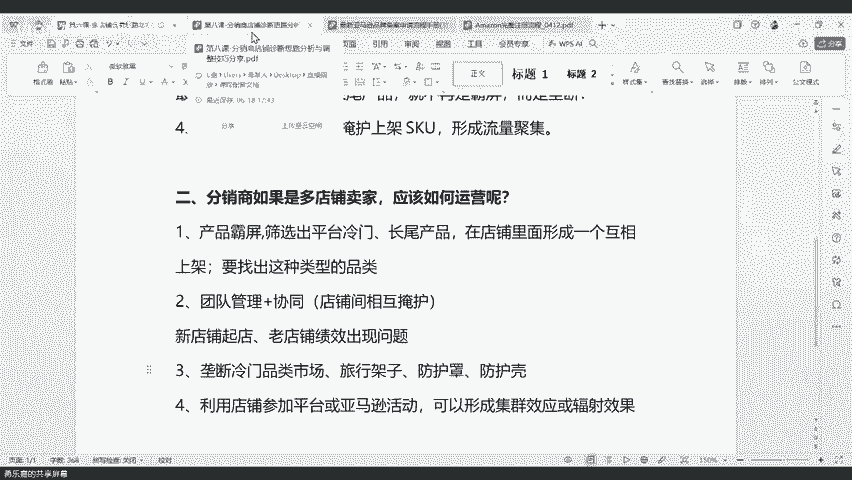

# 第六课-多店铺运营思路分析 - P1 - VIOMALL - BV1vC29YKEAT

今天的话呢就是给大家分享一下我们这个多店铺啊到底怎么去运营。因为我们有很多我们的小伙伴啊，可能是做这种多店铺的一个模式的对吧？那大家是做多店铺的话，那肯定就会涉及到一个问题，就是多店铺的方法啊。

就多多店铺我们到底怎么玩，对吧？我们到底怎么去运营这个多店铺才能让我们的这个店铺啊，多的这个优势发挥出来，对吧？然后这是第一个。然后第二个我们今天要讲，就是我们自己如果给自己的店铺做一个诊断的话。

那么我们应该怎么去诊断我们自己的店铺呢，对吧？那这个也这个也是我们很多小伙伴，那他可能会大家非常关心的。就是我我自己在我自己平常我店铺啊，可能有一些问题啊。

但是我我又不想我又不我又想自己知道问题点出现在哪里，那我要怎么去做这个诊断呢？是吧也是我们很多小伙伴非常关心的一个问题，就是我怎么做这个诊断的问题是吧？所以今天我们分为两个板块啊。

第一个就是我们多店铺的运营思路和方法，我们到底怎么玩啊？这个是很多我们多店铺的一个啊分销商啊，大家可能比较关注的啊，我会给大家一起讲一讲今天的一个思路和方法。第二个啊，就是给大家讲讲。

如果我们自己作为一个卖家啊，我们自己作为一个分销商，我们在做店铺诊断的时候，我可以怎么去做啊，做的时候呢，同时我要怎么去对应有一个调整的结果。是吧我可以怎么去调整。

我可以怎么去根据我自己啊这个诊诊断出来的一个问题，然后怎么去做一个对应调整。那我要有一个调整的方向，是不是啊？所以说我们这里呢也会有一个方向给到大家，好吧，以后有一个方向给大家。

到时候我们大家可以一起来看一看，好吧？OK那么我们今天啊就正式开始我们的一个分享啊，正式开始我们的一个分享。第一个啊就是我们现在现在分享我们的第一个板块，就是多店铺它的一个运营思路和方法。

多店铺的好处是什么啊？多店铺的好处是什么？啊，那么多店铺的好处啊，这个我相信我们很多的小伙伴啊自己开多店铺可能都有感受到啊，那多店铺的好处是啥？第一个就是多点开花嘛，对不对？分担风险啊。

第一个多店铺好处就是分单风险提高我们店铺的一个安全性。如果啊我们只开了一个店铺啊，如果说这个店铺啊出现了一个绩效问题啊，或者说因为一个什么什么侵权，导致你的店铺被封了啊。

那可能你所有的什么你所有的收益啊，你所有的这个收入啊，你所有的这个赚钱的门路啊都来自于这个店铺，那从现在开始，那这个门路就断了，是不是那就等于没有了，那就等于没有了。所以说如果你是一个单店铺的卖家啊。

如果你的一个自己的那个大店铺啊，做到一两万啊，你平常靠这个赚钱，那现在如果说出现了绩效啊，出现了封店啊，这些问题的话，就会导致你整个啊，你整个店铺啊，就直接就生陷银行啊，动弹不了。

因为你没有因为你没有分担风险的点啊，所以说如果说所以说单店铺做的再好啊，可能可能就是你一个店铺。做10万都不如10个店铺，每个店铺做1万啊，他的这个这个这个收益来的高啊，也不如他这个安全性来的高啊。

所以说第一个多店铺的好处就是分担分担风险，对吧？然后第二个就是多点开花啊，增加赚取利润的一个点。是吧因为如果说你只有一个店铺啊，那可能你永远赚取利润点就来自于那一个老师帮忙录播。呃，这个好的好的。

我们后后续会放进那个小小腾，我们后续会放进我们的那个呃视频里面啊，会放进我们的视频里面。啊，我们继续讲，我们第二个啊多店铺的一个好处，就是多点开发啊，我们只有有多店铺这样子的一个优势啊。

这样子的一个呃机会啊，我们才能够怎么样才能够不会说啊我所有的利润点都来自于一个店铺。因为你所有的利润点都来自于一个店铺，可能你的那个店铺已经形成了什么？已经形成了一个固定的什么固定的运营思路和方法啊。

已经形成了一个固定的运营思路和方法，可能他没有办法怎么样，他没有办法实现我们所谓的什么，他没有办法实现我们所谓的啊能够把你利润再提高点。可能大家在运营的过程中就有发现。

就是如果你一下子把你的店铺怎么样价格给抬高了，有可能会怎么样，有可能会。没有办法。把没有办法把什么没有把没有办法把你的这个是价格给调上去，知道吧？啊，你可能会没有办法短时间内把这个价格给调上去。

这是一个非常被动的效果。为什么？因为你可能啊这个。啊，因为你可能啊短一下子把这个调上去之后，你可能就动弹不了啊，为什么动弹不了？因为你的店铺啊，如果你短时间内啊把这个价格拉上去之后会出现一个什么结果。

会出现一个可能丢失购物车的结果，知道吗？这个应该我们很多小伙伴都知道，就是你短时间内把你的这个价格抬上去之后，可能会导致你的店铺丢掉购物车啊，可能会掉导导致你的店铺丢掉购物车，然后就会怎么样。

然后就会导致你不出单，然后就会导致你不出单。所以说我们要增加多店铺怎么样，让会下蛋的母鸡啊都难下蛋啊。你如果只有一个母鸡会下蛋，那你可能每天就只能吃一个鸡蛋啊，你有10个的话。

你可能就每天就有10个鸡蛋，然后你还可以拿去卖，对不对？所以说这是第二个啊多店铺的一个优势。然后第三个就是什么？第三个多店铺的一个优势就是能够合理的利用平台的优势。就我们平大家都知道有一个引引流神器嘛。

ACES嘛，那像你可以合理的利用这个ACES的一个特性啊，因为ACEES本身就是自带流量的，知道吧？各位小伙伴应该知道啊，ACES本身就是自带流量的，我们可以合理的利用这个啊ACESACES一个特性。

加上什么，加上平台的一个全面。进行了什么进行了这个深度的优化。因为我们平台啊在几个月之前不是全面进行了一个标题啊，一个详情页啊啊一个描述的优化，对不对？

所以说我们已经进行了进行了一次大的更新优化之后加上我们的A加优化，加上我们的什么加上我们的一个图片升级这样子的一个优势，让多店铺的存在感急速拉升。为什么？因为我们之前可能没有做这些优化啊。

可能你你开两个店铺，开三个店铺啊，开四个店铺，可能它的收益永远都是这样啊，它的收益可能永远都是这样子，那可能就不会有特别明显的突出啊，可能不会有特别明显的突出。但是我们经过优化完之后，大家可能不知道啊。

我们现在A加啊，我们现在A加已经整体全面优化过一遍了啊，我们A加现在已经整体全面优化过一遍了啊，但在我们优化过之后啊，我们现在我们现在所有的这种啊这种优化啊，都是比较都是比较有优点的啊，比较有特色的。

能够让各位分销商你们的店铺啊，能够短时间内怎么样，短时间内有一些比较大的一些流量提升啊，所以说这个时候你再开多店铺啊，它的这个存在感会比较强，就不会像之前一样。

很早之前啊可能你开多店铺一个店铺可能每个月就赚啊500600啊，每个月啊，每个月的销售只有五六百美金。啊，每个月只有五六百美金，但是你现在有了多天步之后啊，你再经过你自己的优化啊。

再经过比如说啊你这个店铺啊，可以这个交叉啊交叉上架这些啊，那这样子的话就会形成什么？这样子可能就会形成你的SKU啊，比较有优势啊，形成你的SKU比较有优势。然后最猛的是什么？最猛的是多店铺。

如果大家去搭配常尾的产品啊，多店铺如果搭配常尾的产品，就不会再是霸屏，而是垄断。啊，就是如果大家是多店铺运营的话，你可能可以实现什么？你可能可以实现霸屏的一个效果啊，你可能可以实现霸屏的一个效果。

但是如果你搭配上什么？你搭配上这种长尾产品，或者是一些冷门的产品啊，就不会是什么，就不会是霸屏，而是垄断。因为我们所有我们我们小伙伴应该都知道啊，什么生意好做，那肯定是什么？

那肯定是这种垄断的生意最好做啊，是不是垄断的生意是最好做了。如果说我们能够做到一个什么做到一个产品或者说一个品类的什么霸屏或者说垄断，那我们基本上就不会有什么，基本上就不会有这种。

这种什么这种生意上的担心，你可能每天都会稳定出啊十单、20单啊或者30单。就是如果你能够形成这样的效果。如果你你有10家店铺啊，可能你10家店铺专门就去做这个保险杠，或者专门去做某一些产品啊。

就反正就是冷笼或者长尾的产品，有可能就是整个亚马逊，可能整个亚马逊就没多少个人在卖是吧？可能整个亚马逊可能就三四十个人在卖，然后有10家都是你，有10家都是你的那你可以想象一下。

如果你的多店铺搭配这种长尾的形式，那你就不再是大屏是垄断。因为我们都知道做生意，如果我们的做生意的这种方式能够做到垄断的效果的话啊，那我们产生的收益是怎么样，产生的收益是最高的啊。

这个产生的收益是最高的。然后第四个啊第四个多店铺的一个好处是什么？就是多店铺之间可以相相互交叉上架啊，形成流量的聚集。这个怎么这个是什么意思呢？就是我们在做多店铺运营的时候啊，我们每个店铺之间啊。

可以怎么样，可以A店铺跟B店铺或者说C店铺D店铺啊，123456789啊，这9个店铺互相把出单的，或者说好卖的产品啊，互或者说好卖的品类怎么样，互相交叉上架啊，互相交叉上架，能够怎么样。

能够让你把你的流量啊，能够让你把你想要的这种流量的这种提升能够扩大化，能够扩大化。为什么。因为你只有一个卖啊，可能你别人一收啊，只可能比如说举个例子，有一个什么支架啊，你一收啊，可能有100个人在卖啊。

那100个人里面你只是1%。如果你现在有10个店铺，那你这10个店铺都上了，那你就是10%，那就是什么，那就是1，那就是10分之1%，就不是1%啊。我刚刚还讲错了，如果有100个人在卖，你只有一家店铺。

那你就是1%啊。你想一下，如果你要在1%之内啊，你要让别人能够看到你的这个产品，并且啊要在你这里上架，那是一件什么，那是一件多困难的事情啊，那是一件多困难的事情。但是如果你现在有10家店铺啊。

只有100个只有100个。那你想要形成垄断，或者说想要形成霸屏的话，相对来说就会怎么样？相对来说就会容易的很多啊，相对来说就会容易的很多啊。所以说这个就是相互掩护商家SKO可以形成什么？

可以形成一个流量聚集的效果。好的啊，这个是多店铺的好处啊，这这以上这四点大概是一个多店铺的好处。那么如果我们的分销商啊，就是我们现在在听我们分享的这个分销商。如果你自己作为一个多店铺的卖家。

你要怎么来运营才能够达到这个效果呢？啊，那大家有没有想过怎么运营才能达到这样子的效果呢？那这接下来的话呢，我就会给大家分享4点啊，大家注意听啊。

分享4点怎么来做一个多店铺运营来形成一个什么来形成一个销售啊，来形成一个这个呃SKO啊，这个产生这个多频次的一个高销的一个特点啊，怎么才能够才怎么才能够这样玩转这个这个效果呢啊，那么我们要如何去运营啊。

而且多店铺其实说实话啊，如果我们平常哈假如你是一个老板，你开了一个公司，你自己做一家店铺啊，就假如你请了一个工作人员啊，一个工作人员，他做一家店铺啊，因为我们这种是。比较简单的啊比较偏简单一点啊。

不会说我们不是做种精细化运营。我们可能是偏铺货的这种形式。像我们这种偏铺货的形式的话呢，理论上来说是没有那么多啊这种精品那么多工作要做的。像比如说精品可能要去啊要去看排位啊是吧？要去要去要去控屏啊啊。

要去这个前期这个单量要去提升啊，是吧？还有就是比如说这个好评的这个追踪率啊，是吧？还有这种什么呃标题啊，A加这些优化啊，可能我们相对来说我们有ERP系统啊，加上我们有这种啊优势的话。

可能就没有那么没有那么复杂是吧？我们可能就没有那么复杂，相对来说就会轻松很多啊，相对来说我们的工作可能就会轻松很多。所以说啊那如果说我们自己作为多店卖家，如果你只是你是一个老板，你请了一个工作人员啊。

跟这个。跟这个请了一个人之后，可能他一天啊工作8个小时，他处理我们店铺只需要1到2个小时啊，他就能处理完。这个时候如果说你开了多店铺，可能有3到4家或者5家店铺。

他其实一天8个小时就也是差不多能够处理完啊，所以说这样子的话呢就会怎么样极大的提升啊，你的一个盈利，但是不会怎么样，不会增加你额外的人效支出啊，不会增加你额外的人效支出。所以说啊这里的话呢。

我就给大家讲讲啊，就是如果我们自己是一个多店铺的卖家啊，即便你不是老板啊，你是你说我自己给自己打工啊，也没关系啊，就是我们来看一看啊，我们来看一看怎么才能够啊做好我们这种多店铺的一种模式运营。啊。

那么第一个产品霸屏，产品霸屏是什么呢？如产品霸屏的意思就是如果你作为一个多店铺的卖家，那么你怎么才能够形成这个产品霸屏。首先第一点你要怎样你要先筛选出来你店铺里面好卖的产品啊。

或者说筛选一些冷门的产品啊，这里我跟大家讲一下，就是筛选啊，大家要会筛选出。啊，平台。啊，冷门啊或者是常尾产品啊，大家要自己去筛选出平台冷门或者常尾的产品。如果你然后怎么样，然后再。在店铺里面。

在店铺里面形成什么？在店铺里面形成一个互相上架的效果啊，互相上架的一个效果。就比如说啊你ABC店铺啊，可能这个保险杠啊，这个气层杆啊，或者是这个呃这个这个空气滤芯器啊，或者是这个头灯好卖。

那你在别的店铺怎么样，你在别的店铺，你你的456号店铺怎么样，也要去上架。然后你再去看一看怎么样，你再去看一看这些产品它是不是热门的。啊，这里大家要注意啊，就是大家如果你有五六家店铺，你第一点。

你要先把你自己的店铺找出来，有哪些产品不是那种大热门，然后又比较少人去上架的那这种产品一般在我们平台是什么样的表现呢？这种产品一般在我们的平台就是属于什么？就是属于那种要的积分不是很多的啊。

属于偏长尾偏冷门的产品，大家就要去自己去把自己的店铺里面偏长尾。几个店铺要上一样的。几个店铺要上一样的产品吗？肯定要啊。如果你就是那个小陈，如果你要形成霸屏的话，肯定是要上一样产品的啊。

就是如果大家要形成霸屏的话，你就要去把你自己的店铺里面啊能够达到我刚刚说的那个效果，就是不要去找那种啊不要去找那种要求很多的啊，不要去找那种要求很多，然后要要的那个条件很高的那种大热门产品。因为大热门。

为什么他叫大热门。那就证明他卖的人多，卖的人多，就证明什么卖的人多，就证明他的这个竞争压力会很大。啊，卖的人多就证明它的竞争压力会很大。如果说一个产品它的竞争或者说一个品类，它的竞争压力很大的话。

那可能你就没办法啊没办法形成这个霸屏。为什么？因为可能一搜这个产品可能就几万个几万条链接啊，几万条链接。如你想一下如果有几万条链接，你只有10个店铺其实在几万个里面也不会很突出，是不是？

所以说你要去找那种可能一搜啊，可能这一个品类或者说这一个产品一搜啊，可能只有几十个或者一两页，就五五六十个这种。那如果说你有10个店铺，你去上架的话，你就可以形成什么，你就可以形成一个很好的霸屏。

因为你别的产品都是在卖这个。如果说它只有一页啊，我们有一些产品啊，就是比较冷门的一些什么配件啊，一些螺丝啊啊，还有一些比较小众一点的啊，比如说啊这个什么呃。呃，什么什么什么支架之类的。

我们有一些产品具体我给忘了，反正就是有一些什么支架之类的啊，他其实他其实卖的人非常少啊，可能你一搜只有一两页一两页的人，甚至有一页的人，可能只有20个人在卖。如果你有10个店铺。

你能够把这个品类都给囊括进去。那不管他去收什么啊。如果你的竞争对手永远都只有十几二十个，你自己都有10个店铺，那相当于怎么样？相当于你占了50%的一个出单机会啊。所以说你去筛演出平台冷门的常尾的产品。

在你所有的店铺去上架，你就可以很好的形成一个相互啊，这个上架，然后让产品实现一个霸屏的一个效果。啊，这是第一个啊，你要去找出啊要找出这种品类啊，就是我们的多店铺卖家啊，你要找出这种啊这种类型的品类啊。

才能够达到这个效果啊。然后第二个啊就是团队管理加上一个协同啊，什么意思呢？就是店铺之间你可以相互掩护。为什么呢？如果说大家可以试想一下，如果你现在只有一个店铺，你的店铺出现了绩效问题，那你要怎么解决啊。

如果说你你你出现了一个差评，或者说你出现了一个什么啊这个这个绩效啊，导致你要可能一个月或者两个月啊，才能够去才能够去实现我们所说的这种什么，我们所说的这种啊这种这种绩效回调啊，你才能恢复一个正常绩效。

那你想一下你要等这十几二十天，你等得了吗。对吧你你。啊，你大家可以想象，你等得了吗？你可能根本等不了，为什么？因为你只有一个店铺，你如果这一两个月不出单，可能你店铺整个就凉了啊。

就原本你可能有一个月有2万3万的销售啊，但是你因为你没有啊你的店铺现在出现绩效，你有一两个月都没有产生过任何销售，你现在重新来拿起来销售，你可能又要重新把你从0到1的路上怎么样再走一遍啊。

你可能又要把你从0到1的路再走一遍，那这个路会不会很长，那当然的，因为你不知道要你要你要处理多久啊，你要处理多久，你才能达到你之前啊这个一个月销售过万的这样子的一个水平。你这个这个是一个不可控啊。

这个是一个不可控。所以说。如果你的你有你有一个多店铺啊，当你的老店铺出现了绩效问题啊，你现在要靠出单啊，能够解决这个问题的话，那你是不是可以怎样？你可以让你的新店铺和你的老店铺形成互相交叉啊。

去卖他的东西，那这样你就可以快速出单嘛，然后这样子快速出单的话，你就可以怎么样？你就可以尽快的把你这个绩效出现问题的问题怎么样，你处理掉，哪怕是老店铺绩效没办法处理，对不对？也没关系。

为什么你有新的店铺再产生销售啊，你大不了就是说可能要重新注册一个新的店铺啊，你重新样做你会损失一部分销售，但是你不会没有销售。因为你有别的店铺会产生出单嘛。所以说这个就是多店铺的好好处。

然后第二个就是什么。第二个就是如果你有新店铺要起店，对不对？大家都知道我们的新店铺刚上架的时候是没有黄金购物车的啊，你是丢掉链接的那这个时候你要获得这个购物车，你要怎么办？你得出单啊。

那你怎么才能出单呢？如果你有老店铺，你是不是可以就用老店铺代你的新店铺就可以怎么样很快形成出单。你当你很快形成出单之后，你是不是就可以拿到这个购物车，你拿到购物车之后。

你怎么样你就可以你才可以正常的投入运营，否则的话，如果你只有一个店铺，你在那里等啊，你等这个你等这个老店铺啊，什么时候能够啊这个完成这个出单啊，什么时候完你等这个新店铺什么时候才能够啊靠自然流量出单。

那可能就是啊短的话可能一10天20天啊，长的话可能。啊，这个一一个月两个月，怎么老店铺带新店铺啊，这个老店铺带新店铺，你可以去那个等一下，你如果要知道的话，可以私聊我啊，我这里就不细说了啊。

我这里就不细说了。因为这个等一下到时候啊这个说多了不好啊，说的吧，一般因为这个。这个一般不能够就是不太建议大家这个公开去讨论这个问题啊，因为这个。可能会涉及到一些亚马逊禁止的问题啊。

但是如果你自己的店铺，那就无所谓，是吧？因为你自己的店铺，你要做一个什么什么老带薪啊啊，或者说这种形成这种啊。这种快速拿到黄金购物车的话是比较容易的啊。但是你如果是。只有一个店铺。

你可能就没办法让你的新店铺能够拿到什么，能够拿到一个黄金购物车的位置，是吧？O这是第二个啊，就是我们在我们的多店铺运营分销商的时候啊，你在做这种多店铺的时候，你要怎么去做的思路。

然后第三个就是垄断我们的冷门市场。啊，因为我们都知道呃整个亚马逊的汽配啊，品类里面有几几万个几十万个品类啊，那你有几十万个品类的话，你要怎么你要怎么你说你说我们正常的卖家对不对？正常的卖家。

你不可能把几十万的产品怎面全部都卖卖掉啊，你也不可能全部都上架啊，所以说一定会有什么一定会有一些产品，可能整个一年。啊，一定会有一些产品，整个一年都没什么销售啊，整个一年都没什么。

像这种整个一年都没有什么销售的这种SKO怎么样？你说对于那些大卖家来说，他不会去上架的，为什么？因为他要自己备货，他如果要自己备货，他没有那么多货源，他就备不了他备不了那么多货源。

他可能就会放弃这一部分市场。但是他们放弃了这一部分市场，恰恰就是什么恰恰就是我们做多店铺的卖家啊，能够捡起来的啊，能够捡起来的下层市场，他们不愿意做的啊。但是我们如果把它啊积累起来啊，这个聚少成多。

他就是一个非常好的生意，他就是一个非常好的生意。啊，大家就可以想象一下啊，比如说呃我们有一些呃这个什么旅行架啊是吧？我们有一些这个呃外面的一些罩子啊，很多很多我们的大卖家他是不会卖的。

包括我之前给大家讲过的一些什么给大家讲过的一些什么水箱啊、散热器啊，这些很多时候我们的那些大卖家，他们卖过那几个月他就不会再卖了。为什么他不卖了。因为这些产品。可能在冬季或者说在一些淡季的时候不好卖啊。

那不好卖的时候，他要准备一个仓库来储存，他就用不了啊，他就用不了。对于他们来讲，这些就是鸡肋的，知道吗？对于他们来讲，这些这些产品就是鸡累的，对于他们来讲就没有用。但是对于我们多天卖家来说。

我们第一有什么优势，我们不需要自己去找一个地方放这个库存，是不是？第二个是什么优势。第二个就是我们可以去上架啊，我们可以去上架，并且我们是多店铺，我可以把这个产品怎么样直接垄断。

所以说如果说你能够找到啊，像比如说啊一些冷门的产品，像比如说这个旅行架啊，旅行架。啊，那个呃防护罩啊防护罩这样子的一些产品，还有这个什么呃壳啊，防护壳。像这有一些产品啊，它是完全完全没有什么人脉的。

像这样子产品，你如果能够找到你去上架的话，那你产生的效果啊，你就相当于是做到了一个什么做到了一个下沉市场，你就可以把这个下层市场给它捡起来啊，给它讲捡起来。然后你这样子你得到了一个什么。

你得到一个销售就不会低。因为。他只是因为这一部分产品，你可以把它理解为什么？你可以把它理解为它只是需求量很少，但是不是没有人买。大家理解啊，其实我们我们自己国内啊，很多淘宝啊。

或者说京东也有很多人去做这个生意，他们其实做的就是什么？他们其实做的就是类似于我刚我们说的这种垄断的门市场，就是开很多店铺啊，每个店铺不要求出很多单啊，只要能出单，他就有的赚啊，再加上他店铺多啊。

如果你只有一个店铺，你一天要出500可能是比较困难。但是我有10个店铺一天出50啊，还是比较有机会的。所以说这个就是它的一个比较好的一个优势啊，你可以去垄断的门市场是吧？然后第四个是什么？

第四个就是你可以利用店铺参加平台或者亚马逊的活动，可以形成一个集群的效应或者辐射的效果啊，这个怎么说呢？就是这个就是你大家如果说啊你是一个多店铺卖家啊，像比如说我们平台有一些闪金猎人啊啊。

有一些优惠券活动啊啊，有一些挖宝促销这样的一个活动啊，你去参加。然后你所有的店铺都按照。一个思路来处理啊，那你怎么样？你可能可以把之前啊那些比较大的卖家给挤走，为什么？因为你在价格上面可能会比较优势。

因为。像比如说平台你参加平台的活动，像那个场金猎人，对不对？场金猎人，可能他有一部分的这个呃折扣给了大家。像这种有抵扣的话啊，你再去卖的话，那在卖的这个过程中啊，他们别人挤不进来啊，这个确实是这样子啊。

别人挤不进来啊，你你的价格有优势，然后你又形成了一个什么，你又形成了一个啊产品垄断。因为别人可能一收啊，都是你们家的啊，而且图片也一样。

价格也差不多那你说对于只有一个店铺或者两个店铺的那种其他的卖家来说，它是其实是没有什么优势的啊，他只会被你挤，他只会被你挤在那个角落里面四合花朵发抖，而且还有一个什么问题就是如果这个产品啊。

你的产品你你的店铺啊，你的店铺都在第一页。如果说一页只有25个店，25个产品，25个产品里面可能我举个例子啊，比如说有一个有一个这个轴承啊，它的市场价是100块啊，然后加上平台现在有补贴啊。

那可能你的拿货价就是90。如果说你所有的产品你都是卖110啊，但是。别人可能是卖80或者卖60，然后有人卖170180。但是在消费者眼里看来是什么？在消费者眼里看来，超过一半的人都是卖110左右。

我已经在瑟瑟发抖。啊，你不用说的话筒。不用不用不用，这个这个雪莲艾米测，你不用不用，我们只是在讲这个思路啊，大家可以去参去参考的一个思路啊。如果你们有多店铺，可以考虑开多几个啊，开多几个啊。

然后就是大家可以想一下啊，就是利用这种活动啊，你可以形成一个什么你可以形成一个集群效应。就是你相当于就是啊大家大家应该都不知道大家有没有看过动动物世界啊，就是。

我们动物世界里面不是有一些啊有一些这个野生动物，他们就是什么？他们就是集群在活动，然后就可以怎么样？然后就可以去捕猎比较大的一些什么？比较大的一些这个狩猎者。就原本可能是他的敌人啊。

他打不过一一打一肯定打不过嘛。但是他现在形成了一个形成一个团队的力样啊，他就打得过了，他就打得过了。所以说你可以利用啊，大家可以去找一找，像比如说我个人推荐啊，大家可以去找一找在我们平台啊。

我给大家举几个例子啊，我给大家举几个例子。大家稍等一下，大家举几个例子。Okay。好，我现在举个例子啊，比如说我们这个优券中心啊。比如说我们的这个赏金猎人，对吧？嗯。买掉了。大家稍等一下啊。

我我登我登录一下我们自己的平台。别登录会很卡。你给你给我整破房的，好吧，确实很卡啊确实很卡。哎，尴尬了。😔，确实啊确实会很卡。那行吧，那就是就是大概思路就是说大家可以去我们的优惠券中心，还有我们的这个。

比如我就拿优惠，我先拿优惠券中心举例子啊，就是优惠券中心里面啊，大家可以去把我们优惠券中心里面的活动找出来啊，有一些抵扣比较多的活动是吧？有一些抵扣比较的多的活动，大家可以去把这个活动找出来之后。

怎么样，把你别的店铺里面也拿去上架，然后你就把他们的价格全部都改成差不多的。啊，你把它大家可以把这个价格啊多登几次就好啊，登不进去啊啊，确实登不进去啊，尴尬了啊啊，演示的时候登不进去啊，那这个没办法啊。

系统系统有点卡啊，这个我们已经吐槽很久了，是吧？就是说大家可以去我们的优惠券中心，或者是啊我们的赏金猎人里面啊，你去找一些产品，就比如说赏金猎人里面，你可以挑2万个产品。

然后你所有的店铺都上架了两个上架完了之后呢，你所有的店铺怎么样，一半定一个价，然后另外一半定另外一个价，然后你就可以怎么样，你就可以形成一个集群的效应。因为里面啊赏金猎人里面有很多产品，它是属于新品。

啊，大家理解吗？就是它是属于新品。然后对于新品来说，它是没有什么销售的。可能在整个啊可能在整个亚马逊它也卖的不多啊。然后卖家也很少啊，这不管是在亚马逊啊，还是在我们的平台，可能卖家都很少。

啊像这样子的情况下，大家去上架的时候啊，你大家大家再去上架的时候，你就可以怎么样，你就可以很好去垄断这一个啊，这一这一万或者两万产品啊，可能别人怎么挑来挑去都在你那里啊，都在你那里。

然后你就可以形成一个辐射，还有集群的效应。因为你你在价格上面啊，比较有有优势。因为我们平台给你补贴嘛。然后第二，你在这个啊霸占这个前面啊，这个这个买家搜索出来的这个产品界面里面，你你也会很有优势。

即便是别人卖的比较便宜或者别人卖的比较贵。但是在买家眼里啊，你的大部分的人定价都可能是定这个价，就是以你的店铺为准啊，就你定的那个价，可能就会怎么样，可能他就不会去买那个便宜的，或者买那那个贵的。

为什么。赏金利润有啥优势？赏金猎人有抵扣啊，有积分奖励啊，然后还有售后保障啊。你那个雪莲，你到时候可以雪莲小伙伴，你到时候可以自己去观察一下啊，你可以去看一下啊，里面还是有比较多活动的啊。

我个人的话就推荐大家啊赏金猎人里面的话，主要就是主要就去参与那个呃参与那个抵扣就好了啊，主要就是参与那个呃首单抵扣啊。虽然说现在的奖励已经不跟之前比啊，可能少了一些了啊，但是还是可以玩的啊。

还是可以玩的。你只要自己啊设计好一个活动之后，去把那个什么广告啊啊，把那个。啊，这个促销啊一起开啊，就是说你所有的店铺都一起开啊，出单的效果会非常好啊，出单的效果会非常好。OK好吧。

这个就是啊建议大家啊利用平台的活动，结合自己的亚马逊店铺去参加什么参加亚马逊的一个这个活动，然后可以形成什么，可以形成一个集群的效应，或者是一个辐射的效果。好吧，这个就是我们多店铺啊。

你在实操的过程中可以去玩的一个方法。如果说啊你你说如果说还是不太理解啊。

