# 第四节-标准化流程让任何人都是起号高手 - P1 - 三花猫耳朵 - BV18MsVeGEfU

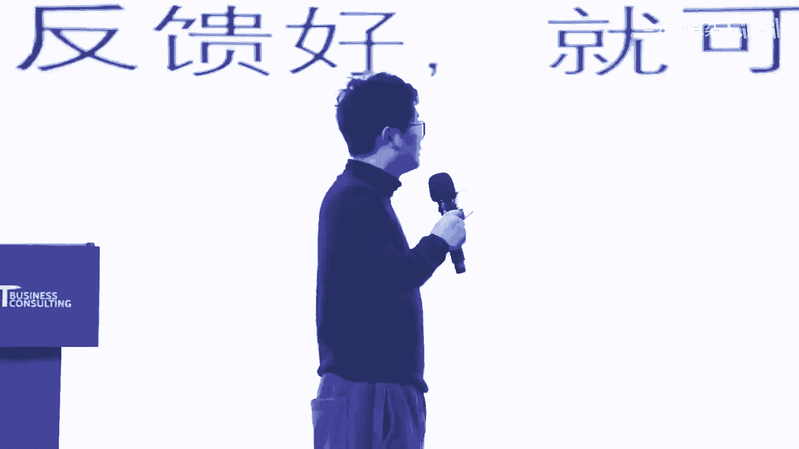

只有一条就是作品本身好，对应的用户数据行为好，所以你能跨流量池，大家思考一个问题，一个硬币抛起来落到地上是不是随机的。

是还是不是就抛硬币是不是随机的是吗。

是还是不是，我觉得不是的，大家看你觉得他随机，是因为你考虑的维度不够多，如果说一个硬币。

在一个非常高端精密的实验室里啊。

这个当然是已经有验验证的，我抛出来的高度角度力度。

当前的地心的引力，重力，下落的空间范围。

空气风速以及掉到地上的材质的硬度角度。

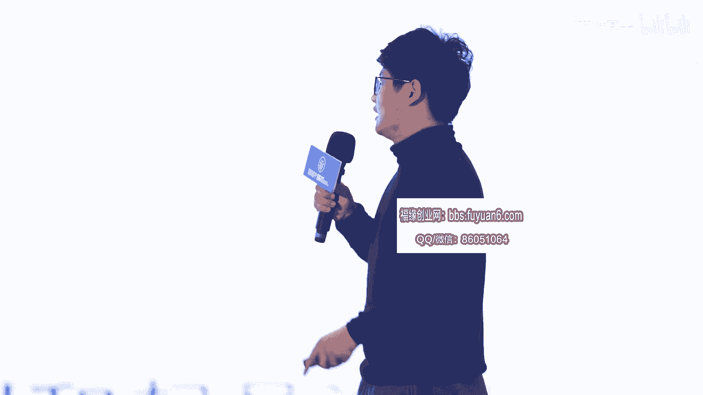

全部计算出去，那么在硬币啪抛出来一瞬间。

计算机立马可以算出来是正是反，是不是，也就是说你认为抛硬币是随机。

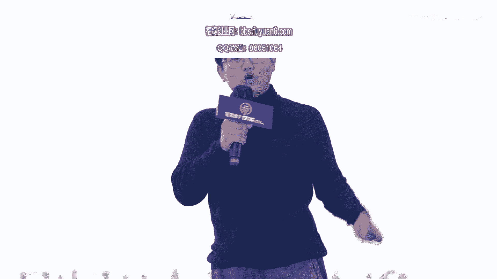

是因为你计算的维度不够。

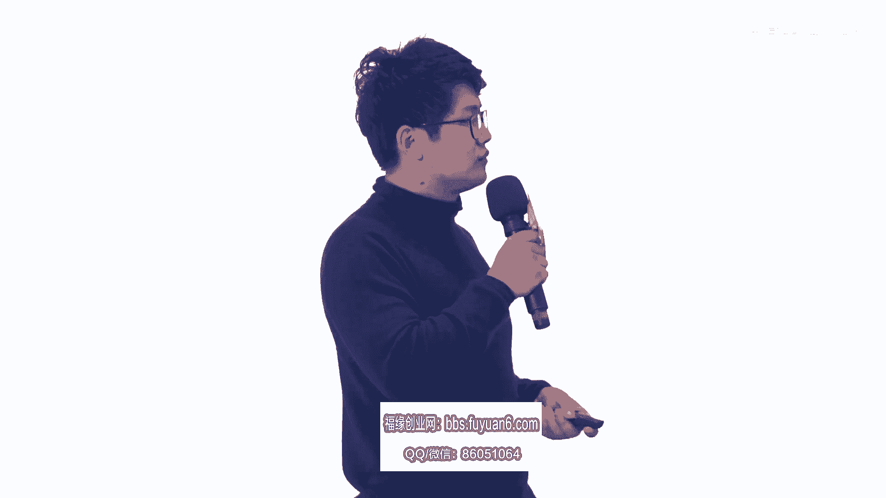

你认为上热门是随机，你认为起号是随机，是因为你考虑的维度不够。

只要你考虑的维度足够多，他妈的就是99%，因为百分之百违反广告法，是不是嗯，所以说什么是平台做项目。

做账号就是一样的平台，就是用算法支撑的，对不对，按照他的算法推送，只要你掌握了平台的推送机制，那么你就可以计算热门的级别和起号的进度。

能不能起，几天起能起到什么级别，能上多大级别的热门。

我有时候我这个稿子一写完，我看一眼稿子，200万发出来就是200万。

那么第二个问题，赵本山老师讲的非常精髓啊，把大象关进冰箱里需要几步，对不对，大家都知道三步啊。

这就是起号的核心，知道吗，把每个维度都计算进去，一步一步的做全，做到了，他妈的就能起不起，什么原因，肯定是我的维度。

第一考虑的不够全，第二哪个维度出了问题把它解决。

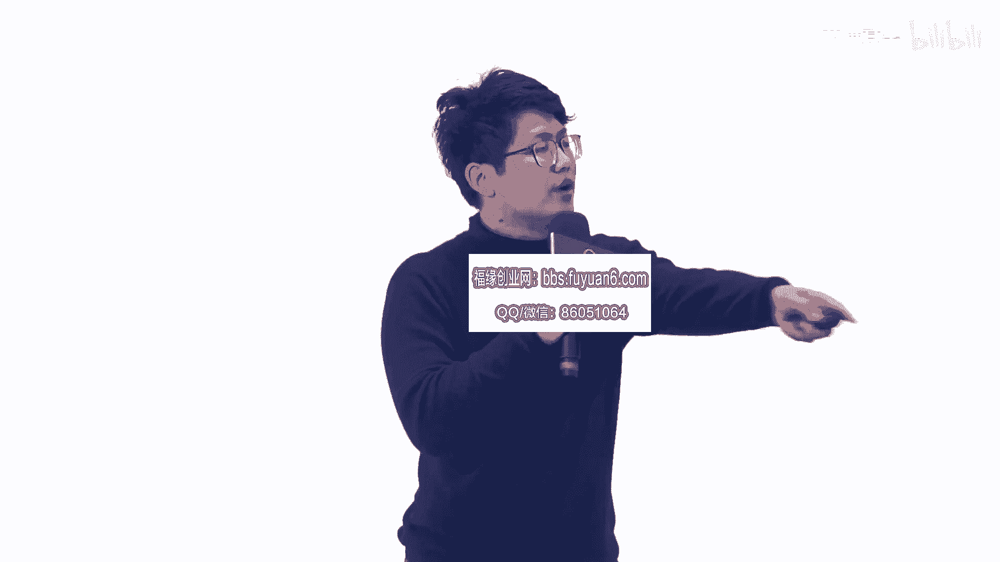

你照样能骑，把大象关进冰箱，就是三步，是不是开门把大象塞进去关门，起号也是这样，那长颈鹿呢是不是四步。

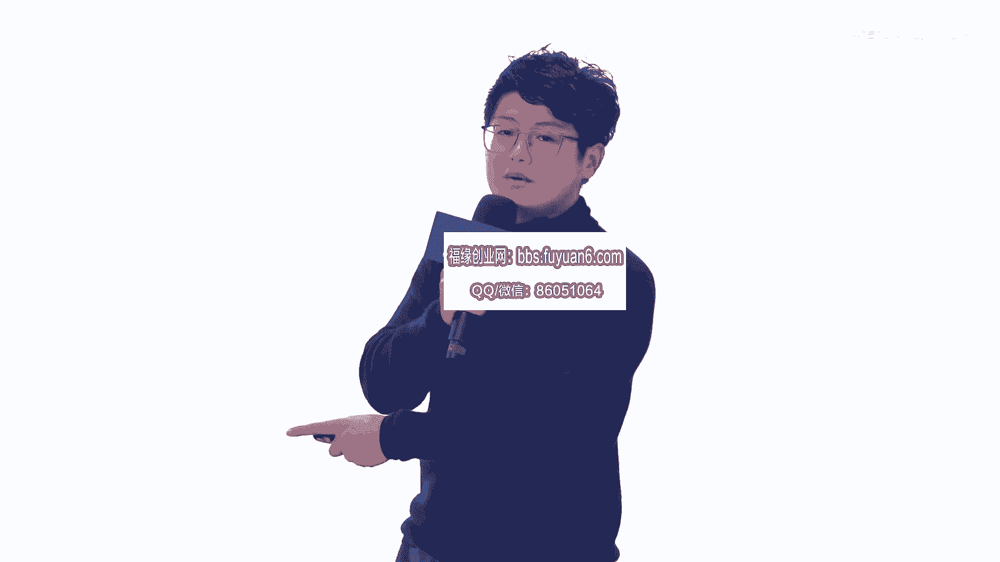

是不是开门，把大象拽出来，把长颈鹿塞进去关门。

所以我们只要把这个赵本山的这个模式。

总结清楚了，那你总结起号需要几个维度，每个步骤需要干什么，你去干了你就能起啊。

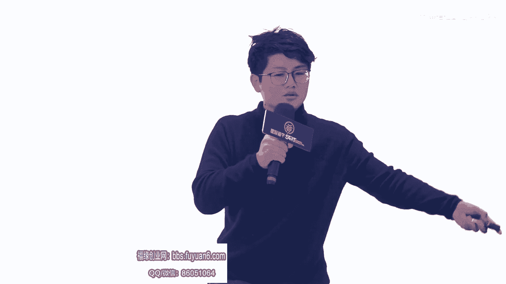

就和把大象关进冰箱里是一个原理，是不是，所以说呢计算账户起号的维度和标准化数据啊，这是说我们淘系的商家，养成了一个很好的习惯啊，想打一个爆款。

怎么打，他妈盯着竞品的数据，一个一个分析，我只要把每个数据全打掉了。

我就能拿到你的流量，做抖音也是一样啊，所以就是为什么我们来了抖音，七天干到10万粉啊，因为我们的每一步都是精密计算的啊，不容任何出错的啊，为什么啊，就是很简单，你你就想嘛，我刚来的时候，第一天。

因为这个赛道上有很多大佬，已经做了两年3年了。

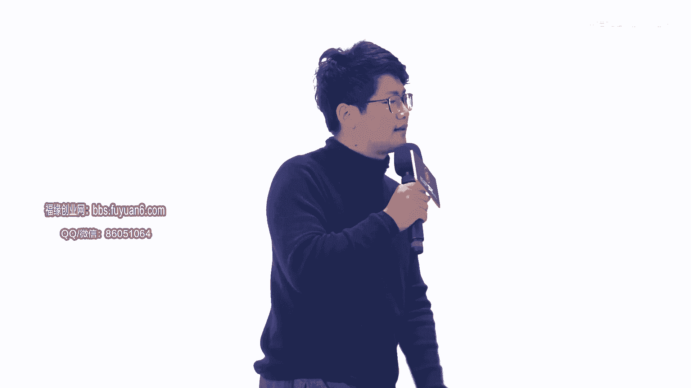

我一个新人一进来，下边全是杠精，对不对，我他妈的七天就做到10万粉，那比我做了两年3年的，都得喊咱狼哥狼哥狼哥哎哥对吧，以前的时候人家都不叼你啊。

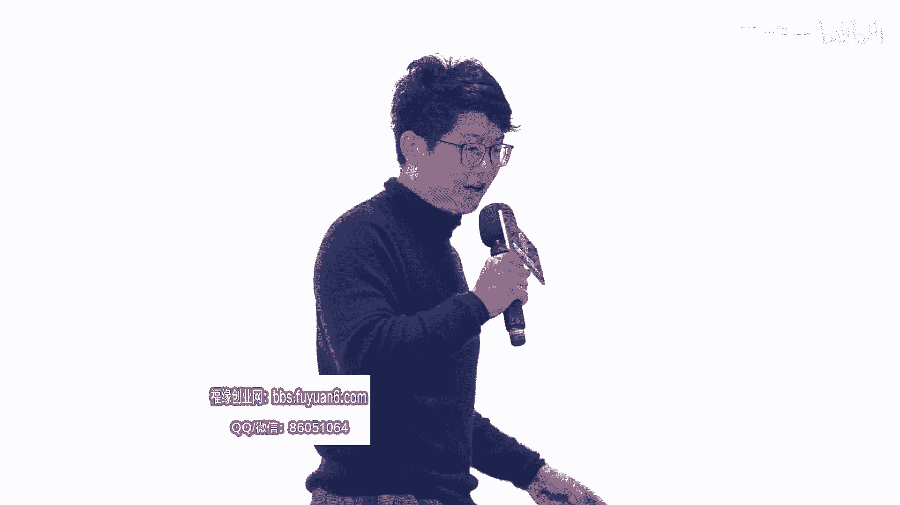

就七天狼哥，我看你直播两年了，我说他妈的我就做了一周，你妈看了我两年。

也就是说真的不一样啊，就是我七天拉到10万粉啊，我又多了一个号，20万粉，那我就是我们整个电商赛道的，不能说头部吧，那至少是前三前五的账号，那大哥都和你称兄道道弟了对吧，现在我直接200万。

第二名比我差150万，这个也是我们淘系的一个玩玩法啊，就是矩阵，你看很多淘气的商家top店铺怎么弄，第一名在第一是吧。

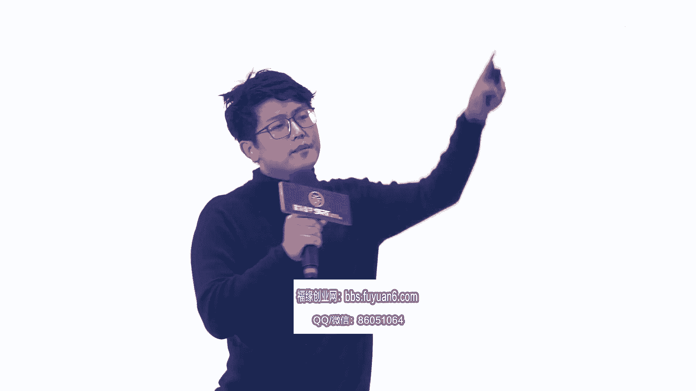

第二名第三名也他妈是他的，你后面人想上来。

不好意思，只要你超越了第三名，他妈的我就降价，我让你就是我，第一是我的，第二是我，第三也是我的，你第四名想上来，当超越第三的时候，第三名降价五块钱，你一降，他再降五块，他妈的亏十块和你玩。

因为前两个都是我的，这就是壁垒，就后面的人很难上来，除非有一天他不想玩了。

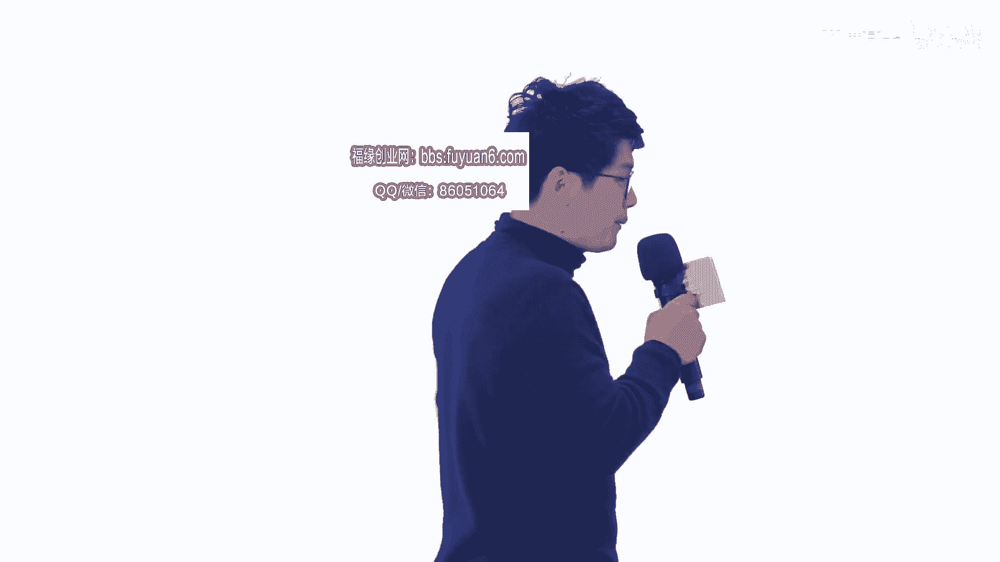

不然后面的人根本没有机会，两个点，第一计算账号的维度和数据，第二制作一套标准化的流程去执行就可以了，那我们今天就主要给大家讲起号的五个维度啊，为什么很多人只能起一个号。

起他的号，他起不来，思考这个原因，我是在任何时间。

任何月份我都可以起任何领域的号了，因为你不可复制，就具备偶然性，它有一个幸存者偏差，对不对，所以很多人学抖音喜欢和什么样的人学，就是现象级IP，他1000万粉，600万粉学吧，我告诉你。

你再让他做一个号。

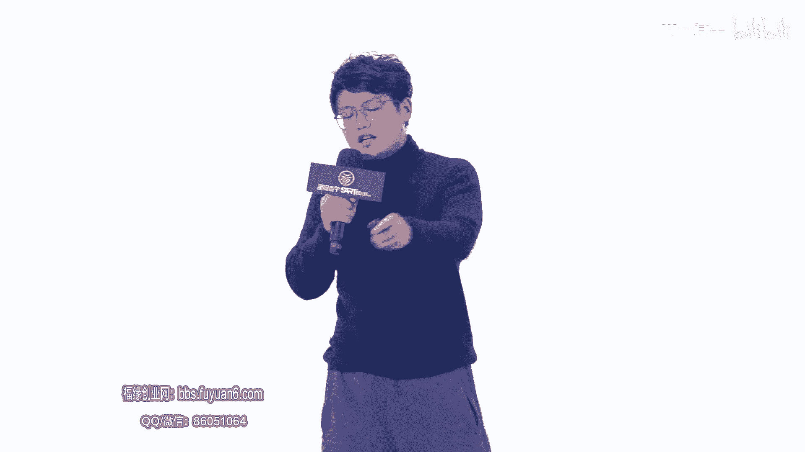

他做不起来，因为它体现象级的IP是时代的产物，它是不可复制的，但是我们90%的人只能做到。

说成年人只闹大概率事件，是不是你们可以看很多大咖600万粉丝，几百万粉丝的，他再起号的时候，他妈的他五个月就起2万。

做不起来啊，为什么，因为那是时代的产物啊，这个这个时候一过去，或者说存在一定的偶然性啊，我们成年人只聊大概率事件啊。

而且不要去对标头部IP，大多数人都能做到水平就是一到10万粉，而且这个是大多数人可复制的，所以我们一定要盯着这个赛道去做，那么我们公司的流程是怎么做的呢，啊很简单，就在我做到200万粉丝之前。

我公司里一个剪辑运营，文案拍摄和自媒体相关的人员都没有。

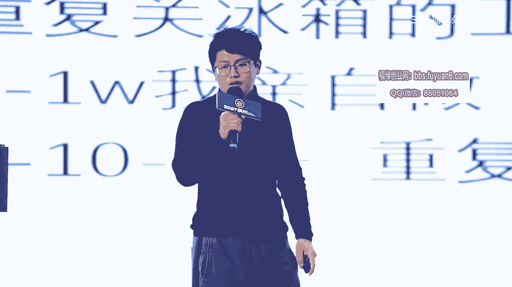

但是我们可以碾压所有专业的团队，因为我见过很多人他妈投了几10万，打了一个五六个人，七八人的团队，最后没做起来了，我公司里到就是从零到200万粉丝之前。

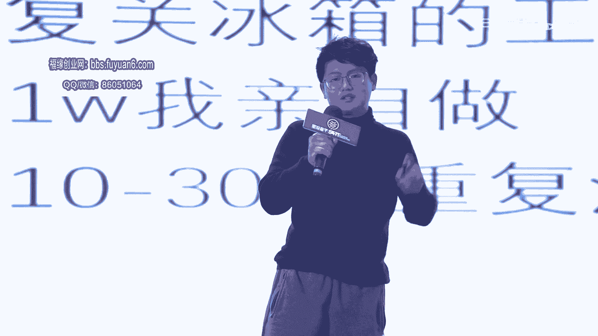

我们一个剪辑文案，就是这方面人没有，我怎么做的呢，就是从发给公司里任何一个岗位，因为我们是做电商的，我们有客服啊，有采购啊，有人事啊，有运营啊，我说来大家他们一一人一个号。

业余时间每天花10分钟帮我剪一下是吧，就可以了。

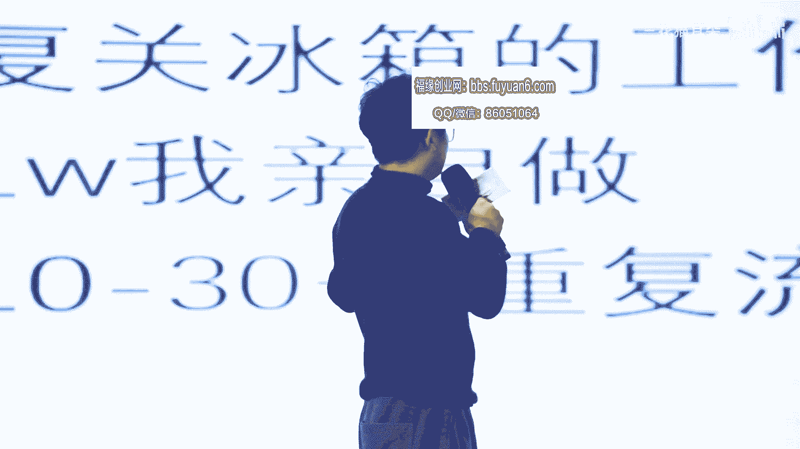

然后呢我会给他们相关的表格，给我统计数据，我来看数据分析哪个地方有问题。

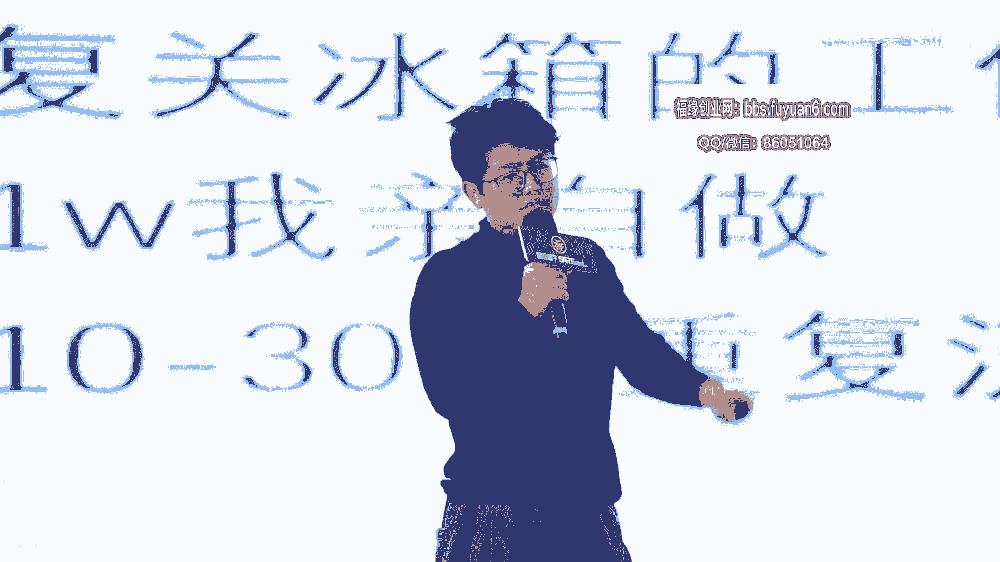

怎么调，对不对，重复的就是一个开冰箱，把大象塞进去，关冰箱的一个环节，但是从零到10万，从零到1万粉是我亲自来的，新号拿过来，我三天干到1万粉，剩下的扔给公司。

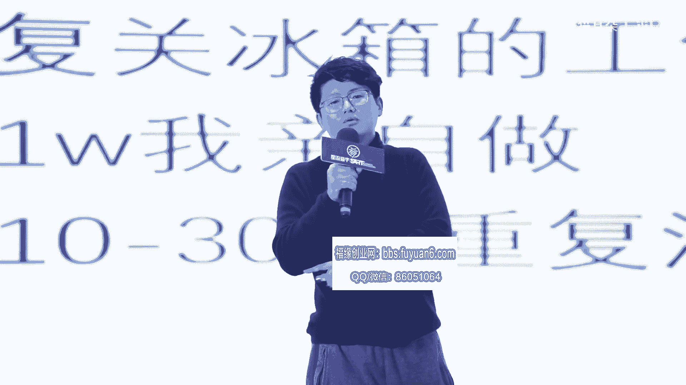

任何一个人连更三个月必起，也就是说从零到10万，从10万到30万到N万，只需要什么坚持更新就可以了，如果说你都做到了，你的账号就是百分百的啊，如果起不来，去检查对应哪个维度是有问题的。

然后呢五个维度分别有几个点，对这几个电影响因素分别是什么对吧，把它标准化流程化量化就可以了，第一排名第一的维度是什么。

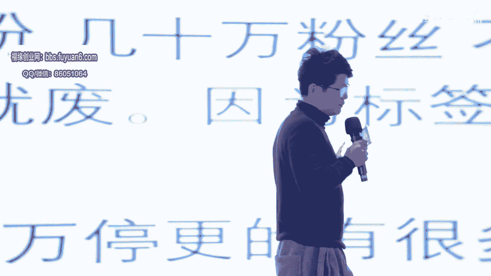

变现逻辑，这个这个我觉得也是很多误区，就很多人你一旦执着于播放和粉丝量，你就会忽略了变现逻辑，第一个维度一定是变现逻辑啊，内容做到对吧。

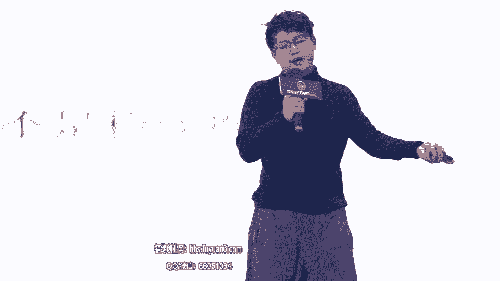

几万几10万，上百万乃至上千万的，挣不了钱的太多了，为什么没有变现逻辑嘛，对不对，如果说你的变现逻辑是不成立的对吧，那聊其他的都是扯淡，先解决变现逻辑是否成立，有没有成功案例，对不对。

不要说做多了几万粉丝。

做到几几10万，发现他妈不挣钱，这个时候很多人又进入了一个误区了，我要转型对吧，我要转一下，为什么一转他妈就废，因为刚才也讲了，抖音是他妈标签推荐机制。

你一转型就代表着你放弃了你以前的用户标签。

说的直白一点，哪怕你现在100万粉丝，你只要发和你现在用户标签不相符的东西，你的播放量他妈立马就掉没了，点赞量一开始两三百，最后100，最后几十。

最后十个那号就废了，所以你去转型远远不如起一个新号来的快啊。

因为这就相当于我在杭州对吧，我往三亚他们跑了2000km之。

现在我要去北京，你要转型，你掉头，你是要多走2000km的路，那你就不如从杭州直接去北京来的快啊。

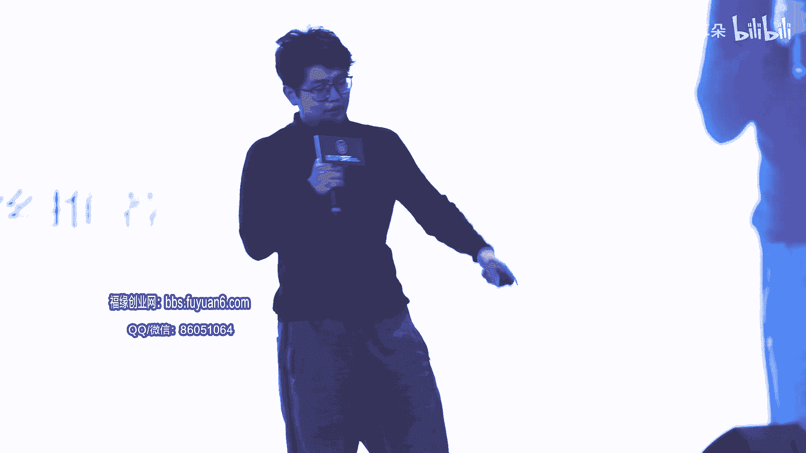

因为你的粉丝毫无意义啊。

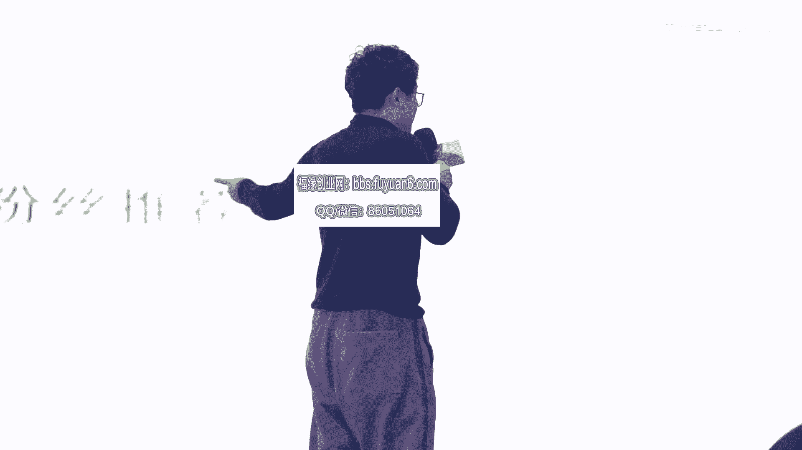

因为你比比方说你是一个做影视剪辑的号，减到了100万粉丝，对不对，剪完了之后哎发现不挣钱。

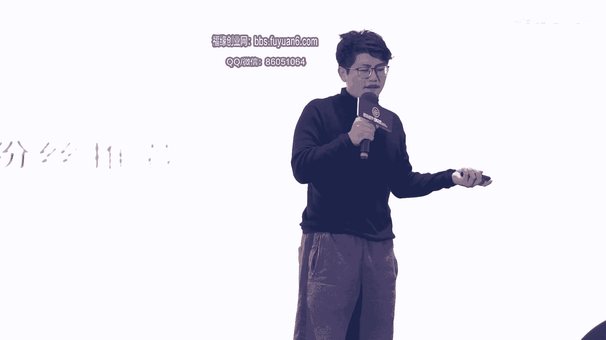

要做餐饮啪，明面上你是100万粉丝，实际上你那个播放量差的要死，连他妈1000的信号都不如啊，很多人说哎呀我那么多粉丝，我舍不得你，舍不得个毛啊，那是你的粉丝吗对吧，就很多人他是一个心理作用啊。

就跟搞对象一样，你们你没发现很多就是女的哈。

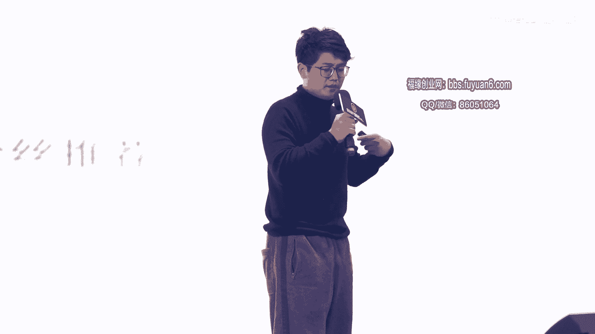

这个男的他妈的打三次胎，外面找七八个对象啊。

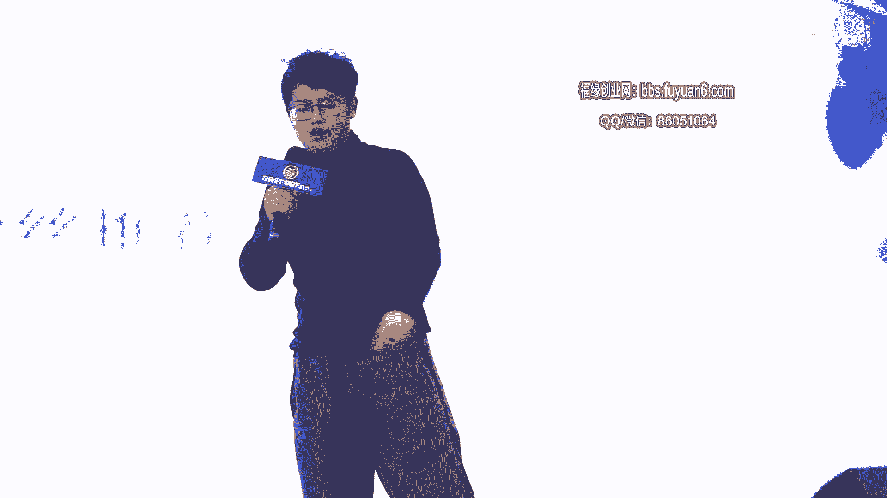

不能分手，一分手好哭，为什么他付出的太多了，他就会认为哎呀我付出的太多了，妈的分了我就亏了，这个也是一样，我付出太多了对吧，我都做100万粉了。

我他妈做个新号，我就亏了你那粉丝毛毛用没有，下一个更香。

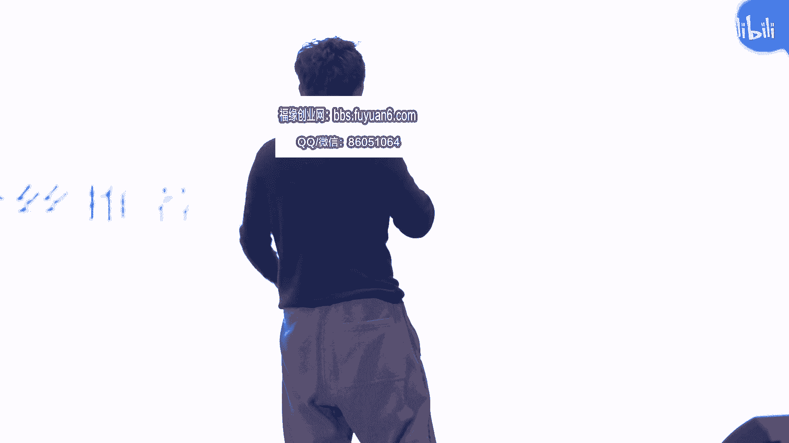