# 第四课-亚马逊常见各类优惠券、促销设置方法 - P1 - VIOMALL - BV1zFx5e8EeZ

啊就是怎么去做一些常见的折扣，还有优惠券啊，还有一些这种品牌的专享折扣的这种啊促销的方式和手段。啊，我第一个我我我这里分为三个部分啊，第一个就是针对亚马逊的一个primer的折扣啊。

就是亚马逊会员的一个专享折扣。第二个就是亚马逊全店的通用优惠券啊，怎么设置。然后第三个就是店铺的品牌的专享折扣。这个的话要求会稍微难一点点。但是它的转化确实不错啊，我之前有开过啊。

转化的话跟促销差不多啊，我个人觉得呃如果你要我排名的话，促销的转化最好。然后其次就是你如果有机会能够开这个品牌的店铺的专享折扣，那就是第二哈，然后第三才是优惠券啊，优惠券不知道呃。

可能是我开的没什么吸引力吧。能文件能不能分享一下呃，文件那个小飞虎，你可能要呃私信一下我们啊，你私信一下我吧。啊，好吧，然后我才能分享给你好不好？啊？那个小飞虎，你还在吗？啊，抖音那个小伙伴小飞虎啊。

如果你还在的话，你私信一下我我们要加一下你的好友，我才能分享给你啊，你有没有做我们这个平台啊，你有做我们这个平台吗？我都不知道。🤧好吧，OK我们接接下来我们讲讲我们今天的第三个这个。

要不你呃要不你等一下，我我你直接扫一下我的码好不好？你扫一下我的码，然后我把我把我这个码给你，然后你直接。大家稍等我一下啊大家稍等我一下，我把这个码给这个配销商。大家稍等我一下。

我把我的这个二维码给这个分享。那个小飞虎小飞虎，你可以扫一下我的这个二维码，然后我我可以。然后我把这个这个这个文件给你好不好？我共享一下哈，各位。

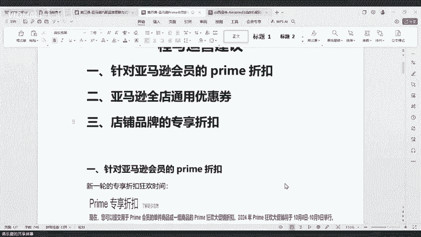

啊，我们直播间啊几十个观众啊。有没有不是不是我们配销商的，或者说啊还没有加我啊，但是有想要今天一些文件的啊，就是我们可能老分销商都会啊这些操作。但是有可能有一些新的小伙伴啊啊可能不太会OK呃，好。

那么我们继续。

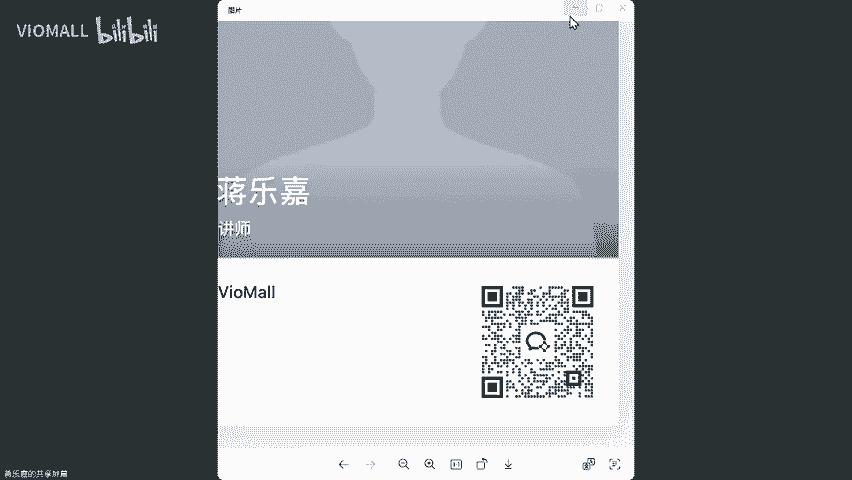

啊，对，那个小宋德说对这个品牌专享折扣最低10%啊，是的，最低10%，那就看你自己了。但它转化确实有的呀啊，看你们自己好不好，看你们自己。哎，这个这个因为他这个会有一个专门的推送啊。

这个会有一个专门的推送，所以它的转化效果真的非常不错啊，转化效果真的非常不错啊，我们先讲第一个啊，就是亚马逊的prier的折扣啊，这个折扣的话，目前啊最新啊最新的2024年的prier的狂狂欢大促销。

在我们下个月的10月8号到10月9号又会有啊，10月8号到10月9号又会有。然后大家如果啊有兴趣的话，可以去报个名啊，有兴趣的话，可以去报个名。然后这里我先跟大家讲一下这个资格啊。

第一个就是呃如果我们要去做这个prier资格的话，第一个首先你就是要你的这个产品必须要有评论啊，并且评级最少为4颗星啊，四颗星。然后第二个就是折扣价比这些不是prier会员的话，你至少要比他便宜20块。

20%啊，就比如说举个例子啊，你卖给啊普通的会员啊，不是普普通的这个观注那个顾客啊，是100块。那你这个卖给preer会员，你只能最少是最最高最高不能超过80%啊，就因为你至少比他优惠20%万，是不是？

然后第三个就是折扣最多只能比非prier会员的非促销价格减少80%啊，这个跟前面一样啊，不用管它。然后第哎这反正就最最关键的两个就是第一个你要有评价啊，你要有评价。第二个啊。

你这个产品必须要比不是per会员的要便宜20%啊，不是，然后还有最后一个最后一个这个也比较关键，就是你的专项折扣的价格，必须比你历史就是比你之前从你这个历史情出现之后，你只要打过折的，比你历史的所有的。

不管你什么时候开的这个折扣都要低个5%，就比如说啊这个产品100块，对吧？你历史有一次以75%去卖的那你必须要比这个什么比这个历史低价75还要低个5%才可以啊，当然了一般我们这种都不存在啊。

我们这种一般都是可能是新品啊啊，或者是一些啊反正就之前可能没怎么产生过销售，或者说没怎么做过调价的啊，没怎么做过调价的这种一般我们都我们都是能够达到它的这个要求的。我们一般话。

我是说一般我们是能达到这个要求的啊，我们一般是能达到这个要求的。好吧，OK呃，我们现在继续啊，这个是他的一个要求。然后第二个啊这里还有一个比较重要的哈，这个这个是你要做prier的。因为这个专项折扣。

它要如果你是做FBA，那你就不用不用管啊，你直接就能做。如果是像我们做做做这种自发货的话，它会有多一些的限制啊。第一个就是什么？第一个就是你的配送的延迟率啊，不能超过4%啊，不能就持发率不能超过4%。

啊，然后第二个就是你的这个订单的缺陷率不能超过1%，就是你自己店铺啊，你店铺的ODR不能超。然后第三个就是配送钱的取消率，就你主动取消的，不能超过0。5%，就是每200笔最多只有一笔，好吧。

最多只有一笔。第四个还有这个也很关键，就是你这个如果你要做这个prier的专项折扣。你的最低的这个价格啊，这个不能有运费。啊，不能有运费，就这个产品必须是免费配送的啊，必须是免费配送的。好吧。

OK这个是它的一个硬性要求啊，硬性要求。大家可以看一下啊。然后第二个就是我们怎么来创建这个专享折扣啊，第一个就是在我们的广告里面啊，这里点进来有一个prier的专享折扣这个界面啊，这个界面。

然后进来之后，我们在这里可以看到一个什么，看到一个创建折扣。然后再创，然后我们继续点进来，点进来之后啊。啊，我这里可以直接给大家打开来看一。那，稍等我一下，我把这个。哎，我把这个店铺直接给大家打开来看。

好，大家可以看到哈，这个就是然后这里的话呢，我们就可以怎么样，我们就可以直接给他创建啊创建。啊后创创建完了之后呢啊，我们这里就把这个啊命名这些都设置好。然后注意这里它是要收费的啊，他是要收费的。

这里如果你创建成功的话，它是要向你收50块钱啊，然后这里50美元啊，550美元。如果说你这个你创建了成功。但是你没有产生过任何的销售的话，亚马逊是不是收费的。但是如果说你有啊你有这个对应的这个销售的话。

它是要向你收取一定的金额的啊，他是要向向你收取一定的金额，然后大家把这个填好之后，然后这里有一个时间。啊，然后把这个啊这个填好啊填好。然后我现在举个例子啊，我现在测试测试啊，我现在勾选啊。

这是prim会员大促折扣啊，prim会员大促折扣啊，因为10月8号到1月9号嘛，是吧？然后我点点进来。啊，我我现在这个不符合啊，我至少要获得四星级卖家反馈啊，我看一下我这个是多少。我看一下我这个是多少。

啊，3。87。好吧，那我这个不符合没办法啊，这个店铺暂时不符合，只有3。8开心啊，那没关系啊，我给大家讲一下我给大家讲一下。呃，不是是以整个就是你报名的这个活动啊，你报名的这个活动的话。

它需要向你收取的是这个费用啊，就你报名的这个活动，它就是向你收50啊。那我我这个我这个参加不了啊，因为我现在这个暂时有点高啊，有点高那个评价不太好啊，评价不太好啊。

大家如果你的店铺评级超过4超过4颗星啊，你可以去报名啊，可以去报名。然后这里啊第四步就是你在这里面啊第二步，你把这个时间填填写好了之后，然后第四步啊，你在这里可以看到什么。

你在这里可以把你的一些SKO啊，就你比如说你的折扣类型啊啊，然后你的这个金额啊，你的最低价格啊巴拉巴拉给它全部填好，然后你点提交商品然后这里啊pri的会员的专享折扣。

最多一次可以让你提交500个SKO啊，最多可以让你一次提交500个SK但是你这个提交的方式怎么样，你得用表格啊，有SKU限制嘛？有有我刚刚不是讲了吗？他对SKO是有限制的，就是那种啊你要有评价啊。啊。

你要有这些呃，就你要你要有反正就是你要有过一些相关的销售的才可以啊，你要有你得有你的要有评价。我这前面大家可以看一下你的商品必须要有一条评论，而且评级至少要有4颗星啊。你的商品至少要有一条评论啊。

我前面讲的啊，就是没有评论，你就不要想啊，因为这个针对prier会员的话，它的转化效果确实还可以。如果你能报名成功的话啊，一般来说还是能出单的啊，而且出单效果还不错啊，出单效果还不错。

所以说那种就是我们自己店铺里面你可以优先第一，你要先看你自己的店铺有么四颗星。第二，你要把你店铺里面有有过评论的SKU给它挖出来，挖出来之后去报名啊，你你不可能全部都去报的啊，报不了的啊，报不了。

这个是针对10月8号和9号啊，那两天专享的一个折扣。在哪里看有没有评论。就在就在我刚刚给给你讲的那个。买家评论呢。买家买家自身也可以吧。稍等啊，我我把这个打开给你看一下。啊，稍等啊各位小伙伴。哎。

有点卡。啊，在这个。

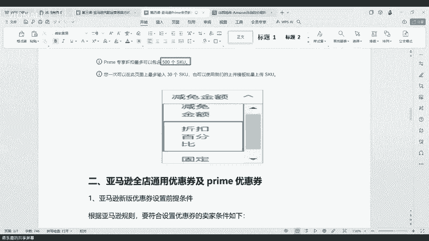

在买家之身啊买家之身。

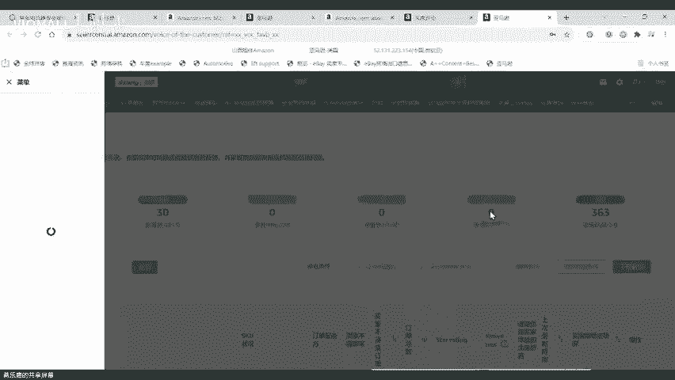

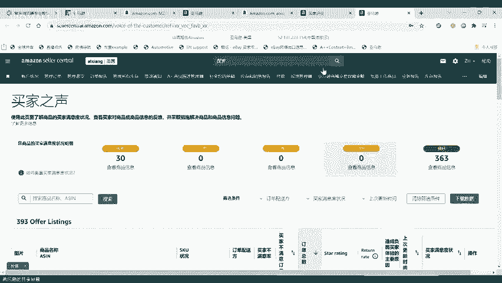

啊，在我们的菜单里面。啊，注意看一下，在我们菜单里面啊，菜单里面呃，我看一下这个买家支撑在哪啊，因为我是直接把它放到我那个顶头那里啊，在卖菜单绩效买家资撑里面啊点进来。

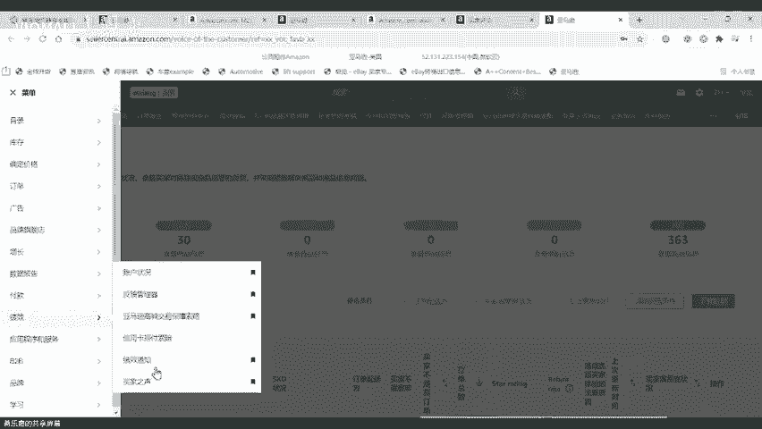

啊，点进来，然后这里面会有一个看到没有？这里会有一个星星啊，但是我这个下架了啊，我这个下架了丢掉了啊，然后这里你看到没有？这个像我这种啊，我这五颗星的是吧，我又有评价的是吧？那像这种的话。

我就可以怎么样，我就可以拿去啊，我就可以拿去做这个促销，我就可以拿做这个促销，然后你自己去找一下啊，你自己去可以自己去找一下。这里面啊，因为他这个星级好像没办法没办法这个筛选，它这个星级没办法筛选。

所以有点尴尬啊，有点尴尬，他这里没办法筛新的啊，没办法筛新。啊，也可以应该也可以直接下载数据啊，我我可以直接下载这个数据啊，大家可以看一下这这个我我有几个SQ有评论，不是你你没出单。

他又不收你的钱你出单的话，你就赚了呀，知道吧？你没出单，他不收你钱的呀啊，这个专项折扣你没出单，他是不收钱的啊，他是不收钱的啊，大家也可以直接在这里啊。

在右上角这里有一个下载数据啊后右上角这里有一个下载数据，我们可以直接把这个数据下下来，然后在这个数据表里面啊，可以比较快速的啊，可以比较快速的把你相关的这个呃SQ给他筛出来啊，可以快速的。

然后你把这个SQ拿去提交报名。我是建议如果你店铺符合的话，把那些值钱的拿去报一下啊，真的效果还不错啊，真的效果还不错。那那这个呃怎么说呢？就是收就收嘛，是不是收就收嘛啊。

如果你这个确实有一些不错的那转化效果，反正我们之前有专销商有报过啊，就是。活动那几天啊呃一天出个十几单啊，有两有两三天的话，出了大概三四十单吧，反正平均每单可能赚不到10块钱啊，能赚几百块了。

我有个有心级，但是没评论啊，应该也可以，你可以去试试。我个人建议去试试。然后大家看我现在数据已经弄好了。我现在把它下下来看一下啊，现在把它下下来看一下啊，可能开的软件有点多，有点卡啊，大家稍等我一下。

好，我们现在点开。呃，他这里不显示星级哦。啊，好吧，呃，这个不显示星级，我们只能在这里看啊，我们只能在这个我们只能在这里面看啊，只能在这里面看。没办法啊，他那个下载的数据包是不显示星级的。

大家可以看到吧？这个是我刚刚下载的那个数据包啊，它是不显示星级的，没办法啊，你只能在这里看，只能在这里看。呃，明年的会员一样的，会员是跟这个差不多了，也都是针对会员的。

如果大家开不了那个呃就如果大家开不了那个prier专享折扣，你可以做一个优惠券啊。这里呢我就这里我跟大家讲的就是啊针对这个亚马逊会员的一个prier狂欢大促啊，它是限定时间的，它只有在那些时间才会有。

如果你能开就开好吧，这第一个我跟大家讲的怎么去开。第二个啊给大家分享一下，这里就是那个小乐宝，你可以参考一下这个啊，做一个全店通用的优惠券或者是亚马逊的一个专享的优惠券。

然后这里的话呢优惠券它也是有一些要求的啊，优惠券也是有要求的。第一个他要求你是专业卖家啊，并且你的评分反馈至少为3。53。5颗星啊，3。5颗星。就是呃在我们的店铺首页那里，你看你的心数，如果你没有3。

5颗星。如果说你是一个没有收到任何反馈的评级的卖家也可以就说你是一个新卖家也可以去开优惠券，知道吧？如果你是一个老卖家，你的分数要有3。5颗。啊，3。5颗星。要如果你是一个新卖家啊。

也是可以直接去开这个优惠券的，也是可以开这个优惠券的。还有就是第二个啊，这个是针对你买家的要求，买针对我们这个卖家的要求。然后第二个就是针对商品啊，商品的第一个就是没有评论的商品可以可以去去弄啊。

可以去弄。然后如果说你没有啊你新店铺也是可以去设置的。如果就是说如果你没有任何的评论啊啊，你也可以给他去做这个优惠券。如果你商品有评论的话，就是第一啊，如果你有1到4条评论的商品，你的评分要有2。

5颗星啊，2。5颗星。然后如果你有5天以上的这个评论的话，你最少你要有三颗星啊，你最少要有三颗星，你才能去开这个是吧，你才能去开这个亚马逊的优惠券，好吧，然后商品如果是有卖家自配送啊。

是可以去开这个的啊，你可以去开这个的。然后这个呃。啊。But。具体的开的开这个优惠券啊，优惠券。第一我们要找到这个菜单啊，在广告里面啊，有一个这个优惠券啊，这个这个这个提示啊。

优惠券这个提示我们点进去啊。如果说你的SQU比较少，你可以直接手动开啊，就你把那个A选呢，把那个把那个A选给它放进去啊，就可以了。你在这里不是有一个创建优惠券吗？啊，你可以直接给他创建，大家可以看一下。

其实还是有效果的啊，我这里还是出了两单啊，虽然说确实比较少。

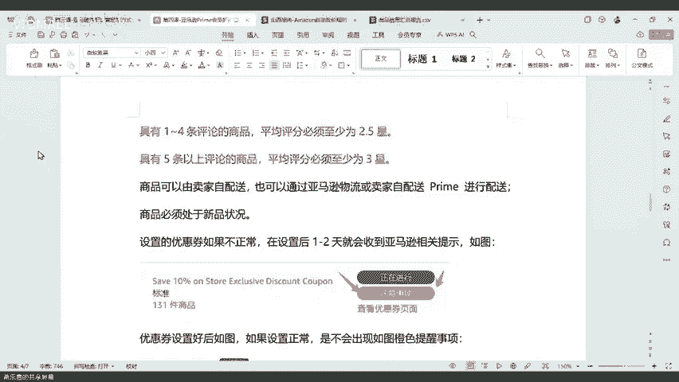

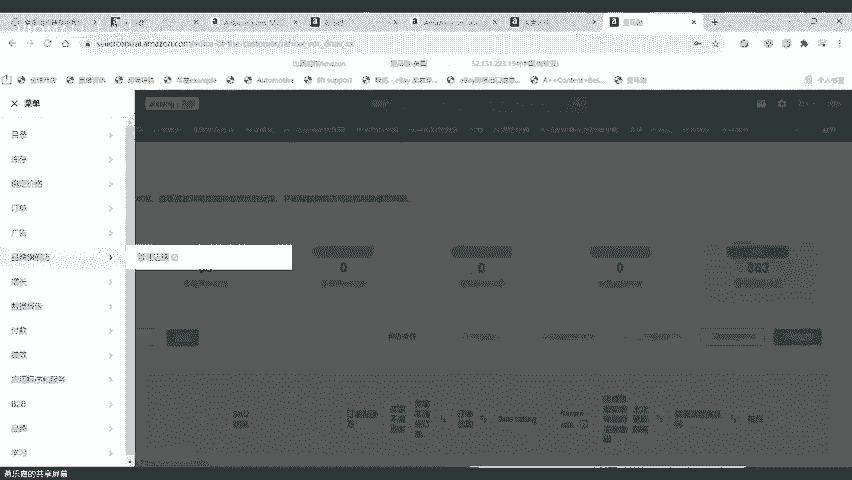

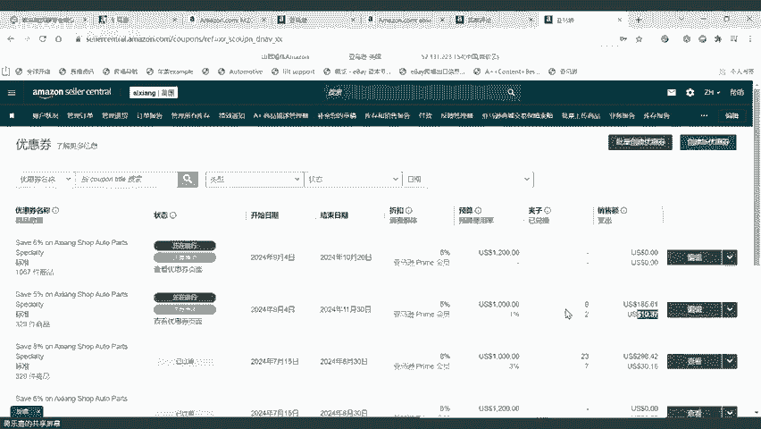

没为我这个是针对。拍搞会员的我都说了，这个优惠券的转化是真不如促销啊。你看没有9个人领了，10个人领了，他不买呀，是不是这些人是吧？他9个人，10个人买了，他他他不他他他不他不弄啊啊，是吧？他不弄啊。

然后这里。

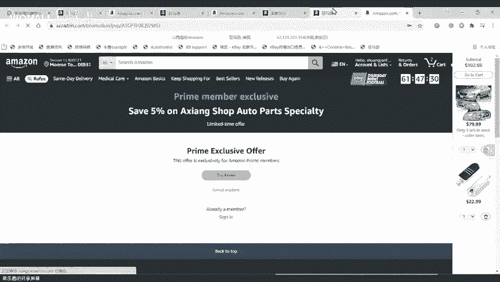

啊，然后这里面大家可以呃这个。然后这里面可以看到。啊，他有一些是禁止显示的，就是没开成功的。啊，然后点进来看到没有？我因为我这个是开的什么？我这个开的是prier会员专享的。所以说啊我们点进来之后。

我这里是这里它会提示你啊，要开505050美元或者怎么样成为prier会员，就可以享受一个专享朋后啊，就是我因为我这个号没有我们这个是卖家号，我们肯定没有开pro会员嘛啊。

所以说如果你是prier会员的话，你点进来之后。你就能看到他给你的一个什么给你的一个优惠券提示，哎，你就能看到他给你一个优惠券提示。如果说啊大家可以看一下，在这里啊这里。啊。

这里我这个这个展示这里面就有一个什么，这里面就有一个优惠券啊，这里有个这里这个商品就有一个优惠券啊。如果说啊如果说我们的小伙伴啊，你拍的能你要拍的这个比较少，你可以直接在这。

优惠券不是开针对所有买家比较好吗？可以呀，这个看你自己嘛，是不是看你自己我是开那个primo会员的啊，看你自己了，就是说有两种类型啊，或者说有三种类型。第一种啊，你是针对所有的买家。

第二个啊你是针对这个会员。第三个就是品牌啊，就你这个品牌去打这个广告啊，所以说呃怎么说呢？就是看你们自己的一个想法，好不好？我是开的会员的啊，那肯定来说要说这个受众度的话。

肯定是开这个所有的人是最好的啊，开给所有人是最好的啊，就是我就就像我现在给大家演示的这里，对吧？这里有一个所有买家啊，你这里有个所有的买家，然后你就可以怎么样。

你就可以啊把把你的什么把你的A选给他放进来我这里随便挑一个好吧。我这里随便挑一个啊，我这里随便挑一个。比如说我现在这里啊搜索一下。啊，然后我这里点开啊，然后你就可以怎么样啊，然后你可以选择参与。

然后你就点继续，然后再往上面这里就有一个继续啊，反正就是你有你就你如果SKU比较少。你就直接通过这种简单的方式啊给它上传，然后你点进去，然后你就点给他设置啊，点进去。然后完了之后啊。

这里就会有一些相关的要求。比如说日期折扣或者说是满减啊，或者说然后你的一个预算，然后你的优惠券名称，然后他是不是可以叠加促销，或然后如果你开了促销，他就会问你是不是可以叠加优惠券，一般来说都是选否。

就是他只能二选一，哪个优先多啊，他就优先展示哪一个，知道吧？然后你点进去，然后就算开完了，就算开完了。然后你开完了之后呢。啊，如果各位你开完之后啊，假如你开完了之后，你就可以在什么，你就可以在这里啊。

你就可以在这里看到你开的这一个啊结果，你就可以在这里看到你开的一个结果。然后在这个里面呢啊你就可以看到。因为有一些像比如说啊我有一些产品是不符合开的这个要求的，所以说就没办法进行展示啊。

所以说就没办法进行展示，所以就很看那大家可以可以看到在这里有一个禁止显示的A选啊，我总共有1000多个产品去开这个，但是我禁止显示有900多个，就是说有900多个都是没有开成功的，能理解吧。

就是900多个都是没有开成功的。然后我们开不成功的原因呢，他也会告诉你啊，像比如说这里他就会告诉你啊，你销售的历史记录不足，然后没有就是说没有产生过销售啊，没办法卖啊，没办法卖。

然后还有你看大部分都是说没有产生过销售。这种是什么？这种它不属于是新品啊？我刚刚说了，如果你这个商品是一个纯新品，是可以去开这个优惠券的。但是我这些SKU啊，他之前是有产生过销售的。

但是后面在开优惠券的这段期间，就是在亚马逊去查我啊，在比如说在60天之内有没有产生过销售啊，那他确实没有可能就怎么样就开不了。如果你是一个纯新品，你是可以去开这个优惠券的，你知道吧？你是一个纯新品啊。

你是一个纯新卖家，你是可以去开这个优惠券的。然后能开的，他就不会跳这个感叹号，好吧，这个是简单的，就是说你你针对这种单一的怎么去操作。然后这里呢啊我跟大家讲一下，就是如果你要去开一个什么多的是吧？

比如说你这个比较多，那你可以选择什么样？你可以选择啊给他做一个批量的优惠券。

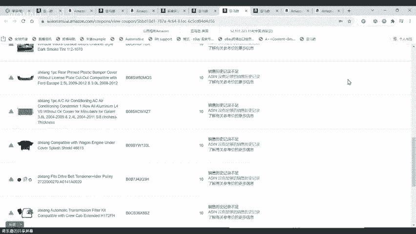

啊，大家可以选择去做一个批量的优惠券，好吧。也是在这里啊，我刚刚讲的是这个单个啊单个。然后这里的话呢啊大家可以去看一个什么？在这里有一个批量创建优惠券，在这右上角，你可以把这个文件数据包给它下下来啊。

下下来之后啊，然后你把这个它下下来之后的这个数据包长这样啊，你等一下，我看一下我的这个下下来的在哪里。

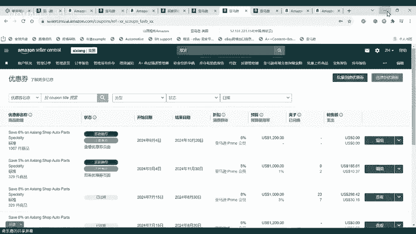

🤧哎，哦，在这里他是有1个APPSSPC开头的啊，SPC开头的。啊，稍等一下，我把这个屏幕切过来。

啊，大家能看到了哈，它会有一个这种针对SPC开头的这种。然后这里的话呢就是针对啊如何批量提交优惠券的一个思路啊，如何批量提交优惠券。然后在这里左边啊这两这几列，你不要去动它啊，你不要去动它。

你你大家可以看嘛，这个红色的是必填项是吧？然后这个我们只需要填灰色，这里面，我们有一些分销商直接让人家橙色这里填橙色这里你不要去动它啊，你比如你是什么，你就填什么？比如说啊你这里有多少个。

然后中间注意记得要用什么，要用这个什么分号啊，逗号或者空格来进行分隔，知道吧？你不要不分啊，我我这里就假如我是我是开批量，对吧？我开这么多多啊这么多。然后第一步我要把A选填进去对吧？

然后第二个我要把选择我是要减金额还是选折扣啊，选金额选择选折扣，然后这里比如说这个是金额，对吧？这里是折扣，一般是开折扣啊，我我举个例子我开折扣啊，然后我这里折扣的数值啊，你不用去选，就你就填。

你要折扣了多少额度就好，你不要自己去加分号，你你填5%之后，他自己会给你一个百分比，知道吧？然后这里啊如果你是填金额啊，那你就直接填金额，但是我我们不填，我们就不用动它好吧，然后这里优惠券的名称啊。

优惠券名称你是啥啊，你就是啥。注意这里是像买家展示的，不是给你自己看的啊，优惠券名称你要自己去填。就比如说啊我这个什么啊专属折扣啊，专属折扣我只是举个例子啊，我这里只是专属折扣啊，专属折扣啊。

比如说这个他叉汽配店啊，汽配店专你要肯定要翻译成英文知道吧？翻译成英文，然后这里优惠值的一个预算啊，就比如说我是800块啊，800块，你也不用去填每美元这个符号人家都会有，知道吧？人家都会有。

然后这里有一个日期啊，日期的话，你就要是多是是是什么，你要填什么，你可以把它上面这个复制下来啊，你可以给它上面这个复制下来，那比如说我们现在是啊2024年对吧？那我现在这里就填9月啊，2225号啊。

0点啊，或者是0。0000开始，然后到结束时间，那是多少，就是填多少是吧？然后这里啊，然后再往后面啊，他会有问你啊，这个是不是只能买一次啊，你可以选择4，你可以选择否啊，你选四就每个人只能买一次每个账。

然后这里然后你目标买家这里就会有一个是所有人还是亚马逊prier会员啊。我如果你是所有买家啊，你要提高你的受众的曝光度啊，你就选所有的买家。如果你是要针对prier会员，你就选prier会员好吧。

然后这里能不能叠加促销，那一般来说是选否，如果叠加的话，你促销5%优惠券5%。那这个买家这一单他就可以抵扣10%，所以说我不建议大家去叠加啊，除非你真的舍得下血本啊，那你愿意叠加，你就叠好吧，好吧。

然后这里的话啊，注意这个目标买家自己一定要选清楚啊，自己一定要选清楚哈，假如我现在这个开完了，对吧？我就回到是吧？我就回到我的这个呃。我的这个亚马逊啊，然后我在这个批量这里是吧，我在这个批量这里。

我给他怎么样，给他选择文件给他传上去。就把刚刚这个SPC啊SPC这个文件给他传上去。然后你就你就等他的一个什么么。他的结果他马上就会给你一个结果啊，就告诉你开没开成功啊，我们有很多分销商。

他可能没开成功，那他没开成功，到底出现错误在哪里呢？第一个就是他们的A选没有分裂啊，没有找对啊，就他直接就是一个一个A选挨着，我都说了，这里要分号啊或者逗号或者空格号。

然后第二个就是他们在填这些数值的时候，他自己去加了什么分百分比啊啊，然后或者是自己加了什么美元的符号啊，还有就是他的这个时间，这里他可能选的不对，他没有加上啊，具体的年月日的，然后一个时间。

比如说呃25号凌晨0。00。00，他就写了个时间啊，都写了个日期啊，可能就开没开成功，还有就是这个上面。啊，这个上面。要求你这个红色的项目值必须要填的怎么样？你没填啊，你没填啊，所以也会导致。

但是这里有一个折扣和一个满减啊，这两个你只用二选一，知道吧？折扣和满减，你只要二选一，你不要两个都填啊，只只二选一。还有一个就是啊这后面有一些关键的数据，它没填好，也会导致优惠券平台会显示吗？呃。

我们平台不显示，你亚马逊当然会显示啊，这个是亚马逊的优惠券，那哥啊。好吧，然后这里呢一整个就是优惠券的一个提交。然后这里还有一个要跟大家讲一下，就是每这个优惠券你每一个类型哈。

就你每这里这里每一列啊过去就代表一个类型。如果你是选择用表格的形式去上传的话，你每一类型的优惠券你至少要有15个A啊后最多有2900个啊，就是你超了也不行，少了也不行啊。如果你少的话，就像我刚刚说的。

你直接在后面后台去传就可以了啊，如果你多的话，你太多了，你就要分成好几个啊，比如说这里2900个，下一列2900个，再下一列22900个啊，但是一般都不会有2900个这么多的啊。

因为优惠券不像之前那么好开了是吧？优惠券不像之前那么好开了好吧，O这个呢就是我们啊开优惠券的一个思路啊，就怎么去开这个优惠券。然后还是一样，优惠券的话，我也不建议大家啊百分比开的过多啊。

百分比开的不多过多，你就开一个大概5%到8%就可以了啊，就可以了。好吧，你不用怎么整个20%，30%。然后你说啊我我我我这个价格调到1。61。7，没有必要啊，没有必要，你就价格调到1。3%几。

然后你给个5%到10%的一个优惠券就可以了。然后哪些适合开优惠券啊，就是那种比如说产生过销售的，或者说啊你热卖的品类啊啊，或者说你这个。啊，跟平台同步做活动的呀，或者说你店铺里面符合开优惠券的啊。

你可以去开这种优惠券。好吧。OK然后这里一些常见的开不成功的原因啊，它这里会有一个感叹号，我刚刚也给大家展示了是吧？O这个就是开优惠券的思路，还有一个方法。然后第三个给大家讲讲啊。

我们这个店铺品牌的一个专享折扣啊，店铺品牌的一个专享折扣啊，店铺品牌专享折扣，我先跟大家讲哈，就是不是所有的啊都可以去做这个店铺品牌的专享折扣。第一，首先是你得要有品牌啊，你有你得有品牌才可以，是不是？

然后第二就是。哪两种情况你可以去选择做这个。第一，如果你没有收到过任何评论的商品啊，你是可以去做这个专享品牌的啊。然后第二个就是如果你这个呃这个商品是有评论的，也是一样啊。

跟那个优券的这个要求是一样的啊，有1到4条评论的，要满足2。5颗星啊，有这个5条以上的评论的，要满足三颗星啊，才可以去做。然后第三个就是还有一个很重要的，就是店铺的专享折扣啊。

它不是针对我们所有的这个店铺都有的。一般新的店铺是不会有的啊，一定是每个月可能都有都有订单啊，并且你这个店铺是比较久的那种，可能有个呃几个月或者半年或者一年的那种店铺啊，并且每个月都要产生销售的。

当受众的群体，这里有一个很关键的词啊。当受众的群体规模达到1000人以上啊，你才有资格创建一个定制促销啊，就是才有资格创建这个品牌定制促销，否则的话你是没有资格去创建这个定制促销的。

所以说大家要去检查一下，你有没有这个资格在哪里看啊，也是在我们的这个我给大家切一下啊。

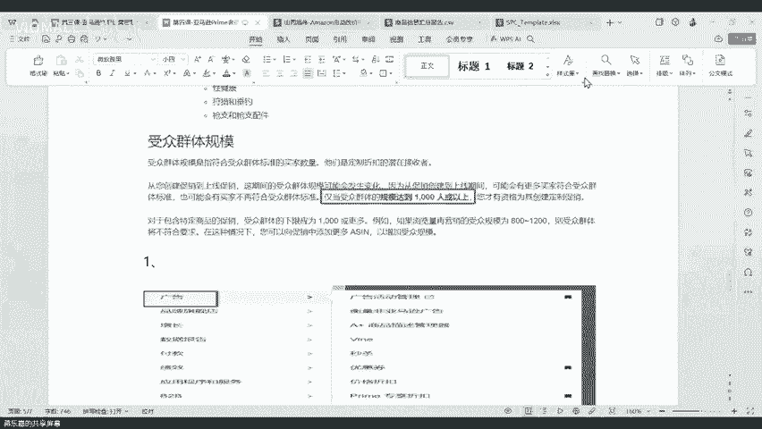

啊，在我们的这个广告这里面啊，有一个啊大家可以看到啊，这里有一个菜单啊，菜单栏，这里有一个啊广告广告，这里面有一个品牌定制促销啊，往下。

啊，这里有一个品牌的定制促销。然后我们进来之后啊，就能够看到我们能不能为我们的品牌创建促销。你要先选择你的品牌嘛，对吧？然后你就这里右上角右上角有一个选择创建定制促销。然后在这里还会有四种类型给你啊。

第一个是新客户，第二个是这个。买过你商品的啊，老客户。第三个是这个回流的客户啊，第二个是这个吸引现有的客户来提高忠诚度和流程度。这些可能就是啊有浏览过你的啊，然后这个有有这个加购物车的呀。

然后第三个就是已经买过你商品了啊，第四个就是啊像现有的客户推销一些交叉的产品，什么意思？就比如说啊他可能买了一些这个保险杠啊，他可能会给他推一些什么保险杠支架，反正就是他会有他自己一套的算法。

但是一般来说新客户是最多的啊，新客户是最多的。然后你就选啊一般还是选新客户，然后点下一页。然后在这里的话呢，他会有几个选项，这个跟之前已经是改版啊，之前是啊一进来这里就是所有的产品都必须怎么样。

都必须要参加这个品牌的专享促销啊，就你没得选啊，你就是必须所有的产品都要参加啊，他不给你选别的选项，现在是优化过了啊，优化过了之后，你可以选择啊，这个呃添加所有的产品，然后。排除一些特定的产品。

但是注意啊你可以排除一些产品，但是只能排除100个啊，就是说你可能有一些产品是拿来做活动的，也是亏本卖的那你可以选择这100个A选来做这个排除啊，要么就是你就只添加一些特定的产品啊，添加特定的产品。

就是说添加一些特定的产品来做这个活动啊，就你可以添加100个，然后来做这个品牌的专享折扣，知道吧？品牌的专享折扣。那我现在这里举个例子啊，我这里做个演示啊，我这里随便拿一个A选给它排除量啊，给它排除量。

然给它排除掉，然后给它排除。啊，然后这里的的话呢就会就会排除掉这个商品啊，就不不会出现在这个品牌的专享折扣。然后我点下一页继续啊，然后在这里的话呢啊就会出现这里就会有两个选择啊。

第一个就是在过去的90天将我们的这个品牌的商品加入购物车。但是没有购买的客户有1099个。那这种的话，你可以选择啊给他做这个专享折扣。然后另外一种就是什么？

另外一种就是在过去的90天点击过我们的品牌的店面啊，商品啊链接呀，或者是看过我们店铺的啊，这样子的客户一般来说这种潜力性客户是最多的，但是这种未付款的客户呢，他可能是最容易转化的，知道吧？

这里会有这两种情况，一个是潜力的新客户，一个是未付款的客户啊，具体至于具体你想要哪一种，那你可以到时候都给他们开啊，都给他们开。然后你就比如说我现在是选择这个未付款的客户，然后点下一页好吧。

然后点下一页，然后这里有一个促销的名称啊，这个名称是给你自己看的啊，你自己看的，你想取什么名字都可以啊，把它把拉我随便乱拿几个啊啊，那我随便乱拿几个。然后这里给他设置一个折扣，注意这个买家折扣。这里啊。

这个品牌专享折扣，最小要开10%，最大要开50%，知道吧？这个没办法说啊，最少5%。所以说啊这是一把双刃剑啊，这是一把双刃剑好的话，就是他的受众面特别广，而且非常精准的去推送啊，转化非常效果非常好啊。

但是不好的就是他最少都要开10%啊，而且他没办法把你本来就卖的不好的产品给排除掉啊，所以说他可能会面临什么，会面临你会亏本啊，就人家可能买的都是你便宜的东西。啊，可能会有这种啊，那我这里做演示啊。

但是他这个转化确实还很不错啊，还很不错。然后我这里就选个10%吧，然后我这里预算就写个100块啊，100块。然后这里我把我的这个啊促销的时间选好，比如说29月26号开始啊，一直到这个10月31号。

然后啊选择完了之后。啊，选择完了之后，我就点提交，然后他就会怎么样，他就会开始生成啊，它就会开始生成。这个我再说一遍啊，它不是针对所有的买家啊，它不是针对所有的买家，它一定是什么？

它一定是啊部分啊这个卖家啊，你符合了这个受众的群体，就比如说。有1000个啊，这个加了购物车，但是没买的，或者说有1000个浏览过你店铺的。或者说你有1000个老客户的这种啊，在过去的90天。

有1000个老客户这种啊，你才能够啊有资格去创建一个这个相关的品牌折扣。所以说这个品牌折扣啊非常好啊，非常好。而且他的这个推送的角度非常精准啊，推送的角度非常精准，但是他有门槛啊，好处就是转化非常高。

售购面非常大啊，能够精准推流，还有精准推送优惠的活动，去到那些没有购买，或者说你想要啊给让他去买的这些客户里面啊。呃，最少要一个月啊啊，那个小胜哥，你最少要设置一一个月啊，你不然的话，你一个月都没有。

那确实是没什么转化的。我之前开了大概两个月吧，然后转化了可能有20单左右吧。啊，但是整体来说是亏的，因为那个时候他没办法选择把部分产品给它剔除掉，或者说我只选择部分的SKO去参加这个活动啊。

所以说很尴尬啊，我之前是没办法去选这个啊，然后大然后还有一个就是我给大家讲一下，就是大家可以去把你那个品牌里面他会看到一些数据，就是说有哪一些SKO是被别人加购了的，但是没有下单的。然后那种SKO的话。

大家重点把它拿去做这个品牌转化，知道吧？你可以重点把那些SQ拿去做这种品牌转化是最好的啊，因为那种转化的效果是最好。好吧，就是在我们的品牌数据里面可以看到有哪些有有可以啊，可以设置啊，你刚刚错过。

你刚刚没看你刚刚没看啊，你刚刚没看这里面可以针对部分的A选去做专享折扣的啊，可以可以选100个啊，所以说我就跟大家讲嘛，就是你们可以去把你这个品牌数据里面去找一下，有哪些是被我们的这些买家加购了。

但是没下单的，你把这些A选给他挑出来，然后给他拿去做这个专享的折扣，知道吧？做个10%折扣，这样子的转化的效果非常好啊，转化的效果非常好。所以所以说这个活动就是转化高受目面大精准推流啊。

精准推优惠活动啊，但是它的坏处就是他的最低折扣，就是必须要设置10%以上，然后不能筛选排除过多的SK就比如说我有1万个SQ可能我有1000个都是亏本或者说低价。卖的，如果我在我再设这个10%促销。

可能我就已经亏亏亏到裤子都没了。但是你只能啊筛选100个啊，不参加。啊，您只能筛选100个参加，然后其他的必须参加，所以说这是他的弊端啊，所以说而且它的起点的折扣又很高，起点就是百分之百分之百10%。

所以非常的啊非常的这个这个这个尴尬啊，这个大家可以啊自己去想想啊，怎么怎么怎么去弄这个啊啊，我建议大家先去看一看你有没有这个资格，如果有资格的话，优先啊，优先考虑给大家去体验一下体验一下。

设这个两个月看一看啊，你先去你的品牌数据里面去找啊，找那些有能够看到你自己的一个品牌被加购的数据的这种SKO是最好的啊。你然后你再把这些SKO怎么样给他拿去做这个品牌专享折扣啊。

然后去做这个品牌专享折扣。好吧，然后这个的话呢就是我们今天要分享的啊，我们常见的一些啊这个做各类折扣啊，专享折扣啊，优惠券呢，然后还有这个prier会员啊，还有这个店铺的品牌活动的一个分享分享培训。

好吧。

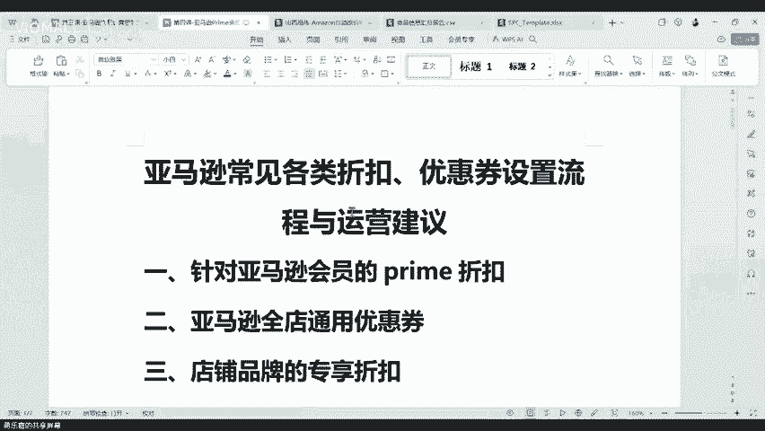