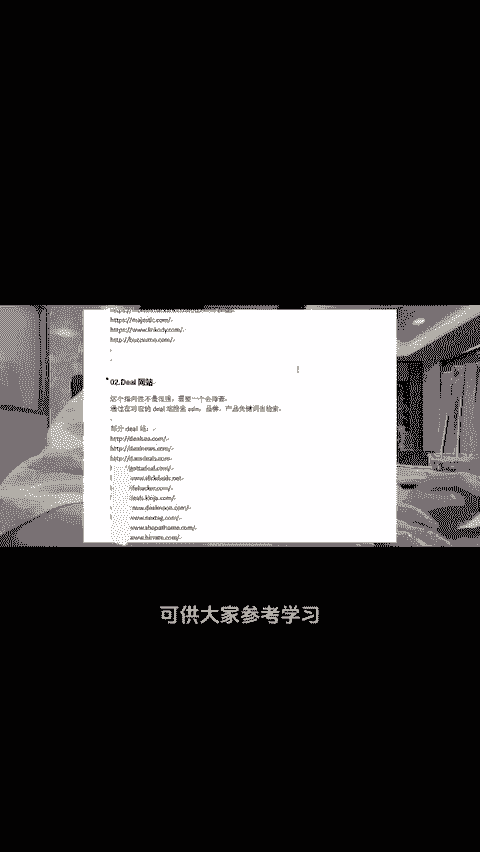
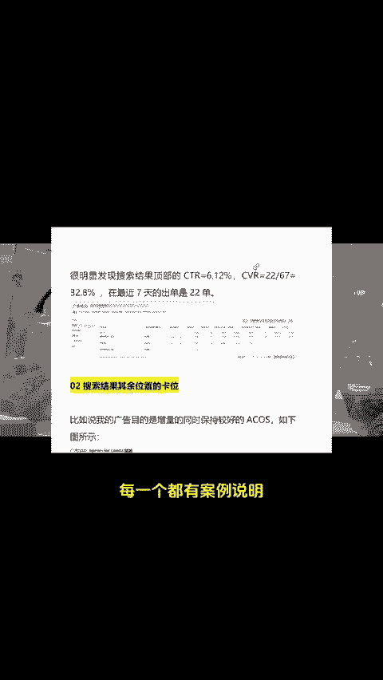
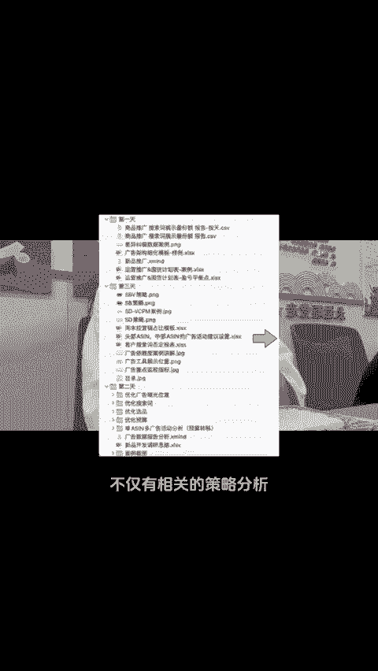

# 简直封神🔥亚马逊单品破1000+广告打法 - P1 - 小亚跨境研究 - BV1jCmjYvE4n

单品破1000家亚马逊广告我是这样调的，不管是新品还是老品，我觉得站内的广告都是重中之重。那开了广告最重要的就是开数据调整好优化的过程。在分析广告的同时，我们一定要有对标的优秀竞品。

像我就很喜欢关注排我前面的竞品，把竞品研究透了，你就可以在它的基础上再优化。但是怎么分析竞争对手的广告和站外推广呢？我这有一份竞对工具可供大家参考学习。然后我也比较关注广告排名情况，广告排名上去了。

大量自然就增加了，这就需要我们知道怎么把广告打在最佳广告位置上，我根据自身经验整理了4个小技巧，每一个都有案例说明。另外我整理了一份SBPSD广告组合串联打法，不仅有相关的策略分析。

还有案例讲解和广告优化动作需要的三个三暴走，一起跨境，一起报富。😊。

