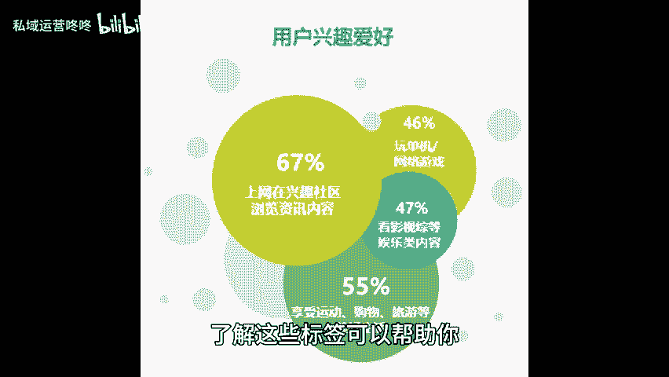

# 粉丝多不等于好，三个技巧教你如何评估粉丝质量！ - P1 - 私域运营咚咚 - BV1fa2JY1EoW

🎼在当今的社交媒体时代，拥有大量的粉丝似乎已成为衡量个人或品牌成功的标志。然而，粉丝数量并不能完全代表影响力和价值，质量高的粉丝才是关键。下面就分享三个技巧，帮助你评估粉丝质量。

从而更有效的提升你的运营效果，一看粉丝画像，全面了解你的粉丝画像有助于判断他们是否与你的内容或产品相匹配。首先利用社交平台提供的数据分析工具，深入了解粉丝的性别比例、年龄分布以及地理位置。

这些数据能够帮助你识别出目标受众是否和你的内容调性一致。其次，研究粉丝的活跃时间和参与度。如果大多数粉丝在你的内容发布时并不活跃。那么即使你有很多粉丝也很难形成有效的互动。2、看兴趣标签。

兴趣标签是对粉丝兴趣爱好的概括，了解这些标签可以帮助你评估粉丝的真实需求和倾向，许多社交平台会根据用户的行为及兴趣推荐相关内容，可以通过这些推荐，了解哪。😊。

🎼些内容更容易引起粉丝的共鸣。三、看基础播放量。这一指标能够反映出你发布内容，但受欢迎程度和粉丝的参与度，观察每个推文视频或直播的播放量，并与粉丝数量进行比较，可以了解你现有粉丝的活跃情况。

如果你的粉丝数量较多，但播放量却寥寥无几。这可能表明粉丝的质量不高，或者你的内容未能与他们产生共鸣。除此之外，分析播放量还需要关注观看时长和互动率如评论点赞、分享等。这些数据不仅能够反映内容质量。

还能帮助你了解粉丝对内容的喜好程度，记住一个优质的粉丝群体不仅能为你带来关注，更能为你的个人品牌或业务注入活力和动力。😊。

