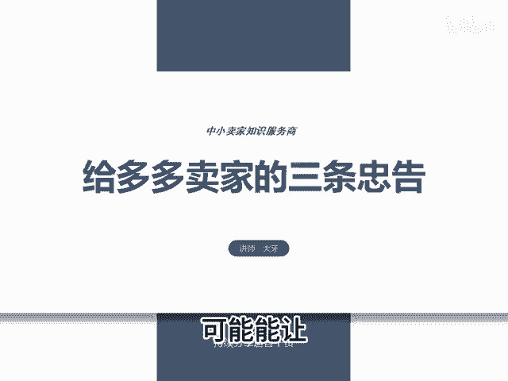
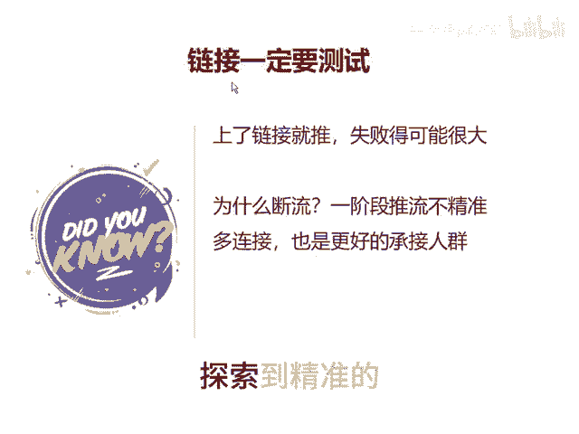
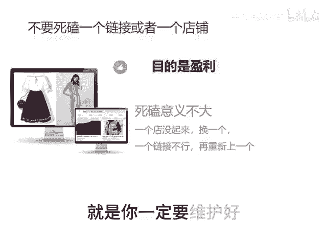
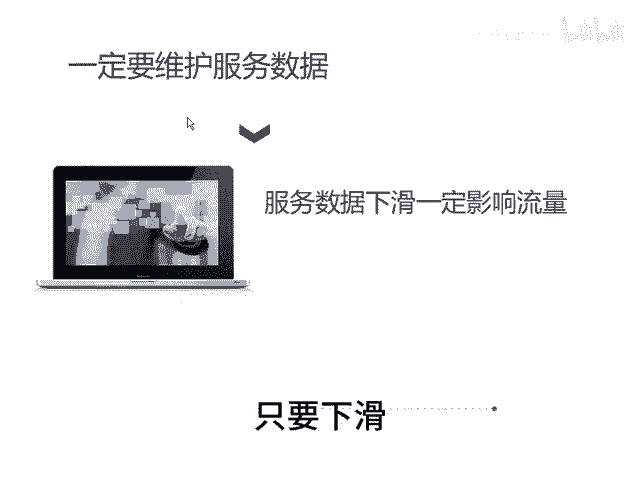

# 给多多卖家的三个忠告 - P1 - 千优电商教育 - BV1zD2tYvEhi

很多朋友做店做不起来呢，它是思维有问题。思维不对，努力白费。这个视频呢给到大家三条忠告。如果按照我说的做，可能呢能让你的店铺扭亏为盈。第一个链接一定要测试。很多朋友是上了一个链接。

然后就一顿操作什么出品改销量，然后直通车拉升，其实你会发现呢？它怎么拉也拉不起来，为什么就是在你做拉升之前，你一定要测试。因为一个链接在第一阶段系统会给你推荐一些不太精准的流量。

这些流量可能系统根本不能帮你探索出人群标签，所以你多上它帮你推荐的流量更多，这时候呢更容易帮你的某一个链接探索到精准的人群标签。第二个，你不要死磕一个链接或者一个店铺，你必须知道你坐店的唯一的目的。

为了盈利。那死磕呢意义不大。因为朋友甚至一个店铺一个链接它能坚持亏半年。因为我们知道拼多多权重周期本来就很短吗？最长30天，所以一个链接做不起来，再换一个。😡。

一个店铺做不起来，那再开一个，或者你同时布局多个店铺多个链接运营，这是目前最稳定的获取流量的方式。第三个就是你一定要维护好服务数据，很多朋友喜欢做马扁吗？码扁那玩意是出单一时爽，到后期你的流量下滑。

店铺还是完蛋。像后台的DSR评分，什么消费者服务体验分，店铺星级，在你运营的过程中，你一定要密切关注，只要下滑就有可能影响到流量。😡。

