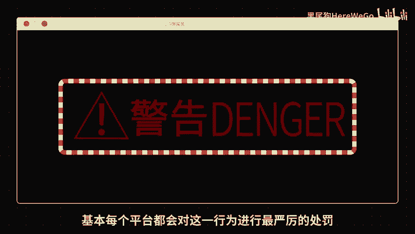
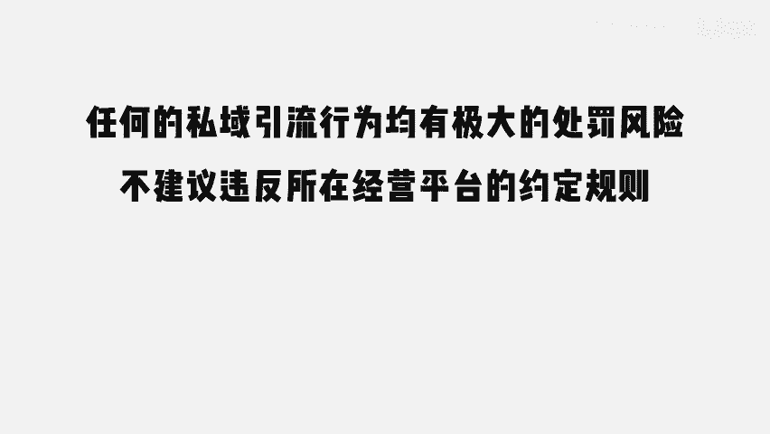
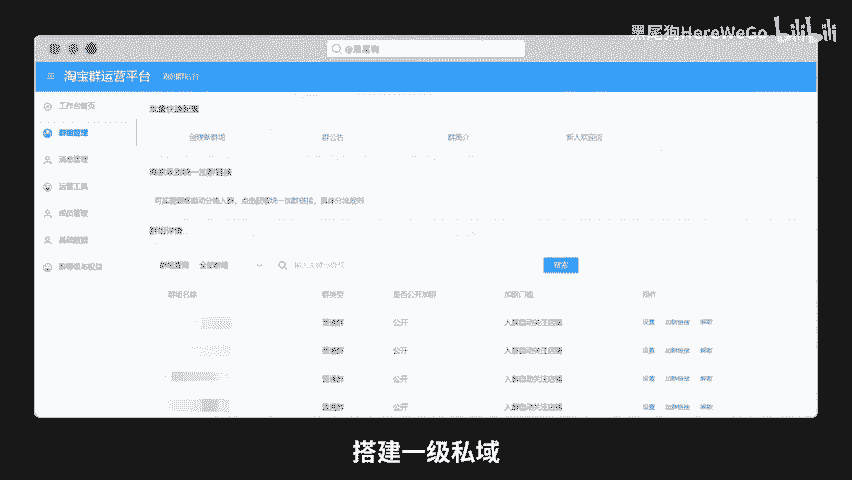
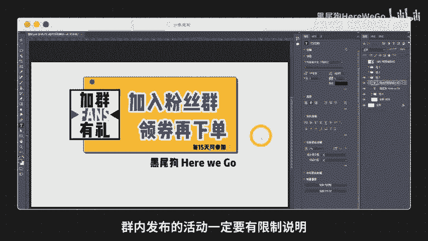

# 网店如何建立、维护粉丝私域 - P1 - 黑尾狗HereWeGo - BV1v2Y5eCE6f

🎼最近有朋友在评论区留言说，希望讲一讲私欲，今天就开个头，分享一个通过平台粉丝群搭建一级私域的玩法，开了几年网店，钱挣的不多，坑采的不少，点点关注，一起学习看网店吧。

🎼这还给分上级了，不是什么术语，纯属自创自玩。我把思域分成三个等级。一级私域是基于平台类的客群留住。这一级的优点是操作安全，缺点是只能局限于当前平台。二级私域是引流到自己的私人关系社群。

最常见的就是加微信了，优点是流量彻底私有，可以导致全平台起新店打新平，从此都不是事，缺点是违规风险高，任何平台都鼓励你把自己私域流量往他的平台移。但你要想把在他平台获得的客户往外带一个，那就是天大的罪。

基本上每个平台都会对这一行为进行最严厉的数据。所以说到这里，我不得不给视频加上一条免责声明了。😊。

🎼任何的私域引流行为均有极大的处罚风险，不建议违反所在经营平台的约定规则。如果你非要做，与我无关。

🎼还有就是三级私域了，那是在二级私域里甄选出来的参与性高、互动意愿强的客户给予最高领域，特别是产品有使用群体传播性的，像是学生群体。你把一个学生关系弄好了，整个宿舍甚至半个班级都是你的。

你要是眼光再远一点，给这个火种学生介绍来的所有同学一个特别价，你可能几十笔订单少挣一些利润。但这几十单精准用户给你带来的自然流量加权就真的不止这些了。🎼下面进入今天的正题，通过平台粉丝群搭建一级私域。

设置两个粉丝群，一个新人群，一个老客群做一张图片放在详情页前排位置，告诉所有访问详情页的新客进群可以领券下单，只要有咨询，不是那种问到细微数的咨询。这种订单后患无穷。

不要去强拉常规咨询的客户都发图片邀请进群领券下单，既能促进成交，又能留住客群再不是一个流量就是一锤子买卖，一次交易30天后就各自天涯，相望于江湖了。只要你想随时可以在群里触碰他。还有一个老客群。

很多人根本不看详情页也不咨询客服，直接就下单了，同样也是做张图片，写上群里老客就是天保价等等有吸引力的文字，引导进群之后你又可以随时去触碰它了。这些都是你的宝贵资源。群里要有节奏的特殊真实有效的活动。

不要玩心眼，更不要死记一片新品成本价破零滞销品破价清库存，自然流量能转化，如果是4%，那群里的流量或许可以做到20%做的好的话，全店的动销率都会很漂，好处说不尽啊。

🎼先别画组，还有彩蛋。群内发布的活动一定要有限制说明，不能让一个账号把你所有的活动都好了。

