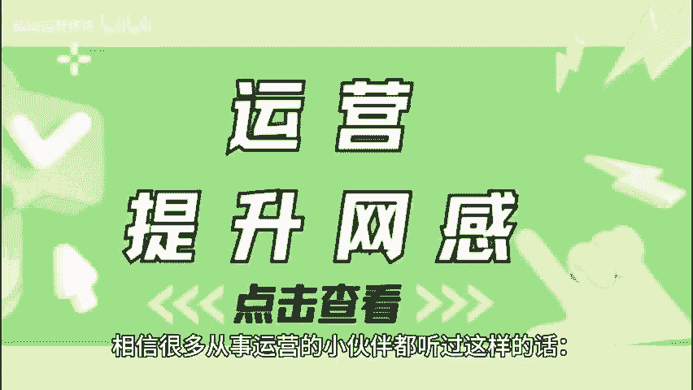
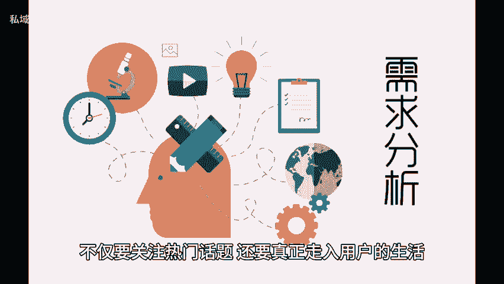
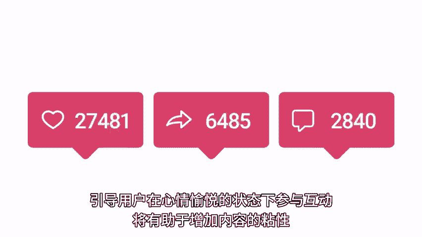

# 网感不够？这三个运营要素来拯救！ - P1 - 私域运营咚咚 - BV1gUyNYQEgM

🎼相信很多从事运营的小伙伴都听过这样的话，要有网感，才能吸引更多用户的关注。那么怎样才能提升自己的网感呢？这三个要素你一定要有。一、洞察用户痛点，在运营时，首先要做到的是深入理解你的用户。

洞察他们的真实需求与痛点，这就要求我们在日常内容创作中，不仅要关注热门话题，还要真正走入用户的生活，了解他们面临的困惑和烦恼，还要考虑到用户群体的多样性和细分受众，只有分析不同人群的特性。

比如年龄性别兴趣等，才能制定相应的内容策略。2、调动用户情绪。情感营销是吸引用户的重要手段，在内容创作中运用故事化手法，通过真实的案例分享，引发用户的共鸣，是一种有效的方式。情感不仅能拉近与用户的距离。

还能提高内容的分享率。事实使用幽默励志或感人的语气，结合合适的视觉元素，也能更好的调动用户的情绪，引导用户在心情愉悦的状态下参与互动，还有助于增加内。😊。

🎼容的粘性。3、解析拆分爆款。通过对现有热门内容的分析，我们可以找到一些共性特征，从而为我们的创作提供参考，可以从标题内容、结构、封面等方面入手，观察哪些标题更能引起用户好奇心和兴趣。

哪些内容类型的表现最好，及时调整策略，让自己获得更多的点击率。以上就是今天分享的内容，希望对大家有所帮助，咱们下期再见。😊。

