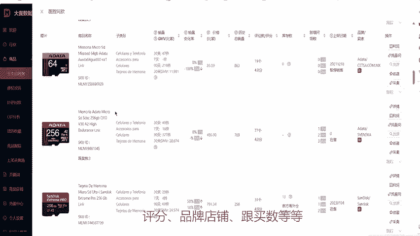

# 美客多图搜竞品功能 - P1 - 大麦数据 - BV1g32MYhEyF

为更好的为卖家提供更优质的服务，体验大麦数据重磅推出电脑端以图搜竞品功能，方便卖家通过图片搜竞品，分析竞品数据，进入大麦数据官网。打开商品券类目数据。可通过选择商品类目或输入关键字查找。

下滑找到对应的商贴图片。😊，点击右侧图搜竞品按钮查看竞品数据情况。大麦数据图搜竞品功能，通过识别商品的款式、颜色、材质等特点，找到该商品的同款竞品或相似产品。另外。

可支持查看商品的价格、销量、评论数量、评分、品牌店铺跟买数等等，相关竞聘数据一览无余。大麦数据，每个多卖家都在用到专业选品运营工具。😊。

