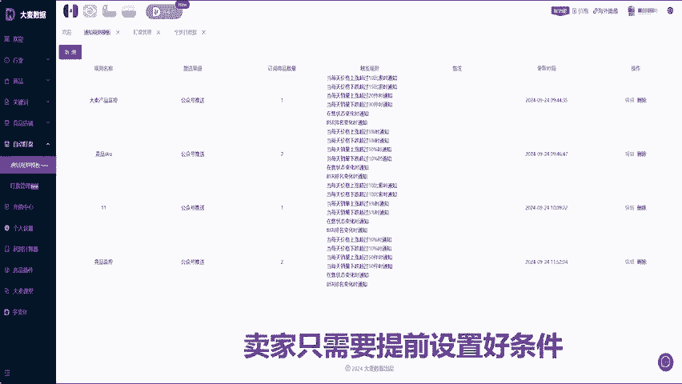
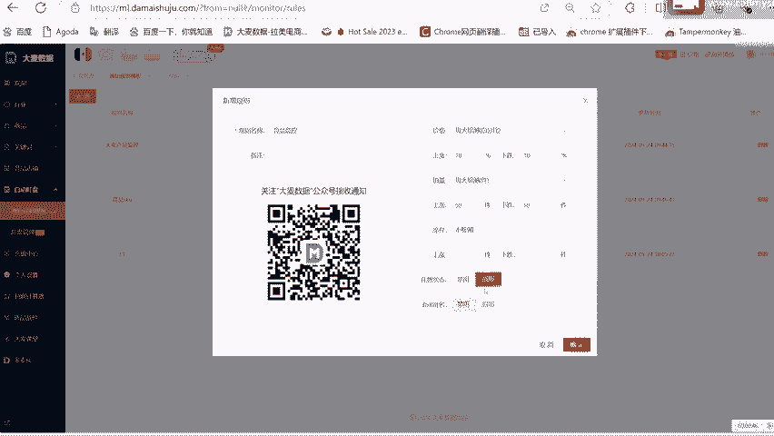
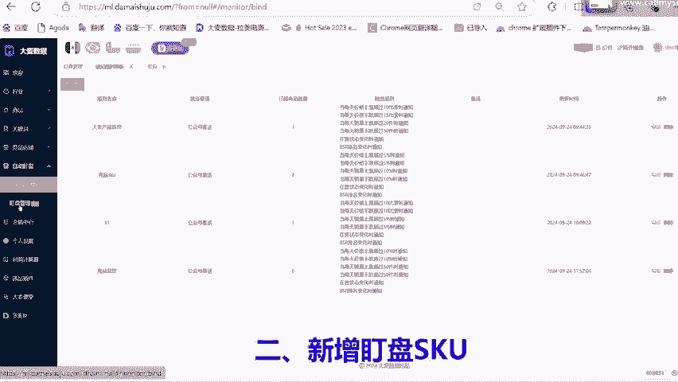
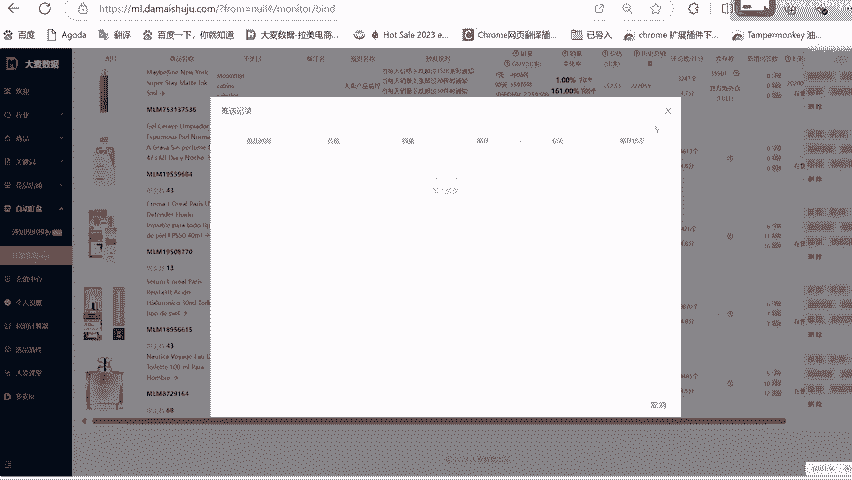

# 美客多数据分析自动盯盘功能 - P1 - 大麦数据 - BV1eP2MYKECy

美克多选品自动盯盘功能重磅上线了，自动盯盘功能可以有效的帮助卖家实现自动盯盘和实时提醒。卖家只需要提前设置好条件，系统会自动监测，一旦达到触发条件，系统会发出消息提醒，方便卖家实时监控。

自动钉盘功能使用方法，一、设置钉盘规则，进入大麦数据官网，点击自动盯盘功能新增规则，设置规则名称。

微信关注大麦数据公众号。设置价格、销量、库存的日涨跌幅提醒条件后，点击确认即可。

2、新增钉盘SKU点击钉盘管理新增按钮，选择已经设置好的规则模板，新增需要钉盘的产品。

同一个规则下可重复添加多个钉盘产品，设置好后点击确认即可。3、查看推送消息。钉盘信息设置后，用户需关注大麦数据公众号系统根据绿色规则，会自动将产品变动信息推送到公众号。

4、盯盘管理点击盯盘管理卖家可根据预设规则、产品SKU等条件查询信息，并也可通过推送记录查看产品变动信息。大麦数据拉美卖家都在用的专业选品运营工具。

