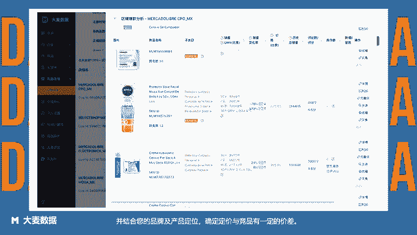
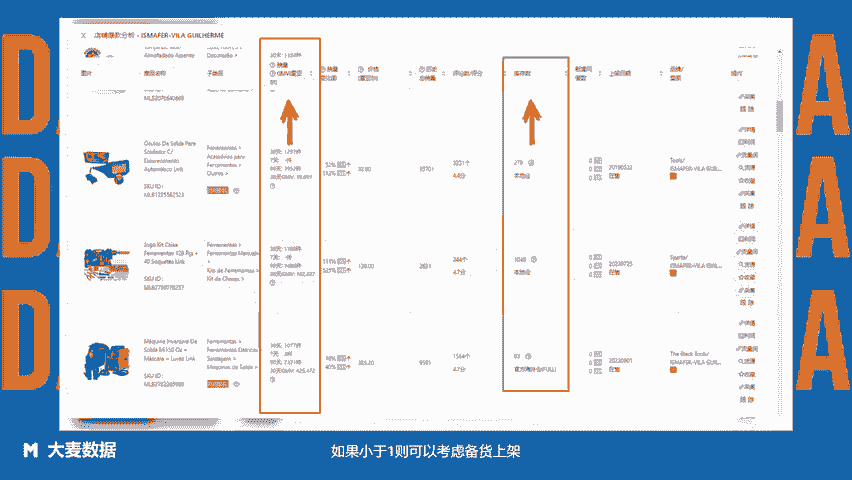

# 美客多超详细选品方法 - 方法10：基于竞品店铺爆款高库存比例监控选品——使用Clipchamp制作 - P1 - 大麦数据 - BV1gP2PYDE1s

卖家们日常在观察有竞争力的店铺时，可以多关注与自身供应链相近的竞品店爆款商品销售与库存情况。如果出现库存月销量比小于一的情况。

则可以考虑参考该类爆款商品标题图片等情况进行相似商品推广及时补充由于库存不足而导致的爆款商品后进不足，同时注意结合参考品类价格分布区间，并结合您的品牌及产品定位，确定定价与竞品有一定的价差。那么。

如何查看竞品店铺爆款库存情况呢？进入大麦数据竞品店铺店铺列表分析，查看店铺爆款商品库存与月销量比例。如果小于一则可以考虑备货上架。大麦数据拉美卖家都在用的选品运营工具。😊。

