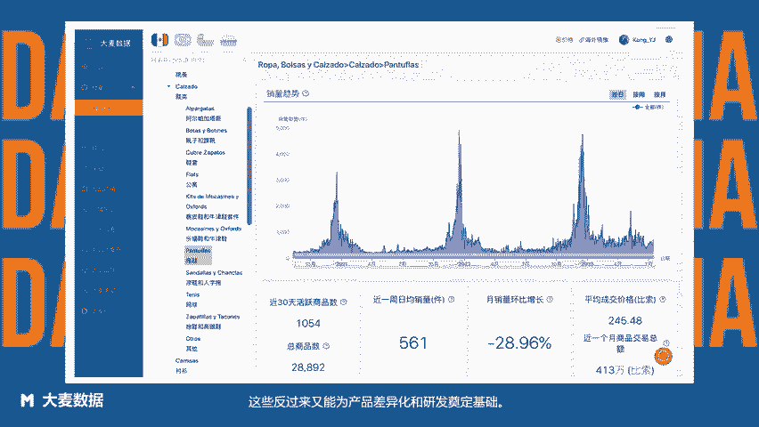

# 美客多超详细选品方法 - 方法11：基于垂直品类选品——使用Clipchamp制作 (1) - P1 - 大麦数据 - BV1Mu2PYjE3C

如果卖家对某个类目地产品感兴趣，且已经具备了一定的资源优势，就可以选择对该类目进行纵深挖掘。当专注于某个细分类目时，一方面可以更好的把握用户痛点，另一方面，还可以帮助卖家沉淀经验，积累垂直用户。

集中资源，降低供应链成本，打造自己的竞争壁垒，这些反过来又能为产品差异化和研发奠定基础。例如围绕浴缸自然而然的会诞生出来很多很多周边产品如防滑垫、浴缸外地毯、浴缸帘子、挂钩和支撑杆、有机浴盐、香薰蜡烛等等。

那么，如何使用大麦数据查看垂直品类呢？在大麦数据、行业行业纵缆或全类目数据中，品类看到底层销量情况，查看目标品类下对应的相关类目，或查看竞品店铺中上新的产品周边商品，就可以清晰看到垂直品类了。😊。

大麦数据拉美卖家都在用的选品运营工具。

