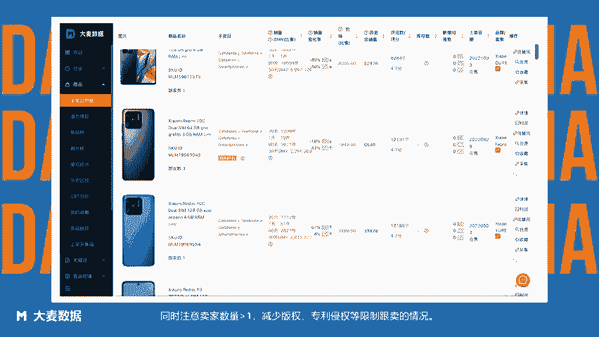
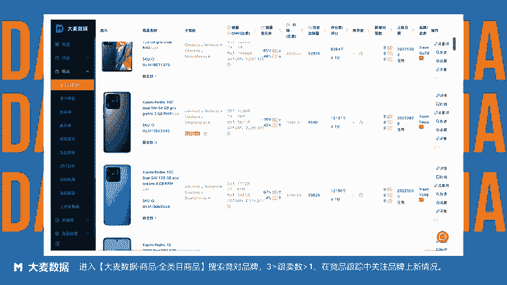

# 美客多超详细选品方法 - 方法12：基于品牌上新情况选品——使用Clipchamp制作 - P1 - 大麦数据 - BV1Mu2PYjEjU

此法适合供应链比较强的卖家，可以根据竞对品牌上新快速跟进类似产品，利用品牌影响力效应和相对略低的价格打出价格差，从而快速占据市场，同时注意卖家数量大于一，减少版权、专利侵权等限制跟卖的情况。那么。

如何查看品牌卖家上新情况。进入大麦数据商品全类目商品，搜索竞对品牌设置跟买数大于一小于3，在竞品跟踪中关注品牌上新情况。😊。

大麦数据拉美卖家都在用的选品运营工具。

