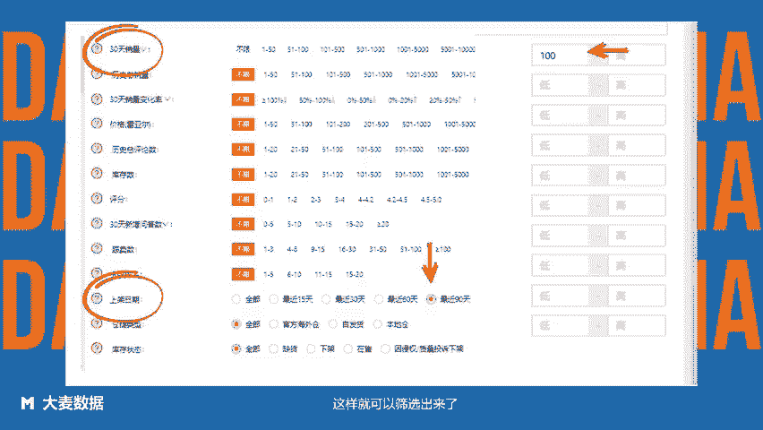

# 美客多超详细选品方法 - 方法13：基于本土店卖家类型选品——使用Clipchamp制作 - P1 - 大麦数据 - BV1Mu2PYjELA

每克多本土店可以说是最了解本土市场需求的卖家，本土卖家选择的产品，相对来说是更符合当地人需求的产品。观察相近品类本土店内的爆款产品，综合自身情况，打出价格优势，可以获得一定的平台流量。那么。

如何查看本土店卖家热销产品呢？进入大麦数据行业行业纵览或商品CBT分析模块，选择目标类目，选择本土店上架日期为近3个月，月销量大于100。这样就可以筛选出来了。大麦数据，拉美卖家都在用的选品运营工具。

😊。

