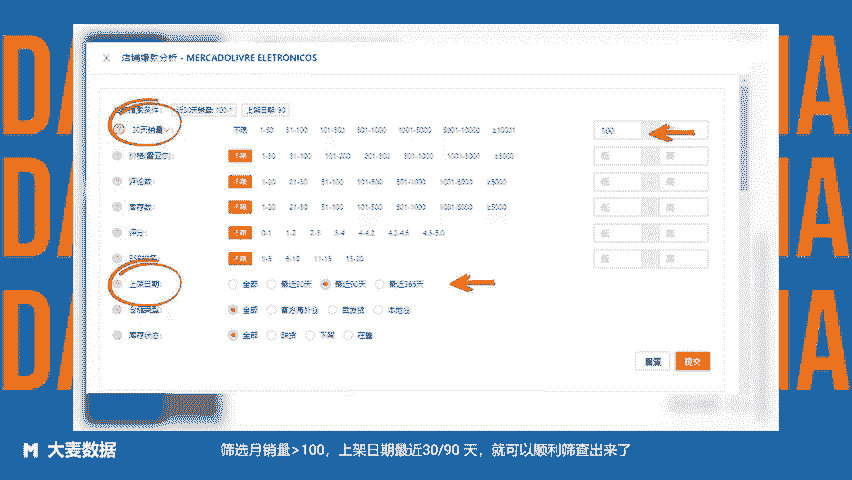

# 美客多超详选品方法-方法9：基于竞品店铺上新监控选品——使用Clipchamp制作 - P1 - 大麦数据 - BV18P2PYSEmx

卖家们可以通过监控优秀标杆店铺的每日上新情况分析选出其中最有潜力的产品进行跟进。这种选品方法更适合供应链较强的卖家，之所以参考有竞争力的店铺是因为他们的产品选择都是经过多重筛选的，推报的概率较大。

趁他们产品还在孵化状态就去跟进，比他们打包后再跟进，更能够抢占市场先机。那么，如何准确监控竞品上新情况呢？进入大麦数据，商品竞品店铺，设置店铺级别为green选择目标竞品店铺，筛选月销量大于100。

上架日期最近3090天就可以顺利筛查出来了。大麦数据拉美卖家都在用的选品运营工具。😊。

