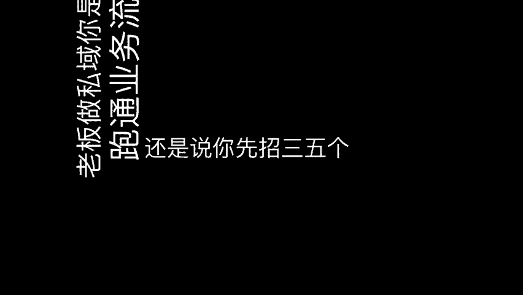
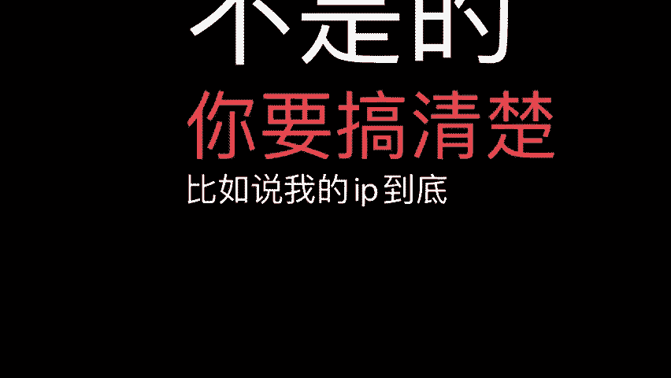

# 老板私域第一步做什么？ - P1 - 渡鸦科技-小米米 - BV1vQs6eoE4v

🎼老板做思域，你是先跑通业务流程，还是说你先招三五个人的小团队先开始干，我觉得一定是老板先跑通流程。你指望说招一个员工来一个月拿个1万块钱工资，就把这个事情给你干通了。可能吗？啊，他没有你想的那么简单。

搞个话术，搞个SOP就跑通了呢？不是的，你要搞清楚，比如说我的IP到底该怎么去塑造什么样素材才会让别人付费。守单品复购品升单品怎么去做，通通这些你希望找一个人来帮你做，怎么可能呢？

我们正确的姿势是老板一定要躬身入局，或者你个合伙人躬身入局，节奏上是流量搞一周，转化搞两周迭代一次，流量搞一周转化光流迭代一次，你真的全情投入到这个节奏里面，干两个月你就会发现你的思域就干起来。

所以老板们，如果真的想入局思域的话，可以来找我聊一聊进中业粉丝群。

