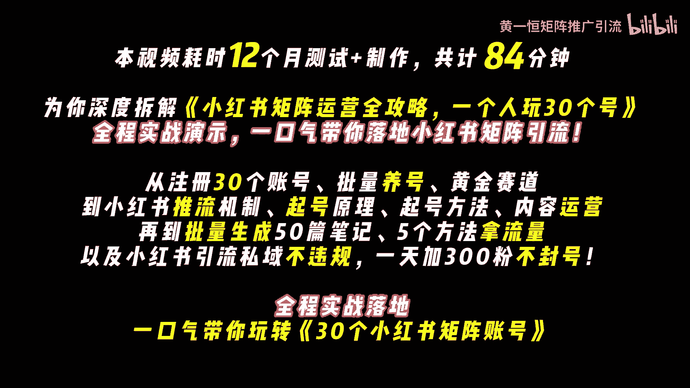
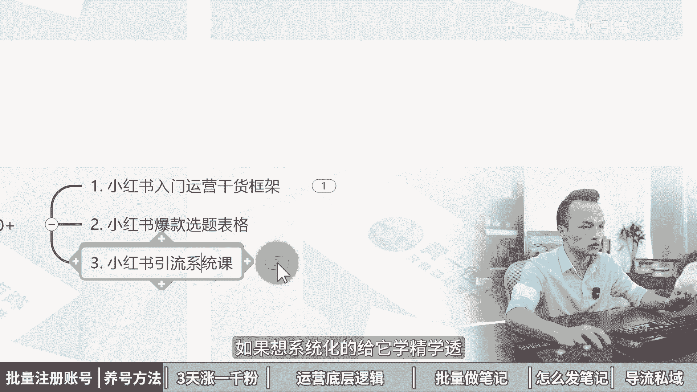
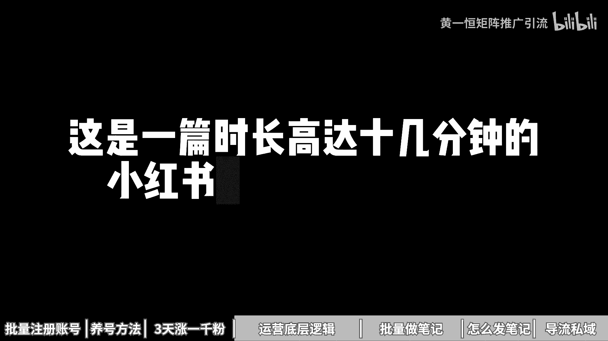
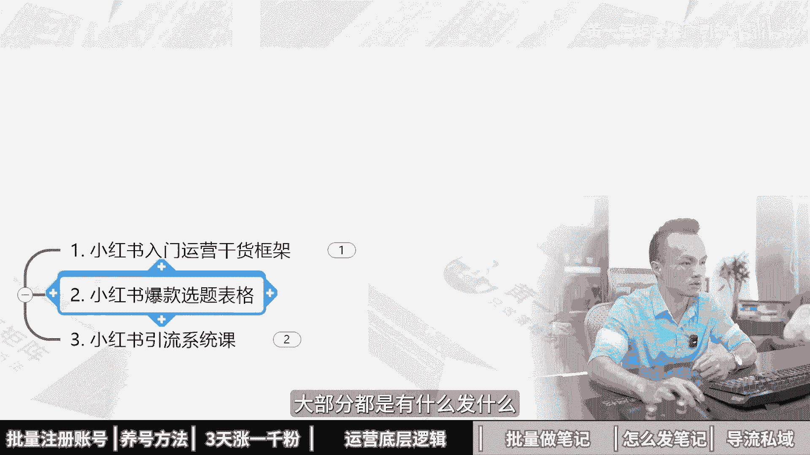
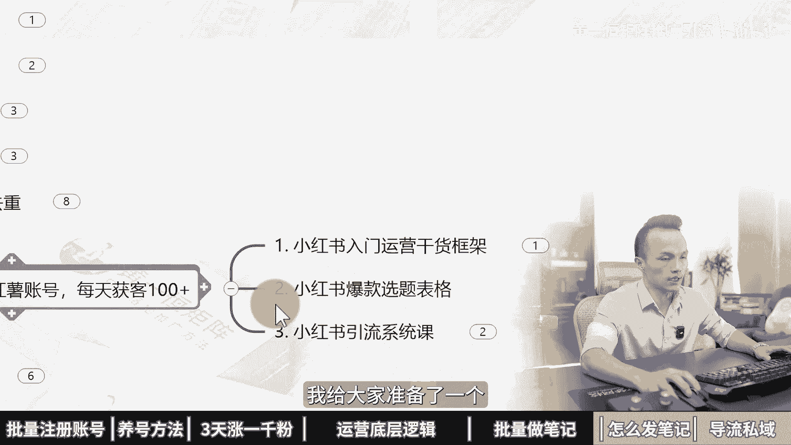
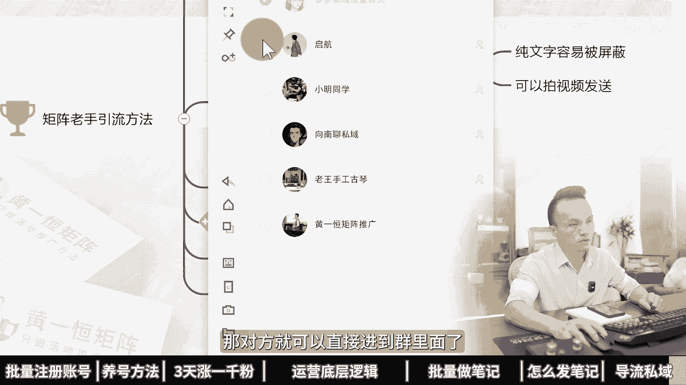

# 耗时12个月测试+制作,计84分钟《小红书矩阵运营全攻略，一个人玩30个号》小红书批量起号设备，小红书引流技巧，小红书引流教程，小红书矩阵管理系统，小红书矩阵系 - P1 - 黄一恒矩阵推广引流 - BV1f6pjeFEre

本视频耗时12个月，测试加制作共计84分钟，为你深度拆解小红书集证印钱攻略，一个人玩30个号，实战演示，一口气带你落地小红书集成引流，从注册30个账号，批量养号，黄金赛道到小红书推流机制。

旗号眼里起号方法，内容运营，再到批量生成50篇笔记，五个方法拿流量以及小红书引流，失意不违规，一天加300播放号，全程实战落地，一口气带你玩转30个小红书集成账号。

第一章批量注册30个小红书账号，又注册了30个小红书账号，我们公司刚来实习生，我叫他去注册小红书账号，他花几个小时就注册好了，我们一起来看一下他怎么注册的啊，用实卡注册，然后换绑你也猪猪的卡。

真是个人才，这个方法不错，可以无限搞高质量小红书账号，一起来看，会给你分享注册小红书的注意事项，如何准备30张实卡，30台红米手机，30个独立网络进行批量注册养号，现在看第一个注意事项。

当我们在注册账号的时候，需要遵循一个前提，一机一号一网络，不去使用多开，防止设备关联，很多伙伴可能会使用手机自带的多开，或者通过一些第三方软件进行多开，小红书，这个平台是目前整个互联网里面最严格的。

为什么呢，因为如果你的单个账号被封禁之后，他是会封禁你的设备的，我们可以来看一下账号及设备，方禁处置所归属的设备下，多个账号均存在严重违规行为啊，怎么怎么样，平台将对你的设备采取方巾处理。

且该设备下面所有的账号都会被限制登录，所以咱们在做的时候，为什么不去躲开，如果你多开了，比如说一个伙伴一个手机搞了三个账号，当一个账号出现问题被封了，另外两个账号露西也被封了，所以咱们在做的时候呢。

宁愿多搞几台手机，也不去做多开，第二个就是不连WIFI，很多伙伴可能会去直接连接一个WIFI，比如说十个账号，20个账号，这时候你会发现你的所有账号流量都不太好，而且一些高风控期间。

你的账号都会出现关联，这个点来非常重要，那么如果咱们账号被封之后怎么办，这个时候我们可以比如说我们只是第一次被封，但是并没有封禁设备，你可以选择把手机恢复一下出厂设置，也可以选择刷机，如果还放的话。

就不太建议使用这台手机了，因为再使用这台手机啊，就会被强制放设备，后续你的账号只要登过台设备的，全部都会被封掉，这时候呢就建议大家可以去啊，更新设备来进行使用，相当于换一台新的手机去什么进行注册。

好了解了这个前提之后，接下来如果我们想注册30个账号，就需要准备30各手机卡，30台手机，30个独立网络，做到1G好友网络，防止任何的关联，那么手机卡这一块怎么去操作，首先我们在注册小红书账号的时候。

可以用实卡注册，也可以用这个信息卡注册，那么实卡也就是我们平常在使用的时候，他的号段是这个18151319的号段，那么这种号段的质量非常高，在注册的账号出来之后呢，也是很容易过这个观察期脱敏期的。

我们可以通过营业厅办理三大运营商，每个营商可以办五张卡，每30天能办一张，也可以在网上搜索儿童收票卡，就可以买到一些，也就三块五块的比较便宜，另外一种呢有的伙伴呀为了搞很多账号，用的这个虚拟号。

那么心里号的话，也就是我们去购买的林业猪猪的卡，他的号段是1716开头的，那么这个号段呢相对来说质量其实会差一些啊，也可以进行使用，前期如果你做小红书，你刚开始做，为了能够让你账号更容易做起来。

那么是建议大家尽量的用这个词卡，因为实卡它的一个号段质量更高，或者的权重更高，基础推理会比较多，所以咱们在做的时候呢，因为我们如果想搞30个实卡，根本就不现实，很难做到，就算我们去关联副卡。

也没办法做到30张卡，那怎么办，这时候其实有个办法，因为小红书这个平台它的用户规模并不是很大，在我们身边很多亲朋好友，他们都没有去使用小红书或者使用之后啊，也没有去发布笔记，这时候怎么办。

我们可以找30个亲朋好友，用他们的实卡进行注册，注册完之后，来一个月之后，咱们换绑上0月租注册卡就可以了，因为账号啊前期是最关键的，我们需要过一个脱敏期观察期，当我用了一个月之后。

这个账号的推流已经上来了，你在换绑上你也足足的卡，那基本上就可以实现无限产账号，所以怎么无限产账号呢，你找个朋友，然后用他的手机号注册一个账号，注册完之后，隔一个月你换绑上自己的这个营业猪猪的卡。

因为林业租租卡，这个我们一个人呐可以办的数量就非常多了，可以办个20张，30张，甚至有的50张都可以，而且价格也非常便宜，一年的话只需要几块钱，这个具体大家可以在各大平台上面搜索，就可以找到，这个方法。

是目前获取高质账号最好的一个方法了，可以这么理解，那么当我们有了卡之后，接下来我们还是要把这个账号登录在手机上面，这是什么意思，比如说我用家人的手机号，在这台手机上面填写之后获取验证码。

让他把验证码告诉我，我就去进行一个注册，所以手机卡的话，我们是不需要装到手机里面的，那么手机在这里面，咱们用的型号有很多个，比如说我们可以用这个红米note9或者pro。

那么价格的话是在350~400之间，我们在购买手机的时候啊，配置的话尽量的选择这个664G配置，或者以上的D这个配置都会比较卡顿，咱们在做的时候，这个点一定要注意，有的伙伴买的配置比较低的。

用了一段时间之后非常卡顿，在做的时候啊，效益降低就会影响咱们的什么操作速度，那如果你想买一些比较新的，也可以选择这个红米note10或者pr弱，这个呢价格稍微贵一点，是450~500之间。

配置也选择664G的配置，那么购买的渠道啊，为什么推荐那个红米手机的伙伴说，我用苹果手机，我用华为手机，我用其他手机难道不香吗，难道不行吗，可以的，因为这两个手机最主要的就是便宜啊。

其他手机你可能买一台要1000多，1000多的话已经可以买这个三台手机，所以咱们如果搞30个账号，你买这种贵的手机来，成本算下来会比较高，咱们直接买这个红米手机啊，比如通过这个海鲜市场啊，某一期买的话。

价格就350~400，如果你是新手，没买过这种二手产品，担心翻车，你可以到某东的拍拍上面啊，直接到某东上面去搜索，搜索完之后呢，就可以找到它的价格的话，一台回归个30~50，都是属于专门的二手手机店。

然后呢他们会有一年的售后质保，有问题找他们，他们可以什么帮你进行一个处理和解决，好手机这一块，咱们如果一台我们算400块钱，那么30台的话，我们就得接近花上什么，那么2700块钱了啊。

这个是2万7000块钱，还不是2700块钱啊，所以这里的投资的话，其实成本什么还是相对来说会啊大一些，接下来呢我们还需要去准备30个独立网络，那么30个独立网络什么意思，咱们一起来看一下啊。

首先我们需要每台手机上面，都单独配一个流量卡，因为前面我们用家人或者朋友用自己的手机卡，如果你自带流量的话是可以用的，但是呢我们都是没有配流量的，那这时候怎么办，我们就需要单独的去配这个物联网卡。

像我们自己的话是单独买的这种物联网这种卡，它是只能够上网，不能够打电话，也不能够进行一个发短信，那么价格呢主打的就是一个便宜啊，像我们买的套餐是69块钱，24个月，每个月有近40G的流量。

对于我们玩小红书来说啊，甚至上面登一个11账号都完全够用，可以看到啊，那么这里就是我们买的69块钱啊，可以用这个两年，那么这种流量卡找起来会比较麻烦一些，互联网上面很多很多啊，大家如果实在找不到的。

也可以找我，我把我的渠道来分享给大家，做一个资源共享，帮助大家节省时间，咱们来核算一下成本，我们准备30张林业猪猪的卡，是用来换绑前面的实卡的，我们需要准备30张，每张五块钱，150块钱，30台手机。

每台手机平均400块钱需要投资1万2000块钱，30张流量卡需要花2070块钱，相当于咱们如果准备30个账号，这个投资呢还不小，需要花1万4220块钱，那么平均一个账号我们算一下啊。

大概接近500块钱左右，这是我们一个账号的硬件成本，那么当我们已经有了实卡手机，以及每个手机都配的这个独立网络，接下来我们就来看一下，怎么去进行批量注册养号，首先我们账号的话。

可以直接在手机上面填写这个实卡进行注册，注册完之后来，我们是需要把这个资料都给他完善一下啊，这个资料完善的话其实是非常重要的，我在这里给大家投屏演示一下，比如说我们打开这个投屏手机。

然后嘞打开这个小红书的平台，然后点击我，那么在我这里我们需要点击这个编辑资料，把这里面的资料能填写的，尽量给他填写一下，填写的目的啊，主要是让我们的账号，更像是一个什么真实的账号。

那么前期啊大家如果是新注册的号，前面一个月来我们是不做任何的广告导流的，如果你做了之后啊，都很容易导致你的账号违规，甚至严重的直接就挂掉了，哎这是第一个，第二个呢账号注册完之后啊。

千万不要放在一个地方就不管了，一定要火，眼下账号活跃账号，这个是非常关键的，像我们自己在做的时候，我们是怎么去活跃账号的，首先比如说每天浏览30分钟，用来刷对标点赞，收藏20个作品，评论5~10条。

关注5~10个博主，因为正常的用户，他们基本上都会啊去使用这个小红书，那么小红书的活页呢大家可以参考这些啊，可以多一点少一点，这些呢都不是很重要，主要就是保持活跃度就可以了，不保持活跃度。

你去发布笔记啊，这个流量是非常小的，另外我们在操作的时候还会遇到一个问题，什么问题呢，就咱们的账号如果在用的时候，毕竟我们做起针是难免啊，会封几个号的。

被封了之后啊，我们的手机就没有办法啊进行一个使用了，那这时候怎么办，其实呢我们可以通过两个方法，这个方法，目前小红书的话是可以通过一个QQ卡bug啊，可以把这个手机号给他换绑出来啊。

那么这个方法大家如果不会的啊，那么可以找我，我把它分享给你，另外一种呢，就是我们可以通过一些第三方的这种解码平台，然后来换绑上一个新的手机号啊，比如说我们从今码平价里面花一毛钱。

花五毛钱换绑上一个新的手机号，那么原来手机号就空出来了，那么这样的话也可以实现，把我们被封的账号给他换绑出来啊，避免一直占用着咱们的一个手机号，那么这种解码型呢大家可以找一下，如果实在找不到的。

也可以找我啊，咱们尽量的做到一个资源共享，另外玩小红书啊，其实一个人你做十个号，做20个号，做30个号都没问题，那么做得好的行业和赛道啊，一天就能够搞100个客户，那么这种要做好100个顾客来实事啊。

还是得系统化的学习小红书的，毕竟你光有障碍不行，比如说我们得学习小红书的一个入门营，干货框架，那这里面会教大家，比如说小红书的一个平台作用，小红书的内容收录机制，小红书的运营工具，还有企业号的投放。

那么这些都有给大家分享啊，这是我整理的一些资料，另外我还给大家准备了一个小红书的爆款，选题表格，很多伙伴做小红书啊，跟发朋友圈一样，有什么发什么会什么发什么，想到什么发什么，发出去之后呢。

流量都没超过50，甚至没超过100，那这时候怎么办，咱们做小红书啊，全部都是做的别人的爆款选题，这些爆款选题来我们需要做一个表格，把这些同行对标的全部整理进来，这个表格里面可以帮助我们参考这个收藏比。

评论比和分享比，收藏比越高的越容易爆，评论比越高的呢，我们的流量越大，分享比越多的人越容易获得这个传播流量，那么这个表格大家如果不会自己做的，可以来找我，我把它分享给大家，另外呢关于小红书啊。

因为咱们这个视频没办法做太长，太长的话，大家也没耐心看完，所以关于小红书，其实我们还有系统的一个引流课，这个系统引流课呀，里面会教大家小红书引流的全流程，包括超级医药导流方法以及变现项目，这些。

大家如果都感兴趣的话，可以通过我的主页啊去进行一个兑换和领取，第二章小红书养号方法和注意事项。

一共50部手机全部限流了，我们公司刚来实习生，我叫他去养小红书账号，他把这账号全部搞限流了啊，哦吼我们一起来看一下他怎么养的啊，直接给我连一个WIFI，弄没呀，嗯现在小红书对账号特别严格。

一个不注意账号就限流，一起来看，我给你分享，高质量号和低质量号到底差在什么地方，了解完这个规则之后，怎样才可以批量的养出高质量号，让我们发布笔记的时候能够获得基础推流，1000到1万，为了方便大家理解。

我特地花时间做了一个表格，咱们来对比pk一下什么账号流量好，就是我们讲的高质量账号，什么账号流量不好，就是低质量账号，现在看什么账号流量好，答案肯定是正常的社交号，像我们自己注册的小红书账号。

你会发现去发一些生活记录，包括随手拍的一些视频，他的流量整体都是非常不错的，发布完之后见个几天都能够达到几百上千，为什么呢，因为咱们自己的账号是通过实卡注册的，而且一个手机呢只登录了一个账号。

手机也没有什么封号记录，我们的手机呢配置也非常高，很多伙伴都是花三千五千买这台手机，咱们一个IP呢只放了什么一个账号，毕竟我们出去的时候连的是流量，在家里面呢连着自己WIFI。

深圳很多伙伴家里面只有你一个人玩小红书，那就是什么一个IP一个账号，我们并且还导入了通讯录，因为我们在使用小红书的时候，它都会有一个提示，叫做是否允许访问通讯录，如果你勾选的是在小红书上面。

你就可以看到一些你的亲朋好友，也就是我们讲的一个熟人流量，而且我们的账号呢，隔三差五我们就去使用小红书啊，去分享自己心得，去浏览作品，去给别人关注，他是有一个活跃度的，这种账号。

你去发布流量不好的话都很困难，而有的账号流量不好，到底是什么原因，肯定是这种批量注册的小号，有的伙伴发办比例之外，浏览量都只有几十个，没有破百或者去评论啊，一评论就被吞，什么原因呢。

比如说用的是这个虚拟号，注册什么1716的号段，一个手机啊等等，两三个甚至五六个账号，而且呢手机还封过一两个账号，手机有封号记录就更加的敏感了，而且手机的配置啊，这一块什么也非常的低，有的伙伴的手机啊。

都是那种56年前淘汰下的老手机，用老手机的话，你去用更加容易导致你的账号被限流，而且很多伙伴呢还有一个IP下面，比如说连接这个WIFI，WIFI里面有很多的账号，导致你的账号呢被IP进行了关联。

一个账号受到影响之后，其他账号全部都有影响，重点是每个手机上面也没有导通讯路账号，注册完之后呢，就放在一个桌子上面，从来不去管，发笔记的时候拿过来弄一下，发完之后就扔在一个地方，也没有活跃度。

这种账号你想流量好的话很困难，所以咱们在了解完这个之后，接下来我们来看一下第二个板块，如何批量的才可以养出高质量好，首先我们在做的时候需要遵循一个前提，一机一号一网络，不多开防止设备关联。

那么因为小红书这个平台，是目前整个互联网里面最严格的，它是会出现封禁设备的啊，什么意思，相当于如果你这台手机上面被封了一个号，那么你的设备被封之后，所有账号全部都会被封，这也是为什么我们需要多花成本。

做这个E级好友网络，而且还不连WIFI，一些高风控期间很容易导致IP关联，所以账号流量来都受到影响，重点是有的是违规的是吧，所有账号全部出现了一模一样的违规，第二个提前导入通讯录，咱们在注册之前。

我们先在手机上面倒上一些啊，500个1000个真实的手机通讯录名单，可以获取首页流量，这个属于流量，其实最主要的作用是前期我们新起号的时候啊，让我们的账号可以获得更多的一个啊推流。

撬动一点平台的一个流量，到后期这个流量基本上就没什么太大的作用了，那怎么去导这个通讯录呢，有几个方法，第一个方法就是，我们可以在手机上面去下载一个QQ同步助手，用这个软件。

它是可以实现把A手机同步到这个B手机，多个手机呢最好是有点差异化，也不要导成一样的，另外如果大家会使用这个QQ邮箱，在QQ邮箱里面有一个软件啊，有一个功能，它是可以批量的制作这个VCARD的名片格式。

然后来去进行导入，大概的流程啊，就是点击这个邮箱的通讯录，然后点击工具，在工具这里面就可以导出为这个v cut，然后在手机上面可以一键就导几百，上千个通讯录，让我们的账号前期可以多获取到一些。

什么基础的推流来撬动平台的流量，哎这是第二个，那么第三个呢，就是我们需要使用这个死卡来进行注册啊，咱们的账号呢尽量的不要用什么虚拟号，可以找亲朋好友，因为在老家呀，很多长辈他们都没有用小红书。

因为他们的手机号拿来注册一个账号之后，隔一段时间，比如一个月之后，你再换绑上这个营业租注册卡，这种营业租注册卡的话，可以在各大平台上面啊都可以买到啊，这个是非常多的，当我们在使用账号的时候。

还得使用这个4G或者5G网络，相当于咱们不去连接这个WIFI，如果很多账号连接一个WIFI都很容易导致IP关联，特别是我们出现违规的时候，大规模数据账号全部都是一模一样的违规，所以咱们的每台手机。

都需要配一个单独的这个流量卡，如果你买的手机卡本身自带流量，就没有必要去单独配流量卡了，如果没有的话，你就要单独去配这个流量卡，银行卡呢也就是我们经常讲的这个物联网卡，它的特点就在于什么价格非常便宜啊。

但是呢它不能够打电话，也不能够进行一个上网，像我们购买的套餐啊，是69块钱，24个月，每个月有40G流量，对咱们发布小用户来说，这个流量是完完全全哎足够使用的，我们用的是一个移动的青衣卓越套餐流量卡。

大家可以在各大平台找一下，如果你实在找不到也可以找我，我把我的渠道分享给大家，咱们来做一个资源共享好，那么第五个呀，我们还是要保持活跃度，当我们账号注册完之后啊，你的账号一定要先养一段时间。

比如说养个一到两周，我们再去发布作品，如果你今天注册，明天发流量肯定是不高的，咱们每天可以浏览30分钟，点赞收藏20个作品，评论5~10条，关注到十个博主都是可以的，像一个真实的用户。

把我们照样的活跃度把它养出来，这个呢主要就是平台过一个脱敏期观察期，因为一个新账号注册出来之后啊，平台都是不敢给你推流的啊，必须要过一段时间，他才会给你一个推流，这个来有一个时间段。

那么我们在做小红书的时候啊，其实都建议大家搞几证，因为集证呢，可以帮助我们更快的把小红书做起来，一个人啊可以玩十个小红书账号，那么如果你账号做起来之后啊，基本上像一些热门的赛道都能做到。

每天获客100家，那么如果想玩好呢，我们就得去系统化的学习这个小红书，那小红书这一块，我给大家准备了小红书的入门运营干货框架，那么里面有讲到小红书的平台作用，内容收录机制。

运营工具包括企业号的运营以及KYI投放啊，这是一个系统化的课件，另外呢还给大家准备了小红书的爆款选题表格，很多伙伴发小红书是想到什么发什么，会什么发什么，有什么发什么，结果发布完之后流量非常差。

而我们在发小红书笔记的时候，我们都是要先建立一个选题表格，从选题表格里面挑选这种收藏，比评论比分享比比较高的来发更加容易爆，那么这种选题表格呢，我们前期就需要先花一天时间。

先整个50个100个同行近期的爆款，这样的话后期你做起来才会比较快，这个表格如果大家不知道怎么做的，我也把这个模板分享给大家，咱们做一个资源共享，另外关于小红书啊，因为咱们这节课程呢。

只是教大家怎么去做一个高质量的账号，那么小红书如果想系统化的给他学精学透。

我给大家准备了一个系统课程，里面有小红书的全流程啊，超级一二，安全倒流以及一些变现的方法，这些呢都是我给大家准备的一个见面礼，都可以通过那么主页来找我，我把这些资料去什么分享给大家，第三章。

小红书黄金赛道三天涨1000粉，2024下半年，新手做小红书先别发笔记，先别做直播，先别找对标账号，为什么呢，因为你做了也可能是白做，我是一名从事4年小红书的操盘手。

我用这个方法测试三天涨了1000个粉丝，今天就把方法分享给大家啊，哼哼虽然毁三观，但是真的有效，尤其是最后一部一定要看完，一起来看，我给你分享小红书有哪些黄金赛道，怎样在这些赛道里面做爆款笔记。

如何做好账号包装，能够让我们的账号三天涨1000个粉丝，现在看第一个做黄金赛道，到底哪些赛道比较容易涨粉，有句话叫选择不对，努力白费能涨多少粉丝，完全取决于咱们做什么行业，选择什么选题，做什么赛道。

有的选题我们能做到5万10万粉丝，有的行业呢最多也就能做到几千或者1万粉丝，已经是头部账号了，所以大家如果只是单纯的为了，增加我们账号的粉丝，能够获得更多的流量去接广告。

这时候建议大家选择一些大锤类的行业，什么叫大锤类，也就是受众比较广，人群比较泛，需求比较大，这种行业来他的涨粉非常快，你发布笔记之后能够获得几千上万的点赞，而有的赛道你去看一下。

近期最高点赞量也就两百三百，你要涨几千上万的粉丝肯定很困难，而且他的上限非常高，在这个赛道里面能做5万粉丝，能做10万粉丝，而且呢，我们主要是靠接广告或者带货来进行变现，那么接广告的话。

目前后台有这个蒲公英平台啊，也可以带货，带货的话就是我们做一个买手号挂车，然后来带货赚取佣金，对于细分行业来说啊，咱们在做的时候，其实涨粉是比较慢的啊，特别是大家做了一些比较细分的垂直。

跟自己产品相关的做行业，你可能做了三个月，半年才涨了5000个粉丝，整体来是比较慢的，但是流量特别特别的精准，哪一个呀都是准客户，主要是靠什么导流到私域来进行一个卖货，那到底有哪些是大锤类的行业。

是黄金赛道来，其实他有48个大锤类的行业赛道，我们可以根据自己的兴趣爱好来选择，有兴趣的话，做的时候更加有深度，这个什么意思，就比如说如果我比较喜欢露营，我做一个露营账号，那流量肯定会非常大。

因为本身我就喜欢，我能够判断这个行业哪些内容是好的，哪些内容是差的，比如说我喜欢汽车，那如果我做一个汽车类的账号，那么这时候才能够把这个账号做的更好，但是如果我对宠物不感兴趣，我硬是去找一个宠物。

那做起来效果肯定会差一些，那具体这个赛道其实非常简单，我们打开这个投屏啊，找到自己的小红书账号，然后来往下方滑动，在发现界面，这里面有个小三角，我们点开这个小三角，这里面就有什么。

就有40多个大的内幕啊，比如说有这个搞笑音乐穿搭，家装舞蹈夹击职业，然后嘞再往下方滑动，还有这个比如说婚礼机车露营护肤运动，那么萌宠等等，这些其实都是可以选择的啊，能够出现在这些推荐频道里面的。

记住都是属于什么大热门的黄金赛道啊，这些赛道可以结合兴趣爱好来选这种赛道，你要涨几百个粉丝啊，相对来说是比较容易的，只要你持续更新，把作品做好就可以了，这是第一个啊，那么第二个呢。

就是咱们得学会去做这个爆款笔记啊，那么能够涨多少粉丝，赛道是一方面，另外就是内容，有的伙伴发版内容之后啊，能够获得几千上万个点赞，有的伙伴发版之后呢，是有几个点赞，到底差别在什么地方。

其实最主要就是选题选题啊，你可以理解为就是我们聊什么话题，比如说我们在一起聊天聊什么话题，你感兴趣聊什么话题呢，你不感兴趣这几个简单的例子，比如说你跟你的爱人或者老婆聊天，如果你聊他感兴趣的。

他自然就喜欢听，如果你聊你感兴趣的人，他就不喜欢听，所以常用做笔记的时候就得做那些用户喜欢的，而不是你喜欢的，所以选题高于一切选题的权重啊，可以说是大于80%，所以我们在做的时候呢，一定要学会去看数据。

看数据等于什么，开卷考试随性而发芽，可以说是盲人摸象，也就是你做的所有的笔记，都是建立在别人的笔记的数据基础之上的，说简单点就是我做这个笔记，我不是瞎做的，不是想什么做什么，会什么做什么，有什么做什么。

而是我去找一个对标账号，他发布了50篇笔记，有两篇笔记，五篇笔记书记特别好，我把这五篇笔记的选题拿过来，我也进行自助啊，说简单点就是他们聊什么，大家感兴趣，我也聊什么，哎大概就这个意思。

因为火锅内容呢他还会还会什么还会再火，那么在小红书里面有一个公式叫做什么，70%的相似爆款乘以足够多的尝试次数，所以做小红书的时候啊，一定要学会去做一个什么，做一个这个爆款选题表格。

这个选题表格呀可以说是非常的重要啊，也就是刚开始做小红书，第一天你啥也不用干，你就花一天时间去整个100个200个选题，整100个200个选题，你自然就知道你的行业里面，哪些选题收藏率比较高。

哪些选题评论比比较高，哪些选题分享比比较高，挑选一些数据指标比较好的，并且是选择那种什么低分高涨的作品，拿过来之后呢，更加容易什么爆，那么这个选题表格，大家如果不知道怎么去做这种数据比例的啊。

那么我会把这个分享给大家，可以来找我啊，咱们做一下这个资源共享，另外一个呢就是咱们的一个更新频率啊，有的伙伴说老师我到底该更新几篇笔记啊，根音频率它其实也会有影响的，如果你时间比较多。

能够制作高质量的笔记啊，记住一定要保证质量啊，如果你随便去搞些内容，发蜡发多了跟发少了没什么区别，每天能够三更，比如上午一根，下午一根，晚上一根，因为爆款它是有概率的，并不是你发每一篇都能报。

一般我们正常测试下来，20篇左右笔记能够接近报一篇啊，所以呢咱们在做的时候，如果你一周能够发布20篇左右的笔记，能报1~3篇，基本上你涨1000个粉丝，这件事情呢就稳了，这件事情呢就什么拿捏了啊。

那么第三个就是要学会做这个账号包装，那什么叫账号包装，账号包装里面它其实涉及到一个非常关键的，叫做转粉利啊，这个转粉的，有的伙伴可能没有去计较这个东西啊，但是他的影响却非常的大啊。

具体我们来看一个赛道给大家演示一下，比如说现在我对露营感兴趣，我们来看一下啊，在露营赛道里面，这里面会有很多的笔记啊，如果是一个做的比较好的笔记，他的账号是怎么样的，我们来点开几个笔记啊。

给大家看一下啊，那比如说我们打开这一个好，我们找一些偏，比如这一个叫姬叉阿浪，我们点开这个账号可以看到啊，那么这个账号呢他是有5。8万的赞，已收藏粉丝的话是6000多，好这个已经满足我们的指标啊。

做到了这个呃我们讲到的一个十比一，也就是说1000个粉丝，你大概得有什么得有1万个这个展成好第一关，那么这一个是做到了的，那么像有的账号，他的这个账号定位没有做的太好啊，比如说你自己的账号。

包括还有你的一些对标的账号都没做的太好，那没做的太好了，就会出现这种情况啊，比如说我们挑一些这种看名称根本不知道干嘛，比如这个叫萌萌哒，你可以看一下啊，那这个萌萌哒140个展长三个粉丝。

正常也得有十几个吧，不过这个数据太少了，咱们没有必要去进行参考，好我们还是找一些，比如这一个啊，那么泡泡今天去哪了去哪了，你可以看一下9000多的展场粉丝很多啊，你这种就代表是转粉率比较高的啊。

所以转粉率高就是账号包装的比较好，也就是说更多的人他喜欢你这个账号，会关注你，成为你的铁粉，能够增加你的这个账号的技术推流，那怎么说，先头像头像这一块呢，我们可以用这个真人出镜的啊。

那么尽量的增加这个辨识度，增加这个信任度啊，这些头像来都是我觉得是比较不错的，确能达到这个效果，那么专业号或者企业号可以用企业的logo啊，都是可以的，重点就是要什么，要真实好看，拉近用户，以你的距离。

也不要用那种职业照，职业照的话在小红书上面不是很受欢迎，那么第三个是昵称，昵称最好的办法就是让别人知道你是谁，所有的账号呀，其实我们看李医生，是根本不知道他到底是干嘛的啊。

比如说你可以看一下里面的一些昵称，咱们来看一下，比如这个露营啊，那么这个账号我们是知道他是搞露营的啊，如果我们对录音感兴趣，那么这个账号我们可以直接关注，你看这是一个新号啊，他的转粉率还是非常高的啊。

做到了接近什么那么30%左右啊，整体还是比较不错的，而有的账号呢咱们在看的时候，比如像这种账号啊，他只有个昵称，或者有的伙伴他写了个英文，你看这个什么JOE你到底知道他干嘛的，根本就不知道啊。

所以昵称啊在起名的时候，大部分人都是随手起名，名字呢可能是乱码，可能是一些不认识的生词，你看像这个真的非常深，或者是搞那种英文啊，显得非常的高大上，那么爆款昵称啊，它是一个公式的。

就是昵称加所在的细分领域，那么这样的话第一个当用户在搜领域的时候，比如说像前面我们看的账号里面，他加了这个录音两个字啊，那如果我们在搜索框里面直接搜录音，就可以搜索到这个账号。

所以呢更加容易让用户怎么搜索到立啊，这个点的话是很重要的啊，特别是一些同城类的账号，可以方便我们做这个搜索引擎的优化，这是非常关键的一个点，好这昵称昵称做好之后呢，接下来我们就需要去优化咱们的主页。

主页的话，它是我们天然的一个广告位啊，可以在后面设置一个咱们的背景墙，背景墙这里呢需要注意啊，图片比例呢是五比四的，避免重要细节呢被截取卡掉之后啊，就展示不出来，这个点大家也需要注意一下啊。

那么第五个是简介，简介其实就是一句话说明你是干什么的，你可以提供什么样的价值，用户有什么关注，你给大家分享一个模板，模板就是背书加共情加优势，这个非常简单，背书的话就是我们的一些特点。

比如说你曾经的一些贡献，或者达到一些别人达不到的这个成就，那么可以数字化的呈现，比如说三天怎么怎么样，30天怎么怎么样，比如说像我自己做，我就会直接写一个啊，那么10年网络营销经验，我做了10年。

我搞了推广，然后后来我有什么，我有比如说啊50万的这个什么啊，4亿的一个流量，并且我更新了超过1000套的一个课程啊，这些都是什么数字化的基金呈现，那么第二是共情，共情的话就是跟这个用户产生共鸣。

比如说啊读书博主涉猎啊，让我们一起来共同进步吧，啊就是我们一起来，而不是我一个人来那减肥的，比如说让我们在100天之内啊，共同的努力，第三个是优势，优势说简单点就是你真的比别人厉害，为什么。

比如说我的优势就是什么，大家为什么要看我的视频，就是我只做落地的这个什么啊，推广方法不落地的，我不做啊，所以你看我的每个视频都能够去落地啊，去操作，就是这个原因好了，这个模板大家可以套一下啊，注意事项。

就是有的伙伴可能会习惯的去，在我们的这个简介里面，比如说咱们要学会套用这个什么EMOJ，那么套用与毛解之后来，那么它就可以更加的清晰化，能够分清这个城市这个点需要注意，另外我们签名里面前期新账号呀。

不要做任何的这个什么呃，引流方式很容易导致你的账号进行一个违规，这个点呢咱们在做的时候需要进行注意啊，那么小红书咱们在做的时候，如果你把这些账号包装，把赛道选择好，把这个选题库做好之后啊。

像玩好小红书的最好的办法是搞几战，那么赛马机制啊，那么强者生存，弱者淘汰，通过优胜劣汰把账号筛选出来，这样的话，很多赛道做几证都能做到一天100多个顾客啊，那么想玩好嘞。

这里面我给大家准备了小红书的入门干货框架，教你怎么去收入运营工具有哪些，企业号怎么运营，KI了，怎么投放，还有店铺的管理啊，以及前面我给大家展示的这个小红书的爆款，选题表格模板啊，自己做呢。

有的伙伴可能不知道套什么公式啊，那这里面我们都套好了，拿过去之后把里面内容换成自己的哎就可以了，另外因为咱们这个视频不能做太长，做太长，大家也没耐心看完，所以我还单独的做了一个小红书的系统课啊。

加起来时间大概有两到三个小时，有这个全流程仪表设计，导流方法，常见问题以及变现的项目这些来，那么都可以通过主页来领取进行一个学习，第四章小红书运营底层逻辑，这是一篇时长高达十几分钟的小红书。

从0~1运营攻略，我花了七天时间制作这个思维导图，把我们操作几百个账号，几年的经验全部汇总在里面，一共包含四个部分，小红书推流机制，小红书旗号原理，小红书旗号方法，小红书内容运营合计。

知识点加在一起超过100多个啊，嗯哼尤其是最后几个非常毁三观。

请一定要看完一起来看，我会跟你分享小红书推流机制，旗号原理，旗号方法，内容运营到底该如何来玩，首先来看第一个板块，小红书推流机制，小红书他是一个典籍为王，互动为后的平台，什么意思。

点击率它会直接决定我们观看量的下限，这也是为什么有的伙伴发笔记发完之后啊，基本上隔个一两天流量都能达到5000到1万，而有的伙伴发布完之后呢，流量只能达到200到500，这就是点击率造成的。

点击你它会决定用户是否看到你的这个内容，点击率比较低的时候，甚至我们去投放这个薯条广告，都没有办法正常进行下去，广告费都烧不出去，那点击率是由什么决定的呢，最重要的就是由这个封面决定的。

所以咱们在做的时候，不管做哪个赛道，我们的封面一定要设计的好一些，可以参照一些同行高点击的方面来设计，如果你封面设计的不好，你发布完之后流量就会非常的差，说很多伙伴发笔记啊，账号没问题，选题没问题。

为什么发布完之后流量只有200到500，就是因为你的封面点击率太低了，另外一个是互动量，它会决定我们观看量的上限，什么意思，那么下限是比如说你发布完之后，如果你做的比较好。

你发布完之后打底都是5000流量起步，那5000流量发布完之后，隔了一段时间，一共获得了5万流量，还是10万流量，这个叫做上限，那么上限的话它主要是由这个互动来决定的。

互动里面呢它是有一个叫做用户的反馈算法，我们也称之为叫做CES评分，那么这个cs评分啊，我是这样给他打分的啊，点赞数打一分，收藏数打两分，评论数打四分，转发量打四分，关注打八分，书的笔记发。

本周有多少人给你点赞，收藏评论转发关注，就决定这篇笔记，到底能够进入到多大的流量池里面来，所以咱们做小红书一定要学会玩点击，甚至有的人用了一些比较极端的方法去骗点击，流量确实比较高。

第二个呢就是我们发布内容的时候，要学会去打这个标签，相当于平台发布之后，他会给你的内容打标签，如果内容做的不好或者不够明确，标签打不上，流量就会非常的小，那这里面分为大标签和小标签啊。

大标签的话一共有37个大标签，也就是说我们打开这个小红书啊，点击最上方的小三角，在小三角里面，目前已经更新了接近40个左右的，什么这个大的一些标签，那么在每一个分类里面，比如说我们点这个露营。

露营呀是一个大的标签，在露营下面它又分为比如说露营装备，露营地点，露营搭子，露营的时间等等这些小标签，那么这个小标签的话，它是在每个类目下面都会有很多啊，这个呢是根据用户的兴趣爱好来决定的。

比如说用户他对这内容感兴趣，只要一多，他就会集合出一个标签出来，接下来咱们来看一下第三个内容的分发机制，那么小红书它是一个信息标签分发什么意思，比如说为什么我打开首页会刷到这些内容。

就是因为根据我近期的一个点击，或者近期的互动行为，比如说你给别人啊，能互动啊，或者点击的某个标签比较多的笔记啊，这段时间你就能够刷到这个你也很多的笔记，比如说这段时间我在研究这个露营啊，那我打开首页。

他就给我推荐露营的笔记，另外小红书里面有一个重定向机制啊，什么叫重定向，就是内容会优先推荐给与其互动过行为的用户，什么意思啊，就比如说如果你点过我的两篇笔记，那么在后面呢。

你大概率更容易刷到我这个状态笔记，这就叫什么重定向机制，其次小红书的初字分发曝光量的话，它是由我们的这个流量层级来决定的，流量成绩你可以这么理解，你发布完之后，为什么你的流量非常小。

最主要的原因就是决定你最近30天的观看量，互动量数据决定的啊，这也是前期我们在做的时候有一个观察期，观察期过了之后，如果我们数据拉高了，比如说你最近一段时间发布的笔记啊，平均流量都在3000好。

这个曝光量呢是就比较不错，那有多伙伴发布完之后，可能最近30天只有300，那么流量的这个成绩的影响，比如说同样的内容，不同的流量成绩，它会导致不同的曝光量，比如A账号哎，我们150的小眼睛。

B账号500的小眼睛，这是什么意思，比如说我们把同一个选题，同一个内容通过啊，修改系统之后发布到两个账号里面，有的账号流量高，有的账号流量差，就是因为他的这个层级呢啊会不太一样。

来看一下第四个流量池的推荐机制啊，那么小红书前面讲了一个CES算法，它会根据这个反馈来进行推荐啊，决定我们的流量上限，那么小红书在推理的时候，它其实一共是有八个流量池的啊。

比如说刚开始会有个啊300~500，300~500过后之后会有个1000到2000，2000过之后大概有个8000~9000左右啊，那么高分内容呢，他会推送到下一个流量池里面来。

如果你的得分不足的时候啊，内容就可能卡在200里面，没有办法扩张，为什么没办法扩展，就是因为你的这个CES评分太低了啊，或者是我们前面讲的这个点击率太低了，就可以从这个点上面来重点进行优化。

接下来看第二个板块，小红书的旗号原理，那么做小红书怎么去起号，它有三个，第一个叫做观察期识别器和入职期，这是很多伙伴说搞混淆的，我们来看下第一个叫做观察期，观察期的话，你可以这么理解。

刚开始我们一个新账号注册完之后，系统并不确定你这个账号到底是来干嘛的，有可能什么是来捣乱的，所以他不确定你的用户质量啊，从而会限制你的这个流量，就类似于比如说原来我们疫情的时候啊，你从外地回来。

他不判断你到底有没有病啊，所以他给你隔离一段时间，隔离完之后呢，再给你放出来，大概就这意思，所以常见的现象就是什么新账号，发布内容的时候流量很低或者没流量，这个是正常现象，因为你还没有过这个观察期啊。

那么系统呢他会去观测你啊，识别风险来来避免你的这个违规内容，所以咱们在做的时候啊，那么你就需要把这些敏感词稍微注意一下啊，敏感行业来，咱们在发布的时候，如果发布了违规内容，就很容易导致啊。

那么你的账号很难跳出这个观察期，流量都非常小，操作建议咱们在做的时候呢，初期发布的时候内容需要进行脱敏，那怎么脱敏呢，我们需要避免发布一些营销内容，尽量不要发营销内容，相当于前期，比如说第一个月半个月。

你就尽量发一些这种干货型的利他型内容，帮助账号更快地度过这个什么观察期好，当我们账号度过了观察期，接下来我们就可以开始进入第二个阶段，叫做识别期啊，那么识别器一个笔记好与不好，它是企业推荐给什么人。

比如说你喜欢露营，露营的笔记发给你就是好笔记，那如果你发给你对象去看，你对象根本就对你不感兴趣，他就觉得这是个差的笔记，所以什么是识别器，系统需要识别的内容类型决定推送的对象，一旦匹配上就是精准流量。

匹配不上就是泛流量，那么过识别器的方法呢，就是我们需要发用户经常搜索的一个内容，来帮助用户进行一个识别，哎这个什么意思啊，就是我们打开这个投屏，在上方搜索框里面，比如说我们这里面搜索这个关键词啊。

比如说我们搜这个露营，那么搜索完之后，来这里面有很多的这些热门选题，我们发这些就更容易被系统所识别，因为这些都是一些什么高频的需求，而且标签这一块啊，它是可以分为两个板块的啊，一个是内容标签。

什么意思啊，就是根据你发布的内容系统识别之后，它会打上一个标签，然后呢用户他刷到你的笔记之后，他会给你反馈，比如说会进行点赞，会进行互动，会进行收藏之类的，那么这个呢我们称之为叫做叫做互动标签。

所以系统认定内容匹配之后，就决定这个推送力度，推送完之后哎，再根据用户的反馈来打标签，最后来得到一个什么啊，标签你可以这么理解，所以咱们在操作的时候啊，那么我们可以做搜索流量快速的什么过。

这个识别器也就是我们做一个赛道，我们输入关键词之后，然后把这里面的这个什么这个关键词拿过来，发发这些选题就能够快速的过识别器，那么第三个叫做入池切啊，什么叫入池切，你可以理解为内容发布之后。

前几天流量很低，随后流量增加，内容就是代表什么，进入到流量池里面的流量突然变成了，比如说从原来的500变成了两千三千，基本上你刷新一会儿啊，那么流量就增加了几十上百个，真的很爽啊，隔一会看一下哇。

又来人了，隔一会看一下流量又增加了，这就是什么入池了啊，那么如果想加快入池呢，第一个我们可以去投这个薯条，因为薯条的话它会强制性触发你的笔价，进行人工审核，那人工审核它就会直接让你的账号。

跳过这个观察期，直接就进入到这个识别器里面了，相当于就在第一个阶段就省了时间啊，那么操作步骤来就是我们分为两次投放啊，第一次投放呢我们在投放薯条的时候啊，可以选择这个点赞收藏。

来获取我们账号的这个什么cs评分，那么第二次我们在投放的时间就可以，24小时以后再投了，就投这个浏览量或者播放量啊，两次再投，那么在投的时候不用投太多，投太多了也没什么效果。

一般两次来是刚好什么恰到好处，而且是什么比较微妙的，那么投鼠它的意义就在于什么，那么强制过程加速过这个观察期，那么提高我们账号的初始曝光量，拉动什么流量增长好，这就是我们讲到的第二个起号的原理。

接下来看一下具体我们在做的时候，到底该如何去起号，咱们来看一下小红书的起号方法，那么首先我们可以通过这个搜索，起号法是目前最简单的一个打法了，那么核心目的就是让系统快速的识别，到底是做什么的。

那么系统呢就推给合适的人群，获得用户反馈标签，有了用户反馈标签之后啊，我们的账号就获得了精准流量，所以咱们在做的时候，可以利用这个搜索站来做，因为小红书的搜索占比啊，可以说达到30%以上。

60%的用户来打开小红书，首先就会什么进行一个搜索，那具体怎么操作，比如说我们以这个净水器为例啊，首先咱们啊打开这个小红书，在这里面我们搜索关键词净水器，那么搜索完成之后呢。

这里面就会有很多很多的下拉尺，那咱们把这些下拉词拿过来啊进行啊，做选题，做内容好，这就是什么搜索起号法，那这里面有六个注意细节啊，首先第一个就是尽量挑选那种，收藏数大于点赞数的内容呢，容易卡收入排名。

这是第一个，第二个呢就是洗稿的时候，内容一定要超过30%甚至50%，避免被判搬运或者违规，第三个标题一定要卡上这个下拉词，因为标题的权重是大于内容的，有的伙伴只在内容里面卡，标题没卡，就导致了有排名。

就是呢封面尽量照抄，因为点击率已经验证过了，你自己研究的封面点击率非常差，毕竟点击率前面讲到，他决定我们流量的一个什么下限的，如果你发的是视频笔记，要复制我们的视频内容啊，复制一部分出来，方便系统识别。

否则你光打个标题有可能会识别不出来，其实内容不要带营销广告啊，避免薯条不过审啊，就发那种内容干货型的这个笔记，那么第二个呢叫做啥叫做骗评论，起号法，也称之为叫做片频巧法啊。

那么这是一个非常流氓的企划方法，利用评论来获得这个得分，因为评论在cs里面，我们回顾一下他是可以获得四分的，如果一个用户进来之后给你评论，相当于等于什么，四个人给你点赞，两个人给你收藏。

所以评论是获取流量最快的一个方法，那我们就可以去诱导用户来进行评论啊，这里面有个叫做叫做极限二选一，什么叫极限二选一呢，就是让用户做ab选择题，比如说我们打开小红书，在上面搜索这个极限二选。

你可以看到这里面就有很多很多美食，美食房间沙发穿搭甜品衣服项链音乐啊，非常非常多，你可以看到啊，那么两款高纯度的这个乙油让你选，然后嘞净水器让你选，然后嘞到底哪个性价比比较高。

你看这些全部都是极限二选一，极限二选一，打开这篇笔记之后，你会发现它的特点就在于什么，用户评论量非常高，你看这一篇笔记啊，1。4万的点赞就有3万多人在评论，这3万多人前四选一全是选二。

就是用户在选择的时候嘞，他是没有这个难度的，就是直接哎输入一或者二就可以了，比如说你可以看到这里面很多啊，比如扫地机器人二选一，然后嘞这个临时二选一，我们点开之后可以看一下，你看2000多的点赞。

5000多的评论啊，这个流量就拉的很高了啊，另外一个就问答题啊，问答题就比如说啊你让用户去回答你的问题，比如说说出你最喜欢的城市，或者说出你最喜欢的一首歌，好这些你都可以去参考一下，比如说我们返回来。

在搜索框里面重新搜索一下啊，你最喜欢的城市你可以看一下，那这里面就有很多人去给他互动，说出你最喜欢的三座城市，咱们看一下啊，500多个点赞就有5000多个评论量，这个评论量是不是啊提高了这个十倍以上。

那么核心点就在于什么，它能够降低用户的一个成本，所以呢咱们在做的时候，这个片平巧法啊真的是特别的好用，而且用起来贼猛好，来看第四个板块，小红书的内容运营，那么小红书啊，我们在发内容的时候到底该发什么。

首先第一个我们可以发这个流量型内容，流量起这种就那种流量呢特别的好，流量特别的大，但是转换率比较低，说简单点就是这种西大家都喜欢看，但是付费的人并不多，这种内容我们也称之为叫做宽口内容啊。

就比如说现在如果我们是做这个装修赛道的，做装修行业的，那咱们在做的时候，我们就可以发一些这种宽口内容，比如说2024年最流行的装修风格，因为这种内容它是针对那种嗯小白。

而且是刚接触这个板块的这种用户群体，那么适用的范围广，无论是房子大小或者装修的状态，用户都会感兴趣好，这就是什么宽口内容，那接下来我们还需要发第二种，叫做什么营销型内容，营销型内容就是转化率非常的高。

但是你发布的流量比较小，说简单就是你发布之后，你的流量可能只有啊一千两千，但一千两千里面已经产生了很多的订单，我们也称之为叫做窄口内容啊，再以装修为例，比如说我们在发装修的时候，大平层差啊。

机房怎么装修啊，这种就是什么他就定位的非常细，也只有用户他会买这种大平层，才会来看这个内容的目标群体来做个限定，就针对这个什么大户型的用户啊，才会来看，那这种用户流量不是很大，因为他更加细分。

而且更加长尾更加精准，但来的人呢更加的什么精准一点啊，另外我们在做内容策略的时候啊，我们可以两者可以配合在一起啊，怎么配合呢，就是说流量内容做引流，营销内容来做转换，具体我们可以用一个方法叫做九浅一深。

浅的话就是触达我们的这个用户，什么意思啊，比如说现在我们为了获得更大的流量，我们要做一些比较宽泛的选题啊，这个宽泛选题，它能够帮我们把这个池子给它搞得更广一点，比如现在我们做个旅游的。

我们就说西藏的美食攻略，或者西藏的这个拍照知识教学，那这些就非常泛啊，就是只要你对西藏感兴趣，那么你都会刷到我这个内容，那既然我们做一些深的，就是为了转换这个目标顾客。

那这时候呢我们就需要做一些比较小的，比如说在西藏里面啊，有一个小的一个板块啊，国庆定制那个湖杨林小包团，高奢唇完绝美，你看这一个他就是直到这个胡杨林气丸，但是呢它非常细分，比如说我们穿插一下啊。

这些是让更多对西藏你有感兴趣的，这些呢就是啊我们这里面有一个小包团，那你可以来这种来，他就是只能转化已决定器的客户，没有办法去触达那种详细的顾客，哎，就这样的，所以我们在做的时候。

发内容就可以结合这个模式来发，九浅一深，流量型内容和营销型内容配合一起来发，接下来看一下我们的这个策略应用啊，那么浅的话就是流量内容来进行引流，那值钱不升的话会出现一个情况，就是有流量。

但是呢没有订单而升的话就是营销内容做转化，那么资深不浅来就会出现一个情况，就是只依赖已有的客户啊，就很难去扩大我们的流量，毕竟互联网里面一看钱是人，干啥都能成，一看没有人，那啥都干不成。

这个点呢咱们得注意啊，那么这就是小红书的整个的影攻略，那咱们如果想玩好小红书啊，光学这些还不够啊，比如怎么去准备账号，怎么去做选题，怎么去做笔记，怎么去发，能够获得更多的流量，这些呢我都给大家准备了。

一个人玩十个小红书账号，对于一些大的赛道来说啊，基本上都能做到每天搞100个顾客，比如说小红书的入门硬干货框架，教大家了解小红书的内容，收录机制，运行功绩，企业号的运营KO来投放，包括店铺的管理啊。

还有小红书的爆款选题表格，咱们做的时候大部分都是有什么发什么。

会什么发什么，知道什么发什么，发完之后就像朋友圈一样没人看，而我们要找那些用户喜欢看的，就是我发的每个内容都是你喜欢的啊，那你喜欢什么，我们就需要去做选题，挑选这种收藏比评论比分享笔。

并且找这种什么低粉高赞，高收藏的作品优先来发，更加容易爆，还有给大家准备的小红书的引流系统课，因为这个视频咱们没办法做太长，所以太长，大家没耐心看完，所以呢我准备了两到三个小时的系统课。

小红书引流的全流程，超级一二导流方法，常见问题，边缘项目，这些呢都可以来找我，我把它分享给大家，咱们来做一下资源共享，这也是互联网的一个优势了，第五章小红书批量生成50篇图文笔记。

一天做了50篇小红书笔记，我们公司刚来实习生，我叫他去做小红书推广，他做了一周，每天能做50篇小红书笔记，我们一起来看看他怎么做的啊，做模板批量气重发的呀。

Nice，真是个人才，这个方法不错，可以批量做小红书笔记，几分钟一篇，很容易爆，一起来看我给你分享什么样的笔记，是低推流笔记，咱们打死也不记生产什么样的笔记呢，是高推流笔记。

发布完之后能够获得四位数五位数的流量，咱们只读这种，学完之后怎样批量生产，一天做50篇这种高推流的笔记，先来看第一个环节，不生产低推流笔记，很多伙伴可能去刷视频或者看介绍，看到一些功绩啊。

宣传说输入关键词，输入行业，输入赛道，就能够一键生成几百上千篇笔记，这种工具啊，纯粹的可以说是忽悠小白，很多刚开始入门的伙伴觉得说哎，搞个工具都不用自己做了，点个按钮就完事了，然后发上去之后就守株待兔。

每天客户就加过来，最后发现被人割了韭菜，因为这种工具啊，首先他浪费金钱，买工具软件的钱，有的好几百，甚至有的软件一套就大几千，真的不便宜，而且呢非常浪费时间，你搞出来之后啊，比如说你搞了500篇笔记。

你把这500篇笔记需要花大量时间去发布，有的伙伴是早上啊，发到晚上手发麻了，甩几下，积极发，重点是发布完之后来还没有流量，刚开始的账号权重比较高，可能浏览量还有个两百三百五百，住了半个月之后。

浏览量变成100，住了一个月之后，浏览量直接变成了零，没有浏览量了，几十篇笔记，还不如我们正常发一篇能够获得几千个流量，账号来变成了消耗品，它非常的消耗账号，账号变成了死号，属于废耗流打法。

什么叫废耗流打法，等这批账号证完之后，赶紧去换另外一批过来，如果你搞不到账号的渠道，就等于什么，你的账号就没办法再往下玩了，彻底的什么跟这个平台拜拜了，那到底什么样的笔记能够获得高推流。

咱们去做这一种来看一下，它有三个点啊，第一个点呢就是我们之所以能够上热门，能够获得几百个点赞，包括你打开手印机刷这些笔记，数据反馈比较好的，记住绝对是什么，因为它有爆款的框架，什么意思。

也就是你做一个内容，这个内容是别人测试过火的选题，什么叫火头血，你说简单一点啊，就像我们跟一群人聊天一样的，你聊什么的话题大家喜欢听，比如现在你跟你的对象啊聊天，结果你聊一个话题，他根本就不想听。

为什么他不感兴趣，所以咱们在做选题的时候，千万不要把自己会的，自己想的，自己有的搞给用户看，而是要找到用户的需求，找到用户痛点，他们喜欢什么，我们就做什么给他看，就现在你喜欢看这个视频。

所以我做了这个视频给你看，不是说我会这个视频，我把这个视频录给你看，是这个道理啊，接下来就是车子和的封面封面啊，非常重要，小红书的封面直接决定流量下限，为什么有的人做小红书发布完。

这个流量是5000打底的，而你发布都是500打底，相差十倍，就是因为封面没玩好，那封面怎么玩呢，你要去找目前当下哪个方面点击率比较高，我们就用哪个封面，点击率差，打死也不用测试火的模板。

什么是测试火的模板，就是我们有了一个内容之后，这个内容怎么把它呈现出来，用什么样的方式用户比较喜欢啊，比如说我们在这里面搜索关键词净水器，那么输出完之后啊，这里面有很多很多选题啊，比如这一个啊。

最近书记反馈比较好，那如果我把这个模板拿过来，换成另外一个内容，那反馈也会比较不错，因为用户呢他是比较认可的好，这第一个爆款框架，所以咱们在做的时候啊，一定要建立在这个基础之上，第二呢就是严重度比较高。

很多伙伴说，那我能不能把别人车子，我的选题方面模板直接套过来，发到我的账号里面，你发一个两个没问题，发多了之后，你账号违规严重者，账号直接就挂掉了，所以咱们在做的时候，第一个不搬运，搬运的话绝对会违规。

那什么样的素材到底是原创的嘞，我们是这样定义的，没有被人发布过的，就是原创，或者说是这个内容，我们拿过来之后改了30%，改了50%，不一样的，那就是原创，所以第二个得原创，第三个呢得有新鲜度。

有的会说老师我找了一个非常火的选题，非常火的模板，非常火的封面，我去发，结果发布这流量就200，什么原因，一看这个啊，是去年两年前，3年前的，肯定不行，你要知道小红书它是一个喜新厌旧的平台。

一个东西出来之后啊，它的迭代特别快，很快用户就已经麻木了，他就不感兴趣了，就审美疲劳了，所以咱们在做的时候，一定要找这种近期受欢迎的内容，没有出现审美疲劳，没有过时，只要你服了这三个点去发布流量。

打底也是两千五千的，不可能说啊，出现什么两三百的情况，当我们有了爆款框架，高原创度，高新鲜度，怎样去批量生产50篇笔记，让我们发版中能够获得四位数的推流，这里面我给大家整理了一个详细的流程。

第一步我们需要找近期的这个什么爆款选题，爆款选题呢大家需要去做个选题库，咱们做小红书啊，前期得花个一天两天时间做个100个，200个选题库，然后从选题库里面优先挑选这种收藏比评论比，分享比比较高的。

特别是那种低分高收藏高展的作品，要重点的去看一下，然后来再从这里面十个里面挑两个，三个来做绝对数据呀会比较好，有伙伴说这个选题表格我不会做怎么办，好不会做可以来找我，我把这个选题表格分享给大家。

接下来第二个我们需要去制作好的，这个什么模板框架，模板框架什么意思，也就是从我们的爆款选题库里面，挑选一个笔记出来，比如这一个哎是我们的爆款选题，我们拿过来之后呢，先把这个模板给他做出来模板。

比如说布局颜色排版给他做出来，这个第一套做确实比较费时间，有的时候啊得花半个小时，一个小时甚至复杂的，我们得花两个小时，因为有的笔记内容太多了，光分支就有超过上百个，那么做好这个模板之后。

我们是配合上一些第三方工具，比如说什么搞定设计啊，创可贴防原相机都可以，那这里面呢我用的是这个叫做搞定设计啊，咱们打开之后，你看我用的也是免费版啊，不用花钱也可以用，我们点击这个创建设计。

然后找到小红书的配图，选择这个尺寸来制作就可以了，那这里面呢我已经做了很多了，咱们点击这个最近打开，这里面就有N多我制作的一些模板和框架啊，那这些模板框架我就可以把一个套成两个，五个十个笔记出来。

发布到我的集成账号里面啊，那么这一个模板做起来着实是比较费时间，特别是有些思维导图啊，里面的分支太多了啊，真的得花一两个小时来做，那接下来我来挑我近期做的一个啊，比如说近期这一个我做的。

那么叫做那么七个违规行为，难怪你流量低，那么这个笔记啊，我已经花了一个小时把它做出来，做出来之后，接下来我们就用这个笔记来通过填充框架内容，比如说改标题，改笔记内容，改图片，素材变成新的笔记。

这也是我们要学习的一个，如何对笔记来进行一个器重，那七种方法其实有很多种玩法，第一个是重写文字，我们使用AI来进行改写，比如这里面我们会用到一个叫做私牛AI，因为它有一个非常棒的功能。

在AI创作里面找到这个小红书，点击小红书重写啊，比如说举例啊，接下来我们想做的时候嘞，我们做好之后，我们怎么做，第二个第三个笔记出来，我们点击这个三个选项点，先点击创建副本啊。

比如说我们创建两个副本出来啊，那么我们这一个就不改了，我们在这两个上面来改啊，标题我们可以改，我们复制一下，然后呢打开工具之后，我们在这里面对它进行一个粘贴，点击立刻生成为了提高效益啊。

我们可以把这个窗口给它复制多个出来，这样操作起来会更快一些，包括有的伙伴可能想一次性做三个也是一样的，咱们创建副本出来好，创建错了，我们得创建这一个的啊，创建这个的副本出来好，创建出来之后。

现在我们就得到了很多的一个什么好副本出来，接下来我们把这一个再复制一个窗口出来，前面给大家演示啊，咱们不漏掉啊，也不简介了，给大家看一下完整的做事怎么做的好，我们输入进来之后，点击这个生成好。

这时候他已经帮助我们生成出来了，第一个版本，我们点击复制一下好，复制完之后找到第一个复制的给它粘贴进来，今天进来之后呢，你看啊，重新发现的流量瓶颈好，那么这个我们给它删除掉啊。

这七个常见违规行为正在悄悄拉低你的曝光量，好，这里面我给他换个行，换行之后啊，我们把文字调整一下啊，这七个违规行为我们把它改一下，那么正在拉低你的啊曝光量，我们看看盐的内容是什么，是难怪流量低。

你看它也是不一样的啊，然后接下来我们把这个文字给他稍微设小一点，设个120吧啊，是100万，100万还是太大了，我们再调小一些，然后把这个行间距给他设一下，设个1。2倍左右啊。

好这时候我们就得到了一个新的版本啊，因为这一块我们做的时间比较多，所以咱们打了个水印在上面啊，好这个水印我们不要的话，那么也可以给它删除掉啊，这样看起来就会啊清晰直观一些了啊，好给他挪过来啊。

那么接下来我们得到第一个版本，第二个版本也是一样，我们找到AIAI里面已经重写了，好我们复制一下啊，这重写的内容我们打开这里面，然后来给他替换一下七个违规操作，难怪流量这么低，好这个好像没重启好啊。

没重启好，我们可以重新啊，点击这个重写，重新重写一下啊，他会进改给我们看啊，七个违规行为，难怪流量上不去，我们换一下啊，说简单点，他其实就是换了一种什么表达方式啊，就是原来你的内容。

现在呢我们换了一种新的表达方式，七大违规操作，难怪你的流量上不去啊，这边有多余的符号，我们是需要给它进行一个删除的啊，比如这里面有几个星号，它是加粗的符号，我们给它调整为一行显示来调整小一点。

好来七大违规操作，难怪你的流量上不去，七大我这里我这点少给他改一下啊，七大常见的违规操作，好这个我们也把他的行间距设一下，这个设个1。2倍好，第三个版本也是一样，我们来复制一下七大违规操作。

难怪流量上不去啊，好那么违规行为踩坑了，难怪你流量一直很低，好找到第三个，我们也给它进行了替换啊，好听2年之后来这些操作都是一样的，就是照葫芦画瓢了，大家只要学会这个方法。

这些呢其实是什么都是非常灵活的，那现在我们标题改好了，接下来内容怎么改啊，内容也是一样，我们复制一个段落啊，原来复制完之后，我们直接链接到一啊2号窗口里面，然后呢3号窗口里面进行一个改写，等待一会。

那么AI就可以对这个内容什么进行一个改写，那么我们就得到三个版本啊，对它进行替换啊，为了方便替换，我们把这个窗口稍微调大一点啊，这样操作起来会更加容易一些，咱们复制一下啊，或者直接这样复制啊。

直接这样复制就不用去删除多余的符号了啊，好咱们把这一个给它呃，替换一下啊，好这是第一个，第二篇笔记也是一样，我们打开第二个窗口啊，把这一段又给他复制一下啊，这个细节我就不去对比了，大家可以去看啊。

这个文字绝对就是原创的啊，这种如果都看翻译哈，这个一般很很少了，好接下来我们来看第二个方法啊，这个后面我就不改了，因为这个改比较费时间啊，大家可以自己熟悉一下，第二种呢是修改排版和布局，这个啥意思啊。

比如说举个例子啊，那现在我做的这个排版是当下比较热门的，那在我的账号里面其实还有很多排版，比如说这一个排版我能不能换成这个，也是可以的，相当于就是我把这里面的内容套成这个模板啊。

那么又可以得到一个新的笔记，好这是第二个方法，第三个方法就是调整顺序啊，这个更简单了啊，什么意思，比如说好，咱们前面做的时候啊，我们这一个我们稍微给他还调大一点，好调大一点。

比如说我们把这个第二个内容给它，替换到这个第七个或者第六个内容里面，然后把第六个内容给它换到第二个内容里面来，那么系统在解体识别的时候，他就会发现啊，这个段落根本就不一样，而且还改写过。

那这个原创度是不是不是就更高了，好这个大家可以领会一点，包括后面的这些页码也是一样，都可以做一下这个调整的，那么第四个呢叫做更换封面啊，比如说我们在做的时候，我们去搜索一些当下的一些热门爆款。

那这是一个模板，这是一个模板，这是一个模板，这是个模板，我们可以把内容把封面换成另外一个，当下火的封面，流量也是比较不错的，好了，这就气成气虫这一块呢大家可以灵活一点啊，那么玩好这个气虫。

你就可以快速的获得更多的笔记，我们花一个小时，那么做一个模板出来，这个模板可以变成十篇笔记，如果你做两个模板，三个模板就可以变成20篇，30篇，40篇，50篇甚至更多的笔记都是可以的。

那如果我们想去做好小红书啊，光会做笔记还不行，因为做小红书里面一定要学会打几针，几针的好处就是可以让我们去获得更大的流量，而且来对抗平台的一个风险，毕竟小红书啊有的时候账号是很容易阵亡的。

所以咱们在做的时候，小红书的赛马机制，他就能够跑出一些比较优质的账号，如果你只有一个账号，你跑不出来，你有十个账号，自然有些就能做起来，有些做不起来，那么像很多行业和赛道都能做到，一天搞100个客户啊。

为了帮助大家系统化的学习，这里面呢，我给大家准备了一个小红书的入门运营干货。

框架，里面有小红书的内容收录机制，运营工具，企业号的运营，包括KY的投放，店铺管理都有，还给大家准备了小红书的爆款选题表格，就前面给大家看了这个表格模板拿过去之后，把里面那种删除掉，填上自己的就可以了。

做出来之后呢，就优先选择这种收藏，比评论比分享比比较高的来重点做就可以了，另外因为咱们这个视频没法做太长，太长的话，大家也没有耐心看完，所以呢我们还单独做了小红书的系统课，有两到三个小时。

那么有教大家小红书的全流程，以要设计保留方法，常见问题，以及小红书配套的一些边缘项目，这些都是帮助大家去玩好小红书啊，那么这些资料怎么去领取，可以通过主页来找我，把这些资料来统统分享给大家。

做一下这个资源共享，毕竟这也是互联网的一个优势了，第六章小红书怎么发才有流量，小红书这样发笔记账号又爆了，我们公司刚来实习生，我叫他去发小红书笔记，他发了一周，账号又99，加了牛逼。

我们一起来看看他怎么发的啊，用了这五个流量密码，真是个人才。

这个方法不错，新账号也能99加，一起来看我给你分享怎么获取流量奖励，拿到平台的流量补贴，怎么优化关键词排名，做搜索流量怎么做，本地的周边流量，怎么撬动流量池，拿到10~100倍的流量。

以及怎么自己导入流量，做一下能启动，首先来看第一个获取流量奖励，这个呢其实就是平台的流量扶持，它有一些入口，只不过很多伙伴呀不知道，就导致了没有拿到这个流量补贴，特别是新账号。

因为大部分同学他们在做小红书的时候啊，发布笔记都是直接点击中间的加号，或者通过网页端发布，这里面发布来它是没有流量补贴的，那怎样做才可以获得流量补贴呢，我们需要通过创作中心笔记灵感里面。

针对新账号就可以拿到大量的流量补贴，特别是新账号，你只要进到这个笔记灵感里面，点击订阅，立马就可以获得一张200的流量券，流量券呢下一个笔记直接就可以进行使用，那么进入灵感中心之后啊。

这个流量券呢是很多的，像咱们自己在发的时候，有的时候啊领到了1000的流量键，有的时候领到了500流量件，反正加在一起的话，已经有几千个流量，这几千个流量呢整体还是比较不错的啊，然后我们在成长助推里面。

就可以把它助推到其他的这个笔记上面，今天我来给大家演示一下，咱们打开这个投屏手机，点击我，然后呢找到右上角的这个是左上角的三条杠，在这里面我们进入到这个创作中心。

这里面呢我们需要找到下方有一个叫做找灵感，然后往下方滑动，这里面就会有一个叫做什么更多的发布热点，这时候我们就进入到了这个创作灵感里面，因为我这个账号已经领取过了，已经没有前面领取入口，正常进来之后啊。

就会有一个按钮，你点击一下这个按钮就可以拿到200的流量券，那么在这里面呢，我们可以根据自己的赛道这一笔记，去找到一些比较相关的行业，然后来进行发布啊，如果实在找不到，你也可以在推荐里面。

它是有一些通用的模板啊，比如说像这个什么记录吧，现在啊，那么这就是一个比较好的，另外再往下方滑动，像我们发的比较多的是一个有问必答啊，只不过这个模板有的账号里面他是在非常下方，你找到之后点击发布好。

通过这里面发来就可以获得流量补贴，这个主要是新账号，老账号的话你就发基本上就比较少了，另外就是我们发布完笔记之外，可以定期的把每篇笔记都拿过去做一下申诉啊，申诉是什么意思呢。

就是当你的笔记如果流量比不好，或者你觉得说有什么问题，你可以去申诉一下，申诉完之后，他就会给你一个叫做笔记审核流量补偿件，相当于他觉得说哎我误判导致你的流量损失，所以我就给你1000个流量补贴好。

这个呢也是比较多的啊，那么这个在什么地方操作，来给大家演示一下，我们返回来之后还是一样，点击左上角的三条杠，点击这个帮助与客服，在帮助与客服里面找到这个叫做笔记申诉，然后呢。

在这里面我们需要去找到自己的一个笔记，然后嘞我们点击这个问题反馈，在问题反馈里面就可以去提交反馈了，也可以获得相应的流量补贴，这个呢并不是百分百的一定的概率啊，那么第二个呢。

就是我们要学会去优化关键词的排名，这一个呀也非常的重要啊，很多伙伴发笔记啊，那么都是随便去取这个标题的，而咱们在发笔记的时候呢，一定要学会布局好，这个什么小红书的这个ISO下拉词。

因为现在很多的用户他们在使用平台的时候，除了去刷推荐之外，更多的它会直接在右上角的搜索框里面搜索，比如说我在这里面我搜索这个净水器，那么如果我们的标题里面卡了，净水器就能搜索的到。

比如说我们再搜索一下净水器怎么选啊，或者净水器的这个安装硬条，这些我们都可以把关键词预埋到里面，这样的话我们又能够多获取到一些搜索人员，你看这些之所以有排名，就是因为他们什么意卖的关键词好。

这第二个非常重要，要学会卡这个关键词，那么第三个呢就是做同城的周边流量啊，很多伙伴呀都把这个点给他忽略掉了，其实在我们的平台上面，你可以看到我们返回来，你会发现啊，在平台里面，那么左边是关注。

中间是发现右侧就是同城，比如现在我打开同城，我刷到的一些附近的这个人，我刷新一下，你会发现啊，这里面推荐出来的全都是我周边的这个人，那我们在发布笔记的时候，你有选择的位置，那肯定不要乱选啊。

有的话可能随便选，那咱们在选的时候来，一定要切换着多个地点来选这个什么意思，选择一些相对来说流量比较大的低点，就比如说我在发的时候，我是怎么做的啊，我会在手机上面去下载一个软件啊，这个软件呢叫做什么。

叫做百度地图，大家应该多多少少都用过这么一个软件啊，那么这个软件有什么好处呢，我们来看一下啊，咱们打开这个地图软件，比如说百度地图，它有个图层，在图层里面就可以选择这个叫做热力图，打开热力图之后啊。

我们就可以看到每个地区的一个流量，颜色越深的地方人流量越大，那如果我们选择一些人流量比较大的地点，来进行发布，自然就可以获得更多的什么本地的周边流量好，这是第二个方法。

第三个方法呢就是要学会去撬动流量池，任何平台都是有规则的啊，如果你不会玩规则，你发的笔记完全就是什么靠运气啊，昙花一现，你可能能够上热门，没有昙花一现，你的笔记啊就不温不热的，那怎么办。

那么小红书的流量密码，第一个就是选题，选题高于一切，选题的权重大于80%，大部分人发笔记都是像发朋友圈一样，会什么发什么，想到什么发什么，有什么发什么，结果发布完之后流量非常差，而正确的做法是什么。

用户需要什么，我们就发什么，用户想看什么，我们就发什么，用户喜欢什么，我们就发什么，说简单点，我现在做的东西都是结合你的兴趣爱好来做的，我是为你而做的，不是为我自己而做的啊。

所以咱们会看数据就等于开卷考试随性而发呀，给盲人摸象，所以咱们在做的时候，所有发布的笔记，都需要建立在别人的数据技术指标之上，因为小红书他火过的笔记来还会再火，因为小红书里面他有个公式啊，叫做什么。

叫做70%的相似爆款，乘以足够多的层次次数，就可以把小红书做起来，所以咱们在做的时候需要去搞一个选题表格，在选题表格里面来，我们第一天先花时间做上什么，100个选题，从100个选题里面挑选这种收藏比。

评论比分享比例比较高的，并且尽量优先选择这种什么低粉高涨的账号，更加容易什么把这个账号来给他做起来好，有了选题之后，接下来小红书的第二个流量密码叫做封面，封面这东西啊没有经验的，千万不要这种方面。

我认识几个小伙伴啊，他们自己做封面就是用PS啊，花了五个小时设计，设计出来之后花里胡哨的，结果发动机之后流量都没破100，你直接找近期对标账号，在用的方面绝对是比较火的，所以就看你抄谁了啊，怎么抄哎。

这个就有讲究了哈，这是净流量词，那一旦你选题找对了，封面找对了，相当于你就什么得到的密码，自然就能够获得什么10~100倍能量，原来你发布1000个流量，现在你发布完之后啊，起步就是1万流量。

甚至10万流量都可以做到好，来看第五个，自己导入流量，这个方法呢我们也称之为叫做能启动流量，什么意思，刚开始我们做账号呀，如果你前面的都做的流量还是不高，那怎么办，我们还可以用第五个方法。

那么用自己的私域流量导入到笔记里面，什么意思，比如说啊你自己有很多的粉丝群，用你的铁粉，你可以让铁粉去搜索某个词，刚好能搜到你的笔记，搜索完之后一键三连，把你的数据比例拉高一点啊，这是一个方法。

另外一个方法呢就是我们也可以，这个方法呢不是很道德啊，可能会有点啊缺德，所以咱们在做的时候呢，可以用素人号，比如搞几个小号啊，悄悄的加到这个精品的粉丝群里面啊，因为很多人玩粉丝群。

他们都没有禁止别人去分享笔记的，那么咱们就可以把自己的笔记，分享到别人的粉丝群里面啊，特别是趁晚上的时候分享，比如说晚上十点钟啊，这个你的同行就下班了，你就10：30你就去发。

咔咔咔的怼一个一大堆在里面，那自然就能够给你带来流量，而且粉丝群我们可以加很多啊，那也可以做一下这个冷启动这些玩法来啊，都是可以灵活变通的，好了，各位同学，那么学会了这个怎么发，有流量，想玩好小红书啊。

这其实只是一个开始，小红书来建议大家，如果一个人做，最好是做十个小红书的集成账号，毕竟啊目前这个平台它就是一个赛马机制啊，那么咱们在做的时候，就是一个优胜劣汰的一个玩法，所以在做的时候。

你总能够跑出一些好的账号，就是因为玩了几站，特别是一些热门赛道，做十个几分账号，基本都能做到一天100个顾客啊，那怎么玩好，这里面我给大家准备了小红书的入门运营，干货框架啊，有这个内容收录机制。

运营工具，还有这个企业号的管理投放啊，店铺影都有，还有这个小红书的爆款选题表格，就前面给他演示的啊，做一个表格出来，再从表格里面去选，而不是看到什么就随意的拿过来去做啊，那么这个呢影响其实是什么。

是非常大的啊，另外我还给大家准备了小红书的系统引流课，时间有两到三个小时，因为咱们这些视频没办法做太长，做太长你也没耐心看完，所以如果你想认真的学，你可以来学这个系统课，有这个全流程，以表设计导流方法。

常见问题变现项目，这些通通都给大家分享，这些人可以通过主页来找我进行一个领取，第七章，小红书怎么引流到微信，不违规，一共30部手机全部放号了，我们公司刚来实习生，我叫他在小红书上面引流到失忆。

他把这些账号全部搞封了啊，哦吼我们一起来看看他怎么引流的啊，给我直接私聊发的微信啊，现在小红书引流到失忆非常严格，一个不注意账号就封了，一起来看，我会给你分享新手小白用的引流方法，哪些比较容易违规。

氪金玩家用的引流方法，以及做几只老手玩几十个账号，他们在用什么引流方法，现在看第一个新手小白用的导流设计方法，很多伙伴胆子比较大，刚开始玩小红书也不了解规则，结果直接给那些联系你发私信的人。

直接在里面回复微信，这种呢如果你发的比较少，会导致你账号限流，发的比较多嘞，你的账号直接就封禁了，会显示你的账号存在什么违规行为，破坏网络安全，侵犯平价的什么权益，已经把你的账号采取什么封禁处理。

那么嗨的伙伴呀，选择了去简介里面留邮箱，那邮箱其实呢他是不会违规的，但是啊发邮件的人非常少，每天加的人呢基本上是屈指可数，少得可怜，那怎么办，还有很多伙伴研究了这个瞬间引导。

那瞬间引导你会发现对于这种新账号来说，根本就设置不上，而且呢还频繁的出现违规，导致我们账号在发的时候也受到了影响，有些同学啊又研究了新的方法，比如说艾特小号A中B收在签名里面，引导到另外一个账号。

这种方式呢其实是不会违规的，但是他的流量会有损耗，比如说可能十个人看到之后，他就联系的人可能非常少，就那么几个，那到底我们该怎么去导流失忆呢，来看一下氪金玩家在用的导流失忆的方法。

首先我们给平台交保护费，相当于我们需要去开通这个栏位啊，进行这个激光投流，每个月呢只要消耗超过1000块钱，我们就可以获得这个私信服务组件，那么他的要求是什么，每周二考核账号近30天。

激光竞价总消耗大于1000块钱，那么满足即自动开通权限，不满足了就会关闭这个组件权限，只要你开通这个组件，你就可以获得私信白名单，可以大摇大摆的直接在私信里面发你的手机号。

发你的微信号都不会出现这个违规，那么如果你还消费比较高，达到3000块钱以上，还可以获得私信通的升级版，这个升级版它是可以做自动回复的啊，那么可以获得更高的权限，哎这就是氪金玩家。

但氪金玩家只适合单个账号，你准的大号来玩，如果有的伙伴说，老师我搞十个账号，不可能十个账号都是蓝V吧，也没有那么多营业执照，同时十个账号，一个账号一个月消费1000，一个月得投1万块钱。

那这笔开支的也不大，而且有的行业投继光确实效果不太好，这1000块钱有可能很多都是打水漂，那怎么办，我们来看一下啊，挤着老手玩十个号，20个号的人，他们在怎么导流，而且是不违规的。

首先第一步他需要创建这个粉丝群，那么这个具体怎么操作啊，咱们的粉丝群呢一定要带一点这个钩子，效果能够增加吸引力，能够让更多人来加我们的粉丝群，给大家演示一下，我们打开投屏手机，找到下方的消息。

在消息里面，我们点击右上角的这个叫做发现请条，选择创建请条，在这里面呢，我们的群名称啊就可以设置的有这个心理点了，比如说啊一横严，或者说是原创课程和资料大全好，这个名字本身就是基本细腻的。

好分享自己自己收集的工具和资料啊，写个简介，然后在下方我们选择上这个类型类型，比如说我们选这个星星际职业和互联网，来来往下方滑动D1点的话，我们可以勾选一下，可以获取到一些同城周边流量啊。

这些都可以自己来选，选择完之后，我们点击一个创建，这时候它会提示我们是否生成笔记，我们点不了，谢谢好，接下来我们就创建了这个粉丝群，粉丝群名称啊，他是需要审核的，审核的时间大概在10分钟左右啊。

有时候快有时候慢啊，这个先不用管，你隔一段时间看，自然就成功通过了，接下来呢我们需要点击右上角的三个选点，在这里面找到下方的一个叫做群管理，在群管理里面把这个进群方式来开启，为任何人都允许啊，选择保存。

这样的话加粉率会比较高，毕竟即时反馈，并且在下方欢迎也给他设置一下，设置为这个什么，看置顶消息好，然后点击保存好，接下来这里面我们就设置完成了啊，如果还需要做设置，比如说这个群成员的消息权限啊。

大家可以在这里面对它进行设置，禁止你的同行跑过来推广他的笔记啊，可以给它关闭掉好了，这些都弄完之后，接下来我们需要进入第二步置顶引流信息，并且这个引流信息一定要用小号来发送，用大号发的话很容易违规。

小号发来就是避免与主号产生关联，这个小号说简单点就是一个背锅侠，相当于咱们发笔记这个号呀，做一个不粘锅，不管怎么样跟我没关系，你不能怪我吧，哎所以呢这是别人发的，大概就这个意思啊，那么接下来怎么操作呢。

我们首先啊需要用一个小号加到里面来，我们点这个群二维码，就点这一个啊，给他加进来，这里面呢因为二维码我们不能做到，视频里面会违规啊，所以我就准备一台手机啊，好这是我们用这台手机去扫这个码。

然后呢我们就好进入到这个群里面来好，这里面我尽量给大家全程演示啊，不漏过任何一个细节，好现在我们已经进到群里面，在群里面呢我们就能够看到一个消息，叫做看置顶消息，你看我们的新人艾特已经生效了。

那么接下来我们就要用这个号去发送，我们的引流信息，这个引流信息呢一定不要发文字了，文字啊，比如说你的纯数字纯字母发出去之后啊，百分之百都是被吞的啊，现在已经不行了，要发视频，那怎么发。

具体我来给大家示范一下，首先我们需要用这台手机先发一段内容啊，比如说好原创课程和资料啊，原创课程和资料大全好，我们给它发出来，发出来，这里看啊，现在都是什么正常的进行显示的好，接下来呢我们再给它用这个。

你看为什么我要准备一个本子和一个纸啊，你可以在上面把自己的账号给他划到上面去啊，那这里面呢注意养，我就画画了，可能视频会有一个，我就简单写几个数字，比如说12345好，打几个星号啊，打几个星号啊。

假设这是我们的账号，你可以在上面给他写上，新装完之后打开手机，在手机上面呢，首先我们要打开手机的相机啊，用相机来去点击录像啊，然后把这个给录下来，录的话，我们录个123好就录完了。

录完之后加我们打开这个呃账号里面，然后点加号，点击相册啊，这里我就不投屏了啊，给大家示范一下，然后点击这个发送好，把这个视频给他什么，给他发到这个群里面来，目前视频的话平台是不做检测的啊。

用这种方式来发来，还需要稍微等待的话，那么发完之后啊，在群里面你就能够看到这个视频，你看啊，现在原创课程和资料啊，下面是我们的一个账号啊，这样是不是就实现了一个安全倒流啊。

那现在我们选中的资料它是没有置顶的，没关系，我们返回来之后啊，原来刷新一下，再进入到我们的群里面，然后再按住这个资料哎，这时候有个置顶，点击一下，然后选择下方的这个叫做确认字典好。

这时候在最上方就有置顶消息，当新用户进来之后，他是能看到历史消息的，点一下这个置顶，并且我们艾特了它，他自然会看好，这时候我们就实现了一个安全导流，接下来我们需要点击这个第三步啊，我们选择群招募。

在群招募里面点击关联历史笔记，好，在这里面勾选上咱们的笔记，在笔记下方就会自动匹配我们的一个粉丝群，就可以达到这个什么引流效果了，那如果用户发私信怎么办，发私信也是一样的啊。

比如说假设假如现在我用这个账号啊，给咱们的这个号发上一个表情，发上一个私信啊，那么发私信呢，首先我们需要给对方来一个回关啊，我们返回来之后好打开这个消息啊，你可以点击上方的一个回关。

这里我已经回关过了啊，然后呢我们给对方发上一个这个表情，发完表情之后啊，你打开你的群，那么在群里面之后啊，你点这个群招募，在群招募，这里面就会有一个邀请互关的人进到群里面，勾选上对方。

那对方就可以直接进到群里面了啊。

那么这种人少人多的时候呢，他是需要对方点那个同意的好这种方式导流啊，目前就是我们在用的，而且相对来说是比较保守，比较安全，效果来还非常不错，那学会了导流不违规，我们想玩好小红书还得学会做矩阵。

因为小红书他有个赛马机制，我们做十个账号，自然就能够跑出一些做的比较好的账号，有的账号呀一个月顶得上别的账号做半年，那怎么去跑来，这里面有一个优胜劣汰的机制啊，所以咱们玩十个小红书账号。

很多行业都能做到每天混个100家，这里面我给大家准备了小红书的入门营，干货框架，有这个收入机制，运营工具，企业号的运营，KY的投放，店铺运营，还有小红书的这个爆款选题表格。

很多伙伴呀是把小红书当成发朋友圈一样，自己会点自己想着自己有的去发每周量，我们要做一个选题库，把这种收藏比评论比分享比，并且是那种什么低粉高赞高收藏作品优先发布，这种的数据指标才会比较好。

所以做小红书啊绝对不是靠昙花一现，而是真的是靠开卷考试，靠我们去什么看这个数据的啊，那盲人摸象呢就等于什么，我们自己去研究了，而且小红书呢我还给大家准备了系统的课程，因为这节视频咱们没办法做太长太长。

大家也没耐心看完啊，所以给大家准备了两到三个小时的系统与流课，这里面有包含了小红书引流的全流程，一耳钩子导流方法，常见问题和变现项目，你看这个课件就知道，比这个肯定是多了十倍以上啊。

那么这些呢大家都可以通过主页找我，我把这个资料的话分享给大家，咱们做一个什么资源共享好，各位同学，我是黄一涵，只做落地推广方法，刚才分享了小红书怎么导流，微信不违规，这只是我们小红书的其中一个板块。

如果想玩二小红书，我们得系统化的学习，用系统打法来进行操作，这里面我给大家准备了18个平台的详细打法，教大家如何布局，多流量管道小红书啊，只是其中一个，这些呢都是我原创的，可以通过主页来领取进行学习。

如果觉得今天视频比较不错的，请大家一键三连，感谢大家支持。