# 耗时12个月，共103分钟《小红书运营从入门到精通，一个人玩10个号》2024版小红书运营教程，小红书运营课程，小红书运营规则，小红书运营技巧，小红书矩阵管理系 - P1 - 黄一恒矩阵推广引流 - BV1XpsYeYE56

本视频耗时12个月，测试加制作共计103分钟，为你深度拆解小红书运营从入门到精通，一个人玩十个号，全程实战演示，一口气带你落地小红书集成引流，从准备十个集成账号，找50个选题。

每天发20篇笔记到最不要脸的六个起号方法，七天快速起号法。

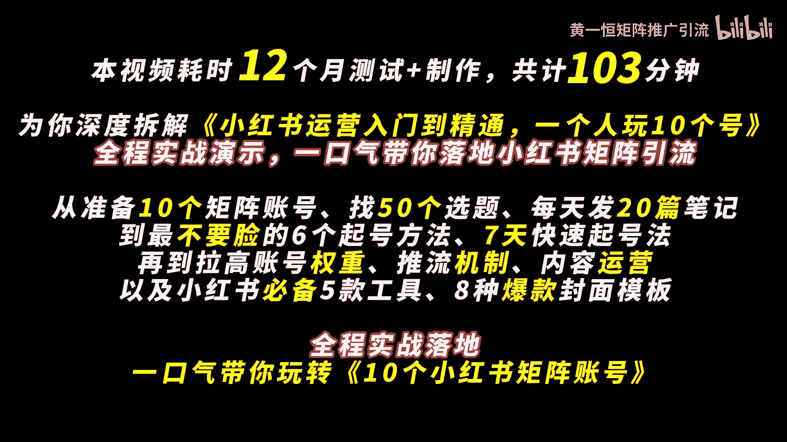

再到拉高账号权重，推流机制，内容运营以及小红书必备的五款功绩，八种爆款封面模板全程实战落地，一口气带你玩转十个小红书集团账号，第一章。

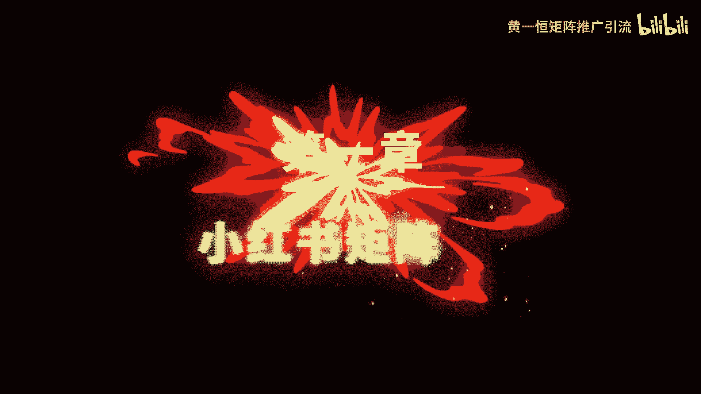

小红书矩阵推广最暴力的一种打法，新手小白也可以复制操作。

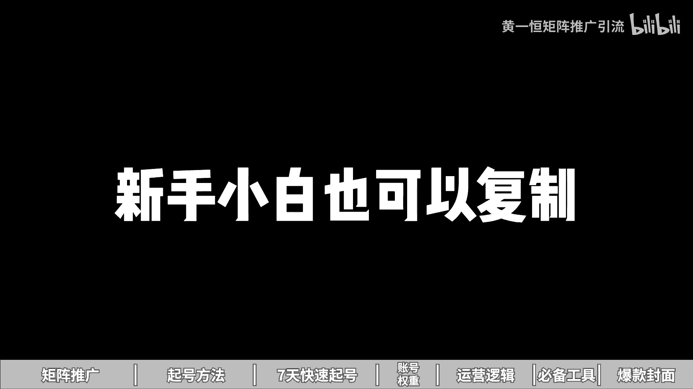

我花了30天发笔记，测试已经报了几个账号，这个方法就是小红书暴力集阵，打法太残暴了，先准备十个账号，快速找50个选题，每天批量做二次元笔记，多账号分发，拿平台流量补贴，具体该如何落地操作。

一起来看我给你分享如何准备十个小红书账号，每天找50个选题，快速制作20篇笔记，批量发布，拿平台流量补贴，先来看急诊目标，为什么做小红书一上来就要搞集证，就是为了更快的把小红书账号做起来。

获得大量的流量和顾客，所以我们在操作的时候，需要准备十个小红书账号，每个号每天发布两篇笔记，上午一篇，下午一篇，目的就是为了用概率来换取成功率，因为咱们做了十个号，每个号来每天发布两篇笔记。

一天就能发接近20篇笔记，一个月大概有接近600篇笔记，这些笔记里面有的流量大，有的呢流量小，还有一些能够上小热门，比如说能够带来10万加的流量，这种笔记啊，一篇笔记就可以给我们加粉上百人。

客户呢自然也就不缺了，那到底我们该如何去操作，首先我们需要准备十个小红书账号，在做多账号的时候，一定要遵循一个前提，就是咱们的注意事项，一机一号一网络，有的伙伴呀一上来之后，为了节省成本。

一个手机他搞了很多个账号，也连接一个WIFI，导致后期出现，比如说账号关联，甚至最坏的打算就是全部账号都被限流，或者都违规了，所以咱们在操作的时候呢，一定要注意这个点，不多开，防止设备关联。

什么叫设备关联，小红书是互联网整个平台里面最严格的一个，因为他是唯一一个会封禁设备的平台，比如说像我们的账号就出现了这个情况，方号通知，亲爱的小红书，经证实，您的账号所归属的设备下。

多个账号均存在严重违规行为，不符合设计规范，平台将对您的账号采取封禁处理，且该设备下面所有账号都会被限制登录，注意看啊，所有账号所有的伙伴登录了三个五个账号，一个账号出现问题，设备被封之后。

另外几个账号全部也挂了，而且这些账号有的可能是你做了几个月的，全部都挂了，我们是不是又得重新开始，还有伙伴呢喜欢连WIFI，比如说五个十个账号，连家里面或者连公司的WIFIWIFI。

它也会导致关联流量全部都非常差，所以咱们在做的时候不连接WIFI，防止IP关联，那么具体在落地的时候，我们需要准备十个手机卡，那么手机卡这一块呢，为了获得更高的账号质量，获得更高的权重。

或者前期大的推流，咱们在做的时候，最好是能够找十个亲朋好友，因为在我们身边很多长辈，他们基本上都不上小红书，他们的手机号来我们直接填过来，获取个验证码就可以去注册这个小红书账号。

这种账号称之为叫做实卡注册的账号，也就是13151819号站的质量会比较高，一个月以后，现在我们注册完之后拿来进行使用，发布笔记，一个月之后流量上来了，我们再给他换绑上营业出租的卡。

用该方法就可以实现什么无限产账号，而且产出来的账号质量都是特别特别高的，不过嘞中间我们是需要配合上林业租注册卡的，这个林业租注册卡，大家可以在各大平台去搜索，那么五块钱就可以买到一张。

50块钱可以买到十张，一个人的话可以实名几十张卡，重卡呢记住他只能够收发短信，是不能够上网，也不能够打电话的，然后我们还需要准备十台手机，手机这一块，大家家里面如果有多的手机可以直接使用，没有的话。

像我们自己用的这么多手机都是哪些型号嘞，其中就是红米note9或者pro，价格呢非常便宜，350~400块钱就可以购买到，这个不是前新的，是二手的一个价格，所以咱们在做的时候啊，都用的是这个型号。

在购买配置的时候，尽量的选择这个664G的配置，以上配置太低，用一段时间之后呢，非常卡顿，咱们搞起来的时候啊，做一步卡一步，肯定也没有什么心情，做下去了，还可以购买这个红米note10或者pro。

价格稍微贵50块钱，配置呢也是最低，买这个以及这个以上的购买渠道，大家如果有经验的，那么可以到这个某鱼上面购买，价格会非常便宜啊，也就是到了海鲜市场，如果没有经验担心翻车的，可以到这个某东的拍拍。

或者某宝上面找卖家来进行购买，那么会有售后保障，一台的话贵30~50，当有了手机之后，还需要准备流量卡，如果你自己有手机卡，手机自带流量这一个操作呢就可以省略掉了，如果你前面用的是林业租租的卡。

这个卡它是没有上网功能的，我们就需要单独给它配上一个独立网络，那么流量卡这一块呢，也就是大家俗称的这个物联网卡，为什么用它来，第一个，因为它价格特别的便宜啊，你看我们用的69块钱，24个月。

这个69不是每个月是总共两年，只需要69块钱，每个月有接近40G的一个流量，而且呢一个人可以实名很多张卡，跟我们那些手机卡它是不冲突的，所以大家可以去找一下这种物联网卡，纯流量。

用这种卡放在你手机里面进行上网就可以了，如果你实在找不到这种套餐，你也可以来找我，我把我这个渠道分享给大家，做一个资源共享，帮助大家来节省时间，接下来我们就可以开始去注册账号了，那么账号在注册的时候啊。

我们一定要把资料给他完善一下，因为会把资料都不修改，直接去发布，不像一个真实的账号，那怎么办，我们打开投屏手机，然后来点击右侧的这个，我在这里面我们找到这个叫做编辑资料。

在编辑资料里面把这里面的信息能填写的，尽量都给他什么填写一下，这样的话更像是一个真实的账号，其次呢，有的伙伴呀，一上来就希望在什么签名，背景墙里面做个小广告，我告诉你这种方法完全不可信。

因为他信号非常敏感，还没有过这个脱敏期，你稍微加一点小广告，就有可能导致你资料被重置，严重者账号违规直接就完蛋了，好接下来我们还需要正常活跃下账号，账号注册完之后，千万不要只放在这个办公桌上面。

从来都不动啊，一定要每天保持一点活跃度，更像是一个真实的账号，具体你可以参考一下，比如说每天浏览30分钟，点赞收藏20个作品，评论5~10条，关注5~10个博主哎，都是可以的，目的就是为了保持活跃度。

而是变成一个什么正常的高社交的活跃号，接下来我们需要去找选题选题啊，咱们每天都需要去找50个选题，那50个选题伙伴说哇这也太难了吧，该怎么找，这里面给大家分享一下方法，记住选题呢。

高于一切选题的权重大于80%，你发布完这个笔记之后，能获得100流量，1000流量，1万流量，10万流量完全就取决于选题，那选题呢我们不能说自己有什么做什么，会什么做什么，想到什么做什么。

这种就像发朋友圈一样，发出去之后根本没人看，咱们要学会看数据，看数据等于什么，开卷考试随性而发，等于盲人摸象，所以你发的所有的笔记，所有的选题，都要建立在别人的数据基础指标之上，这句话怎么理解。

比如说你找个对标，这个对标一共发布了100篇笔记，100篇笔记里面有十几篇流量是比较大的，你就把这十几个选题拿过来抄过来，直接照着发布就可以了，因为做小红书你要知道火过的内容，他还会再火的。

爆款都是相似的，所以做小红书有个公式叫做70%的相似，爆款乘以什么，足够多的尝试次数，就可以帮助我们把小红书做起来，那具体怎么去做这个选题嘞，这里面给大家分享几个方法，首先我们可以通过搜索选题法。

搜索关键词，找到近期的爆款，来快速的找到选题，来给大家投屏演示一下啊，咱们打开投屏手机，然后嘞在上方的这个搜索框里面，我们输入自己赛道的关键词，比如说我们搜索这个净水器数字完成之后啊。

这里面就有很多种的选题，咱们在挑选题的时候，尽量的挑一些时间比较近的这种，太老的了，已经过期了啊，已经过时了，比如这里面有个那么300多点赞呢，整理下来叫做不懂就问净水器到底该怎么选好，再往下滑好。

昨天发布的好，这种笔记，你看虽然它只有几十个赞，但是你隔个三天五天去看，它的流量就拉高到了几百个赞，30秒教你选对净水器，干货满满，不踩坑，你再往下滑，这里面还有很多，好像这个五天前的啊。

这个视频笔记咱们就不要了啊，咱们在选的时候呢，前期尽量做图文，我们可以点这个筛选，选择这个图文好，这样的话可以什么尽量的找一些图文对标好，这里面有很多，你看这个300多的，400多，两天前的，然后呢。

昨天发布50多的好，再往下滑，我们还可以找一个昨天发布的看600多套，叫做三款净水器前购置单，保姆级净水器选购指南，每个选题都是有流量密码的，咱们拿过来做流量绝对不会太差，好这第一个。

第二呢是对标账号发这个什么意思啊，当我们找到一个好的数据之后啊，比如说像这一个哎它的数据比较好，我们可以去看一下，他是不是发了很多类似的笔记，咱们直接打开这篇笔记，找到他的一个账号主页，在他的账号主页。

你会发现它这里面有很多很多这种选购指南，那么有的流量非常大，达到了1000多，那么有的呢流量稍微小一点，我们就可以把这种流量超过四位数的，也就是达到一两千的给它整理下来。

这种就是相对来说流量比较大的选题，咱们给整理到自己的选题表格里面，那么第三个方法叫做下拉选题法，什么叫下拉选题法，当我们在搜索关键词的时候，你会发现在下拉框里面，他会推荐很多很多高频的关键词。

这些高频的关键词，也就代表是一些用户关注度比较高的，比如说净水器怎么选，净水器，家用推荐净水器，DIY净水器的选购攻略，净水器哎，反渗透我们都把它整理下来，在整理的时候呢。

最好是能够去建立一个什么选题表格，为什么做选题表格，因为我们的笔记不是看一篇做一篇，我们是找50个，从50个里面挑选数据，最好时间最近的优先进行操作，这样你的笔记的数据才能够拉的比较高。

所以咱们需要把这个选题方向，标题发布时间，账号粉丝收藏点赞这些给他整理下来，最重要的是要学会做这个收藏比，评论比和分享比这个什么意思，比如说在这个笔记里面，我们来挑一个收藏比相对来说比较高的。

这一篇笔记，达到了147%，什么概念，相当于100个人点赞，会有147个人，那么进行收藏这种笔记来很容易二次火，那咱们拿过来做这个爆款，流量绝对不会太差，所以在做的时候，大家一定要做一个这样的选题表格。

这个选题表格有个伙伴发现做不了，这个收藏比，评论比分享比到底是怎么一个公式，大家如果不会做的这个选题表格呢，你可以来找我，我把我的这个选题表格来分享给大家，咱们做一个质量共享，帮助大家节省时间。

那么当我们有了50个选题，接下来我们需要从50个选题里面挑选20篇，数据指标，整体比较靠前的，优先进行操作，怎么做，首先我们从选题表格里面挑选数据指标，比较好的，然后呢通过模板来做。

你做20篇就能够完成，否则的模板一天只有两篇，那么20篇笔记啊，其实第一篇笔记我们做模版的时候呢，确实会比较费时间，有的时候需要花一个小时甚至两个小时，后面的话我们就可以直接去套这个模板了。

这里面呢我们需要借助一些工具，工具的话，像比如说这个搞定设计，创可贴黄油相机啊，都可以玩，这里面呢我用的是这个搞定设计，我给大家演示一下，咱们打开这个搞定设计，打开之后啊，我们找到这个搞定设计。

在这里面呢我们点击这个叫做创建设计，然后往下方滑动，它会有个小红书配图，点击一下好，这时候我们就可以得到一个小红书的尺寸，然后我们在这里面去填充它的内容，千万不要从这里面去找模板。

以及去用他的一些VIP素材，否则你这个免费版用不了了，咱们是没有花钱的啊，那么当我们用这个搞定设计啊，我们在做的时候是需要做模板出来，什么叫模板，给大家看一下，我们自己做的啊。

我们打开之后点击这个最近打开，这里面就会有很多很多，我们最近编辑的一些这个笔记，比如这是一个模板，这是一个模板，这是一个模板，这是一个模板，这些都是模板，那这这些模板做好之后，那怎么办呢。

接下来我们只需要把这个模板，那么填充一下框架就可以了，比如说把标题替换一下笔记内容，替换一下图片素材替换一下，就可以得到第二篇，第三篇，第五篇，第四篇笔记，否则二审笔记怎么来，根本就完不成。

那具体该如何对笔记进行清除来，这里面有四个方法，第一个叫做重写文字，用重写文字是配合AI来玩，我给大家示范一下啊，咱们打开这个AI平台，然后呢在AI平台里面，我们去找到这个叫做AI创作，然后找到小红书。

选择小红书重写，我们就可以把我们的笔记，文案放到这里面来进行重写，我们来示范一下，比如说咱们来找一篇笔记，给大家演示一下如何对这篇笔记进行一个重写，好比如这里面这一个模板，我们需要给它拿过来进行器重。

我们只要打开这篇笔记，打开这篇笔记之后呢，这个模板是我们花了时间制作好的啊，咱们把一些图标先删除一下，接下来我们点击这个三个选点，点击这个创建副本，在副本里面改啊，不要在原料上面改好。

然后比如说这里面的这段文案，我们可以给它复制一下，复制完之后粘贴到AI里面，然后点击那个生成，就会发现AI它就可以对这个文案进行改写，如果你想提高效益，你可以把这个窗口多复制几个出来啊。

像比如说下面的这个我们能不能改，连标题都可以改写，比如说爆款文案框架，我们链接进来，虽然几个字比较少，但是也是可以改写的，好现在你看到AI它已经正在改写，那么改写完成之后呢。

我们就可以直接把这个内容拿过去替换一下，有的内容可能会稍微长一些啊，这种咱们就得手动的对它进行一些啊删减了，否则连提定期啊，内容就会比较多，你看啊，刚才我们的标题叫做爆款文案框架啊。

打造爆款文案的结构秘密好，我们来看一下，把这个替换掉爆款文案的结构，我们改成这个什么爆款文案的秘密，然后嘞接下来这一段我们给它复制一下，复制完之后，我们在这里面进行一个粘贴替换啊。

只不过这个链接进来的文字它会非常的多啊，我们只能挑一些过来，否则呢这个内容填进来之后会太多啊，这里面的话，比如说我们就从这里面好复制这一段话，把这一段话替换进来哎就可以了，其他的咱们就不要了。

因为为了方便我们自己的一个排版啊，这里其实稍微还会有一点点长，好，我们好给它删减掉一点，这个大家都可记得，包括下面这些也是一样，像我们在做的时候，其他笔记也是可以的，我们只需要找到相应的段落。

把这些段落放进来，都可以用AI进行重写，那么重写完之后，你可以重写第二次重写，第三次重启，第五次就是重写的次数越多，我们就可以获得什么N多版本的一个，这个什么小红书的笔记好，这是一个方法。

另外方法是修改排版，什么叫修改排版，比如说举例啊，像刚才咱们这个笔记，它前面讲的是通用类，后面讲的是个结构类，那我们能不能把两个颠倒一下，哎是可以的，就比如说我们把这个再给他复制一个副本出来。

我们做一下顺序的颠倒，那顺序颠倒了，我们可以把上面的这个给它删除掉，删除掉之后把这一个给他啊，先挪到什么下面来好，挪到下面来之后呢，我们找到前面的这一个，然后选择中下面的给他CTRL加C复制一下。

复制上之后粘贴进来，好，挪到上面来，你可以看一下前面我们的顺序啊，就做调整，这样调整出来之后，它的原创度也是会得到改变的，然后我们还可以那么改这个布局，布局什么意思。

相当于就比如说啊现在它的这个是在左边的，那我们能不能把这个调到这个中间来好，这个叫改布局，包括它有些文字是基础的，那我们也可以选中这个文字，然后来给这个文字做一下集中好，这种排版也是可以的。

还可以改顺序，改封面，封面什么意思，相当于就是什么，我们的把新酒装到哪个瓶子里面，哎，换一个模板方面套一下就完事了好了，各位同学，当我们把笔记做好之后呢，接下来我们要开始去进行一个拿流量补贴。

那么拿流量补贴怎么去做，首先我们需要通过创作中心笔记灵感，通过这里面发布，如果你是潜心注册的账号，一打开这个笔记灵感，他就能够点击这个订阅，然后来获得一张200的流量券，这个毕竟是完全免费的。

咱们点一下就有了，那么这个灵感中枢理论件是非常多的，只要你定期从这里发笔记，你会获得一千一千一千五百流量券啊，所以咱们在做的时候呢，基本上流量券啊，光给我们带来的流量都可以达到什么四位数，甚至五位数。

有多方向找不到，我来给大家演示一下啊，咱们打开这个投屏软件好，然后来找到这个我点击左上角的这个三条杠，在这里面选择创作中心，在创作中心里面呢，我们找到这里面有个叫做笔记灵感，我们点击一下，点击完成之后。

然后在下方你看啊，这里面它就会有很多很多的一个笔记灵感，这些灵感大家就可以选择适合自己来进行发布，如果是新账号，它这里面会有个订阅，点击一下就可以获得这个什么，获得这个流量补贴，在发的时候。

大家可以通过这里面去找一些，跟自己比较相关的，咱来点击这一个叫做什么，比如说气发布好，从这里面发布，我们就是可以拿到这个什么流量补贴的好，这是第一个方法，那么第二个方法就是我们在做的时候。

一定要学会在标题里面卡一个关键词，那么因为目前整个小红书里面，它的搜索流量占比也是非常非常高的，有80%的用户，他们访问小红书，首先就是去什么进行一个搜索，所以我们在操作的时候呢。

就可以通过右上角的输入框里面，比如说我们做净水器的，那么这个净水器它跟哪一个关键词相关，比如说跟这一个相关叫家用推荐，那我们的标题里面就需要包含这个词，所以这里面的为什么他们的笔记会有排名。

就是因为他们卡这关键词，这是第二步，第三步呢，咱们在做的时候，还需要开启一下同城的附近位置，那么桐城的附近位置，尽量选择一些人流量比较大的，这个什么意思啊，比如说现在武器发布，有的伙伴可能在小县城里面。

那怎么办呢，我们在发布的时候可以选择一些热度，相对来说比较大的，热度大的，它能够获得什么更多的一个流量，那么这个大家如果不知道怎么看热度，对自己城市不是很了解的，有一个办法啊，什么办法呢。

就是我们可以去搞一个百度地图，那么在百度地图里面，我们通过右上角这里面有个叫做图层，我们打开之后啊，它会有一个叫做什么叫做热力图，我们点击一下，点击热力图之后呢，在热力图上面你稍微缩小一点。

就能够看到你们当地到底哪个地方的流量大，哪个地方的流量小，那么尽量选择一些偏红色的，你发布完之后就可以获得周边的流量，因为我们在这个小红书的APP里面好，我们切换一下，切换过来之后你可以看一下。

那么默认的是这个推荐页，你就发现，然后嘞右边你看这个重庆就是周边的流量，你看这个是80米的，然后呢这个是2。2km的，你看这些就是我周边的，那么周边这些曝光对我们新账号来说，前期啊也是非常重要的，好了。

这就是拿平台流量补贴，那如果咱们想一个人玩十个小红书账号，每天能够获取到100个顾客，这个其实并不难，因为一个账号十个顾客，十个账号自然就100个顾客，那这一块呢，因为咱们这个视频啊没办法做太长太长。

大家也没耐心看，最主要是没有流量，所以呢我单独的整理了一些资料，比如说小红书的入门干货框架。

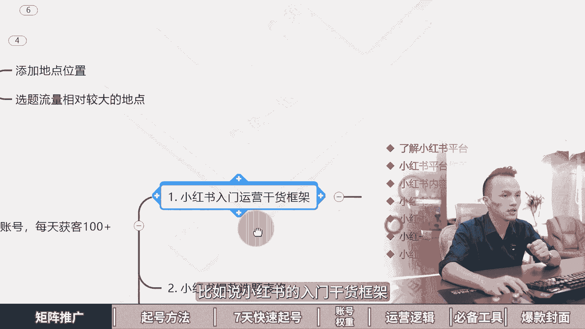

这里面有小红书的收录机制，运营工具，企业号的运营，还有KY的投放以及店铺的运营，同时呢我还给大家准备了，刚才我给大家演示的这个小红书的选题表格，模板，供大家来进行一个使用。

还有我们两到三个小时的小红书系统课，这个课程呢他会讲到小红书的全流程怎么设计，钩子怎么导流以及常见问题啊，这些呢大家都可以找我，我把这几个资料打包分享给大家，让大家进行系统化的学习，学会小红书矩阵打法。

第二章小红书最不要脸的起号方法，最不要脸的小红书起号方法，24小时就能起号成功。

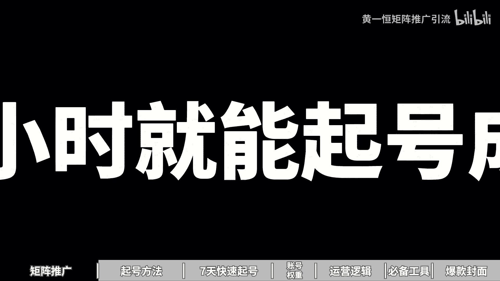

甚至更加的狂暴，我说一下，但绝对不给力，第一个片频起号法。

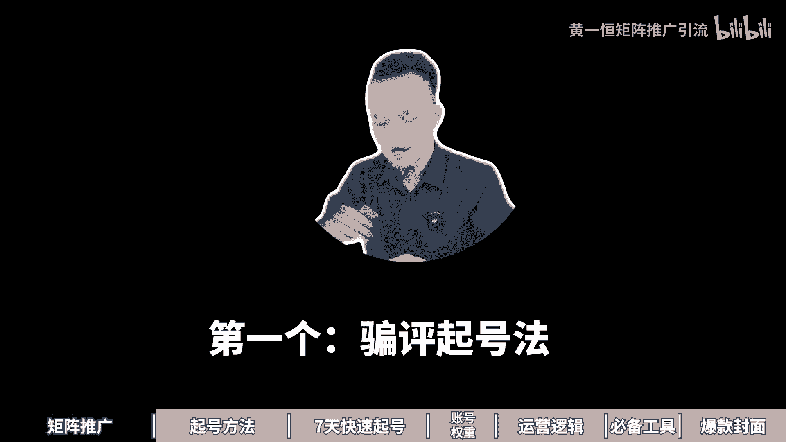

在笔记上面下钩子，让用户咔咔咔的评论，通过评论来拉高账号推流，第二个擦边起号法，只要你在你的笔记前面加上擦边标题，你会发现你的流量比之前高了10~20倍，关键是无论哪个行业都有模板。

可以直接套用nice啊。

24小时起哄还嫌不够快，还有钩子起号法，搜索起号法。

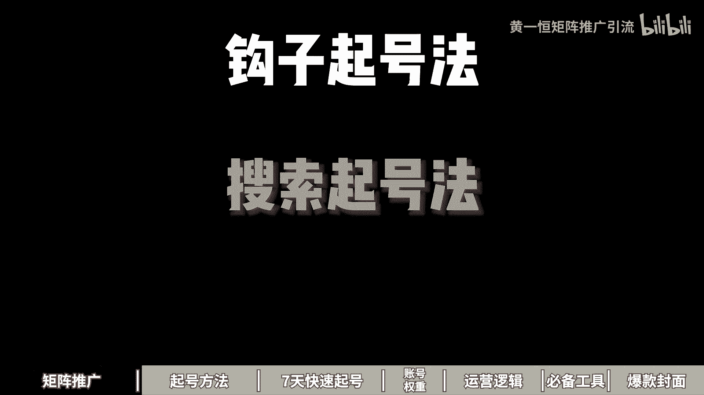

复制起号法，模板起号法统统给你分享，一起来看，我给你分享片频起号法，擦边桥法，钩直桥法，还有收缩桥法，复制桥法以及模板桥法，现在看第一个片平桥法，因为小红书70%的用户啊，都是理性，女性，有什么特点。

他们比较八卦，所以在身边你可以看一下很多的这些女同事，他们非常关注什么明星的八卦事件，在村里面一些女性长辈组在一起，就成了咱们村的情报局，探讨来非常激烈，伟人呢也比较热情，非常喜欢什么互帮互助。

同时呢评论得分，他又是我们整个账号里面得分比较高的，因为在小红书的CES评分里面，评论达到了四分，点赞一分，收藏两分，评论四分，转发四分，关注八分，相当于一个人评论顶得上什么，四个人进行点赞。

两个人进行收藏，所以通过拉高评论得分，是获取流量非常快速的一个方法，那怎么办，接下来我们来看一下，引导用户进行评论，这里面有个非常简单的方法叫极限二选一，就是用户看到之后啊，他不需要思考。

你和我里面进行选择，具体大家如果不太理解，我们来说说看一下，咱们打开这个投屏软件，点击右上角输入框，在这里面输入关键词极限二选一，好输入之后你可以看一下，这里面就非常多了啊。

这是听说感情越好的两个人口味道夜相近，极限二选一是选这个关东煮还是选钵钵鸡好，再往下方看洗衣机极限二选一，然后嘞苏泊尔的奶茶极限二选一好，再往下面看，这里面很多很多啊，不管哪个赛道都可以玩。

比如这里面有一个做家装赛道的极限二选一，厕所地板砖选哪一个嘞，点进来啊，上面一个还是下面一个好，这时候你可以看一下啊，基本上下方就有很多的评论，而且这篇笔记的数据比例啊。

他的评论量都达到了什么1700多，这1700多相当于顶得上多少，顶得上接近7000多个人进行点赞的，各位同学好，再往下我们来看看这里面有个啊，非常非常还有做首饰的姐妹们手镯二选一。

然后来这里面还有这个啊这个咖啡二选一，然后呢护肤品的一些二选一，薯条二选一，好体育用品二选一，这个模板记住啊，适合于所有赛道哎，都可以直接套，你看七选二选一，四选这个腾4Z9还是选帕拉梅拉好。

这个模板呢非常容易，另外还有个玩法叫做简答题，什么叫简答题啊，就是让用户回答问题，说出你最喜欢的城市，说出你最喜欢周杰伦的哪一首歌，比如说说出你最喜欢哪一辆车，比如现在我们做一个汽车的账号。

我们就可以打上，说出你最喜欢的车，你看啊，那么这时候就会有很多人进行一个互动，你看一下，大胆说出你最喜欢的车，原来1~20岁最喜欢的车，你看这种就是套模板了，然后说出你最喜欢的，你看这边就非常非常多。

什么明星呀，什么运动员呀，还有什么星座之类的，核心点就在于什么，就在于降低用户的行动成本，不需要用户思考，用户只需要回答你的问题，而且回答的答案你都给他准备好了，选择就行了。

好来看第二个更加的猛叫做擦边巧法啊，那么擦边巧画法，就是在标题上面来加上擦边词汇，引导用户产生无限的遐想，你看到之后哎呀这个不点击也难受啊，流量就能够提高10~20倍，那么增加用户的一个点击账号的流量。

提升CES评分呢也拉高了，也能够吸引精准的人群，因为我们是在标题上面加擦边词，不是纯擦边啊，这个点需要注意，无论哪个行业都有模板呢，可以直接套用啊，比如说什么擦边词呢，我们来看一下啊，像什么出轨。

想看翻车，无意间看到亮了，这些词都是什么，都是能够让人产生无限遐想的，你可以直接套用啊，比如说我们来看几个行业，女装行业，那么发女装的穿搭图啊，没什么流量，那怎么办，我们可以这样发。

那么想看能把男朋友迷晕的吊带，你看到啊，那这里面把男朋友迷晕的吊带，就说明非常的性感好，这篇笔记呢大家看下数据啊，非常高，达到了2万点赞，1。2万的收藏，4000多个人展开评论，而且他的封面有个特点。

就是直接用手写的，让用户看起来非常非常的真实，所以大家可以用什么备忘录啊，也可以用什么纸张手写都是可以的，好再来看一下法律行业，那法律咨询，这里面写了一个法官认可的出轨证据好。

这里面你看这个是法官认可的，立马发上来之后，数据也比较不错吧，也获得了几百条数据反馈，好再来看一下这个民宿行业，普通人怎么发嘞，普通人这样发啊，什么民宿推荐，直接就像打广告一样的，用户非常反感。

那怎么发嘞，我们加入擦边词和男朋友怎么怎么样啊，长沙制片舒服死了，你可以看到啊，那么这就是在做什么，在做民宿的，只不过来换了种方式，所以流量立马就提高了几十倍，好接下来看一下第三个方法叫做钩子桥法。

钩子起号法就是说在我们的笔记里面留下钩子，比如说挑战型钩子啊，珠宝行业怎么玩，我们可以这样做，挑战一周手势不重样，那么挑战500块钱理由，挑战100块钱理由挑战100块钱玩遍美金。

挑战200块钱玩三天啊，用户就会觉得啊200块钱我有啊，能玩三天，那我想试一下好，这种就是什么激起了用户的一个什么点击页好，再比如说素材型钩子啊，那么基于人性急功近利的特点，他就非常想快速拿到结果啊。

描述到位，吸引用户来去看完笔记啊，就比如说3分钟搞定约会妆容，十秒钟教会你学各种各国语言，然后嘞三天时间选搞定什么加装的一些效果，反正你就可以加上时间，把这个时间正常可能要十天，你变成一天，正常要一年。

你变成一个月啊，这种就是什么啊，比如说啊挑战一一个小时赚一桶金，这个就会让人觉得不可思议，好，接下来再看一下反差型的钩子，那么反常规反认知的内容引发用户的思考，促使用户后悔没有早点知道。

要是我早点知道就好了，比如咱们来看一下实例，买得起200万的房子，千买不起万的包，还就会让用户觉得这个人这么有钱，200万都花了1万钱，花不起，不想接触人类的工作，就是不想跟人打交道，不懂就问。

想想都可怕好，你看一下，这些都是带反差型的好，还可以组合打法，我们上面多种方式组合在一起，比如说挑战带爷爷一个月学会阴影好，你看一下，这就非常奇怪了啊，挑战，然后呢一个月时间，而且是爷爷，就算牛哇。

爷爷年纪这么大，还能够一个月学会英语，挑战100块钱搞定一周穿搭不重样好，这就是让用户觉得，100块钱相当于一周穿搭不重样，你要买什么，要买七套衣服，而且是一周就会让用户觉得怎么可能做得到啊。

他就想来看一下，来看第四个搜索巧法，小红书搜索流量占比65%以上，有80%的人第一时间打开小红书，都会通过右上角的搜索框来搜索答案，那如果我们想获得这个搜索流量，就需要做搜索排名。

那影响搜索排名的因素有哪些呢，咱们来看一下，首先就是内容标签的一个相关度，用户搜索完之后，他会把相关性更强的数据反馈比较好的嘞，排到前面，这里面有一个发布笔记到曝光流程，给大家梳理一下。

首先我们发布成功笔记系统来进行审核，看看有没敏感词，接下来社区啊就对它进行收录，收录完之后呢，它会根据你的内容来打标签，比如说根据你的封面标题，话题画面和声音来打标签，打完之后。

这时候系统开始进行推流测试，如果打的标签比较精准，那么我们的流量就会进入到下一个层级，如果打的标签不精准，数据反馈很差，流量呢也就什么终止了，所以咱们在做的时候，都需要在这些地方里面卡上我们的关键词。

其中啊有的伙伴说为什么我打开色框，搜索完关键词之后，我看到一些笔记排在前面，他并没有在这几个里面都放上关键词，为什么也会有排名，是因为他们主要在标题里面放上了之后呢，也会的排名。

因为标题它是影响排名非常重要的一个因素，在我们发布笔记的时候，系统也会提示填写标题能够获得更多点赞，为什么填写完标题之后，用户能搜索到你，系统能够识别到你推荐给记更精准的人群，毕竟一个东西好与不好。

它是企业推给谁看，那么其他的还有些因素啊，像比如说这个什么账号的权重啊，发布时间多多少少也会有点影响好，接下来咱们来看一下到底该如何操作呢，在落地的时候啊，我们需要去布局这个搜索关键词。

首先把那种竞争小，流量大，更精准的关键词，来布局到我们的这个笔记里面来，所以这可以选择一些更加积极的，什么综合关键词，就比如说我们做这个连衣裙的，连衣裙非常竞争大，那怎么办，我们可以做微胖连衣裙。

竞争变小，或者说高个子连衣裙，就像净水器也是一样，净水器这个词啊竞争非常激烈，那怎么办，我们可以选择一些稍微细分一点的，比如说净水器，指引好，直饮净水机，那这一个关键词竞争就变小，想排在前面更加容易好。

第二个，那么反馈目标用户可能会搜索的关键词，什么意思，我们可以站在用户的角度去思考，预测用户搜到什么关键词，有的关键词系统给我们推荐了，但是呢还有很多关键词是系统没有推荐的，比如说净水器。

我想出去玩的时候，我想带一个户外的净水器，而且是那种比较便携的，你看啊这个词搜索出来之后，你会发现它的笔记啊，其实数量是什么，整体是非常小的，咱们刚才收这个户外净水器便携的时候，它提示只有505篇笔记。

那你要排在前面，这不等于什么，特别简单啦，特别容易吗，你只有500多个竞争对手，各位同学好，接下来看一下增加笔记里面的关键词密度，那咱们在操作的时候，还可以在封面标题。

正文话题评论区里面都可以出现我们做的词，比如说我们做的词叫做户外净水器，便携好，把这个词给它预埋到里面，更加能够获得这个牌面，另外一个伙伴在操作的时候会堆叠关键词，结果放一大堆关键词。

就是避免不相关的关键堆叠，被系统判定为垃圾广告，那么避免这个流量跑偏，防止被降权，这个点来我们在操作的时候是需要注意的好，接下来看一下第五个叫做复制巧法，什么叫复制巧法，记住爆款笔记啊。

它都是有时效性的，只发布一次，可能会导致同人抄写，比如你发布了一篇笔记爆了，结果第二天第三天有五六个同行都在抄里，他那避免为同行做嫁衣，那么同行发布之外，有可能比我们自己研，作者还能够得到更大的流量。

怎么办，我们可以把这个爆款，与其等着别人抄，不如我们自己抄，自己把这个笔记稍微简单修改一下，多发几遍去吸收这个流量，多发笔记可以获得更大的推流，把流量全部都给他薅过来，而且爆款笔记的有个特性啊。

记住爆款都是重复的，已经爆过的笔记呢仍有可能会再次爆，所以这也是为什么你打开一些对标账号，它里面有几篇笔记重复的，而且数据反馈都非常不错，就是因为他用了这个复制条法，自己报了一篇，与其别人复制。

不如自己复制自己的，所以重复利用爆款素材，那么报过的素材可以再拍一次，分发到多个账号，然后来重复发布几十遍，甚至上百遍都能够带流量，我原来看到一个账号，他专门发这个明星的热点。

发这个谢霆锋和张柏芝的一个账号，里面发了几百个，全部都这一个热点，条条爆款，真的太厉害了，好来看最后一个叫做模板起号法，什么叫做模板起号法，那么当我们去搜索行业的关键词，搜索完成之后。

在主页你会发现它会有很多的，比如说我们搜索这个叫做家装行业，那么家装行业呢它是可以分为这个家装，装修和软装，比如说咱们来搜索一下，那么搜索完之后啊，这里面它会有很多很多的一些笔记内容，那么这些笔记中呢。

我们接下来需要对他笔记，找到这种最近一个月甚至15天里面比较爆的，比如这一个发半周或者四个五，5555个点赞好，这个内容来确实比较不错啊，再往下面来看，还有很多很多这个赛道里面比较热门的笔记。

然后接下来我们需要去拆解这里面的爆款笔记，那么找到爆款笔记进行拆解，拆解的越详细越好，记住爆款和爆款之间呢它都是有相似的点，比如说有相似的封面，相似的排版，相似的标题，相似的计算，相似的什么内容结构。

哎，就比如说咱们来这里面看看，能不能快速的找到一些还比较相似的，这种爆款好，咱们可以来划一下好，这里面你会发现啊，有很多就是直接展示自己家里面装修效果啊，这种就是最简单的一个模板。

那么其他的还有一些就是啊，比如说我们往下面来看，你看入住一年啊，这种也是直接拍家里面的一个装修效果图，那么还有人家是直接拍这种啊，前后对比类的啊，这些其实综合下来都是比较不错的啊。

那么还有这种你看他是做了拆分的啊，做了细节的，那么前面我们刷到了一个，它是有一个什么有一个这种流程图的啊，就比如装修的时候啊，那么前流程好，这种你去看有很多这种前流程都是比较火的，还有这种排版类的。

就是一大堆跟你叠加在一起，一次性就能够看到什么十几种方格好，这些都是爆款好，接下来呢我们来看一下产品全套爆款元素，什么意思，我们可以将产品全套到这个爆款元素里面来啊，就比如说我们找到了一个爆款。

那么这个爆款叫做毛坯房装修的全流程，那我们如果做净水器的，我能不能把它换成净水器安装的全流程，然后嘞，这里面他做了一个叫做，那么12大热门装修风格，那我换到我的净水机赛道里面。

我就给大家分享12种不同类型的净水器啊，比如说什么直饮净水机，然后呢还有这个什么过滤净水机，户外净水器等等，给他租过来也是可以的，所以爆款方面是客厅的，我们可以换成卧室，我们来看一下啊。

比如说这一个为什么不高级啊，廉价感现代简约方避坑六要素好，那么这个呢他是讲的是客厅的，接下来换到什么，换到这个卧室里面，想提高级感，千万不能碰的东西，你看啊，这个是讲高级感，这个呢也是讲高级感。

也是前后对比，改造前改造后的好，再来看一下爆款式软装，我们给它换成这个木地板，比如说这是从来没有这么直观的感受，软装的重要性好，我们翻过来之后，那么这么直观地感受到木地板，反正每一个都可以感受。

比如我们投到净水机里面，从来没有这么直观地感受到，直饮净水机的这个什么重要性，是不是可以直接套过两位同学，所以这个方法你可以称之为它其实就是什么，通过排列组合替换主体，然后嘞换一个赛道，换一个小行业。

换一个细分生成大量的爆款相册笔记，接下来看第四部发布优化，咱们需要制作的笔记啊，需要保持每天一到两天的更新，十天之后呢，我们需要分析一下数据，找到这种高点击的，高互动的以及评论量比较大的笔记。

进行第二轮的什么优化，裂变，什么意思，相当于我们把这个笔记再套一个模板，然后嘞给它放到里面去，相当于就是选题是爆款，形式是爆款，文案也是爆款，那么数量和质量呢整体都有了保证，那么通过这种方式啊。

认真执行一到两轮大概率来都可以成功好了，各位看，这就是多种起号方法，除了通过起号来快速拉高我们账号流量，其实还有一个比较暴力的打法，就是做几站，一个人玩十个小红书账号，每天或黑100家，一个账号。

每天十个顾客，十个账号加在一起就100个顾客，那这种到底该怎么去玩嘞，这里面我给大家准备了几份资料，首先第一份呀是小红书的一个入门营干货框架，让大家能够快速的上手，了解小红书的评价速度机制。

运营工具有哪些，企业号的运营以及投放，包括店铺管理，还有这个小红书的爆款选题表格，咱们在做笔记的时候啊，千万不要盲人摸象，一定要学会什么开卷考试，学会看数据，挑选一些收藏比，评分比。

分享比比较高的优先来进行操作，更加容易爆，那这个表格呢大家可以找我，我把它分享给大家，还有我们小红书的系统引流课，有接近三个小时，系统的给大家拆解小红书的前流程，钩子怎么设计，怎么导流。

还有常见问题以及小多数的边缘项目，这些统统都打包好了，大家找我，我把它分享给大家，第三章小红书七天快速起号，太快了太快了，新手起号七天，小红书就报了几个账号，我们公司刚来实习生，我叫他去做小红书推广。

他做了几天账号就爆了，一天加几百个人牛逼，我们来看看他怎么做的啊，用七天巧号法，难怪这么快账号就爆了，真是个人才，这个方法不错，还节省时间，明天他就可以转正了，一起来看，我给你分享，第一天使用老号。

第二天找对标账号，第三天建立选题表格，第四天尝试制作图文，第五天开始发布作品，第六天持续发布作品，第七天对播放小眼睛进行优化，现在看第一天什么脑号，什么脑号呢，最好是能够选择注册时间较长的账号。

比如说时间超三个月以上的老号，重账号本身有比较高的活跃度，而且已经过了观察脱敏期，发布内容之后，整体流量基本上都能达到500~1000左右，一个伙伴是昨天或者今天注册，立马就去发布作品。

发完之后流量就只有几十个，甚至有的完全没有流量，有伙伴说我这种老号平常有发过一些生活记录，或者你录的内容行不行，可以的，我们只需要把这些作品隐藏掉，重新发布垂直内容就可以了，因为你账号没打上标签。

你发的其他的他会打上这个什么新的标签，那为什么要去使用这个老号，首先星号的风控啊更加的严格，因为现在有很多专门的团队，他们在恶意的注册这种新号，出租完之后再去拿过去做什么截流啊，或者做打粉。

做什么机器号，做什么水晶号，这种账号的话很容易就被限流，甚至你前期发布基本上没什么流量，而老号的话已经过了观察脱敏期，系统更倾向于老号来进行推流，比如说像我们自己为了测试，我们单独搞了一些账号。

其中有两个来就是新号，也就是今天注册，今天七点发布，结果印了一个星期，一点起色都没有，而我们用了一个一年以上的老号，这个老号在第三天四天的时候就开始进行爆货，流量直接就达到了什么几万的流量，什么原因。

就是因为账号是老号，权重比较高，所以咱们在做的时候，很多同学在第一步上面就踩着坑，那如何去准备老号，其实有很多种办法，你可以看一下身边的亲朋好友，他们有没有在使用这个小红书，如果有的话。

你可以把他们的账号登到你自己的手机上面来，用一段时间之后嘞，然后再换绑一个手机，让他们重新注册一个账号就可以了，然后发布笔记，买一个月以后，我们再换本上林业主租的卡，这个林业租注册卡。

大家可以在各大平台搜索找到，接下来我们需要把这个资料给他做一下，这个修改，那么修改呢大家可以参考一下对标账号，那么设置一下你的这个头像昵称，个性签名和背景图啊，围绕着赛道，围绕着行业来说就可以了。

千万不要啊去投机取巧，打什么小广告这种账号嘞，你打广告的话是很容易违规的，那么第二天我们需要去找对标账号，那么第二天呢我们需要通过搜索或者推荐，去寻找50~100个这个什么对标账号。

特别是最近半年起来的账号，关注那种粉丝5万以下类的账号，特别多，留意一些那种低粉爆涨，什么叫低粉爆涨，比如他的粉丝量只有几百个，但是呢却有一个作品达到几千个点赞，这种作品就是新起的号。

他也获得了非常好的数据反馈，拿过来做流量绝对不会太差，具体给大家演示一下，首先我们可以打开这个投屏手机，在投屏手机的右上角搜索框里面，我们这里面可以直接搜索关键词，比如说我是做净水器的，搜索完之后。

这里面就有很多很多热门的选题，我们点击筛选，然后来找到这个图文，然后再点击一下好，这里面就有我们很多的主要账号，比如这一个账号两天前发布，目前已经获得了400多个点赞，叫净水器，显作颇大方。

能帮姐妹们避坑好，然后咱们打开这个账号，那么打开这一个账号之后，在这个账号里面可以看到啊，他是一个3。2万粉丝的号，粉丝代也是5万以下，我们可以去看看，你会发现它的很多数据啊其实也是比较差的啊。

就基本上有的都没有这个点赞，但是唯独这一个啊点赞比较高，也就代表这一个选题，他是这个账号里面的流量，密码数据是拉高了十倍百倍以上的，另外我们也可以通过账号推荐去找更多的账号，什么叫账号推荐呢。

我们划到上方，当你点击这个关注的时候，在下方这里面，它就会推荐一些跟这个账号标签比较相似的好，这里面推荐了很多美式的账号啊，这个账号相当于他是被打上这个美式的标签，看来这个标签啊打的不是很精准卡。

你可以重新往下滑，然后来去找更多账号，这里咱们就不做详细演示了，目的就是为了方便，给我们自己以后提供这个灵感，为什么，因为咱们有的伙伴是想到什么发什么，会什么发什么，有什么发什么。

这种就等于什么随心而发，像发朋友圈一样盲人摸象，而我们找了对标账号，特别是找50~100个，就有50~100个人，他们在免费的帮你测试个我们的选题，如果他们每个账号每天发一篇笔记。

100个账号一天有100篇笔记，100篇笔记里面就有数据指标，通过赛马机制跑得比较好的，我们把跑的好的选题拿过来调整修改项，激发数据绝对不会太差，所以会看数据等于什么，等于开卷考试好。

第三天我们要开始建立这个选题表格，那么选题的权重啊是高于一切的，前面呢是我们参考对标账号，哪些账号做得好，哪些账号做的差，这里呢我们需要从账号里面，挑选一些自己的选题，记住选题的权重，他是大于80%的。

所有发布的笔记，你要都建立在别人的数据技术指标之上，这个什么意思，相当于你自己千万不要去测试，测试的周期会拉的非常的长，而我们发布了20篇笔记，这20篇笔记就是别人测试报，而且是近期反馈比较好的容器。

发流量绝对不会太差，因为小红书火锅内容呢它还是会什么，还是会再火的，所以做小红书啊，有个公式叫做70%的相似爆款，乘以足够的尝试次数，就可以把小红书做起来，那具体怎么做，我们有几个方法。

首先我们可以通过搜索选题法，也就是刚才给大家演示的直接搜索关键词，从这里面把近期时间比较近，数据反馈好的选题来整理下来，这是第一个，第二来对标选题法，我们直接打开账号的主页，从账号的主页里面去挑那种。

什么数据反馈比较高的啊，比如这里面有个专门做净水器的，我们打开他的账号主页，在账号主页里面往下方滑动，你看这里面有很多很多，那么有的嘞只有一两个点赞，有的嘞不到十个点赞，我们就可以挑。

那种什么点赞比较高的，比如说在这个账号里面点赞量达到三位数，四位数的这种选题，就是什么流量选题，咱们拿过来，那么第四个呢叫做下拉选立法，什么叫下拉选立法，比如说咱们打开这个搜索框，在搜索框里面。

我们搜索的关键词出现的这个关联词，我们就把它称之为叫什么叫做高频气球，比如说净水器怎么选净水器，反渗透净水器，DIY净水器的这个压力桶，这就是当下用户关注度比较高的，不高的，他是不会出现在这个地方。

也就是大家对这个比较感兴趣，那我们就做这一个在操作的时候呢，最好是能够建立一个选题表格，帮助我们来做一下数据对比，毕竟我们要学会做开卷考试，比如说像我就做了个选题表格。

我把近期热门的流量比较大的全部整理下来，那整理下来之后，从这里面挑选一些收藏比，评论比，分享比比较高的，那么这种账号嘞就是目前反馈比较好的，我们不是找一个做一个，我们是找十个，20个，30个。

从这里面挑几个比较高的，比如说咱们来挑一个数据拉的比较高的，像这一个他的收藏比达到了100%，46相当于100个人点赞，会有147个人收藏，这种呢更加容易二次火，有的黄南说。

老师这种书籍比例我不会做怎么办啊，不会做没关系，你可以来找我，我把我的书籍表格来分享给大家，做下资源共享，毕竟这也是互联网最大的优势，好来看一下第四天，第四天啊，接下来我们就可以开始。

尝试着去制作这个图文了，我们需要去找近期的爆款选题，爆款选题呢，我们可以从这个你前面，如果你关注了100个对标账号啊，那么有一个办法非常简单，我们只需要点开这个叫做关注的这个列表，在关注里面去刷好。

这里面就会有一些，你看比如这一个好，他发布完之后2000多点赞，三天前好，说明数据反馈非常好，我们就赶紧把它抄过来好，这是一个方法，另外一个方法呢，你可以从选题库里面尽量挑选时间比较近的。

比如最近七天内收藏比例比较高的，这种代表内容特别实用，为什么这种内容它比较容易火，因为我们就是专门对干货的，一打开那种密密麻麻，看不完，看不完，太多了太多了，没办法，只能收藏下来以后再慢慢看。

它很容易啊，这货，然后我们需要参考这些选题，就是模仿制作啊三条，并且这三条呢一定要做出来，质量整体是比较高的啊，那么在模仿制作的时候，大家可以配得上一个工具，比如说搞定设计，创可贴黄页相机都可以。

这里我用的就是搞定设计，咱们打开这个平台，在平台里面点击这个创建设计，在这里面找到小红书配图，我们就可以去模仿着对方来进行制作，制作的时候，在用的时候，这个平台啊，我用的是一个个人免费版。

大家在使用的时候，只要你不使用它的模板，以及它的一些VIP字体，也就是在这个皇冠图标的，那你是可以完全免费使用的，像不用花钱也可以用这个平台，这里有个小细节啊，那么其他工具大家如果熟悉来也是可以的。

好这是第四天来看一下，第五天，第五天我们要开始去发布作品，那发布作品的时候，怎样可以获得更多的流量，这里面几个小技巧，第一个我们需要通过这个创作中心，笔记灵感来进行发布，那这里面特别是我们刚注册的账号。

或者是没有发布过笔记的账号，你以前没有领过流量补贴的，这里面都可以领到，比如说新账号打开你笔记灵感，它会有一个订阅按钮，订阅完之后立马会送你一张200的流量券，那么进入灵感中心之后呢。

如果你后期都从灵灵感中心里面，点击这个发布按钮发布，你可以获得大量的流量件，像我们一个账号啊，都获得了几千的流量件，这流量件毕竟你单独去投这个呃，薯条加热的话，那也得花什么好几百块钱。

我给大家演示一下怎么去找这个啊，咱们打开账号，然后呢点击右下角的，我在我这里呢找到左上角的三条杠，点击创作中心，那么在创作中心里面点击这个叫做什么，叫做笔记灵感，然后呢在笔记灵感这里面。

那么上方就会有定义按钮，我这个已经定义过，所以没有啦，在发布的时候呢，在这里面一定要找到跟你相关的，然后点这个发布，就可以拿到平台给你的一个什么流量补贴，第二个我们在发布笔记的时候啊，如果你做什么选题。

一定要学会卡一个关键词，这样的话可以获取到这个搜索流量，不及小红书的so o排名，比如说锦鲤啊，咱们打开这个投屏手机好，我们重新返回来，那返回来之后啊，我们在这个搜索框里面，我们点击一下。

点击完成之后呢，那这里面它是会有很多的一些下拉词的，比如说我做的一个选题叫做净水器，那么指引接好这一个，那我在发布的时候，我的标题里面就得包含这个净水器直饮机，那么这样的话。

当用户在搜索这个关键时候就可以找到的笔记，因为目前小红书它有80%的用户，打开之后，第一时间就是通过搜索框去干嘛，去找这个内容，第三个是同城附近流量，咱们在住的时候啊，一定要发这个同城流量。

毕竟在小红书的评价里面，你看啊，他的发现页右边就是附近流量，这个附近流量为什么会推荐给我，就是因为他是我周边的一些这种笔记，所以我们在发的时候可以勾选一下位置，位置尽量选择一些流量比较大的位置。

那这一步来也是什么非常重要的，选择一些你们当地比较热的好，接下来看一下第六天瓷器的发布作品，那么作品这一块呢，我们要拉高作品的质量增量这一块啊，在小红书上面，什么样的笔记能够获得大量的数据反馈。

流量能够达到5100万，我告诉大家做多内容，什么叫对内容，就内容太多太多了，我来给大家示范一下，比如说咱们收这个净水器，搜索完之后，为什么有的笔记它特别容易火啊，我们直接看这个图文。

节省一点时间好咱们往下方滑，你会发现有一些笔记，它的内容量其实整体是相对来说什么比较大的，像这种你可以发现啊，他三天前发布就有900个点赞，点进来之后呢，他的这个内容其实是非常多的啊。

这种就是典型的什么堆内容，叫做什么憋爆款，你要花更多时间来做，做出来之后呢，流量绝对不会太差，好这是第一个，第二个嘞，保持每天发布1~3个作品，如果你发三个上午一个下午一个晚上发一个。

再多的话就不建议了，最少你得有一个，然后前几天发布的几条作品呢，咱们在操作的时候啊，不要太在意这个小眼睛，小眼睛哪怕两百三百五百啊，都是没问题的，如果你发不完，三天之后，小眼睛都没破百。

就只有那么几十个，这时候怎么办呢，我们可以隐藏删除作品，重新发布，大概率的原因啊，如果你账号没有问题，基本上就是你的笔记里面可能有什么敏感词，那敏感词这一块呢，大家如果在做的时候。

最好的办法是能够在发布笔记之前，先检测一下啊，避免那么出现这个敏感词，而且敏感词如果出现一次没什么影响，如果你出现五次，10~20之后，你的账号直接就违规，甚至直接就完蛋了，直接挂掉了。

那敏感词检测工具，大家如果不知道怎么去检测，你可以找我，我把我用的免费的敏感词工具来分享给大家，让大家在发布之前都能够脱敏，接下来我们要持续的去发布作品，如果你已经发布了十条以上的作品。

并且已经间隔了超过三天以上，你去看一下你的小眼睛，每篇笔记的小眼睛基本上都没有破300以上，如果偶尔有几篇破了，说明是正常的，如果全部都没有破300以上，建议大家放弃这个账号。

这个账号基本上系统它是限制的，没有给你什么流量好，接下来看下第七天小眼睛播放的优化，首先如果那小眼镜啊是小于等于200的，那么基本上大部分的原因啊，都是作品有违规被限流，那么这种牛肉呢一般不是当天看。

是发布完之后，三天之后你再来看会比较准确一点，那么大家可以来找我把它分享给大家，有的是内容或者话题整体比较敏感，就有的行业这个赛道他就比较敏感，或者说是你的原创度太低了，你需要去调整一下。

那解决办法呢就是什么，我们可以通过这个帮助与客服，来给你的账号做一下检测啊，怎么操作，给大家投屏演示一下，咱们打开账号，然后来点击这个右下角的，我好在这里面找到左上角的三条杠，然后呢点击这个帮助与客服。

点击完成之后，这里面就会有一个叫做账号检测，你可以先检测一下，看看你的账号有没有出现什么问题，好咱们点击一下啊，点击完成之后呢，你会发现他的这个账号如果全部都是正常的，那就没问题。

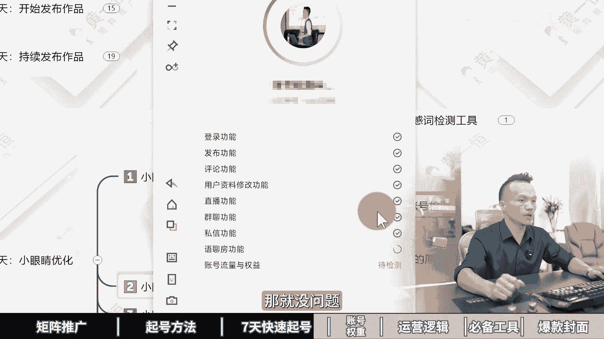

如果这里面显示的账号有什么违规的话，那就需要去重点的做优化了，那么把那些违规的作品全部删除掉，另外你可以尝试着发布一条随手拍，也就是用手机啊，拍一个你觉得比较有看点的生活记录，发上去看看，测试一下。

如果这条作品流量达到了500~1000，代表你这个账号是正常的，只不过你其他的作品里面会有这个敏感词，那么第二个小眼睛如果是小于等于500，什么情况呢，主要是作品的标签不精准，那么系统推送的人群啊。

不感兴趣，解决方案就是什么，我们需要搜索行业关键词，找那种低粉爆涨的同行模仿，并且连续发布3~7天的垂直作品，为账号打上这个什么精准的标签，那如果小眼睛是3000~5000的话，一般是作品没有看点。

流量来得不到突破，无法吸引更多用户来进行观看，解决方案就是什么黄金三秒抓住眼球，利用热门话题深刻度学做标题党，封面党用标题方面来什么吸引用户来点击，增加点击率，获得更高的吹牛，同时他要坚持不断开。

如果小眼睛是1万到3万的话，好这种作品他是有这个小火的潜质的啊，就是基本上已经马上就要小火了，我们可以持续的输出复制3~5个同款作品，这个什么意思啊，就相当于我们把这个选题拿过来。

做成3~5份发布到你的账号里面，并且带上同款的话题，你会发现这3~5个里面，就会有一个流量能够突破1万到3万，那如果小眼金15万到8万的话，也就是账号的粉丝群体，看同一种风格太多了，审美有点疲劳了。

就大家都已经看腻了，毕竟这种平台都是喜新厌旧的，那解决方案就是趁热榜啊，找那种大火的话题，就是为什么有的话题能够达到5100万点赞，就是因为他的话题确实比较热，我们需要输出耳目一新的话题。

哎希腊这个新粉好，这些我们就可以对账号优化，那如果咱们想去玩好小红书啊，其实最好的办法呢还是能够做这个集登账号，一上来就做十个账号，用概率来换取成功率，对抗平台的不确定因素。

十个账号一个账号一天加十个人，十个账号一天呀，互个100家也没什么太大问题，因为咱们这些视频呢没办法做太长太长，大家也没耐心看完，最主要的是咱们这个视频做太长的话，流量比较小。

所以呢我给大家单独的准备了，小红书的入门运营干货框架，里面给大家分享小红书的收录机制，运营工具，旗号投放，还有KY的投放，同时他还给大家准备了这个小红书的爆款，选题表格，帮助大家去筛选，收藏比，评论比。

分享比比较高的笔记出来，还给大家单独准备了小红书的系统，与游客有接近三个小时，里面有分享到小红书的全流程，一要怎么设计导流方法以及常见问题，如果想变现，还有一些变现项目分享给大家。

这些呢大家都可以通过来找我，我把它前导资料分享给大家，第四章小红书账号群众，你的笔记违规，账号限流，甚至封禁流量只有几百上千，怎么都起不来，我的账号被禁言，30天后，流量严重下滑，一个字惨，两个字好惨。

三个字惨惨惨，但我用了这三个方法，让我的一条笔记流量直接突破百万，一起来看我给你分享，做小红书遇到低前中账号会出现什么问题，如何去拉高我们账号的权重，如何获得更大的推流权重。

先来看第一个低权重账号所出现的问题，最直接的体现就是我们发笔记，流量基本上不会卖，比如说现在你做了一篇笔记，发布完之后，间隔了三天，整体流量就那么几十个，而且呢特别容易违规。

有时候啊经常出现说这个内容违规，你的同行嘞又可以用，或者说是改个质量有违规，甚至有的时候啊账号直接违规，禁言30天，严重者直接放弃，有的伙伴呢去发评论，不管发什么评论，甚至有的时候发一个表情都被吞掉。

发私信来，对方也收不到，也被吞掉，而你的同行每天都在搞，你会发现同行那没有问题，而自己发团子内容就会被打压，这个到底什么原因，就是我们的账号权重太低了，那怎么去拉高我们账的权重。

这里面给大家分享几个方法，第一个方法就是我们的账号在获取，在注册的时候啊，就得是那种高权重的社交号，如果你是机器号，比如说有的伙伴用这个虚拟号注册，1716的号码进行注册，手机配置的又非常低。

而且还用了什么多开软件，手机还有封号记录或者IP被关联了，没有通讯录，也没有回录，这种账号你拿去发肯定是提前中的，而什么账号流量比较大呢，有的伙伴把自己的小红书账号拿过来，随便发一个生活点滴。

随便发一个随手拍，发现流量唉都非常不错，甚至破千，到底什么原因，来看一下社交号，就是我们的账号，在注册的时候，用的是13151819号站注册的，而且手机的配置非常高，比如说伙伴他用的是几千块的手机。

重点是我们在使用小红书的时候，更像是一个真实的账号IP，下面呢也没有过多记录，也没有出现什么封号记录之类的好，这时候如果你满足了这个条件，你的账号就不会太差，同时呢我们自己的小红书账号。

每天还保持着活跃度，做一个正常社交号，比如说每天浏览30分钟，点赞，收藏一些作品，评论一下，关注一些博主啊，更像是一个真实的用户，好这些如果你都做好了，流量还不是很高。

那教大家一个小红书上面很狗的玩法啊，这个很少有人知道啊，但是呢在熊书里面一直存在叫做摸摸铁，来提高战螂的权重，那什么是摸摸贴呢，这个伙伴可能完全不知道，刚开始我也不清楚啊，后面我去搜索了一下。

才知道原来摸摸是这个意思，好咱们可以搜索一下摸摸，收拾完之后你会发现这些摸摸啊，他们基本上都是哎数据反馈来，整体什么哎都是比较不错的，你看到，那么为啥小红书中国人还都叫摸摸。

然后嘞啊请问小红书到底有多少个馍馍，第一次做摸摸需要注意什么啊，已婚但是过得不快乐啊，纳闷两天了啊，终于知道摸摸是怎么回事了，所以大家可以搜索一下，就知道到底什么是摸摸了，发摸摸帖有个好处啊。

涨粉你会发现原来这么的简单，账号来迅速的会提高这个活跃度，因为有大量的人来关注你，重点是什么，你会发现莫名其妙的，你就能够吸引到大量活跃账号，他们来关注，你说摸摸贴有什么特点，因为摸摸的人群啊。

他是那种吸引讨厌被关注的社恐网友，比如现在我是个某某人群，你千万不要关注我，关注我太难受了，我就喜欢在互联网里面当一个小透明，就是我存在，但是呢我是透明的，这时候就会产生反向心理，越不让我关注，我。

越要给你关注哎，让你不社恐哎，就这个意思，这就是摸摸贴，所以大家如果账号权重比较低，可以发几个某某帖来拉高你的这个账号权重，除了账号权重，我们还需要拉高推流权重，你发布完笔记之后。

流量是一百五百两千五千八千，就完全取决于我们的推流前重，那么推流前重型号高，首先得过观察期，那什么是观察期，对于一个新注册的账号，系统不确定这个用户的质量怎么样，他会给你限制流量。

本来你发布完之后可能是2000流量，限制完之后呢，只有200个流量，常见的现象就是新账号发布内容时流量很低，甚至根本就没有流量，因为系统它会监测，它会识别风险，避免违规内容，敏感行业。

如果你发布了违规内容，就会导致账号违规被限制，严重的呢直接账号就封禁了，那操作建议是初期发布内容需要脱敏，避免因为敏感内容导致违规，在操作的时候尽量发布一些利他性的干货内容，帮助账号快速的度过观察期。

有的一个星期，有的两个星期，慢的在一个月也能度过咱们的什么观察期，接下来看一下账号的基础推流机，主推流它是由最近30天的互动数据决定的，比如说什么点赞评论啊，收藏转发关注之类的。

如果你最近的互动数据非常好，推理数据非常高，你发布完之后，你发布的笔记流量可能就是两三千，如果你整体的数据都非常差，比如说伙伴整体数据啊就只有两三百，你发布的笔记怎么可能达到两三千呢。

所以咱们在做的时候，账号的权重它会直接决定我们的初始流量，这也是为什么有的账号流量只有50个，有的账号100个，有的账号300个，有的账号来能够达到1000的流量，那如何拉高我们账号的基础权重。

让我们获得一发布笔记就是1000，2000甚至3000的小眼金，这里面呢有一个方法叫做先犯后垂，外浅内深，什么意思好，先来看一下，先犯外浅，就是前期咱们发布笔记的时候不要太垂直。

尽量的可以发一些泛垂直的内容，受众范围非常重要，受众越广，流量自然就越大，能够吸引更多的什么潜在用户，那么后垂和内伸呢是转换目标客户，因为如果你前部发这个呃，泛锤子的流量虽然非常大。

但是吸引过来的人呢很难成交，很难转换，很难卖货，所以咱们还是要发布一些相对来说，垂直和比较深的内容，吸引目标客户，能够获得更多的什么精准流量，今天咱们在落地的时候啊，可以配合一个策略。

浅的话是为了触达我们的潜在用户，做旅游赛道的触达详细的顾客，我们就可以发一些关于西藏的西藏美食攻略，西藏拍照技巧，西藏有哪些地方好玩，反正就发各种各样西藏旅游的，那么这种就属于什么流量好的宽口内容。

发完之后的流量基本上啊租个几万没什么问题，但是在资金流量它转换率比较低，所以咱们在发的时候发九个浅的内容，九个流量好的宽口内容，我们要发一个深的，用来转换目标客户。

比如说我们可以发一个国庆定制胡杨林小报团，高奢纯玩绝美好，这一个呢就是用来转换目标客户的，它只能够转换已经决定想去的客户，无法触到那些想要去的，因为想要去的他对这个内容呢根本不感兴趣。

这种就是转好的窄考内容，两种内容可以配合在一起，先犯后垂，外浅内深，这个打法呢还是比较不错的，好了，各位同学提高了账号权重啊，如果想快速的把小红书做起来，其实还有一个好的办法，就是做小红书矩阵。

用概率来换取成功率，通过举证来对抗平台的不确定因素，比如说一个人搞十个账号，多多少少肯定有个三五个账号能做起来，如果你一个账号一天加个十个20个人，那么合计在一起，一天就能够搞到100多个顾客。

那具体怎么做举证，这里面我给大家准备了详细的资料，比如说我们小红书的入门营干货框架，里面有小红书的内容收录机制，运营工具，企业号的运营Q量投放，还有这个店铺的运营，最重要的是。

还给大家准备了小红书的爆款选题表格，让大家在做笔记的时候啊，都学会开卷考试，都学会观察数据，都学会让你的每条笔记，都建立在别人的数据基础指标之上，这里面呢挑选一些收藏品，评论比。

分享比比较高的笔记优先来进行操作，哎比如说这个笔记，他的这个收藏比达到147%，100个人点赞，会有147个人收藏这种笔记呢，很容易二次货，那怎么做这个选题表格，很多伴不会，那我给你准备好了。

还有我们三个小时的小红书系统引流课，里面讲到小红书的全流程医药设计，导流方法，还有常见问题以及边缘项目，这些通通都给大家打包好了，可以来找我，我把它分享给大家，第五章小红书运营底层逻辑。

只有不到1%的人，搞懂了小红书的推流机制，起号眼里起号方法认人赢。

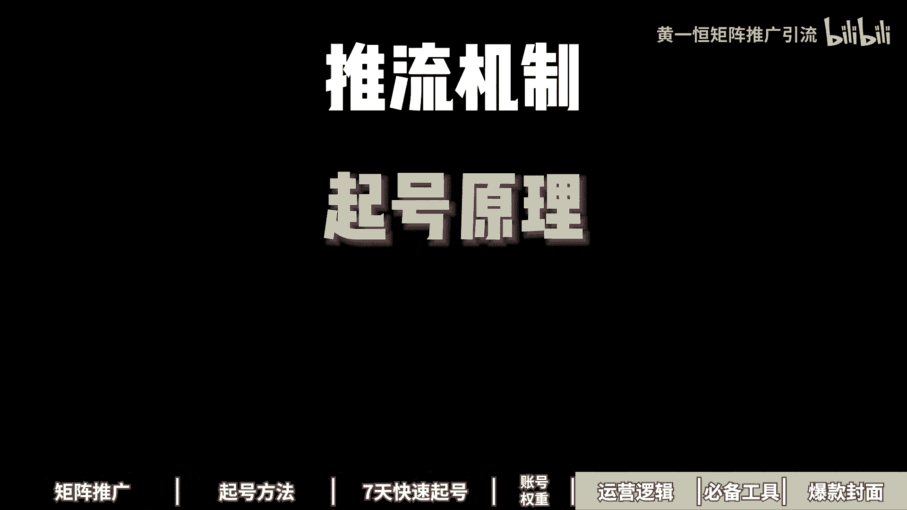

我注册了几十个账号，发了上千篇笔记，测试总结了这十几分钟的视频，nice虽然有点长，但讲的很透，先卖个关子哈，能把这条视频看懂的人压根就不缺什么流量，一起来看，我给你分享小红书的推流机制，7号原理。

旗号方法，内容运营到底该如何来做，首先来看小红书推流机制，小红书是一个点击为王，互动为后的平台，点击率直接决定我们观看量的下限，比如说你发布笔记流量是两百五百一千，两千三千五千，主要就取决于点击率。

而点击率呢最主要是由什么封面决定的，说玩偶方面，小红书流量根本就不差，点击，你低的时候连鼠标广告都没有办法正常进行，而互动量决定我们观看量的上限，这里面呢比如说你发布完笔记之后，刚开始是一两千的流量。

后面能不能突破5万10万，就取决于小红书的用户反馈算法，我们也称之为叫做cs分点赞一分收藏，两分评论，四分转发四分关注来八分，接下来小红书就需要打标签，发布内容之后啊，标签分为大标签。

大标签呢大概有30多个，随时在更新，我们打开首页，点击小三角，这里面就有很多的标签，这些标签啊都是流量比较大的，每个标签下面又分支为系的标签，就比如说现在我们点录音露营里面呢，它又分为很多小的标签。

比如说什么露营装备，露营地，还有呢露营搭子，露营经验，这些就是小标签，接下来看一下内容的分发机制，首先小红书他会根据性器标签来进行分发，比如你近期的这个点击行为，互动行为，搜索行为都会决定你刷的内容。

所以咱们如果打开这个首页，在首页这里面刷到内容，这些内容就是你最近的一个什么兴趣爱好，还可以这么理解，然后嘞小红书有一个重定向机制，哎这一个非常重要内容，它会优先推送给跟你产生互动过的用户。

比如说有给你的笔记点过赞的，收藏过的，评论过的，关注过的，他会优先看到唉，这就是重定向机制，其次啊，还有一个初次的分发曝光量，那么这个初次的分发曝光率呢，它是由流量层级来决定的。

是由最近30天的观看以及互动数据决定，如果你整个账号最近30天流量拉的比较高，你发布完之后，基本上你的流量都是两三千，如果你最近30天整体流量都没超过500，那你想破500的难度也是比较大的。

而流量的这个成绩啊，它主要影响的话就是同样的内容，它不同的流量成绩呢也会获得不同的曝光量，比如说有的账号发版之后150，有的账号是500，就是因为A账号他的流量成绩太低了，比账号流量成绩呢稍微高一些。

甚至有的一发布完之后，就可以获得一两千的流量，来看一下小红书的流量池推荐机制，首先小红书有一个千次曝光得分，那么这个千次曝光得分是个什么东西呢，它是由CES得分除以曝光量，再乘以1000计算出来的。

那么CES前面讲过了，点赞收藏评论转发这些数据，那么当你的这个签字曝光得分比较高的时候，他就会进入到流量池里面，小红书共有八个流量池，当我们的签字曝光得分比较高的时候，就会进入到下一个流量池。

比如说最开始的初始流量池，大概只有200个流量左右，然后呢如果它的数据反馈比较高，就会进入到基础流量池200到500，然后嘞再进入到三级流量池，500到5000万，有辆车5000到2万潜力。

有辆车2万到20万，热门流量池基本上就已经达到了这个，20万到500万，这种已经是上了大热门的，那爆款的话就是这种500万到1000多万，前站流量池，基本上就是小红书大部分的活跃用户。

最近的都能刷到的笔记，这种已经能够达到1200万到3000万之间了，这些呢都是由我们的千次曝光得分决定的，签字曝光得分越高，就能够进入到更大的流量池里面，那得分不足的时候呢，通常就会卡在200。

没有办法进行扩散，这时候咱们就要返回来去优化一下，看看我们到底是卡在什么地方，好，来看第二个小红书的乔眼里，小红书啊一共有三个阶段，最开始当我们注册一个新账号，会进入到观察期，那什么是观察期。

你可以这么理解，新账号注册之后，系统不确定你的质量，它会限制流量，通常表现为新账号发布的时候流量很低，或者根本没流量，正常这个账号你去发可能会有2000流量，结果他只给了你200个流量。

这就是系统的一个观察，它会识别风险，避免来违规内容，所以咱们在操作的时候，如果是敏感行业用户发布了违规内容，就会导致账号被限制，严重者呢直接放进那操作的建议啊，大家在做的时候，前期啊内容需要脱敏。

避免是营销敏感内容，尽量发一些利他性的干货内容，帮助账号快速的度过这个观察期好，第二个阶段识别期，当过了观察期之后，有的快的一个星期，慢的一个月，接下来会进行识别，什么是识别器。

也就是说系统会识别你的内容，到底是跟哪些标签相关，推荐给那些相关的人，所以内容好与不好，他是其决推给什么人，比如说你喜欢露营，把露营的内容推给你，这就是好内容，如果推给你的对象，推给你老婆。

他对这个完全不感兴趣，这个内容啊就是差的内容，所以呢我们要过识别器，最简单的办法就是发用户经常搜索的什么内容，帮助用户来快速的过识别，比如说现在如果我是做这个净水器的，那我在发任务的时候。

我就尽量发这些搜索下拉框里面推荐的选题，这种选题更快的，能够帮助我们的账号来过这个识别器，那咱们在操作的时候，他有两种标签，一种呢是内容标签，也就是我们发布之后这条笔记所对应的内容。

第二个呢是用户的一个反馈标签，比如说用户看完你的笔记之后，它会产生这个互动数据，比如点赞评论收藏，这时候又会产生用户的反馈标签，系统认定内容匹配度越高，那么就决定我们的这个推送力度呢自然就越大。

如果你的内容打上了这个，比如说露营装备，刚好这个人对露营装备感兴趣，标签完全匹配，流量就会进入到下一个流量池里面，用操作方向来，就是专门做搜索流量，帮助账号快速的度过这个什么识别期好，第三个才是入池签。

那什么是入池切，内容发布完之后，前几天流量比较低，可能就只有两三百三五百，隔了一个星期之后，隔了三五天之后，流量突然就变成了三千五千，一直在不断增加内容，就代表已经进入到了流量池里面，流量突然就增加。

那怎么加速进入流量池呢，有一个办法就投薯条，那偷薯条有个好处，它是可以强制触发人工审核，快速度过观察期，那么操作步骤啊，就是我们分为两次投放，第一次来咱们就投这个点赞收藏，拉高cs分。

第二次投放的目的是为了啊，增加我们的浏览量或者播放量，24小时你就调整一下，那么投放次数来两次就可以了，没必要投太多，投鼠刀的主要意义就在于什么，就在于强制过程加速过关，打切，提高初始流量。

快速的拉高流量增长，帮助我们的账号打上标签，帮助内容打上标签，匹配给那些更加精准的人群，好来看一下第三个，小红书的起号方法有两个，第一个是搜索起号法，是目前行业里面做起来最简单的。

核心的目的就是让系统识别你是做什么的，推送给那些相关人群，快速的获得用户的反馈标签，并且我们搜索完之后，比如说现在啊我去做一个净水器怎么选，因为这个关键词需求非常明确，用户看完之后反馈也是非常明确的。

很容易帮助我们账号来打上这个标签，所以咱们利用搜索流量小红书啊，他的搜索流量占比，可以说是达到了30%以上，有60%的人打开小红书，首先第一时间就会进行搜索来解决问题，因为他是带着问题来的，操作步骤呢。

就是我们直接在你的赛道里面搜索关键词，把这些下拉词全部整理下来，就发布这些选题相关的就可以快速的起号，那这里面呢有几个注意细节，大家一定要注意啊，首先在做笔记的时候，尽量优先选择收藏数大于点赞数的。

更加容易卡关键的排名，那么如果你是是去超爆款洗稿内容呢，一定要替换30%，避免被判搬运，标题呢一定要包含关键词，标题的权重是大于内容，大于标签，大于话题的封面呢尽量照抄点击已经验证啊。

谁抄谁报视频笔记的话，要复制文字放到笔记内容里面，方便系统识别内容呢不要带营销广告，避免里头薯条都省了，不过还来看第二个方法叫做骗评论巧法，这个方法，它其实是利用评论来拉高我们这样的得分。

因为评论在cs里面他是给到四分的，四分相当于一条评论顶得上四个人点赞，顶得上两个人，收藏评论分呢是获取流量最快的一个方法，那我们就可以什么，利用用户来提高我们这样的频率。

这里面有个最简单的办法叫做极限二选一，就让用户看了之后做选择题，A和B选一个，一和二选一个，你和我选一个，那自己不会做的，没关系，咱们直接打开小红书，搜索关键词极限二选，你看看一下啊，这里面有房间问题。

衣服沙发项链，每个赛道都可以玩啊，太多了，你看听说感情越好的两个人口味相近，极限二选一，然后呢，你再往下方来看，极限二选一，测锁地板砖到底选哪一个，点进来一看，你会发现有1700个人进行评论。

这1700个人已经顶得上，六七千个人进行什么点赞了，好再往下我们环你会发现各种各样的都可以，有这个什么啊，每个赛道都在玩汽车赛道的二选一，然后呢手镯赛道的二选一，你看你打开看一下这个赛道。

那么1000多个点赞二选一，很多人都在晒自己的，所以直接套用就可以了，还有一道简答题，直接问对方就可以了，说出你最喜欢的层次，说出你最喜欢的歌，说出你家里面装的净水器，说出你家里面啊。

那么最不好的一个电器，你看这些都是什么简答题，核心点就在于什么，降低用户的成本，让用户来直接就参与评论，不需要思考，不需要动脑筋，直接答案已经给他预制好了，就像我们做一个投票一样的。

直接投票也就什么搞定的好，来看第四个小红书的内容引，在运营小红书的时候啊，我们可以分为流量型内容，流量型的就是流量特别好啊，转换率还比较低，它属于宽口内容，比如说现在我们做装修的，我们在发布的时候呢。

就可以选择那种，比如说2024年最流行的装修风格，这种选题啊，它的范围特别特别广，无论房子大小还是装修装状态，用户基本上都会感兴趣，接下来我们就可以发布这个什么营销型内容。

那么营销型内容就是转化率特别高，但是呢流量稍微小一点，称之为叫做窄口内容，比如说还是做装修，那咱们在发的时候，大面积擦机房怎么装修这种呢，就是目标群体已经限定了，只针对大户型，不是大户型，他就不会来看。

咱们就吸引大户型，专门针对大户型来提供这个什么装修的一个啊，风格好，来看一下内容策略，咱们在做的时候两者配合，那么流量型内容来搞流量，增加曝光，拉高障碍的基础权重，营销行动来做转换成交订单。

具体在做的时候，他是为了触达潜在的用户，也就是触达想要气的用户，就比如现在我们做旅游，做这个西藏旅游的，那我在发笔记的时候，我就可以发这个西藏美食攻略，西藏拍照知识教学。

因为这些只要是对西藏对流有感兴趣的，大部分都会看，但是呢他的意向度是比较低的啊，能够获得很大流量，接下来深的话就是转换目标客户，我们可以发一些国庆定制胡杨林小报团，高奢纯玩绝美。

而这种笔记就是只能够转化那些，已经决定汽车客户无法触达那些想要去的啊，详细的来他只会看这种，那么当这个阶段过了之后，他才会跳到第二阶段里面，咱们两者配合，酒浅是为了获得很大的曝光，一生的话是为了什么。

获取目标客户进行转换，好来看一下策略的应用。

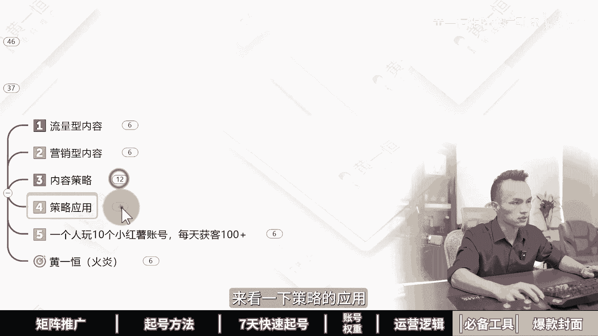

前台是流量，内容引流值钱不深啊，有流量没有成交，所有的伙伴是越做越犯，犯着犯着嘞，跟自己行业完全不相关了，这就是错误的打法啊，深的话就是营销内容进行转换，值钱不深呢就会出现只能依赖已有的顾客。

没有办法获取到新的客户，好了，各位同学，这就是小红书整个的底层逻辑，如果咱们想更快的去玩好小红书，其实还有一个比较凶猛的打法，就是做小红书的集成账号，一个人做十个号，用概率来换取成功率。

用账号来对抗平台的不确定因素，而且十个账号一个账号一天搞十个顾客，十个账号一天就能够搞100个顾客，这些嘞我都给大家准备好了资料，首先有我们小红书的入门硬干货框架，帮助大家了解小红书的收录机制。

运营功绩啊，企业号的运营以及KOY的投放，还有小红书的爆款选题表格，咱们在做选题的时候啊，千万不要盲人摸象，一定要学会开卷考试，学会用工具挑选这种收藏，比评论比分享比比较高的，优先进行操作。

这种才更加容易爆，比如这里面可以看到145的收藏品，100个人点赞会有145个收藏，这种就是收藏大于点赞的，而且咱们不是挑一个做一个，而是从十个里面挑一个挑两个来进行什么制作，更加容易爆。

还给大家准备了小红书三个小时的系统引流客，有小红书的前流程，钩子设计导流方法，常见问题以及变现项目，这些通通都已经打包好了，可以找我，我来分享给大家，第六章，五款小红书运营必备工具。

这五个变态神器打死都不能删除。

我们公司现在实习生，我叫他去做小红书笔记，他一天做了50篇，而且都是高质量的牛逼，后面一看才发现原来是用的这五款小红书工具。

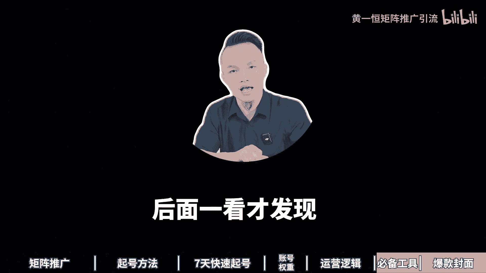

一起来看，我给你分享我们每天都在使用的图文解析工具，AI改写工具，敏感词检测工具，图文排版工具以及素材图标工具，现在看第一个图文解析工具，当我们在抄爆款的时候，很多内容如果靠纯手打会非常的慢，那怎么办。

我们可以通过图文解析工具，直接获取高清无水印的图片，然后嘞就能够直接复制上面小幅度的内容，然后粘贴到自己的排版软件里面，具体来给大家演示一下，我们打开投屏软件，这里面比如说像这一篇笔记，它的内容非常多。

咱们靠手打走字比较慢，那怎么办，我们点击右上角的分享按钮，然后来获取一下这个链接，点击复制链接，复制完之后，我们打开这个图文解析的工具里面，把这个粘贴进来，然后点击立刻解析，这时候稍微等待几秒钟。

我们就获得了真实的图片地址，双击打开，你会发现这个图片清晰度直接拉满，而且没有任何的水印，重点是我们能够直接选中上面的文字，你看进行复制，也可以，也可以选中里面的某一段。

所以咱们如果需要复制上面文案的时候，点击复制，然后呢我们给它连接下来，是不是我们的操作效益立马就提高了好几倍，那么这个工具呢，一定要配合最新版的这个微信来进行使用啊，那么才可以实现这个OCR的识别。

而且识别下的准确度的话非常高，重点是完全免费的啊，不需要单独花钱，好来看，第二个叫做AI改写工具，当我们在做这个图案的时候啊，如果全部都靠我们这严重，说实话太慢了，一天只能做三五篇笔记，如果你想做十篇。

20篇，50篇，那怎么办，我们就要用到批量生成笔记的工具，想怎么做呢，我们是先通过这种在线作图的平台，做我们的框架模板，比如说哎像这一个笔记，咱们做好模板之后，那这里面的内容。

我们是可以对它进行一个替换的，怎么替换呢，我们通过AI去填充里面内容，比如说改一下标题，改一下文案，改一下内容，重新保存一下，就获得了一篇新的笔记，所以咱们不用动脑，用AI，它可以进行无限次的改写。

这里面我们用到了一个私流AI，我给大家来演示一下啊，用的功能叫做小红书重写功能，比如说我们打开这个AI平台，打开之后啊，找到这个AI创作，在AI创作里面选择上这个小红书，然后点击小红书重写。

我们把刚才识别好的文案粘贴进来，比如这一段文案我们可以生成N多个版本，我们只要点击立刻生成，它就可以生成很多版本出来，那现在我们是一个窗口啊，如果我们把它复制多个窗口出来，比如说这是一个窗口。

我们又把这个文案给他什么，粘贴到我们的这个新窗口里面，它又可以对这个文案进行改写，可以看一下啊，现在AI正在对它进行改写，改写出来之后呢，意识不变，然后文字发生了变化啊，你可以对比一下。

比如说咱们的净水器一般分为超滤净水器，好净水器成分为四种类型，你看他还帮我们加入了这个emoji表情，并且这里面的你看啊，滤芯为pp棉活性炭，那么其逆行采用pp棉活性炭等材料，你会发现它个别值发生变化。

这种系统就会判定为什么你是原创的，而且我们可以复制多个窗口同时进行改写，比如你复制十个窗口粘贴十次，点击十个按钮就可以什么生成十个版本，所以咱们在做的时候，你要多少笔记。

通过AI就可以什么做多少笔记出来速度非常快，就连我们这个标题都可以改，比如说净水器选购不纠结好，你放进来之后，这个标题我们也可以改成其他的，比如说我们稍微等待一下啊。

我们可以复制到两个窗口里面同时改写啊，这样的话，我们就可以获得什么不同的两个版本出来啊，比如说净水器显个不纠结，净显个净水器不用愁了，或者换成什么，或者换成轻松选购净水器，不再纠结。

他又帮你把关键词替换了，变成不一样的好，接下来看一下第三个叫做敏感词检测工具，咱们在发小红书的时候，很多伙伴发上去之后啊，流量都只有十个，20个30个没有破百，结果发了很多条都是这样的。

最后呢账号违规了，重则来直接封号，那常见的四种敏感词有哪些，首先是我们的标题里面放的敏感词，比如说违反了这个新广告法，或者加了一些医疗词，或者加了一些比较敏感的词，或者文案里面有敏感词。

还得是笔记内容里面敏感词，或者加了什么新广告法的敏感词，像什么第一呀，最好呀，或者说是啊比较夸张的词，这些词都会导致你限流了，怎么办，我们要做之前，可以通过敏感词检测工具先过一遍啊。

比如说这里面我打开这个敏感词检测工具，打开完之后啊，我就复制了一篇医疗行业的这个文案，复制进来之后，我们勾选，你看他有这个医疗行业，化妆品行业，房地产行业放进来之后，它就提示国家两个字是比较敏感的。

那么敏感红肿也比较敏感，这两个词我们就需要给它删除掉，如果你不删除掉的话，你去发肯定是很容易什么啊，被限流的这个点呢咱们需要注意啊，这个工具呢也是免费的啊，直接就可以使用好，来看一下。

第四个叫做图文排版工具，咱们在做小红书的时候，到底我们的这些笔记都通过什么工具做出来的，记住这个图文排版工具，它可以做任何类的，只要是排版类的，除了实拍类的，然后得单独去牌，只要是排版类的。

我们都可以通过这个平台来进行制作，而且来这个平台重点可以免费用，没有水印不过来，你得有两个技巧，第一个不要使用他的模板，也不要使用VIP的素材，我给大家演示一下，咱们打开这个平台。

打开之后来我们点击这个创建设计，可以看到我的账号也是一个免费的啊，也是没有开通的，我们点创建设计，然后找到这个叫做小红书配图，在这里面就可以去制作了，它的功能特别的强大，里面的什么皇冠图标的。

像这些什么，包括字体啊，只要是带皇冠图标的，你不用用了之后就得开会员，不用的话就可以免费，一直在什么进行一个使用啊，像我们的这些模板给大家看一下，我们做了几百上千篇笔记，全部都是用这个工具来做的。

而且没有开任何的慧眼。

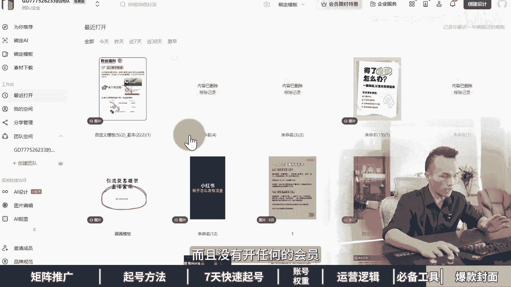

就是白嫖免费，那就可以对他怎么进行使用啊，非常好用，好接下来看一下第五个叫做素材图标工具，那么当我们在做这个图文的时候，你会发现在图文里面纯文字类的人会比较枯燥，所以会有很多的他们在里面加了这个嘛。

加了这个图标，加图标之后呢，会让我们的这个图文呀看起来更加的轻松，所以素材图标，包括你看我这个思维导图里面，那么用了这些图标，我都是用这个平台上面去找的，首先它可以帮助我们升级为图文并貌笔记，更加高级。

更加直观，更加生动，重点是这个平台你知道它有多少图标，它有2800万的图标库，第一个免费使用，第二个下着下都是透明背景的，第三个可以自定义颜色，重点是什么，多种格式支持，有什么AI格式，PNG格式。

还有一些编程用到的，这个什么SVG格式和代码都可以下载，我来给大家演示一下，比如说咱们打开这个平台，在平台的搜索框里面，你看有2872万的图标，我们搜索关键词叫做净水器。

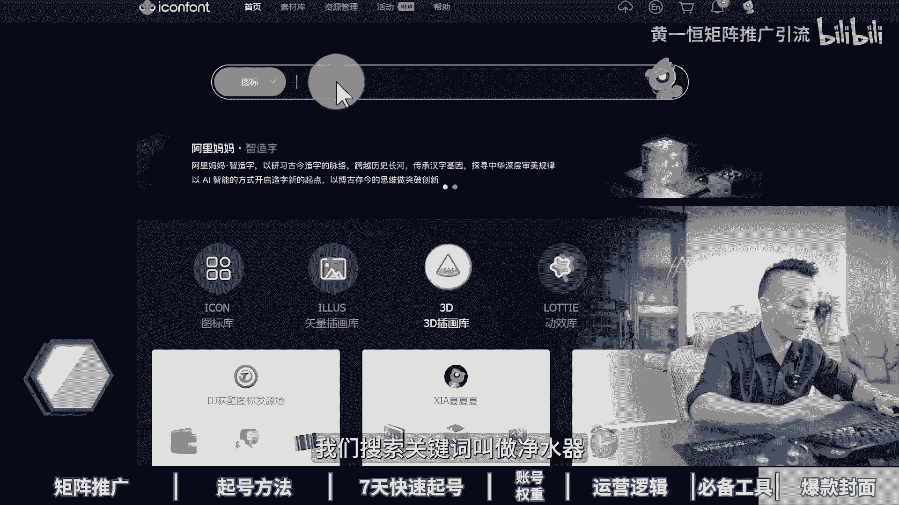

我们来搜索试一下，看能不能找到净水器相关的图标，那么搜索完成之后，净水器一共有113个图标，那么这些图标呢，比如说我们觉得哪一个好，我们点击这个下载按钮就可以下载，而且它可以改颜色，可以改红色。

可以改绿色，可以改蓝色啊，可以改其他颜色都可以的，那么任何赛道都可以下，而且图标真的是特别特别的多啊。

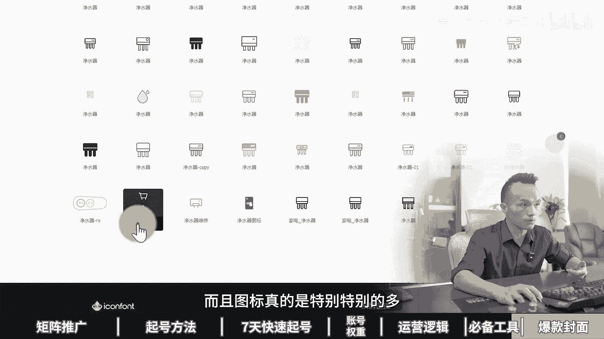

多到根本就什么用不完用不完好了，各伙伴，那这些平台所有工具啊，我都打包好了，因为有些平台网址啊暂时可能会比较敏感，会违规，所以没办法给大家直接分享，那么大家如果需要的话啊，我在这里都给他准备好，你找我。

我直接一次性打包给你，这些工具都不用花钱，都可以免费的进行使用，那么有的工具它只是帮助我们提高效益，如果咱们想玩好小红书，每天能够搞个100个顾客的话，最好是能够打几针，比如说十个几证号。

一个号一天加十个人，十个账号就能够一天加100个人，这些呢我给大家准备了系统化的资料，比如说小红书的应用入门硬干货框架，跟你分享小红书的收录机制，运营工具，企业号的运营，KY的投放，还有店铺的管理。

重点是还给大家准备了这个小红书的爆款，选题表格，当我们在做小红书的时候啊，那么我们的笔记肯定不能随心而发，这种等于什么盲人摸象，我们要学会开卷考试，用好工具啊，整理很多收藏比评论比分享比比较高的。

比如说这一篇笔记，它的收藏比达到147%，相当于100个人点赞，会有147个人收藏，那这些数据很多伙伴不会做怎么办，不会做没关系，你找我，我把这些资料统统打包分享给大家。

而且还有小红书的三个小时的系统课，会讲到小红书的全流程，钩子设计，导流方法，常见问题及编辑项目，这些来都打包好了，记得找我，咱们做一下资源共享，毕竟这是互联网里面什么最大的一个优势。

第七章小红书八种爆款蜂蜜模版，怎样靠一张封面图去撬动10万阅读量。

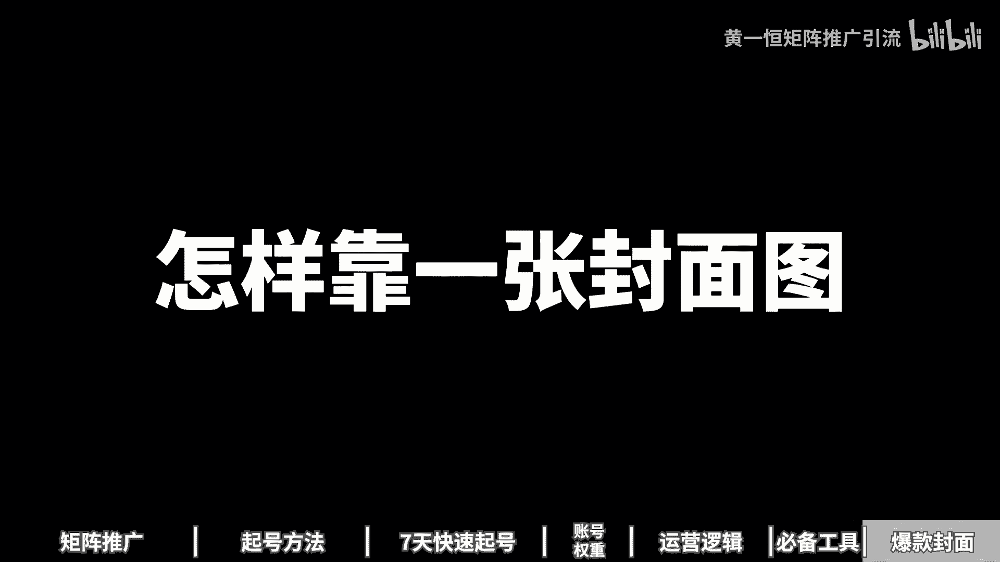

我看谁SK不懂记抄作业党，做小红书不用动脑。

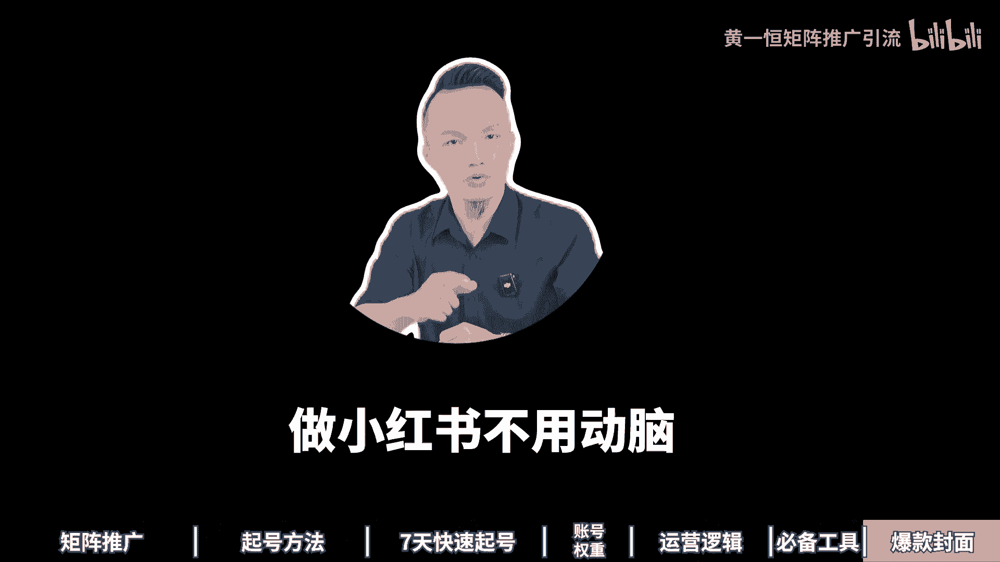

不用连充方面，只需要操作八种爆款封面模板，就能快速拉高你的流量下限，从原来的几百流量变成几万流量，一起来看，会跟你分享钩子方面，留白方面，对比方面，数字方面，深色方面，破坏方面。

飞机方面合击方面到底该如何来做，先来看第一个钩子方面就是在封面上下钩子，比如说我们做情绪化的钩子，通过笔记给用户带来情绪价值，在小红书上面，封面情绪化是出报文笔记的必要条件，让用户看完之后很高兴。

很生气，很同情，很悲哀，这些都是什么情绪化的封面，比如说我们在标题上面，加上一些情绪化的关键词，气死我了，就是非常生气，因为当我们看到别人很生气的时候，我们就会非常好奇到底是为什么生气，你可以看到啊。

这里面就会有啊，气死我了，流量分配的乱象好了，这里面有很多很多类似的，然后呢你也可以在里面搜，比如说我真的服了，也就是看到之后是被这东西什么折服了，然后呢无语了，好，你可以搜索一下，比如说我真的服了。

留下这个健身房，你搜索完之后，你看到这里面有很多很多的赛道，哎，他们就在套用这个模板，给用户带来这个什么情绪价值，还有什么谁懂啊，家人们为什么会出现这种情况，那么第二种呢是恐吓式的封面。

利用用户的逆反心理，看到这来反而会引起关注啊，比如说千万不要直接发脾气，千万不要给孩子看什么，千万不要孩子吃什么啊，就是下用户，下周他发现我千万不能到底什么东西哎，他就会产生逆反心理，反过来就去看。

比如千万不要晚上啊看电影，千万不要用这种材料装修，或者说是净水器，千万不要买这种净水器，就是恐吓这个方面好，再来看一下疑问式的方面，那么爆款方面的核心就在于什么，就是制造悬念，提出问题引发用户的兴趣。

然后来让用户啊吸引过来进行点击啊，比如说咱们做一些疑问式的1000块钱怎么创业，或者100块钱怎么创业，让用户觉得100块钱怎么可能，辞职后做100种工作是种什么体验，哎这些都是什么，带着问题在里面。

让用户来对这个问题产生好奇心，好这些钩子的话基底其实有很多种打法，这里面我给大家准备了八种类型的钩子，有什么好奇类，介势类，通点类，极限类，恐吓类，反差类，逆输中类以及同理心类的这些呢。

我统统都给大家准备好了，我们来打开看一下啊，比如这里面有好奇类的，利用观众好奇，得不到没体验过的失误来激发好奇心，还有借势类的，名人自带的流量和热点扯上关系啊，就能蹭到流量，那么还有这个通点类的。

通点不解决就会难受，戳的液晶准，那没有细腻，还有极限类的，将抽象的那种具体化信念强，让观众呢能够重视好，这个呢非常多，我就不详细给大家看了，大家可以找我，我把它分享给大家，咱们做一下这个自然共享。

少走弯路，好来看第二个叫做留白封面，什么是牛掰牛掰，我是这样理解的，这个牛掰啊，其实是做广告设计，里面用的非常多的一种设计方法，那么使用纯色填充，一流出大面积的什么空白区域。

我们就称之为叫做什么广告留白，那么广告留白呢，记住它的每增加一倍注目率就能提高四倍，有的伙伴说留白会不会意味着空间浪费，其实并不会啊，留白它能够提高广告的整体效果，增加视觉冲击力。

比如说我们来找一些什么叫做留白类的啊，那在前面我们输这个净水器啊，来看一下这个赛道里面哪些用的是牛排啊。

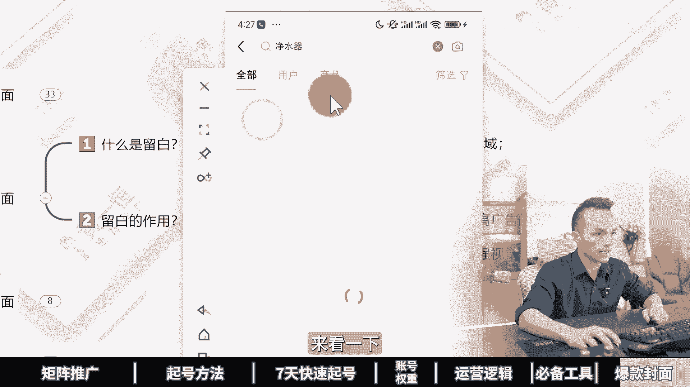

比如像这个笔记，他其实也是个牛排，只不过呢留的不是很多啊，什么叫流量很多的，像这种，你看它它上面和下面都是做的空白的啊，好再往下面来看，我们挑一些留白留的比较夸张一点的，就是有的笔记啊。

他一个大背景拿来上面只放上几个文字，就是为了突出这几个文字的重要性，你看这个啊，每天一个装修小知识，就是用的牛排啊，包括这个也是一样，净水器骂一个骂醒一个算一个，你看这就是前面讲的钩子封面外加留白两种。

用在一起的，那留白这一块呢咱们在用的时候啊，它是可以进行什么，就是说不要使用什么渐变色，也不要使用什么图案填充，尽量的使用这个什么纯色镜填充，比如纯白色哎，或者这个纯比较浅的一个，橙色或者纯黑色都可以。

你看这些都是留白，留白，就是让用户看起来的时候来，直接突出我们的目标主体好，这是第二个，那么第三个叫做对比方面，对比方面啊，其实非常火爆的啊，什么是对比方面，就是强烈的前后反差对比，吸引用户的点击。

将内容呢一分为二，就比如说啊装修前，装修后让用户直接产生一个什么非常大的落差，好，咱们来搜索一下装修前后的对比，那么装修前是这样的，装修后是这样的，然后呢你再往下面来看好，这是装修的一个，你看装修前好。

装修后装修前vs装修后好，这也做对比，还有这个什么房屋改造前啊，房屋改造后这些关键词大家都可以接受啊，你的行业你可以想一下，能不能把前后给他放进来，你看一下啊，这是之前，这是后来，这是前这是后好。

这是前这是后啊，很多很多啊，都是还有什么减肥前后，化妆前后让用户直干的直观的什么，看到这个前后的效果对比好，原来你是这样的，现在这样的就发现原来我也是个美女，差的就是什么，就是多了几斤肉。

把这几斤肉减下来，我们就是美女了啊，那么画中前后也是一样的，咱们也是大比例，只不过呢就差一个什么好的化妆技术了，你可以对比一下化妆前这的哇，化妆后这个气质立马就什么就拿捏了啊，好这是对比方面。

再来看一下数字方面，那么什么是数字方面，记住阿拉伯数字啊，他是直达大脑，就我们看到一个数字之后，它直接条件反射，不需要阅读，不需要思考，而且数字的同时代表量，比如说五个方法，六款工具或者十个什么东西。

它代表很多，而且小红书本来就喜欢这种独的东西，所以数字呢我们就可以用数字来代表，那么大号的数字啊，更加能够吸引用户的目光，比如说八部身材管理纪录片，你看把八这个数字重点加大，就重点强调。

包括我们前面搜索的这个啊，比如我们来看看这个推荐笔记吧，我们把这个关键词给它取消掉啊，然后再返回来好，咱们看一下啊，这里面其实你去找他，也会有很多很多类似的这种，你看你不知道的60个爆款的钩子开头。

你看这就是用的数字啊，让用户看到数字之后就知道哇有60个啊，非常非常的多，唉这种就是什么数字的开仓啊，这里面还有很多，那比如说商号的十大行为，你看十大好，这个十字其实可以再加大一点，首串佩戴的八大禁忌。

你看八字哎，就是数字我们可以把它用起来好，再来看一下这个深色方面，那么深色方面呢，就是为什么要使用这个深色封面，因为小红书的这个默认列表来看，它是白色的啊，如果像这种你看颜色偏深的。

它就会什么更加的什么醒目一点，能够让我们的笔记来脱颖而出，所以咱们在做封面的时候，就可以使用这种什么深色背景来做，那更加能够脱颖而出，比如说纯黑色，黄色，绿色蓝色，具体我们来搜索给大家示范一下。

比如说我们在小红书里面是不是买车，搜索出来，这里看看这一个笔记，他就非常醒目，因为他是用的纯黑色啊，毕竟背景是白色，黑色的话就立马变成什么比较醒目，你再往下方滑，你可以跳一下，只要是颜色比较深的。

它像这一个它也是深色颜色，让用户看到出来更加容易被注目到买车的思路，哎不要乱来看下一个破坏方面，什么是破坏方面，我们通过破坏性的开场破坏东西，它能够吸引用户的好奇心，想点击啊，一探究竟。

能够大幅度增加我们封面的一个点击率，好具体来看一下破坏式的封面，它适合于什么赛道，比如说美妆赛道，我们可以砸化妆品，砸完之后呢还能够再续半年，你看这些都是砸化妆品的，再比如说这个装修赛道。

那么为什么没人在砸墙前告诉我，才装修完八个月，我又把家里面给它砸掉了，好这种就是咦花了钱的，花了时间的，为什么给它砸掉，是你看原来互联网上面有很多什么砸汽车的，砸洗衣机的，砸家电的也是获得了很多流量。

但这个有个缺点啊，缺点就是比较费钱啊，毕竟你砸东西的时候，你得真真正正的去买东西过来砸，或者买点样品过来砸，那么操作方法比较简单，就是我们啊把这个物品给他破坏掉，把这个过程照片给他拍下来。

最方便哎就可以了，好接下来看一下这个飞机方面，那什么叫非己方面，就是不要使用自己的照片或者头像，来作为封面的一部分啊，最开始呢其实我也犯了这个错误，我们来看一下封面流量测试。

最开始的封面我也是使用这个本人在各大平台，我发布作品的时候都是用本人的照片啊，什么十大朋友圈发布技巧怎么怎么样啊，把自己照片放上来，但是我自己呢本身他又不是特别有名啊，就是说很多人看到他也不认识，你。

长得又不好看，也没什么特色，那怎么办，所以咱们在做的时候不要使用本人的流量，后面我就换了啊，你可以看一下，我就直接用主题来突出，用深色背景啊，如果放人物的话，人物也是作为一个次要的元素。

并不会作为主要元素来进行突出，所以咱们在做封面时候有个建议啊，不要自恋，不要使用自己的照片来作为封面图，那么照片呢和选题没有关系啊，它会导致你的选题分辨率，大幅度的什么切近拉低，并且我们又不是知名人物。

很少有人认识你，你放进去之后呢啊不能够给你带来好处啊，反而会什么降低了点击率，所以封面图的选择啊，尽量的选择跟我们主题比较相关的，比如生活感比较强的，分享感比较强的啊，就是越真实的封面越好。

反而你用什么软件精修细修，做出来之后来反而效果不好，为什么，因为小红书它是一个分享平台，所以的手写的看来随拍的比较杂乱的，很真实的，灯光比较暗的，甚至有噪点的，反而流量比较大，反而你做的很专业的嘞。

像广告图一样，像那种什么开电商那种方便图，流量呢就会大幅度下降，好来看最后一个叫合集方面，那什么是合集方面，合集方面就是一个系列的内容啊，内容太多了，根本看不完，看完了怎么办，先收藏以后再慢慢的去看。

它就类似一个歌单，好比如说现在给你啊，推荐100首开高速的歌单哇，听着这个歌呀，你根本就不会犯困，好你看这么多歌，那怎么办，我先适当起来呗，等我开高速的时候，我再听，再比如书单人生必看的十本书。

迷茫的时候一定要看这十本书或者影单，人生必看的十部电影啊，或者说是灾难片十部合集，好这种什么都是一个合集，所以咱们在做合集的时候啊，每个行业都可以用起来，什么小物品合集，知识分享合集，帽子合集。

口红合集，各个合集都可以，就是把内容放在一起，你不用去找了，你直接看这个合集什么就够了，所以你在说合集看啊，什么小红书封面，何洁，还有什么美食合集，然后嘞抗衰老产品合集，你看各种各样的合集。

反正重点就是一个内容太多太多，你看这个一个小五只的裤子合集，一看哇，一看这么多，那这么多怎么办啊，就说明别人花了很多时间整理了怎么办，只能够先收藏，所以打开笔记就会发现，很多笔记的收藏率都是比较偏高的。

甚至有些合集的它会出现一个情况，出现什么情况呢，就是你去看这个笔记啊，他的这个笔记的这个合集，他的收藏会大于这个点赞，你看这一个3700个点赞，有3900多个人收藏好了，各位同学。

所以封面呢是我们小红书非常重要的一个点，它能够直接拉高我们整个账号流量下限，发布完之后是500流量还是5000流量，还是5万流量就完全起结，你用什么方便，除了封面之外，如果咱们想玩好小红书。

每一天搞个100个200个顾客，那该怎么做，其实呢更加适合做小红书的集成打法，一个账号一天搞十个顾客并不难，十个账号呢加起来每天就100个顾客了，这里面我给大家准备了小红书的入门运营，干货框架。

教大家了解小红书的内容收录机制，运营工具，企业号投放以及KY的投放，包括店铺管理，还有给大家准备了小红书的爆款选题表格，让我们在做笔记的时候啊，都是开卷考试，用好工具，而不是随性而发，盲人摸象。

咱们可以挑选一些收藏比比较高的笔记，就代表什么内容，非常实用，内容比较多，你做出来的数据绝对不会太差，也可以挑选评论比比较高的，就是互动的人比较多，分享比比较高的是传播的人会比较多。

但有的伙伴不会做这个表格，没关系，我把我的表格共享给大家，还有我们小红书的系统引流课，教大家怎么做这个矩阵，比如说前流程钩子怎么设计，引流方法以及常见问题，还有边界项目通通都给大家分享。

这些呢我都打包好了，大家直接找我，我们给大家做一下这个资源共享好了，各位同学，我是黄一涵，只做落地推广方法，刚才给大家分享了小红书的方面，如果咱们想在互联网里面搞到更多流量，更多顾客。

我们得学会打造多流量管道，那么这里面我给大家准备了，18个品类的详细打法，小红书呢就是我们其中一个，而且这些都是我原创的，可以通过我的主页来灵体进行学习，如果觉得这个视频比较不错的，请大家务必一键三连。

感谢大家支持。