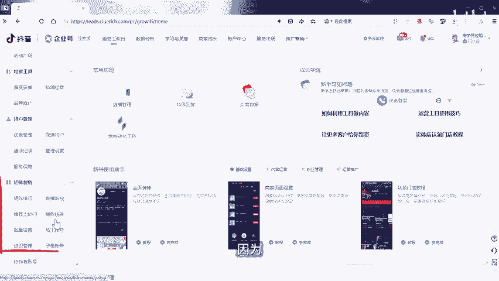
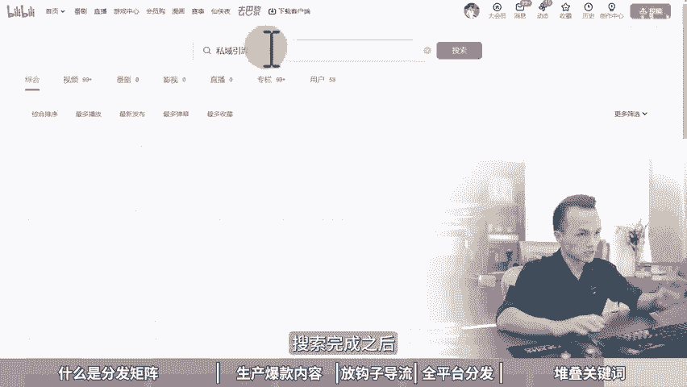

# 耗时1月制作，共计13分钟，短视频矩阵号运营全攻略，分发矩阵，矩阵分发视频，矩阵分发管理，矩阵分发系统，矩阵系统分发，矩阵运营是什么，短视频矩阵运营，矩阵运营系 - P1 - 黄一恒矩阵推广引流 - BV1bwWZecEDk

本视频耗时一个月制作，共计13分钟，为你深度解读分发几证五大SOP流程，包括什么是分发挤证，如何生产爆款内容，怎样放钩置导流，全平台分发堆叠关键词玩法，一口气搞懂分发挤证挤证违法吗？真的不违法。

因为官方已经在后台邀请你做几证营销了，你可以直接创建你的企业员工账号。

🎼有人说，作为普通人没有营业执照，该如何玩起阵呢？今天就给大家掰开揉睡的讲清楚，普通人也能玩的集阵分发引流，学会一个视频，分发10个平台，还不会规范搬运。这不是我在吹牛。我已经验证过。

并且一直在操作当中，季节废话，一个视频给你分享短视频集阵号引擎供链，几阵分发五大SP流程。视频有点长，记得先收藏，一起来看，我给你分享什么是分发几阵，怎样生产爆款内容。

如何放钩置导流以及全平台分发推接关键词啊，搜索流量。先来看什么是分发几阵引流。这里面我是上给他定义的。咱们通过找爆款或者高频吸有选题，制作内容，多平台分发来获取流量，打造多流量管道。

比如说我们一个管道一天讲10个人做6个管道，一天就能够加60个人。

就把它称之为叫做集善分发引流。那做几的分发它有什么好处呢？首先，能够帮助我们去对抗平台规则的变化，降低风险，分散在不同的平台上面。因为咱们60%人做视频，都会面临限流或者封号。

有的时候咱们可能发布到一些敏感的题材，关键词或者画面账号就违规的。比如说会出现什么限制请聊发言，禁止发布作品新发布作品介到推荐，限制用户搜索，这些都是比较轻的，严重的直接禁言30天，禁言一年。

甚至永久禁言，特别是有的伙伴还要导流到失忆。这种高风险的操作，虽然通过特殊的技巧，绕过平台的检测，但是有的时候呢难免会翻车。如果你只有一个账号相当于要从头再来。如果咱们有多个账号，一个账号出问题。

其他账号不受到影响。第二个增加爆款概率，普通用户发10到30个作品能小报一个同一个选题。如果我们制作多个内容，分发到不同的账号上面，就能够增加爆款概率，这个平台不报。

另外一个平台报这个账号不报另外一个账号报，还能够增加流量基数。因为我们在做的时候呢，流量基数越大，我们的流量自然越多。如果咱们一个账号，一万流量，10个账号我们一天就能够搞10万流量。

10万流量已经顶得上一个普通的小热门爆款了。还能够增加成功率。因为在任何平台，硬气成分都非常重要。这也是大家有的时候会刷到一些昙花一现的作品，这个作品千万起播放量，几十万人点赞甚至百万级点赞。

这个人他就不知道为什么就火了，这种就是昙话一线，运气比较好。所以咱们在做的时候，我看到一本书上面他写的公式。说一分记忆七分努力加两分硬气就要成功。当我们了解的这个方法，这叫记忆。当我们学习如何去操作。

这叫努力，但是运气啊有的时候真的是靠两0饭的。如果咱们操作6个平台，每个平台搞上5个账号，合计30个账号，运气分可以直接拉高60分。好，第三个我们可以做多平台分发。我们做分发集阵的时候。

我们可以操作多个平台，我们称之为叫做横向集阵，扩大覆盖面，然后后呢做更多的平台带来更多流量。比如说我们做好一个作品之后，直接发布到抖音视频号、快手西瓜B站小红书就能够获取到6分流量，内容呢不需要系统。

可以直接进行发布，一个手机安装多个APP直接发布就可以了。我们还可以玩单个平台放量。比如说做纵向集证，单个平台操作多个账号，目的是为了挖掘深度。一个平台可以做两个3个5个账号。

这种一般是前期我们跑一段时间，发现有个平台流量特别好，要的客户非常精准，而且还有加成怎么办？我们就可以单独拿过来，注这两个5个甚至10个账号来进行操作。但是单个平台我们在做分发的时候，它是需要。

进行砌重的。比如说重新制作，重新拍摄，重新剪辑，让系统识别为新的视频，相当于每个账号我们都是独立的进行做的。好，这第一步了解和分发引流。第二步呢，咱们需要去生产爆款内容。那到底什么是爆款内容？

原来很多伙伴，包括现在大部分同学都这样干的，先去做内容，再去找用户，再去做流量。是有什么发什么会什么发什么拍到什么发什么，就像发朋友圈一样。朋友圈你发布完之后，只有你关系比较好，比较亲近的人会给你点赞。

其他的人基本上都不会去点赞。更别说你发到这个公益平台里面，这些陌生人他会给你点赞。什么原因呢？就是因为你发的东西他们都不需要的，这是80%的人做内容的时候都会犯的一个错误，那怎么办？正确的做法。

应该这样做，先找到需求的用户，相当于这个鱼汤里面你喜欢吃什么，我们再去做遗药，而不是做了一药之后，我们来看一下这个一汤里面有没有鱼喜欢吃，结果掉了一天一条鱼都没钓到。所以咱们在做的时候。

要先找到需求用户再去做内容，什么意思？相当于我们需要先去找到一些高品的需求，这些高频需求，就是用户关注度比较。大的能够帮助用户解决问题，落地呢就是咱们在操作的时候，最好是能够建立一个选题库。

像现在我给你拍的这个视频，不是把我会的拍给你看，而是因为你需要做几证，有人想了解几证，有人想看几证，我再来做这个内容，它的流程是这样的。当我们做了选题库之后，找到用户的需求。

从这几百个选题里面挑选西油最大的，你去做做出来之后自然就能看，为什么？因为你是先找到了需要看的人，在针对他们来做内容，说简单点就是你喜欢吃面，我就下面条给你吃。你喜欢吃蛋炒饭，我就做蛋炒饭给你吃。

你喜欢那么喝粥我就做粥给你吃，而不是我做了碗米线，端过去之后，结果发现你根本不喜欢吃米线，所以这是很多伙伴所饭的点，这个点只要纠正的，基本上你做的选题和题材都能够获得比较不错的流量。那第三步。

放钩子导流，这个什么意思？80%的人搞流量都会忽略的点就是做了内容没有人加粉，因为没有放钩子，没有引导用户跟你发生关系？没有让用户成为你的通讯录好友来到你的私里面来？你要知道你为什么拍视频？

你为什么搞内容？你为什么做图文？为什么做文章？你的目标是什么？非常简单，就是为了。让用户到你的视里面来变成了通讯录好友。所以咱们在公益里面生产内容，不仅仅是为了提高曝光。

更多的是让认可的用户通过线索找到你，从而进入到实流量池。这就是我一天加100200300个精准粉的秘密，赶紧把它用钱。所以咱们在做内容的时候，要考虑人送用户什么，可以跟用户发生关系，可以用户来找你。

我们相信找到用户的痛点，找到用户的需求，然后把这些痛点和需求，通过硬盘线索放到你的内容里面，可以是帮用户解决问题，可以是一个解决方案，也可以是文件，也可以是册，还可以是社群，重点在于一定要硬盘线索。

让用户来给你发生关系。放到钩子之后，接下来第四步全平台分发。什么叫全平台分发激力。比如说我们找到一个爆款选题之后，我们可以把它做成文章，然后呢，做文章分发。

比如说公众号、头条号、百家号、搜活号、企鹅号、B站专栏、搜付专栏，分发到8个平台，就能够获得流量。而且我们做的文章全部都是做的爆款、高频需求，不怕别人看。第二个给它做成图文。

分发到小红书、抖音图文、快手图文、视频号图文上面也能够获取到图文流量。然后呢再给它做成视频，视频分发到抖音、视频号、快手、小红书、B站西瓜视频，也可以获得6分流量。最后如果咱们有条件。

有能力还可以做直播。在直播间直接把这些高频需求，1234给它列出来。用户为什么来可用直播，也非常简单。因为。你能够给他解决问题。而且我们找到这些高频需求和选题，它本身是具备一定的看点的。

所以你可以在抖音搞直播，视频号搞直播，小红书搞直播，拿到平台的什么推荐流量。那这里做全营量分化的时候，一定要结合上我们讲到的第二个点就是内容一定是高频需求。很多伙伴写了文章，做了图文，拍了视频搞的直播。

没人看。为什么？因为你没有帮用户解决问题，没有找到用户的关注点，如果你找到一个热点，大家都关注都喜欢自然就有人来看。如果找不到你做的时候，看的人就什么非常少。这就是我们对用户需求的把握不够准确。好。

接下来第五步，我们要学会对叠关键词。什么叫对叠关键词。很多伙伴发布完作品之后，已经隔了10天20天一个月，流量都少的可怜。什么原因，就是因为没有掌握平台的规则。记住，没有掌握平台的流量密码。

就进不了流量池。我们目前做内容的目的是为了什么？是为了能够撬动平台的公应流量，拿到平台10倍、100倍，甚至1000倍的流量，让我们的流量变成5位数、6位数，甚至是什么7位数。很多伙伴呢回做。

很多伙伴呀不知道怎么做搜索流量。现在很多用户他都会直接通过右上角的搜索框。因为当一个平台，用户进入饱和之后，他们就会产生很多搜索需求，就会直接通过搜索关键词找内容。如果用户搜索不到你。

因为里们也不及关键词，要学会堆叠关键词，批量做搜索流量。记得给大家看一下我们自己的案例，比如说以B站为例，在B站上面我们搜索实际流量，你可以看到这一个视频是我们做的一个。好。

这是我们另外一个账号做的分发，两个3个还在往下滑，4个、5个、6个、7个、8个、9个、10个、11个12个13个14个，光在首页就实现了霸屏，有14个视频都是我的大家看到这一个视频流量就达到9000多。

虽然9000多不不是很高，但是在B站里面这9000多个，而且咱们做的是中长视频，10多分钟，都是超精准的流量，如果你打开这个视频，你去看你就会发现我们的这个标题里面是堆叠了很多的关键词。

为什么搞这么多关键词，就是用户他在搜索这些关键词的时候，这里比如我们随机复制一个关键词，给他放到里面进行搜索，搜索完成之后，你会发现我们的视频同样有排名。为什么因为我们做了堆叠关键词排名。

所以堆叠关键词，外加。

握平台规则，我们就能够做一箭双雕，让我们发布的作品。不管是文章，不管是图文，不管是视频，我们既能够获得推荐流量，又能够拿到搜索流量。所以自己做的时候两个核心点。第一个就做什么选题能够获得推荐流量。

第二个，用什么关键词能够获得搜索流量，提高我们的点击率，就会形成强者一强，弱者易弱强的人流量越来越大。刚开始2358000万。弱的人呢500。隔段时间600，最后呢都没超过1000。

所以咱们在做的时候要学会每个内容堆叠5到10个关键词，做好堆叠关键词排名。好各位同学，我是黄一涵，只做落地推广方法。因为这几天搞直播并且联系完视频，嗓子呢稍微有点哑了，请大家多多担待。

但不妨碍我们给大家分享干货。刚才我们分享了几阵分发引流的五大流程。如果我们想去落地，需要配合上18个平台的详细打法，让大家搞清楚每个平台的推荐机制，怎么卡搜索流量，怎样能够获得排名，这些呢都是我原创的。

可以通过主页领取进行学习，打造自己的几证托管到流量。如果大家觉得这个视频比较不错的，请大家一键三连，感谢大家支持。咱们下个视频来再会。

