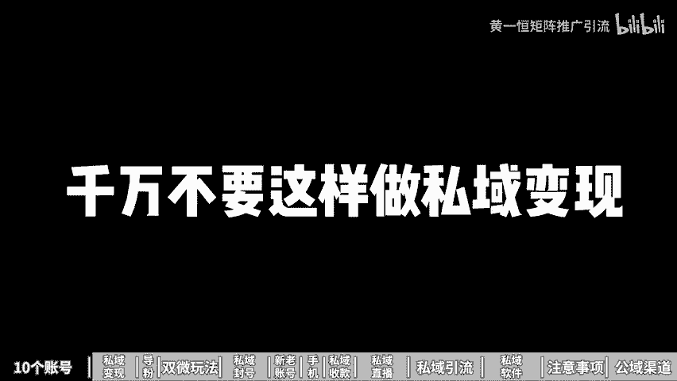
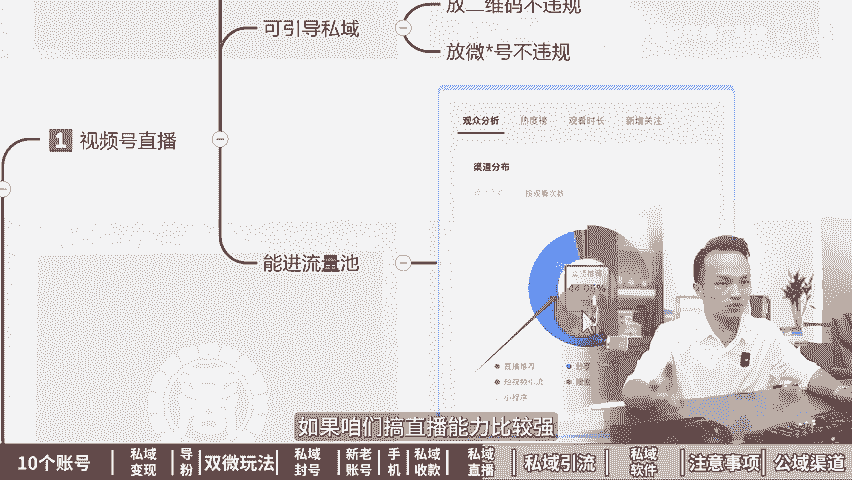
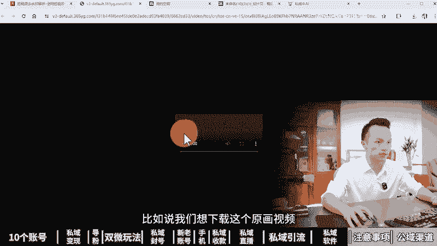

# 耗时240天，共计95分钟《私域流量引流+运营攻略》私域矩阵一个人做10个账号！私域流量搭建与运营，私域引流怎么做，私域教程，私域流量课程，私域流量搭建，私域运 - P1 - 黄一恒矩阵推广引流 - BV1ChY5eREkA

本视频耗时240天制作，共计95分钟，为你深度解析完透，失意流量引流赢攻略，学会失意集阵打法，一个人做10个账号，从变现模式购置导流双微失意到方号解决方案，失意手机失意收款，再到失忆导账号。

失意直播失意流21个渠道，还会分享六大失忆软件，七大注意事项，公益流量25个渠道，内容全程高能，一口气带你玩转，失忆几阵，一个人做10个账号。第一张失意矩阵，一个人做10个账号。

失忆级阵又加满8000多人。我们公司刚览实1生，我叫他去做失忆集成推广，他做了一个月加了8000多人。我们一起来看一下他怎么做的。10个账号一起操作的呀，真是个人才。😡，nice这个方法不错。

一天人加上百人，批量化操作还见时间。一起来看，我告诉你为什么要准备10个微信号来做11级证，多号的注意事项有哪些？我们做11级针，需要准备哪些设备，如何批量打造11卖户系统。

首先来看为什么要准备10个微信号来做11级阵。第一个在增加数量，量变产生质变。咱们一个号搞不到多少客户，但是有10个号来搞，哪怕每个号每天只能搞2到3个客户，10个号每天也能搞到20到30客户。

比如说每个伙伴他搞了一个装修工作室，团队里面5个人负责搞业务，每个人配的5台手机，每台手机等着两个账号，合计一个人有10个账号，团队里面总共账号有100个。那么一个人的10个账号怎么操作呢？

他每天都会去加一些业主的名单，一个账号每天能大概发10到20个请求，10个账号每天能够发送100到200个请求。这里面的通过率大概在百分之二三十左右，相当于每天发送100个请求，能够通过20到30个人。

这里面就能够筛选出意向客户就能够成交订单。第二个，分散流量，避免加人太多，功能被限制或者封号。如果你想一个人搞很多量，根本没有办法，咱们只能搞多个账号来分散。比如说我们一个账号每天发10个请求。

你搞10个账号就能够发100个请求。而且呢这10个账号都不容易违规，更不容易放号。第三个不用替补。当我们某个账号如果出现了问题，我们赶紧换一个账号，这个账号呢也不会有什么影响。但是个伙伴只有一个账号。

这个账号出现问题，就只能够啊看着了没办法进行操作，第四个多项目操作，有的伙伴一个账号搞多个项目会让用户觉得不专业，然后呢影响咱们的成交。所以咱们如果搞多个项目，每个项目都要单独的匹配这个微信号。

能够增加我们的什么多管道收入。那当我们在操作多号的时候，需要注意什么细节呢？这些细节如果你没注意好，就很容易导致什么前进覆没。这里咱们仅仅只针对营销账号，什么是营销账号？

也就是每天需要去加或者被加大量客户的账号。第二个，我们经常去群发消息，而且发的频率非常高。还会频繁的收款或者转账发红包。这种账号，我们就把它定义回叫做营销账号，你自己的账号呢完全不用遵守这个规则。

很少出现问题，但是咱们营销账号，为了防止设备关联IP关联，这个点一定要注意什么设备关联，也就是我们一个设备上面。不能太多账号IP关联一个wifi下面也不连太多账号营销账号，每个设备。

每个网络建议大家最多只登录1到3个账号。你出现问题，也就这1到3个，不会产生关联。如果你搞太多的。比如说我们运气最差的时候，最夸张的时候，一天就挂了几十个账号，就是因为设备和网络关联。

所以大家千万不要把鸡蛋放在一个篮子里面，为了省几百块钱的设备前，后期呢结果你损失了更多的钱，不要把鸡蛋放在一个篮子里面。这种营销账号特别是针对一些高风控期间，平常时间段啊，其实很少出现问题。

好像说我自己用了半年了，没出现任何问题，但是并不代表将来不会出现问题。比如说遇到什么315两会11，还有一些特殊时间段，我们换个头像改个资料，修改个签名，根本就改不了。

这时候你的账号只要稍微有点敏感操作，它就会直接宁可错杀100也不放过一个直接办理账号全部给你啊。封禁掉，这时你要去解封，都会让头的，很可能呢几个月都解不开。因为有的解起是太麻烦了。

所以咱们在做时候一定要注意这个前提。接下来看一下，那我们在实际操作的时候，怎么去做11级这的设备呢，如果咱们想搞10个账号。首先我们得有10个手机卡，手机卡可以买1卡啊。比如说大家可以去搜索儿童手表卡。

也就是中国联通、中国移动、中国电信三大运营商的卡。这个卡的话每30天能够啊实名营商，每个平台最多能够使名5张，相当于3个运营商，你也可以开副卡，最多能够搞到15张卡，大家可以直接在平台里面进行搜索。

也可以购买这个虚的卡，我们去搜索营业租织的卡。这种卡呢有很多小的平台，一个平台能够实名2到5张卡，加起来大概会有几十个平台。一个户的话能够实名20到50张卡啊，基本上没什么问题。好，这第一个手机卡。

我们在注册的时候需要填写账号，然后来获取验证码。第二个我们还得准备手机，手机至少得准备4台以上啊。如果你想降低风险，可以多准备几台。那手机这一块我们用的比较多的。

比如说是这个红米 noteote8或者pro红米 note9或者pro这几个型号之所以推荐给大家，主要还是因为什么价格呢比较便宜啊。现在去买的话估计又降了一些价格，新手机的话成本会比较高。

而且小米手机有个特点，它的系统的开放度非常高啊，可以实现所有应用双开。大家可以通过闲鱼自己去买。如果嫌鱼没有经验的，也可以通过啊京东淘宝上面可能稍微贵一些。

但是稍微保障配置咱们在买的时候最低只买6加64G，必须要等于或者大于这个配置。如果低址的配置当我们用久了之后就会比较卡顿一卡顿的话，操作是吧就会影响心情。

那之所以使用小米手机啊最主要的是因为它系统的开放度非常大，所有应用都可以双开。不像有的手机有些应用开不了。比如说像我们。做这个企业微信矩证，华为手机，包括还有我们公司其他伙伴手机就发现企业微信开不了。

它只能够开微信QQ。那么这种应用双开，我打开投屏手机给大家简单的做一下这个示范。咱们只需要打开手机找到设置，在手机设置里面，我们往下方滑动，点击这个应用设置。在应用设置这里就可以找到应用双开。

然后我们就可以把所有应用，只需要点击一个按钮，它立马就可以开两个出来，这种开出来的技术是系统自带的，相对来说比较稳定。其实手机上面啊，大家如果找到这个特色功能里面还个手机分身。手机分身。

它相当于是一个子系统，还可以在单独的安装软件，这也是系统自带的功能，不需要记住任何软件。那么这样的话我们可以实现一台手机最多登三个账号。但是我们仅仅也只登3个。

否则个伙伴比如说像我们自己还买过摩托罗拉手机，包括这个联想的手机能够开5个能开8个。但是呢现在胆子太小了，不敢再玩这样玩的话，如果到时候封掉了啊，影响非常大。

咱们尽量的不要去使用第三方或者开太多的系统自带的是最稳定的，不要把鸡单放在一个篮子里面，否则最后呢碎了一地，最惨的人也是你。那么当我们有了手机卡和手机，我们还是要配个流量卡。

毕竟我们每台手机需要单独搞流量。如果我们买办的卡，比如说个伙伴开的副卡，或者买的这个三大运营商的卡，一个月啊自带时间20G流量就必须要单独配流量卡了。但是如果你买的是营业租住的卡。这种卡呢。

它只能够收发12065短信，不能够打电话，更不能上网，没流量，你没有网络，那怎么办？我们需要去配这个物联网卡，物联网卡像我们自己用的比较多的呀，是这个69块钱，24个月，每个月4G流量，物联网卡呢。

网速稍微慢一点，但是主打的就是一个便宜啊。那么这个渠道。大家可以去搜索纯流量卡就可以找到。如果你实在找不到，也可以来找我，我把我的渠道分享给大家啊，省得你去浪费时间了。当我们有了手机卡，手机也配流量卡。

接下来看第四个点注册养号。咱们在注册账号的时候是需要扫码辅助，我们可以找亲榜或有扫码就可以往下注册。另外一个设备咱们一周最多只注册一个账号。新账号很容易关联，最后呢全部挂掉。

注册前三天也就是72小时之内，如果没有被封，这个账号暂时就稳了，前72个小时是最敏感的，尽量不要去换网络也不要去关闭网络，包括关闭进程，这些都很容易导致账号掉线，一掉线，你再登录也就挂掉了。

当我们注册在一个设备上面注册一次注两次都挂了，那怎么办？这时候建议大家更换一个设备来注册什么设备呢？可以选择用自己常用的手机，这种手机的话，它是有常用IP从用设备相当于是在微信的新任白名单里面你注册。

这个账号养个两周之后，我们再把它登到演练设备上面就可以了。因为我们账号在正式操作之前，一定要养到满意号以后才去操作。否则的伙伴发现这个账号简单的加一个人或者发个朋友圈进个群账号就挂了。

所以这种账号就是活跃度太低，那怎么去养高质量的活跃账号，有个方法叫做随身携带使用，记住账号一定要有正常售要记录，有的伙伴习惯把手机放在自己的办公桌上面，结果三个月半年一年。

这个手机从来没有离开过这个办公桌。这种账号呢，其实使用活跃记录是非常低的。在操作的时候也很容易导致挂掉，所以咱们在操作的时候，那么一定要随身携带，如果手机比较多，我们可以每天携带给一两台。

一个手机最少一周得有1到2天是带出去有这个正常的消费记录，这个点呢非常重要。大家如果想把账号养好，养成高质量的活跃号。我给大家准备的一个养防护宝典，可以通过主页来领取参照里面就可以了解到一些规则。

把这些规则尽量的避免一下。其实我们大概率啊就可以减少这个方号情况的发生。那么当我们账号有了之后，我们还有几个点需要做意一下。第一个一定要添加一些亲朋好友。虽然我们已经做了很多很多的预防措施。

但是呢一些特殊时间段运气不好，还是会出现说账号挂了，那这是怎么办？我们如果一家的亲朋好友，可以找他们帮我们解开就可以的。如果实在找不到，我们在里面放1块钱，还可以临时登录，看看好友列表。

用另外一个账号啊，去联系，然后解也是可以的。来看第五个说没问题。那么有的伙伴说我搞10个账号，那怎么解决实名问题？咱们一个人呢只能够实名5个微信。如果是10个账号，我们可以找家人朋友来进行实名。

如果你不想麻烦家人朋友，也可以通过冻结微信支付来实现。这也是在网上搜索无限使名的方法，甚至你还要花钱，这里咱们免费给大家分享，冻结微信支付之后，可以正常进100人以上的群。

但是呢它不能够啊发红包也不能够收款，可以解决进群的问题。因为如果咱们没有绑卡的话，超过100人以上的群，你做群推广进不去，根本没办往往下操作。那么一个银行卡最多只能绑5个微信。如果你的账号比较多。

你就得多张银行卡，这个咱们操作，这里面我给大家做了一个非常详细的截图，大家可以先截个屏保存下来，后期来对照的操作就可以了。咱们打开微信支付，在这里面找到帮助中心。选择实名问题，找到查询名下实名。

输入信息之后，就可以查询到你自己绑定哪些账号。然后我们点击这个清除清除记住，它仅仅只是冻结了该账号的微信支付，不能收发红包和转账。但是它还是占用着银行卡的，也可以进群好，这就是无限实名的方法。

我们已经有了10个账号，那如何去批量的打造实一卖货系统，这里面还有一些经验需要给大家分享。首先我们需要做一个微信卖货成交系统。那么个人号呢，一块聊天成交，朋友圈打造个人品牌，微信群建立信任关系。

这三个人一定要做好这样的话，我们是以整体的成交率才会比较高。那么当我们在操作之后，这3块该怎么分配咱们的时间，这里面有1个631投资比重。比如说像我们团队里面专门负责成接流量。如果假设一天加上加班啊。

工作10个小时，有6个小时都在聊客户，相当于客户是怎么呢？就聊出来的。所以多伙伴说成交率低，后面分析一下，每天只花一个小时聊客户，你说客户咋来嘛？记住客户都是聊出来的，聊的越多。

我们就能够筛选出更多意向的客户出来。那么第二个是微信群，我们需要花三个小时打你。毕竟我们建了群之后，这个全部打你，最后啊都会变成死群。第三个是朋友圈，我们得花10。打理朋友圈的伙伴说。

我一分钟2分钟就发完了，为什么要花一个小时来搞？因为朋友圈技术它是打造的是个人品牌。你想把个人品牌打好，有时候啊我们为了发朋友圈，甚至会花半天时间去准备我们的素材。🎼所以这三个点。

631比重就是这样来的，因为它需要耗费我们大量时间，才可以拉高我们整体C业的成交率。第二章，C域流量四大变现模式，千万不要这样做十一变现，否则你连吃饭时间都没有。我们公司刚来随身，我叫他去接粉。

做十一变现。他现在每天蒙的连吃饭时间都没有，一直在聊客户。

我们一起来看一下他怎么做的，用的这四个变现方式，真是个人才。nice上做变现不愁没订单。一起来看，我会告诉你怎样做一对一变现，一对多变现，发朋友圈变现以及搞1亿直播变现。首先来看如何做一对一变现。

我们把它拆分为了三个板块，人货场。首先是人5000到1万个粉，就需要配一个销售来承接这个流量，一个号的月产值大概在3到10万左右。如果咱们的行业客单价比较高，月产值呢也会相对说高一些。

如果咱们的行业客单价比较低，月产值也会相对说小一些。每天承接的新流量大概在10到30个左右。如果流量太少，没什么事干，流量太多了，又没办法做精细化管理。很多客户啊都聊的比较浅。

那我们在做一对一变现的时候，适合卖什么货呢，比较适合卖解决方案，并且是一些私人定制的解决方案，这样才可以做高客单价。就比如说现在咱们给用户提供一个私人定制的变瘦解决方案，或者我们根据用户的需求。

根据用户的痛点提供一个量身定制的变别解决方案，我们在操作的时候需要营造一个卖货的场，在我们一对一的聊天互动当中，不能够直接就给客户推荐产品，而是需要先去挖解客户的需求。然后来找准客户的痛点。

最后放大客户的痛点，然后给粉丝一个现在下单的理由，从而进行掏钱。所以咱们如果想做高客单价，最关键的点就在于什么？你卖的是解决方案，而不是一个产品，是该给用户解决问题解决痛点。

而且这个方案你是针对他做量身定制的。有的伙伴说客户实在太多了，根本聊不过来。每天连吃饭时间都没有，有没有办法做一对多的变现，提高咱们的变现效益来看。第二个如何做一对多的变现。一对多。

我们是通过社群来进行的，还是拆分为了三个板块，人货场，首先是人1到20个群，我们需要单独配个运营，一个号的夜产值大概在1到5万左右。有的伙伴奇怪了，为什么咱们搞一对多的变现，客户技住变多了。

我们的夜产值反而变低了，这里取决于咱们卖的货。因为我们通过社群来卖货，它比较适合做一些刚需的高频产品，并且是客单价1000块钱以下的多产品组合。如果你想做高客单价在社群里面很难完成。

这也是为什么在身边搞社区团购的，大部分都是通过社群来进行。因为这些社区团购都是我们需要经常购买的产品。而。都是一些刚需产品，来看一下我们做社群的时候，需要营造一个什么样的场。咱们需要打造一个卖货群。

每天固定的时间点在群里面来推这个爆款的团购品。比如说咱们可以整理好产品的介绍，团购的价格，商品的图片，购买的方式，发到群里面活动一下氛围，带动一下气氛，基本上就会有人进行购买。因为这些产品记术。

它都是什么刚需高频的产品，那有没有办法我们做一对多的变现，并且可以做高客单价的产品呢，可以做。那么需要我们后面的一个失意直播变现。这个咱们后面来讲。好来看一下第三个我们实意用到的边现方式。

叫做发朋友圈变现。首先人咱们5000到1万个粉，需要给他配一个运营，这一块其实是结合一对一变现来进行的。相当于一个运营，它既要维护5000到1万个粉的一对一变现。

同时呢还需要把朋友圈给他打造好一个号的夜产值，通过朋友圈大概能够带来1到3万左右。那货这一块在朋友圈里面也仅仅只适合做刚需高频1000块钱这的产品。如果你想发个圈就有人自动下单，这个是非常困难的。

因为高客单价很难通过这种看看介绍就进行下单，它必须要我们花时间去聊，了解客的需求，了解客痛点，而且提供什么定制化的方案，这一块呢啊非常非常重要。那我们在做朋友圈变现的时候，需要营造一个什么的场来。

我们需要拉满新人做曝光，刺激用户的需求，激发用户来主动找我们进行咨询，自动成交的核心啊，就在于什么讲好故事啊，做好曝光量。有的朋伴说，我不知道怎么在朋友圈讲。其实朋友圈讲故事啊非常简单。

就是连载我们客户从开始到结束的整个过程。就比如说一个客户他了解到我们来咨询我们刚开始抱着怀疑的心态，后面呢对我们产品啊慢慢的了解之后，开始尝试。最终啊解决问题还给我们转接到客户等等。

你可以把这些过程全部连载到朋友圈里面，这就是一个非常好的真实的什么故事。所以朋友圈变现它跟色情非常相似，只适合做一些客单价比较低，并且是刚需高频的产品。那咱们如果想做一些高客单价的。

我们还可以做这个失意直播变现。来看一下人货场。人的话我们做失意直播变现。它对粉丝量就没什么要求。一个主播可以搞几千个粉，也可以搞几万个粉，甚至搞几十万粉都可以。因为咱们在搞直播的时候，都是批量化的成交。

所以你会发现现在有的搞直播一常直播就能够带货啊，几千万，甚至有些夸张的能带货上亿，就是因为什么？它是批量成交。而且呢效益啊是目前我们做所有成交里面最高的。那货这一块它尤其适合做一些高客单价的产品。

因为我们在直播里面它是能够拉满信任的。有了信任之后啊，什么都可以卖。所以直播其实任何产品都是可以卖的那场这一块呢，首先我们如果想做1一直播，比较好的实一直播平台，并且是免费的。那么就是视频号直播。

视频号直播，它可以公开直播，还可以撬动公益流量，也可以指定在某个群里面搞直播，针对社情的成员，还可以做付费直播，用户啊必须要付费才可以听直播，也可以提前咱们做一个彩排直播，单独去练习我们的直播能力。

那么这里面有个非常重要的条件，就是我们直播，虽然他能够。🎼不限制我们的粉丝数量，哪怕几十上百万粉都可以。但是有个非常重要条件，就是咱们主播呀需要有比较强的销降能力，我们得先练习能力。

然后呢才能够什么稳定销量。这样的话才可以帮助我们把C做好，所以大家如果想一对多，并且做高客摊价，就需要学会去做这个C直播。第三章公域转C域勾子导粉，一天加200多人。没想到。

用了这个方法就会让CA几镇多加200客户。我们公司刚来C习生，我叫他去做公益流量转粉，他做了一周，每天能加200个客户。我们一起来看一下他怎么做的，用钩子转粉，真是个人才。😡，nice这个方法不错。

一天人家上百人。一起来看，我告诉你如何通过预埋线索放钩子进行倒粉，学会这个玩法，一天可倒几百金砖粉。首先来看如何在内容里面溢埋线索放钩子。咱们在公益里面生产内容，不仅仅是为了提高曝光。

更多的是让认可我们的用户通过线索找到你，从而进入到我们自己的摄有量词，而大部分伙伴在操作的时候都不要佛系，提高了曝光，然后呢，只有少数或者妻子可数的人进入到我们的摄有量词。那怎么去最大化的利用曝光。

我们就要提前在内容里面放上线索，放上钩子，让更多的人进入到我们的摄有量词。所以这里面有一个日加100金砖粉的秘密。就在于我们需要在内容里面放上钩子。所以改变你的观念，现在我们写文章需要放钩子。

做图文需要放钩子，咱们拍视频需要放钩子，搞直播。也得什么放松钩子。那线索钩置类型有哪些呢？比如说我们可以给用户解决问题，有问题可以来找你，这也是一个最简单的钩子，还可以提供一些具体的解决方案。

如果你的方案针对性非常强，那加里的人也会非常多，还可以提供一些文件手册，这点呢可以灵活变通。那线索到底从何来。其实我们是根据用户的需求，根据用户的痛点，然后去提供相应关的方案。

所以用户为什么要通过这些线索来找你，因为你能够帮他解决问题，能够帮助他解决这些痛点。那当我们疫苗的线索钩子。接下来我们就可以正式的去导流失业，那怎么导流失意，每个平台简单给大家提供一点思路。

比如说如果咱们做抖音可以通过私信发飞速文档，也可以配合上粉丝群来导流到失业。如果咱们做视频号可以配合上签名引导或者私信回复都是可以的。因为在微信的生态管控呢比较宽松一些，那么如果我们做的是小红书。

我们可以通过粉丝群制定小号消息，小红书这。🎼是所有平台里面最严格的，很容易违规。所以咱们只能用粉丝群配合小号来做做一个不粘锅。然后呢把锅甩给这个小号就可以了。如果咱们搞的快手，可以配得上签名导。

外加私信回复。如果是B站的话，我们可以通过签名导私信回复，外加评论的制力，这些都比较灵活，大家可以多种方式组合在一起，找到适合自己的就可以了。第四章做思域是选个人微信还是企业微信。没想到用的双微私流量。

又加满了几个微信，我们公司刚来实习生，我叫他去做司意接粉，他一直纠结是选个人微信还是选企业微信。烦死了。🎼，其实两个可以一起用搞搞双微式流量。虽然客户只添加咱们的个人微信。

但是它也会出现在我们企业微信的号列表里面。nice该如何操作呢？一起来看我会告诉你个人微信和企业微信，他们的优缺点是什么。在视频的最后，我还会给你现场演示如何做双微式流量，让客户只添加你的个人微信。

但既在你的个人微信，又在你的企业微信好友列表里面。大家一定要看到最后为了方便大家直观的对比，个人微信和企业微信到底有什么差异。我特地花时间做了这个表格，大家可以先截屏保存，方便后期查看。

首先来看个人微信它进的形象是打造个人IP而企业微信它是经营公司形象，个人微信最多能装1万个好友，而企业微信呢没有上线，想装多少都可以。个人微信。

咱们直接免费就可以注册企业微信如果我们的好友超过2000个以上一个好友位就得花一毛钱。如果我们一个企业微信里面装了5万个好友，每年就得固定支出5000块钱。个人微信我们需要通过个人进行实名。企业微信。

首先我们需要做主体认证，每年至少得花300块钱。然后我们使用的账号得通过个人来进实名。那有的伙伴会问到，个人微信和企业微信，它的实名冲不冲突，这两者没有关联。咱们个人微信一个人可以使名5个账号。

然后还可以再实名5个企业微信的账号。最关键的来了，个人微信我们在群发消息的时候，回复率整体啊是比较高的。而企业微信我们使用一段时间测试下来，发现企业微信里面回复的人的寥寥无几。很多人呢直接就不回复你。

甚至出现了比较高的一个删除率。在个人微信里面，我们做一段时间检测了一下僵尸粉，有5%到40%的人把我们删除了。而企业微信里面来高的离谱。比如说咱们搞了一万个好友做一段时间之后，你去看一下单向好友。

这里面有超过20%，甚至50%的人把你删除掉。所以大家如果单独拿企业微信的承接转化的话，不太建议越大成交率啊短期看不出来。当你做三个月半年年，你会发现整体的销售额比以前甚至要跌了一大半。

我们有段时间呀就是在这个地方才来坑。所以现在我们是做了双微4流量。有一段时间用我们公司的账号被封控了，一天呢公司啊就放了几十个账号，导致没有账号可用，没办法，只能用了企业微信。

结果企业微信啊用了大概接近半年的时间，发现公司的这个销售额啊严重的下滑。业绩呢。还没有以前的一半高。后面我们开会探讨之后才发现，原来是企业微信删除率过高的原因。我们检测了一下单人好友。

大部分的夸张的有些达到了50%，也就是1万个好友里面有5000个人都把你删除掉了。所以咱们如果想做高成交易。必须要用个人微信来做。而企业微信整体是比较偏低的。那么个人微信呢，咱们发朋友圈的是没有限制。

想发多少条就发多少条。但是企业微信呀它只有3条主动朋友圈。哎这里后面迷惑了，啥叫主动朋友圈，说简单的就是我发的前三条朋友圈在你的朋友圈列表里面，你可以刷到我的这条朋友圈，但是超过3条以上。

你在朋友圈里面根本刷不到。只有你主动点开我的这个啊资料要去查看才可以查看到那么个人微信呢，他的微信群最多能装500人企业微信来也是一样，能装500个人。但是它多了一些营销功能，比如说可以设置入情欢迎你。

包括自动回复，还有防骚扰，相当于就是自带的一个机器的功能。那么个人微信啊，咱们如果封号了，需要找好友来进行辅助。而企业微信呢如果咱们账号封号了，一般最多放一个月左右，有的可能就1到2周到达时间自动解封。

不需要任何辅助，也不需要做任何的操作。个人微信啊，如果我们想进联系客服啊。非常困难。世界上最难的事情我们团队里面就讲到就是打腾讯的啊客服，而企业微信管理员账号，它是有专属客服的。

只要是工作时间联系都在线，回复率呢整体还是比较高的。那么个人微信啊，如果员工离职的，那么账号是没办法做继承的，只能由公司准备账号。员工离职的时候呢解除实名就行了。但是企业微信如果员工离职了。

我们可以直接把这个账号的客户转移到另外一个账号里面做离职继承，所以个人微信最后总结，他适合做个人卖货，适合打造个人IP而企业微信它比较适合做什么大流量承接。什么叫大量承接。

你看到现在很多大的企业像什么中国石化中国石油，他们就是玩的什么企业微信，包括什么中国移动，他们也是用的什么企业微信，运流量在太大了，用个人微信来根本就装不下那这种大平台可以做。另外就是搞售后服务。

我们给客户提供服务的时候，用企业微信来做，能够增加我们的企业形象，反而呢能够让用户觉得我们的平台更加正规，更加可靠。那说了这么多，我们到底选个人微信还是讲企业微信。我的建议是两个一起用做双微式流量。

那到底什么是双微式流量，很多伙伴还是不了解。咱们来试唱一下。这里我们打开投屏手机，为了方便直观的演示，我这里特地让我们公司的同事啊，那么添加了我的这个账号。那么添加完之后呢，我们来做一个测试。

比如说咱们这个伙伴打开之后可以看到在我们的好友列表里面，这里面会显示两个按钮，但是你的只有一个啊你的只有一个全网验证，但是我们的多的一个去企业微信添加对方。好，这里操作非常关键。咱们如果想做双微式流量。

首先我们需要点这个去企业微信添加对方，然后我们选择相应的这个企业微信。好，这时候我们稍微等待一会，等他加载出企业微信，加载完成之后，还这个时候呢，我们就可以点击这个什么通过验证。好，然后点击完成。

这时候我们就跟对方成为了什么企业微信的好友。接下来我们再返回到这个窗口来，返回来最后后面发现奇怪了，怎么个人微信的验证没有了，只有一个去企业微信发消息。这个呢是因为新版的微信啊，他做了一个更新。

没有办法啊，直接像以前这样同意。那其实我们通过一个小技巧也可以实现。个人微信同意怎么操作呢？非常简单。我们打开之后没发现现在已经显示没有接收的按钮，我们打开这个界面，在这里面点击这个回复按钮。

我们随便回复一个数字或者表情。好，回复完之后，接下来咱们再返回来，你会发现这里面又多了一个接收按钮。我们只需要点击接受，然后呢就可以进行验证。这时候你会发现咱们的这个既在我们的企业微信。

又在我们个人微信的好友列表里面，这就是我们讲到的什么双微SC流量。那么有的同伴说这个双微视流量到底怎么设置啊，其实非常简单。首先我们的企业微信一定要绑定个人微信，这是第一个条件。第二个。

在企业微信的通用里面，我们需要开启接收微信端收到的这个什么好友请求。第二个条件，这是第三个条件呢就是我们的个人微信，一定要开启好友验证，只有这三个条件同时满足的时候。

你在使用我这个方法就可以实现双微视流量，客户加过来之后，既在个人微信里面，又在企业微信里面就实现了我们讲到的双微视流量。那至于刚才我们讲这个同意的是吧，那么只有一个按钮。

你可以通过刚才讲的方法回复这种方式啊，其实还有很多种。比如说如果你那个电脑端，你先同意企业微信，也可以在电脑端上面点同一电。它是不会啊取消这个同意的按钮的。还有一个方法呢就是啊卡进程。

就是我们同意的时候可以先点个人微信，然后再点企业微信，这些都可以。反正这种方法我们测试很多，整体来。🎼啊，都还是比较好用的。通过刚才的分享，应该再也不纠结到底是用个人微信还是用企业微信的。

两个一起用是最好的。所以赶紧去把双微视频量做起来。第五章，微信私域怎么做才不会被封号。这这部手机全部封号了，我们公司刚来谁一声，我叫他去做微信私域，他把这账号全部搞封了。我们一起来看一下他怎么做的啊。

😡，直接连一个wifi弄的呀。😡，现在微信失意非常严格，一个不注意账号就封了。一起来看，我告诉你四种封号的解决方案，家人都被封，关联被封，第活页被封，消息几报被封怎么解决？首先来看家人都被封。

很多伙伴在搞推广的时候，没有提前做分流，当流量上来之后，一天就加三五十个人，夸张的时候，一天要加好几百个人，这时候不封你封谁。所以咱们在打造多管道流量起到时，要学会做好多账号分流。

提前准备多个账号来承接流量，每个账号每天承接流量，最好不要超过30个，30个以上时间长了都很容易被封。如果你想保守一点，只是更稳一些。见议大家每天不要超过20个。因为现在微信被封了，非常难解。

有时候应气不好，刚解开立马又封掉，啊，光解封不会让我们非常头大。那么第二个叫做关联被封。这种情况比较严重。有时候一次性封三个5个，甚至夸张的几十个账号全部挂掉。比如说设备关联。

咱们在一个设备上面跟着过渡的账号，或者是IP关联。我们一个wifi下面连接太多的账号，主要是针对一些高放控期间。比如说315两会使用，你会发现我们换个头像改个昵生，改个签名都没办法进行修改。

这是你的账号这少稍微有一点点敏感操作，它就会产生关联，把你整个关联账号一次性都给你什么挂掉。我们自己最夸张就是一天就挂了几十个账号，早上来公司之后，这个伙伴说账号掉线了，另外伙伴说账号掉线了。

他也说账号掉线了。然后我们统计一下，结果一登录都提示账号被封了，一天就放了几十个账号，光解封，我们都解了几个月。因为有的账号它解封起来的特别困难，说明们在操作的时候，要尽量的避免这个设备关联和IP关联。

之所以现在我们封号已经很少出现，就是因为我们把能避得开，基本都避开了。所以现在我们正常一般只有比如说三个月或者半年，偶尔会挂一个账号不会出现以前的这种什么关联一次性很多账都挂了。

这里呢我们主要是针对一些营销账号，什么叫营销账号有可能说我自己的账号随便连wifi随便多开都没事啊，确实是如此。但是我们的营销账号，每天要被动或者主动去加很多人，还要经常去请发消息，或者有大量的收款。

而且这种账号呢，我们都是固定在一个地方使用，没有随性携带活跃度啊，整体其实还是比要偏偏低的。所以如果你都是营销账号，一个设备，一个网络最多最多只登录1到两个账号，千万不要超过3个以上，超过3个以上。

一旦关联，有可能全军覆没。那你的业务，你的项目。马就停止了，光解放啊，就让你一哭无泪。第三个叫做低活跃备方。有的伙伴说我自己的账号，我就加了个群啊，我就发了个消息，简单做个操作，结果就挂掉了。

这个什么原因？是不是我这个手机有问题，其实啊主要还是咱们的账号活跃度太低。那到底什么是低活跃账号来。第一个没有活动轨迹。第二个没有消费记录，就是有的伙伴呀哎他自己有个办公桌。

然后呢把这个手机全部都放到这个办公桌上面，用了一年两年三年，这个手机啊从来没有离开过这个办公桌，这种手机我们就把它称之为做低活跃，虽然注册了很长时间，但是其实啊他活跃度整的太低的，那怎么办？

我们要学会做这个高活跃账号，那么最好的养号方式啊，其实有一个叫随身携带。所以现在我们团队里面操作，如果是近期在承接流量，家人比较多的，我们都要求你下班时间啊要把这个手机带在身上，平常出去点外卖。

出去吃饭，所去买东西都要用这个手机来进行操作，把它变。成一个正常的社交号，有社交记录啊，消费活动这个点非常重要。因为话像说我手机的太多了，像我们团队里面一些老员工啊。

他们做的时间比较久光微信号就十几个啊，手机也有10台，你说出去吃饭不可能太死台出去吧，带1台出去，人家以为你是卖手机的啊，所以怎么办呢？有另外一个方法，我们可以每天带1到2台然后呢循环带就可以了。

不一定要求每天都带在身上，但是每周至少得有一天两天这样来提高活跃度活跃度高了，就像我们自己的账号回跃度最高，不管你搞什么操作，哪怕你呃搞得非常夸张，都很少出现说什么违规之类的啊，这点非常重要。

再下来看第四个消息举报被封消息举报。有的时候咱们发消息一发出去以后，账号就提示违规啊，就提示什么掉线了或者被警报了。这就是因为我们在发送的时候，系统检测到了这个什么啊敏感词。说敏感词这一块。

大家在操作时，特别是针对一些什么金融类医疗类，包括一些过度营销类的广告词啊，影响都非常大。这种敏感词，你发出去立马就会被系统检测到这种有什么。解决的其实非常简单，我们可以用同音字代替。

如果你不知道敏感词，可以找一些敏感词工具啊，来进行检测，在发生之前先检测一遍，把里面红色的字全部改掉。这种敏感词工具大家如果找不到的伙伴也可以找我，我把我用的工具分享给你。

现在我们不管任何文案都会放到里面，先检测一遍。那么第二种方式啊是被用户举报，被用户举报呀是什么意思？就是我们发消息的时候发出去，有人看着不爽，哎，他反手一个举报，结果举报一成立之后啊。

那你的账号上面就出现了这个警告提示，再举报一次账号就挂了。那么这个举报呢，其实我们做了一个非常有趣的测试啊。这里他们不是有一次举报别人的啊，只是随意的测试了一下啊，所以就牺牲了两个好友列表。

那么这里面有一个伙伴我们就把他的这个发送的信息啊，就反手点了一个举报啊，结果一举报呢，他就提示投诉成功了。那么已经对该用户进行了警告教育处理啊，如果再出现的话，账号就挂掉了。那么还有的消息呢，你会发现。

比如说这个消息我就把这个消息，然后也反手点了个举报，结果发现举报根本就不成立。可能对投诉对象未违规，也可能是信息暂时无法判断。所以这就是咱们在群发消息的时候，如果这消息写的比较好，没有敏感词。

别人想举报你都举报不了。所以咱们在做的时候啊，这里有个小技巧，就是把我们的。这个消息的程度给它缩减一点。所以如果你想减少消息举报。第一个提高沟通机会，从来没有聊过天，没有回复过的。

不要给他发那种很长的文案，很容易被举报。这种我们发短消息啊，另外就是减少消息的长度，消息越长，我们越容易触发到敏感词，所以越短的话啊，敏感时间越少。另为呢优化营销关键的词候。

我们前面讲的配合上这个敏感时你的攻具。如果不知道的伙伴可以找我，我分享给你也行啊。如果你知道你检测一下，这样去发的话，就可以减少咱们这个违规。第六章做思域永新微信还是老微信。30部手机全部发号了。

我们公司刚来试一声，我叫他去做微信示意，他把这些账号全部搞方了。我们一起来看看他怎么做的，全部用的新账号。现在微信事一特别严格，一个不注意账号就封了。

一起来看我给你分享新微信和老微信在使用的时候有什么不同。现在看新微信，有的伙伴直接拿了一个全新的账号过来做流量承接，你会发现他并没有任何的朋友圈记录。当客户加过来，他会先看的朋友圈，没有朋友圈。

他就会认为你是个新号，新人背书降低，对成交来说呢，也大打折扣。如果咱们使用一个老微信来承接流量，他已经养了几个月，有很多的朋友圈记录，客户加过来，通过朋友圈提高了新人背书，对成交也比较有帮助。

那如果我们通过新微信去加名单会怎么样，加一个两个没问题，加3到5个就会提示频繁。而我们使用老微信，每天能够发送10到20个请求，加的人也更多。而且限制也会更少一点。因为新微信在使用的时候。

很容易就导致方号。我们团队里面操作上00个账号。最早期啊我们也是直接使用的新账。包括有些公司刚招来的实习生，他们也会直接注册一个账号用来承接流量。刚开始一天两天没问题，结果一周之后。

这个账号直接就被限制了，花的时间解开，用了几天又挂掉了，就不断的限制循环，最后搞了一个也发现这个账号再也解不开了。所以咱们在使用的时候，尽量的使用这个老微信，因为老微信它是有活跃记录的。

能够承接的流量也更多，而新微信你会发现加3个5个没问题。但是你的流量只要加到10个以上，你的账号基本上就容易挂。而且如果有客户给咱们转账，在收款的时候，刚开始你会发现小金额呢是不容易出现的。

但是如果客户稍微转一点大金额，特别是异地收款，当客户在转账的时候，他就会提示一个方险，甚至直接没有办法给你转账。为什么因为你的账号活跃度才太低了。而老微信呢，它是己正常收款，所以综合下来，大家应该知道。

我们在使用的时候肯定得使用老微信，那老微信怎么来也就。是大家在搞项目做生意的时候，你备用的账号至少得有3到5个。当你需要账号的时候，你可以直接拿过来就用。所以我们团队里面至少有5到10台手机是备用着的。

而且有专门的人负责去发朋友圈拿来去提高账号的活跃度。当我们需要打造一个流量渠道，或者需要换一个号的时候，直接拿过来这个账号它就有高的活跃度。而且。是完全不会出现这些影响的。另外我们的账号拿过来用之后呢。

包括在使用的前一段时间，比如前一到两周，最好是能够随身携带两段时间。因为高回跃的账号它不是放在固定的位置。很多伙伴啊，他是直接把一个账号，就是放在一个固定的位置，使用了一个两个月都没有离开过这个位置。

这时候如果你做流量成绩流量小不容出现问题。但你量大的话，这个账号就会发现基本上就占亡了，而且会反复的循环，非常搞心态。所以大家如果是长期使用的账号一定要随身携带，出去吃饭，出去点外卖。

包括我们做其他的都可以用这个手机来操作，每周不要求期间都携带，每周至少你得携带个两天三天。如果手机实在是非常多的携带不过来，像我们有的伙伴一个人负责十台手机的怎么办？我们会要求你每天可以带两台左右啊。

循环一下，提高点活跃度总是好的。这也是为什么我们自己的账号，你去随便怎么搞，都不容易出现问题。但是我们啊活跃度比较低，然后拿过来简单做个操作，它就出现问题。所以呢最好的养号方式就随机携带。

大家如果想了解具体的养号规则，我给大家准备的详细的养号宝典，有个人微信的，有企业微信的，那么让你去了解点规则之后呢，不容易踩坑，否则这里面咱们踩一个坑的，可能账号就不能用了。你解现在非常麻烦。

条件非常苛刻，很难解开。所以呢咱们了解规则是非常必要的。这个规则以及养号宝典已经在我的主页，大家可以通过主页来找我，我分享给大家。第七章做思域，用什么手机比较合适。前买10台手机做思意是从什么体验。

我们公司上百台手机都用的什么型号，一般人不会告诉你季点先收藏，不是新手机，咱买不起，而是二手的红米来更接性价比。原来我们购买的是小米note3，以及小米六叉，现在都能够流畅使用。

小米六叉稍微有一点点卡顿，后来我们购买了红。米的note7以及pro系列，现在使用流畅度还是非常不错。那现在咱们购买比较多的呢是这个红米note8以及红米note9，包括pro系列。咱们在购买的时候。

配置都是选择6加64G配置以上。如果你的配置太低，当我们后期软件安装比较多的时候呢，手机就会非常卡顿。为什么用这个型号的手机，一方面是价格便宜。咱们如果到闲鱼上面去买这些二手手机。

价格差不多在300到400之间，都可以购买，成色比较好的。如果咱们去购买红米note9或者pro系列配置6加64G配置以上，350块钱，400块钱左右就可以购买到成色比较好的。第二个。

小米手机系统的自由度非常高。所有人安装到手机上面应用都可以进行应用双开。像我们公司其他伙伴用的是这个华为手机，想搞企业微信矩证，企业微信就没有办法应用双开，又得单独去购买手机。其次。

手机上面还有一个手机分身功能。在手机。里面又可以单独安装软件，相当于咱们不借助任何第三方软件，通过系统自带的就可以进行三开实现登录三个微信。其他手机我们也购买做过测试。比如这个联想真馏手机可以进行5开。

还有其他伙伴可能买了摩托拉手机可以直接进行8开。为什么现在我们不去使用这种5开8开的手机呢，最主要还是方怕了，因为很容易导致设备关联或者IP关联，特别是一些高风控期间，比如说31511两会期间。

这时候你会发现修改个资料都修改不了，万一我们账号出现一些敏感操作，就很容易导致大规模关联方号，咱们目前不用来最多的原因还是什么？封怕了。现在咱们用来接粉的手机，一个手机最多只登录1到3个账号。

如果是重点加粉，重点操作账号，我们一个手机只登录一个，除非是以前家人的老号，我们会考虑一个手机登2到3个，大家尽量不要登太多，登太多呢，很容易导致关联。其实当我们在操作的时候啊，除了有这么多账号之外。

最重要的还是要把账号的活跃度养好，活跃度如果不养好，你会发现简单做一个操作，甚至拉别人进一个群，就导致账号违规或者被限制了。那如何去养高活跃的高质量的社交号。

这里面我给大家准备了个人微信和企业微信的养号宝典。这些呢可以通过的主页来领取进行学习。好各伙伴，我是黄一恒只做落地推广方法。当我们有了这么多几张账号。接下来怎么去搞流量呢？

这里面我给大家准备了18个平台的详细打法，教大家如何去做流量，最终需要把我们这些账号全部加满，这些课程呢都是我原创的感兴趣的伙伴可以通过主页来领取进行学习。第八章C域收款异常三种方案。

30部手机全部首款异常了。我们公司刚来学习生，我叫他去做C收款。他把这些账号全部搞异常了。我们一起来看看他怎么做的。全部用的个人收款码嗯。😡，现在实意收款非常严格，一个不注意账号就异常了。一起来看。

我给你分享三种实意收款解决方案，个人收款码、商户收款码、平台收款码。现在看个人收款码，这是我们使用最多的一种收款方式，它比较适合小金额收款。如果是新加过来的客户没有沟通，很容易出现风控提示。

这也是为什么我们亲宝好友转账，哪怕很大金额都被出现，新加过来的人比较小的金额都会出现一个风险提示，当前交易有某某风险。这时候对方就会认为你是骗子盗嘴的鸭子也飞了。

咱们新加过来的客户想收款一定要有聊天互动记录，最好是在24小时以后再收款。其次，如果是异地收款更加容易被风控。金额过大，我们可以考虑使用多个账号来轮流收款，单笔金额呢不要太多。每个账号每天收款。

比如说235000控制着也可以考虑使用。用银行卡来进行收款，其实比较推荐大家使用的是商户收款码，特别是我们金额比较大。前面通过多账号，包括银行卡来整体操作都比较麻烦。商户收款码是比较长期。

而且比较稳定的一种收款方式。它有个门槛，必须要使用营业执照才可以进行申请，可以是个体户营业执照，也可以是企业营业执照，说大家可以考虑，如果是个人做项目，可以去办一个个体户营业执照，自己去办的话。

只有点工本费，找别人去跑，差不多200块钱就可以搞定。有的营业执照，我们后期啊比如说还可以啊做认证呀，包括啊开通一些其他的平台都是比较不错的。那么个体户营业执照来，它是可以直接提现到个人银行卡的。

非常方便。如果是企业营业执照，我们开通的企业收款码，它只能够提现到对公银行卡，对公银行卡就会涉及到税收的问题，操作起来啊会比较麻烦一些。企业收款码我们需要申请两个。一个是企业支付宝。

大家可以直接通过官方平台注册的时候选择企业支付宝就可以了。其次，如果是微信支付商家收款，我们需要到微信支付的商家平台上面进行申请，而不是在个人微信里面直接进行操作。那当我们申请的收款码之后，这种收款码。

他是很少会出现异常的也是目前我们自己在用。比如说一个客户想给我们直接转账，我们就会直接发企业收款码给他。那除了这种方式之外，我们还可以考虑使用平台收款码。这也是目前我们自己在使用的有几种方案。第一个。

我们可以通过视频号小店来开通一个店铺，视频号小店他是免费开店的。但是在不同的行业，他需要缴纳不同的保证金。然后我们在平台里面上架自己的宝贝。当客户需要购买产品，需要转账的时候。

我们直接把视频号的小店分享给他。让他通过视频号小店进行在线支付。那这种方式不管你多少金额。都不会出现，毕竟是走到平台。第二种方案呢，我们可以考虑使用一些第三方店铺。但是第三方店铺啊收费价格会贵一些。

比如说这个游展6800起，微盟6800起，微店4000起，你想免费使用啊，基本上就很难。所以大家如果想免费使用，最好的呢还是配合上这个视频号小店。像我们自己目前在用的是一个自己搭建的啊商城独立运营。

不受平台的管控，也不受平台的规则。但是呢我们需要自己买个服务器。服务器的话，像我们买的这个腾讯的新人薅羊毛，一年的话是100到300块钱，顶得上其他平台一年到3000的。然后还是要准备一个商城系统。

可以是小程序的，也可以设H5页面。不管哪种方式都可以客户过来之后，直接通过平台进行交易，这种方式呢也是比较安全。而且给用户的感觉也是非常正规。那目前我们在使用的方式，第一种就是商户收款码。

第二个呢就是自己搭建的商城。这两种方式大家可以配合在一起。第九张私域直播哪个平台好。

🎼6800又白花了，我们公司刚来学生，我叫他去做CE直播，他自己花6800，买了1个CE直播平台。真是有钱人呢，我自己做C意直播十几年一分钱没花，如何做到？一起来看，我会告诉你付费的实意直播平台有哪些？

我们一直在免费使用的C意直播平台又是什么？现在看付费C意直播平台。我们做C意直播搞了十几年，市面上大大小小的直播平台都做了测试，甚至我们自己还购买了服务器，搭建的直播系统，一年就要花几万块钱。

但是发现人数过多之后啊，非常卡顿，整体来也不是特别好操作，所以后面啊我们尤其找了很多的付费直播平台。比如说大家熟悉的这个小童直播，很多伙伴都可能考虑过，还有微站直播，录营直播，有音直播，保利为直播。

这些平台呢它都属于付费平台，不要说个企业，毕竟他们每年都需要花几千块钱。如果买贵一点的套餐，一年得花好几万。对个人来说，前期想搞C意直播，一下投入几千上万，开支太大，毕竟还没赚钱，又得一大笔投资。

那怎么办？这时呢大家可以。选择我们在用的免费C直播平台，其实就是视频号直播。在没有使用视频号直播之前，我们用哪些平台呢？比如说最早在十几年前，我们做的是YY语音直播，后面升级为YY视频。

再到后面升级为的腾讯课堂。现在我们再用的是视频号直播。那为什么我们会选择并且持续一直用视频号直播，它有什么特点呢？首先第一个完全免费，而且视频号直播，你不用担心什么卡顿延迟流量不够用。

多少人都可以毕竟微信的生态，微信的平台，腾讯的实力，在整个行业里面还是顶尖的。而且它能够打通整个微信的生态，视频号直播间可以直接分享到朋友圈分享到微信群，分享到企业微信还可以绑定公众号直接无缝衔接。

直接打通。我们可以把朋友圈微信群，企业微信公众号里面粉丝全部给他对接到我们的视频号直。直播间里面的还可以当我们直播完之后自动生成录播，点个按钮就可以生成，都不需要单独去搞这个录播，非常节省时间。

像我们以前做这个啊腾讯课堂，包括以前搞其他平台测试的时候都得自己单独搞个电脑，开个录像软件。有时候咱们异常直播3个小时。一个录像文件就好几个机啊，真的是电脑非常卡，而且呢主要是费时间费精力。

最主要是视频号直播，它是可以导游失意的。不像其他平台。为什么现在像抖音直播，还有其他直播咱不推荐的？因为在其他直播间里面，你根本就没办法放二维码。视频号直播呢，你放二维码它是被出现违规的。

可以直接让别人去加你的失忆。你放微信号呢，它也是不会出现违规的。这就是微信生态的强大魅力支处。最主要的是如果咱们设置为开放直播，我们在直播的时候呢，还能够分发到系统流量池里面的一个流量。

比如说我们这场直播，那么直播推荐就是除了我们自己导的，比如说我们通过呃我们的群包括公众号还有预约之类的啊，那么导的一些客户之外，剩下的751个人，就是通过直播推荐带来的。所以大家如果你在视频号搞直播。

你可以额外的获得接近40多的流量。这个企节行业。如果咱们搞直播能力比较强，甚至你能够达到更高的比率带来什么更多的流量，这就是什么。

4秒直播也是目前我们一直在用的那4秒直播的方式啊，可以通过手机播，也可以通过电脑播。它的直播方式呢有很多种，哎，可以公开，所有人都可以看到，也可以部分还可以单独付费。甚至咱们刚开始可以练习自己的直播。

比如说先彩开一下都是可以的。接下来我来给大家试图演示一下啊。首先我们以手机直播为例。那么咱们打开自己的微信，找到发现，然后在这里面我们选择上视频号，然后呢，在这里面找到右上角。

我们进入到视频号的个人中心。然后接下来我们点击这个啊发起直播。这时候我们选择这个直播按钮就可以进行一个手机直播。我们通过视频号直播的时候啊，它有几个非常强的功能，什么强的功能呢。

我们一起来带大家啊演示一下。首先我们在做直播的时候，他在这里面是可以切换，可以做横屏，也可以做这个什么竖屏。最主要的是它是可以关联我们的群的啊，比如说我们勾选的这个群之后，一共最多可以关联20个群。

也就是我们一旦发起直播。我们的直播入口立马就会同步到这20个群里面。而且你在直播间里面发红包。记住啊，在直播间里面发红包，它的红包会直接跑到粉丝群里面。也就是用户在粉丝群里面它需要领红包，必须。

要跳到直播界里面的力，这也是目前啊微信它主推的一个什么？那么直播辅持功能这个功能呢我个人觉得是非常不错的。直接把群无缝衔接到咱们直播间里面来。那么其次啊我们在直播的时候。

他还可以选择我们的一些直播的方式。比如说咱们如果想撬动平台的流量，就选择公开直播。如果我们想让不几个人单独给他们直播，我们可以选择什么部分可见，部分可见，也就是我们单独的选择这个群。啊。

比如说我们勾建这个群，那只有这个群里面的人才可以看咱们直播，其他人呢是根本进不来的啊，这叫部分可见。那么其他的还有一些，比如说我们给他切换一下啊，这里面还有这个付费直播，彩开直播。

这些通通都是可以的那4秒的直播呢，目前整体的功能呀还是非常强大的还可以做影音直播，也可以做游戏直播。那么画面呢在这里面还可以做各种各样的设置，这些大家在播的时候呢，可以稍微熟悉一下，也就了解了。

那像我们自己啊做这些干货呀，包括教学类直播，我们就通过电脑的，要投屏电脑。那投屏电脑这个是怎么做的，我们也给大家演示一下，咱们打开电脑版，然后在右下角这里找到三条杠，选择视秒直播工具。

如果是第一次打开我们是要下载这个工具啊，它可能大概会卡个几分钟，那么下载完成之后呢，这时候他就会打开我们的一个呃那么直播的窗口，这个直播窗口啊，它就可以在这里面进行一个设置，可以添加画面啊。

画面的话可以加很多，可以加摄像头可以加窗口。可以加屏幕，可以加手机画面，可以加进程，可以加图片，可以加文本。它跟我们的抖音直播办理啊，功能非常相似。但是没有抖音直播办理这么强大。

另外当我们点击这个啊开始直播的时候，他就可以在这里面选择我们直播的类目，包括谁可以看公开部分还是付费，你看这里面就可以选择，而且它可以关联群，当我们做直播的时候，我们的这个什么直播可以直接同步到群里面。

像前面讲到的，我们在直播间里面发红包。那么群里面的人他会看到一个红包，他要领红包必须要跑到直播间里面来，这就是那么视频号直播的强大之处。各位伙伴，所以大家如果想搞C直播的来。

那么这也是目前视频号直播的一个。🎼啊，特点，但私样直播也有缺点啊，私频样直播如果你在里面演示非视频号生态的平台，它是会违规扣分的。比如说不能演示小红书，不能演示抖音。如果你不涉及到这两个平台的关键词啊。

目前像我们这一波暂时还没有说出现啊其他的一些违规都可以正常的进进直播。第十章私域引流21个渠道，私引流又加满了几个账号，我们公司刚来实习生，我叫他去做私域女获客，他做了一个月又加满了几个账号。

我们一起来看看他怎么做的。同时操作21个引流渠道，真是个人才。

nice这个方法不错，一天能加几百个好友，批量忘操作还见时间。一起来看，我会告诉你如何设计钩子，一般线索布及21个平台批量进流量时，批量卡关键词或取流量。首先来看设计钩子。

很多伙伴在互联网里面生产内容或者大量的曝光，却很少有人添加到自己思意，什么原因就是没有放钩子。通过今天的视频学习，大家学会一个钩子思维，不管做哪个平台都要放上钩子。比如现在我们去写文章。

在文章里面放上钩子。当有人看文章对钩子感兴趣，自然就会加我们做图文也得放上钩子，当我们的图文或者大量流量之后，对钩子感兴趣的人就会进入到我们的流量词里面来，拍视频也一样放上钩子。

当我们的视频获得流量词推荐之后，就可以筛选很多人进入到我们的私有量词，搞直播也得放上钩子。当我们获者直播推流之后，对钩子感兴趣。人自然就会来找你。那钩子到底有哪些类型？很多伙伴一头雾水。

其实啊我们可以这样来做，可以是一个问题解决。比如说像历师、心理学、出国留学，这种行业就可以给用户解决问题，还可以是一个积极的解决方案，也可以是文件也可以是手册，这一块呢比较灵活。在我们提供钩子的时候。

需要找准用户的痛点和需求，只有找准的用户的痛点和需求，感兴趣人比较多，家里人来就会比较猛。有的伙伴做了钩子之后，发现没什么太大效果，可能就是你没有找准这个内容所对应的需求和痛点到底是什么？有了钩子之后。

接下来我们进入到第二步引来线索。记住，公益生产内容，它不仅仅是为了提高曝光，更多的是让用户通过线索来找到你。所以咱们去写文章做图文，拍视频搞直播，你就要思考一下，在哪个环节里面可以把钩子一埋到里面。

是需要一买一次，还是需要一买两次，一买之后，怎样用用户来找到你怎么去领取这钩子，这些我们都需要进行思考。只有我们把钩子一买好了。第一个平台也不会违规。第二个呢，用户也能接受。第三个。

还能有大量的人添加你，这就是一埋线索的重要性，否则啊很多伙伴在互联网里面去生产内容，曝光是非常多，一看流量几万，甚至有个夸张的几十万，但真正来找你的人去寥寥无几啊，七指可数。

最主要的原因就是没有这个一买线索。那多伙伴呢这个线索一埋的太夸张的，结果导致啊平台违规，这种情况呢也会出现。所以这里面要找准一个点。每个平台我们在一买线索的时呢，方法都不太。需要以致调整。

那当我们学会了应盘线索，接下来我们就需要去布及21个平台。在互联网里面，目前流量比较多的到底分布在哪些渠道，我们把它拆分为了10个板块。文章流量、图文流量、视频流量以及什么直播流量。现在看文章流量。

那文章流量就比如说我们可以去撰写文章，然后呢将文章发布到公众号、头条号、百家号、企业号、15号、网易号、知乎专栏、B站专栏，这些平台本身就是有比较不错流量，毕竟他们都是背靠了很多互联网的头部平台。

写文章也是整个互联网里面相对来说比较简单的啊，而且在现在的时代里面有了AI可以通过AI我们去改写，然后来手动认射就可以搞定文章，这里面也是有方法的，弄好的话，流量整体还是不错。

但是现在整个互联网文章板块的流量，对比前几年来说啊大打折扣。所以大家如果做流量，那么除非是你这个行业对文章依赖性非常强。如果依赖性不是很强。我建议大家可以搞搞第二个图文流量，因为文章流量整体在下滑。

但是图文流量在整个互联网的平台里面，它是呈现一个什么增长的趋势。比如小红书，它的用户规模已经达到了3。12亿。抖音的话，它有9。6亿的用户，整体的图文呢做起来比较简单，它不像拍视频，要写脚本。

拍摄还得剪辑发布，整个比较麻烦。图文，我们要简单的学会制作，原来发不上去，流量啊它是远远不输于什么视频的。所以目前整个互联网其实从操作难度、流量大小以及可操作性来评估的话。

其图文流量是我个人觉得可操作性最强的平台。大家可以从这个入手。那如果没有能力，除了布及图文之外，也可以把这个视频布解。因为现在我们在手机上面啊，大部分人都在刷视频，吃饭刷睡觉刷、走路刷。

基本上整个的时间段只要空下来就会刷视频。那视频这一块，比如说抖音、快手视频号，西瓜B站小红书，这些都有视频。那我们如果有能力去做视频，或者有时间去做视频，视频这一块呢其实非常不错啊。

虽然视频做起来难度大一些，但是视频它的流量上限啊会更高一些，能够达到，比如说如果咱们上的热门，可能是几百万甚至几千万的流量。而且视频呢它可以教育用户筛选过的流量啊其实精准度会比图片要高一些。

因为图文过的人，它的流量精准度是小于这个视频的。那除了图文视频之外，整个互联网目前比较热门的这样直播。每个直播就像一个电视台一样，咱们开直播之后，平台给你推牛。

所以咱们如果会搞直播的伙伴还可以尝试一下直播。比如说我们做做抖音直播，视频号直播。还可以在1亿里面做成交直播，这些都是可以的。直播它就像一个流量杠杆。你开播开播之后，平台给你进行推流推牛。

如果我们流量词比较大，一场直播啊，也可以加到几百甚至上千个1亿流量。那么这就是21个平台。所以现在大家思考一下，到底哪些平台四个自己前期的话不用做太多。因为一个人根本做不过来啊。

一个人可能只能做这四大平台里面两个。比如说我们搞图文和视频或者搞视频加直播，或者从这里面选择，除非咱们是老手时间比较多，有可能做三个，四个都一起做，这个实在太困难了。

那具体我们这21个平台到底是怎么去拿流量的。第一个我们要学会进流量池。流量池就是你在做内容的时候，到底什么样的内容平台会给你推牛，能够撬动到平台的流量，所以我们要学会怎么去撬动平台的公益流量。

找出自己的行业流量密码。否则的伙伴去写流量啊基本上都是个位数，甚至有些啊什么1位数或者说百位数都非常小。那怎样可以获得几千上万甚至几十万的流量记住选题高于一些选题的前中啊，可以说是大于80%。

这一块选题大家学会看数据啊，比如通过一些下拉值，通过指数分析工具，或者通过一些精品的爆款选题把它整理出来，所以会看数据等于什么开卷考试，随性要发等于盲人摸像，咱们做的所有的这些啊笔记啊。

包括图文呀以及视频，所有的内容它都需要建立在别人的数据基础指标之上。这句话非常重要。如果你把这句话理解到位了，基本上你。做内容可以说是不缺流量的。那这个选题啊，也并不是说每个选题它都能报。

其实我们做互联网，不管是每个行业，每个平台，它都有个测试的阶段，测试的阶段成本最大的。所以前期啊我们可能会整50个，甚至100个需选题，然后去测试，花1到2个月的时间去输出档案的内容。输出完之后啊。

这时候你可以对比一下，我们找出10到30个流量大的这10到30个，我们就把它称之为流量密码。那接下来怎么做呢？就非常简单了。我们只需要去循环这个流量密码就可以了。这就是互联网做流量逻辑。

包括目前我们自己啊也是在这样操作，就是前期测试这一块，很多伙伴可能不知道怎么测，整个的成本会大一些。那除了进流量池之外，因为流量池它是靠系统的推荐。但是现在整个互联网里面有很多用户啊，他们是提前有问题。

想解决问题，想找答案。这种用户他不会去刷内容，而是会去搜内容，他打开这个平台，比如打开小红书，打开抖音，打开视频号，打开B站，打开西瓜，通过右上角搜有框搜索那。做的时候，咱们如果学会把一些搜索量比较大。

比较热门的关键词布及到自己的标题或者内容里面。那这样的话就可以拿到平台的搜索流量。而且搜索流量它的精准度是更高的。因为用户搜索代表是有需求，它是在沙漠里面卖水，而不是沙漠里面卖沙子。

所以咱们可以通过堆叠技术。比如说每个视频。那么堆叠5到10个关键词，这样的话就可以实现什么批量的卡关键词排名，让用户搜索关键词的时候，哎，可以找到咱们。具体比如说我给大家简单的示范一下。

比如说我们以这个投屏手机啊、抖音为例，我们把屏幕调大一点。然后呢，在右上角的搜索框里面比如说在这里面我们搜索这个小红书挤赞啊，这是我们布给关键词，搜索完之后没发现好，我们的视频呢直接排到了前面啊。

获得1000多个赞，这些就是搜索流量，包括我们在这里面搜索其他的关键词啊，比如说。好，我们在这里面搜索关键词公众号挤站，我们来搜索一下。好，搜索完成之后，我们往下滑滑动。

这里面它也会有我们的视频排名在前面。我们可以再搜索。比如说这个企业微信集站。好，搜索完之后，你往下方滑动，也能够找到我们自己做的视频，这些什么就是我们在做的一个关键词排名。所以大家在生产内容的时候。

除了进流量词，还要学会什么卡关键词排名，这两个流量非常重要。第11章思域必备六大软件。如果你再不用这6款C软件就是被淘汰我们公司一名老员工，我给他安排了一周的C习任务，他两天时间就完成了。

我们来看看他怎么做的。🎼用软件批量操作的呀，真是个人才。nice这个方法不错，软件化操作按键时间一起来看，我给你分享如何一键更新朋友圈客服话术，如何一键发送。如何通过AI一键洗稿原创文章。

如何在线PS做图，如何一键免费抠图，如何无随印下载视频。现在看一键更新朋友圈。当我们有大量账号，每天都需要发圈，我们就可以配合上专业的跟签软件，一键转发就可以进更新。特别是一些公式和团队。

有超过100个上账号，每天发圈都得浪费大量时间。比如像我们团队每个账号要求每天至少得发3条朋友圈，有的伙伴手上附责10到20个账号，每天就得发30到6条朋友圈，那怎么办？

我们就会配合这个软件给大演示一下，我们打开图屏手机找到这个软件，这个软件在使用的时候，它是需要先用一个账号，把更新的内容呢，先提前发布。然后在其他手机上面去关注这个账号。接下来我们只需要找到需要发。

手机点击一键分享，然后选择朋友圈，在这里面，因为我开了应用双开，我需要手动选择一下。如果你没有做应用双开，接下来整个操作都是软件自动化的大看。现在我的手是没有动的，手机在这里，它我也没有去操作它。

整个过程它会自动的帮助我们去保存素材，然后来粘贴文案，因为我开启了半自动，所以最后啊我是需要点击这个发表按钮。如果咱们开启了全自动，连发表按钮都必须要操作。所以有了这个软件大家只需要把手机摆起来。

10个20个，然后接下来我们只需要咔咔咔把软件点好，它就会自动的帮你去发送，节省了咱们的一个时间。来看第二个客服话术一键发送。当我们在聊客户的时候，为了提高效益，我们就会配合上专的软件。

帮助我们去建定话术后，当有客户询问这个问题的时候，我们一键就可以进行发送。特别是专门做私意流量承接，每天负责聊客户的伙伴，一定要用上账的专业软件，给大家演示一下。这里我们已经建立了很多的话术分类。

在这里面有不同的板块，有不同的问题。那么当客户过来咨询我们地计化发什么，我们可以双击，然后呢可以进行编辑发送。如果不需要编辑发送，我们只需要点击一个按钮，他就可以直接把整个内容发送出来。

那么这就是这个软件的好处。有这个软件，我们的话术还可以不断的更新迭代1。02。03。0版本。当客户过来询问某个问题，咱们不需要思考，只需要找到标准答案，然后直接给他发过去就可以了。

这个软件还有个强大支处。如果咱们是团队化操作，可以通过管理员更新话术，所有的员工子账号，他都会同步这个话术，还可以单独建立自己的话术库。为了提高效益。来看第3个AI一键洗稿原创文章。现在咱们做互联网。

经常需要写内容，搞原创，那怎么办？我们就可以配得上AI不管是重写短视频文案还是重写文章内容，想变成原创的，想修改一下，手动修改需要花20分钟30分钟。用AI2到5分钟就可以搞定，给大家演示一下。好。

我们打开AI平台，在这里面找到AI创作，选择上智能重写。这里面有5种重写方式，精准重写整体的框架和字数不变，只是简单的做一部分修改，同意重写，使用同义词进行替代宽慢重写，这样的内容重新进行改写一遍。

扩写，把一段内容改写为2到3段内容改写优化输入内容之后，它会按照要求来进行改写。比如说现在如果我们想提高原创度，我们可以通过宽慢重写。在这里面我们只向输入相应内容，然后选择上通道点击列个生成。

这时候AI它就会帮助我们把这篇文章进行改写。每天早上起床的时候，每天每当清晨醒来。我感觉皮肤都是干干的，我总感觉肌肤略显干燥，很不舒服，令人不适。你会发现他帮我们把每一句话都做了改写。

但是整体的意思还是什么颜练意思，就相当你给我讲一个故事。这个故事呢，我又给别人讲了一遍，虽然咱们都在讲一个故事，但是讲出来内容呢和表达方式稍微会有点差异。那除了这些之外，如果大家做短视频重写。

可以找到短视频，这里面有短视频文案重写小红书也可以单独用小红书文案重写，这就可以帮助我们提高原创度。那么AI重写这个内容大家一定要手动的润色修改一下，这样拿过来用啊，质量才会比较高。

大看第四个在线PS作图。那么当我们需要去设计图片，比如说制作海报或者设计产品图片，搞一个朋友圈方面。这时候啊，如果咱们通过专业的软件来做出来，而且非常费时间，那怎么办？

我们直接通过在线PS平台给大家演示一下，我们打开平台，在这里面。可以看到我们很多的这些小红书的图文都是用这个平台来进行制作的，而且我们用的是免费版，都没有花钱就可以使用。

比如说我们打开一个给大家参考一下，点击编辑。在这里面整个操作也比较简单，它都是可以模块化的。好。点击之后啊就可以编辑，没有什么太大的难度。不像我们用PS软件啊，按钮是非常多，不经过学习。

连创建画布你可能都不知道。而这个软件里面它有模板，有元素，还有各种各样的文字样式。还有图片素材，这些我们都可以直接使用。不过很多素材带皇冠图标的呢，需要开通会眼才可以使用。好来看第五个一键免费抠图。

有的伙伴想把里面的人物抠出来，用专的软件来觉得太麻烦，或者根本不会用，那怎么办？我们就可以用一键抠图来去除背景给大家演示一下。那这里呢我已经提前准备好了一个图片，我们来看看效果。

这个图片我已经进行了抠图，这是我们原来的。图片我们来打开一下。这个图片是我们原来从视频上截出来的，现在我需要把这个人物抠出来，我只需要通过这个平台上传图片之后就可以一键抠图，抠出来效果。大家可看一下啊。

整体其实还是什么？非常不错的。抠完之后，我们只需要点击一键下载按钮。好，视频和图片就下载好了。下载之后可以看到整个背景的话都是透明的操作方法非常简单。我们只要打开这个平台，然后点击上传图片。

软件就会自动的帮助我们免费的抠除这个背景。来看第六个无水印下载视频。我们想在互联网里面下载一个素材，很多伙伴会直接选择保存，保存之后呢，它会有水印，而且清晰度也会受到影响。那怎么办？

我们就可以通过无水印下载的方式下载各大平台。这里给大家演示一下，比如说。我们切换到视频平台里面，我想下载这一个视频，那怎么办呢？我只需要点击分享，然后把链接复制下来，复制下来之后，我们打开平台。

在这里面粘贴地址，粘贴完成之后，我们点击解析视频，然后可以下载研画视频，也可以下载封面，比如说我们想下载这个研画视频，点击之后，接下来我们只需要点击右键，在上面选择视频另存为点击这个保存按钮。

我们就把视频下载下来了啊，操作非常简单。而且整个视频的清晰度啊，你会发现是非常高的。并且呢它没有任何的一个水印。所以大家如果想下载某个平台素材。这样的平台就能够帮助我们去提高效益。

刚才给大家分享的这六大平台。有部分平台呢，它是需要收费的。如果用它免费功能会有很多功能限制。大家如果是团队化操作，也可以去考虑开通一个收费的版本，能够提升我们的效益，帮助我们接更多的客户。

搞更多的订单。那这里面比如说像这个一键免费抠图，无属性下载视频，这两个呢是完全免费的啊，不需要花任何一分钱就可以使用。前面这四个它都是需要开通会员才可以享受更多的功能，能接受的伙伴也可以搞一个。

毕竟啊能够提高效益，而且价格呢也不贵，也就几10块钱。另外这一平台啊有个伙伴就这个网址手动输入啊，太麻烦了。所以这里面我给大家做了一个平台汇总。这个平台汇总大家可以通过主页来找我，我把它分享给你。

你就可以直接去使用这个平台，省得自己去什么手打这些平台了。第12章思1七大注意事项。30部十一手机全部封号了。我们公司刚来实习生，我叫他去做生意，他把这十习账号全部搞疯了。我们一起来看看他怎么做的。

前不连一个wifi弄的呀。现在做事意非常严格，一个不注意账号就封了。一起来看我给你分享如何避免账号关联、操作频繁、账号被封、收款异常，以及账号买卖触碰的红线，还有直接打假，包括虚假宣传。

首先来看账号关联。这是我们在互联网里面很容易踩着一个坑。刚刚审多伙伴没有经验，在一个手机上面登录过多的账号，甚至使用第三方软件，搞了5个8个，这种很容易导致设备关联。目前我们自己在操作的时候。

一个设备最多只登录1到3个账号，而且不使用任何的第三方多开软件，防止关联，我们只使用系统自带的几成多开。这种呢相对说比较稳定一点。其次就是网络关联。有的伙伴呢会去连接wifi。

而且是很多设备连接wifi，比如10个20个都连接wifi。这种很容易导致IP关联。目前像我们自己在使用的时候，每个手机都单独配的流量卡，减少。这些关联原来我们高峰期的时候，一天就挂十几个账号。

现在我们已经很少出现账号啊，关联方号了。特别是一些高风控期间，比如说315两会11，你会发现换个头像改个资料都无法操作。这时候只要你的账号稍微有一点敏感操作。

他就会直接把那些有关联的账号一次性打入黑名单直接就挂掉了。这块呢，大家一定要注意，否则一旦你踩开，那你的账号可能就是3到5个，甚至10个以上出现问题。那么第二个是操作频繁。

不管是我们去主动加好友还是被动加好友频繁。这里面呢我们一定要遵循一个原则，什么原则叫做循序渐进。那么当我们去加客户或者客户来加我们，我们要学会小规模多次操作。比如说每次我们家两个人，三个人5个人。

然后呢间隔半小时以上再操作，而不是一次性啊，就搞10次20次，频繁之后啊，你会发现要隔两天。才能操作了。像我们这一次下来，每天能够添加20到50人，包括客户加我们被动加好友也是一样。我们同意的时候呢。

不要一次性点太多，点太多也是容易频繁，甚至这样子接挂掉。第3个藏备方。那如果咱们账号出现了问题，需要找好友去辅助。这时候如果找不到怎么办？就是有的伙伴呀没有提前做好这些备用操作。

所以咱们每个号里面一定要添加一个亲朋好友。比如说我们团队里面如果刚来一个人，他负责啊某个账号做流承接，我们就会让他把自己熟悉的亲朋友都加一下。万一我们账号出现问题，可以找亲朋好友来解开。否则呢。

如果你找不到人就解不开。其次我们每个账号里面至少放1块钱，当账号出现问题，实在找不到人，我们还有个备用方案下下车，可以临时登录看看了个是我们最近比较熟悉的，找他用另外一个账号单独联系。

也可以来把账号给他解开。那么第四个是收款异常，也是我们使用非常常见的一个问题。特别是客户啊通过异地大金额转账的时候，就会直接提示一个风险。那么这个风险呢其实对我们来说影响非常大。

因为当客户看到个这样的风险。前期啊我们做的所有的信任背收都直接什么归零了，客户直接就不相信我们了，虽然可能我们在超市的时候并没有这个问题。这种呢就是因为我们是大金额，特别是啊异地收款。

甚至有的时候根本就没办法转账，那怎么办？这种情况呢见大家使用这个商户收款。比如说企业收款码，一般很少出现异常，每天你收个几个W十几个都没问题，还可以建一个小程序商城，通过小程序走通道也不会出现。

这种呢没有金额上限，也可以单独搞一个H5的商城店铺来进收这种方式也是比较不错的。像目前我们用的比较多的，就这三种方式，很少出现说什么收款异常的情况发生。再来看账号买卖，有的伙伴啊在搞生意的时候呢。

结果他做了一个行业，客户啊也搞了几千上万。这时候他发现自己要转行了，这里面的流量没有办法变现。他想着能不能把这个号卖给别人一次性变现，我告诉大家千万不要这样做。特别是一些企业账号。这种账号啊。

如果你卖给其他人，你根本对这个人不了解，他有可能拿去做一些非法的事情，这时候我告诉你，你也是有连带责任的，一旦出现问题，我告诉大家，就是帮新罪，这个帮凶罪啊，目前在互联网里面很容易踩坑。

特别是一些高中生大学生啊，为了就是啊搞点零花钱。结果呢最后啊都进期的几个月，所以大家如果不太了解帮凶罪的，可以自己去搜索了解一下这一块呢真的很容易踩坑，千万不要如果是金额特别大的人。我告诉大家。

这个科学员重。啊，一定要注意，这是比较容易产坑的。好，再来看这些大家。那职接打假这一块是我们做互联网非常容易到的。你不注意啊，就会收到传票。像我搞失意这几年，前些年其实很少收到。

特别是最近呀你们有专门的团队啊，他们招了一些大学生，特别是法律系的让来搞项目，我们是做实意项目，他们是搞打假项目，每当都有分成。所以啊最近两年基本上我们隔三差五的呀就会收到这个法院的传票啊。

赔3000赔5000，赔一万赔2万，非常非常多。那么这种呢就是我们前期没有这种意识，很容易踩坑。啊，让你一个图片，一篇文章，就让你赔5000块钱，各伙伴根本吃不消。所以咱们在互联网里面特别是企业主体。

比如说有的伙伴他是企业网站啊，或者说是企业认证的账号，这种呢千万不要去什么搞这种。高大上的图片。因为清钱目前是整个互联网的重裁期。比如说第一个图片清钱什么啊在互联网上面找到高大上的图片。

你复制过来放到文章里面。好，隔几个月恭喜你中招了。你直接复制粘贴边成文章，结果也中招了，你在互联网上面找到个字体，这个字体呢，你觉得非常好看，结果你发现这个字体啊，他是不能做商用的。

一旦你放到你的平台里面，恭喜你又中招了，这些东西是互联网里面很容易踩坑的。原来我做实意的时候搞流量搞项目，对这几个没有意思啊，现在全部都在填一下的坑。因为他只要啊收集之后呢。

不管是一年两年、三年五年他都可以啊，那么向法院起诉你。最后的话啊，那么要么和解，要么就是最后反正多多少少都得花点钱解决这些问题。所以这一块他讲什么一定要注意。那么这些是比较容易彩坑的。

还有一个是这个啊需假宣传。这一块呢，因为很多伙伴是个人搞项目，前期因为。个人的话，他是不受这个工商的管辖范围。但是后期啊他的项目做大了，开始转变成公司化操作。我告诉大家，这个也特别容易踩开。

比如说虚假夸大宣传，为了突出咱们的产品非常好，有的伙伴对产品特别有信心，就是说自己的产品怎么怎么样啊，世界怎么怎么样，注意怎么怎么样，第一怎么怎么样啊，这种方式我告诉大家。这种呢是非常易产坑的。

那么违反了新广告法或者宣传与实际不符。那么这个广告法大家不知道有没有去了解，因为以前我也在这个地方采购跟综合槽，因为最开始我是个人做项目，也没学过这个广告法。哎，所以写的时候呢也就凭自己意识去弄文案。

结果后面就给自己裁看。那么通过去学习的这广告法里面有一条。那么他的罚款是20万元以上，100万元以下给我了，万一你中着，这个就是无底洞。所以这块大家一定要注意啊，在我们写任何的宣传文案之前。

一定要用新广告法的违禁词检测工具给他检测一下。检测完之后，如果O了，我们再去使用，千万不要啊往室里面宣传。你现在都是给自己留着坑。这些坑啊到后景都去填啊，所以这块大家一定要注意，很容易踩坑。

那这个广告法的检测工具来，因为啊里面有很多的这些内容不太适合展示啊，大家如果有需要的呢，可以通过主页来找我，我把它分享给你在生用的时候，可以避免咱们踩坑第13章公益流量，25个渠道。

用一个时间加班几个C一账号是从什么体验。我们公司刚来随生，我叫他去做C意流量渠道，他做了一个验又加满账我们一起来看看他怎么做的。多平台一起操作的呀。真是个人才。nice这个方法不错，打造多流量管道。

一个平台加10个人，10个平台就能加100个人。一起来看，我给你分享公益流量分布的六大板块，社交流量、文章流量、图文流量音频流量，视频流量直播流量，合计20个平台，最后还会给你分享如何筛选平台。

找到适合自己产品项目的推广平台。现在看社交流量。目前整个互联网业活用户量最高的就是社交流量里面的微信，有13。58亿的业活用户，很多伙伴前几年光做一个微信爆粉就赚的盆满钵满。现在呢微信爆粉就难操作。

可以转做企业微信爆粉效果呢也非常不错。第二个QQ有5。53亿的业活用户，前几年我们做的QQ生态推广，比如说群排名群推广，但现在经没有去操作。为什么呢？因为现在大家都是光挂着QQ。

但是呢却很少聊QQQQ已经很难高到流量。而且。

管理的特别严格，已经不太值得我们花时间去操作的。第三个，微博微博整体的流量质量还是比较不错的。如果是企业有适合的产品，还可以搞搞微博推广。第二个文章流量文章流量就是大家熟悉的自媒体推广。第一个公众号。

背靠微信的13。58亿业活用户头条号，背靠2。6亿头条业活用户，百家号背靠百度6。67亿业活用户量，企业号背靠QQ的5。53亿业活用户量，还有B站专栏背靠B站的3。36亿业活用户。

其他的还有一些搜狐号、网易号知付专栏也是可以同时操作的。文章这一块呢，整体操作难度啊还是比较低。对于那种to b的产品做文章排名，文章流量整体呢还是比较不错，值得大家花时间进行操作。而现在有了AI之后。

我们只需要找一些高质量的文章，通过AI进行改写，然后手动认识修改之后就可以进行发布。像文章流量，还有一些专业软件可以一键帮你发布到这些平台。那这里给大家分享的是头部平台，还有一些比较小的品。

咱们在这里面呢就没有给大家整理了。但文章流量对比前两年来说，它的流量其实还是有减少的。像我们自己在操作。现在加个粉呀已经比较少了。如果大家想花时间重点操作，而且流量比较大，想一天就加几十上百个人。

那怎么办？比较值得我们目前当下操作的是图文流量。因为整个文章流量里面很多的用户量都在下降，但是图文流量它在增加。比如说小红书有3。12亿的验活用户量，虽然比不上前面很多平台。

但是它去做实际的加粉效果是大于其他平台，而且做图文这一块整体来比较简单，进到流量值之后上了热门就能够拿到几千上万的点载量就能够加到几百上千个人，比较值得我们去操作。还能够同步发布到抖音图文。

抖音图文目前流量也是非常不错的。完全等于一个小红书，所以大家如果想重点做流量。我个人比较推荐的就是搞这个图文流量。而且抖音的验活用户量，目前除了。之外可以说能排在第二9。5亿的用户用户量。

应该其他平台都很难超过这个数字。第四个音频流量，音频流量大家熟悉的就是喜马拉雅，有3。45亿的业活用户，还有蜻蜓FM有1。3亿的夜活用户。前几年我们也做了这个喜马拉雅推广流量还是比较不错的。

但是最近1到两年这个喜马拉雅的加粉量呢。我们的行业可以说大打折扣。以前一天可以加一二十个粉，好多时候三五十个粉，现在一天只能加一两个两三个粉，为什么？

因为现在你会发现互联网整个流量都集中到了像抖音视频号小红书B站这的平台，这平台用户在不断增加。说音频这一块如果有比较适合比较匹配的类目还是可以操作的。

但其他的类目呢已经不太见大家花太多时间去做这个喜马拉雅去做这个音频可以当成一个附加流量。来看第五个视频流量，目前整个互联网的流量天平都倾向了视频板块，也是我们用户花时间最多的平台，咱们吃饭。

睡觉等朋友都在刷视频。除了图文流量之外，视频流量是目前我们最值得操作的平台。抖音有9。5亿用户，快手7亿视频号背靠13。58亿的微信业活用户B站3。36亿小红书3。12亿西瓜1。8亿。

而且视频这一块带着用户质量比较高。为什么？因为视频有交易用户的效果。当用户看完视频之后，能够加快的人都是比较精准的。而且视频一旦我们进到流量池里面就能够获得几万几十万流量，加粉基数也是比较猛的。

所以大家如果想重点操作流量比较大，想加的比较猛，一天加上百个客户想做你只有两个选择。第一个搞图文流量。第二个搞视频流量。好来看第六个直播流量。那除了前面的方式之外，目前整个互联网又新增加了一种方式。

这种方式很多伙伴可能没接触过，就是我们开直播间在直播间里面放。上钩子来用户之后呢，通过直播再导流到失意。只要我们具备一定的直播能力就可以开搞。比如说抖音直播、视频号直播、快手直播都是非常值得操作的。

而且直播这一块，他跟我们做图文视频有个相似之处。只要我们的直播间能够有一定的吸引力，就能够撬动平台的公益流量平台。比如说我们波一场能够给你推几千上万流量。

这几千上万的就能够转换几十个或者上百个人到我们的实意里面。当我们了解了六大板块的流量，合计20多个平台。接下来我们需要去筛选平台，找到适合自己产品项目的推广平台。那怎么筛选？

首先我们需要根据项目的人群定位来进行筛选。在互联网里面最直观的就通过关键词，也就是用户他需要解决问题的时候，会搜索什么关键词，这个关键词跟你产品对应的关键词有没有贴合。如果贴合，这就是我们的西有关键词。

先把它整理下来，多多益善。那整理完关键。后接下来我们需要去筛选平台。平台这一块，第一个根据能力来筛选。如果咱们比如说不能拍视频，也不能搞直播，那视频直播我们就得给他pass掉。

这时候我们再看一下能搞的有什么哎，写文章或者做图文，这两个人操作门槛比较低，对人家没什么要求。那如果我们积本能力，我们什么流量大，什么流量猛，我们就去搞什么？那肯定是优先去搞这个图文流量，视频流量。

直播流量，这三个是目前整个互联网加盟最猛的。一旦我们进到流量时上了热门就能够一天加到几百个客户甚至上千个，第二人群我们还需要根据人群来匹配平台。比如说如果你的人群是偏年轻化，那小红书肯定是首选。

因为小红书啊90后用户占的50%。如果你的人群是偏中老年比较多，那你说小红书加过来的人基本上没办法成交。那怎么办呢？我们可以做。比如说视频号，比如说抖音这两个平台。它的覆盖人群。

包括快手、中老年来其实还是比较偏多的。好第三个生产内容。当我们筛选的平台之后，接下来，如果是文章平台需要写文章，图文呢需要做同笔记。视频我们就要去拍摄了。直播呢，每天播个两场三场，每场两个小时。

以固定时间段来播就可以了。那么当我们生产内容撬动到平台的公益流量。怎么把这些流量导入到我们的私应流量里面来。这时候就要学会一枚线索，所以很多伙伴呀生产内容之后，获得的曝光，但是很少有人去加诗意。

就是因为没有放钩子。钩子放的好，就可以在同样的曝光下，让更多人进到咱们的私意里面来。各位伙伴通过这样分享，你是不是发现你的产品是个哪些平台就可以开始去进行筛选了。前面讲了最值得目前操作的几个方法。

第一个就是企业微信。第二个就是我们的图文流量。第三个就是视频流量。第四个呢就直播流量。大家如果有能力的情况下可以做的情况下，可以从这四个里面挑选。如果你有些平台做不了，你可以再结合我们前面讲的。

接近筛选。好了，伙伴，我是黄一涵只做落地推广方法。刚才给大家分享的六大板块，25个平台。那今理这一平台，比如说有个伙伴觉得哎，现在我知道小红书加粉比较萌，视频比较不错啊，或者做做企微爆粉。

那这些到底该如何操作，我都给大家准备的详细的视频，可以通过主页来领取进行学习。如果觉得今天视频比较不错的，请大家一键三连，感谢大家支持，咱们下个视频台再会。

