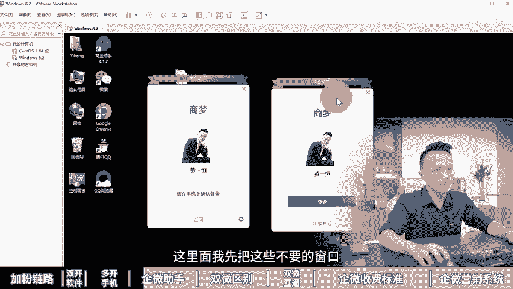
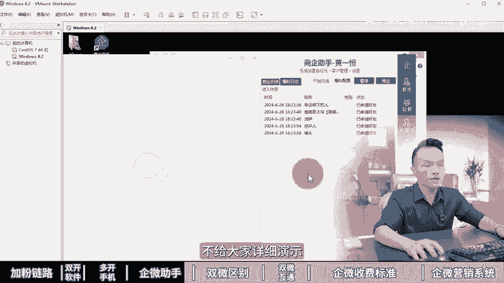
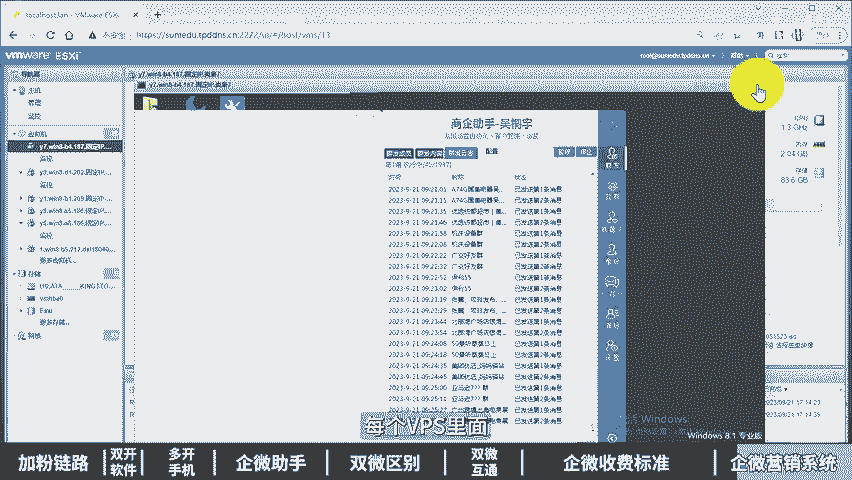

# 耗时2年测试+制作，共计58分钟《企业微信矩阵运营全攻略》企微私域运营，企微运营，企业微信使用教程，企微批量加好友，企微矩阵推广搭建，企业微信矩阵号，企业微信运 - P1 - 黄一恒矩阵推广引流 - BV1ttWfeAE9c

本视频耗时两年测试加制作，共计58分钟，为你深度分享企业微信集阵引擎攻略。从0到1学会企微集阵打法，一个人做21个账号。

从起微三大加粉链路电脑多开软件6开手机微获个助手和个定位通双再到注册21个号500个推容程玩微00微加粉链路。

企业微信天能打600粉信我们公司伙把企业微信玩的明明白白搞一堆电脑和手机天能打600猛了一般会告先收告怎样加群成员加各位好友以及加手机名单。现在看第一个加群成员。我们也称为爆粉。

他的添加途径是通过群里面发送邀请。所以首先我们得加到一个群里面。比如这个群有400多人减到管理员，我们至少。能够发送400个好友请求。接下来我们尽量的都使用这个截图给大家进行演示。

因为投屏手机啊里面会有很多ID之类的，比较容易违规，导致的视频审核不通过。当我们通过群里面发送的请求之后，客户收到的请求，他跟我们各位视完全一样的，会直接显示在通讯录新的朋友里面。

所以这种方式我们点击查看就可以进行验证，它的通过率呢是目前起微导粉链路里面通过率最高的，能够做到10%到40%之间，具体给我们的群包括验证信息都会有一定的关系。

每个号每天能够大概发送200到300个好友请求。那么这里呢必须要是正常的回章号。比如说已经养出了常用IP并且养出了常用设备，如果你没有养出IP和设备以及发送的话，很容易导致频繁，甚至出现账号违规。

同时呢咱们在发送的时候，一定要循序渐进。去提高我们发送请求的额度。这样的话。才可以挡到200到300个。那我们在操作的时候，它是需要大量的群的。如果没有群，你根本没办法去发这个请求群这一块有两种群。

一种呢是垂直群。比如说我们专门加一些行业的车友群，交友群宝妈群，业主群，这叫行业群。另外一种呢，如果你自己加比较慢，我们直接花钱去卖，买群的话也是比较快的，节省时间，还有一种是打饭分，饭分怎么换。

也就是不管什么群通通加任气，这种方子呢一般会换群，因为以500个为单位，找一个人换，有500个群，找10个人换，我们得到了什么5000个群，已经够我们报很长一段时间了。在操作的时候。

咱们可以通过软件量化，因为手动操作，说实话确实是比较累，而且你根本一天呀搞不了多少，那怎么办？像我们这里呢就给大家用软件来进行操作，我们只要找到我们比如说勾想到4个群，然后点击这个开始按钮。

它就会进行一个添加。那么可以解放咱们双手节省时间。那软件这一块呢，大家可以找找。如果是。找也可以找我，不过来家讲一下啊，这个软件是有偿的啊，不是咱们在推销软件，只给大家分享一下这种打法。

另外如果你一天想加6000个好友该怎么去做，我们需要准备20个员工号，每个员工号每天能够发送300个请求，20个员工号一天就能发送6000个好友请求。同时呢你每天至少得加20个群。

毕竟啊一个群平均下来300个人，20个群的总人数才是我们的6000人，刚好能够支撑我们20个账号，每天去发送的一个什么验证请求。这是第一个群成员，那除了勤成员之外。

我们还可以通过第二个个位来加也是可以的。它比较适合。比如说我们本身做个位挤赞，做个位事业，比如说有个10万20万30万，我们想把这些数据导到企位里面该怎么做。如果你是新手个位里面好友就几十个。

那这个方法呢，就没必要去参考了。它是将个位导为什么起微好友，它的添加途径。首样，那么。我们需要去发送这个邀请。邀请呢在我们企微添加客户里面有一个叫做从微信好友列表里面添加。我们点击一下，点击完成之后。

这时候呢里面就会有很多好友列表。你点击之后，他就会给对方啊发一个通知。这个通知呢其实通过个微单独发这个消息。只不过它会变成一个名片外加一个啊，那么欢迎通过这种方式，所以呢不管你点多少。

最终都是通过个微来进行衔接的。然后用户打开之后，他是需要进行识别添加，相当你发过去之后，用户呢，他需要来加你只是把名片推给了对方，哎，大概就这个意思。那么这种方式呢，我们在操作的时候。

是需要循序渐进操作的，不能搞太多，你搞太多，有可能把你的个位搞异常了啊。比如说每次搞10个搞完10个之后间隔30分钟，这样的话，一天搞100到200个也没什么太大的问题。那么这种方式呢。

有一个bug可以考。就是我们比如说先搞。第一个号给它绑到里面去。第一个号搞完之后呢，我们再搞第二个个位绑到起飞上面，搞完之后再搞第三个，长期可以不断的循环。不过这种得我们有很多的个位。

那么第三种就是经常同学说老师我手上有几十万的名单，这几十万的名单能不能转换为我的。通讯录啊怎么做来看一下这种呢就是添加。😡，精准意向的手机名单，它的添加途径是这样的。首先。我们打开这个添加客户。

找到搜索手机号码添加。好，这时候我们填写对方的手机号，填写完成之后，这时候呢对方就会收到一个服务通知。这个服务通知技术，它并不像我们前面讲的个位验证一样，点进就可以验证，他点进来之后呢，是一个消息列表。

这个消息列表里面还是要再点击一下，点击完成之后啊，才出现这个识别添加。所以这种方式它的通过率是目前整个企微里面加粉链路，通过率最低的，只有5%，那么最高的可能只有钥匙。因为它的步骤实在是太多太繁琐了。

你发过去之后，用户要点一次点两次点3次，最后才能够添加你很多呢都不会操作，它不像我们个位只接点个同意，也就什么搞定的。所以这种方式呢并不是特别建议大家，但是也能够通过一些，只不过呢相对来说比较少。

这种方式啊也可以通过软件操作。在软件里面，首先我们找到设置选择这个导入数据把名单。导进来导进来之后，接下来我们点击这个叫做开始添加啊，它就会把这个请求呢给它发出去。好，有些没添加的没开通的。

他也会给你一个提示。那么这里呢只是企微的一些单独打法。关于启微啊，我还准备的系统课程，教大家如何把企微玩通完清，真真正正的把企微应用起来，把它变成你的什么客户的小金库。

这里面我给大家准备了2到3个小时的一个系统课。那么教大家怎么做好企微里面包含的流量属性，推广流程，养号流程，软件配置和群里面就是讲的比刚才的更加的透彻，更加的系统，主要两个打法。第一个就是炸钱推广。

第二个爆粉推广，这个课程都是免费的，通过主页呢就可以进连起。如果你加到客户了，想学一些更加高级的打法。那我们也有2到3个小时的一个什么付费的企微课。那么他讲的更加的透彻一些，而且呢服务更好。

有专门的打卡视频，老师知道还有前途的工具，这些都可以给大家进行什么进行一个分享。第二章企业微信电脑双开软件。一个2个3个4个9个6个7个8个企业微信多开方法。

🎼能开多少个就开多少个，最近找到一款小工具，解决企业微信，多开通电，10秒钟就能开10个出来，真的好用啊。具体该如何操作一般不会告诉你先收怎么做。现在看不好用的双开方法。

很多伙伴可能找到一些方法要去改这个注册表过麻烦。对新手来根本搞不定不出来实在太多了。最主要是每天我打开电脑操作一下实在是太费时怎么？这里面给大家分享一个一键无线创建分身的方法。

我们只需要点击个按钮就可以搞定，要开几个点几次就可以了。10秒钟就能够完成。具体我来给大家演示示范一下。咱们这里面打开这个虚理机，在心拟机里面给大家做示范。我们打开这个双开器，在这里面有两种方法。

一种方法说我们勾显起微，然后点击手动多开，点一下，我们就能够。么创建一个登录窗口，再点击一下就能够创建第二个窗口。再点击一下。好，第三个再点击一下。第四个第二种方法呢，我们勾选这个自动多开。

这时候我们只需要找到这个图标，双击一下。好，打开一个再双击一下，打开一个再双击一下，打开一个如果你手术比较快，在10秒钟之内呀，就能够点开10个手段，你要登多少个就可以什么登录多少个。

是不是就解决了咱们的问题。好，这个软件该怎么去获起来，这个小工具啊是我在网上搜集的，有效的伙伴呢可以通过主页来找我，我把它分享给你多开只是我们运营启微必备的一个技能。如果我们想真正的去玩好启微。

我们还得学习启微的系统课程。这里面我给大家准备的2到3个小时的系统课。教大家如何去玩好启微，有讲到启微的流量属性推广流程，养号流程，软件。

🎼配置以及如何做企业变，主要就两个打法。第一个怎么做炸群推广。第二个怎么做爆粉推广。这个课程呢都是免费的，2到3个小时可以通过主页来领取进行学习。如果你想学付费课也有，我们还有2到3个小时的付费课程。

讲的更加的透彻，而且提供服务栏也会更好。前段时间演示有打卡视频，打卡任务，老师指导以及前到的工具也可以通过主页来进行什么学习第三章企业微信多开手机，一个手机能开6个企业微信。

原来我们做企业微信买了一大堆手机，一个手机最多只能开三个，现在手机直接就能开6个企业微信用了什么手机呢？详细教程在这里记得先收藏，一起来看我会告诉你如何使用系统底层多开有哪些多开手机值得购买。

现在看第一个系统底层多开咱们在多开的时候，千万不要去使用第三方软件。第三方软件呢。

不稳定，有时候容易掉线，甚至有的时候数据丢失，最主要还得花钱，每年得花一两百块钱。而且在使用的时候会出现限制严重者直接封号，那怎么办？我们只使用系统自带的多开，从底层上面进多开，更加的稳定。

最主要的是手机自带的，不用单独花钱，而且呢使用起来不会出现限制或者封号，为什么企业微信它是可以多开的。而个位我们一般不敢开这么多。因为企业微信不管你多少个账号都可以直接连接个wifi。

因为我们需要去养这个常用IP和设备，但是大家使用的时候，一个小技巧啊，不管你使用这个系统的多开，一定要养一段时间再去使用，至少1到2周以上，你新注册的号拿过去操作，肯定是容易挂的。

那有哪些多开手机值得咱们去购买来。比如说这里面给他家分享一下，我们自己买过的手机，比如说这个三开手机，首先。支持小米的前线。目前我们用的比较多的是个红米系列，不是小米买不起，而是红米来更具有性价比。

比如说这个红米 note的9或者polo系列，价格的话都只在什么350到450块钱，这个可以说是白菜价，建议大家购买的时候啊，至少要买这个6加64G配置以上，为什么推荐小米不推荐。

比如说像什么华为之类的。华为我们做过测试啊，它只能够给各位做双开奇位的话，开不了，也得买很多，给大家演示一下，比如现在我投屏的手机呢刚好就是一台小米，我们打开手机找到设置。那么在设置里面我们往下方滑动。

然后选择应用设置，在这里面点击应用双开，记住小米手机的系统非常开放，只要你能够安装到手机上面的应用，都可以给你双开，找到企业微信，点击按钮就可以进行双开。那除了双开之外，我们往下方滑动，找到隐视安全。

然后呢，在这里面我们选择上手机的一个叫做分身，在分身里面能够创建一个单独的隔离系统，又能够独立安装企业微信，一台手机至少就能够登录三个账号。那如果你觉得啊三开手机没有性价比。那你想买5开的行不行？也有。

比如说我们买过这个联想的Z5手机以及Z6手机，也就是我们开场给大家展示的这个手机啊，它就直接可以开5个啊。那么这个手机呢，我们因为没有连接这个投屏啊，就没给大家演示了。那么大家如果在购买的时候呢。

目前去买的话，最好是买这个Z6pro系列配置最低等6加100。28GB如果能买到8加128GB最好了。因为我们登6个账号呢，它会比较卡顿的。那么这个联想手机啊，其实它的型号已经比较老了。

因为很久都没有进行更新了，所以不太推荐大家如果要买的话，其实更加推荐这个6开手机。因为这些手机的系统要新一点。而且呢发布的时间也比这个要稍微什么更加的啊，就是说新一些。

比如说摩托罗拉的这个G34G53G54G71SS30pro，那再买的时候呢，最好是买这个8加128GB的，这个可以直接六开好，这就是这个手机的特点。大家买的时候呢啊你可以直接在某宝上面搜索。

就可以直接看到，他就打上六开手机，在买之前你可以确认一下，能不能够开起微不能开呢，你也可以不用购买。好了，购买起到呢，大家如果有经验的，可以到这个某宝某东那么某转上面直接找商家购买。那么商家购买呢。

它有保障的，毕竟有这个质保。那么一年之内有问题可以找他。如果你没有经验，那么。就通过这种平台购买。如果你有经验的话，可以自己到闲鱼上面淘。那闲鱼上面淘来。如果你不会看，有可能会翻车。

但是每台价格确实要便宜一些，每台至少能够便宜50到100块钱，甚至有的型号能够便宜200块钱以上。那么这个多开手机啊，他只是解决我们账号的问题。如果想玩好启微，这里面我还给大家准备的启微的系统课程。

那么有免费课有费课，那么免费课里面会讲到启微的推广流程养号流程，软件配置以及做群页变，那么2到3个小时系统课程。因为咱们更新到这里，大家也没耐心看完。所以大家如果想单独学习的，可以来找我免费分享给你。

如果你想直接学习更高级的打法，一天加更多人的方法，我们给大家准备的费课费客里面的服务更好。那么有任务有老师指导，而且还有1战演示，同时呢还提供工具给大家，也可以通过主页来进行找我。

第四章启微获客助手企业微信还在手动加粉太累了太累了。现在有企微助手配置好软件点击开。软件就自动保幕获客，真太爽了，具体该如何操作详细教程在这里记得先收藏，一起来看。我会告诉你使用奇微助手前的设置。

怎么配合奇微群发报本助手来获克。现在看使用奇微助手前的设置。当我们在使用软件的时候，它的一个安装个版本，是必须要使用4。1。2的版本。如果是最新版是没办法进行使用的。咱们拿到软件之后给大家演示一下。

首先我们先安装4。1。2的版本，然后呢再安装这个双级助手，安装完成之后，这时候咱们桌面就得到图标。接下来我们双击打开软件。如果是第一次打开，它会加载比较慢，大家也可以稍微等待会。

最好是安装完之后重启一下电脑，你再打开这样的话，功能才正常的。打开之后，接下来我们就可以直接进行一个登录账号。如果你需要多开，我们再双击这个图标，这时候呢它就可以什么开两个窗口出来。

你想开多少个就双击多少次图标就可以了。好，这是软件的一个多开方法。那这里作为演示，我就直接开一个。接下来我点击这个登录按钮。好，点击完成之后，我需要在我的手机上面。点一下这个确认操作。好。

我们来打开手机上面。然后呢，在手机上面确认操作。如果你第一次打开的话，它是一个二维码，你需要去扫码之后才可以进行登录。这里面我先把这些不要的窗口给它关闭掉了。打开之后，如果你的群货者字源比较多。

它刚开始加载的时候来告诉大家是非常非常慢的。我们需要耐心的等待一段时间。好，接下来我们还需要做几个比较重要的操作，什么操作呢。

首先我们需要取消这个自动更新。如果你的软件它定期会自动更新到新版本，到时候你又得安装，比较麻烦。给他演示一下。我们打开软件找到更多点击啊点击头像，在这里面点击设置，在设置里面点击通用。然后呢往下方滑动。

把这个自动更新给它取消掉。这第一个第二个呢，我们需要设置消息，免打扰。因为我们加了几万个群之后啊，这个群消息来，会把你的汇报窗口全部占满掉，根本没办法正常操作，那怎么办？

我们需要合并这个免打扰的聊天窗口。好，咱们打开之后，还是一样，我们滑动找到上方有一个合并免打扰的聊天勾选上这里你会发现。你看这里面的消息，它自动会跑到一个窗口里面，一些不是很重要的。

你就给它合并到这里面哎，就可以了。好，这第二个这两个设置完之后，我们就给擦掉了。接下来第三个就是定期心理文件，特别是的伙伴加了几万个群。这个电脑的硬盘直接就干满了。老怕你的电脑是一个T，两个T三个T。

它都能给你干满，那怎么办？这时候我们需要定期的最好是隔三差五的，每周去清理一下文件，我们打开我的电脑，然后呢找到文档，在文档里面你可以对照这个路径，有个WXwork的一个路径。好，我们来打开一下。

打开这个路径，然后找到这个机开头的文件，再进入到S的目录和打开之后，这里面有一个S开头的目录。啊，这里面的文件呢，现在用我刚登录过来，没什么大文件。如果你用了一个页。

你打开一看这里面文件显示500个G800个G，赶紧把它删除掉。这个删除记住，它是不影响我们的一个啊聊天记录，这些的，它仅仅只是一个缓存的临时文件，好，这是使用前的设置。接下来。

我们怎么去使用这个群趣微的群发助手？首先这里面的软件，最主要的功能呢是两个。虽然这个软件右侧啊它是有很多很多的一个功能，但是我们用的最多的就是这个群发和这个真粉功能。那群发的话，它可以帮助我们发好友。

发外部联系人发群主可以发文本链接小程序名片，各种各样的都是可以接近行发送的，给大演示一下。比如说我们要发外部联系人好，直接勾选之后，然后呢点击这个群发内容，在这里面添加上我们的内容。

添加上表情就可以进行发送。如果你要发群勾选上之后，然后呢在这里面就可以进行一个什么啊发送。这里给大家演示啊，我们特地登的一个数据比较少的。因为它多会的有些名称啊，容易违规。好，这是第一个功能。

那么第二个功能呢，也就是我们用的比较多的一个叫做报粉功能去真粉。首先如果你想做报粉，你要先去找群就是加群的，群从哪里来呢，一般我们是换群的。先买种咨群，通过种咨群换群，500个为单位，换一次有500个。

那么换群的话是需要单独配合另外一个软件。所以做起为需要两个软件，一个就是我们刚才这个软件，另外一个是单独的一个换群软件。那么这个软件虽然它上面也会有一个叫做啊那么拉群的功能，但这个拉群的功能呢。

它是会有一定的这个啊限制在里面的什么，就是拉不了多少个啊。如果你一天想拉500个，它必须要搞单独的接口，单独软件啊才可以实现。然后来，每个账号每天能够发送100到300个好友请求。

那么这里面呢必须要是我们正常活跃的账号，就是养猪常用IP，并且养猪常用设备。如果你的号已经养出了IP和设备还发不了300个，就是因为刚开始发的太多了。我们要循序渐进。比如说我们前期第一天发10个。

第二天发20个，第三天发30个，第五天发50个，第十天发100个，第二0天发200个，第三天发什么300个，它的这个请求是可以不断的叠加，是可以扩容的。但扩容就是你要循序渐进。如果你一下干300个。

说实话是干不了的那怎么操作给大家演示一下啊，我们打开软件找到我们这个叫做真粉功能，比如说我们需要增这个群的人，然后呢，我们勾选这个群，然后选择爆粉配置，这里面可以设置啊，相在间隔。如果没有要求。

那我们啊勾选上不加起回，然后点击确认。接下来我们点击开始按钮，它就会自动的帮助我们去发送这个请求，整个过程呢都自动的啊，不需要管理，你只要隔几个小时切换第二个账号。你也可以两三个账号同时进行什么操作。

毕竟它是可以进行什么进行多开的啊。各伙伴好了，刚才我们给大家讲的是这个软件的使用。那么这个软件呢其实还有很多其他功能。但这些功能说实话，我们用的都非常少。最主要的就是这个群发和成本功能。

所以其他功能呢在这里面我也不占用大家时间，不给大家详细演示感兴趣的伙伴可以自己去研究一下这个软件如果你需要的，你可以找我们，我们可以可以把这个软件分享给你。只不过这个软件呢它是有偿的啊。

并没有免费的提供，这个大家需要注意。另外如果咱们想玩好企微。关于这个软件也不行，你得学会一些企微的核心打法以及策略，这里面我给大家准备的免费的系统的企微集成课程，教大家如何做企微体战流量属性推广流程。

养号流程，软件配置以及如何做企页变。这个课程呢通过主页找我，我就可以把它分享给你进行学习课程大概有2到3个小时。如果你把企微做好了，想学习更高的策略，我们也有付费课程。

🎼想着免费个展，先让你搞到客户，付费个程呢，可以帮助大家把一些细节做的更到位，学会一些高级打法，有打卡人物老师指导，还有视频以及实战演示。最主要的是有配套的资眼和工具给大家进行提供。好。

这些呢都可以通过主页来领取进行学习。第五章企业微信和个人微信区别。你是不是一直纠结用企业微信还是个人微信，今天给大家掰开揉睡的，讲清楚企业微信和个人微信到底有什么区别。搞明白了，两个可以打通一起用。

做双微式流量，让客户既在我们的企业微信好友列表里面，又在我们的个人微信好友列表里面该操作详细教程在这里记得先收藏。这里根据我们多年操作经验，给他整理的一个级别表格。

可以先截屏保存方便后面查看在个人微信他经典形象是打造个人IP企业微信经是公众形象所个人微信它适合做么定位？比如说我们做个人卖货或者打造个人IP用个人微信如果我们做大流量承接，比要承接几千上万的流量。

这时候你用个人号分流，你没有这么多账号怎么就使用企业微信来进行承接。者我们给客户提供售后服务的，用企业微信经营企业形象更加的专业而且还能够提高服务品质。个人微信他的好友数量来上线是1万。而企业微信。

他是没有上限的，只不过企业微信目前他的好友位超过2000以上，一个好友位是需要一毛的坑位费。如果你加的很多很多，那每年呢这里面也是一笔开支，个人微信咱们注册使用都是完全免费的，不用花任何的费用。

企业微信首先每年的认证需要300块钱。然后坑位费一个好友位呢，它是一毛，而且这个每年都要交，并不是说交一次后期就不需要了。个人微信我们需要进行实名一个人呢可以实名5个账号。

而企业微信它首先管理员需要做一下认证，认证完之后呢，个人需要进行实名。这里企业微信和个人微信，它两者的实名是不冲突的。比如说一个人可以实名5个个V又能实名5个企微加起来一共是10个账号。那最重要的来了。

个人微信我们再给客户，比如说发这个激活消息的时候，他的回复率啊整体是比较高的。因为发出去之后，他给你的感。感觉像是一个朋友活生生的人给你发送的。而企业微信发出去之后呢，他更像是一个商家发了一个广告。

所以经过我们测试个人微信发出去，比如说有50个人回复，企业微信呢有可能只有5到10个人回复降低了好几倍。其实个人微信，它的三成力量，大概在5%到10%。比如说我们加了5000个好友，大概我们做了。

半年去检测一下僵尸粉，会有5%到10%的人把我们删除掉。而且微信呢我们做了测试，比如说搞了半年之后，你去检测一下夸张的有个账号能删除50%，这个什么意思？相当于你加1万个人。

有5000个人都把你删除掉了。如果你做的比较好的呢，可能稍微低一点。那么个人微信它的成交率啊是比较高的，因为他给你的感觉就像是朋友在聊天，是里加了一个什么，加了一个活生生的用户啊，加了一个真实的人。

而企业微信呢更多的像加了一个商家，就像是一个广告机器一样，所以企业微信啊，它成交率是比较低的。这一块呢，我们是有一个非常大的体会。因为有一段时间我们公司的各位啊封号特别严重。

有天来公司之后直接就封了10个账号，那怎么办？感谢也解不开，没办法，只能赶紧启用应急方案，用奇位来进积粉，一接就接了大概接近一年的时间，结果这一年时间呢就发现了一个问题。刚开始这个成交。还没什么变化。

但是啊三个以后这个成交就逐渐的往下进降，客户也在加，但是订单比较少。半年以后呢，特别是下半年这个成交率啊比以前直接降低了好几倍。后面我们开了会讨论的时候才发现，原来是企业微信的这个什么回复率低。

删存率高。然后呢打造新的时候呢，一种商家的感觉，用户比较反感。所以很多客户啊不愿意跟你聊，导致成交率比较低。所以大家如果在做的时候呢，并不太建议单纯的用企业微信啊来进行一个成交转换。

它的成交率啊会比较低。那么个人微信的朋友圈呢想发多少条就发多少条。而企业微信你发的前三条，他在朋友圈里每年刷到你叫主动朋友圈超过三条以上的话就发不到你了，必须要打开你的这个资料页才能够看到你的朋友圈。

所以呢如果你做企微朋友圈这一块。重要的只发在前三条里面。那么个人微信它的微信群的话，里面能装500个人。但是在企业微信也能装500个人，只不过它有一个高级的营销功能，这也是比较好的。

比如说可以设置入侵欢迎外加自动回复，还可以设置防骚扰。比如经常同学问到，经常有同行混到我的群里面来去加我的名单怎么办？那这种就可以用企业微信来建群，直接就可以在企业微信里面进行设置。

防止什么群成员进行互加，那么个人微信呢，如果你的账号被限制了，封掉了是需要好友辅助的，现在辅助的条件非常苛刻。有的时候啊你找了好几个都不符合。而企业微信到达时间自动解封，一般最多放一个月。

比如说你放20天20天之后自动就解开了，都不需要去找人辅助。那么个人微信呢他是没有客服的。如果你想联系这个微信的客服啊，说实话是非常难的。有的时候我们花了一天时间打电话，一天时间就接通了一次。

有的时候都没接通。实际上最难的事情。开玩笑就说就是打腾讯的客服了。而企业微信如果是管理员账号，他是有专属客服的，工作时间，你一发过去，基本上都能很快的给你回复。那么个人微信呢，他是没有离职继承。

所以一般员工进来之后给他单独分配一个微信号，分配完之后离职的时候会让他把这个实名解除掉，解除掉之后呢，再把账号分配给另外一个人，千万不要让员工自己搞账号，否则他离职的时候直接带走了。

而企业微信那么当员工离职的时候，可以直接做离职继承，转移到其他账号。那看到这两个伙伴有个答案，看来还是得用各维。其实现在呢个维和企微可以打通一起用，做一下好友互同。那怎么做？

这就是我们接下来要讲的双微C流量。怎么实现来给大家看一下。首先。我们打开投币手机，这里面呢，我特地让我们公司的同事加了我的这个账号。然后我们打开一个验证啊，比如说这个验证打开之后。

你会发现在我的验证里面，它多了两个选项，一个叫做前网验证，一个叫做企业微信验证。而你的里面只有个前网验证，这就是我们做了双AC流量。然后我们点击这个去企业微信添加对方。这时候我们打开。验证好。

然后点击这个通过验证选择这个完成，我们就实现了企业微信的好友列表。那么接下来我们再返回到这个里面，你会发现现在只有去企业微信发消息，这是因为新版的微信啊都做了限制。我们返回来之后，打开刚才的列表。

点击回复，在这里面卡个bug，我们知要回复个表情或者数字，点击确认。接下来我们返回来之后，然后呢它就出现了接收按钮，我们接受一下，然后点击完成，这时后我们就实现了双微式流量。

你可以看到客户既在我们的启回又在我们的个微里面。那这个双微视流量到底该如何去进行设置啊。那么这个大家如果感兴趣来，可以翻一下我们其他的视频，我是有一个单独的视频去教大家怎么做双微视流量，讲的非常详细。

这里面呢就不详细给大家演示了，这告大家我们在选择的时候不用纠结，两个一起用是最好的，可以获得个人微信的优点，就能够获得企业微信的优点，缺点呢也能够得到一个弥补。第六章企业微。和个人微信互通。

没想到打开这三个选项，就可以让企业微信多加两倍的客户。比如你原来一天加500人，用了这个方法，就可以一天加1000人。很少有人知道今天我来告诉你详细教材在这里记得先收藏。

首先来看如何让企微和个微实现互通。这里咱们分享的互通方法是实现好友互通。当客户在添加我们的时候只添加一次，我们可以一起同意企业微信和个人微信，相当于客户既在我们的个人微信好友列表里。

又在我们的企业微信好友列表里面，这时候如果客户他的好友列表里面会显示两个账号，一个是我们的个微账号，另外一个是我们的企微账号，后面会显示一个艾特咱们的企业。那到底该如何设置，才能够实现双微C流量呢？

他需要满足几个条件。第一个我们的企业微信需要绑定个人微信。

我们找到企业微信，打开账号也安全，这里面显示微信这一栏，如果是空着的，你需要点击一下，然后去绑定一个你需要同意的个位账号。绑定之后，第二个条件。

企业微信需要开启接收个人微信的好友请求这一个选项默认是打开的，可能有的账号来被关闭的，大家可以检查一下，找到企微的连系权限，在这里面找到接收我在微信收到的好友请求，把这个选项给它打开。第三个条件。

我们的个微必须要开启好友验证。如果你关闭了好友验证，它是没办法实现的。所以咱们打开个微的朋友权限，在里面找到加我为朋友时需要验证，把这个选项给它打开。当这三个选项满足之后，我们就可以实现双微申流量。

但目前呀有的同学会发现，我这三个都设置的。但是呢同意完企微之后，个微，它就没办法同意了。只会显示一个到起微期什么发消息，那怎么办？那么现在新版的微信，它已经关闭了这个双微视像入口，那该如何去做？

其实呢有很多个方法可以实现。比如说如果你的个微登录到了电脑版，你可以在手机上面同意完之后，然后呢再跑到电脑上面去同意个微的请求，相当于我们在手机上面同意启微电脑上面同一个微。

第二种方式呢是回复之后再同意。因为我们很多条件啊都是没有去同时登录电脑了，那怎么办？来给大家演示一下，第二种方式该如何实现。比如这里。我打开腾讯手机，我让我们公司的一位同事加了我的这个账号。

咱们点击打开，打开之后，它会显示一个前往验证，去企业微信添加对方好友。你会发现它会两个选项，这两个选项，就是因为咱们做了双银式流量，正常的账号呢，它就上面这个选项。接下来我们点击这个去企业微信添加对方。

好，这时候因为我在企业微信做了双开。我选择我需要同一的账号。这时候咱们点击这个通过验证，点击右上角的完成。好，这时候我们已经添加对方为什么企业微信的好有列表。接下来我们返回到刚才的窗口里面。

返回之后容会发现它只有一个去企业微信发消息，没办法同意，那怎么办呢？有一个小技巧，我们可以卡一个bug，打开这个消息，然后点击回复。在这里面随便回复一个表情，回复一个数字，点击发送，发送完之后。

我们再返回来。这时易发现它就多了一个接受按钮，直接点击接受。然后点击这个完成，哎，这时候我们就可以实现好友互通。接下来咱们可以来看一下，这是我们企业微信的好友列表，这是我们个人微信好友列表。

我们添加的同一个人，我们既可以用企业微信给对方发消息，又可以用个人微信给对方发消息。这就是咱们讲到的，如何实现好友互通，做双微深流量。当我们学会了这个技巧。如果想真正的玩好企业微信。

我们还是要去学习齐微的系统课程。因为这个视频啊时间有限，没办法给大家系统的去讲解这个起微起微的课程呢，我们做成的2到3个小时的系统课。那么有两个版本，一个是免费版，一个是付费版。

大家前期啊可以来找我学习这个免费版的课程，先帮助大家把企微的系统搭建起来流量属性推广流程养号流程，软件配置以及怎么做群里面主要就是做两个推广。第一个就是加几万个群在里面干广告。第二个呢，在群里面去报粉。

报一些精准的。那这个系统课程怎么去学习，非常简单，通过主页找我就可以什么进行一个学习了。如果你想做更加高级的打法，比如说你的好友想增加的更猛一点，更快一点。那这时候咱们可以通过付课。

付课来提供的服务也更好一些啊，前程实战演示，每天打卡视频，作业任务，技术老师指导，还有钱到的工具，这些也可以通过主页来进领取进行学习。第七章企业微信收费标准，一年多少钱，又当烟大头了。今天聊了一个学员。

一年在企业微信上要花10万。

🎼聊了才发现很多花的都是冤枉钱。今天给大家掰开揉睡了，讲清楚企业微信收费标准到底有哪些。🎼注意哈，这里讲的是官方明码标价的收费标准，不包含第三方应用视频有点长，记得先收藏。一起来看。

我告诉你哪些是必须要交的费用，哪些是可以选择，不用交的费用。首先来看第一个认证费用。这时我们在注册企业微信之后，需要强制缴纳的认证费用，它有三个档位，比如说如果我们的员工账号在1000个以内。

每年需要做一次认证，费用是300块钱。那如果我们超过1000人。但是呢在一万人以内，每年的认证费用就需要花3000块钱一次。那有的大型企业，它的员工账号达到了1万人以上。

这时候每年的认证费用都得花费3万块钱。认证这一块呢，如果咱们的账号每年到期之后没有做认证，它就没有办法去新添加好友。但是里面的这些联系人都是可以正常去联系。只不过有一些高级功人。没有办法进行使用。

第二个叫做外部联系人。外部联系人，也就是我们在添加各微好友的时候，这个也是需要按人头进行收费的。目前的话是2000个联系人以类是免费的。相当于比如说现在我添加了2000个个微的外部联系人是不用收费的。

但是如果超过2000以上，这时候咱们不缴纳费用，你就没有办法再进行添加。那2000以上它是怎么进行收费呢？这里面有多个档位，比如说如果咱们一年5000个好友位，每年需要500块钱。

如果是2万需要2000块一年，如果是5万需要什么？5000块钱一年，这个需要根据我们自己的情况来定，大家刚开始可以选择一个比较低的岗位。当我们的外部联系人数量比较多的时候，再升级为比较高的一个档位。

另外如果你是专门做这个企微群推广个营销的。记住，你加企微群，哪怕我们里。加了1万个群，他也是不会占用这个好友位，相当于做群营销呢，他是不需要收费的。另外我们在操作上。

其实很多伙伴都是在这里面也花了一些冤枉钱。这个啥意思？相当于我们在操作的时候，可以定期去删除一些单项好友，什么意思？比如说你玩的企业微信一年，一共加了5万个好友。

这5万个里面有可能会有1到2万已经把你删除掉。那怎么办？我们可以把这1到2万的单项好友给他清除掉。因为你不清楚放到里面其实也没什么作用。这时候呢我们就可以减少费用。这个在什么地方清除。

我们打开企微的员工号，找到我们的一个外部联系人，找到我的客户，在这里面我们点击这里的全部客户，他就会有一个选项叫做单向客户，也就是对方开启免验证，且添加你或者对方已经删除你。那这种客户呢。

在我们个位里面称之为僵尸粉，可以直接把他什么清掉。也可以帮助我们节省一您的费用。那么这两个认证费用和外部联系人，他是必须要缴纳的，也就是强制需要交费的。后面这些呢都属于可选的。如果咱们用不到。

可以不用选择。也就意味着咱们在使用企业微信的时候，前期一年300块的认证费，你得交超过2000人以上，哎，这时候呢，我们得按照这个人数来进行收费。比如说假设我一年也就几千个客户，那我可以买一个2万档的。

每年2000块钱就搞定了，然后定期再删除一下单向好友，这样呢可以帮助我们节省一定的费用。那么第三个交做什么办公电话，办公电话，不像原来，我们如果想搞个公司电话，得联系这个电信移动联通，搞一个座机。

那现在呢有了这个企微办公电话，他是由公司统一交费。每个员工都可以使用这个统一的。座机电话号码，这个号码呢它是固定显示的，每个员工会匹配一个分机号，通过相应的分机号就可以找到匹配的员工。

可以用于对内或者对外的电话沟通都是比较不错的。而且价格收费来，我更觉得还是比较划算的，毕竟6分钱一分钟，比很多电话都要便宜。因为很多固化座机都是按这个一来收费的，你打不打都得固定交这个钱。

那第四个叫做效益套件。效益套件，也就是我们企业。比如说想使用它的邮件功能文档功能和微盘功能，这些功能就统称为叫做效益套件。那么效益套件它其实也是有这个基础功能的。比如说哪怕你不收费，也可以用它的邮件。

但这个邮件呢是有限制的。比如数量限制容量限制，每天的发送限制，哎，都是有的。这个我们在开通的时候，它是会有一个功能对比。比如说咱们如果是默认的功能，邮箱的总容量只有一个G。然后呢，每天最多发500方。

并且这里面有很多高级功能都无法享用。如果你开通的高级功能，那么就可以享受20G的什么超大附件，然后呢，无限容量，同时每天你发的这个外发性的话，它也是没有这个限制的。

同时呢也不限制的IP你一个IP发多少方，它都是没有什么限制的。那么这个邮件功能一个人记住，他就每年收费190块钱。也就是说如果你有10个员工每年需要缴纳1900。如果100个员工。

那每年就需要缴纳19000块钱。那么第二个呢叫做文档，文档，也就是我们使用的一个在线文档的一个功能。那在线文档它每年是按200块钱一个人头进行收费。我们来对比一下功能。如果是免费的呢。

它首先容量只有一个级，同时啊这里面很多的功能都无法进行享受。比如说加水印呀或者管理这个文档都享受不了。而且操作日志呢只有90天。那如果我们开通的高级功能就可以享受无线容量。

所有高级功能都可以什么享受到这里因为咱们在截屏的时候，直接了一部分，大家如果在开通的时候，在起微的管联后台是可以直接看到这些什么相应的一个功能。那么第三个是微盘，微盘也就是我们在给客户发文件的时候啊。

直接放到微盘里面，客户点击来就可以进行下载。那么这个微盘啊，每个人每年的费用是210块钱来做一下功能对比。如果咱们是免费版的话，微盘的总容量只有20个G。对于普通用户来说，我们其实。不上传大文件。

20个G呢也是够用的那如果我们需要上传一些大的文件，20个G完全不够用，这时候就得去考虑开通这个微盘的高级功能。然后微盘的容量呢，它是按照需要来进行收费的。也就是说你买多少用多少，不同的容量。

它的价格呢也是不一样的。好，这个是。效益套件。接下来看一下高级会议。高级会议啊，就是我们在使用企业微微信的时候，它是可以直接进行一个在线的会议。首先，在线会议它是按人头进行收费的。

如果咱们想使用这个在线会议，每个人的人头费，每年是40块钱。如果咱们是100个人呢，这里面就得每年花费4000块钱的啊在线的会议费。那除了人头费之外，它还有一个在线会议室，在线会议室是什么意思？

比如说同时在线的人数，如果买了100个人，但是你的这个在线人数啊，参加的时候超过了50个人，你还得再买1个4788块钱。如果100个人全部都参加，那我们每年还得再花1个5988。所以这些地方的钱啊。

只要你想花，基本上都能花得出去。好，这是高级会议。不过这一块呢，现在因为高级会议啊，只有大企业会用到小企业的话，很多都是直接啊，比如说通。通过微信的视频会议来进行的。那另外来看一下线下培训。那线下培训。

比如说因为这个启位的功能呢，如果你熟悉完之吧，也是比较简单。但是对于刚开始用启位的伙伴来说，这企位的功能呢，可以说是看不头的，那怎么办？这个时候官方也提供了这个线下上门的服务。

那服务内容就包含了比如说线下专属的服务，给你提供一个顾问，然后呢，服务商来到你公司里面指导你的员工进行使用啊，拿到手之就可以进行操作。那么单次上门的费用的话，是1000块钱啊。

如果一个季度啊需要进行上门是3980块钱。如果一年都需要进行上门，那么是12980块钱。那这里面上门呢，他还是有这个相应的次数限制。这个大家在购买的时候就可以了解到。好，再来看一下这个绘画存档。

那么绘画存档主要是用来查看员工和客户的聊天记录。那有的企业他需要检查。员工在给客户提供服务的时候，有没有把这些服务做好流程有没有标准化，或者服务态度怎么样啊，就可以去查看这两天记录。

这个聊天记录呢是不需要把这个员工账号拿过来看的啊。我们直接总后台里面啊就可以看到某个员工的记录。那对于普通小企业来说，一般我们都是直接把员工的这个呃手机拿过来，然后在上面翻页就可以了。

可以知晓员工啊删除后的动作，包括一些其他操作。那这个价格呢也不便宜一个人如果你想看的话，每年就得缴纳900块钱。那如果咱们买10个人一年就得缴纳9000块钱，这个费用呢啊对于大企业来说，可能毛毛也。

但是对于个人刚开始做项目的小企业来说，这个费用呢还是不小的啊，再来看一下数据保障。那数据保障，它的场景主要是用于比如说有些员工啊他生气了跟老板吵架了他突然就自动。离职了，跑路了。

这时候他把你的客户全部给你删除掉，或者把你里面的什么文件，各种数据给他删除掉，包括一些办公的数据，甚至有些夸张的，他有管理员权限，或者拿到管理员账号，直接给你的企业解散了，导致你呢一夜回到解放前。

那这是怎么办？那么这种行为特别些大公司里面，因为人多了吧，什么人都会有，那这些行为一切皆可恢复。但它的价格的话，每年是5800块钱，只要你交钱，那么可以给你提供保障。额外的数据恢复了。

比如说你有些特别的数据，如果你需要单独恢复的话，他每次的收费的话，是接近什么8000块钱。所以看到这点的伙伴觉得一年花10万在企业微信上面啊，真的可以说是洒洒水轻轻松松了。好来看最后一个。安全功能。

那么安全功能啊主要就是比如说保障公司的文件防泄露。那么当我们的文件发给员工去看的时候，发给客户看的时候，它上面都会自动打上这个明水印或者暗水印，这些呢，咱们可以进行设置，另外还可以远程管理员工登录设备。

比如这个员工他有没有在其他地方去恶意的登录咱们的账号，在后台也可以直接管理，还可以把它提下线。那么这个价格呢是200块钱，每人每年啊，如果咱们有10个人，每年也得花费什么，2000块钱。

100个人呢也得花2万。好了，各伙伴，那么刚才给大家讲的这9个费用啊，就前两个是必须要交的。后面这些呢啊，像我们自己在用的时候，基本上都很少用到。因为我们毕竟啊专门就是晚起微的。

对接功人啊熟悉一下就可以了。有的功能呢啊其实用不到，主要还是什么公司太小了，如果几百上千人的公司啊，一年在起微上面不花个10万。都什么都对不起他开发的这些功能。那另外对企微这一块。

大家如果想彻底的把企微给它玩透，我们给大家准备的启微的系统课程。这个系统课程分为了两种课。因为今天给大家讲的这个时间有限。没办法说啊把启微的所有功能全部讲完，讲完了可能没有量心看完啊。

所以咱们有单独的这个企微系统课程，有两个，第一个是免费的，免费的也会教你，比如说企微的流量属性有哪些，怎么做推广流程，怎么养号，怎么配置软件，怎么做群裂变，反正启微就是像我们目前做的最多的两个推广啊。

第一个就是做这个炸群推广，加几万个群在里面炸广告。第二种呢就是什么报粉推广，加群之后，那么报群才研，一个号每天能够啊报300个人。如果你有10个员工号的话，一天就能够报3000个人，20员工号。

一天能够报6000个人。那这个免费课，大家如果想系统化的学习，大概有2到3个小时啊，学完之后你也可以去对照的落地操作，那么可以通过主页来找我领取这课程。进行学习。那么如果你觉得说哎免费课。

这个我学会了啊，我想学习一步到位的，有更高级的付费课，那也是可以的。那么付费课呢相当于我们提供的更好的服务。比如说前瞻的实战演示，还有打卡视频，还有老师给你布置任务，还有一道问题可以找指导师指导。

同时呢里面用到的全套工具和资源，我们都配套提供，所以比免费课程的服务这一块呢做的也会什么更好一些。那这一块也可以通过主页来领取什么进行学习。第八章企业微信营销系活，一个人来玩20个企业微信。

每天人家6000人，我们公司合伙人，只做企业微信打粉，一多就4年，现在每天人加6000人，真不可思议，你逼既怎么做的视频有点长，既得先收藏，一起来看，我会告诉你企微的两大玩法，如何注册201个账号。

每天换500个群进行炸情爆粉推广。首先来看企微的两大玩法。

我们可以做炸群推广，20个号加上4万个群，每天在群里面轰炸两次广告，或者做报粉。每个号每天能够发送300个好友请求，我们准备20个账号，每天就能够发送6000个好友请求。这里面咱们在做的时候。

是以量起身量变才能自变。如果你的号比较少，群比较少，好友请求比较少，效果呢也会大打折扣。如果咱们单独做这个炸群推广，它是不占好友位，也就是我们不需要单独买好友的Q位费也可以玩，一起来看一下。

我们是如何操作的。这是我们目前正在操作的企业微信集成推广。我们是自己加购的服务器开设了20多台VPS也就是虚拟机来进行操作，节省电脑资源。我们打开来看一下。好。

比如这一台我们打开之后可以看到目前正在通过软件进行一个炸群推广。目前这个企业微信里面一共有1900多个群，我们配置好之后只需。在软件里面就可以实现一个自动的进行炸停推广。

每个VPS里面我们会挂2到3个企业微信。

20个VPS就可以挂40到50个企业微信来进行推广和宣传。好，比如这一个里面目前就是挂了两个企业微信，然后呢配合软件，正在进行一个自动的啊诈群推广。好，这个也是目前正在发送到84个群。

这些我们都设置到定时，每天只需要那么维护一下软件，它就会自动的去进行一个诈群推广。那么这样的话，我们是搞了几十个账号加起来有上万个群。那如何注册21个账号。首先我们需要准备一个注册的主体。

可以是个体户营业执照，也可以是企业的营业执照，个体户大家可以直接在某板上面花200块钱就找人办理，也可以到当地直接出点工本费，自己跑腿也是可以办理的。当我们有了注册主体。接下来我们需要去注册企业微信。

第一个账号默认就是管理员账号，管理员账号它是用来创建和添加员工账号，建议大家不要做任何营销操作。管理员账号一旦出现异常。你这个主体直接就封掉了，相当于就没办法。再往下进行操作啊，员工号出现问题。

我们换一个员工号继续可以操作。那么第三个，我们需要准备20个操作的员工账号，需要去购买20张零业收注册卡。这个大家也可以直接在平台上面进行搜索，差不多价格在5块钱左右一张。

买20张呢需要接近花100块钱。一个人可以使用5个账号，如果你搞20个账号需要找4个人进行使名，这你的实名，它和个位是不冲突的，个位和起微我们各可以什么使用5个账号，同时我们在操作的时候。

需要准备至少是其他手机，那么手机呢目前我们用的比较多的是这个红米note8或者pro。那么350到400之间，红米note9或者pro。

那么价格呢在这个450到500之间配置都建议大家购买这个6加64G的配置以上，配置太低的话，操作起来会比较卡顿。那么你也可以直接购买这个像比如说摩托罗拉有一些手机，可以直接开6个，但是价格呢也比这个。

要稍微贵一些，为什么推荐红米手机给大家？因为他一台手机至少可以登三个账号，不接入任何软件。我们给大家投屏演示一下。比如说我们打开手机在手机上面设置，找到应用设置，往下方滑动，点击应用分身。

在这里面我们直接勾选企业微信就可以开两个出来。接下第三个怎么开呢？我们找到隐私已安全，往下方滑动，点击这个叫做手机分身，就可以创建一个手机子系统，在系统里面又能够单独安装起微。

又能什么多开一个一台手机呢，可以登3个。刚好我们这个配置呢基本上能够满足我们的基本需求。当我们有了账号之后，接下来还需要养一下常用IP和设备，至少要养两周以上。如果你直接拿过来操作，基本上都会异常。

甚至直接就挂掉了。那么起微呢它是不需要换IP的。不管你搞多少个账号都可以直接连接一个wifi。因为我们需要养常用IP所以这个点的话还算是比较友好的，不像各位需要把它分开，否则呢容易被关联。

当我们有了账号，接下来需要每天切换500个群，怎么换取，分为三个步骤。第一步，我们需要去买这个种子群。种子群，如果你加了群里面有很多人都提供这个服务，一般价格在200块钱，200到500个群。

实在找不到的同学也可以找我，不过呢是有偿的。另外当我们有了种子群之后，接下来在群里面就会有大量的人，他们都在换群，你找他们换就可以了。群里面有N多换群的，一般起换群的都是500个去换500个为单位。

也就是说你找一个人换，立马就能够裂变出500个群出来。每个号建大家放什么1000到3000个群。也就是说每个号你需要找2到6个人进行更换。那么在换的时候，如果号手动操作的，比较麻烦。

因为我们在换群的时候，首先如果别人找你换，你需要去什么，拉别人进群，别人拉你这个你需要自己同意500个。说实话，点击起来还是比较费时间。所以这里面一般我们会配合一个软件。

他自动的有人拉你他就会自动的进群。如果你需要拉别人，可以直接通过软件一键就能够发送500个请求过去。不过呢这个是有时间间隔的，大概你等个半个小时，一个小时哎，就发完了。发完之后，那么我们就搞定了。

就不需要纯手动去点。因为纯手动点的话，说实话这个工作量呢其实还是比较大的软件呢，大家可以单独找一下这种软件一般价格在300到600左右，实在找不到呢，也可以来找我，我还能给大家一个优惠啊。

好来正咱们不是卖软件，只是给大家分享方法。当我们有了群之后，接下来就可以每天做这个炸情爆粉推广。首先每天可以炸4万个群，那4万个群怎么不要？炸？比如说每天上午和下午可以在群里面轰炸一波广告。

那么手动群发比较慢，这里面呢咱们还得配个另外一个软件。这个软件呢叫商旗入手，跟刚才换群的不是一个软件，它能够实现一键挂机群发，我们只需要选择群发的成员，比如说勾选500个群，1000个群。

然后呢添加上内容，点击开始之后，软件自动就帮我们进行发送。那在发的时候，有的伙伴说，那么被踢了怎么办？好，被踢了之后呢，我们可以。不用管，因为每天都会被踢，我们只要每天换500个群。

哪怕你一天被踢了300个，你还得到了200个群，所以换群的速度永远是比别人提群要快。毕竟我们一次换就可以是以500为单位的。那么第二个呢每天要报6000个人，6000个人怎么报。

他比较适合做一些比如说你加了行业群地方群或者说是什么宝吧群交友群，车友群，这种是细分的群可以直接报。另外如果你做的是受众比较广的产品，范围也的转换，那什么群都能加，反正有群咱们就进进来之后直接开报。

每个号每天能发送300个左右的好友请求，20个员工号，每天合计就能发6000个好友请求。那这里面咱们在发的时候来，说实话，如果你靠手动操作起来，其实也是比较辛苦的。最好是能够配合上软件。

就刚才给大讲这个商情助手，这个软件呢，他只需要勾选上，比如说我们勾选上这三个群，然后呢点击开始之后，那么这三个群加起来也有000多人，他就直接报了什么。给00多个人，不过咱们一个账号来报了这么多。

一般购一个群就可以了。每天购一个群换着来就行了。这个软件大家可以找找啊，价格呢一般都在几百块钱，实在找不到的也可以找我。我把我的软件分享给大家。只不过呢是有长的，体讲清楚。

那当我们学会了这个企微大开的框架，一些细节东西啊，因为咱们没有办法在这里面给大家演示视频做太长，大家也看不了也看不完，也没有耐心。所以呢我们有单独的2到3个小时的一个系统课。😊，教大家如何玩好起飞。

比如说起微的流量属性，推广流程、养号流程、软件配置以及怎么做群页变，这些课程都是免费的，可以直接通过主页来找我领取。当你通过免费课程做好之后，你想升级打法，那我们也给大家准备的这个付费的课程。

那付费的课程呢，同样的也是2到3个小时。然后呢，他有打卡作业，有打卡视频，有老师指导，还有前到资源实战演示，也可以通过主页找我来后来获取这样的课程来进行学习。好的同学，我是黄一涵只做落地推广方法。

刚才咱们学习的企业微信营销获个系统。如果咱们想做好实意，做好起微，还得让更多人来加你怎么做呢？这里面我给大家准备的是8个平台的详细打法，教大家如何不及多流量管道。这些呢都是原创的。

可以通过主页来领接进行学习。如果觉得今天视频比较不错的，请大家一键三连，感谢大家支持。咱们下个视频呢再会。

