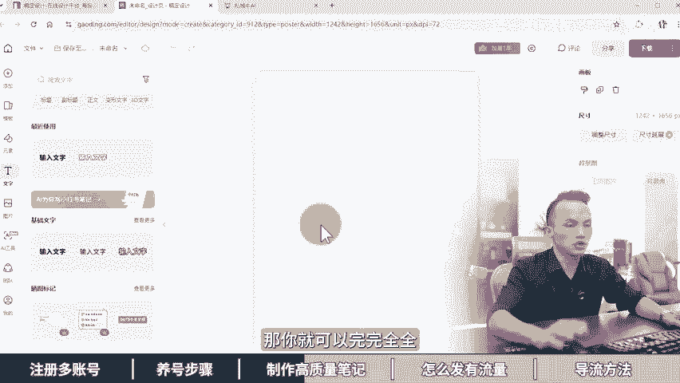

# 耗时7天制作57分钟，小红书矩阵从0到1运营全攻略，一个人玩20个号！ 小红书矩阵运营，小红书运营教程，小红书养号攻略，小红书涨粉攻略，小红书起号教程，小红书起 - P1 - 黄一恒矩阵推广引流 - BV1Ke2tY7ESJ

耗时7天有心制作共17分钟，只操100个号发万篇笔记。小红书几证，从零到一，印钱攻略，一个人玩20个号不讲逻辑，不讲玄学，只求落地，前程高能实战演示，从注册20个账号到批量养高推流号再到建立显题库。

批量系程制作笔记以及5个发布方法，让账号99加，一天导2004亿不违规。如果你想做好小红书，一定要看完该视频能让你少走一年半路。如果你看完还是有不理解的地方，可以在下方打出来，疑问必答。

第一章小红书怎么注册多个账号，又注册了20个小红书账号，我们公司刚来随身，我叫他去注册小红书账号他拉几个小时全部都注册好了。我们一起来看看他怎么注册的。🎼啊，用实卡注册，然后换绑林业租注册卡。

真是个人才。nice这个方法不错，可以无限搞高质量小红书账号，详细教材有点长，记得先收藏。一起来看，会给你分享注册小红书账号需要遵循什么条件，才可以减少方号，如何准备20张手机卡，20台手机。

20个独立IP进行批量注册养号，现在看注册小红书账号需要遵循什么条件，小红书这个平台是目前整个互联网里面最严格的。所以咱们在操作的时候，为了减少方号，特别是关联方号，咱们尽量需要做到一级也号一网络。

为什么呢？有的伙伴可能会去使用这个系统多开一台手机搞两个3个，甚至有些夸张的搞5到10个账号，这种很容易产生设备关联，为什么？因为当你的某一个账号违规之后，这时候它会方进你的设备，一旦方进设备。

你所有的账号全部都会出现关联。比如说像我们在操作的时候就遇到这个情况，收到了一个方号通知，亲压的小红书经证实您的账号所归属的设备下，多个账号仅存在。严重违规行为。

不符合社区规范平台将对您的设备采取封禁处理，且该设备下所有账号都会显示登录，这种就属于关联。所以的伙伴啊搞了5个账号，在一台手机上面，结果因为一个账号违规封禁的，其他4个账号全部受到关联。

结果呢一夜回到解放前。所以咱们在操作的时候呢，尽量的不要去使用这个多开。那么还有多伙伴也会犯一个错，因为啊自己家里面有wifi或者公示wifi，很多个账号都连接这个wifi这种呢也很容易导致IP关联。

比如说批量的不收录或者批量的违规之类的。那如果我们在操作的时候遇到了方号怎么办？遇到封号之后，咱们这台手机呢，可以把它恢复一下出厂设置。那么如果懂技术的也可以刷机一下，然后来重新注册。

如果注册完了使用段时间之后还是被封，甚至出现了方禁设备的提示，这时候就见大家更换设备使用。这台设备啊，你可以拿过去搞其他的，那么就千万不要再做这个小红书了，否则呢一直会不断的反复进行方号。

那了解了这个条。之后，接下我们看一下到底该如期注册。首先咱们在注册的时候，是需要准备20张手机卡，并且经过我们自己的实测，通过实卡注册的账号，它的推流，包括做起来的概率会比悉尼卡呢要大很多。

那这两的伙伴搞不清楚什么是实卡，什么是心级卡，我们来看一下啊，实卡的话就是18151319号段的，就是我们在手机号的时候，它有这个号段。

一般我们在这个营业厅或者在网上购买一些儿童手表卡基本上就是属于什么这种号段，质量呢非常高。注册完之后啊，账号的推流情况表现比较好，而且呢很容易做起来。另外大家使用比较多的就是一些心尼卡。

因为心尼卡的套餐，业主啊会更你低一点。甚至有一些林业主的都可以使用。有是这个17和16号段的，但是经过我们自己测试发现这个心尼卡呢，它的这个推流啊会比较小，有的呢还不到100，甚至有的只有几十个。

那么做起来的概率啊相对说会小一点，并不是说信息卡不能用能用。但是呢在前期啊为了减少我们账号的因素，优先使用这个实卡来注册实卡，每个运营商可以实名5张卡，并且呢每隔30天最多使名一张卡。

很多伙伴一上来就想搞几张，那么搞个一二十个账号，没有做什么实卡怎么办？这里给大家提供一个，我们目前自己正在使用的方法。其实啊就是找20个亲朋好友，用他们的手机号来进行注册就可以了。

因为身边很多长辈很多朋友他们并没有去使用这个小红书，或者在小红书输入的平台并不高，也没有发布作品。这时候我们可以在自己的手机上面用对方的手机号码填写完之后，输入一个验证码，哎。

就可以在自己手机上面然来注册完一个实卡的账号。那么这个账号呀注册完之后，我们可以先用一个月一个月之后，这个账号的推牛已经起来了，账号已经做起来了。这时候你再给他换绑上这个营业出册册卡。

那么这种方式来获得这个账。质量非常高，而且用该方法就可以实现无限产高质量账号。那么每个月都能搞一次啊，如果你每个月搞20个号，那么你搞上一年的话，基本上你搞个。200多个号，没有什么问题。

所以这里咱们还是需要配合上这个林业租的租册卡。这个卡呢主要是用来做这个换绑的。那么大家可以通过各大平台上面进行搜索，价格来非常便宜啊。一般的话，10张30块钱。一个人的话，目前我咨询了一下。

是可以实名这个40张卡的。所以呢这个咱们是必备的。那么有了手机卡之后啊，我们还得准备手机，那手机这一块呢，目前我们用的比较多的手机啊，就是这个红米手机，不是其他手机买不起，而是这个红米手机呢。

跟基这个什么性价比啊。比如说这个红米这个9或者pro你去00你才多少钱一台350到400之间就可以买到成色相对来说比较好的。像我们目前什呢都是这样的手机啊，那么以前老一些呢咱们就不推荐了。

用起会比较卡顿。另外咱们在搞手机的时候啊，尽量选这个配置，6加64G啊，是最低配置，你可以买这个8加128G或者8加256，或者说是12G内存的都可以，反正内存也高的话，肯定用起来也流上。

如果你想买一些新一点的，你可以去买这个红米 note1或者pro，这个价格呢，大概会贵50块钱。但是呢它的处理器啊，包括型号更新一点，用起来流畅度会更高一些。那么这些设备呢都是可以正常使用。

最主要是什么价格便宜。那什么通道去购买呢？大家如果有经验的，那么会通过海鲜市场的，可以到某一上面价格来会比较便宜一些。就是我标这个价格，这个价格是成色比较好的。如果成色差一点的呀。

还可以再便宜1个50到100。如果大家没有经验，也不知道怎么去买。那么担心翻车，也可以通过某东作拍拍或者某宝上面找这个二手的商家来进行购买。一台的话，大概会贵个30到50。但是呢如果有机器有问题啊。

他们有一个售后质保，在质保期内，你可以找他们来进行一个维护。好，接下来看一下，那么20个独立IP那咱们在做的时候我们讲到了1G以后一网络，我们有了账号，有的手机还得有网络。

那网络我们家里面的wifi啊是只有一个的。有的伙伴可能两三个啊，但是呢搞不了这么多怎么办？最简单的方法就是去买这个物联网卡。那物联网卡它是专门用来上网的特点就在于什么流量费特别便宜啊。

但是呢它是不具备这个打电话也不具备发短信的功能。像我们购买的你才多少钱一个月啊，不是一个月是69块钱，24个跟伙伴啊，每个月有40G流量，是40G流量对于我们玩这个小红数来说啊，是完完全全足够的。

你可以看一下，我们买的是这个移动的清一卓业套餐。这个套餐呢目前没有了啊，大家如果要买的话，可能这个套餐它是有的时候搞活动，所以价格比较便宜。现在稍微贵一点，但是整体来也是比较实惠的。大家可以找一找。

如果实在找不到这个流量卡的，你也可以找我啊，我把我的渠道分享给大家，让大家来少走弯络。在这里也帮我们省钱。好，接下来咱们来算一笔账。如果咱们搞20个账号一上来，我们需要花多少钱？首先20张营业租租的卡。

那么一张咱们就算贵一点5块钱，那么需要100块钱，20台手机一台400块钱，成色比较好的九成新啊，咱们需要花8000块钱。20张流量卡，假设一张69块钱，我们需要花1380块钱。

合计啊我们搞20个账号呢，需要投资。大概接近1万块钱了啊，这个说实话对于普通用户来说还是不小的投资。所以大家可以减少为10个账号或者5个账号来成本更低一点。如果你是团队啊，或者有资金，你可以直接投入。

那么平均印你一个账号的硬件成本呢大概在474块钱。这个价格来说实话还是比较便宜的。因为有的伙伴啊他去买一些其他的新设备，一台就一2000，那这个成本就高了气了。那当我们有了E机一号一网络。

接下来我们就需要进行一个批量注册养号。那么在注册养号的时候，首先我们是需要把这个账号注册之后，需要把它的资料给它完善一下。那么很多伙伴这个资料啊都是没有完善的，现至给大家演示一下啊。

咱们打开这个投屏手机，然后呢找到右下角的这个我，那么在我这里啊上方是有一个就在我们的账号这里面呢，他就会有一个编辑资料，咱们点击一下啊，那么把这个编辑资料里面，这个选项卡能完善的，尽量完善一下。

更像是一个什么真实的账号。哎，这是一个另外一个呢，前期新账号呀，什么签名呀，包括你的背景墙你的头像里面千万不要有任何的广告元素。有任何的广告元素，它都很容易导致你违规深至资账号根本做不起来。

直接废掉了啊，这个点是需要注意的啊，当我们账号。如果你后期已经成为一个啊过了敏感期脱敏了，你去加点小广告，哎，其实也是可以的。前期啊一定不要这样做。另外咱们的账号呢一定要正常的活跃。

如果你账号啊只放在一个地方，从来不活跃，每天就是发作品的时候拿过来用5分钟，用完之后就放回去的话，这样它的效果也是比较差的。所以咱们每天啊比如说像一个真实的用户去保持下活跃度。比如说啊浏览30分钟。

点赞收藏20个作品，来来评论5到10条或者关注5到10个博主，那么这些的话都是什么比较重要的，让我们的账号呢更像是一个真实的账号，因为一个真实的人，他去发小红书，系统肯定会给流量。如果你是一个真实的人。

你好不容易啊花了几个小时做了一个啊笔记去发结果发上去流量，就这么几十个，你新灰了，你肯定不会想去发了啊。所以咱们如果是一个真实的账号，它的流量整体其实什么都是比较不错的。那咱们玩小红书的是吧。

一个人呢其实是可以玩10个账号，20个账号，甚至有的比较猛的玩三五十个账号。那么账号多了之后啊，你就可以搞到一天100个以上的客户是比较容易的啊。为什么呢？因为你10个账号，一个账号搞10个人。

10个账号搞100个人。那怎样才能够搞到100个人呢？首先咱们得系统化的去学习这个小红书啊，这里面我给大家准备了小红书的入门运营干货框架，里面包含了小红书的内容输度机制运营工具，企业号运营KOI的投放。

包括店铺的运营，还给大家准备的这个小红书的爆款选题表格，这个表格，有的伙伴不知道怎么去整理，这里面我给大家准备的模板，你把我的模板下载之后啊，把后面的数据给它删除掉，替换的自己的来就可以了。

就可以显示这个收藏比评等比以及什么分享比，还给大家准备了5款小红书的必备运营工具。这是我们做小红书每天都用到的。比如说图文解析AI改写敏感词检测图文排版，还有素材图标。

而且呢这些工具啊都是免费就可以进行使用，还给大家准备的小红书的。🎼系统引流客，因为咱们这个视频啊没办法做太长时间，只能够啊做个十0多分钟，做太长，大家没耐心看完。所以关于小红书引流的前流程。

包括超级医眼的设计、导流方法，以及新手常见问题变相项目这些都给大家整理好了，这些东西呢咱们不需要自己去整理了。因为互联网最大的优势啊，就是资源共享，大家可以找我，我把这些资眼统通打包共享给大家。

第二张新手小红书养号详细步骤，新注册的30个小红书账号全部限流了。我们公司刚来随身，我叫他去把这些新注册的小红书账号影下活跃度用来发笔记，结果他把这些账号全部搞限流了。我们一起来看看他怎么养的。

🎼Q我直接连一个wifi问不呀，现在小红书对账号特别严格，一个不注意，账号就限流了。一起来看，我会给你分享高推流号和低推流号到底区别在什么地方了解完之后如何去批量的养高推流账号。为了方便大家直观的理解。

我特地花时间做了一个表格，咱们一起来对比一下什么是高推流账号，就是咱们自己使用的高活页的社交号，比如说你去发布一些生活记录，拍一些随手盘的发送机制后，隔几天之后，流量都能够达到两三千。

好有多伙伴发现自己的账号呀变成了一个低推流账号，也就是我们低活页的一些小号啊，没有经常使用，偶尔使用一下，发布完笔记之后呢，隔了几天流量也就两三百，甚至的伙伴比较惨流量啊都不破败。那怎么办？

咱们来看一下啊，高推流账号，它有几个特点。比如说我们使用时卡注册的，也就是使用这个18131519号段的账号进行注册，而且呢是一个。手机的一个账号，并且咱们的设备也没有什么封号记录。

重点是咱们的手机啊配置都比较高。大部分伙伴买的手机都是两三千，甚至有的伙伴买的是五六千的这种高配手机呢就是一个真实的用户，而且做到了什么一个IP一个账号，并且呢我们在使用小红书的时候。

它会有个提示叫做是否引起访问通讯录，咱们点击的是，而且我们的账号呢隔三差五的，我们还去啊搜索一些内容来刷刷笔记啊，点赞有点互动记录在里面。这种账号啊就称之为叫做高回的社交号。这里咱们换位思考一下。

如果我们是一个真实的小红书的用户，当我们去发布小红书笔记一发布完之后隔了几天只有几十个浏览量。你下次还会信心去发问，那肯定就不喜欢这个平台。所以只要是一个真实的用户去发布小红书。

它的流量整体都是什么比较不错的。另外一种呢就是低推流账号，咱们低回的小号，首先比如说咱们在注册的时候是使用这个虚拟号进行注册17号段16号段，而且有的伙伴。一个手机搞了3个5个账号，并且甚至有的手机啊。

还有以前有这个封号记录，重点是咱们手机的配置非常低。很多伙伴是把56年前淘汰下的老手机拿过来直接进行使用配置啊低的可怜，可以说是3G的内存，然后呢8G的存储。

而且呢1个IP下面搞了5个10个甚至二三十个账号，重点是这个手机上面呢，通讯录也没有，也没有熟量流量，而且这个账号注册完之后就放在一个地方，很少去打开，根本没有什么活跃度。

所以咱们在做的时候尽量的避免这些情况，而是做到这个什么高推流的社交账号。那怎么去做高推流社交账号来，咱们来看一下如何批量一样高推牛的账号。咱们在做的时候啊，需要遵循一个条件。

那么这个条件呢就是一G一号一网络，尽量的不要去使用这个多开，防止设备关联。因为小猪这个平台是目前整个互联网里面最严格的。如果你账号被封之后，它是有可能会出现这个设备封禁。一旦设备封禁。

比如说你去多开一个手机上面5个账号。因为一个账号违规，另外4个账号全部也违规。对你来说肯定得不偿失。其次呢咱们尽量不要去点接wifiwifi这一块，就是不要去很多个账号用一个，你可以一个账号啊。

用一个wifi或者两个账号用wifi，不要搞太多，太多的话，也很容易导致IP关联，比如说批量的不收入啊，或者批量的出现同一个违规。第二个就是要提前导入通讯录。咱们在下载小红书之前，拿到手机。

我们先在手机上面搞上500到1000个真实的通讯录。这个通讯录是干嘛用的？其实就是为了获取到这个熟人流量，这个熟人流量呢对于我们前期来说，其实帮助是什么是比较大的。可以提高更多的一个基础推流。

比如说你推流啊，如果你导通讯录，如果你去发布可能会有500个。但是你微导通讯录可能就只有300个，哎，就少了一两百个，这一两百个，它就是推给你通讯录里面的熟人来进行查看的。那怎么去导通讯录呢。

这里面有很多种方法。这种方法大家可以去下载一个APP叫QQ同步助手。然后呢通过这个软件可以帮你把A手机的通讯录同步到B手机里面。如果你想每个手机都不一样。

咱们可以去QQ邮箱的通讯录里面批量制作这个什么Vcard的名片格式，然后呢在手机上面可以一键导入具体的流程我给大家截了个图。点击通讯录，点击工具，然后呢导出这个微card就可以发到手机上。啊。

一键导入通讯录，每个手机呢导个500个1000个，也不用导太多啊，太多的话可能会手机比较卡顿，识别不出来。第三个，咱们用实卡注册，那么实卡注册呀，很多伙伴找不到这么多卡，什么18151319号段的。

你可以找身边的很多亲朋好友。因为对家里面很多长辈啊，他们基本上都不用小红书，那怎么办？他们的手机要是空着的或者有些朋友呢他们用小红书，但是不把笔记也可以把他们的账号拿过来之后啊。

用一个月这一个月我们的流量起来了，账号活跃度上来了，标签打上了，这时候咱们在换绑上这个营业租租的卡就可以了。同时呢我们的这个手机上面啊尽量的是保持这个4G或者5G网络不要轻点接wifi防止IP关联。

最好的办法是单独配上流量卡，这个流量卡其实我就是我们讲到的一个物联网卡，他是只能够上网，不能够打电话，也不具备发短信的功能，价格呢比较便宜啊，69块钱大概是24个月，每个月呢有4G的流量。

对咱们做小红书来说，这个流量说实话是完完全全足够了啊。像我购买的是这个移动的清一卓业套餐，那么960G流量。给我40G，一共只花了69块钱。这种流量卡，互联网卡大家可以多找一下啊。

那么有的伙伴呢可能实在找不到啊，你也可以找我，我把这些渠业道和资源共享给大家，借大家时间，毕竟这也是互联网的一大优势嘛。那么第五个呀，咱们需要每天保持账号的一个活跃度。活跃度是很重要。

有的伙伴是注册完之后账号就放在办公室里面啊，从来也不去打开发作品的时候拿过来咔5分钟发完了又放在一个地方，基本上就会管理了。这种账号的活跃度非常低，但的推流情感是非常差的。比较好的办法。

就是每天比如说我们在找对标的时候，或者我们啊每天自己啊找作品的时候，我们就拿拿第一台手机来哎，找个半个小时，这半个小时里面自然就会浏览就会收藏，就会评论就会关注。好，半个小时之后。

我们再拿另外一台手机过来，每天这样循环，让你每个账号都保持活跃度。这个对新号前显说是比较重要的啊，尽量的不要让自己账号变成一个静默账号。当我们有了高账号，接下来咱们玩小红书啊，一定学会打几针。

一上来就做10个账号，为什么做10个账号。因为你一个账号，一天搞10个人，其实难度并不大。但是如果你想一个账号一天搞100个，说实话难度比较大的那怎么办？我们就得搞几张10个账号一起上。

一个账号搞10个一天加在一起，10个账号就能够搞到100个顾客。那怎么去做这个小红书的集证呢？这里面我给大家准备的一些系统的资料。首先有这个小红书的入门运营干货框架，会给大家分享小红书的内容收索机制。

运营工具，企业号的运营KY的投放，包括店铺的一个管理，还给大家准备的小红书的爆款选题表格。一个账号很多伙伴发笔记啊是随性而发，可以说是盲人摸象，咱们一定要学会看数据，通过数据里面去挑选一些指标比较好的。

比如说我们找到一些爆款选题，从爆款选题里面挑选收藏比比较好的，更加容易火评论比比较高的来，更加容易带来比较高的流量，分享比呢，就是获得这个传播流量。那有多伙伴不知道怎么去做这个表格了。那么我已经做好了。

大家直接套这个模板，把里面的内容删除掉，替换成自己的也就搞定了。还给大家准备了5款小红书的必备营工具。比如说。🎼怎么图文解析啊，怎么用AI批量的改写，一天做50篇笔记，怎么检测敏感词，减少违规。

怎么排版，而且还不用花钱。怎么找这个2800万的素材图标，这些统通给大家打包好了，还给大家准备了这个小红书的系统引流课，用咱们这些视频啊，主要就是提高账样的活跃度啊或者高推流发版笔记之后。

2305千1万。但是呢如果咱们想系统的做好小红书啊，比如说引流的前流程，怎么设计钩子，怎么安全导流，新手常见问题以及编业项目，这些呢统通给大家准备了2到3个小时的什么系统课，这些系统课呀。

那么大家只需要来找我。我把这几个字眼通通来分享给大家。咱们做一个字眼共享，毕竟互联网里面很大的优势啊，就是做这个什么字眼共享。第三章小红书笔记，图片制作教程。新手小白一天做了50篇小红书笔记。

我们公司刚来学习生我叫他去做小红书推广，他做了一周每天能搞50篇小红书笔记。我们一起来。🎼看他怎么做的找模板批量系统的呀，真是个人才，这个方法不错，可以批量做小数笔记，几分钟一篇海容易报。

一起来看我给你分享什么是低质量囤笔记，什么是高质量囤笔记。了解完之后，如何去批量的做高质量的图笔记。现在看一下低质量吞笔记。大家有的时候刷视频或者浏览信息会看到一些告诉你用一个工具。

就能够批量生成几百上签名笔记，点个按钮就可以了。这种工具啊，纯粹的就是会有小的，可以说是割韭菜专用。如果你信了，那你妥妥的就是烟大头。首先他浪费金钱，买公击软件的钱，这个软件真不便宜。

有的呢要大几千块钱。这个钱交了之后啊，纯粹的就是智张税。第二个，你笔记搞出来之后，你消售费大量时间去什么去发布这些笔记。有的伙伴是早上啊干个晚上几十个账号呢，每天去批量的进行分发。而且重点是发完之后呢。

还没流量。浏览量，隔了很多天。都没破败几十篇笔记，还不如一篇笔记，最后啊把账号呢搞成了废号。账号纯粹的是一个消耗品。如果你有很多人的账号可以不断的产账号，那你可以这样买。但是啊如果咱们搞不到这么多账号。

这种方法不建大家，因为账号会变成死号，它是属于什么废号流打法，相当于账号每个页啊都需要更换几个，不断的去弄这个新账号。那到底什么是高质量的图笔记来，咱们来看一下。首先高质量的图笔记。

它是基于一个爆款框架来进行制作的。这个爆款框架呢不是我们自己去想出来的，而是你的同行你的对标，他发布完之后，比如说测试下来，数据反馈比较好的，30篇笔记里面就报了这一篇，这一篇就是火的选题。

而且它的封面来测试的也比较好，这个模板也是比较不错的。所以咱们在做的时候要选择火的选题，火的封面，火的模板，只有基于这三个条件去做流量才会比较高。第二个是延充度比较高。有的框慌说。

那我能不能直接把别人的爆款。既然他发的30篇火的一篇，我直接拿过来之后。变成我的去发布，这样行不行？这样是不行的啊。这种方式啊它是会搬译，会违规的。所以咱们在做的时候是不能够搬译。我们要做原创素材。

什么叫原创素材？原创素材就是把这个作品拿过来之后重新改改。那么就可以做成原创的，在平台识别的时候，没有被平台发布过的是原创识别内容对比之后，超过30%不一样，就是原创。而且第三个新鲜度比较高。

有的伙伴说，我把去年的一个爆款超过来，也改了一下，发上去之后啊，流量也非常小，什么原因呢？因为小红书你要知道它是一个喜新厌旧的平台。比如说现在当下啊有一个特别火的热点。

这个热点我现在给你讲的肯定非常感兴趣。但是隔了三个月，我再给你讲这个热点，你就不想听了。为什么？因为已经听过了，或者说是过期了，所以咱们一定要找这种近期受欢迎的内容，并且是没有审美疲劳和过程内容。

那么小红书来喜新厌旧，新的内容啊，更加受欢迎，特别是那种发布之后24小时，三天之内，7天之内书据反馈比较好的，你找到这种爆款框架拿过来做，书据反馈啊，绝对是比较不错的。那具体怎么去做，咱们来看一下。

如何批量的去做这个高质量的笔记。那么首先呢我们需要去找近期的爆款选题，爆款选题啊千万不要靠这些想，而是一定要什么靠数据来管理，会看数据等于什么？等于开展考试。所以咱们在做的时候。

需要去建立一个这样的选题表格，从选题表格里面去挑选一些。比如说点赞比评论比分享比整体拉的比较高的这种选题呢更加容易或，更加能够什么带来比较多的流量优先选择。有的伙伴说选题表格不知道怎么做啊。

不知道怎么做的没关系，你可以来找我，我把我这个模板套给大家，拿过去之后，哎，你直接把下面这些删除掉，把其他的替换成自己的啊，这个模板也就有了。第二个制作好模板框架内容。那么当我们在制作模板框架是吧。

其实第一个说实话还是比较费时间的。比如现在哎我们打开这个投屏手机，在投屏手机里面，我们找到了一个哎比较火的模板。比如这一个模板哎，找到比较火。但是我们想拿过来做，刚开始我们得把这个模板给它做出来。

那么像这种模板你会发现在设计的时候，在制作的时候着实是比较费时间。有的模板简单一点的消花一两个小时，复杂一点的，甚至于说消花3个小时4个小时。但是做出来模板之后呢，我们就可以直接去套。

就可以把这一个模板内容变成10个20个内容。比如这一个啊，那么它有800多的一个数据反馈啊，整体的还比较不错啊，时间我们看一下啊，时间的话也是相对来说还是比较新的。那这一个我们就可以拿过来。

它一共有一页、两页、三页4页。原来一共有5页，这5页我们做还是有点稍微费，并它内容量还是比较大的。那么在做的时候，我们需要配合上一些在线的做图工具。有的伙伴可能在用搞定设计，再用创客碟，再用黄相机。啊。

这里面呢我们用的最多的就是这个搞定设计的。然后咱们打开这个平台，在这个平台里面，我们点击这个叫做创建设计。然后来选择这个小红书配图啊，这就是小红书的一个方便尺寸。在这里面我们就可以设计啊，在设计的时候。

大家需要注意啊，因为我这里用的这个它也是一个免费版，没有花钱的那么大家用的时候尽量不要用这个模板，也不要用这里面的什么VIP的字体，包括VIP的一些图标素材，那你就可以完完全全免费去使用这个工具了。

在这里面给大家看一下，我自己做的啊，咱们点击这个最近打开，在最近打开里面，这里面就会有很多很多的一些模板。这些模板呢基本上就是啊我们找到的一些爆款，把这个爆款拿过来之后啊，修改修改。

然后呢就进行制作这样的模板已经做了几百个了啊。当我们做好模板框架之后，接下来我们只需要去填充这个框架的内容。比如说把标题笔记内容，图片素材替换一下，每替换一波素材，我们就得到了一个原创的笔记。

这是框架模板用的是原来打，但是内容呢就变成了新的，这样就得到了一个爆款框架爆款模板的一个笔记内容。那具体咱们在操作的时，我们要学会对这个笔记来进行气重。那气重的话，我们也多个方法。

首先我们可以通过AI来对这个文字进行重写。比如说我从前面的这个笔记里面挑写一个给大家示范一下，我们划下来啊，这里面大家可以看到啊，那么有一个叫做短视频运营的笔记。

那这篇笔记啊就是我们找到一个爆款的框架模板，咱们拿过来之后，怎么给它变成原创的。首先我们做好之后。我们可以点击这个叫做三个选项点，找到创建副本。好，先创建个副本出来，不要在颜料上面修改啊。

接下来我们就可以把这里面的内容对它进行一个替换啊，比如说。好，这一个我们给它粘贴到AI里面，找到AI创作，然后呢选择小红书，找到小红书重写，然后把它粘接进来。咱们在重写的时候。

我们标题也可以对它进行重写。比如这个叫做商业内容，咱们在重写的时候尽量的分段落重写。这样的话质量会比较高。接下来我们点击这个立刻生成。这时候AI它就会帮助我们把这段文案啊进行一个重写，重写之后呢。

意思不变。但是整体的表达的内容啊就变得一种形式，我们来对比一下。好，咱们复制一下，在获取账号时，我们首先要了解公司在新媒体平台上，在拿到账号时，你看啊一个是拿到账号，一个是获取账号。哎。

这时候就变得不一样。而且文字你会发现它会稍微变得多了一点啊。那后面这一句话呢是铺垫的，咱们就不要了。好，我们给它替换掉。你看现在我们就得到了一个严重的版本。那么下面这个也是一样的，我们也给它连接进来。

然后呢把这个标题给它复制进来啊，加标题的目的呢是为了让AI更加的啊容易理解，我们这个到底在讲什么内容，然后点击这个生成，而且这个AI它是可以不断的反复重写无限制重写，我们重写一次得到一个版本。

你重写10次是不是得到10个版本就可以做十0篇不同笔记。你看啊，我们复制一下啊，第二个叫做内容的精准定位。好，把上面的这个给它删除掉。好，删这个也不要了。好，接下来我们适当的做一些空行啊。

适当做一些空行好，这个内容稍微比原来你看啊原来的话它是多了一点啊，所以咱们要挪开，把这个背景稍微给它拉长一点。然后再把我们的内容给它拉过来。好，第一个叫商业定位。比如说第一个我们可以给它改成账号定位。

好，第二个呢，我们可以自己改善内容定位。比如说我们的这个笔记定位。好，那么这样做一下之后呢，它就让我们的笔记变成原创的。这时候如果平台再切换版页，那也不现实，为什么？毕竟内容都不一样了，对不对？

给我办啊，这就得到一个版本。那除了这个方法之外，其他有很多。比如说第二个修改排版和布局。那这个什么意思啊？比如说咱们把这个笔记来再次的复制这一个出来，那复制过来之后，这个排版我们能不能改一下，可以改的。

比如说那么前面我们讲的第一个哎叫做什么叫做账号定位，我们反过来这一个叫我们先讲这个笔记定位，原来再讲这个什么哎账号定位，把顺序给它颠倒一下，哎，这种方式也是可以的，甚至你可以比如说换一个模板。

比如现在我们用的这个模板，我用这个模板把那种颠倒一下，哎又得到了一性的笔记，而且还可以调整顺序。像刚才我们演示的这个就是调整的顺序啊，把上面内容换成换到下面来啊，这个调整。因为它的内容字数不太一样啊。

我们得把这些选中，原来给它往下。好，给它稍微往下挪一点。好，挪一点就把这个标题也给它。啊，这个还不能这样挪，这个得分开挪啊，给它挪下来一点。因为这的内容啊相对来说它是什么它是比较多的啊。好了，还要挪开。

把前面的这个大标签给它挪下来啊，这里啊稍微费时间一点啊，咱们得做一下精细化的一个排版啊，好这个拉高一点。好，这里面呢我们反过来好，把第一段的内容给它怎么，给它复制进来。好，把这个往下挪。挪完之后呢。

这一个往下。好，并且这一个那么咱们称之为这种叫做啊账号定位啊，那么这个是2好，然后把这一个挪到。好，我们撤销一下。好，把这个给他。落下来好，落下来之后大家可以看一下。

那现在我们是不是得到了不一样的笔记啊，这一个是我们AI重写的这一个是我们电脑这个顺序的啊，除此之外，我们还可以更换方面。比如说我们重新去找哎，我们找到这一个这个方面我觉得比较不错。

那我把刚才内容用这一个方面模板替换一下。那么我又得到了一个不一样的版本，这种就去重，那么通过这种方法，每种方式你去从如个笔记4种方式你就可以得到什么？得到20篇笔记。如果你再给他反复操作一遍。

那么四五十篇笔记自然就来了。当我们学会气重批量生产笔记之后，这些笔记我们就可以分发到多个小红书的账号里面。因为一个小红书账号，如果咱们一天搞10个人的话，这个难度并不大，很多伙伴都能做得到。

只要你的啊笔记做好选题选好，每天加10个人确实是比较容易的。但是如果我们想靠单个账号加100个人，这个还是比较困难。必须得靠什么？我们的笔记上了热门，但是有一个办法比较好，就是我们搞上10个账号。

既然一个账号加10个。比较容易我们10个账号加100个人也会变得什么比较轻松一些。这里面呢为了方便大家做几证，我给大家准备的一些啊额外的扩展资料。首先就是小红书的入门运营干货框架。

让大家了解小红书的运营工具，收入机制，企业号的运营，包括KI的投放以及店铺的运营，还给大家准备的小红书的爆款选题表格，就前面我给大家演示的这个表格，一有伙伴不知道到底做什么选题，随性而发某人摸像。

会看数据等于开展考试，怎么看这个收藏比评论比分享比，你得有这个表格吧。这个表格大拿过去之后，把里面的那种删除掉，替换成自己的就可以把这些数据拉出来。然后从这里面挑选一些数据反馈标好的啊。

比如说我们来挑一篇这一篇笔记148，相当于100个人点赞会有148个人进行收藏，这种笔记呢就很容易什么二次货还给大家准备的5款小红书的运营必备工具。像刚才我们用到这个AI改写工具。

以及这个那么图文排版工具。我们没用到的，还有这个图文解析，敏感词检测，还有数。图标没给大家演示，但这些工具啊都是我们做小红书啊必备的。重点是这些工具啊都可以免费使用。还有我们小红书的系统性游客。

因为咱们这些视频做太长，大家没耐心看完。所以这里面呢我给大家准备了一个2到3个小时的小红书的系统性游客，教大家怎么做好小红书全流程以耳设计导流方法，常见问题，以及做小红书怎么进行编现。

这些我都给大家打包好的。🎼然后大可以来找我，我们做一下资源共享。毕竟互联网最大的优势啊就是做这个资源共享的。第四章，小红书怎么发笔记有流量，小红书新号这样发笔记流量又爆了。我们公司刚来实习生。

我叫他去给这些新号发小红书笔记，他发了一周，大部分账号都99加了，我们一起来看看他怎么发的。🎼，用了这5个流量密码，真是个人才。😡，nice这个方法不错，新账号也能99加。一起来看。

我会给你分享怎样拿平台流量补贴，怎样拿平台的搜索流量，怎样拿平台的附近流量，怎样进平台流量池，怎样做能启动流量。首先来看第一个如何才能够拿到平台的流量补贴。对新账号来说，平台是有流量补贴的。

但是很多伙伴呢不知道怎么去正确的操作，导致几千上万流量券都没领到。这里有一个小方法啊，就是我们在发布笔记的时候呢，千万不要点中间这个加号，通过这个加号去发布，它是没有任何的流量补贴。咱们想拿流量补贴啊。

就必须要进入到这个创作中心，笔记灵感里面选择相应的灵感进行发布。特别是新号来说，你进入之后啊，立马点这个订阅按钮就可以得到一张200的流量键。如果呢这个对新账号初次还是可以立马领到的。

然后后续啊你再通过下方的笔记灵感，关联上相应的灵感进行发布。哎，就可以获得其他流量券。比如说像我们自己。账号啊流量键基本上都领到了五六张，每张都是1000的，有的是500的。

而且呢这个流量键在我们发布笔记的时候，它是可以用在笔记上面。这些流量键说实话，如果你去投这个付费的鼠条推广，也得花好几百块钱了。好，具体该如何去操作。这里面呢我来给大家简单的演示一下这里我准备的账号。

但这个账号呀已经不是一个新号了啊，咱们点击右下角的我，然后呢找到我们的账号，点击左上角的三条账，在这里面选择上这个叫做创作的中心。好，进来之后，我们在下方这里面它就会有一个叫做笔记灵感。咱们点击一下。

点击进入笔记灵感之后，如果你的是一个新账号没有领过的，这里面就会定义按钮，点击一下就可以得到一张200流量券。那么接下来发笔记的时候呢，你就可以从这里面选择适合的发。那么这个创作灵感，它是有多分类的。

大家可以在分类里面挑选一些适合字己的啊，如果找不到一些跟行业相关的人，你可以选择一些通用的。比如说记录吧啊，现在然后呢还有一些什么有问必答来，这种都是可以的。找到相应的之后。

接下来我们只需要点击这个去使用啊，这时候它就会提示我们啊去导入自己的笔记，从这里面发布啊，我们就是可以拿到这个什么流量补贴的那这第一个第二个呢，如果咱们的笔记啊，流量比较小。

我们可以定期给这个笔记来做一下这个申诉。申诉的时候啊，如果确实存在这个比如说误分的情况下，它就会给你这个官方的流量补偿券。这个官方流量补偿券，大家不要小看啊，个还是比较多的。

你看像我们这个账号里面得到了3张官方流量补偿券，每张都是1000个曝光。哎，这个呢也是综国下来什么是比较不错的。那么这个流量补偿券在哪里去拿来？给大家演示一下。好，咱们打开投屏手机，那么找到我。

然后点击这个帮助与客服，在帮助与客服这里面，我们点击这个叫做笔记申诉。然后在笔记申诉里面你就可以去选择。你看啊这里面它有个违规笔记啊，在这里面可以进行申诉。啊，申诉理由的话，一方面就是卖惨啊。

第二方面呢就是告诉你我做这个比较很辛苦。第三个呢啊确实是没有违规的。第四个如果有违规呢，你可以支持我来进行修改啊，你也可以点这个全部笔记，然后从这里面选择上相对笔记，然后对他来进行申诉，申诉完成之后啊。

如果存在误方，他也是不是给你这个流量补偿的啊，这第一个平台流量补贴，这里面你拿个5000流量是完完全全没有问题的啊。第二个就是很多伙伴所忽略的，咱们要学会做这个搜索流量。因为现在有80%的人。

他们打开这个小红书之后啊，并不去刷笔记，而是干什么呢？而是去搜索笔记。因为当我们遇到一个问题，或者想解决什么问题的时候，比如说现在我们打开右上角进行搜索框。比如现在我想在家里面去装这个净水器，我就。

直接搜索净水器的关键词，就是为了寻找到底该怎么买净水器，该怎么装净水器。净水器到底是不是自腾税有没有用？好，这种就搜索量。这个搜索流量目前整体是非常非常大的。所以咱们在做的时候呢，就要学会布及关键词。

获取搜索流量，做一个那么小红书的下拉词，让用户啊在搜索笔记的时候也可以找到你怎么做。比如说现在我去发这个净水器的，从这里面挑一个词挑一个相关性最强的。比如挑一个净水器怎么选。看这个词的相关性非常强。

我们就把这一个词放到我们自己的这个笔记标题里面，笔记话题里面笔内容里面在三个地方来关联一下。这样的话，当用户搜索的时候就可以找到咱们的笔记，我们的笔记啊又多获取到了一个什么曝光。

第三个呢是哪平台的这个附近流量。这个附近流量啊其实小红书它是一个社交平台，这个社交平台我们反回来看才能看发现就是推荐流量，关注是我们关注的列表。好右边这个重庆它就是周边流量。

所以打开之后没发现这里面我能刷到的都是附近的好，所以附近这些地点我一看啊，基本上都是非常熟悉的啊，毕竟就在周边。所以咱们在做。笔记的时候也要学会打上这个什么地址。至有你打上地址之后呢。

这个时候你的笔记才会推荐给附近的人。而且在打这个地址的时候，不要乱打，一定要打一些流量相对说比较大的。因为有的伙伴可能会在一些三四线的呃小县城里面，流量呢非常小那。

你可以改成你们当地啊热度大一点的城色啊，选这个商圈。如果大家不会看流量，其实有个方法啊，就是我们去下载一个这个地图软件啊，比如说这个百度的地图，在这个里面呢我们点右上角这个图层，在图层里面。

它就会有一个叫做热力图。咱们点击这个热力图之后啊，它就是可以看到这个每个地方它的一个流量大小，你可以看一下，这里面有很多。比如说像这一个啊，那么红色区域的，就代表人流量非常大。

那么如果是蓝色或者呈浅色区域的人流量就非常小。那在选择的时候就可以啊不选这个地区。而且咱们在发布的时候可以更换。每篇笔记关联一个不同地区，就可以吸引到大量的周边附近流量。

这是第三个第四个啊就是竞平的流量池。其实我们做笔记更重要的目的是为了能够撬动平价的这个公益流量，拿到什么几十万的流量，这才是咱们的终极目标。说以我们在做的时候，你的伙伴说，为什么我发了10篇20篇。

30篇笔记啊，最高的流量就5000都没破万的，到底什么原因，其实最主要的原因是出现在选题上面。记住选题啊高于一切。选题的前重呢可以说大于80%。选题啊决定生势。而选题这个东西啊。

千万不要靠自己的直觉去判断。你的伙伴是把自己会的自己有的自己想到的，那么自己想做的呢去发不到上面，就像发朋友圈一样，发上题之后啊，根本就没人看，所以咱们要学会看数据，等于开天考试，随性要发。

等于盲人摸项，这个什么意思相当于你做的。每一个笔记每个选题都要建立在别人的数据基础指标之上。就像你现在一个同行，他发布了60篇笔记里面数据好的一共有5篇，这5篇就是他测试下来比较好的选题。

我们拿过来之后，直接用这5个选题来发就可以了。找那种流量差距啊，拉高10倍，拉高20倍以上的人，更加有这个参考意义。具体咱们在做的时候啊，最好的办法就是自己能够建立一个选题表格。在选题表格里面。

先整理上20个30个50个选题，然后挑选这种收藏比评论比分享比比较高的优先进行操作。比如这一篇笔记收藏比148%，100个人点赞。会有什么148个人收藏，收藏的人反而比比简人多。

说明这个笔记内容特别实用，对内容的以及考虑数据啊绝对微太差，这就是一个什么好的选题。记住做小红书火过内容它还会在火。因为做小红书有个公式叫做70%的相似爆款乘以足够多的长识次数。

这个70%的相似爆款是什么。就是别人已经测试下来比较有话题性的东西，选题这个有的伙伴不想理解举个通俗的例子，像像现在我跟你讲故事一样的，有的故事让你听的非常有劲，有的故事让你听的睡着了。

所以你喜欢听的故事就代表是个好的选题，咱们要多去做，所以选题表格是咱必备的。有的伙伴呢不知道怎么做这个选题表格，你可以来找我，我把我的模板分享给你拿过去之后，你把这里面的数据删除掉。

替换上自己的数据哎就可以了，然后就可以去看这个收藏比评论比以及分享比调选数据比较好的，优先进行操作。其次啊就是封面，小红书它是封面为王的平台，封面会直接决定我们的流量下限。为什么有的人发笔记。

流量500，有的人发笔记流量500，有的人发笔记流量50万，最主要就是取决封面，封面呢千万不要。自己去设计，有的伙伴说花了一天时间啊，用PS设计一个封面，结果发上去，看流量还没破100。

直接超一个同行的发送去流量还5000。所以没有经验的，千万不要这种方面，直接找近期对标账号，在爆款方面，这就是什么流量密码，封面一旦做好了，你发布的每个笔记流量下线，怎么也得个两三千三五千。

来看一下做人启动流量。如果尝试的前面设置方法还是不行，那想增加一点笔记的流量，还有一个好的办法，就是做这个能启动流量。那么这个方法来说，简单点就是我们自己去导入这个流量，就称这里就是能启动。

比如说我们自己做的失意，像我们自己实意啊，有超过50万的流量。那我在我的私意里面分享一下我的账号，那么让他们去进行一个啊搜索一键三连，那这时候也可以拉过我们整个账的数据，这是一个方法。

那有的伙伴说我没有设意流量怎么办？你可以用粉丝群。因为现在小红书啊他就有很多很多粉丝群，而且大部分的粉丝群都是没有设置管理员同意的。我们就可以准。一些小号熟人号加到一些竞品的粉丝群里面。进去之后呢。

我们就把笔记分享到粉丝群里面。也可以获得一你的曝光。但是啊咱们发笔记的时候，最好是选择下班时间。因为你上班的话，别人在上班，你发版之后，他看到他就把你撤回掉了啊，或者把你踢出去啊，你选择下班时间呢。

你发版之后，他第二天才来处理。那你的这个曝光时间自然就会多一些啊，那么也可以给我们笔记提到你的推广作用，特别是前期啊，那么把你的这个流量。

从200300拉高到12000是完完全全可以通过这些方法来实现的。做这么多的目的就是为了让我们搞到更多的流量和客户，其实想做更多的流量和客户啊，最粗暴的方法就是做几成的。因为一个账号。

咱们一天想搞10个客户的话，难度呢还是比较低，还是比较容易的。但是如果你一个账号一天要加100个客户，除非咱们的笔记上了热门，否则根本就做不到。那怎么办？这时有另外一个打法。

就是我们一个人按10个小红书的账号，那么一个账号10个人。10个账号，一天自然就100个人。那怎么去做这个几证？我给大家准备的4个资料。第一个呢就是我们的入门运营干货框架。

那大家更好的去了解小红书的收入机制、运营工具，其号投放，还有KR的管理，包括店铺的经营，还给大家准备了前面给大家演示的这个小红书的选题表格。把里面的数据替换成自己的。

然后呢就可以从这里面去挑选一些数据反馈好来做，而不是看一篇做一篇。我们是从十篇里面挑三篇挑5篇，然后呢来进行制作，还给大家准备了5款小红书的必备运营工具。

比如说图文解析的AIP量改写的敏感词检测的图文排版的，还有2800万的素假图标工具都给大家打包好了。其次还有一个。🎼小红书的系统引流课。因为这个视频咱们拍太长时间，大家没耐心看完。

所以呢我们单独做了一个3个小时的系统课，里面有全流程、狗子设计、导流方法、常见问题以及变缘项目。这里呢统统打包好了，大家都可以来找我，我把这些资眼全部共享给大家，毕竟互联网最大的优势。

就是这个什么资眼共享了。第五章，小红书怎么引流私域流量不违规。一共50部小红书手机全部放号了。我们公司刚来随身，我叫他去小红书的面引流到CE，结果他把这些账号全部搞翻了。🎼我们一起来看看他怎么引流的。

直接给我私聊发的微信号呀。现在小红书引流到11特别严格，一个不注意账号就封了。一起来看，我会给你分享容易违规的导流失宜方法，氪金玩家在用的白名单导流失宜方法。

以及目前我们正在使用免费不违规的导流失宜方法。现在看第一个容易违规的方法有哪些很多伙伴呢胆子比较大，你上来之后呢，直接在私信里面去回复这个微信。这种方式啊，你发个一两个没问题。你稍微发多一点。

它就会导致你账号限流，严重的呢直接就提示账号被封禁了。这时候你会收到一个方号处理通知，亲爱的小红书经证实您的账号存在破坏网络安全，怎么怎么样的行为。现在你对你的账号采取这个什么方进处理。

这时候呢咱们基本上就等于什么白做了。那么还有多伙伴呢在剪辑里面留邮箱。现在其实发邮件的人呢可以说是非常非常少。你的邮箱之后。

虽然不会违规，但是呢引流效果啊基本上是少的可怜。还的伙伴做这个瞬间引导。瞬间引导你会发现，如果是一个新号，你去设置这个瞬间，根本就设置不上，还频繁的违规，导致账号被限流。有的伙伴呢用了一些其他方法。

比如说A中B收艾特小号哎，这个方法确实比较不错的，也能够减少违规。但是它的流量是会有损耗的。毕竟你把流量导给另外一个号，中间的步骤多了几个步骤，流量会大大的一个损耗在里面。那具体怎么去做。

咱们来看一下氪金玩家的方法。如果咱们是做的大号，并且流量来也比较猛，愿意花点钱，我们就可以选择这个科技玩家对平台交点保护费。首先就是我们需要去开通这个蓝V。开通蓝V之后啊，我们进行这个激光投流。

当我们每个月消耗超过1000块钱以上，那么就可以获得这个私信服务组件。这个私信服务组件呢，也就是我们讲的一个叫做私信通，在私信通里面就可以随便的去私信发这个手机号码，发你的联系方式都没问题。

因为你已经交的钱过了百名单，平台肯定是不会去方进理账号了。毕竟你每个月啊都需要交1000块钱。他有一个考的要求，就是每周二考核账号进30天激光竞价总消耗大于1000。也就是你一个账号，你交1000块钱。

那没问题，随便你玩了啊。那如果咱们每个月消耗超过3000块钱以上，还可以获得这个私信通升级版。那这个申级版呢就可以做到一些自动回复啊，钱自动操作了，就是多花钱。那么这时候咱们就能够开通这个后台的私信版。

名单啊随便发手机号码，随便发微信号都没什么问题，毕竟是交了钱的。也就姑娘说我搞了10个账号，每个账号交1000块钱，一个也不得交1万。那这一万我也交不起啊，那怎么办？我们来看第三个方法。

不违规的导留方法，也就是目前我们在使用的。怎么做呢？就是大家比较熟悉的一个粉丝群导游。首先第一步啊，咱们需要创建粉丝群。粉丝群呢最好是群名称里面带一点这个钩子效果，能够增加这个吸引力。

让更多的人加到群面来。我们来演示一下，咱们打开投屏手机，点击右上角这里面有一个发现群聊。然后呢，我们选择这个叫做创建群聊。在这里面我们群名称呀，一定要修改一下。比如说我们就改成这个什么原创资料。

原创资料合集。啊，加这个工具。公开展示需要勾选啊，这里面就是分享自己收集整理的原创资料和工具。帮助大家少走弯路。好，接下来之后呢，我们在下方啊选择上相对分类。好，没有分类的话。

我们就选择上这个其他就可以了。然后地点这个呢大家可以自己选择，可以获取一些周边的人加进来。好，这样我们选择这个立刻创建，他会提示我们是否需要生成笔记，我们点击不了，谢谢。好。

这时候咱们的粉丝群就创建好了。创建好之后呢，他会有两个通知提示我们的名称和简介啊是需要审核的，这个审核大概需要等个10分钟左右，它就会自动更新。除非是有的伙伴名称里面有违规关键词，审核通过。

一般正常情况下都是可通过的。接下来我们点击右上角的三个选点，然后呢划到下方这里面一个群管理，咱们点击一下，点击完之后啊，我们把这个进群的方式改成任何人都可以加群。

为什么要修改这个有的伙伴说会不会同行加进来，同行加进来，说实话是没有办法避免的。但是呢咱们设置为这一个之后，一个用户他看到群立马加立马就会收到我们的这个消息，这种方式的反馈比较好。

重点是什么导留效果呢也。比较猛的。如果你同意，比如说伙伴是啊几个小时或者隔了一天才同意。这时候用户的热度已经下降了，那么引流效果也会大打折扣。好入情欢迎，咱们也要制定一下，设置为这个好看置顶消息。

看置顶消息就可以了啊。那么这里面咱们是不加的，这里面加很容易跟我们自己挂上关系。那么其他地方大家就可以根据这个需药来进行一个设置了啊，这里呢我就不重点的去演示了。接下来我们进入到下一步里面。

我们需要去置顶这个引流信息，这个引流信息啊，一定不能用自己的号去发自己的号去发，那跟你就有关系了，咱们要准备一个小号来发这个小号呢那么就是避免一主号才能关联。这个小号其实就是个背锅下。

相当于咱们要做个不粘锅啊，那么出问题是这个小号发的跟我没关系啊，我只是给他置顶了一下，就这个意思。而且目前有的伙伴说啊，在这个群里面发这个纯文字来啊，确确实实说实话是比较容易屏蔽的啊。

接来我我点这个分享群，我先在用一个小号加进来啊，这里咱们就投就不投屏的啊，投币的话比较容易这个违背。好，咱们直接准备另外一台这个手机啊，比如说我现在我准备了这台手机，用这台手机呢，我来扫码。

然后加到我们的这个群里面，就准备一个小啊，相当于这个号，它充当的角色啊，就是我们的一个小号。好，现在我们已经加到群里面了。加到群里面之后，接下来我们用这个小号在群里面发布这个什么啊置顶的引流信息。好。

现在我们看到啊，那么你看已经有一个人加进来，那这是我的另外一个账号啊。那么这个引流信息呢，目前纯文之类的啊是比较容易被屏蔽的啊，接下来我们具体可以啊来试一下。好。

我们打一个原创课程和资料啊都在啊都在下面哦。都在下面哦啊记得。啊，这着家。好，然后我们在这里面。啊，写上记得来哦。好，我们先。给他配上一个表情啊，这种表情的话看起来会更加好看一点。好。

我们先发一段这个引导信息出来看啊。现在我们的这个引导信息是没问题的。接下来我们就需在下方配上我们的这个联系方式了。这个联系方式在配的时候啊，如果你发纯文字啊，发出来就会被吞的啊。

所以咱们目前有一个比较好的办法，就拍成视频，你要准备拍视频有很多种方法，我给大家演示一成一种，就是我们准备一个这个笔啊，还有一个字啊，像我们在这里面写上自己一个账号，这个账号我就随便写是个一。2。🤢。

3、然后来打几个新号给大家啊示范一下。啊，然后呢我就用这台手机啊来点击加号，选择这个叫做。啊，我们先用手机去拍一个视频啊，这个视频的话，我们打开手机的这个相机啊好，这个咱们就不投屏。我先啊拍一个。

然后按中它之后啊，我们就点击录像好，录的时候稍微的活动一下啊，录个2到3秒就可以了。好，录果2到3秒之后，接下来我们打开这个群啊好，点击这个相册在相册里面呢，我们找到刚才的这一个点击这个发送啊。

这时候啊咱们这个视频稍微等待的话，它正在加载啊，加载完之后呢，我们用另外一个小号就把这个视频发到我们的群里面。你看啊，那么这个视频它是不需要点击播放的。因为我们的视频是一直在一个画面上面。

所以在一览图上面，它就能够直接看到我们的账号好，这种方式呢是目前不能违规的。接下来我们用自己的大号选中这个字加。你看现在是没有置顶的，怎么办啊？我们返回来之后，然后打开这个群好。

这时候我们再长按它就会有个置顶，我们点击一下这个置顶，然后点击这个确认置顶好，这时候我们就把这条消息置顶了。那置定完之后，当一个新人进来之后呢，他就会提示他是。艾特他看这个消息。

他点一下字点就跳转到这个位置好，就能看得到啊。因为前面我们开启的这个新成员是可以看到历史消息的。然后接下来我们把这个笔记关联上粉丝群，怎么关联，我们点击右上角这个群招募，然后点击这个关联历史笔记。

那么勾选上的笔记呢，它就可以进行关联。这里我已经关联过了。这时候他就会在笔记下方显示我们的一个这个什么粉丝群。那如果有用户给你发私信怎么办？那私信呢也比较简单。如果是互关的人呢，我们直接点击这个群招募。

然这里面有一个叫做邀请互关的好友进群，那你直接勾选上对方，那么他就会收到一个什么进群的啊一个邀请好，这是一个方法。那么另外如果是没有关注你的怎么办？那我们可以点击这个啊分享给好友。那当我们分享给好友。

或者点这个生成群口令的时候，我们就可以获取到这个群口令，对方他复制这个群口令之后，就会自动弹出一个加庭的窗口，然后就可以加群。好同学这就是目前我们正在用的安全免费不容易违规的导流方法。

那么咱们其实做这些目的啊，就是为了搞到更多的顾客。如果咱们想加到更多的客户来有一个办法，就做几待。那么一个账号一天加10个人其实还是比较容易的。但是一个账号一天要加100个的话，就会比较难。为什么？

因为除非咱们的笔记上的热门。所以咱们在做的时候，有另外一个思路啊，就是我们一个人做10个小数账号，每个账号搞10个。10个账号一天就可以搞100个。那为了帮助大家做几张，我们准备了4个资料给大家。

第一个就是小红书的入门运营干货框架，由企业号投放，那么以及运营工具内容收入机制KOI的投放的都给大家准备好了。还给大家准备了一个小红书的爆款选题表格，有的伙伴也不知道做小红书到底该发什么内容。

有的伙伴是有什么发什么，会什么发什么，想到什么发什么，一发上去这种流量都没破两三百。而咱们正确的做法是什么？是直接找到这个爆款的选题做到选题表格里面。

从选题表格里面优先挑选这个收藏比评论比分险比比较高的。然后来过来进行发布。这样的话流量整体什么才会比较高一些。那么这个选机表格怎么做呢？我给他家准备好的模板，你直接把这个模板拿过去，把里面的数据删除掉。

填上自己数据，把这个收藏比直接往下这样一拉，哎，它就出来了。出来之后呢，就挑选这个。比如说这一个大家看到148%的收藏比，100个人点赞会有148个人收藏，收藏的人比点赞多，说明这个笔记呢很容易什么？

二次货。还给他准备了5款小红书的免费应工具图文解析AI改写、敏感词检测，图文排版，还有2800万的免费素材投标。还有小红书的3个小时的系统课。

因为咱们这个视频啊其实只属于我们这道课程里面的一个20分之1。那剩下的呢因为我们如果一个视频拍这么长，他家肯定也是没有耐心去看完的。所以咱们就做到了这个系统课里面有这个全流程钩子设计导流方法，常见问题。

以边像包括几成打法啊，这些资料统通给他打包好了，来找我，我把这些资料全部分享给大家。毕竟互联网的优势，就是么就是做这个质源共享。考给同学，我是黄一恒只做落地推广方法。

刚才咱们学习的小红书怎么导流事意不违规，目的就是为了加到更多的客户。如果想加到更多的客户啊，我们还有一个方法，就是去打造多流量管道。这里面我给大家准备了18个平台的不同打法，教大家如何打造多流量管道。

小红书呢就是其中一个这些都是原创的，可以通过。主页的领取进学习。如果觉得今天视频比较不错的，请大家一键三连，感谢大家支持。咱们下个视频呢再会。

