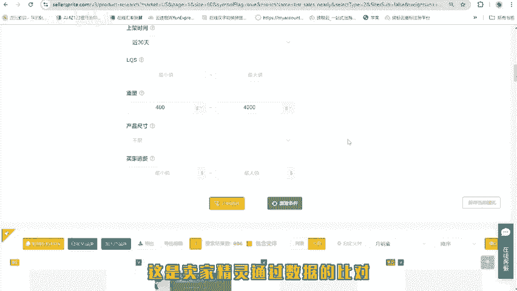
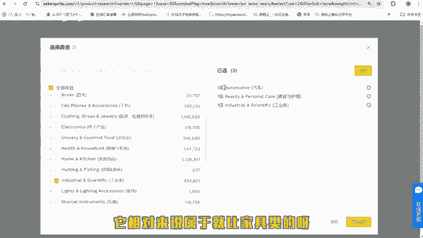
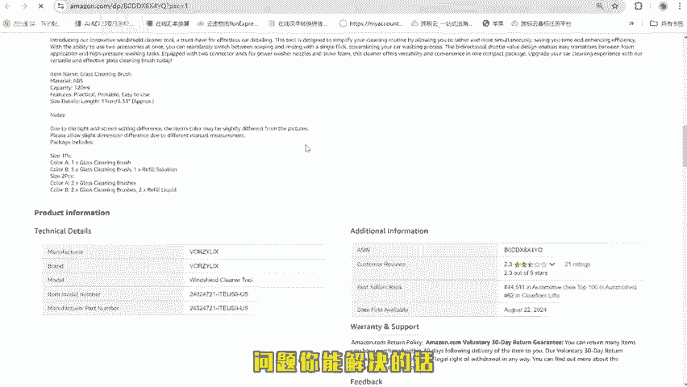
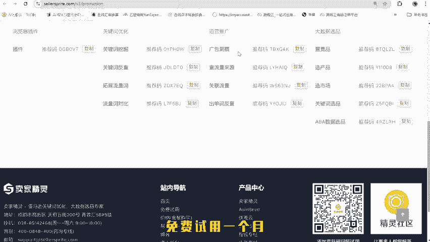

# 自发货选品新手教程 - P1 - 跨境电商星总 - BV1zgtke5Eoq

🎼做自发货选品不会的卖家，这个视频点赞收藏，后面有实操啊，让你快速的知道我该如何选品。🎼说起选品呢，很多卖家觉得很复杂，觉得啊这个不会啊，这个好难啊，这个这个等等各种壁垒。

其实选品是真的超级简单的一个工作。🎼差异无非是这些产品的数据表现怎么样。后面形成订单差异的呢是我们如何把这款产品推出去。这个视频告诉你如何用卖家经营的工具快速的找到你想做的产品。我们在做自发货的时候。

就是我的产品是从国内往国外发货的那我自然要去避开这个FB已经泛滥的市场，对吧？所以我们去看销量飙升吧，就最近一个月的销量增长很快。那么说明这个产品啊，要么别人之前有FBA的库存，要么呢还没有FB的库存。

但是目前增长比较快，它比较适合于我们现在立刻马上及时的去上架做BM默认的这个条件筛选呢是月销量300以上，月增长量10%以上。然后这些数据可以根据自己的需求去添加，我认为呢我们加上一个利润率40%以上。

上架的时间可以筛选。🎼等一下，就是最近30天重量啊最大的2公斤，2公斤是4000克。然后最小的话呢，我们可以去做一个比如说400克以上的。

因为重量太小的产品几乎啊很快就会被FBA替代或者本身已经有FB的产品，它不适合于你作为1个FBM的一个专业卖家哈。满足这些条件之后，配送方式。

我们就参照一下FBM就是对方这个销量增长也是FBM自发货的卖家增长比较快的开始筛选。🎼这是卖家精灵通过数据的比对帮我们带来的一个结论就节省了我们大量的一个主观的去搜集信息筛选信息。

它直接给到了我们一个相应的结果。然后我们通过这个结果去筛选，这个应该是床罩、沙发套之类的。

🎼鞋子类的产品。🎼自发货的卖家如果没有鞋子类的货源，就不用去做就往下面去看。你如果看到很常见的产品呢，我们可以犹豫一下。如果看到一些我不是太清楚的啊，这个东西干嘛的呀？我们就可以具体的去研究一下。好。

这个时候产品品类还是很多。我们回到一个类目筛选里面，在类目筛选里面，我作为自发货的卖家啊，因为我们也有接近5年的自发货的经验，那么我会去选择什么呢？汽车类的美容护理类的工业类的这一类的产品。

它相对来说属于就比家具类的呀，玩具类的呀，宠物类的呀，要小众不少。我们筛选了这个条件之后，确认选择。

🎼再看一下下面有没有只有两款产品，那这个可能不大okK方法就是如此哈。我们去看一下，然后这款产品销量896去亚马逊看一看，这应该是一款唇膏，美国制造上架8天。🎼这种带安全验证之类的产品呢。

我们需要多费一些心思，我们排除掉这个重量的限制，再筛选看一下。这个时候出来的产品就多了。工业类的汽配类的产品其实对于自发货的卖家来说，我认为是一个可以作为重点筛选的一个类目。因为它的利润相对来说比较高。

卖家呢也没有那么多。这些产品如果不清楚的，我们就可以进去具体的看一看这款产品的销量不错。但是呢这款产品很明显，评论不咋地。但是它的销量真的很O。

那如果说这款产品你能够找到质量好的这些差评带来的反馈问题你能解决的话，这款产品也是一个不错的选择。再比如这种带死式的啊，这种应该是有外观专利的。

🎼去掉侵权的产品，去掉利润低下的产品，去掉竞争很多的产品。那么作为自发货的卖家，这里面的产品就可以任你选择。最后想做自发货，不知道怎么使用工具的。这里有一份卖家精灵。

免费体验的邀请码复制邀请可以免费使用一个月。这里面卖家精灵所有的功能，你可以任选三个免费试用一个月，点赞收藏，感谢关注。

