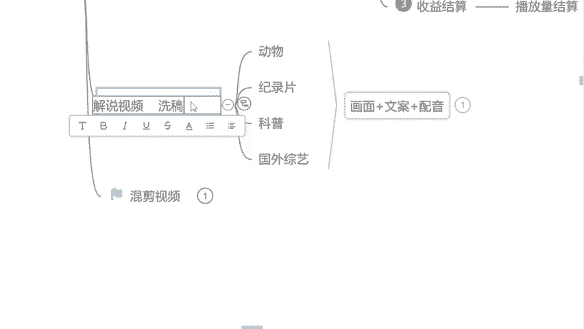

# 自媒体运营从0~1全攻略【基础入门篇】B站最良心的最新2024自媒体运营起号版全套教程（新媒体运营精华版） - P10：9.版权急平台审核机制 - 汪了个汪a - BV1MExWeuEUt

啊，如果说没有这个版权，你做不了影视啊，因为影视基本上都是要版权的。但如果说很多同学说曾老师，那我不做影视嘛，是吧？那不做影视的话呢，我就建议你们去做一些跟教育类相关的视频解说叫什么呢？

动物解说纪录片解说或者说这个科普类型的解说。现阶段呢这些领域是国家都支持的啊，国家都支持的。为什么呢？因为呃我们刚才也讲到了，因为前几年也是这个国家双减嘛。

是不是也是减少了我们学生在这个过程当中的一些补课负担，或者说兴趣班的一些负担。但现在孩子回家了之后，除开这个作业写完了之后，基本上都在这个短视频平台上面刷视频了，看一些什么呢？

看一些就是动物的纪录片的或者科普类型的一些视频，增加我们一下这个人的一些常识。😊，现在国家都比较支持我们可以去做这一个类型。因为我们什么呢？我们小时候也是一样的嘛，是吧？家长在家里面的时候。

永远不希望我们去看一些没有营养的动画片动漫，但是动物世界你肯定看过是不是是的，来举个手，打个式子吧，是不是动物世界有看过吗？就我们可以去做这个类型的啊？国家支持的这几个领域。

我们平台给你的扶持流量是其他领域的2倍啊。如果平常我们普通的情况之下，每一个视频的这个流量推送是在2000到5000它是双倍的，你就可以拿4000起步的一个流量了，是不是还是比较可观。

但是我们在讲这个解说之前呢，首先要强调一点，做解说，你不能去做洗稿。😊，有没有听过洗稿的，有的来一样的举个手吧，有没有做过洗稿的，或者说听过洗稿的。😡，洗稿是什么意思呢？就是我们很多同学呢想做解说。

但是呢害怕呃害怕这个写文案或者说不想写文案是吧？觉得他像写作文一样非常的难。但是这个时候呢，很多这个自媒写老师就会告诉你，没关系，同学们不会写是吧？我们就去做洗稿嘛。

把别人这个视频解说视频当中文案提取出来。我们用过这个用这个洗稿工具，把这个字字的一些顺序打乱是吧？添加一些这个什么近义词反义词给它调换一下，这样子就叫洗稿。😊，这样子的方法是不能去做的。首先你们强调啊。

它跟搬运是一样道理。如果说你去做95%的人，你连通过审核都不行，不会有人给你通过的。因为除了人工除了这个机器审核之外，还有人工审核的。包括现在我也自己在审核作品，就你们来看一下，就很多同学都明白一点。

就你的视频发出去，它永远在一个小时之内，你的播放量就已经到达上限了，有没有这样的情况，有的来打个有字。

有没有这样情况的？就比如说我举个例子，今天我发了一个视频是吧？一个小时的时候，我的播放量是500，1个小时之后它还是500，不会有任何的增加。这个就是内容重复的，我们永远给到你的，永远都是低流量推荐。

😡，嗯，内容不重复的，我们才会给您开始推荐更高的一个流量池。就是我不知道你们有没有看过这样的视频，就有的视频我们在刷的时候，月初的时候我们能看见它。你月底的时候你还能看见它。😊。

这样子视频才叫做优质的视频。你们要做的就是优质的。这个平台缺乏的就是优质的，并不需要你去做一些内容重复的这个内容，是不是？这个洗稿我首先强调一点啊，这个审核机制呢，当然你们可以保存好，但是想强调一点啊。

这是官方的东西，你们不能往外传好不好？这个你们自己留着做视频的时候，自己就看一看是吧？激励一下自己，不要去做这个洗稿的内容。

