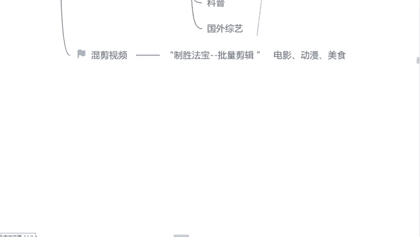
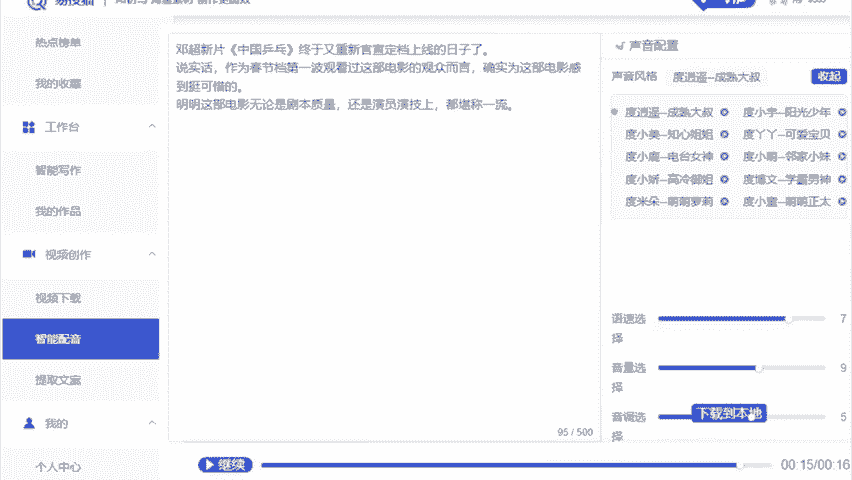
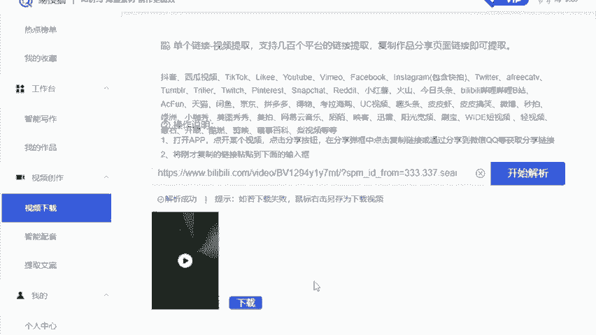
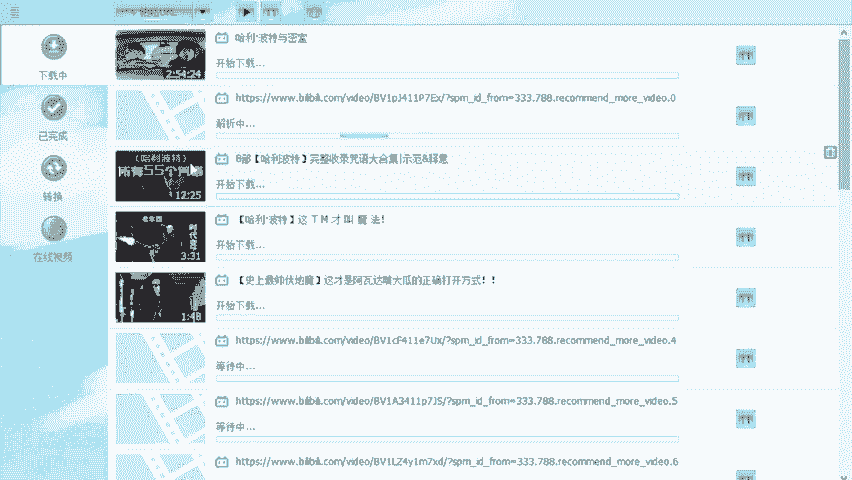
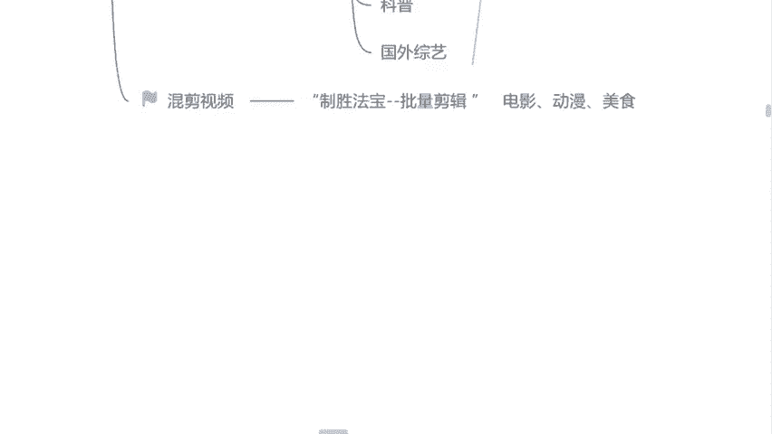
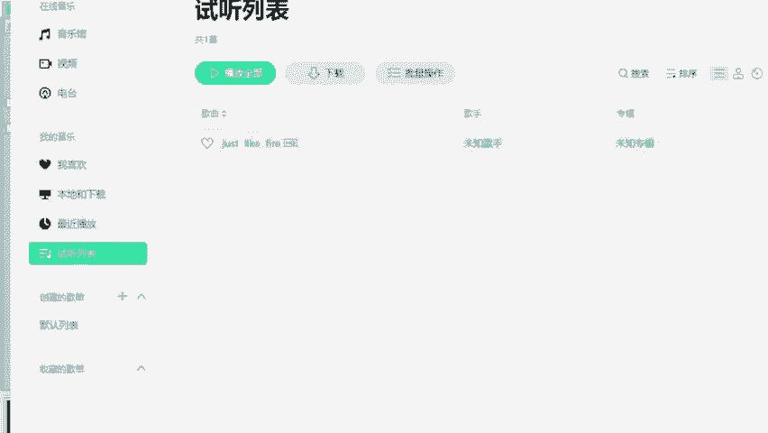

# 自媒体运营从0~1全攻略【基础入门篇】B站最良心的最新2024自媒体运营起号版全套教程（新媒体运营精华版） - P14：14.混剪视频批量下载 - 汪了个汪a - BV1MExWeuEUt

的那接下来第三个呢我要给你们讲到就是这个混剪视频了，就混剪视频呢，它肯定是最难的一个啊，这也是为什么现在你们在这个所有平台上面看的少的原因。因为真的很少人能够手动的去把这个混剪视频剪出来，很少。

因为非常考虑这个讲究技巧的。但是今天呢我不我不教你们怎么用这个手动去剪魂剪，我教你们用工具去替代人工剪辑。因为有句话说的也非常好。😊，当我们技术本身达不到一个这个要求，或者说没有一个很高的能力的同时。

我们叫借助工具，借助人脉去帮助我们达到目的。这是聪明人的做法是吧？包括这个工具呢是我的一个正式知神法宝名字呢就叫批量剪辑，虽然有点土。我也觉得它有点土是吧？但是呢我们不搞那些花里胡哨的，好不好？

我们能够知道它叫什么名字，知道他该怎么去用就可以了。那如果说我们想做这个混剪的话呢，强调一下什么样的内容是最好做魂剪的。首先打头的就是第一个电影。电影呢就是国内外的电影，我们平常应该会看吧。看电影吗？

喜欢看电影同学来举个手吧电影像我们国外的说的一些这个什么漫威呀，速度与激情啊，死神来了呀，是不是这样子的电影呢它粘合度是很高的，就比较适合做魂剪。那第二个呢就是我们所讲到的就是这个动漫就动漫的话呢。

像我们这个日漫也好，国产的动漫。也好，这里面非常多的一些特效场景，它也是比较好去做混检的。再一个就是呃一些特定的用户人群，美食类的也很好做啊，美食类它就比较大众化嘛。就最开始我做混检的时候。

我就做了一个关于美食类的混检。我做的混检，就是关于这个各个国家的一些国宴菜。因为风俗不同，地理位置不同，这心理也是比较足够的。所以当时那个视频的话呃。

100多万200多万的一个播放量差不多还是比较可观的。因为一些特定的用户人群嘛，最近嗯我相信应该很多人过年回来了过后都在减肥是吧？这个深夜的时候应该会去刷一些吃播吧，这个就是你能抓住的一些用户人群了。

是吧？我们想要去做这个魂剪的，我们得找素材，素材怎么找呢？换一个吧，我们刚才用的是西瓜，现在我们换一个用B站去找吧。B站知道是哪个嘛？哔哩哔哩。

来打开给你们看一下，就这个看见没？这个logo看见了吗？我们找到B站了过后呢，直接点开它搜索这一栏。今天我带你们去做一个嗯哈利波特，你们看不看？看哈利波特的来公屏上打一，我看一下。

这是我最喜欢的一个这个电影啊。我今天就教你们怎么去做这个哈利波特的一个混剪视频，好吧，我们直接去搜索一个关键词吧。哈利波特啊，我们搜索完了关键词过后呢，直接点击啊，点开了过后呢。

我们可以看见非常多的一个视频，是不是都是哈利波特的，我们随便来看一个吧。😊，Your attention， please。Let the feast。Begin。🎼First， this， first。

🎼Say all the words inside。这个视频是不是管理哈利波特的，是不是？欢迎来到魔法世界？小时候的回忆是吗？看来咱们是同龄人呢，握个手啊，小云同学是吧？

如果说我们想要去做这一类的视频的话呢？那我们首先第一个是需要去下载这个视频的那首先我们来看一下，无论是西瓜也好，B站也好，它下方没有任何一个选项是可以下载的，但是这个视频，我又想用，怎么办呢？

来找到这个视频上方，它有一个网页的链接，看见没？我们手机端也有的，我们直接去复制这个链接，然后打开我们自己一搜猫的首页位置，左下角有一个视频下载的选项，看见没？点开它把我们这个链接直接给它粘贴进去。

然后点击开始解析，左下角就可以下载了，是不是这一点就非常方便了。当然呢它也是单个下载素材的一种方法。我们想要去做批量的混剪，或者说我们想要做混剪视频，我们要下很多个素材。当然。😊。

不能只下一个，那这个素材怎么去下呢？同样的，我们根据这个网页对吧？直接复制它，然后呢，我们直接去看一下，看见没？有非常多的一些这个视频相同长度的，我们可以直接选择一个复制。复制完了过后，我们来筛选一下。

这个步骤呢，到时候你们记一下，好吧，我们后边呢都会用到的，来看一下有多少个视频呢，看见没？接近20多个，我们直接复制，然后呢我们要用到一个批量下载的软件。这个软件呢名字就叫批量下载啊。

这是我们公司自己研发的，后边呢送给你们使用。好吧，没有多大问题，我们直接点击这个粘贴这一栏，然后它就会自动去解析这个视频给我们下载下来了，看见没？是不是全部都是哈利波特的看见没？

开始下载了这些视频呢是非常方便的。但是我们在这个下载的过程当中呢，我们要用到一个批量剪辑的工具，这个工具呢，就我。

刚才提到的知深法宝了，我们来看一下该怎么去使用，好吧好？我们要呃选择这里边这一个超级混剪，然后多视频混剪这个选项。首先第一步把我们自己下载这个视频素材添加进去啊，添加进去。那第二步呢就是我们做混检。

是一定要去找一个音乐匹配的那这个音乐呢我提前找了一个来给你们看一下，这边听一下，觉得它可不可以。😊，🎼不是为。这个音乐觉得还可以吗？觉得可以的来公屏上打可以吧。这个音乐啊。

如果说你觉得你自己不太喜欢的也ok啊，咱们自己去找你找音乐的话呢，我就建议你们去这个简映里面找啊，剪映里面的音乐，它是有版权的，你们可以自己使用啊，那这个音乐我们添加好了过后呢。

来左下角紧接着我们要调整第一个数据了。怎么调整的呢？第一个有一个生成单个视频的时长，就我们做的这个视频到底要做一个多长的，一分钟的2分钟的还是3分钟的呢？是不是我们自己去调整，一分钟呢，它就是60秒嘛。

是不是两分钟呢就是120秒，3分钟呢就是180秒，我们这样去调就可以了。这个简单，是不是？那左下角呢有一个单个视频片段随机抽取，它有两个选项。第一个呢是每个视频片段随机抽取多少秒到多少秒作为一段。

那第二个呢是抽取单个片段的10%的时长。这个呢我不建议你们去选择啊。因为它剪出来这个视频的粘合度会有一点点。😊。

这个空闲的地方啊粘合不起来，就我建议你们选择第一个就可以了啊，每个片段随机抽取20秒25秒。就我们按一分钟这个时长来举例子。如果说这个视频的时长是一分钟的，我们就选择最中间那一部分，2025秒。

25秒到30秒，这个片段它是粘合度最高的啊，我们就这样去调整，我们选择1个25秒到30秒的。那这个调整完了过后呢，右下角只需要调整一个地方生成的视频数量。就以为它毕毕竟是一个批量剪辑工具嘛。

如果说你想剪10个，添加10个，添加100个也可以啊。这是批量剪辑的一个做法。其他的数据呢不用调整。你拿到这个工具的时候，所有的数据都是我们调整好了的，就不用动啊。那这个数量我们添加好了过后。

直接点击左下角开始它就会自动去抽取音频，抽取视频给我们合成一个混剪视频了。