# 自媒体运营从0~1全攻略【基础入门篇】B站最良心的最新2024自媒体运营起号版全套教程（新媒体运营精华版） - P1：自媒体18个素材网站 - 汪了个汪a - BV1MExWeuEUt

🎼表哥我出来了哦。😊，🎼如果你吃得了苦也熬得了夜，那么你一定要跟我一块做复制粘贴。这两年呢我一共坚持做了18个月，总共到手了这么多的收益。那付出的代价呢就是我已经将近有两个多月没有出过门了。

那我每天早上起床的第一件事情就是打开国外的视频平台去找到那些点赞，还有播放量的比较高的视频，将它的文案给它提取下来进行翻译，然后再将它的视频给它下载下来。我们手机里剪辑软件里的一键生成功能。

生成好了之后，发布到国内的自媒体平台上，就像B站还有今日头条这种只要视频有了播放平台就能给你产生收益了。一万的播放量收益大概是在40块钱左右。

那其实只要你有一定的播放量是可以达到一个非常不错的收入的那我这个方法它是真的不难难的是我们都需要有一个可以坚持下来的心。如果你感兴趣的话，可以在评论区里扣学习，或者单独给我发消息。

我可以分享给你一份免费的实操教程。那接下来我就给大家分享一下，我是如何做到日本视频的。😊。

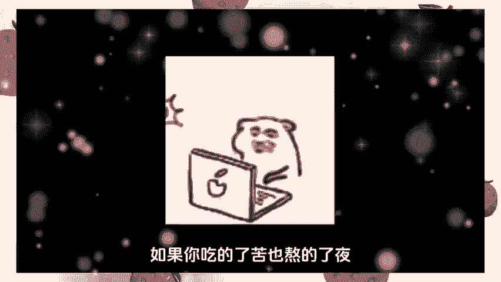

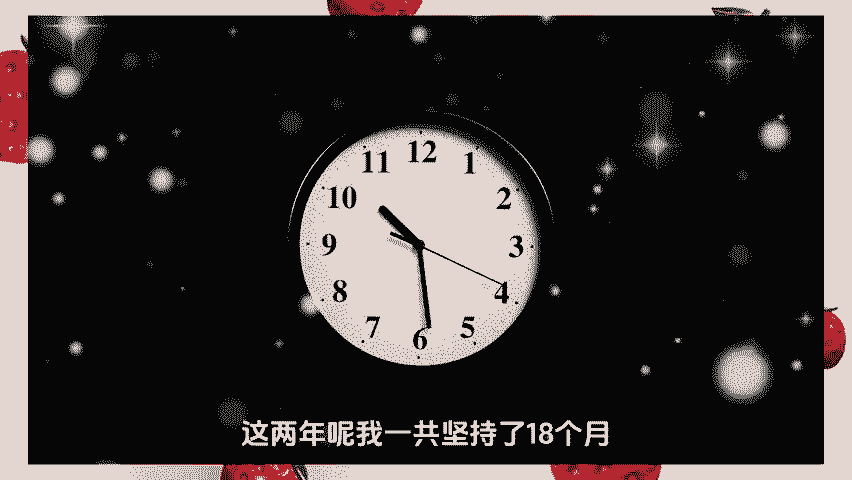

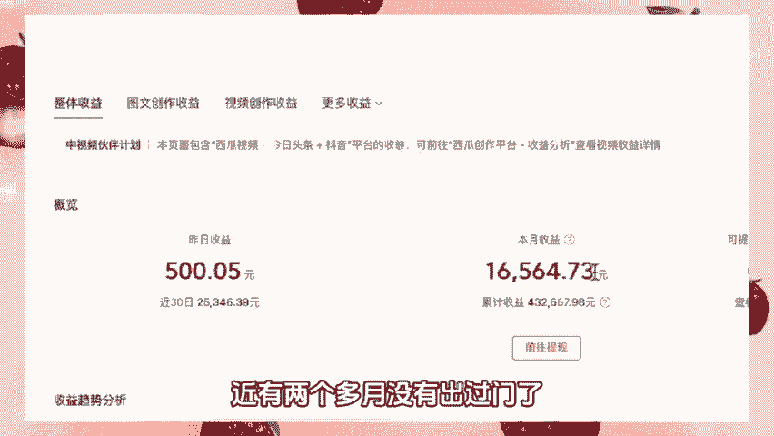

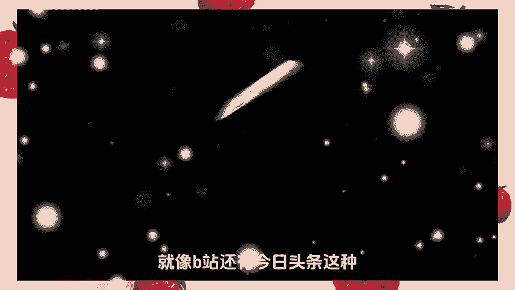

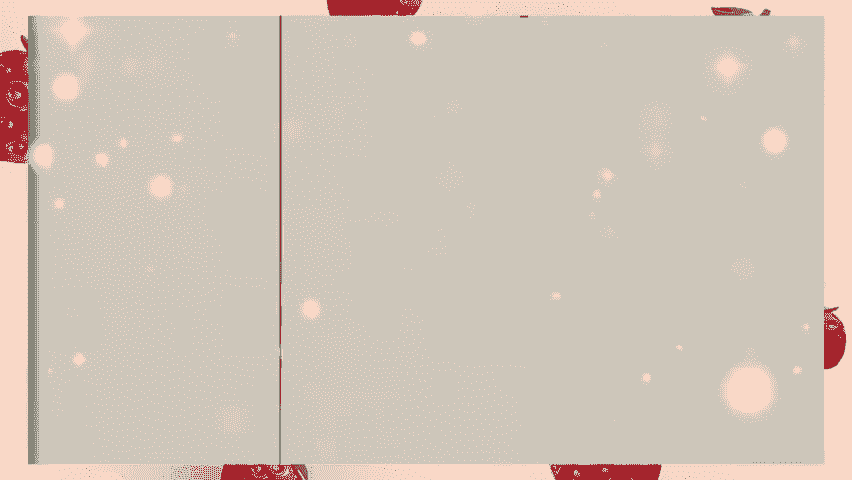

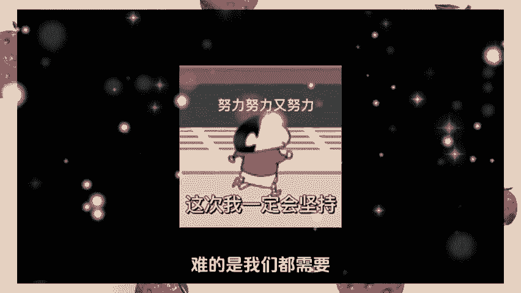

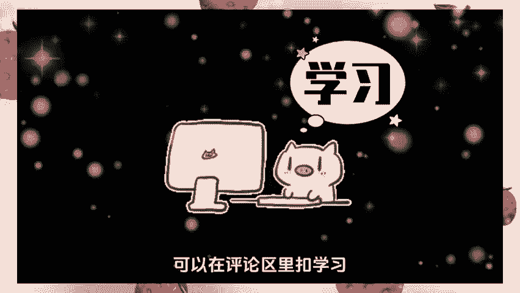

🎼文案类网站文案狗文案狗其实是一个导航网站，你可以在里面找到关于图片和文案的素材网站等等。第二个top在这里面呢你可以看到很多有创意的文案，同时呢还会有一些视频跟图片的拍摄创意。

尤其是你想要写出有创意的题目和文案的时候，那这个网站呢就可以给你带来灵感。第三个梅花网，这里面呢汇制了各种精彩的案例网站，基本上在互联网上面都传播的比较好。那你看过有精彩案例，上面几乎都是有的。

对于每一个精彩案例呢都会有自己的一个分析。在这里面啊你果学到不少关于营销传播的知识，并且呢可以运用在你的作品上。如果说你的作品足够好，你的能力足够强，也是可以在上面推广自己的哦。第四个译文网。

这是一个分析，各类优秀案例的网站。不过我觉得最有用的呢就是右边这个灵感日历，可以提前记录下每个日期会有什么热点事件，这样呢你就可以提前做一个准备，提前把控热点。这个呢是创作文案最重要的一点。

第二个运营类。😊，🎼网站第一个新榜新榜最有价值的呢就是可以帮你找到一些热门的内容。知到当下哪些内容在平台的热点最高。这样呢你就可以有针对性的进行创作，达到一个蹭热点的效果，获得一个非常好的流量数据。

第二个运营派，这是一个注重学习教学运营内容，运营用户等等的一个运营网站，重点呢是教你如何去运营作品。你要知道一个好的作品呢还得需要有好的运营，才是能发挥最大价值的。第三个素材类网站，第一个芯片场。

如果说你想要做短视频，那就要好好看一看这个网站里面啊有很多剪辑不错的视频，可以带给你一些不错的灵感。另外呢它有很多模板都是可以用的。比如说音乐图片，视频的素材也是可以下载的。

第二个开演这个呢是一个APP里面呢有很多剪辑精细的视频，拍摄有创意的视频。如果说你想要做视频创作就可以在里面学习到很多的拍摄手法，也是你想要的灵感的来源。第四个制作图片排版类的网站。😊。

🎼第一道天吧提供各种各样的模板可以设计封面，可以拼图，提供多种字体模板。图片模板呢基本上也是可以满足自媒体制作图片的一个需求。并且呢操作也是很简单的，是非常好用的一个网站。当然了。

它也是有APP可以进行操作的。第二个黄油相机，它里面最实用的功能呢就是字体风格比较多，可以在制作封面的时候啊，设计出很多好看的字体，也可以拿来做帖子。

第三个pix art这个呢是一个能够处理图片参数比较多的一个网站。我最喜欢用的功能啊，就是在一张图片上添加另一张图片的简易功能，操作呢也是非常方便的。

第四个美图秀秀一些人像啊还得是靠美图秀秀各种美图的参数设置，能够让你看到一个更好的字己。第五个visco这是一个滤镜做的比较好的一款相机可以给照片添加各种滤镜。的风格啊上面几乎都有第个图库类网站。

第一个pix有各种各样的高清图片提供免费的下载图片。😊。

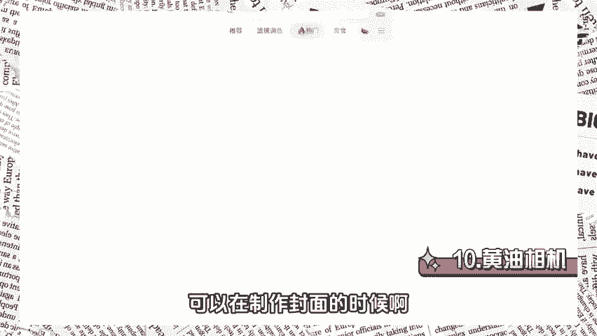

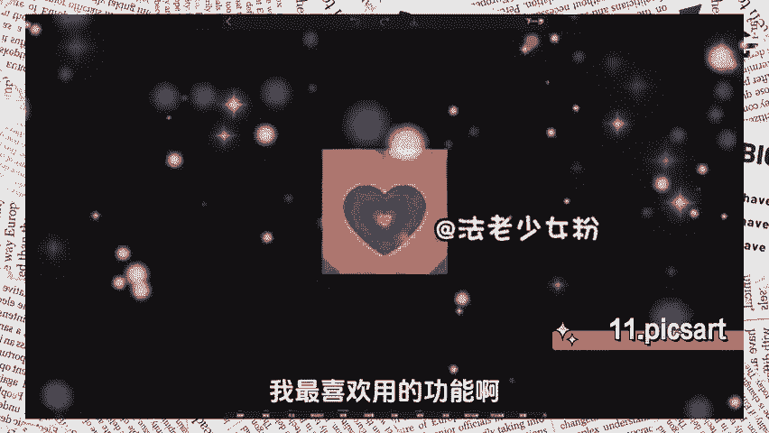

🎼风格有风景、人物、创意类等等，几乎是你想要的风格啊，上面都能找到。第二个堆糖它的图片呢偏向于小清新，也会有一些搞笑有创意的表情包。图片的清晰度呢也是非常可以的。

第三个这是一个高清的图片网站分类呢一目了然，可以根据心情地点或者是场景来选择你想要的图片查找图片也是非常方便的。第个这是一个高清的图片网站可以在上面找到很多有意境的图片。

第个这个是一个专注于美食的图片网站。这个网站呢可以看到各种各样拍摄精美的美食图片。其实呢对于一个自媒体创作者来说，有些图片的拍摄创意是可以模仿借鉴的。

在这个网站呢对于不少的美食博主也是能够提供不少的拍摄灵感。好了，那么以上呢就是我给大家分享的18个自媒体人都会用到的素材工具网站。如果对你来说有所帮助的话，可以点赞收藏转发本条视频。在评。😊。

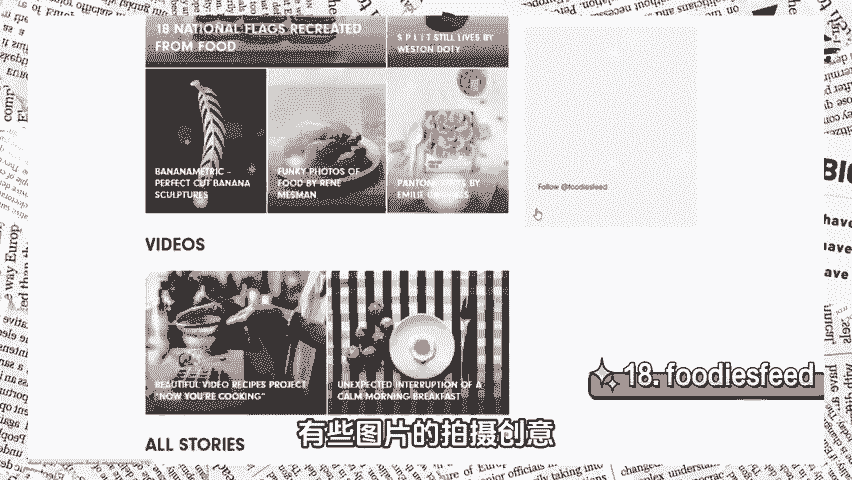

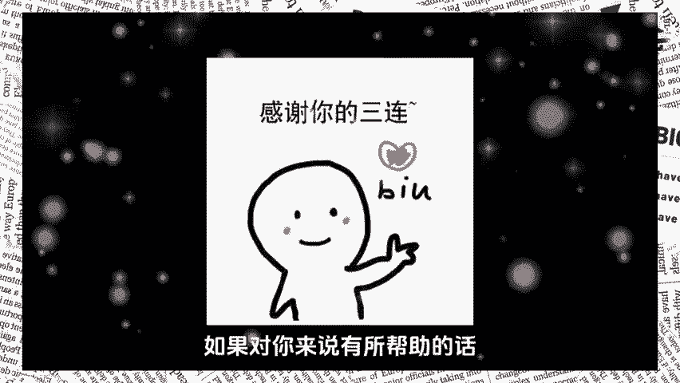

🎼区呢扣一个学习，我也会分享一节自媒体的实操直播教程给你。那么本期视频呢就到这里啦，我们下期再见，拜拜。😊。

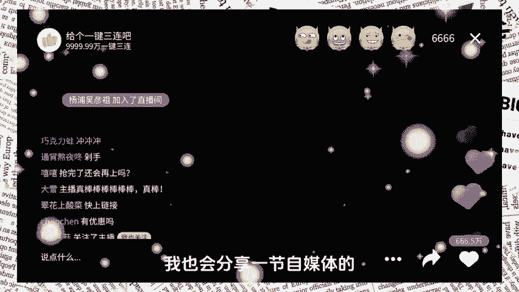

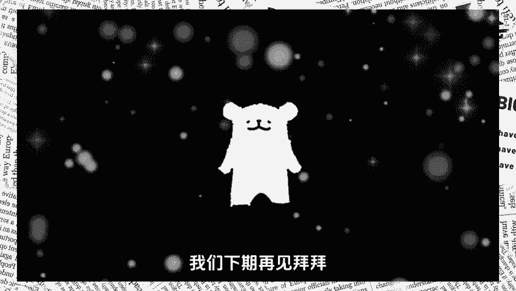

🎼。