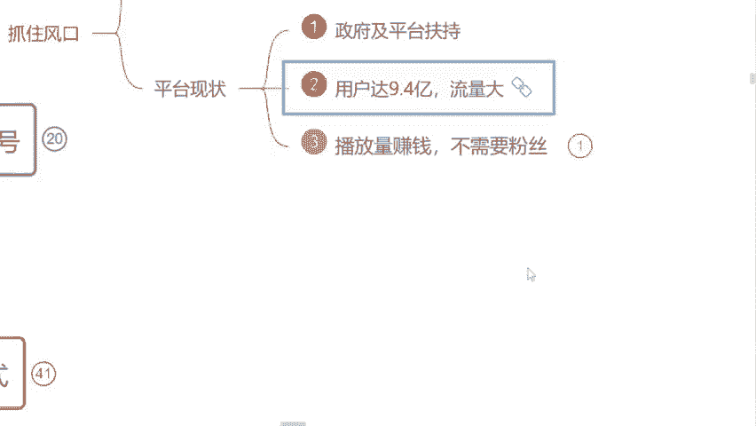

# 自媒体运营从0~1全攻略【基础入门篇】B站最良心的最新2024自媒体运营起号版全套教程（新媒体运营精华版） - P4：2.自媒体平台现状 - 汪了个汪a - BV1MExWeuEUt

那我们知道了到底什么是自媒体啊，那接下来呢我们需要了解到底这个行业我们可不可以去做呢？是吧？我们去做对于我们来说到底有一些什么样的好处呢？就在这之前呢，很多同学肯定多多少少都有了解过。

或者说想要去做一些兼职也好，或者说选择另一个行业，我们去跨行转转这个转工作是吧？这个过程当中呢，多多少少都会有疑问，哎，这个行业是不是真的到底能做哟啊，在这之前呢，因为近几年疫情的一个原因嘛。

很多人呃实体经济呢是受到打压的，其实没有赚到钱，对于这个上班族来说啊，是吧？那这个过程当中呢都想去找副业。但是呢我不知道你们有没有了解过啊，就很多人呢在这个过程当中有一种暴富的心态是吧？

我想一夜之间我就想要赚到很多钱，但是呢采取了一些不合法的手段去到缅甸这样地方被嘎腰子了的新闻有没有了解过有的来公大概有字吧，就这样子的行业呢，它是国家明令禁止了的不合法的，因为我们去做对。😊。

对我们来说没有任何的好处嘛，对不对？腰子都被干了，你以后身体都不健康了，是不是？那现阶段呢我们自媒体这个行业呢是属于国家支持的那国家支持的情况之下呢，已经把这个文件下达到了各个地方政府。

包括你们可以现在来看一下，这个呢是一个荆州市的六项措施啊，助力自媒体以及新媒体高质量发展的一个文件。它是去年6月份发布的是哪个地方来发布的呢？看一下人社局人社局是一个什么单位呀，是不是国家的政府单位。

是不是包括呢这个文件当中也指出了，我们要加大政策宣传力度，有力支持自媒体以及新媒体行业的蓬勃发展。包括呢你们也可以来看一下有没有咱们自己的这个地方。好吧，往下边看呢，这个是广西壮族自治区的啊。

都是有关于新媒体的，看见了吗？

包括往下边看，这个呢是四川省人民政府的，哎，看见没？都是新媒体的，以及这个浙江省人民政府啊，以及这个杭州市人民政府和这个江西省赣州市人民政府都发布了相应的一个政策性文件。包括这个文件当中呢，也指出了。

哎，说我们要坚持什么正确导向，以及我们未来作为这个创作视频的人，或者说创作文章的人，我们发的这个文章和视频，它才是结算收益最重要的一个方式和方法。包括我们讲到这里，同学们觉得这个行业它可以来做吗？

你觉得可以的来打可以吧，是不是国家的文件它都已经有了，是不是我们可以大胆的放心的去做，但是这个过程当中得强调一点哈。我们国内这个自媒体平台呢还是比较严格的，什么不能做呀，什么黄赌嘟擦边的东西不能做。

比如说举个例子吧，就像我们这个呃去年啊这个年底的时候比较。😊。

🎼火热的一个这个APP叫这个ttok是吧？海外版的抖音，这个上面的视频呢就是比较这个擦边的东西。这样子的视频不能放到我们国内的平台上来啊，这一点我首先要强调好不？那除此之外呢，这个国家的政府文件有了。

对吧？有一句话说的非常好，就任何一个平台，或者说我们这个任何一个行业，有句话叫跟着国家的脚步走，我们是一定能够赚到钱的那现在这个文件有了过后呢，我们自媒体平台，它也得响应国家的一个号召啊。

他也支持我们做这个视频，也支持我们去成为一个这个视频的创作者那到底给了我们一些什么样的支持呢？首先我们来看一个视频了解一下。我们希望接下来能够帮助更多的中视频创作者成为职业创作人。

职业创作人的意思就是以创作视频为职业，并且通过创作视频就可以过上更好的生活。那为了实现这个目标，未来一年，西瓜视频决定将额外拿出20亿元补贴中视品创作人。我想强调两点哈，第一这是真金白银的20亿元。

不包含任何的商单、直播和电商的收入是纯补贴。🎼我们也会积极探索保底加分成的模式，助力创作人职业化，这可能也是行业首创。🎼第二，20元只是保底上不封顶。

🎼啊，说到这里呢，我想。好，这个视频呢我们先看到这里哈。同学们从这个视频当中去获取到了一些什么样有用的信息呢？就这个自媒体平台，它给到我们多少钱去让我们创作视频呢？如果你看见这个数字呢。

你可以打在公屏上面哎，我看见了哈这个开心这个泪花同学在说，知道他西瓜老大，对了，是吧？还有20亿的这个创作基金，对吧？包括呢这个创始人也提到了这20亿元里面，不包含任何的商单直播以及电商的收入是什么？

是纯补贴纯播放量的收益。谁说我们作为自媒体创作者，只有带货带货一条路才能赚到钱呢？是不是除此之外，我们做视频做文章一样能靠这个播放量去变现的啊，就看你自己要不要去做这个视频，这20亿呢。

就是我们未来能够赚到钱那除此之外呢，就像我们现阶段这个自媒体行业呢，本身他这个行业的话呢，就他的流量非常庞大的。刚才我们说到了多少人呢？😊，接近10亿了，对不对？包括呢这个去年啊年底的时候。

这个中国研究生网站也出台了相应的一个自媒体行业的市场调查以及发展前景的分析报告。这个报告当中指出了现阶段，我国的中国网民规模多少人，9。4亿人啊，接近10亿了嘛，对不对？这个是什么呢？这个是看视频的人。

现在小学生、中学生、大学生、成年人，70后、80后、90后、95后、00后甚至01后的人都在这个平台上面去刷视频。那刷视频的人有这么多看视频的人肯定也有啊，做视频的人肯定也有有多少呢？来，截止去年为止。

我国全职从事自媒体的是370万，兼职从事自媒体的是600万，就我们加在一起呢，一共是970万人在从事这个自媒体行业，我们俩算个整数，算1000万嘛，好不好？就1000万的人，他在做视频。10亿的人。

他在看视频这个。就相当于100个人里面只有一个人在做视频，问一下同学们，我这一个人做的视频够不够咱们100个人去看呢？你觉得够的来打个够字吧，你觉得不够的，你打不够够吗？就我一个人做视频的速度。

他能不能赶上你们这个看视频的速度呀？就果说我们最这个最呃慢的情况之下，可能半个小时要创作一个视频是吧？你看视频几秒钟甚至一分钟2分钟，我就已经把这个视频刷了很多了，是不是不够。

这也是为什么现阶段我们国家在支持我们这个自媒体行业发展的一个原因了，是吧？包括呢再往下边看，就很多同学说这个行业饱和了，我们就来看啊，饱没饱和。包括呢在这里有一个自媒体发展的趋势分析。

在大数据时代背景之下，实际上自媒体行业远远没有饱和，那说到这里同学们觉得这个自媒体行业它饱和了嘛？你觉得没有的来打个没有，你觉得有的打个有字吧，有没有饱和呀。有说这一句话。

如果说他没有加加上远远这两个字，我觉得现阶现阶段你可以不来选择这个行业了，有可能饱和了。😡，是吧它还加上了远远这两个字，说明我们这个自媒条业在未来十年之之间，你都可以把它选择作为兼职也好。

作为这个全职也好，来赚钱的一个这个行业了，是吧？包括我们讲到这里啊，这个呃过程当中，我们也知道这个行业它没有饱和了是吧？那为什么要去做它呢？

