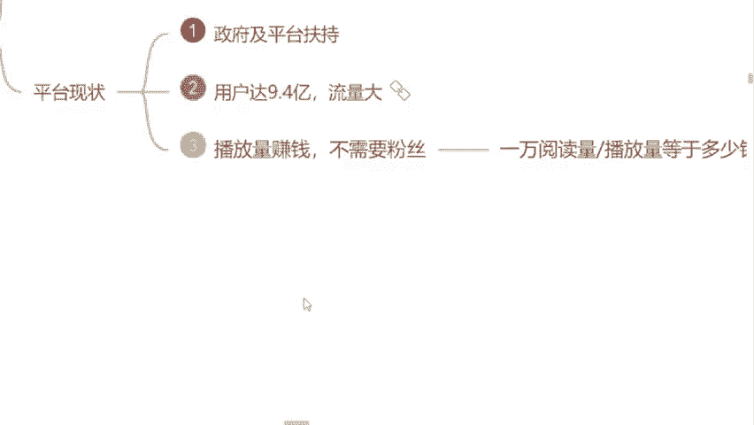

# 自媒体运营从0~1全攻略【基础入门篇】B站最良心的最新2024自媒体运营起号版全套教程（新媒体运营精华版） - P5：3.如何靠播放量赚钱 - 汪了个汪a - BV1MExWeuEUt

🎼首先我选择这个行业呢有一个最基础的原因。对于我们零基础，对于小白来呃小白的人来说是最友好的。我当初选择自媒体也是因为他为什么呢？不需要我们有任何的一个粉丝基础。我说我长得也不是多么的漂亮是吧？

我也不是网红，我又不是明星啊，是吧？那现阶段呢，我去做这个自媒体，我能做起来吗？是不是我们有粉丝呀，很多人都会有这样的疑惑，是不是有这样的担心，但是呢现在我告诉你们，我们自媒体平台。

我们自媒体行业不需要我们有任何的粉丝基础，我们去发视频，靠这个播放量，依然可以去结算收益。😊，因为很多同学在这个过程当中了解的最多的一个自媒体平台是不是抖音啊？是的，来公屏上打是，我看一下。

就是我们平常用这个刷视频用的最多的平台，不是抖音，就是快手，是不是就这两个平台嘛，我们了解了，那这两个平台呢它不靠这个播放量结算的，它是靠什么呀？有没有同学知道的，这两个平台靠什么去变现的。

靠什么去赚钱的。😊，有同学知道吗？因为现阶段我们这个抖音也好，这个快手也好，几乎啊它已经变成了这个商业化的模式。我们全部是靠这个带货去变现的，是不是你们有没有在抖音上面去买过东西呀，9。9块的是9。

9块的，不管他有没有用，我们都去买一点，是不是都看见了他带货能赚钱，对不对？但是我们自媒体平台呢跟抖音它是有一个这个不同的区别的，啊，我们在这个平台上面去发视频，我们靠这个播放量结算收益。

我们需要了解的是什么呢？一万的播放量，我们到底能够拿到多少钱为什么是以万为单位呢？很多同学会有这样的疑问，那老师为什么是以万呢？没有以千为单位嘛？当然有啊以千为单位的单价它是有的。

但是呢只有我们达到1万播放量的时候产生的这个收益，我们才是能够提现的。我这样讲能不能明白能的来供屏打个能字吧，是吧？包括呢我们现在去看一下这个单价到底是多少嘛？是不是？包括呢我用。账号给你看好吧。

首先呢现在我们在这里看见了一个千次的阅读单价，这个数字能不能看懂啊，能不能看清楚能看见的来，你把这个数字打在公屏上面吧，吧这个单价到多少呀？1000的播放量是4。2块钱，就1000的播放量嘛。

我能赚到4块钱，但这4块钱咱们提现不了，只有达到1万播放量的时候才能提现一万的播放量多少呢？乘以1万嘛，就是42块钱啊，是不是这42块钱，就是未来我们能够揣在自己兜里面，提现到银行卡里面前。

这个数字你们要记清楚哦，等一下曾曾老师会问的啊，不要左耳朵进了，右耳朵就出了是吧？我们想要去赚钱，首先得把这个单价要记清楚，好不好？包括呢现在我们知道这个单价了，是吧？我们讲到这里。😊。

这个国家也支持的一个行业，包括现在这个行业呢，它也没有饱和是吧？我们纯靠这个播放量都可以去变现的，不需要我们有任何的一个粉丝基础的这样子的一个行业，它值得咱们去做吗？你觉得值得啊，来公屏上打个值吧。

知道吗？是吧？有句话说的非常好啊，顺风奔跑，猪都能起飞，是吧？就看我们自己能不能去做一只风口上面的猪了，是不是啊，想不想想的来公屏上打个响字，我看一下，想不想做一只顺风奔跑的猪啊。😊，🎼想是吗？

好的好的，我看见了好的好的，说明非常的不错啊。同学们理解了这样一个道理。那我们现在这个行业很多同学说怎哪时候我觉得可以做呀，是吧？他赚钱，但是我真的我发过视频的是吧？我发过视频的，但这个视频发出去。

他为什么永远都是领播放量呢？为什么呀？是吧？为什么这个播放量有时候多呃这个有100甚至多的时候有1000的播放量，但他提不了现呀，就只有几块钱，是不是就这个平台很多同学都会问。

是不是现在现在这个平台他已经不不需要去这个拉新了呢？我们新用户注册对于我们来说没有任何的扶持的呢？他给我限流处理了，其实不是这样子的？😊，我们了解一下。

