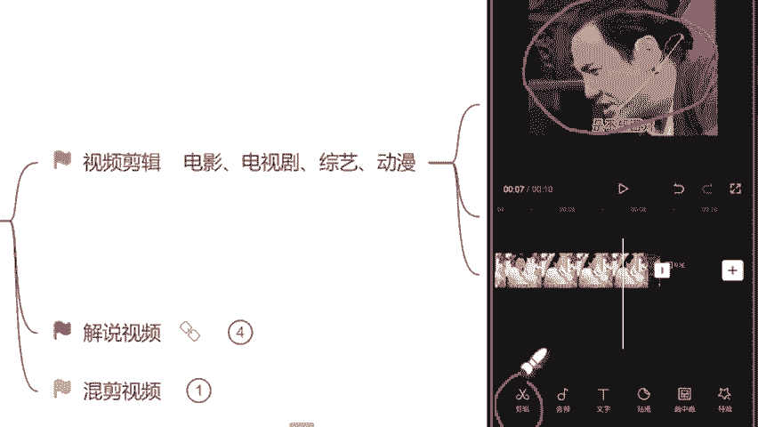
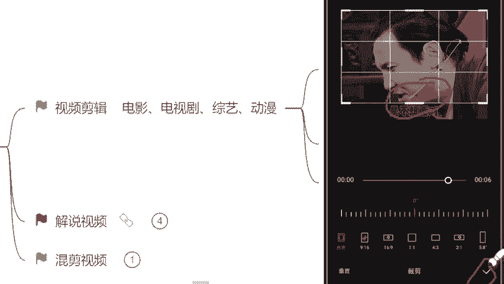
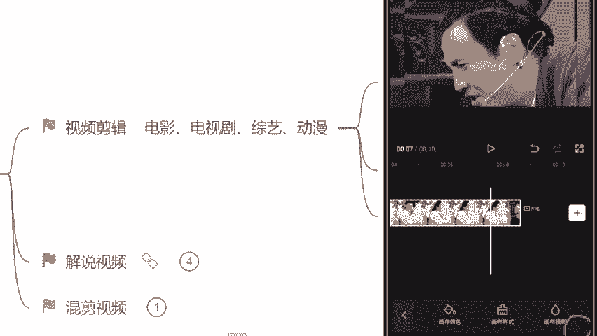
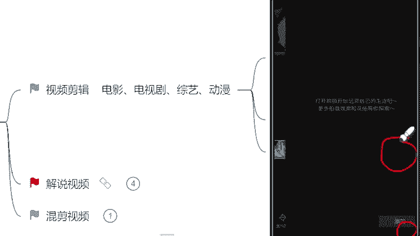
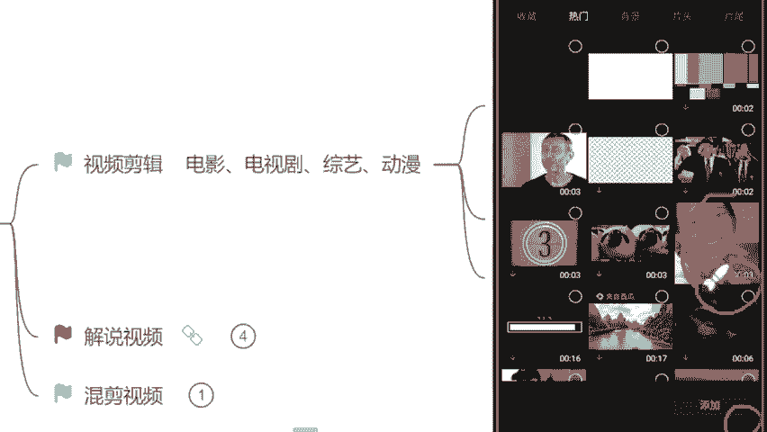
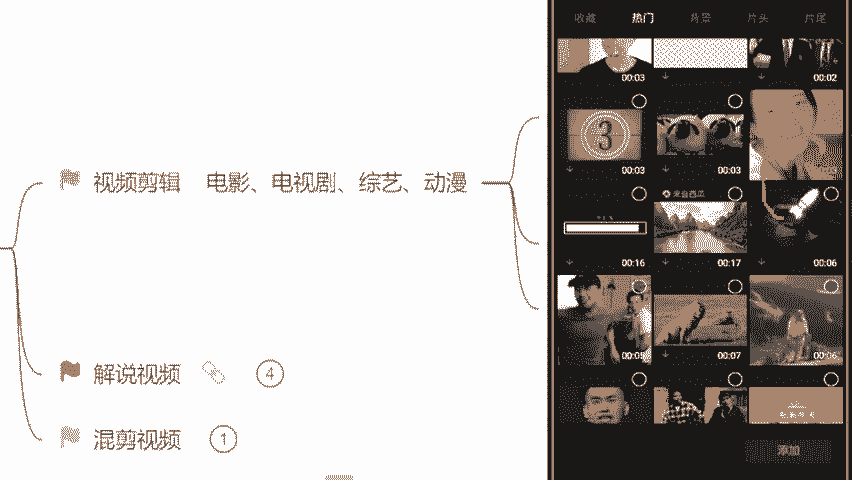
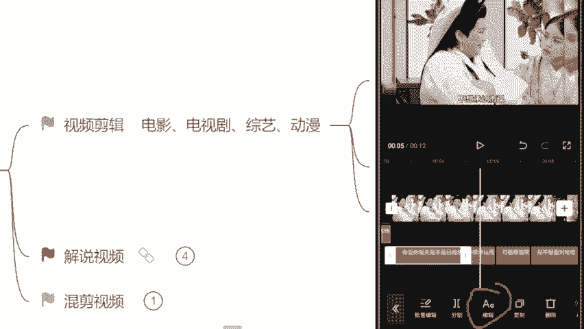
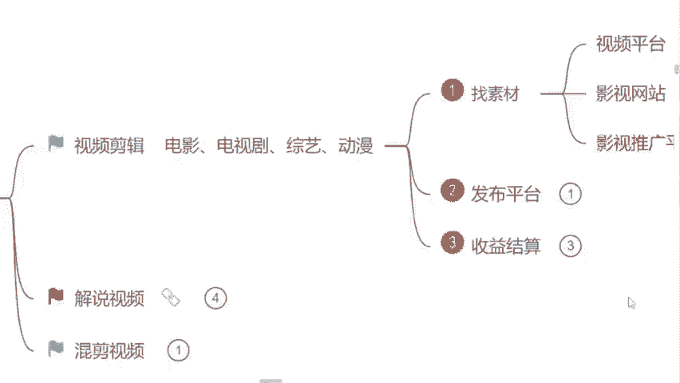

# 自媒体运营从0~1全攻略【基础入门篇】B站最良心的最新2024自媒体运营起号版全套教程（新媒体运营精华版） - P8：6.视频剪辑实操（下） - 汪了个汪a - BV1MExWeuEUt

以了那首先呢我们来看这个视频啊，我们找素材过程当中，你找的素材不可能啊，每一个都是16比9的那我们需要自己去调整的啊，就像我们这个视频一样，看见没？它就不是1个16比9横屏。但这个视频我又想用怎么办呢？

啊，来紧接着告诉你们一个最简单的方式。那没右下角有一个比例的选项，直接点击它里边会有1个16比99比16两个选项，选哪一个知道了吧，16比9啊，横屏的这一个选完了过后，紧接着你就来看看什么。

你就看这个视频它动还是没动如果说像咱们这个视频一样，它一动也不动是吧？我在上边讲的类累累的汗都出来了，它在上边一动不动的那紧接着怎么办呢？这个视频我们又想用来我们自己去调整啊，自己去调整。

我们自己去剪辑这个比例，这样子的方式呢，它可以扩大你用的素材的范围啊，不用担心这个素材啊。这个书台我这个比例用不了了怎么办呢？就没办法了吗？不是的，来，紧接着找到最左边有一个剪辑的选项，看见没？

选择它，然后里边有一个编辑的选项，里面裁剪找到了过后来强调一下我们原本这个视频里面自带的这个字幕全部给它裁掉啊，不要留下来，一个都不要留裁剪过程当中，你们稍微仔细一点啊，不要留这个黑色的边框留太多。

留太多了过后呃，有一个黑色背景就不好看了，那现在裁剪完了过后来右下角对勾点起来是吧？这样子我们视频就裁剪完了，那裁剪完了过后，你再来看是不是视频画面放大了，更加清晰了，但是它也不是1个16比9横屏。

那怎么办呢？找到右下角有一个背景的选项，听见没？给你圈出来了哈，一定要记住，找到背景选择右边这一个画布模糊，选择第一个清晰的画面。

现在来看这是不是1个16比9的横屏了呀？这个步骤有没有记住，记住了的来公屏上打一，这个步骤记住了吗？是不是16比9的横屏就出来了啊，紧接着选择右下角这个对勾。好，记住了哈，选项记住就行了。

那现在我们这个比例放大了是吧？我们16比9横屏也调整完了，来，紧接着要干嘛呢？要给这一个视频添加一个转场，我不知道同学们在这个平常看视频的过程当中，有没有这个看到过转场视频，就是比如说举一个例子吧。

我们今天看一个什么盘点类的视频是吧？每一个这个视频片段的中间，它会给你添加一个搞笑的片段，但是不属于任何一个这个视频内容里面的。😊，有没有看到过这个？有的来公屏上打有字吧，有没有看到过这个就叫转场啊。

就为什么要添加它呢？😡，就我们要让用户明确的知道第一个视频看完了。第二个视频跟第一个它完全不一样。无论是场景不一样还是人物不一样，还是说视频的内容不一样，你就要让他知道是不一样的。

如果说这个过程当中我们不添加转场。第一个视频完了，第二个视频紧接着来了是吧？我们用户心里都会咯噔一下，哎，怎么这个视频涨的不一样呢？是不是我看的不对呀，在这个时候就干嘛退出去啊，再看一遍。

我今天看的这个视频主题到底是什么？一旦他退出去了，这个视频它的什么完播率就会直线下降，完播率它是会影响什么呢？我们视频的单价的，所以说这个是非常重要的，转场该怎么去添加呢？

找到右边这个加号的位置依然是它点击加号，然后找到素材库里边热门里边非常多转场。像这种的这种的这种的熟悉吗？同学们这个转场熟悉吗？是。

看到过。现在基本上在现在平台里面，所有的一些转场视频都从这个简易里面找的啊，你们去用啊，这个大胆的去用就可以了。但找转场的过程当中呢，强调一遍啊，不要过长了。

像这种6秒的7秒的17秒的什么16秒钟这些转场不要去用啊，我们尽量简短一点。因为我们没有任何一个人有耐心。他把这个过程当中一个替代性的过渡性的东西给他看完，没有的，转场保持在3到5秒钟是最合适的。好吧。

记住我们就选择一个3秒钟的给他添加进去。

好，现在添加进去过后来看一下转场它跟我们这个所有的一个视频比例也要保持一致，是么呢？16比9啊，你选择这个视频呢，右下角就会有一个画布模糊了。你直接选择它点击第一个清晰的画面就可以了啊。

它就是1个16比9的横屏。那现在转场添加完了过后来下一步是吧？识别字幕了。那这个视频的字幕该怎么识别呢？最简单的一种方法，找到左下角这个文字的选项，看见没？选择它然后新建文本，右边有一个什么识别字幕。

我们直接选择识别字幕点击开始匹配这个软件会自动去给你识别这个视频当中人物所说的话啊，给你形成字幕，是不是非常的方便。字幕识别完了过后呢，这个调整一个就可以了，放大一点啊，右下角这个正方形往右边啦。

放大了过后，整体把这个字幕条给它拖动到视频最下方。哪个位置来啊，这样看起来是比较舒服的，你调整完了一个，第二个你就再不用调整了啊，因为它都会随之调整这个视频这个背景该怎么去添加比例该怎么去调整。

字幕以及转场该怎么去添加，有记住了的同学来公屏上打一是吧？有记住了的，有学会了的，公屏上打一，或者说来小鲜花可以刷起来了，是不是？就按照这样的一个模式去做，这既有自己的一个想法。

这个视频它这个完成度也是比较高的。问一下同学们难不难呀？

你觉得难的来公屏上打个难字吧，觉得这个不难的打不难难吗？其实不难，对不对？这个视频嘛看起来就有手都能做，是不是？😊。

