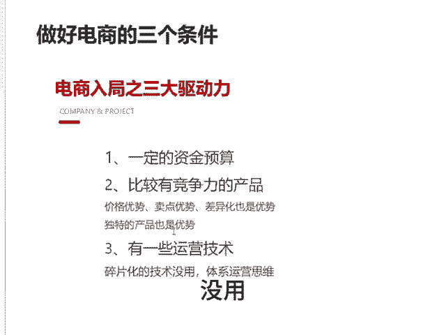

# 自知者明 - P1 - 千优电商教育 - BV1QV2dYeESm

就是很多普通人为什么做不好电商。其实原因很简单，有句话叫自知者明，知人者智吗？他做电商呢他也不自知也不知人。然后呢总是以卵击食。那什么叫以卵即石呢，就用自己的弱点去碰别人的强的地方，那这事儿你能干成吗？

我们知道做电商才有三个条件，就被称为电商路局这三大驱动力，就是你要有一定的资金，或者说呢你比较有竞争力的产品，或者说你有一些运营技术，那么你思考一下你的优势是什么？那很多人呢他说我做一些销量。

然后我出一些评价，然后我学了一个指数单，我可以明确的告诉你，你在抖音上刷到的所有黑科技，白科技通通没用，为什么？因为这玩意儿你能学会别人也能学会啊，而且你学的这些玩意儿实用不实用还是另外一回事。

所以呢你一定要静下心来，你要考虑你的产品有什么优势。你说我是工厂，那价格优势也可以啊，啊，你说我没价格优势，那有卖点优势也行，你说我没别的优势，那你的产品做一些差。😡，差异化也是优势。

哪怕只是包装差异化，或者说你的产品有独特于别人的地方也可以。还有一个，那么除了产品之外，你有没有一些系统化的运营思维。现在我可以说碎片化的技术没用。

所以说呢你一定从资金产品技术这三个方面考虑一下自己有没有优势。你说我啥都没有，我就有一腔的热血，我要努力，抱歉，没用，还是洗洗睡吧。我是讲师大牙，欢迎大家扫码添加我的微信。

不方便扫码的朋友可以添加我的微信号，80221430。在这里给大家准备到了一套新手运营入门的大礼包，希望能够帮助大家。😡。

