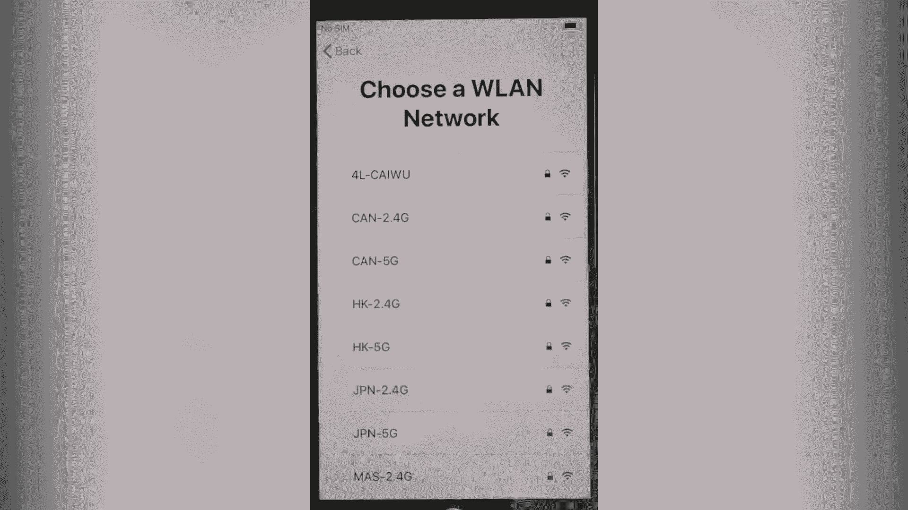
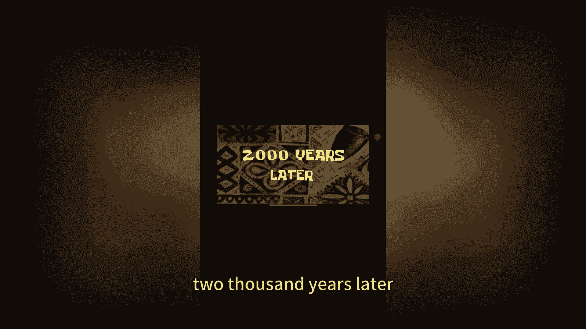
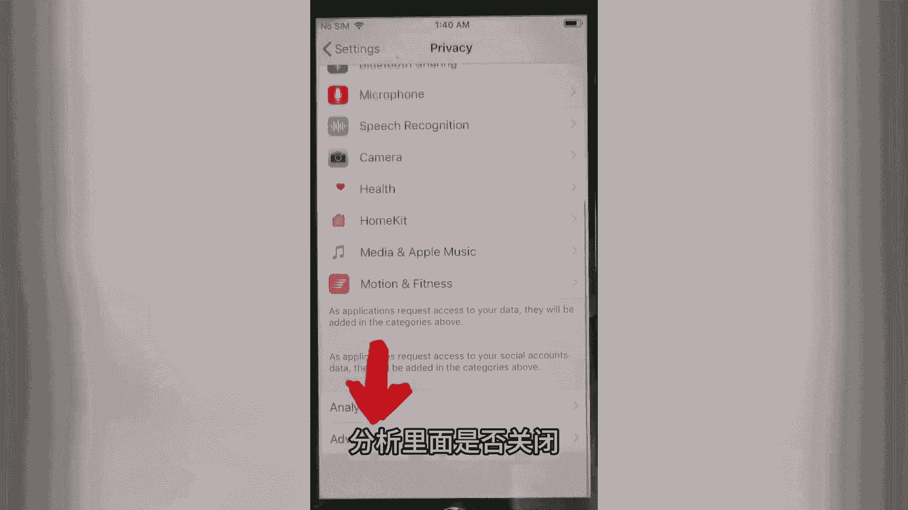
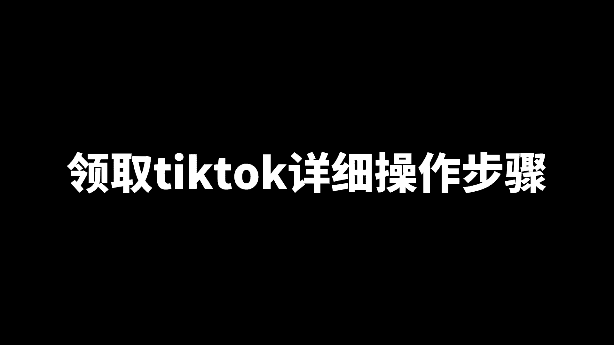

# 苹果手机最新tiktok教程，2024最完美的苹果手机tiktok配置实操，运营起号教程 - P1 - 芒果自媒体 - BV1Tx4y147Y3

完美的TIKTOK苹果手机环境配置教程，使用IPHONE7及以上手机，现以七为例，视频有点长，可以收藏，打开设置，找到通用，还原抹掉所有内容和设置。

继续抹掉iphone two thousand years later，选择语言，准备做美国，所以选英语，us手动设置，现在不选择一个美国的网络。

Two thousand years later。

选择继续，稍后设置，不使用不使用密码，不传送应用日志，忘记密码或者没有id，稍后设置，不使用，同意继续不使用定位确定，稍后设置，稍后设置，不共享稍后设置，选择下一步开始使用，现在已经刷机结束了。

后面开始设置一下，屏幕时间，这是我的IPHONE，在隐私设置里，除了照片和麦克风，其他都选择不允许，找到通用airdrop，选择所有人时间日期关闭，自动拾取，改为你需要的，这里我们就改成落成。

找到隐私检查定位是否关闭。

