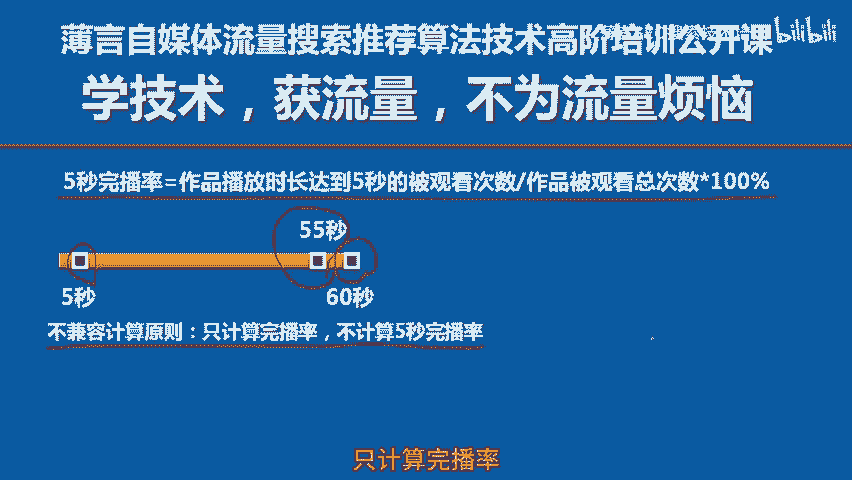
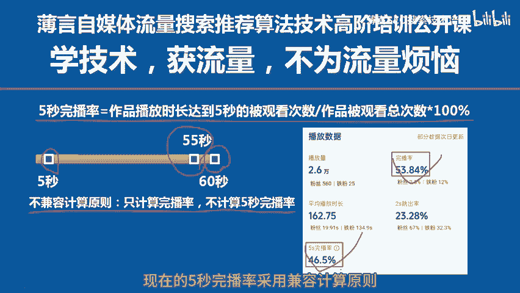

# 薄言抖音运营抖音seo新媒体运营抖音视频号5秒完播率最新算法定义是新媒体运营培训课程和新媒体运营工作内容重点，也是自媒体平台算法推荐和算法技术的体现 - P1 - 薄言SEO搜索技术培训 - BV1Z5xCekErK

Yeah。

🎼5秒完播率的算法定义最近做出了比较大的更新，所以专门做一期视频给大家讲解一下5秒完播率不同于完播率。抖音视频号的完播率考量的是整个视频的完整播放情况。但是5秒完播率则恰恰相反。

它考量的是短视频开头5秒，这个局部的播放完成情况，也就是开头部分能不能吸引人看下去。抖音视频号对于5秒完播率的官方定义是作品播放时长达到5秒的被观看次数与作品被观看总次数的比值。

这里有一个非常重要的不兼容计算原则。我举例给大家说明一下。比如你发布了一个时长为60秒，也就是一分钟的短视频，这是一个60秒的时间轴，代表短视频的时间长度，这里是第5秒钟，这里是视频的最后一秒。

也就是第60秒。如果一个观众对这个视频进行了完全播放，完全播放并不是只一定要播放的最后一秒才算完播哈。根据视频内容时长不同，有些播放达到了80%或者70%或者60%左右就算完播了。我在短视频被播放多少。

才能算完播那一期视频公开课里都有详细的讲解。有兴趣的朋友可以翻看一下前面的视频公开课。当观众对这个视频进行了完播，此时只计算完播率，但是不计算5秒完播率，这就会导致有些视频出现完播率大于5秒完播率情况。

比如有一个观众把这个视。🎼播放到了第55秒钟。这个时候根据完播率的DOR和AVT的计算方式，已经可以算是一次完播了。因此，这次播放只计算完播率，但是不计算5秒完播率，这就是不兼容计算原则。

当播放超过5秒，且达到了完播标准的时候，只计算完播率，但是不会计算5秒完播率啊，这就会导致一旦很多次播放都是完播的话就会出现完播率大于5秒完播率的这种不合情理的状况。为了纠正这个现象。

现在的5秒完播率采用兼容计算原则，也就是只要大于5秒钟的播放，无论是否完播都会分别计算5秒完播率和完播率。同样的这个视频被播放到了55秒钟，已经算是一次完播了。

这个时候都会分别记入一次5秒完播率和一次完播率。在这样的规则下，5秒完播率永远都是大于完播率了。掌握这些指标的算法定义和计算规则，对于我们掌握用户的行为是至关重要的。本期视频到此结束，咱们下一期再见。

