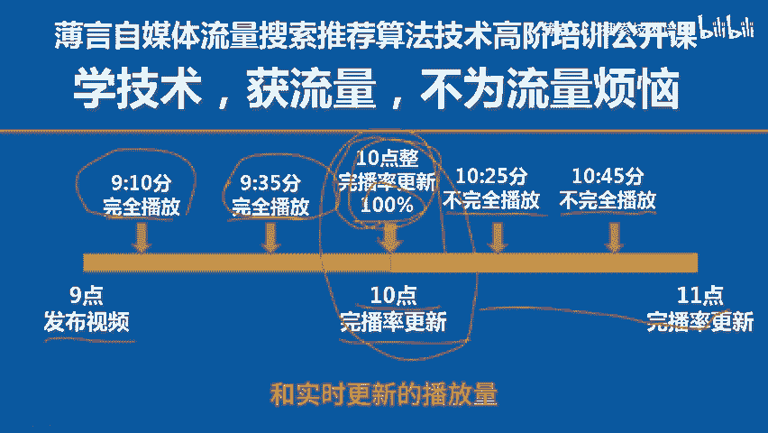

# 薄言抖音运营抖音seo新媒体运营抖音视频号完播率为100%现象是新媒体运营培训课程和新媒体运营工作内容重点，也是自媒体平台算法推荐和算法技术的体现自媒体学习 - P1 - 薄言SEO搜索技术培训 - BV1vJsZekExT

🎼前面给大家讲解了完播率为什么会出现0%的现象。今天再给大家介绍一下另外一个极端情况。就是有时候我们在自媒体的数据后台会看见完播率出现百分之百的现象。

这种现象通常的理解是每一个播放视频的用户都进行了完全播放，那完播率肯定就是百分之百啊，这当然没错，但出现所有人都完播的概率是比较小的。在抖音视频号的实际工作当中。

完播率出现百分之百的情况无一例外都是出现在了视频发布的初期，属于极其偶发的观测时间，除了所有人都玩播这种理想化状况以外，更普遍的情况是完播率延时更新所造成的。比如在视频发布的初期。

而且这个视频的初期的播放量要求极少才行啊。假如有某一次或者某几次完全播放恰好都发生在了完播率的更新周期以内，此时，完播率更新的数据就是百分之百。与此同时，该视频的播放还在继续发生。

而这些播放即便不是完全播放，但是因为这些不完全播放处于下一个完播率的统计周期以内，所以我们就会看见播放量的数字在增加，但是完播率依然是百分之百的现象。咱们举例说明，你9点钟发布了一个短视频。

在9点到10点这一段时间内，总共只发生了两次播放。🎼而这两次播放恰好都是完全播放。假如完播率在10点整更新数据，比如9点10分和9点35分分别发生了两次完全播放啊，你就会看见10点整的时候，完播率。

它更新出来的数据就是百分之百，然后在10点到11点这个时间段以内，这个视频又发生了很多次的播放，这些播放可能并不是完全播放。有看了几秒钟就离开的，有看了一半离开的，也有完全播放的。

此时因为完播率还没有到下一个更新时间节点。所以你在10点钟以后，比如10点50分的时候，你就会看见这个视频的播放量一直在不断的增加。但是完播率依然是分之百。

其实这里的百分之百就是上一个时间段10点更新的那个完播率数值，而不是现在实时的，只有播放量才是实时更新的。为什么播放量是实时更新的。我前面都讲过啊，大家有兴趣的话可以翻看一下前面的视频麦克。

因此你就会看见10点到11点的播放量是在不停的增加，但是完播率依然是百分之百的现象。这就是延时更新的完播率和实时更新的播放量给人造成的难以理解的错觉。这种情况和完播率出现0%1样。

🎼是环播率延时更新造成的小概率观测事件概率很小，但确实存在。要解读这些极端事件，只有从算法的数学定义技术层面你才能理解，否则你根本看不懂，这就是咱们掌握算法技术的重要性。咱们下一期再见。

