# 薄言抖音运营抖音seo新媒体运营短视频被算法推荐的关键推荐夹角，这是新媒体运营培训课程和新媒体运营工作内容重点，也是自媒体平台算法推荐和算法技术的体现短视频运营 - P1 - 薄言SEO搜索技术培训 - BV14rpwePENR

Yeah。🎼抖音视频号等短视频流量的多少取决于能否被算法持续推荐。那短视频到底是怎样被算法持续推荐的呢？这里就必须要理解一个算法技术概念，就是推荐夹角。大家看这张图，这就是短视频推荐算法的计算环境。

是一个坐标系，向量A就是用户标准向量，这是由系统生成的标准向量啊，你可以把它理解为一个标准，和这个标准越接近的，也就是和向量A夹角越小的向量就和A越相似，那就越可以得到算法的持续推荐。

再看B一和B2这两个向量构成的夹角，这就是推荐夹角是决定抖音视频号的短视频能否被推荐的关键因素，凡是在B一和B2夹角范围以内的短视频都是可以被算法推荐的。这里的短视频向量C和短视频向量D。

现在都在推荐夹角范围以内，所以短视频C和D都是可以被算法持续推荐的。你在抖音和视频号当中就会看见这两个短视频的流量数字就会一直在增长。但是随着时间的流逝，B一和B2的夹角就会以标准向量A为中心。

从顺时针和逆时针两个方向向标准向量A靠拢。也就是这个推荐夹角会越来越小几小时以前还在推荐夹角范围以内。

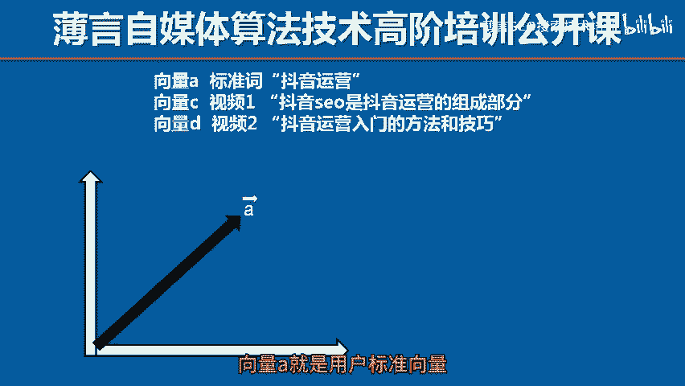

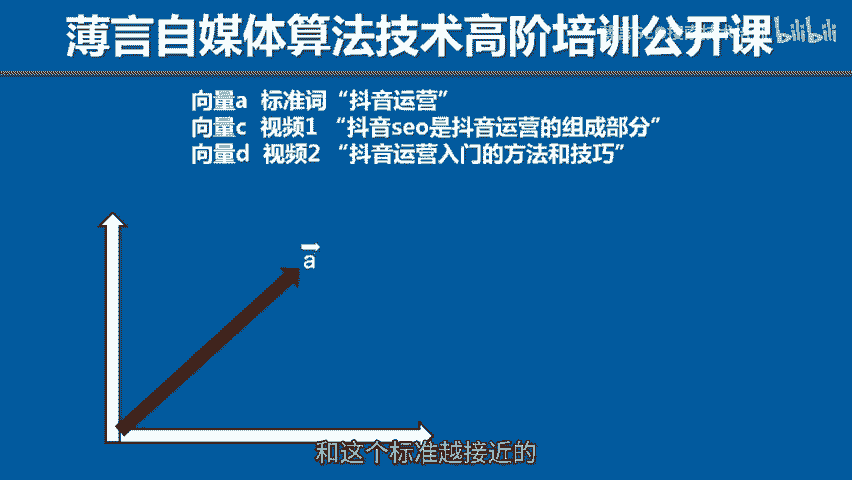

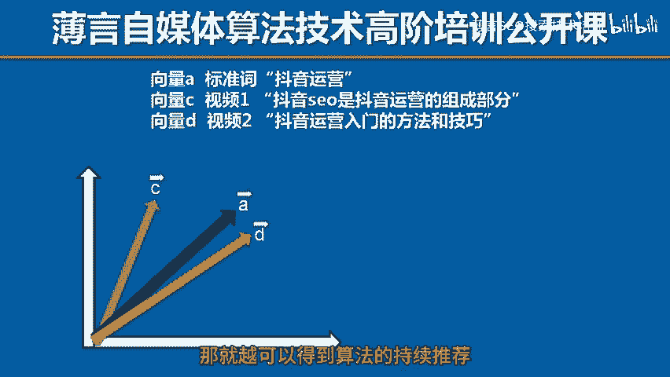

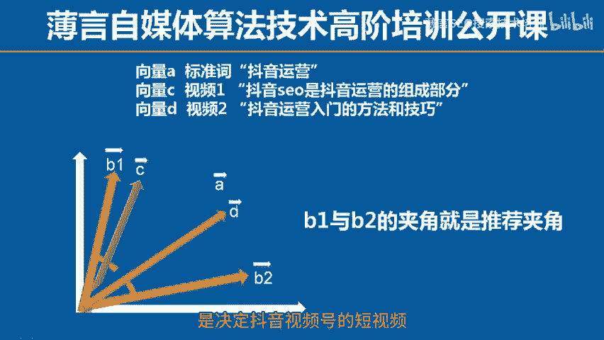

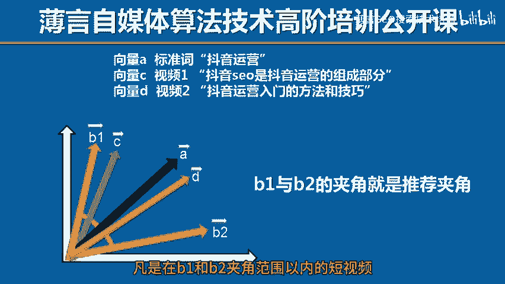

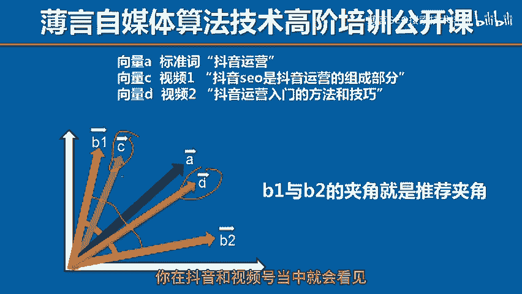

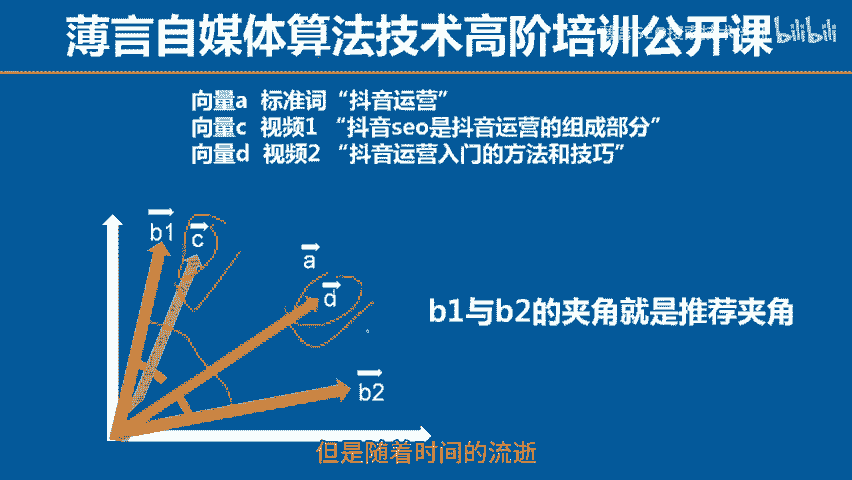

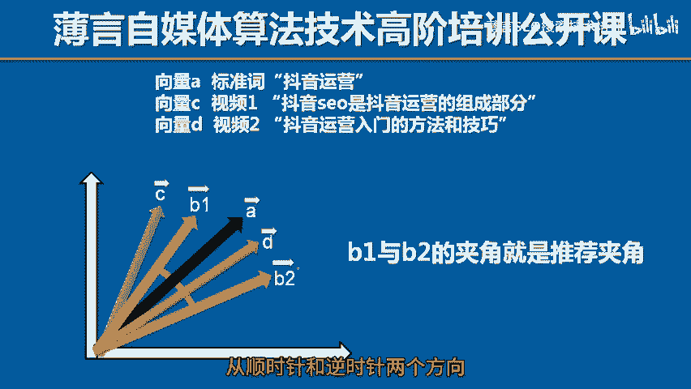

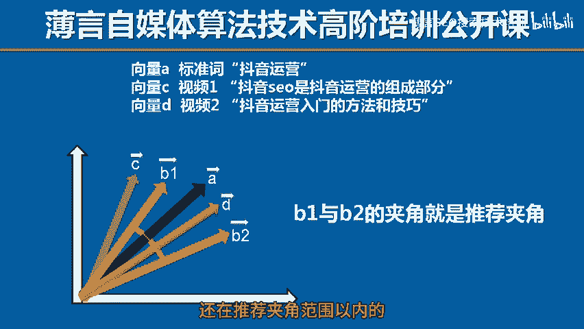

🎼短视频向量C现在因为夹角范围缩小已经被排除在推荐夹角范围之外了。而短视频向量低，因为和标准向量A很接近。虽然推荐夹角在不断的缩小，但是它依然能够保持在推荐范围以内，因此。

短视频第仍然是可以被算法持续推荐的。你这个时候在抖音视频后台就会看见短视频C的流量数字就停止了。它的生命周期就停止了。而短视频低的流量却还在增加，它的生命周期依然还在延续。这很多朋友就会问了。

为什么这个推荐夹角要不停的缩小呢，其实这就是为了促使博主多发短视频保持平台的一定的内容数量和保证内容的时效性专门这样设计。平台算法就是故意要让很多短视频无法得到持续推荐这些前面我都讲过。

有兴趣的朋友可以看一看前面的视频公外课，所以你想要让短视频能够得到算法的持续推荐，就得让你的短视频向量尽量保持在推荐夹角范围之内，具体的技术方法，我上课的时候再为大家讲解本期视频到此结束。

咱们下一期再见。

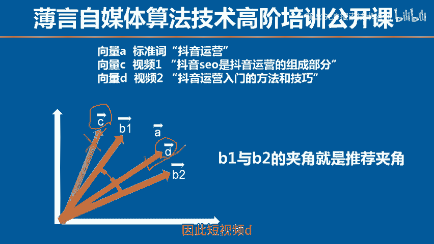

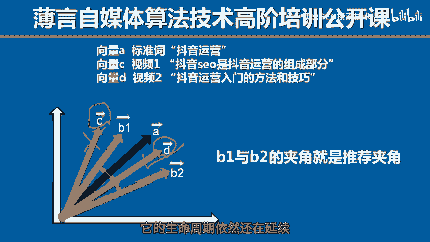

