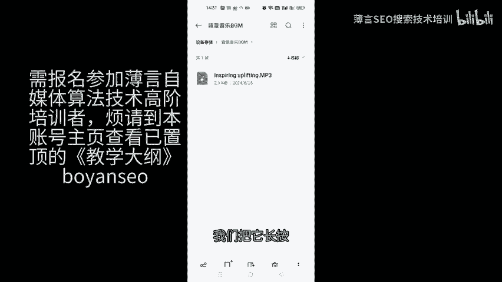
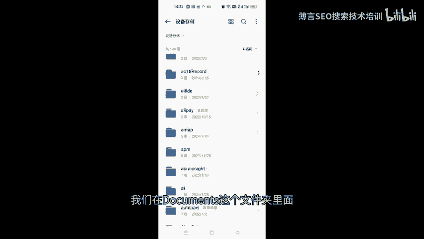
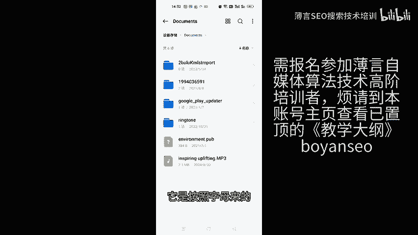
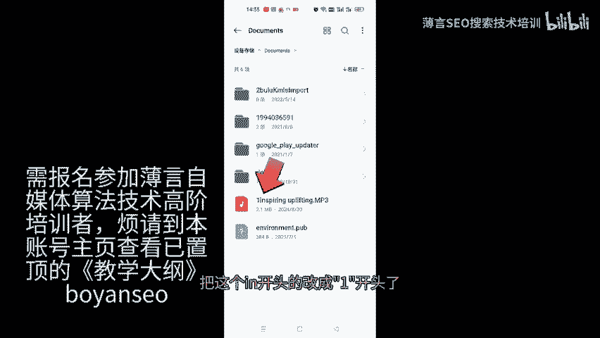
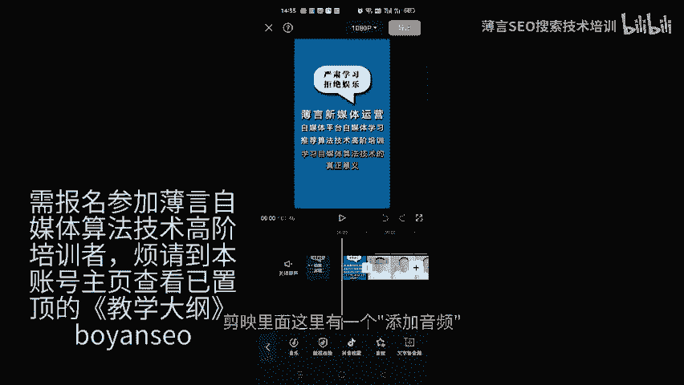
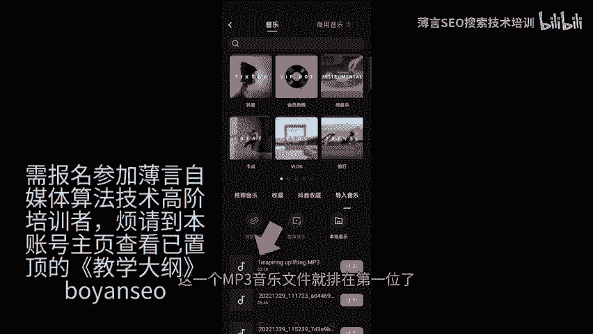
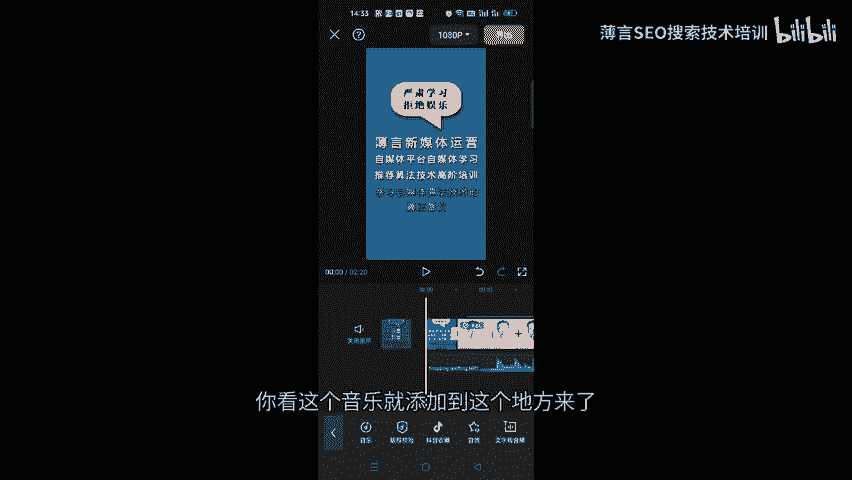

# 薄言抖音运营抖音seo新媒体运营音乐mp3文件导入剪映小技巧是新媒体运营培训课程和新媒体运营工作内容重点，也是自媒体平台算法推荐和算法技术的体现 - P1 - 薄言SEO搜索技术培训 - BV1VaHFeiE2s

🎼今天给大家分享一个小技巧，就是怎样把手机本地的MP3音乐导入到剪映当中来使用。首先你要打开手机的文件管理，在文件管理当中去找到你的那个音乐文件。这里的背景音乐BGM这个文件夹里面。

我已经准备好了1个MP3文件啊，这个音乐文件必须是MP3格式啊，其他格式你必须要先把它转成MP3才行。否则剪映识别不了。那么找到这个文件以后呢，我们把它长摁，然后把它复制一下。

复制到documents这个文件夹里面来。

🎼好，我们找一下documents这个文件夹。🎼好，把它复制到documents，这个文件夹粘贴一下。🎼OK现在已经粘贴到documents这个文件夹里面了。

我们在documents这个文件夹里面去看看它在不在。

🎼已经在这里了。然后呢，这个地方有一个比较重要的一个操作，就是要把这个文件改一下名。如果这个文件不改名的话，你在剪映里面可能很很靠后才能找到它。因为剪映的这个音乐排序啊，它是按照字母来的。

所以呢在这里呢我们就把它改一下名。

🎼改名的话呢，就把它改一个。🎼前面加一个一就可以了啊，这样的话呢你在剪映里面就一眼就能看到它啊，在很靠前的位置就可以看见它了。🎼就比较方便操作。好，现在已经改了，把这个呃IN开头的改成一开头了。

现在我们切换到剪映里面去啊，剪映里面这里有一个添加音频，然后点击音乐。

🎼再点击导入音乐本地音乐，它现在在扫描。你看这里的这1个一开头的这1个MP3音乐文件就排在第一位了，我们就可以很方便的使用，然后点击一下使用。你看这个音乐就添加到这个地方来了。

