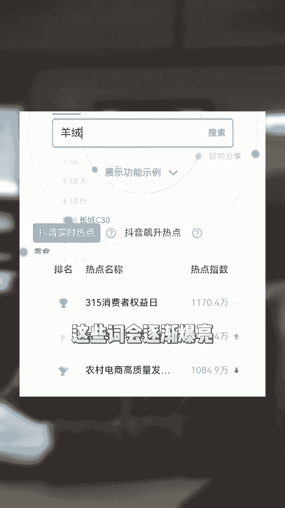
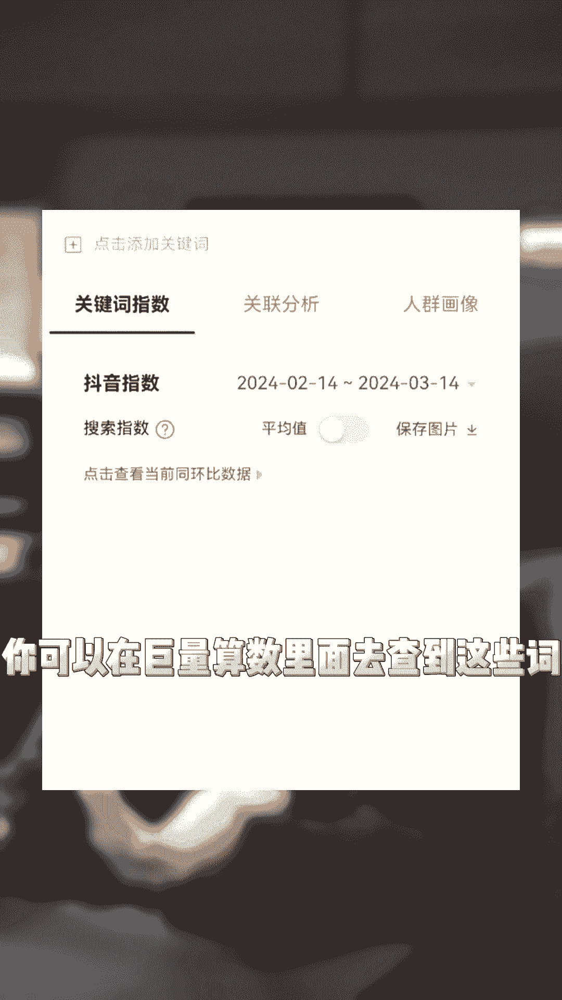
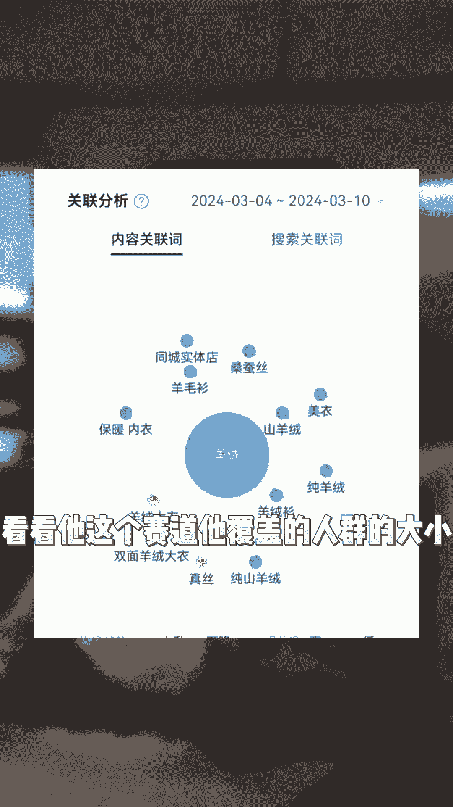

# 薅自然流羊毛 - P1 - 无忧学官方账号 - BV13H4y1n7m1

24年做直播带货，如果你薅自然流的羊毛，就一定要做好这五件事情，首先是品类，品类就是关键，像女装类目自然流失，最大的重点是看你这个词的覆盖范围，比如说现在的防晒服，比如说现在的这个背心。

这些词会逐渐爆量。

皮草羽绒服这些词热度就会下滑，你可以在巨量算数里面去查到这些词。

还可以用千川的覆盖人群，看看他这个赛道，它覆盖了人群的大小。

第二个就是直播场景，都说直播带货是讲的人货场，但是从曝光到进入直播间，甚至让人停留在直播间，影响最大的就是直播场景，当你把你的直播间声音全部关掉，如果他还能看到，还能进来，还能留住，这自然就是好的。

而场景的布置又跟你的屏有关，那么第三点关系到自然流流量的高和低，那就是你的品的问题了，很多人都说平台现在是比低价等等，但只说对了一部分，这个平台它永远都是逐利的，谁能给他带来最大的利。

谁就能拿到最大的流量，核心就是流量利用率，那么你的品是否有优势，这一点就尤其的重要，第四点就是你的主播长相，因为主播他是具备人群穿透力的，你让不同的主播来播同样东西，它的消费人群会不一样，你自己去看。

你们把带货榜从第一名看到最后一名，你看那个主播都是长什么样子，你就知道自己适合干什么样的客单价，或者就知道找什么类型的主播了，你们还要想到什么自然流的关键点，都可以在评论区里留言。

