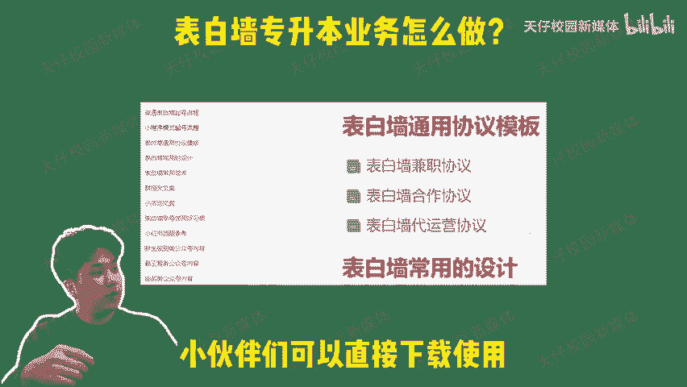

# 表白墙升本业务怎么开展 - P1 - 天仔校园新媒体 - BV1GJ2UY7EwR

🎼表白墙专升本业务怎么做？编仔一个视频告诉你大学里的绿色项目，专升本业务应该怎么开展。现如今，随着市场扩大，专升本的机构和产品都五花八门，和学生都不知道该如何选择，对于我们业务开展的第一步。

首先要吃透自己代理的产品，要做到能够快速响应客户的需求咨询，自己要非常熟悉不同学校的升本专业，考试的科目要求，以及不同高效的报价考试的时间等等。不然别人问一句，你还要回去看产品手册来解答黄花菜都凉了。

只有熟悉自己的产品业务线，才能在其他同行中脱颖而出。其次，一定要做好自己的外部宣传，尽可能的打造一个专业的学历提升师兄世界形象，可以专门去做一个答题简仪，或者分享学习资料的账号。

最好可以拉几个微信群去进行新生解答，给到别人一个有过升学经验的印象。这样推广起产品就可以事半功倍了。毕竟比起一个每天只会发广告的无脑营销号，大家更愿意相信一个有经验愿意带着学习的前辈。

最后就是发展自己的代理培养代理也是有技巧的，你可以让他们模仿你的账号，或者将他们设为群的管理员，让他们附用你的经验和知识去运营，当然也不要不舍得给钱，比例分成完。

🎼可以给他们设定高一点，毕竟只有真正的利益到手，才会更加卖力的帮你工作。不过也别忘了记得签署相关的代理或者运营协议。因为学历提升的利润是非常可观的，我们也需要一些相应的手段来保障自己的权益。

在联创资源库里就有对应的相关协议模板，小伙伴们可以直接下载使用，想要学习更多表白墙的变现项目。欢迎关注天仔，我们下期见。

