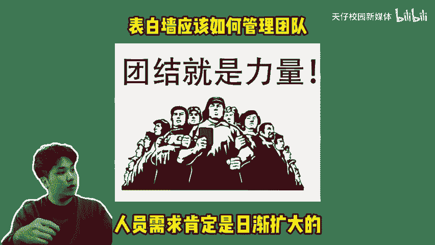
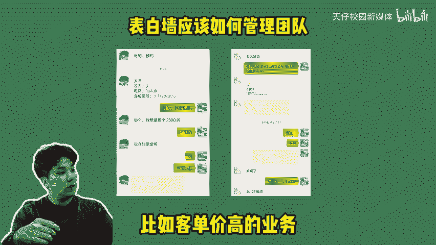
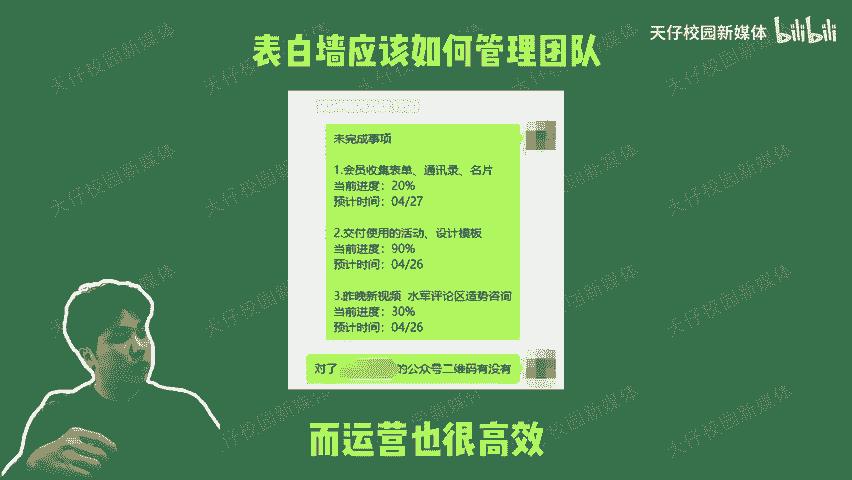

# 表白墙团队管理的1+N模式 - P1 - 天仔校园新媒体 - BV1XXnfePEkf

🎼表白墙应该如何管理团队成熟的表白墙团队该有什么架构？怎么样的团队运营模式让你更轻松编载一个视频告诉你，随着表白墙的运营成熟，人员需求肯定是日渐扩大的，但组建一个表白墙团队，其实并不难。

你需要做好几个关键点就可以轻松驾驭团队。首先肯定是学会分工表白墙项目这种新媒体运营，我们只需要用最简单的一加模式。一个创始人加若干帮你做内容的成员，你只需要负责告诉他们，你想要做什么内容。

怎么策划怎么实现怎么抄，然后让他们帮你实现就行。其次就是核心商家资源需要自己归拢好，这些都是你的业务基础，只有把核心资源掌握在手里，就不用担心人员流失。毕竟这可是团队的核心资源。

最后涉及到变现就是另一种玩法了。比如客单价高的业务必须确保自己对整个链路的了解都很透彻。这样你招回来的代理遇到问题了，才能找你解决，需要做到既能解答问题，又能指导团队人员的工作。

其实你对业务知识不够了解也没关系。前期可以尝试去给别人当代理，天天才着学习就行。你们的业务知识很成熟。可惜下一秒就是我的了。有公式做题就是快。总之，表白墙组建。

🎼团队一定要学会分工，只要把工作细分好，掌握整个流程，自然可以做到自己不累而运营也很高效。如果想了解更多表白墙的运营知识，欢迎关注天仔，我们下期见。

