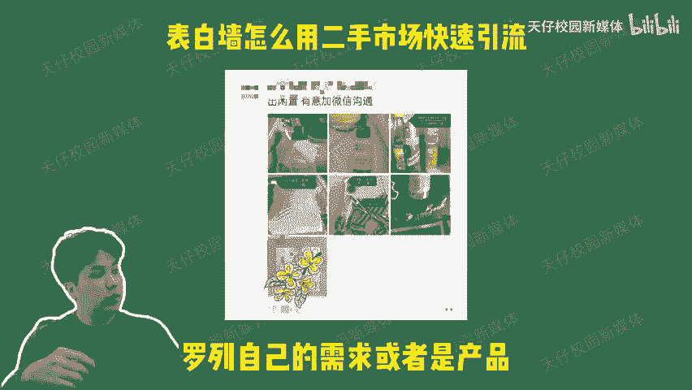
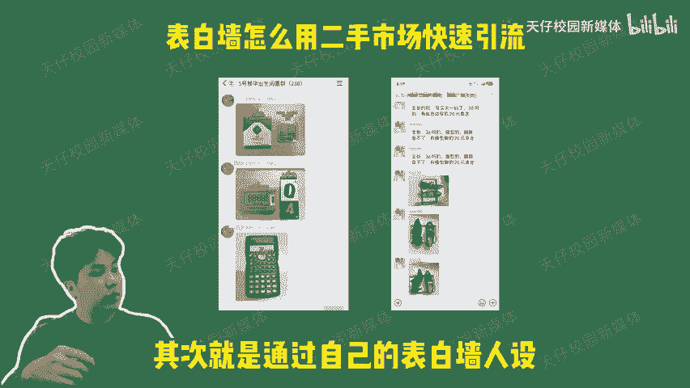

# 表白墙校园闲置交易引流玩法 - P1 - 天仔校园新媒体 - BV1HbpZeUEia

🎼表白墙怎么用二手市场快速引流？二手市场引流到底有多爽？今天天仔还是用一个视频告诉你，二手市场究竟潜藏多大的流量，无论是大一大二还是大三的学生，二手市场永远是他们用得上的平台出售闲置购买书籍。

甚至是转游泳健身卡等等。基本上在学校里用得到的东西都可以通过二手市场来交易。这个属性就注定了二手市场是永远会有流量存在的那具体需要怎么做呢？首先你要有一个靠谱的平台载体。

可以是个人微信号或者小程序公众号，方便学生们挂载罗列自己的需求或者是产品，一个好用的平台，能够很大程度的决定你的用户流存，其次就是通过自己的表白墙人设，自己搭建社群。天仔的教学一直是具有连贯性的。

有认真听课的小伙伴，现在应该已经搭建好自己的表白墙了。通过前期里的学长学姐人设，我可以轻松获得学生们的信任度搭建起几个二手交易群，这些都是我们非常珍规的私域流量。不仅后期可以通过这几个社群进行变现。

同时也是进一步扩大你表白墙影响力的基石，最后就是通过第一批二手市场的用户进行裂变，只需要做一些常规化。

🎼的校园活动去反馈你的初代用户，比如什么锦鲤抽奖霸王餐之类的低成本小玩法，实现快速引流裂变，简直不要太轻松。这些活动玩法在联创的共享资源库里都有很详细的记录。二手市场一直是一个刚需平台。

只需要做好规模化的运营，流量自然源源不断。如果想要了解更多关于表白墙的流量玩法，欢迎关注天仔，我们下期见。

