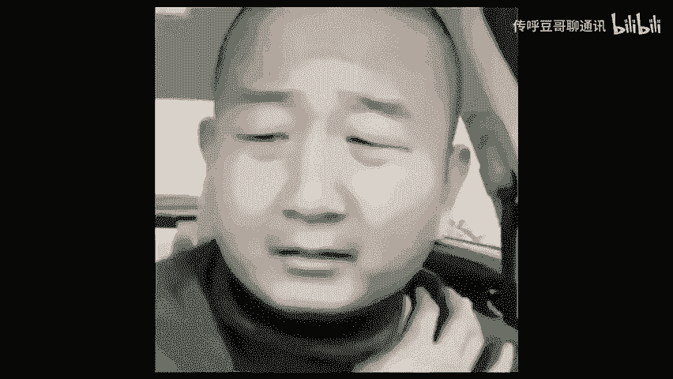

# 被区别对待连行家都成隐形韭菜？ - P1 - 传呼豆哥聊通讯 - BV1EWtDeqEaV

🎼居然连我这个行业都成了隐形的韭菜，你们过来看看是不是自己也被区别对待。这多多可真不简单。你看啊同样的时间搜索同样的关键词，仅仅就因为这两台手机不同，这个是苹果，这个是安卓。

你看同样第一个推荐同样是这个旗舰店。第一个34块多这个呢二句太多。所以当我发现这个问题之后啊，我一定要替成都的运营商给你们传达两句重要的话。第一句啊是明语，看见没？别再说我们运营商对你们区别对待了。

区别对待你们的又不是只有我们运营商，这心呢拔凉拔凉的，凭啥你们老抓着我们的话。第二句听好了，是暗语，我们是不是给了你们不被区别对待的机会，你自己不会巧我，还怪我？如果你们能理解这第二句话的意思。

但是不知道该如何使用运营商给你这个暗语机会，那你就点赞偷偷给你们解读解读是啥意思。这老用户套餐只能生不能降这事，你们都知道。但是对于运营商的新用优惠这其你们这些老用户你就。😊。

🎼在忠诚这件事总是抱有那一切实际和坏气。认为你在这运营商待的年头越越会善待，这结果不用我多说了，我太难了，几十的套餐直接给你忽悠到10010都忽悠到能，甚至我还见忽悠到左。

你要说早些年你确实没有其他的事，只能像那猪就里忽一的任人宰割，你能干的也就是吼两声。但是现在不一样了，不是赋予了你主动权了吗？目的不是就是让你不用在一个运营商里面不要同时还能在保留你使用了多年号码。

同时就能自主的去选择不同的运营商套餐。而且每当你重新选择。

🎼都能不停的去享受新用户的对待。简单的说啊，就是市面营业厅里看到那100多甚至200多300多的套牌，都能以一半甚至更低的价格入手。所以啊别老抱运营商对区别对大，而是因为信息差和你的假忠诚割了你的韭菜。

再加上你自己的懒惰，不去了解实时的政策信息，才造成了你今天这种局面。要不你看看，就连号称卷王的多多都不把你放在一头里。你说咱们是真在乎这多多差出的那一二十，或者说运营商套餐，每个月的那几十块钱呢？

不管是不是其实咱们最不能接受的事，就是同样的东西，为什么我要给别人多花一倍，甚至你倍的。你自己搭磨咱们是不是这么多有道理，所以说无论这多多还是咱们在成都的手机看台套餐费那都是货低制惨。你现在回想回家。

我说一说，你还遇到过哪些特别让你气愤被区别对待的事。最后呢，如果你在成都也醒悟，不想再当运营商的大冤种用户，他们那。🎼裤我都帮你搭下，整理好，说简单的也就是解决方案，有需要的赶紧来找我吧。

