# 视频号创作分成计划保姆级教程，从开通收益到制作原创，打造月入10w的自媒体账号！！ - P1：视频号创作分成计划 - 睿智实堪宗 - BV1us1kYdEnS

呃，下面我给大家带来一个视频号分成计划，王姆级教程啊，从这个我们开通创作者的收益啊，到我们这个作品应该如何制作，对不对？如何涨粉啊，但是视频收益末的话可达1000啊，下面我们来看一下项目的介绍。

我们来看一下我个人操作的一个收益，好吧呃，现在这个是我上个月月底啊，月底操作的一个账号的一个收益啊，也就操作了三四天万，39天以后第四天啊，月底直接报了一个视频，收益直接是000啊。

单条视频收益1000多，非常爆炸。😊。

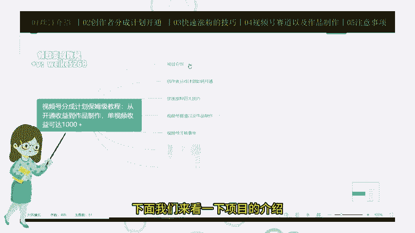

然后我个人做两个号吧，这个号的话收益稍微低一点，但是非常稳定。这个号也是上个月底做的。呃，你就做几千万，每天稳定个100多的一个收益啊，收益还是非常稳定的。😊。

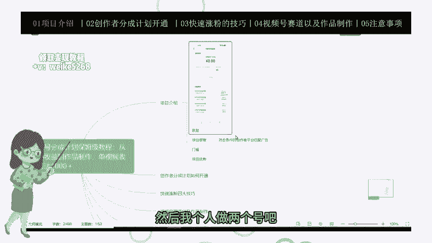

那么下面我来说一下咱们这这个视频号啊，分成计划的项目的一个原理啊。其实外面有很多一些教程，说些分成计划的项目啊，其实大家都知道，其很简单原理的话就是我们符合创作的条件啊。

我们达到了呃开通了创作分成计划的啊条件，对吧？平台给我们匹配广告，对不对？😊，呃，用户只要看到我们视频下面的这些个广告，是不是我们就有一个收益，用户点进我们就有一个收益啊，呃就非常简单。

类似于一些中视频啊。😊，然后的话我们说下项目门槛，这个项目最大的门槛就是什么呢？我们呃就是我们必须要去开通呃视频号分成计划啊，就类似于前几年的周视频中视频计划，对不对？你的意思，但是门槛要不一样。

要求又不一样，对吧？啊，中视频是要三个视频，1万0的播放嘛，对吧？然后的话我们这个视频号啊，第一个要达到1个100个粉丝，100粉丝啊。第一个要求。第二个要求是第二个要求就是说这个内容要符合平台的规范。

对不对？我们不能发违规的作品，对吧？不能发一些呃呃血腥啊，色情啊一些视频啊，然后的话画风一定要精美啊，画风精美的一些作品。然后的话第三个。😡，就是平台认为你是一个优质的原创作者啊，就是这么一个要求。

其实这个门槛很多小白啊，他不知道怎么达到，也不知道怎么去做，对不对啊？一个信息差。那么我在下节课我也跟大家说，我们如何开通创作者分成计划，对不对？下节课我重点会讲啊，到底怎么开通，其实非常简单啊。

我们也有方式和方法的。那么下面我来说下这个项目的一个优势。😡，啊，首先啊我们现在的话就是说呃因为视频号分成计划是从今年开始的，今年才开始开通的，官方才出了这个这么一个项目，对不对？是票官方。

然后的话我们发任何作品，只要我们通过了视频号分成计划的一个啊门槛门槛嘛，对吧？我们发了任何视频，它都有流量扶持啊，流量非常大。😊，第二个就是说现在属于风口啊，我们这个视频号分成计划，现在属于风口。

类似于前两年的中视频，我们都知道中视频吧。刚开始出来之后对吧？收益都非常高啊啊，收益非常高，发的视频流量都非常大。那为什么现在就不行了呢？因为这个现在中视频的风口已经过去了，很多人入局啊。

也经越来越难做了。现在我们入局视频号分层计划啊，还是属于大风口的一个项目绝对是下半年的风口啊，感兴趣的小伙伴一定要操作起来。好吧，错过这个风口可能就没有机会了。😡，好，下面到了咱们这个项目的第二节课啊。

创作者分成计划如何去开通？那么我废话不多说，我给大家讲解啊。😊，首先啊我说的重要一个重要的一个点啊，是什么呢？我没有满足条件的时候啊，我们不要去点视频变现任务，知道吧？如果我们先去点视频变现任务之后。

再去开通创作者分成计划，就非常的难，根本就过不了。好吧，这是重点啊，我给大家看一下到底是一个什么情况。😡，嗯。如果我们没有满足三个条件，对吧？它这里就是说我们创作者服务中心，对吧？

视频号创作者服务中心它里面不会出现创作分成计划啊，只有满足三个条件之后，我们的创作服务中心就里面才会显示创作分成计划啊，这么个页面啊，下面这个是视频页任务好吧，我再给给大家再来看一下图片啊。😡。

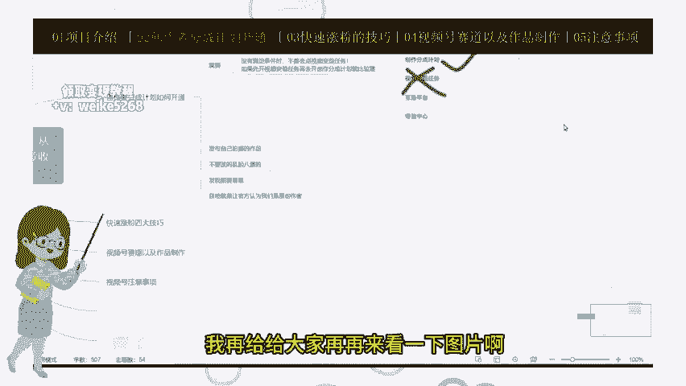

然后的话啊这个就是创作者服中心里面，我们没有满足条件。它这里输入变签里面只显示这个视频变现任务啊，只显示这个这个我们不要去开通。好吧，有很多教程，他连自他自己连视频分成创作者计划都不知道的人。

他他去误导别人，对吧？让我们去点这个点视频变任务。如果大家讲这个我告诉你创作者创作者那个分神计划根本开通不了，以后开通分成计划非常的难。好吧，这个是重点，大家一定要记住了，不要被被别人给误导了。好吧。

然后的话下面我来说一下这个就是我们这个发要发一些什么样的作品，我们这个才能顺利的开通创作者分成计划呢啊，首先首先的话我们要用自己的手机用自己的手机去拍摄视频啊，然后是前15条。

我大家建议去拍什么样的视频呢，去拍风景啊，风景外面的一些风景，对吧？花花草草视频要求要清晰啊，不露脸，也不能带文案背景音乐可以加也可以不加啊，每天发3到5个视频，视频时长控制在13到15秒之间啊。

我给大家看一下案例到底我们发么的一个视频。😡。

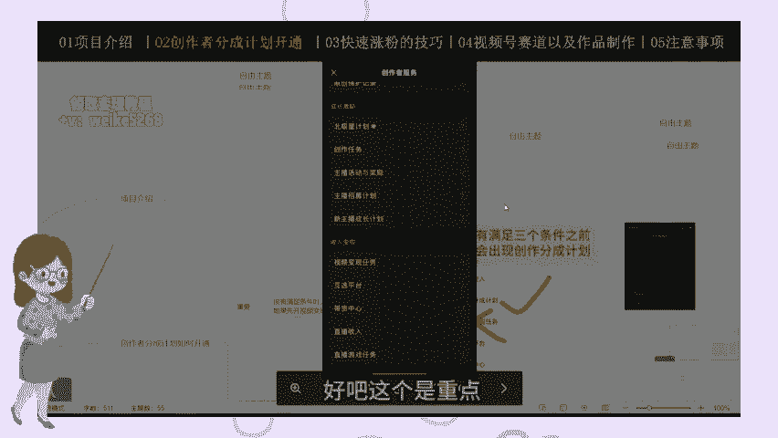

啊，就就是这种视频，好吧，就是这个外面的一些花花草草，路边的一些花草草公园里面的啊吧草坪这些视频啊，这些视频就可以了。我们拍前期拍这种视频就可以啊。然后的话我们怎么去拍呢？我们可以去。

如果我们住在县城里面啊，住在市里面，我们可以去找一个公园啊，风景稍微好点的地方，每次拍个10到15秒啊，分时间间分时间段发啊，不不需要加任何的文字，也不要需要也不需要去发任何的文案啊。

随便配个音乐就可以了。你们来看一下啊，的案例啊。😊，这个就是啊这个就是我们啊去比如说公园里面拍些花花草草，对吧？然后的话我们去香烟田野，公园里面花草草，拍些菜园子都可以啊，拍菜园都可以。

如果大家住在农村住在农村啊啊，你也没有公园，对不对？那我们可以去拍野外啊，也可以拍野外菜园子啊，乡村的一些风景啊都可以啊，都可以。😊，然后的话我说一下注意我们要注意一些东西啊。

我们不能发一些乱七八糟的东西啊。比如说啊这个失败难点大来看一下这个这个人他发了一个什么样的视频啊，他在家里拍个视频，对吧？又去野外拍视频，然后又去拍啊这个玉米又去公园里面拍花花草草，对不对？发的太杂了。

如果你们要这么发的话，那么平台凭什么认为也是一个优质创作者人，对不对啊不能这么发好吧？我们这我们要这么发的话啊，这个也是啊你看看这个人啊又拍天空啊，又拍楼房又拍夕阳，对不对？砸一杂巴的，这个发一下。

那个发一下啊，不行的，我们我们要发这个视频，永远永远开通不了创作者是分成计划的。然后的话我们要注意要再次细说一下，我们发个视频啊，一定要垂直啊，垂直。我们如果是发横屏的视频，那我们就一直发横屏啊。

如果我们发树屏的，那我们就一直发竖屏的视频。😡，我们假如说去拍花草，我们就一直去拍花草，对吧？我们不要一会儿去花花草啊，一会儿又去山里面拍啊，有人去拍山啊，又去拍拍河对吧？又去拍房子啊，那么这个不行了。

这样发的话是永远开通不了创造的事发争计划了。他不会判定你为有一个优质创作者。我们拍这种视频的目的，就是让平台认为我们是一个原创作者，是一个优质的作者。😊，这样的话我们才可以顺利的去开通创作者分成计划。

那么我们拍这个视频的目的只是让大家认为我是一个让平台认为我们是一个原创作者，对吧？那么我们需要涨粉啊，拍这种视频涨粉是很难的。哦我们涨粉还要拍其他的一些视频啊，在下节课我会跟大家说一下。

我们呃如果快速的去涨粉四大技巧。那么下面这节课啊就是给大家这个项目的第三节课啊，快速涨粉的四大技巧。我们上节课说到了我们去开通创作者分神计划，对吧？

我们必须要去拍一个用手机自己拍摄一个花草草风景的一些视频啊，目的的话就是让我们让官方认为我们是个原创作者。那么这些作视频是不会涨粉的啊。下面的话我们来我们来给大家详细解答。

我们去发什么样的视什么样类型视频来涨粉的。第一个我们都知道啊视频号的用户多大部分都是一些四五十岁的一些群体啊，那中老年人居多对吧？那我们就发一些非常符合中老年人胃口的一些视频啊，我们可以发四种类型视频。

第一个是开门这个财神视频，开特效财神啊，第二个是喜鹊报喜的一个视频。第三个是一个老年人爱情故事。😊，对吧第四个是祝福的文案啊，就祝福你全家健康幸福啊。这种视频也是老人人非常喜欢观看的一些视频啊。

那么我们废话不多说，我们就是说给大家演示一下，好吧。😡。

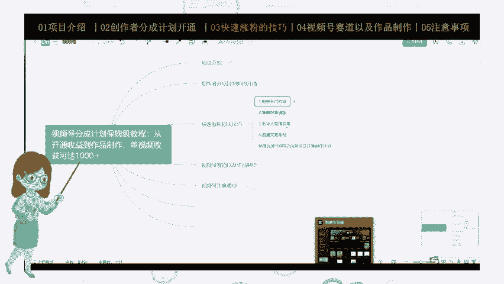

首先我们打开简验啊，打开简验这个视频制作标准呢，我们第一个我们比如说我们找到模板，点模板，我们搜索这个财神开阳门特效啊。😡，对吧比如我们找这个用这个啊，其实都可以用啊。😡，到你家它就是一个呃打开一个门。

对吧？然后打打开到你家加上一个那个街上的背景图，可以自己自己去拍，或者这个网上的视频都可以啊。我进来自己去拍啊，我们直接点击啊点击这里的这个替换素材啊。😊，我们我们找到我之先准备好的一个视频啊。

其实我们拍的一个视频吧啊，比如说这个吧啊比如这个我们导进去。😊，进去，然后我们看一下效果。接受一下。就这么简单，对吧？他就把背景换一下就可以了。视频都做好，做好之后，我们直接导出啊。

导出导出导出我们发布到视频号就可以了。发布的话，大家都会发吧，这个我就不教学了，非常简单啊，然后的话我们来看一下。😡。

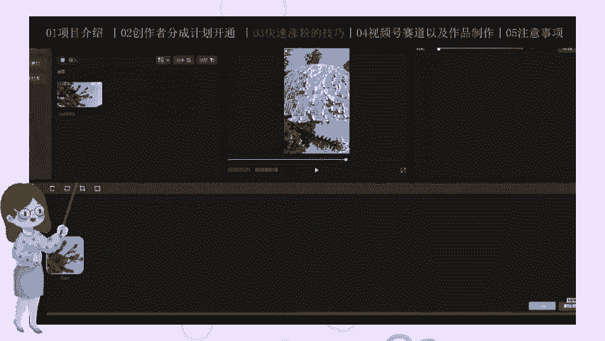

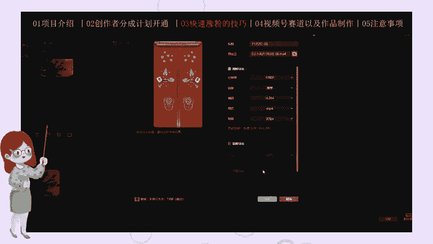

这个第二个这个喜鹊喜鹊报喜这个视频怎么发呢？也是一样啊也是一样，你找模板啊，长模板这个呃喜鹊啊报喜模板。😡。

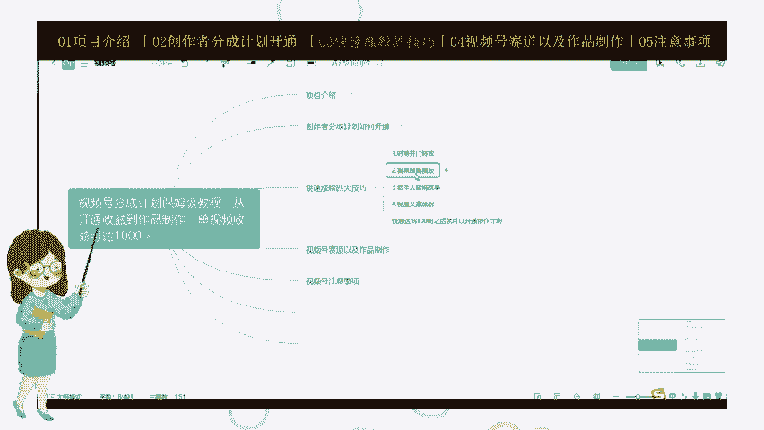

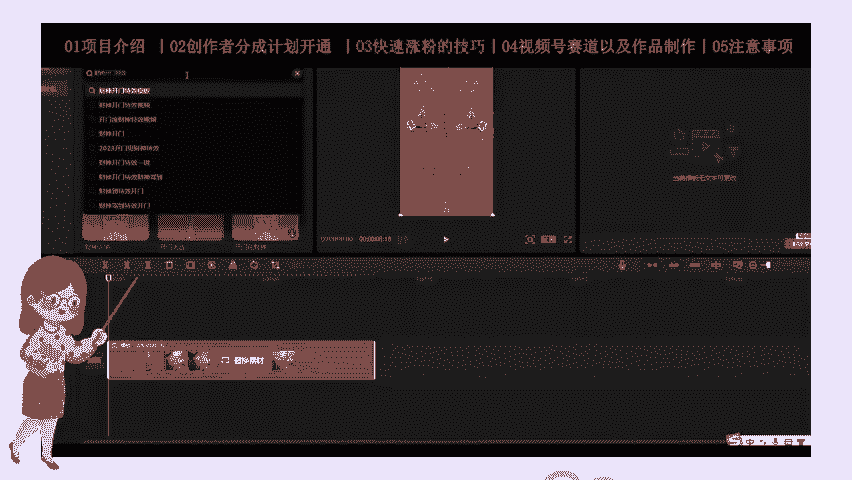

对。啊，比如说我们用用哪个都可以啊，比如说我们用第一个是吧？第一个啊。😊，那我们就是要换一个就是把这个背景图换下就可以了。那背景图在哪找呢？我们打开小红书啊，小红书，我们重新演示一下啊，小红书。

我们找这个梅花的图片啊，搜梅花的图片对吧？比如说第一个啊，我们把这个图片给大家截图，或者说直接给大家下载啊，下载图片下一下要么用啊，那么下面我们开始操我们怎么怎么用呢？😡。

我们刚刚下载好了一个是那个图片啊，我们把这个图片给它。倒起来啊。激划素材啊，激划素材导进来对吧？导进来啊，导进来就可以了。😡，非常简单啊，短现来就可以了，近关颜不层。

我们把这个字稍微给大不要折住这个喜鹊往下来一点啊，这个字稍微放大一点，往上来一点都可以啊。我们来看效果。😡。

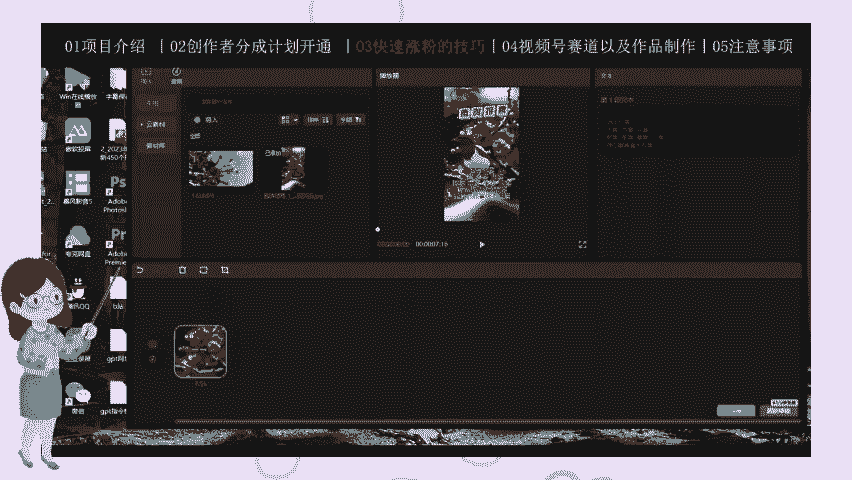

对吧背景就换成梅花了。然后发布的话，我教他怎么发布吧，发布应该都会发布啊，视频发布的都会发布啊。发布的话，我们就直接呃参考同行的，我们就直接参考同行的一个视频就可以了啊。😡。

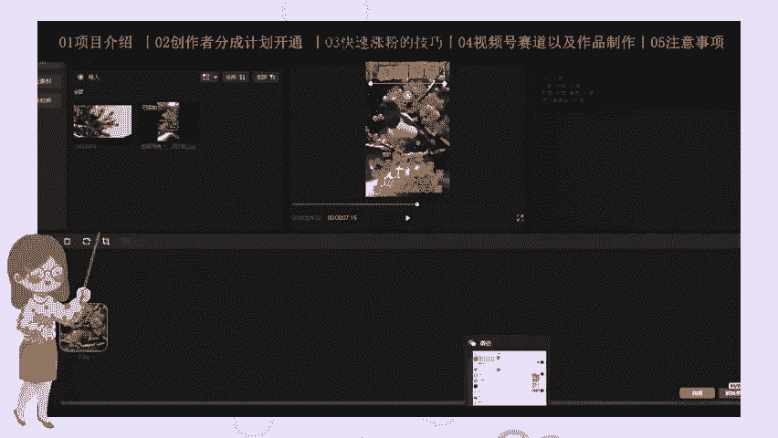

比如说曲鹊报起对吧？我们看一下东方怎么操的，我们说下视频号啊。😊，对。

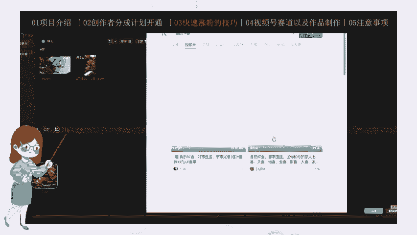

有这个啊。你们看动画画视频，就这些视频非常简单啊，你看它点赞量转发量非常高，对吧？非常高，非常符合老年人的那一个胃口，跟我们视频，他就是用模感度的嘛，对不对？比如说母爱母爱，我们就用它这个体结暴喜。

好事的年事如意，祝你全安平安幸福安康，对吧？我们就直己发一些祝福的话就可以了啊。看好的画就可以，直接发就可以导头直接发这个视频号就可了。非常简单。那么下面我来说一下我们的这个。😡。

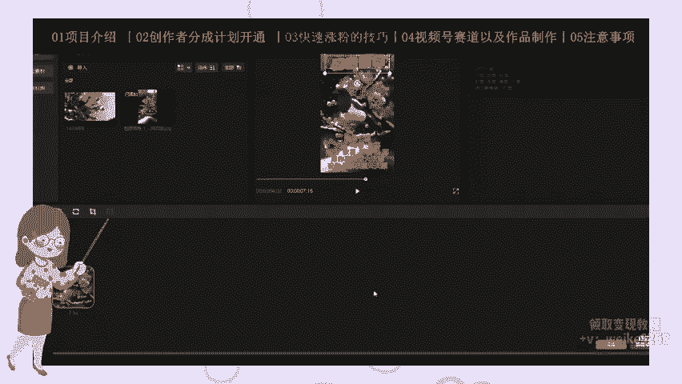

老年人爱情故事该怎么发？还是一样啊，但是我们不是用那模板，我们还是打开视频号，对吧？我们说那个老年人啊，老年人老年人感情故事嘛。😡，老年老人爱情啊，比如说老人爱情啊，老人爱情。😊，视频感动啊。

老人老人爱情视频感动，我们说这个关键词啊。让我们找到一些视频，把这些检单亮度非常高，们比如用这个。😡，看到没？它就是几张图片，加一个文案啊，加一个文案就可以了。不较紧了，那我们图片上来找呢。😡。

还不一样，对吧？小红书啊，我们在小红书上直接搜图啊，搜这个老人。😊，爱情。老爱情图片啊。那我们比如用这个用这个都可以啊啊，我们用这个吧，比如用这个。😊，好吧。

这个然后我们我们就是说用QQ截图嘛啊我们直接截图啊，把这个图片截下来，下来比较麻烦啊，把这个图片截下来。😡，对吧接下来啊，我们多截几张图啊。😡，也，就如这个。是吧。我们多照几张啊多照几张。啊这个啊。

老爱星故事图片。

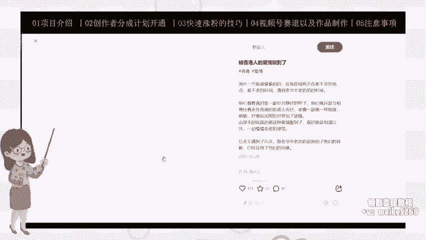

我三四张就可以了然，我三四张就可以了。😊，我主要大家做点事啊，我们一要做好的话，我们都会多用图片，好吧。😡，然后我们把这个图片给它运整到我它传到桌面上呢。😡，你看桌面啊。那么我们怎么做呢？打开剪影。

我把我们刚的保存的这几个图片给它拖进来了。😡，拖进来好吧，给他。啊，就有这两个吧，它拖进来啊。我手得拉长吧。😡，嗯，这个呃10秒钟10秒钟。11秒啊，可以，然后我把这个视频尺寸来改一下，以经减成9。

16啊。916916，然后它到下面不是有黑框嘛，对吧？黑框我们就是啊这个背景填充选择模糊啊。😊，比个模糊对不对？你看起来就稍微自然一点啊，还是一样是吧？背景填充GH6背景填充选择模糊嘛。😊。

两个下就可了。对吧它这个图片，那我们怎么制作量还是一样啊，我们怎们就是说。😡，加加入文案嘛，我们比如说用这个视频的文案相守802年，同一年嫁和，同一天嫁禾接取，对不对啊？让我们添加添加文本啊。

添加文本啊，在这里添加添加字体吧，好吧啊，比如说。😡，他是相守82年，对吧？那我们相守80年啊。😡。

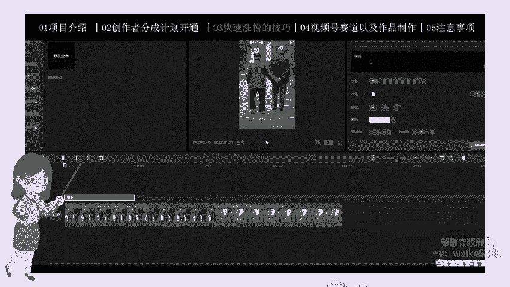

相手80年。从那天下鹤。西区啊，同年价和西区。就稍微改一下，然后字体的话，我们字体的话，我们改成那个好看一点的字体，然后把这个字体颜色改成黄色吧，好吧，空间加他去去。😊，啊。

他然后他这个文案上面写的什么？老奶奶发现自己98岁老伴去世啊啊我们再添加一个字体啊。😊，唔对。老奶奶发现自己。80岁。嗯，他这个多少岁啊，酒吧个老伴去世，那么就是嗯。91岁对吧？老爸。老伴去世。啊。

就稍微改一下吧。自己稍微弄大一点啊。我们继续，然后他把家里的鸡鸭狗喂了食啊。因为添加是铁。提下文本啊。那下面我们就用下面好吧。哦。他把家里的。挤压。在鸡口鸡鹅啊鸡。

鸡鸭鹅啊加个鸡鸭鹅字改小了两的字量大了。鸡鸭鹅啊为了吃为了饭嘛，你就为了饭啊，为了饭。😊，啊，然后他怎么写的，自己洗漱穿戴好，躺在老外身边。😡，把自己。自己或者洗漱安排好对吧？我们就除了自己换身衣服啊。

换身。😊，亲你服。躺在。老伴。啊，身边对吧？躺在老板身边，我们把这个字稍微改一下，也是黄色字体啊，好在老伴身边。😊，啊。几个小时便便悄然随老伴而去啊啊拍几个小时几分钟吧，我们这一个小时就一个小时吧。

一个小时。😡，变和。老伴。利息。离去啊，你经离去。对吧我放到下面啊，然后我们字己圈改一下或者红色字体大家好，我们就是改这个。😊，啊，黑色字体也可以啊。对吧。那我们配些背景音乐啊。

那那那把这个字幕给它拉到拉到底，我们配些个背景音乐啊吧，背景音乐，我们怎么配呢？找一些悲伤的背景音乐啊，我要想到一个。😊，一些音乐啊，比如说牵手这首歌吧，牵手啊。😡，就用这个吧，它虽然不是连创。

就种将就也用嘛，我们找背音乐，找找点好听的香的背景音乐啊，那我们就用这个吧，好吧，后面的多有地方删掉。😡，Yeah。Yeah。对吧就制作好了制作好了，我们直接导出啊，导出发布到视频号啊，发布视频号。

大家都会发布吧，这个我也不不教学了，发布应该会发了。文案就像就参考同行的嘛，对不对啊？但求同年同人同人生啊，但求同年同同人死，对吧？就参考同行的一些文案啊，感人故事带表一下发布就可以了。

直接点击亮阅合量都非常高的，涨粉非常快，100多粉很快就涨好了，发了两三天就涨到100粉，非常快的。然后的话下面的话我们来说一下这个祝福文案，还有一些祝福文案涨粉这个视频啊到底怎么怎么去做呢？

还是一样啊，我们在这个视频号上面去搜这个祝福文案啊。😊，祝福啊祝福祝福这个视频。嗯啊，比如这种对吧？就这种。这个重。对吧愿你心想事成啊，愿你心想事成，对不对？点赞量都非常高，阅读量都非常高的。

老年人都喜欢看这种祝福类的视频，对吧？都可以用。😊，我们再说一下，重新说一下附符啊。😊，对吧像我们这种视频它怎么做呢？它就是一个是。😡，它就是一个背景的一个背景背景视频，子接住了，就是一个风景背景视频。

加上一个这个呃文案，对不对啊？那这个这个文案它这个文案到底怎么弄啊？😡，配音啊，我们提取它的配音，对吧？那我我们把这个原视频给大家手机录屏啊，手机录屏，把这个声音保存下来啊，我们来看一下。

我我这个我已经保存好了，我重新给大家弄一个这个视频啊。😊，嗯，在这里啊这我自己弄了一个视频啊，我录的就是我录的别人的录屏保存下来的一个视频。他说这有一种人能点拍摄的视频。😡。

大的人这个这个视频这个视频号里面的视频我怎么保存呢？我们用手机去发这个这种视频，然后用手机录屏，把声音视频全部录下来。明完之后，我们主要是我们主要是用到视频里面的这个配音啊，这个背景音乐配音好吧。😡。

这个视频是我前录好的。然后的话我们今天演示我们这这个视频到底怎么制作呢？😡，首先我们得找这个背这个风景的背景视频啊，那我们怎么走？我们还是小红小红书啊，还是在小红书上找，对吧？😡，我们找这个风景视频啊。

搜风景视频啊。😊，我们把小工上的这个这些个风景视频给下载下来啊，下载下来。😊，还有一个十几秒的一个风险视频，好吧。😊，对吧就用这种，那么我们怎么做呢？呃，手机上面啊。

我大家可以去用这个那叫什么上面我大家可以去用那个青抖啊，青抖复制链接，对吧？复制链接，把那个视频保存到手机上面就可以了。那我们电脑的话，我们就要用到一个这个呃下载神器，都平台下载神器啊。😊，哪哪个？啊。

用这个多平台下载神器啊。😡，那么这个软件我也会给大家分享出来的。这个我下刚下载好了，那么怎么下载呢？其实很简单啊，我们把这个小红猪这个链接啊，视频链接给它复制，对吧？复制，我们粘贴上去啊，直接点粘贴。

它自动给我们下载啊，自动给我们下载视频，你们慢下好吧，好吧。😊，啊，我了节省时间，我就不给大家演示了啊，它下载这次自动会下载。这是我提前这是我之前提前下载好的视频啊，我们打开。😊。

对吧我们把这个视频啊导到简易里面啊。😊，导到简易里面，首先我们把这个小风扇才能导到简易里面，对吧嗯。😡，然后我们怎么办呢？然后我们就说。

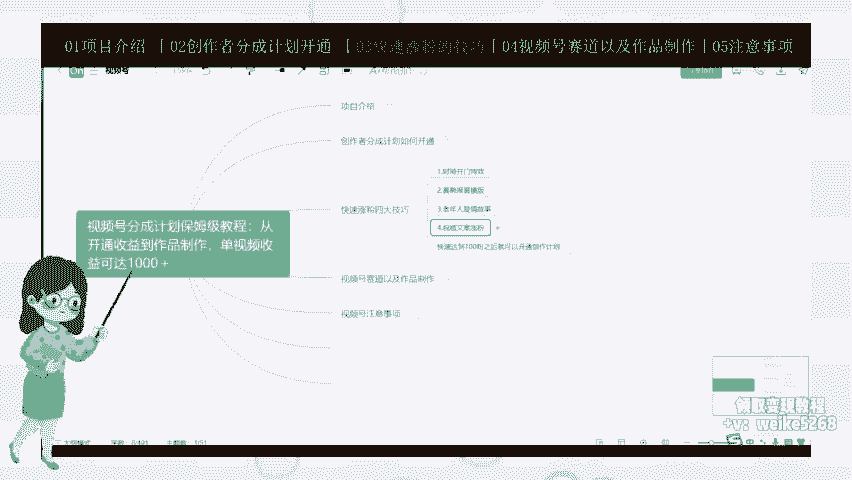

打开我们就就是在视频号找到这个视频啊，这个视频号里别面视频对吧？我们录屏的手机录屏的视频啊，我们把导也导到剪映里面啊。😡，然后简历呢我们森林音频好吧，森林音频我们只要它的声音啊。

我们只要这个呃视频号里面这个录这个视频的一个声音啊。😊，衣服只有一种人能点开这个视频。对吧其中只有一个人给我点家一个视频啊，那我们把这个视频给他给他说拉长一点吧，变速吧，给大家弄慢一点吧，好吧。

弄慢一点啊嗯。😊，就跟他这个音频对齐啊，对频。听说只有一种人。

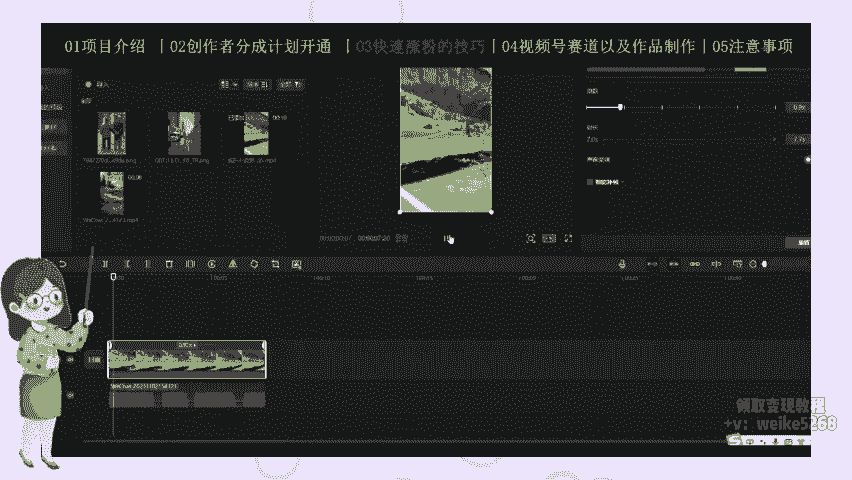

对吧这个是视频号里面的一个视频音频啊，我们把这个原视频那个给它静音啊，音频给它关掉，原视频的背景音也给它关掉。😡，我们下面怎么办呢？我们给这个给这个视频啊添加一些字幕啊。😊，他说这个。

拉满啊有拉满给这个视频下页字幕，把这个智能智能智能字幕点击开始识别啊。😡，一说只有一种人。啊，没。我们把这个字录的一个。你大一点啊，听说只有一种人来检开这个视频，对吧？我们把这个机础人能点开摄的视频。

😡，大会的人。那就是大富大贵的人啊。😡，还是一样，我们把这个。字动大一点啊。大鹏大个人。字好弄大眼哈。阿贵的人祝你今天发大财名。我们还是一样把这个字体弄大一点。海明数大。反正好事多少。

反正好事都找你对吧嗯。😊，反正好事都找你。结束嗯。结束了啊，然后我们看原视频。😡，原视频的话，他祝你儿女平安幸福。对吧？我们在上面这个也是添加一个字幕啊，添加一个文本啊，祝你儿女前安幸福。

我们再添加一个文本啊。😊，他说，祝理儿女，平安幸福。那我们就说啊。助理。全家幸福对吧？幸福安康嘛，随便写嘛，不全家幸福安康嘛，我们自己选这个新青年体啊，然后颜色选一个什么。😊，红色啊都可以。

祝你全家幸福安康，是不是啊，听说只有一种人。😊，的视频。里面也原那个图啊。明天中打奖，反正好事都找你。说只有一种对吧？好了，就非常简单，我们导出啊导出发布到视频号，生上文案文案的，我们参考同行们。

早上好，祝你全安，祝你全家幸福安康，对吧？祝你全家开开心心啊，就这样，就是一个文案随便写一的啊，祝福正能量嘛，艾特祝福正能量。😊，这个视频成本也是非常高的。😡，涨的非常快，很快。

我们发个两三天就能到100个粉了，非常简单。然后的话。😊，这四个案例我给大家解说完了啊，就是演示完了。其实这些视频做的非常简单啊，非常简单。然后的话我们粉丝打到100个之后，对吧？

我们就可以开通视频号计划了。这个官方啊，我们进入这个页面啊就满足条件了。我们直接点申请加入就可以了。然后我们就开通计划了，下一步我们发视频就可以获取一个收益啊。那么这节课就到这里啊。

其实这个我们发这几类视频，不管发哪一类视频啊，涨粉都是非常容易的发两三天立马就能涨10个粉丝，我们大家去一定要去操作好吧。好，那么下面来到我们这个视频号分神计划，保姆就教成了一个呃第四节课啊。

视频号的一些赛道，以及我们这些作品该如何一个制作。好吧，上节课我们说到了这个快速涨粉的自杀技巧啊，我们只要通过了发这些视频啊，涨到了100个粉丝，然后的话涨到100粉之后。

我们就可以开通这个啊视频者创作的分成计划了，按照我的方法来开通百分百可以开通，好吧，这是分100可以开通的啊。😊，然后下面的话我们开通计划之后，我们就要发作品啊，来那个录收益了。

那么我们可以做哪些哪一些赛道呢？第一个我们可以做搞笑视频啊，然后还可以做这个娱乐八卦，还有一些育儿经啊，然后一些情感语录，对吧？家庭那个婆媳关系之间的家庭关系这这些视频。😊，然后的话一些个新闻热点啊。

我们可以做这6个赛道。😊，当然了，拍一些其他赛道啊，可以自己去发掘好吧，这里我就不给大家仔细说了。那么我们这些作品应该如何制作的很简单，我以搞笑视频为例吧，其实这些这些视频做怎么做都一样。

我们就用到做一个混剪啊，做混剪，然后去做一个视频的驱虫，对吧？配些背景音乐，对不对？就很简单啊，呃只是做做法都一样，只是素材换了一下而已啊，做法都差不多了。好吧，就是我就不一个一个的演示了。

我就以一个这个搞笑视频为例，我给大家演示一下这些作品到底怎么去做。首先我们打开这个抖音啊，就是我电脑方便演示嘛，我们搜这个搞笑视频啊，我们搜。😊。

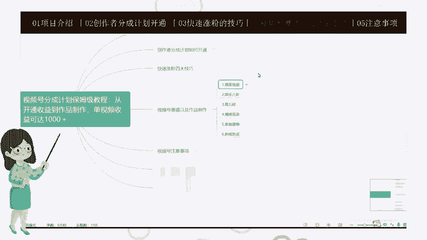

对吧我们搜度搞个视频，稍微等一下，网络网络有点慢。😊。

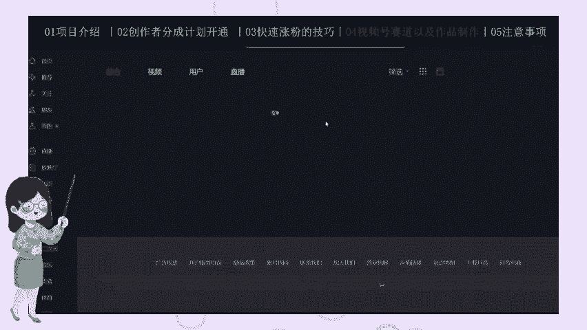

啊，还有这些。很多这种搞笑视频嘛，对吧？我们就是把这些视频大家下载下来，保存到自己手机或电脑上面。我为了给方便给大家演示啊，我就在电脑上面下载了。首先我们复制这个链接，对吧？复制这个链接。

我们打开这个呃视频号，这个不是这个这个全网视频下神器啊，我们直接点粘贴啊，然后。😊，然后他要给我们自动给我们下载，这里我就不给大家演示怎么下载了啊，这很简单哈，软件只要粘贴链接才会自动下载。

那么我要大家就是我提前下好了几个视频啊，几个搞笑视频，我们给大家做个缓解啊，那废话不多说，我开始做演示。好吧，那个电脑的话，我只是方便给大家做演示。如果大家就是说手机上面也可以下载去下载一个简映，对吧？

然后我们可以用到一个青抖青抖就在微信上的小程序上面搜这个青抖啊，我们直接复制那个抖音的这个链接嘛。抖音视频链接，在青图里面去去水印，下载这个视频就可以了。😊，然后的把我们弹指令。

我们把这个我们下载好的这些搞笑视频啊啊拖进来。😊。

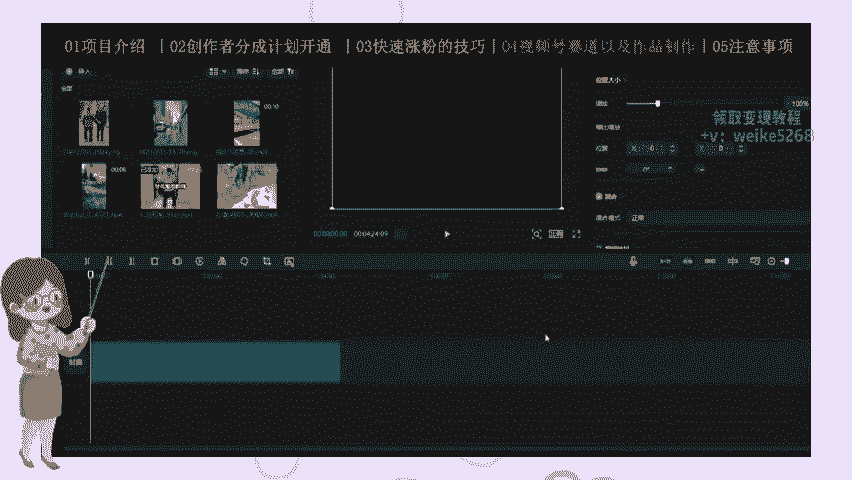

估计嗯，你下个三四个吧，你用三四个这个视频就可以了。😊，啊，一个一个拖进来啊，我们只要用其中的几个片段就可以，然后给大它出去打乱啊。😊，啊，视频不要太长啊，几十秒的就可以了。啊，那么接下来我们怎么做呢？

首先我们去分割一些片段啊，把不需要的片台给它删掉，我们比些好好看的好用的平段。我们把前面这个删掉我们比如说用这个交警啊，前面的不好不好给它删掉吧，你们看一下。😊，这个交点是到哪里了？它这个都是混解的。

也是混解。啊，我这里结束，我们再找多片段，我们那后面再找一个。嗯，好看点片段，那么这个环点就靠做就靠你们自己发挥了啊，你们认为好的现件都给留下来啊，都给留下来，好吧。😡，你用这个把不要的地方删除掉啊。

中间不要的地方删掉。😡，我们结束啊，这个地方这个在可以要的。我们就是自己感觉哪个片段好，我们就用哪个片段啊，反正都几个视频拼在一起的，搞这个视频嘛。😡，没用这个啊，中间这个也删掉好吧。

你留几个片亮就可以了。😊，这里啊结束。好吧，你们再找一个片段。有这个啊。你继去再找一个，后面呢可以不要，后面可以不要我们到下个视频里面去找。😡，几十秒就可以，随便找几个片段。😡，比如这里啊前面片段不要。

对吧？我们要中间这个片段。😊，这个根据你们自由发挥啊，我刚才说了，你们感觉哪个片段好，我们就用哪个片段啊，其他片段也可以不要，好吧。😡，然到这里这个品台啊，把这个平台叫。😊。

每个视频截录几个片段就可以了。第三个视频。😊，有这个片段啊，有这个片段，这个片就删掉。😊，我差不多了啊，43秒已经差不多了，你不充一分钟好吧，主要拉一个食堂那个玩包率嘛。😊，啊，9为他个现在。

还错这个片到这影经后面不么样了。等我们给这个直接拼断了个打伞，好吧啊，比如说这里到这里啊，这以到这里。😊，到这里，好吧。都可以啊。好啊，然后我们给这个视频啊，这个分割的地方，我们加点特效。

就是一个偏段到另一个片段之间啊，转场的地方我们加一些。😊，加一些素材啊。呃，加搞笑的一些素材，比如这个。😊，检验里面都有。你说一下。然后这里啊再加一些这个这种的搞笑的一些。😊，对吧。找给变速一下。

然后端上这里再加一个啊加一个什么。是吧这个吗？这太长了，你没行啊。对吧也是搞笑的一些转场素材啊，简影面直接有你们接用就可以了。然后这里的话我们用那个这个啊比如说这个。😊，是吧。加上去啊，给它变速。

然后这里再用一个用一个什么呢？这个也可以啊。都是一些搞笑的一些短场嘛。😡，对吧这个也可以用，是不是呃，两个变速。😊，能1点1好。就再用一个啊。对个。对吧然后他这个视频这个素材太长了，我们的变速好吧。

那是1。2。😡，嗯，这也这样。后面都可以不要。到这里话，我们再用一个，最后的话用一个啊。😊，然后。几点的。这吧这个搞到最后吧。转场这个用这里最后应用转场嘛吧。对吧。变速啊。后面的就不要了。你看效果。啊。

这样效果就很更好。然后我们给这个视频做一下驱虫，好吧。😡，新建复合片段啊新建复合片段。😊，然后我们用到一个驱床特效啊，然后。嗯。这个素材啊我们用到这个素材啊。比这个啊给它拖拖拖拖。给他。

充满啊充满多余的地方删掉，好吧。😊，这个是我们要做的的一个素材啊，这个也会在视频分享里出来。😊，混合模式选择绿色啊绿色。然后不透明度给它稍微给它降低一点啊，摸一过现在感觉就可以了。😡。

然后我们再添加一个素材啊。其实这个素材你不一定非要非要用我这个的，我们可以用自己的图片或自己拍个视频也可以用啊，素材都可以用的啊，自己拍的图片也可以用来当那个防判单运的这个素材啊。😡，啊，多为1删掉啊。

啊，我们可以给他这个。扫光给他嗯。什么比例你的变成成么43。是吧也的全部盖住嘛，是吧，然后给它也是一样啊，混合模式选择那个绿色啊，绿色，然后不透明度给它搞到50%55%。

稍微有点一闪一闪的感觉就可以了啊。😊，对吧有一种有一种这种。😊，啊，一闪一闪的感觉就可以。如果一个现在感觉就可以了。然后我们再添一个素材吧。😊，嗯，对嗯。你选化特效是吧？其实这个特效我刚刚说了啊。

不一定都有我这个的，我你们自己拍个视频也可以，或者用别的视频做做这个做这个驱虫也可以啊。😡，我给它变速啊。我定成多余地方给删掉啊，多余地按成掉，好吧。哎，一样给这个视频一个拉满拉满嗯，然后。😊。

不透明度给它啊。混的模式选绿色好吧，绿色。我们可以先先给这个。等一下这个不用绿色吗。正常啊，我们给他这个视频我们给它。翻转给它反转一下嗯。这个。旋转对吧？我们可以变成这样。这样也可以啊。

然后混合模式选择一个绿色啊，然后不透明度的话稍微降低一点啊，2个33啊，有点问优现的感觉就可以。😊，啊，这样O可以了。这个视频就做宣成了，差不多做完了。然后我们添加添加一下这个滤镜吧，好吧，加一些滤镜。

滤镜加个什么怎么加一个滤镜啊。😊，嗯，清楚吧。语境基础啊么清晰呀。是吧。然后加一些特效啊。画面特效啊，然后。嗯，基础嗯。那门都可以啊，只能加些特效了，好吧。这也可加是吧？不透明度。强度给它占低点。对吧。

这样就可以啊。然后我们加一贴纸，加一贴纸，加一些贴纸，也达到一个驱虫的一个效果。😡，啊嗯随便加一个什么？这里加一个对吧？这你加一个啊。带什么。清醒啊。966啊，对不对嗯。没人打到我。

然后我们再再加一些特效，随便的加一些贴纸，随便的加一些贴纸，主要打到一个去虫的一个效果啊，再加一些贴纸。😡，比如说加个这个什么，随便加一下来吧，啊什么事人走路啊。我加这个人走路对吧？啊，我们跳到这里。

那这个稍微用小一点啊。好，这样就可以了啊。😊，对吧然后我们把这个视频啊直接导出，导出来之后，我们发布到视频号就可以了。这个怎么发布就不教大家了啊，这个发布应该大家会发吧。😡。

然后的话这节课大概就到这里啊，其实这些视频啊不管是搞笑视频还是娱乐八卦还是育儿金啊，还是这个情感语录，对吧？还有加期保习新热点操作起来剪辑步骤都一样啊。我们就是把很多视频别的视频拿过来做混点。

然后去去虫，达到一个去虫的一个效果，进行二次创作，对吧？然后我们发布到视频号就可以了啊，发布出去视频量跑起来，我们就有一个收益了，我们就拿到一个收益了好吧，下面画了这个视频号分配计划。

保满造成的最后一节课啊，视频号的一个注意事项。上节课我们出过了说到了视频号要做一及赛道以及作品的制作啊。大家刚才仔细看一下，好吧，然后的话这节课我们说一下注意事项。😡，首先啊我们一定要注意啊。

同一个视频我们不能发几次啊，你我们不能像其他平台一样，一个视频，感觉这个视频流量好了，对吧？我们再发一次不行了，再发一次的话，视频号的话会直接派你搬运的，好吧。😡，然后第二个我们不能互粉。

我们千万不要去偷懒啊，我们的视频的粉丝一定要通过发视频来的自然粉丝啊，自己关注的，我们不能去让人家互粉啊，发到亲戚朋友，让人家给你点关注啊。这个不行的，这个粉丝是无效的，而且对你的创作者分争计划开通。

也会造成很大的阻碍。好吧。然后第二个这个创作者分计划开通后啊，就比如说我们发这种视频对吧？发新粉视频啊，开通了这个创作者分成计划了，是吧？开通的第一时间，我们一定要删除我们之前发的所有视频，好吧。

一定要删除啊，一定要把之前发的视频删除掉。还有一个就是说我们没开通创作者分争计划之前，我们发的任何作品，我们不管是发啊，这个花花草草自己拍这个视频还是去发这种涨粉的这种视频啊。

我们都不可以什么都不可以去点原创视频啊，这样这样好吧，我发视频之前千万不能点原创视频好吧，没开通之前啊，千万不能点原视频，我们点原创视频之后，可能有一天就不给我就永远开通不了创作者分城计划了，好吧。

千万不要去点好吧？没开通创作者分成计划之前，千万不要不要去点这个原创视频啊，重要的视频说三遍，千万不要点好吧。😡，那么车上面的注意事项就说到这里啊，其实就就就这几点，大家注意仔细听啊，一定要注意好吧。

特别是这个千万不能点，好吧。😡。

