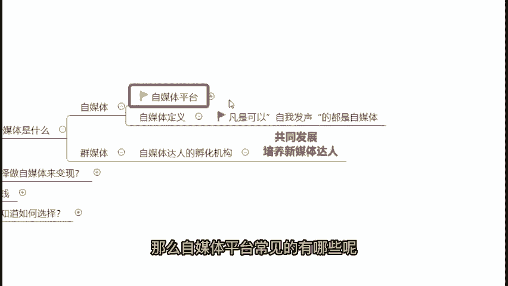

# 视频号创作分成计划保姆级教程，从开通收益到制作原创，打造月入10w的自媒体账号！！ - P2：1.认识自媒体 - 睿智实堪宗 - BV1us1kYdEnS

那么今天的上课方式，我们会采用理论知识加上实操操作以及案例分分析的方式来跟大家分享。那么今天呢我的一个课件，我分了4个内容板块来跟大家去进行分享。首先我们既然要做自媒体，就先要对自媒体有个认识。

自媒体它到底是什么？我们又为什么要来做自媒体。那么第二部分的话，我会教大家啊从零基础开始怎么样去做一个操作，该怎么样去上手。然后再来第三个啊，我会教大家如何去做到一个收益进阶。因为要做到收益进阶化。

其实我们就要去做到一个高阶的原创，要先做原创，你才能够获得一个更好的收益。包括以及我会跟大家分享，你想要做好自媒体的话，就需要了解到的一些技巧。好，那么这个是今天我们的一个啊课程的一个大纲的一个介绍。

那么在课堂开始之前，由于我之前其实也是一直有在做学员的教导的。那么在教导学员的过程中，我也会发现，很多的自媒体新。😊，小白啊，他都会有的一些疑问。那么呢我把他们做了一些总结来。

我看一下大家是否也有这些方面的一些疑问。好，那么在这边呢我总结了一些之前过往啊，我教导学员的过程中，我发现他们普遍会有的一些疑问。那么在这里呢我做了一个总结啊，如果说你是所有问题都想了解的同学们。

你打个零，在公屏上给我看一下。如果说你是有想要具体了解的啊。那么你打个具体的一个问题，在公屏上，我看一下，那么我看看今天讲解的一个内容呢，主要是从哪一个方向去出发。

或者说有没有同学特别想要关注里面某一个具体问题的，你把这个具体问题的序号打出来。如果说全都想了解的，你打个零在公屏上，我看一下，看看今天的课堂啊主要啊倾向于咱们的哪一个啊环节会讲解的比较多一些。

那么我看到零跟三跟6啊，都是比较多的。那么最多人打的呢都是0。好，那么看来其实大家主要都是想要啊了解到所有相关的一些问题的。好，那么由于照顾到大部分同学的话，我就先。😊，主要的啊从这里面开始讲起。

那么呢在356里面呢，我会着重的去跟大家讲一讲相关的一些内容。好吧。好，那么在这边的话呢啊我的把这个疑问啊先关掉。那么今天现在我们即将正式开始我们今天的一个课程啊。

我的一个课程总时长大约会在90分钟左右啊，90分钟。好，那么现在我们即将开始我们的一个课堂，好，首先第一个既然我们是要来学习新媒体的。首先第一部分，我们就要先来去认识它，对吧？

那么其实新媒体它现在到底是什么呢？其实新媒体它里面包括了两个部分，一个是群媒体，一个是自媒体，自媒体大家应该都有在听，都有在做。但是群媒体可能大家听的了解的比较少一些，群媒体它其实是什么呢？

是属于一个自媒体达人的一个孵化机构。😊，好，那么在这边的话呢，也是是我们所俗称的1个MCM机构。包括你比如说像我们看到的李佳琦、罗永浩、薇娅等等，所有的这些人，他都是属于我们的一个MCM机构。

你比如说像李佳琦，他就是上海美万公司的对吧？好，那么其实我们现在在做的事情以及啊这些MCM机构在做的事情是相似的。我们是希望可以去发现发展培养我们的一个新媒体达人，做到一个共同的发展，共同的进步。

那么再来啊简单的跟大家讲讲自媒体自媒体其实是什么呢？首先来解一个简单的定义。凡是可以自我发声的，都可以称之为自媒体，这个发声，当然不是说啊唱歌的那个发生。

而是说只要你在这个平台上面可以把你的想法内容所见所闻，在平台上面传播出去的，都可以称之为自媒体。那么自媒体平台常见的有哪些呢啊有非常多，对不对？

我在这里呢简单的罗列一些常见的自媒体平台来给大家看一下啊包。😊。

会有到像这个微信公众号啊、大约号、抖音、快手、小红书等等，这些都是我们常见的自媒体平台。😊。