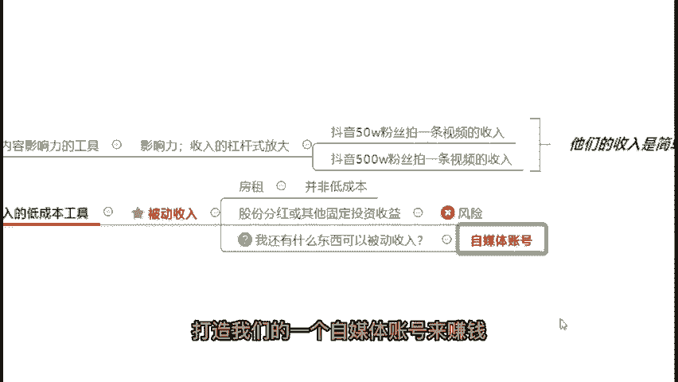

# 视频号创作分成计划保姆级教程，从开通收益到制作原创，打造月入10w的自媒体账号！！ - P3：2.为什么选择自媒体变现 - 睿智实堪宗 - BV1us1kYdEnS

那么其实大家可以想一个问题，就是包括在座的各位也好，我们的一个明星达人也好，网红也好，为什么现在越来越多的人，他选择做自媒体来变现，而不是选择做电商，选择做创业，而是选择做自媒体呢，答案很简单。

自媒体是现在最适合普通大众快速创造副业收入的最好的办法啊，为什么这么说呢？首先第一个自媒体是我们普通人唯一可以快速放大内容影响力的工具。并且你在上面所产生的内容影响力，跟你的收入是可以成杠杆式的放大的。

这个呢啊我举个例子，大家看一下，我觉得应该很好理解，就是你比如说抖音50万粉丝的网红，他们拍一条视频能够获得的收入，以及抖音500万粉丝的网红，他们拍一条视频可以获得的收入。

你觉得他们的粉丝数量差了10倍。😊，但是他们的收入会是简单的，只是乘以10吗？肯定不是。如果说大家有去看新图报价的话，应该都会知道哈。

抖音50万粉丝网红的一个新图报价大概会是在两三万到10万块钱不等左右的一个价格。那么抖音500万粉丝的网红，他们的新图报价基本上最低也是在100万左右。那么高的话呢，去到五六百万也是有的啊。

所以说大家可以看到你的这个影响力，你这个粉丝数虽然只是差了10倍。但是实际上他们的收入差了不是简单的10倍，而是上百倍，甚至500倍，600倍都有啊。那么抖音新图报价不知道的，可以去搜一下哈。

就不要在公屏上面继续问了啊，不知道的，可以去搜索一下就行了啊，就是一个我们的一个达人们，他去这个赚取广告啊的一个核心的一个渠道。那么再来为什么我去说自媒。😊。

体是现在我们最适合普通大众快速创造副业收入最好的办法呢。因为其实自媒体是现在我们唯一可以产生被动收入的低成本工具。那么这个的话，我刚刚看到公应上也有就是在上海的朋友们，对吧？

那么在上海的朋友们应该都很清楚了，现阶段来说，首先我们获取被动收入的方法其实就很少。我们来看一下，一般来说我们获取被动收入的方法有哪些呢？首先第一个房租，那么其实我相信在座的不是交租的就是收租的。

对不对？但是你说房租它是普通人能够获取被动收入的低成本方法吗？绝对不是对吧？首先第一个他不是低成本的第二个不是每个人都有一套闲置的房子，可以获取这个被动收入的。

那么再来一般人可以获取被动收入的方法还有什么？啊，股份分红或。😊，其他的固定投资收益对吧？好，那么在这里的话啊，若果说在座的有炒股的或者是炒外汇的，或者说是炒基金的，应该都深有体会。

就是最近我们的一个基金，包括我们的股市大盘，是上上下下来来回回的对吧？所以说我们的这个固定投资收益，这个方式，它是伴随着非常高的一个风险的。你根本不知道什么时候你扔进股市的10万块钱。

现在又变成了多少钱了，对吧？好，那么再来我们还有什么东西，可以去获得这一份被动收入呢。当案很简单，就是可以通过打造我们的一个自媒体账号来赚钱。😊。

