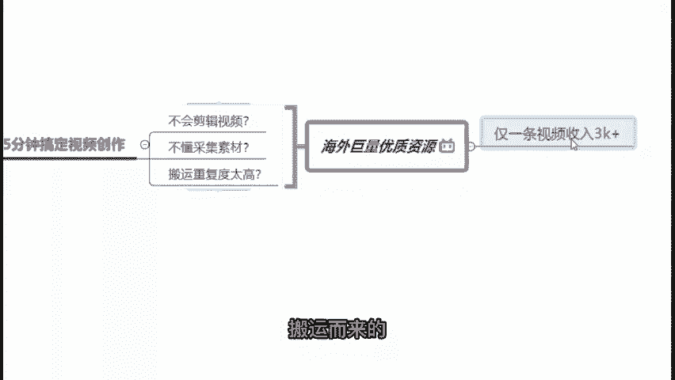

# 视频号创作分成计划保姆级教程，从开通收益到制作原创，打造月入10w的自媒体账号！！ - P5：4.如何选择平台 - 睿智实堪宗 - BV1us1kYdEnS

那么再来啊，现在我们也知道自媒体的平台是特别多的。那么我们该怎么样去选择去做呢？首先第一个啊，我来跟你们说一个结论，就是我建议大家但凡是新手上路的，你先做小平台再做大平台啊。

当然你要说一开始做大平台也不是不行，只是起步嘛，你可能艰难了一点点，所以说我建议大家先做小平台再做大平台，为什么呢？前期的话我建议大家先选择小平台练习技巧收获思路。

就好像比如说今天你刚刚下载了一个王者荣耀准备去打。但是实际上你刚开始的时候，你是不知道你打上单合适，还是打中单合适，还是打法师合适的，对不对？所以说你可以先选择一个小平台去练习，等你后期知道哦。

原来我打上单比较牛逼的时候，那么我就可以在后期我选择分发一个大平台，我知道自己擅长什么。😊，我可以在后期去选择大平台去做一个一文多发，提高收益。好，那么在前面的时候啊，我们新手的时候，小平台有哪些呢？

啊？我刚刚也跟大家说了，新手攒经验，攒技能，先选择小平台去做小平台有哪些，我列举了一些给大家看一下啊，包括你比如说像趣头条、会头条快船号、搜狐号等等这一些都属于我们的一个小平台。

那么小平台很明显它的缺点是什么？单价不高，基本上是5到15块钱的。而且它在它上面的一个日活跃用户是相对比较少的。那么小平台的优点是什么呢？你可以在上面做伪原创，做搬运啊，都可以。这样的话呢。

你是没有任何新手期的，你完全可以很自由的去探索你到底适合做哪些方面，做哪一个领域啊。但是基于说你做搬运，做伪原创没有任何问题的话，你在上面没有任何新手期。😊，你只要坚持去发视频，发内容的话。

基本上月入2000到4000啊，我认为是一个比较简单的事情，它不难都比较容易能够做到。那么零基础零粉丝的朋友们，我们应该怎么样去上手去操作呢？其实啊啊我认为啊是很简单的。

在这边我先教大家去做一个伪原创去做一个搬运，直接教你5分钟搞定视频创作。因为如果说你现在啊不会做一个视频的采集，也不知道该怎么样去做一个素材的采集的话，又或者说你觉得在国内搬运的重复度太高的话。

那么其实我认为大家不妨去看一下海外的巨量的一个优质资源，来去看一看，把目光放长远一点。那么在这里我找了一个B站的一个视频给大家先看一下。😊。

Home to some seriously dangerous animals。🎼There's definitely a big cat around here I get off to a great start。

😊，🎼飞。And we glorious food， but my。来，大家可以看到这个是在B站上面啊，我们的一个荒岛求生的一个视频。那么很明显它是属于一个海外的一个综艺搬运到了我们的一个国内，对不对？

很明显，因为你可以很清楚的看到这个视频它是没有经过什么很多的一个剪辑的，然后它就是我们的一个原视频画面，原视频原声。我它唯一的不同，搬运到我们的一个国内之后，它唯一做的改变就是添加上了什么？

我们的一个中文字幕，对吧？唯一的不同就是加了一个字幕而已。但是大家可以看到我们在B站上面有多少播放量，你看得到吗？232。9万的一个播放量，好，我们来算一下232。9万是多少钱这一条视频。😊，232。

9乘B站的单价大约是15块钱。那么我们可以计算得出啊，这一条视频搬运到了我们国内的哔哩哔哩网站上面之后，它所能够获取到的收益大约是3490块钱的一个收益。

那么其实你可以发现仅仅啊它不需要做一个视频的一个啊剪辑，也没有说一个很复杂的一个采集素材。然后呢，它也是从海外的一个原生原话啊，搬运而来的。但是就这样一条视频就能够收入3000多块钱。😊。

