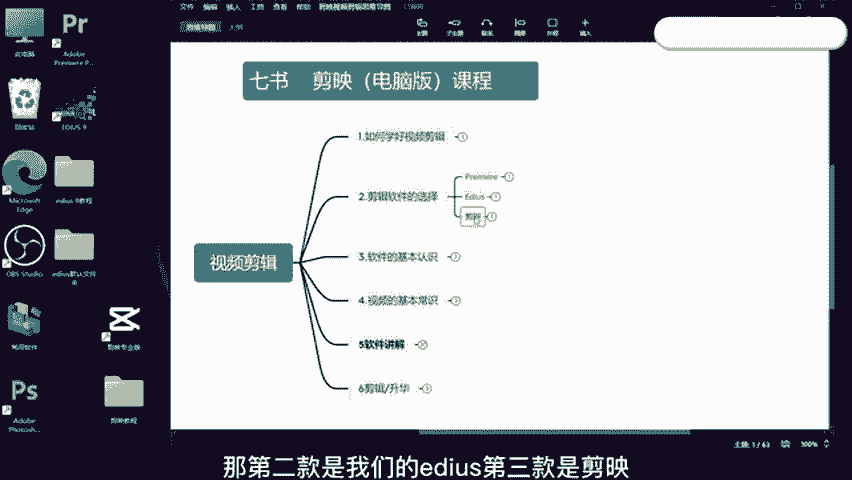
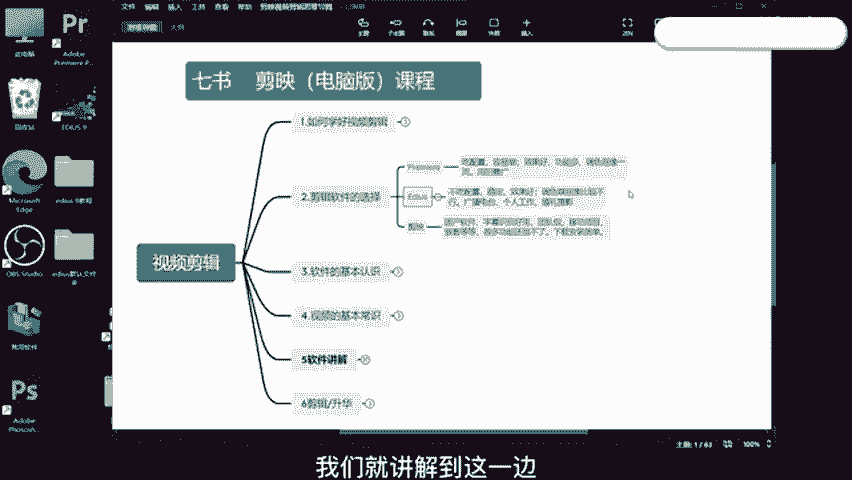

# 视频号创作分成计划保姆级教程，从开通收益到制作原创，打造月入10w的自媒体账号！！多元变现方式实操讲解 - P13：如何选择剪辑软件 - 坐在旗杆看极光 - BV1GH1yYiECy

大家好，我是七叔。那这一节课我们来讲一下如何选择一款适合自己的软件。那我这边呢列出了三款市面上也是我比较常用的剪辑软件。那第一款是我们的PR也就是prome那第二款是我们的ed。第三款是剪映。

那第一款PR这个不用介绍，其实很多人多知道，也是目前上市面上用的最广的专业视频剪辑软件。如果说我们要去找工作，还是说要做一些专业一点的视频，那么我们就选择PR不会错，但它的缺点也很明显。

就是吃配置很容易崩哈。如果说我们剪辑一个两个三五个视频没问题。但如果说你要同时剪辑上百个视频的话，那我们就选择用ed哈。那PR它的效果也是很好，功能多，功能很细哈。那调色跟抠像是非常好的。

包括声音的处理啊。但是。

他对这个新手并不是那么友好哈。如果说新手想要学习我们这个PR，还是要下一番功夫。那第二款是一式。那一式呢，它是不吃配置，非常稳定的一款视频剪辑软件哈，这个也是我之前在电视台专用的一个视频剪辑软件。

它对于调色跟抠像不是非常好。如果说我们只是说要做最基本的调色的话，那么它能够满足哈。那我现在都是用它来做一些像是微客啊，精品课啊，以及做一些批量剪辑的时候哈，它那后就会选择用一式，它同时剪辑上百个视频。

中间还会互相的进行调用，它也不会出错。如果说我们需要做一些微课，做一些婚礼摄影，做一些个人工作，那我们可以选择一式，要去找工作，要做专业的视频，我们可以选择PR那第三款剪映呢。

它是国产软件里面有很多功能是非常的人性化。他把我们这个做视频的剪辑的个门槛呢给拉低的哈。那很多小白通过简单的学习，比如说学的我们这套课程，他也能够做出非常专业的视频，这个就是我们的剪映。

如果说你只是说个人玩一玩啦，然后没有说做的非常专业，那么我们就直接选择这个剪映就可以的哈。这个是我们三个视频剪辑软件。那前面这两个我也有出了对应的教程，在我新开的一个淘宝店铺108课程里面哈。

如果说你们有需要的话，可以去看一下。好，那第二节课关于软件的选择呢，我们就讲解到这一边。

